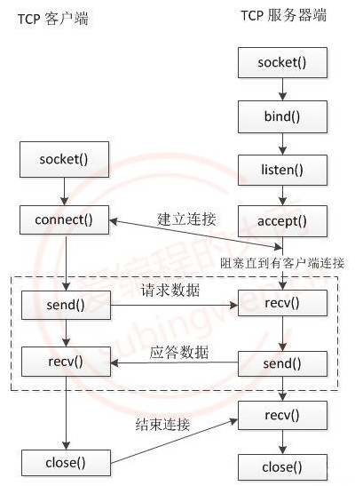

# C++Socket
学习资料：https://subingwen.cn/linux/socket/

## socket编程
Socket套接字由远景研究规划局（Advanced Research Projects Agency, ARPA）资助加里福尼亚大学伯克利分校的一个研究组研发。其目的是将TCP/IP协议相关软件移植到UNIX类系统中。设计者开发了一个接口，以便应用程序能简单地调用该接口通信。这个接口不断完善，最终形成了Socket套接字。Linux系统采用了Socket套接字，因此，Socket接口就被广泛使用，到现在已经成为事实上的标准。与套接字相关的函数被包含在头文件sys/socket.h中。

通过上面的描述可以得知，套接字对应程序猿来说就是一套网络通信的接口，使用这套接口就可以完成网络通信。网络通信的主体主要分为两部分：**客户端和服务器端**。在客户端和服务器通信的时候需要频繁提到三个概念：**IP、端口、通信数据**

## 字节序

字节序，顾名思义字节的顺序，就是大于一个字节类型的数据在内存中的存放顺序，也就是说对于单字符来说是没有字节序问题的，字符串是单字符的集合，因此字符串也没有字节序问题。

大端与小端


Little-Endian -> 主机字节序 (小端)
- 数据的 低位字节 存储到内存的 低地址位, 数据的 高位字节 存储到内存的 高地址位
- 我们使用的PC机，数据的存储默认使用的是小端

Big-Endian -> 网络字节序 (大端)
- 数据的 低位字节 存储到内存的 高地址位, 数据的 高位字节 存储到内存的 低地址位
- 套接字通信过程中操作的数据都是大端存储的，包括：接收/发送的数据、IP地址、端口。


函数：

BSD Socket提供了封装好的转换接口，方便程序员使用。包括从主机字节序到网络字节序的转换函数：htons、htonl；从网络字节序到主机字节序的转换函数：ntohs、ntohl。

```cpp
#include <arpa/inet.h>
// u:unsigned
// 16: 16位, 32:32位
// h: host, 主机字节序
// n: net, 网络字节序
// s: short
// l: int

// 这套api主要用于 网络通信过程中 IP 和 端口 的 转换
// 将一个短整形从主机字节序 -> 网络字节序
uint16_t htons(uint16_t hostshort);	
// 将一个整形从主机字节序 -> 网络字节序
uint32_t htonl(uint32_t hostlong);	

// 将一个短整形从网络字节序 -> 主机字节序
uint16_t ntohs(uint16_t netshort)
// 将一个整形从网络字节序 -> 主机字节序
uint32_t ntohl(uint32_t netlong);
```

## IP地址转换
虽然IP地址本质是一个整形数，但是在使用的过程中都是通过一个字符串来描述，下面的函数描述了如何将一个字符串类型的IP地址进行大小端转换：

```cpp
// 主机字节序的IP地址转换为网络字节序
// 主机字节序的IP地址是字符串, 网络字节序IP地址是整形
int inet_pton(int af, const char *src, void *dst); 

af: 地址族(IP地址的家族包括ipv4和ipv6)协议
    AF_INET: ipv4格式的ip地址
    AF_INET6: ipv6格式的ip地址
src: 传入参数, 对应要转换的点分十进制的ip地址: 192.168.1.100
dst: 传出参数, 函数调用完成, 转换得到的大端整形IP被写入到这块内存中
返回值：成功返回1，失败返回0或者-1


#include <arpa/inet.h>
// 将大端的整形数, 转换为小端的点分十进制的IP地址        
const char *inet_ntop(int af, const void *src, char *dst, socklen_t size);

af: 地址族协议
    AF_INET: ipv4格式的ip地址
    AF_INET6: ipv6格式的ip地址
src: 传入参数, 这个指针指向的内存中存储了大端的整形IP地址
dst: 传出参数, 存储转换得到的小端的点分十进制的IP地址
size: 修饰dst参数的, 标记dst指向的内存中最多可以存储多少个字节
返回值:成功: 指针指向第三个参数对应的内存地址, 通过返回值也可以直接取出转换得到的IP字符串,失败: NULL
```
```cpp
还有一组函数也能进程IP地址大小端的转换，但是只能处理ipv4的ip地址（但是一般IPV4用的多一些）：
// 点分十进制IP -> 大端整形
in_addr_t inet_addr (const char *cp);

// 大端整形 -> 点分十进制IP
char* inet_ntoa(struct in_addr in);
```

## sockaddr 数据结构


```cpp
// 在写数据的时候不好用
struct sockaddr {
	sa_family_t sa_family;       // 地址族协议, ipv4
	char        sa_data[14];     // 端口(2字节) + IP地址(4字节) + 填充(8字节)
}

typedef unsigned short  uint16_t;
typedef unsigned int    uint32_t;
typedef uint16_t in_port_t;
typedef uint32_t in_addr_t;
typedef unsigned short int sa_family_t;
#define __SOCKADDR_COMMON_SIZE (sizeof (unsigned short int))

struct in_addr
{
    in_addr_t s_addr;
};  

// sizeof(struct sockaddr) == sizeof(struct sockaddr_in)
struct sockaddr_in
{
    sa_family_t sin_family;		/* 地址族协议: AF_INET */
    in_port_t sin_port;         /* 端口, 2字节-> 大端  */
    struct in_addr sin_addr;    /* IP地址, 4字节 -> 大端  */
    /* 填充 8字节 */
    unsigned char sin_zero[sizeof (struct sockaddr) - sizeof(sin_family) -
               sizeof (in_port_t) - sizeof (struct in_addr)];
};  
```

## 套接字函数 socket
使用套接字通信函数需要包含头文件<arpa/inet.h>，包含了这个头文件<sys/socket.h>就不用在包含了。

### 创建套接字
```cpp
// 创建一个套接字
int socket(int domain, int type, int protocol);

参数：
domain: 使用的地址族协议
    AF_INET: 使用IPv4格式的ip地址
    AF_INET6: 使用IPv6格式的ip地址
type:
    SOCK_STREAM: 使用流式的传输协议
    SOCK_DGRAM: 使用报式(报文)的传输协议
protocol: 一般写0即可, 使用默认的协议
    SOCK_STREAM: 流式传输默认使用的是tcp
    SOCK_DGRAM: 报式传输默认使用的udp

返回值：
成功: 可用于套接字通信的文件描述符，失败返回-1
```

函数的返回值是一个文件描述符，通过这个文件描述符可以操作内核中的某一块内存，网络通信是基于这个文件描述符来完成的。

### 将文件描述符和本地的IP与端口进行绑定   
```cpp
// 将文件描述符和本地的IP与端口进行绑定   
int bind(int sockfd, const struct sockaddr *addr, socklen_t addrlen);
参数：
    sockfd: 监听的文件描述符, 通过socket()调用得到的返回值
    addr: 传入参数, 要绑定的IP和端口信息需要初始化到这个结构体中，IP和端口要转换为网络字节序
    addrlen: 参数addr指向的内存大小, sizeof(struct sockaddr)
返回值：成功返回0，失败返回-1
```

### 给监听的套接字设置监听
```cpp
// 给监听的套接字设置监听
int listen(int sockfd, int backlog);
参数：
    sockfd: 文件描述符, 可以通过调用socket()得到，在监听之前必须要绑定 bind()
    backlog: 同时能处理的最大连接要求，最大值为128
返回值：
    函数调用成功返回0，调用失败返回 -1
```

### 等待并接受客户端的连接请求, 建立新的连接, 会得到一个新的文件描述符(通信的)
```cpp
// 等待并接受客户端的连接请求, 建立新的连接, 会得到一个新的文件描述符(通信的)		
int accept(int sockfd, struct sockaddr *addr, socklen_t *addrlen);
参数：
    sockfd: 监听的文件描述符
    addr: 传出参数, 里边存储了建立连接的客户端的地址信息
    addrlen: 传入传出参数，用于存储addr指向的内存大小
返回值：函数调用成功，得到一个文件描述符, 用于和建立连接的这个客户端通信，调用失败返回 -1
```

这个函数是一个阻塞函数，当没有新的客户端连接请求的时候，该函数阻塞；当检测到有新的客户端连接请求时，阻塞解除，新连接就建立了，得到的返回值也是一个文件描述符，基于这个文件描述符就可以和客户端通信了。

### 接收数据
```cpp
// 接收数据
ssize_t read(int sockfd, void *buf, size_t size);
ssize_t recv(int sockfd, void *buf, size_t size, int flags);
参数:
    sockfd: 用于通信的文件描述符, accept() 函数的返回值
    buf: 指向一块有效内存, 用于存储接收是数据
    size: 参数buf指向的内存的容量
    flags: 特殊的属性, 一般不使用, 指定为 0
返回值:
    大于0：实际接收的字节数
    等于0：对方断开了连接
    -1：接收数据失败了
```

如果连接没有断开，接收端接收不到数据，接收数据的函数会阻塞等待数据到达，数据到达后函数解除阻塞，开始接收数据，当发送端断开连接，接收端无法接收到任何数据，但是这时候就不会阻塞了，函数直接返回0。

### 发送数据的函数
```cpp
// 发送数据的函数
ssize_t write(int fd, const void *buf, size_t len);
ssize_t send(int fd, const void *buf, size_t len, int flags);
参数:
    fd: 通信的文件描述符, accept() 函数的返回值
    buf: 传入参数, 要发送的字符串
    len: 要发送的字符串的长度
    flags: 特殊的属性, 一般不使用, 指定为 0
返回值：
    大于0：实际发送的字节数，和参数len是相等的
    -1：发送数据失败了
```

### 客户端申请连接

```cpp
// 成功连接服务器之后, 客户端会自动随机绑定一个端口
// 服务器端调用accept()的函数, 第二个参数存储的就是客户端的IP和端口信息
int connect(int sockfd, const struct sockaddr *addr, socklen_t addrlen);
参数:
    sockfd: 通信的文件描述符, 通过调用socket()函数就得到了
    addr: 存储了要连接的服务器端的地址信息: iP 和 端口，这个IP和端口也需要转换为大端然后再赋值
    addrlen: addr指针指向的内存的大小 sizeof(struct sockaddr)
返回值：连接成功返回0，连接失败返回-1
```

## TCP通信流程

TCP是一个面向连接的，安全的，流式传输协议，这个协议是一个传输层协议。
- 面向连接：是一个双向连接，通过三次握手完成，断开连接需要通过四次挥手完成。
- 安全：tcp通信过程中，会对发送的每一数据包都会进行校验, 如果发现数据丢失, 会自动重传
- 流式传输：发送端和接收端处理数据的速度，数据的量都可以不一致



### 服务端：
```cpp
//1.创建用于监听的套接字, 这个套接字是一个文件描述符
int lfd = socket();
//2.将得到的监听的文件描述符和本地的IP 端口进行绑定
bind();
//3.设置监听(成功之后开始监听, 监听的是客户端的连接)
listen();
//4.等待并接受客户端的连接请求, 建立新的连接, 会得到一个新的文件描述符(通信的)，没有新连接请求就阻塞
int cfd = accept();
//5.通信，读写操作默认都是阻塞的
// 接收数据
read(); / recv();
// 发送数据
write(); / send();
//6.断开连接, 关闭套接字
close();
```

在tcp的服务器端, 有两类文件描述符

监听的文件描述符 
- 只需要有一个
- 不负责和客户端通信, 负责检测客户端的连接请求, 检测到之后调用accept就可以建立新的连接

通信的文件描述符
- 负责和建立连接的客户端通信
- 如果有N个客户端和服务器建立了新的连接, 通信的文件描述符就有N个，每个客户端和服务器都对应一个通信的文件描述符


文件描述符对应的内存结构：

- 一个文件文件描述符对应两块内存, 一块内存是读缓冲区, 一块内存是写缓冲区
- 读数据: 通过文件描述符将内存中的数据读出, 这块内存称之为读缓冲区
- 写数据: 通过文件描述符将数据写入到某块内存中, 这块内存称之为写缓冲区

监听的文件描述符:

- 客户端的连接请求会发送到服务器端监听的文件描述符的读缓冲区中
- 读缓冲区中有数据, 说明有新的客户端连接
- 调用accept()函数, 这个函数会检测监听文件描述符的读缓冲区
  - 检测不到数据, 该函数阻塞
  - 如果检测到数据, 解除阻塞, 新的连接建立

通信的文件描述符:

- 客户端和服务器端都有通信的文件描述符
- 发送数据：调用函数 write() / send()，数据进入到内核中
  - 数据并没有被发送出去, 而是将数据写入到了通信的文件描述符对应的写缓冲区中
  - 内核检测到通信的文件描述符写缓冲区中有数据, 内核会将数据发送到网络中
- 接收数据: 调用的函数 read() / recv(), 从内核读数据
  - 数据如何进入到内核程序猿不需要处理, 数据进入到通信的文件描述符的读缓冲区中
  - 数据进入到内核, 必须使用通信的文件描述符, 将数据从读缓冲区中读出即可

### 客户端
在单线程的情况下客户端通信的文件描述符有一个, 没有监听的文件描述符

```cpp
//1.创建一个通信的套接字
int cfd = socket();
//2.连接服务器, 需要知道服务器绑定的IP和端口
connect();
//3.通信
// 接收数据
read(); / recv();
// 发送数据
write(); / send();
//4.断开连接, 关闭文件描述符(套接字)
close();
```

## UDP通信流程


这里就不过多介绍了，基本流程可以仿照上一节之中的TCP


## 扩展阅读
在Window中也提供了套接字通信的API，这些API函数与Linux平台的API函数几乎相同，以至于很多人认为套接字通信的API函数库只有一套，下面来看一下这些Windows平台的套接字函数：


### 初始化套接字环境
使用Windows中的套接字函数需要额外包含对应的头文件以及加载响应的动态库：

```cpp
// 使用包含的头文件 
include <winsock2.h>
// 使用的套接字库 
ws2_32.dll       
```

在Windows中使用套接字需要先加载套接字库（套接字环境），最后需要释放套接字资源。

```cpp
// 初始化Winsock库
// 返回值: 成功返回0，失败返回SOCKET_ERROR。
WSAStartup(WORD wVersionRequested, LPWSADATA lpWSAData);

参数:
wVersionRequested: 使用的Windows Socket的版本, 一般使用的版本是 2.2
    初始化这个 MAKEWORD(2, 2);参数
lpWSAData：一个WSADATA结构指针, 这是一个传入参数
    创建一个 WSADATA 类型的变量, 将地址传递给该函数的第二个参数


注销Winsock相关库，函数调用成功返回0，失败返回 SOCKET_ERROR。
int WSACleanup (void);


WSAData wsa;
// 初始化套接字库
WSAStartup(MAKEWORD(2, 2), &wsa);

// .......


// 注销Winsock相关库
WSACleanup();
```

### 套接字通信函数
基于Linux的套接字通信流程是最全面的一套通信流程，如果是在某个框架中进行套接字通信，通信流程只会更简单，直接使用window的套接字api进行套接字通信，和Linux平台上的通信流程完全相同。

结构体
```cpp
///////////////////////////////////////////////////////////////////////
/////////////////////////////// Windows ///////////////////////////////
///////////////////////////////////////////////////////////////////////
typedef struct in_addr {
　　union {
　　	struct{ unsigned char s_b1,s_b2, s_b3,s_b4;} S_un_b;
　　	struct{ unsigned short s_w1, s_w2;} S_un_w;
　　	unsigned long S_addr;	// 存储IP地址
　　} S_un;
}IN_ADDR;

struct sockaddr_in {
　　short int sin_family; /* Address family */
　　unsigned short int sin_port; /* Port number */
　　struct in_addr sin_addr; /* Internet address */
　　unsigned char sin_zero[8]; /* Same size as struct sockaddr */
};

///////////////////////////////////////////////////////////////////////
//////////////////////////////// Linux ////////////////////////////////
///////////////////////////////////////////////////////////////////////
typedef unsigned short  uint16_t;
typedef unsigned int    uint32_t;
typedef uint16_t in_port_t;
typedef uint32_t in_addr_t;
typedef unsigned short int sa_family_t;

struct in_addr
{
    in_addr_t s_addr;
};  

// sizeof(struct sockaddr) == sizeof(struct sockaddr_in)
struct sockaddr_in
{
    sa_family_t sin_family;     /* 地址族协议: AF_INET */
    in_port_t sin_port;         /* 端口, 2字节-> 大端  */
    struct in_addr sin_addr;    /* IP地址, 4字节 -> 大端  */
    /* 填充 8字节 */
    unsigned char sin_zero[sizeof (struct sockaddr) - sizeof(sin_family) -
                      sizeof (in_port_t) - sizeof (struct in_addr)];
};  
```
大小端转换函数
```cpp
// 主机字节序 -> 网络字节序
u_short htons (u_short hostshort );
u_long htonl ( u_long hostlong);

// 网络字节序 -> 主机字节序
u_short ntohs (u_short netshort );
u_long ntohl ( u_long netlong);

// linux函数, window上没有这两个函数
inet_ntop(); 
inet_pton();

// windows 和 linux 都使用, 只能处理ipv4的ip地址
// 点分十进制IP -> 大端整形
unsigned long inet_addr (const char FAR * cp);	// windows
in_addr_t     inet_addr (const char *cp);			// linux

// 大端整形 -> 点分十进制IP
// window, linux相同
char* inet_ntoa(struct in_addr in);
```


套接字函数

window的api中套接字对应的类型是 SOCKET 类型, linux中是 int 类型, 本质是一样的

```cpp
// 创建一个套接字
// 返回值: 成功返回套接字, 失败返回INVALID_SOCKET
SOCKET socket(int af,int type,int protocal);
参数:
    - af: 地址族协议
        - ipv4: AF_INET (windows/linux)
        - PF_INET (windows)
        - AF_INET == PF_INET
   - type: 和linux一样
       	- SOCK_STREAM
        - SOCK_DGRAM
   - protocal: 一般写0 即可
       - 在windows上的另一种写法
           - IPPROTO_TCP, 使用指定的流式协议中的tcp协议
           - IPPROTO_UDP, 使用指定的报式协议中的udp协议

 // 关键字: FAR NEAR, 这两个关键字在32/64位机上是没有意义的, 指定的内存的寻址方式
// 套接字绑定本地IP和端口
// 返回值: 成功返回0，失败返回SOCKET_ERROR
int bind(SOCKET s,const struct sockaddr FAR* name, int namelen);

// 设置监听
// 返回值: 成功返回0，失败返回SOCKET_ERROR
int listen(SOCKET s,int backlog);

// 等待并接受客户端连接
// 返回值: 成功返回用于的套接字，失败返回INVALID_SOCKET。
SOCKET accept ( SOCKET s, struct sockaddr FAR* addr, int FAR* addrlen );

// 连接服务器
// 返回值: 成功返回0，失败返回SOCKET_ERROR
int connect (SOCKET s,const struct sockaddr FAR* name,int namelen );

// 在Qt中connect用户信号槽的连接, 如果要使用windows api 中的 connect 需要在函数名前加::
::connect(sock, (struct sockaddr*)&addr, sizeof(addr));

// 接收数据
// 返回值: 成功时返回接收的字节数，收到EOF时为0，失败时返回SOCKET_ERROR。
//		==0 代表对方已经断开了连接
int recv (SOCKET s,char FAR* buf,int len,int flags);

// 发送数据
// 返回值: 成功返回传输字节数，失败返回SOCKET_ERROR。
int send (SOCKET s,const char FAR * buf, int len,int flags);

// 关闭套接字
// 返回值: 成功返回0，失败返回SOCKET_ERROR
int closesocket (SOCKET s);		// 在linux中使用的函数是: int close(int fd);

//----------------------- udp 通信函数 -------------------------
// 接收数据
int recvfrom(SOCKET s,char FAR *buf,int len,int flags,
         struct sockaddr FAR *from,int FAR *fromlen);
// 发送数据
int sendto(SOCKET s,const char FAR *buf,int len,int flags,
       const struct sockaddr FAR *to,int tolen);
```

## 基础练习

好了，你现在已经学会了基本的东西了，现在开始联系把

TCP练习

```cpp
#include<iostream>
#include<arpa/inet.h>
#include<sys/socket.h>
#include<unistd.h>
#include<cstring>
#include<ctime>
using namespace std;

#define BUF_LEN  100

int main(){

    int serverFd,clientFd;                     //定义服务端和客户端的文件描述符
    struct sockaddr_in serverAddr,clientAddr;  //定义服务端和客户端的地址
    socklen_t addrLength = sizeof(clientAddr); //serverAddr和clientAddr大小 后面传参要用
    char Buf[BUF_LEN] = {0};                   //定义接受缓冲区的buf	
    int optval = 1;

    //创建套接字
    serverFd = socket(AF_INET,SOCK_STREAM,IPPROTO_TCP);
    if (serverFd < 0) {
        cout<<"创建套接字失败！"<<endl;
        return -1;
    }

    //初始化地址
    serverAddr.sin_family = AF_INET; //IPV4
    serverAddr.sin_addr.s_addr = INADDR_ANY;  //自动获取IP地址
    serverAddr.sin_port = htons(8080);               //设置端口号

    //设置地址和端口号可以重复使用(非必须)
    if(setsockopt(serverFd, SOL_SOCKET, SO_REUSEADDR, &optval, sizeof(optval)) < 0){
        cout<<"设置地址和端口号可以重复使用失败！"<<endl;
        close(serverFd);
        return -1;
    }

    //绑定操作
    if(bind(serverFd,(struct sockaddr*)&serverAddr,addrLength) < 0){
        cout<<"绑定失败！返回的失败编号为: -2"<<endl;
        close(serverFd);
        return -1;
    }

    //监听 //允许连接的最大值为10
    if(listen(serverFd,10) < 0){
        cout<<"监听失败！"<<endl;
        close(serverFd);
    }

    cout<<"等待客户端连接 accept 会阻塞线程"<<endl;

    //控制while循环，如果要一直不停的监听就直接while(true)就行了，根据业务功能做复杂的控制
    int whileCotr = 1;
    while(whileCotr!=0){
        whileCotr--;
        //接受连接
        clientFd = accept(serverFd,(struct sockaddr*)&clientAddr,&addrLength);
        if (clientFd < 0) {
            cout<<"接受连接失败!"<<endl;
            close(serverFd);
            return -1;
        }

        //接受客户端的返回数据 也会阻塞
        int recv_len = recv(clientFd,Buf,BUF_LEN,0);
        if(recv_len<0){
            cout<<"接受客户端的whileCotr数据失败!"<<endl;
            close(serverFd);
            close(clientFd);
            return -1;
        }

        cout<<"客户端发送过来的数据为:"<<endl;
        cout<<Buf<<endl;

        //发送数据
        int send_len = send(clientFd, Buf, recv_len, 0);
        if(send_len<0){
            cout<<"发送数据失败!"<<endl;
            close(serverFd);
            close(clientFd);
            return -1;
        }

        //关闭客户端套接字
        close(clientFd);
        //清空缓冲区
        memset(Buf, 0, BUF_LEN); 
    }

    close(serverFd);


    return 0;
}
```

```cpp
#include<iostream>
#include<arpa/inet.h>
#include<sys/socket.h>
#include<unistd.h>
#include<cstring>
#include<ctime>
using namespace std;

#define BUF_LEN  100

int main(){

    int clientFd;
    char Buf[BUF_LEN] = {0};
    struct sockaddr_in serverAddr;  //总得知道自己要连接的目标吧

        // 创建套接字
    clientFd = socket(AF_INET, SOCK_STREAM, IPPROTO_TCP);
    if (clientFd < 0) {
        cout<<"创建套接字失败!"<<endl;
        return -1;
    }

    //服务器地址
    serverAddr.sin_family = AF_INET;
    serverAddr.sin_addr.s_addr = inet_addr("127.0.0.1");
    serverAddr.sin_port = htons(8080);

    //控制while循环，如果要一直不停的监听就直接while(true)就行了，根据业务功能做复杂的控制
    int whileCotr = 1;
    while(whileCotr!=0){
        whileCotr--;
        //连接服务器
        if(connect(clientFd,(struct sockaddr*) &serverAddr,sizeof(serverAddr)) < 0){
            cout<<"连接到服务器失败!"<<endl;
            close(clientFd);
            return -1;
        }

        cout<<"请输入一个字符串，发送给服务端："<<endl;
        cin>>Buf;
        //发送数据到服务端
        int send_len = send(clientFd,Buf,strlen(Buf),0);
        if(send_len < 0){
            cout<<"发送数据失败!"<<endl;
            close(clientFd);
            return -1;
        }
        //重置缓冲区
        memset(Buf, 0, BUF_LEN);

		int recv_len = recv(clientFd, Buf, BUF_LEN, 0);
        if(recv_len < 0){
            cout<<"接受数据失败!"<<endl;
            close(clientFd);
            return -1;
        }

        cout<<"服务端发送过来的数据为:"<<endl;
        cout<<Buf<<endl;
        
        memset(Buf, 0, BUF_LEN);   // 重置缓冲区
    }

    close(clientFd);

    return 0;
}
```


UDP

```cpp
#include<iostream>
#include<arpa/inet.h>
#include<sys/socket.h>
#include<unistd.h>
#include<cstring>
#include<ctime>
using namespace std;

#define BUF_LEN  100

int main(){

    int serverFd;                     //定义服务端和客户端的文件描述符
    struct sockaddr_in serverAddr,clientAddr;  //定义服务端和客户端的地址
    socklen_t addrLength = sizeof(clientAddr); //serverAddr和clientAddr大小 后面传参要用
    char Buf[BUF_LEN] = {0};                   //定义接受缓冲区的buf	
    int optval = 1;

    //创建套接字
    serverFd = socket(AF_INET,SOCK_DGRAM,IPPROTO_UDP);
    if (serverFd < 0) {
        cout<<"创建套接字失败！"<<endl;
        return -1;
    }

    //初始化地址
    serverAddr.sin_family = AF_INET; //IPV4
    serverAddr.sin_addr.s_addr = INADDR_ANY;  //自动获取IP地址
    serverAddr.sin_port = htons(8080);               //设置端口号

    //设置地址和端口号可以重复使用(非必须)
    if(setsockopt(serverFd, SOL_SOCKET, SO_REUSEADDR, &optval, sizeof(optval)) < 0){
        cout<<"设置地址和端口号可以重复使用失败！"<<endl;
        close(serverFd);
        return -1;
    }

    //绑定操作
    if(bind(serverFd,(struct sockaddr*)&serverAddr,addrLength) < 0){
        cout<<"绑定失败！返回的失败编号为: -2"<<endl;
        close(serverFd);
        return -1;
    }

    cout<<"服务器启动，等待客户端数据..."<<endl;

    int whileCotr = 1;
    while(whileCotr!=0){
        whileCotr--;

        int recv_len = recvfrom(serverFd,Buf,BUF_LEN,0,(struct sockaddr*)&clientAddr,&addrLength);

        if(recv_len<0){
            cout<<"接受客户端的数据失败!"<<endl;
            close(serverFd);
            return -1;
        }

        cout<<"客户端发送过来的数据为:"<<endl;
        cout<<Buf<<endl;

        int send_len = sendto(serverFd, Buf, strlen(Buf), 0, (struct sockaddr*)&clientAddr, addrLength);

        if(send_len<0){
            cout<<"发送数据失败!"<<endl;
            close(serverFd);
            return -1;
        }

        memset(Buf, 0, BUF_LEN); 
    }

    close(serverFd);

    return 0;
}
```

```cpp
#include<iostream>
#include<arpa/inet.h>
#include<sys/socket.h>
#include<unistd.h>
#include<cstring>
#include<ctime>
using namespace std;

#define BUF_LEN  100

int main(){

    int clientFd;
    char Buf[BUF_LEN] = {0};
    struct sockaddr_in serverAddr;  //总得知道自己要连接的目标吧

    // 创建套接字
    clientFd = socket(AF_INET, SOCK_DGRAM, IPPROTO_UDP);
    if (clientFd < 0) {
        cout<<"创建套接字失败!"<<endl;
        return -1;
    }

    //服务器地址
    serverAddr.sin_family = AF_INET;
    serverAddr.sin_addr.s_addr = inet_addr("127.0.0.1");
    serverAddr.sin_port = htons(8080);

    //控制while循环，如果要一直不停的监听就直接while(true)就行了，根据业务功能做复杂的控制
    int whileCotr = 1;
    while(whileCotr!=0){
        whileCotr--;

        cout<<"请输入一个字符串，发送给服务端："<<endl;
        cin>>Buf;
        //发送数据到服务端
        int send_len = sendto(clientFd,Buf,strlen(Buf),0, (struct sockaddr*)&serverAddr,sizeof(serverAddr));
        if(send_len < 0){
            cout<<"发送数据失败!"<<endl;
            close(clientFd);
            return -1;
        }
        //重置缓冲区
        memset(Buf, 0, BUF_LEN);

		int recv_len = recvfrom(clientFd, Buf, BUF_LEN, 0,NULL,NULL);
        if(recv_len < 0){
            cout<<"接受数据失败!"<<endl;
            close(clientFd);
            return -1;
        }

        cout<<"服务端发送过来的数据为:"<<endl;
        cout<<Buf<<endl;
        
        memset(Buf, 0, BUF_LEN);   // 重置缓冲区
    }

    close(clientFd);

    return 0;
}
```