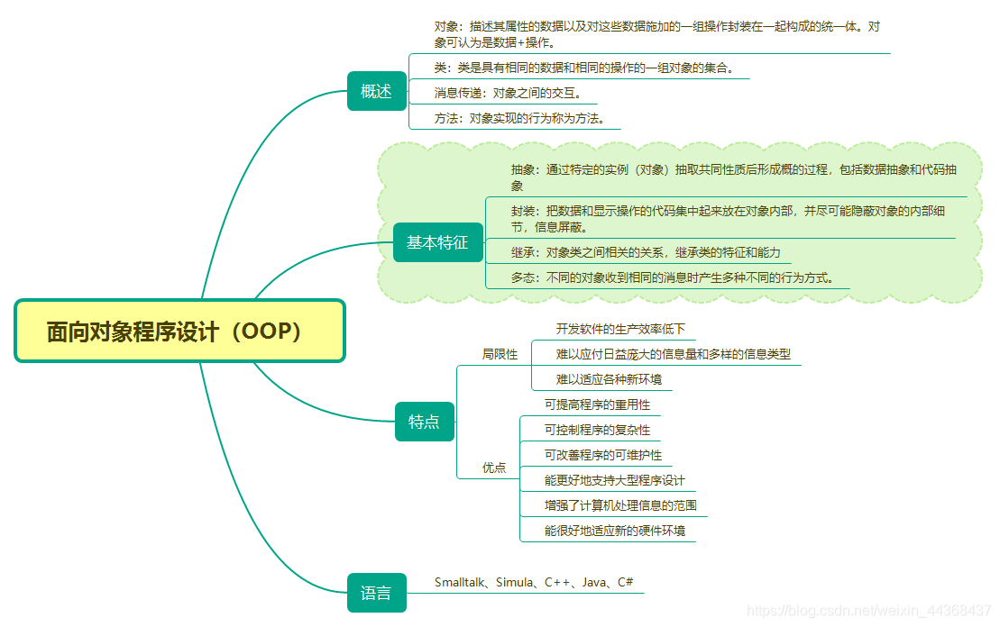
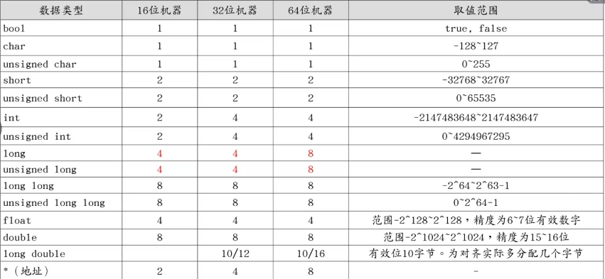

# C++基础
**资料**：https://blog.csdn.net/weixin_44368437/article/details/117563488?ops_request_misc=%257B%2522request%255Fid%2522%253A%2522466261201cfe4a82a7b214b64bde950e%2522%252C%2522scm%2522%253A%252220140713.130102334..%2522%257D&request_id=466261201cfe4a82a7b214b64bde950e&biz_id=0&utm_medium=distribute.pc_search_result.none-task-blog-2~all~top_positive~default-1-117563488-null-null.142^v102^pc_search_result_base4&utm_term=C%2B%2B&spm=1018.2226.3001.4187


## C++与 C 的区别（来自CSDN）

1.编程范式

C语言：C是一种过程式编程语言，主要关注函数和过程。程序是通过一系列函数调用来执行任务的。

C++：C++支持多种编程范式，最主要的是面向对象编程（OOP），同时也支持过程式编程。C++引入了类、对象、继承、多态、封装和抽象等OOP概念，使得代码可以更具模块化和可重用性。

2.类和对象

C语言：C不支持面向对象编程，没有类和对象的概念。

C++：C++支持类和对象，允许开发者创建自定义的数据类型，进行更高级别的抽象和封装。

3.函数重载和运算符重载

C语言：C不支持函数重载或运算符重载，函数名必须是唯一的，运算符功能是固定的。

C++：C++允许函数重载（同名函数可以有不同的参数）和运算符重载（例如，可以定义“+”来用于两个自定义对象之间的加法操作）。

4.标准库

C语言：C的标准库较为基础，主要提供了一些与输入输出、字符串处理、数学计算等相关的函数（如stdio.h，stdlib.h等）。

C++：C++有更丰富的标准库，除了C语言的标准库外，还引入了STL（标准模板库），提供了常用的数据结构（如vector，list，map等）和算法。

5.内存管理

C语言：C的内存管理主要通过malloc，calloc，realloc和free来进行手动内存分配和释放。

C++：C++除了可以使用C的内存管理函数外，还引入了new和delete运算符，用于动态内存分配和释放，这些运算符具有构造和析构对象的功能。

6.构造函数和析构函数

C语言：C不支持构造函数和析构函数，结构体的初始化需要手动完成。

C++：C++中的类可以有构造函数（对象创建时自动调用）和析构函数（对象销毁时自动调用），用于对象的初始化和清理工作。

7.命名空间（namespace）

C语言：C不支持命名空间，多个全局变量和函数可能会发生命名冲突。

C++：C++引入了命名空间，通过namespace可以将函数和变量组织在一起，避免命名冲突。

8.模板编程

C语言：C不支持模板编程。

C++：C++引入了模板，可以编写泛型函数和类，支持代码重用和类型安全。例如，模板可以实现类型无关的函数和容器。

9.异常处理

C语言：C没有内置的异常处理机制。错误处理通常通过返回错误码或者设置全局变量来完成。

C++：C++支持异常处理机制，通过try，throw，catch块来处理运行时错误，使得代码更加清晰和健壮。

10.引用（reference）

C语言：C只支持指针，不支持引用。

C++：C++引入了引用类型（reference），是一种更安全且更简洁的传递对象的方式，可以避免指针的一些常见错误（如空指针或指针操作中的内存泄漏问题）。

11.兼容性

C语言：C是C++的子集，大部分C语言代码可以直接在C++中运行。

C++：C++是C的超集，但C++的一些特性（如类、模板等）在C中不可用。

12.代码复杂性与应用领域

C语言：C的语法较为简单直接，适用于系统级编程，如操作系统开发、嵌入式系统、驱动程序等领域。

C++：C++功能更为复杂，适用于大型软件开发、游戏开发、高性能应用、GUI应用程序等。


## 面向对象的概念

**面向对象程序设计**（Object-Oriented Programming，OOP）是一种新的程序设计范型。程序设计范型是指设计程序的规范、模型和风格，它是一类程序设计语言的基础。

**面向过程程序设计范型**是使用较广泛的面向过程性语言，其主要特征是：程序由过程定义和过程调用组成（简单地说，过程就是程序执行某项操作的一段代码，函数就是最常用的过程）。

面向对象程序的基本元素是对象，面向对象程序的主要结构特点是：第一，程序一般由类的定义和类的使用两部分组成；第二，程序中的一切操作都是通过向对象发送消息来实现的，对象接收到消息后，启动有关方法完成相应的操作。




## C++基础知识

### sizeof 大小



C++涉及强制转化，一般是转化的时候是需要一些低位向高位进行转换

### const修饰符

在C语言中，习惯使用#define来定义常量，例如#define PI 3.14，C++提供了一种更灵活、更安全的方式来定义常量，即使用const修饰符来定义常量。例如const float PI = 3.14

这里要特别注意两个概念 常量指针和指针常量

```cpp
    // 常量指针：（指向常量的指针，指针指的是一个常量，但是指针自己不是一个常量）
    const char* pc = "abcd";
    // 指针所指的地址里面的内容无法改变
    // pc[3] = 'a'; 这是错误的
    // 指针所指的内容可以改变
    pc = "ervfs";  //该语句付给了指针另一个字符串的地址，改变了pc的值
```

```cpp
    // 指针常量：（指针本身是一个常量，也就是说，指针所指向的地址是无法改变的，但是地址内部的值是可以改变的）
    char* const pc = "abcd";
    //指针所指的地址无法改变
    //pc = 'dsff';  //该语句付给了指针另一个字符串的地址，改变了pc的值,这是不可以的
    //地址内部的值是可以改变的
    pc[3] = 'x'; //仅改变地址内容是可以的
```

```cpp
    // 两者一起用 内容和地址均不能改变
    const char* const pc = "abcd";的
```


### void 指针

void通常表示无值，但将void作为指针的类型时，它却表示不确定的类型。这种void型指针是一种通用型指针，也就是说任何类型的指针值都可以赋给void类型的指针变量。

需要指出的是，这里说void型指针是通用指针，是指它可以接受任何类型的指针的赋值，但对已获值的void型指针，对它进行再处理，如输出或者传递指针值时，则必须再进行**显式类型转换**，否则会出错。


```cpp
    // void指针
    void * pc;
    // int型
    int i = 123;
    cout<<i<<endl;
    // char型
    char c = 'a';
    cout<<c<<endl;

    // int * 赋值给 void * 使用的时候需要进行强制转化
    pc = &i;
    cout<< *(int *)pc <<endl;

    // int * 赋值给 void * 使用的时候需要进行强制转化
    pc = &c;
    cout<< *(char *)pc <<endl;
```

### 內联函数

在函数名前冠以关键字inline，该函数就被声明为内联函数。每当程序中出现对该函数的调用时，C++编译器使用函数体中的代码插入到调用该函数的语句之处，同时使用实参代替形参，以便在程序运行时不再进行函数调用。引入内联函数主要是为了消除调用函数时的系统开销，以提高运行速度

内联函数在第一次被调用之前必须进行完整的定义，否则编译器将无法知道应该插入什么代码

在内联函数体内一般不能含有复杂的控制语句，如for语句和switch语句等

使用内联函数是一种空间换时间的措施，若内联函数较长，较复杂且调用较为频繁时不建议使用

**注意內联函数与宏定义的区别**

实现机制上：（內联函数是在编译阶段，编译器处理的，宏定义是在编译之前，预处理器来处理的，简单的文本替换不）

内联函数：是C++中的一种函数定义方式，使用inline关键字修饰。在编译阶段，编译器会根据一定的规则（如函数体较小、调用频繁等）将内联函数的代码直接插入到每个调用点，从而避免函数调用的开销。内联函数的实现依赖于编译器的优化机制，编译器有权决定是否将某个函数内联。

宏定义：是C语言中的一种预处理指令，使用#define关键字定义。在预处理阶段，预处理器会将宏定义的代码直接替换到每个宏调用点，不涉及编译器的优化决策。宏定义的替换是简单的文本替换，不进行语法检查和类型检查。

安全性上：（宏定义只是简简单单的文本替换，不涉及一些语法检查）

内联函数：具有函数的所有特性，如类型检查、作用域规则等，能够保证代码的安全性和正确性。编译器会对内联函数的参数和返回值进行严格的类型检查，避免类型不匹配等问题。

宏定义：由于是简单的文本替换，不进行类型检查和语法检查，容易引发类型不匹配、运算符优先级错误等问题。例如，#define MAX(a, b) ((a) > (b) ? (a) : (b))，如果调用MAX(x++, y++)，可能会导致意外的结果，因为宏会将代码展开为((x++) > (y++) ? (x++) : (y++))，导致x和y被多次自增。

调试难度上：

内联函数：与普通函数类似，调试工具可以像调试普通函数一样调试内联函数，能够设置断点、查看变量值等，调试过程相对容易。

宏定义：由于宏定义的代码在预处理阶段被替换，调试工具无法直接调试宏定义的代码，只能看到替换后的代码，这增加了调试的难度

适用场景上：

内联函数：适用于函数体较小、调用频繁且需要类型安全的场景。例如，简单的数学计算函数、获取数组元素等。内联函数可以提高代码的可读性和可维护性，同时减少函数调用的开销。

宏定义：适用于需要快速替换文本、生成代码模板的场景。例如，定义常量、简单的代码片段等。宏定义可以提高代码的灵活性，但需要谨慎使用，避免引入错误。

```cpp
    #include<iostream>
    using namespace std;

    inline double circle(double r){
        double PI = 3.14;
        return PI * r * r;
    }

    int main(){

        for (int i = 0; i < 3; i++){
            cout <<"r = "<< i <<" area = " << circle(i) <<endl;
        }

        return 0;
    }
```

### 带有默认参数值的函数

当进行函数调用时，编译器按**从左到右**的顺序将实参与形参结合，若未指定足够的实参，则编译器按顺序用函数原型中的默认值来补足所缺少的实参。

所以如果要使用默认值的话，一定要注意，从左到右只有最右边的形参可以家默认值，不可以左边的加上了默认值，但是右边的没加（在函数原型中，所有取默认值的参数都必须出现在不取默认值的参数的右边。）

在函数调用时，若某个参数省略，则其后的参数皆应省略而采取默认值。不允许某个参数省略后，再给其后的参数指定参数值。

```cpp
    #include<iostream>
    using namespace std;

    void defaultParaFunc(int a = 5,int b = 10){
        cout<<"a = "<<a<<" b = "<<b<<endl;
    }

    int main(){

        defaultParaFunc();   //默认 a=5 b=10
        defaultParaFunc(25); //a=25 默认 b=10
        defaultParaFunc(25,30); // a=25 b=30
        
        return 0;
    }
```

### 函数重载

在C++中，用户可以重载函数。这意味着，在同一作用域内，只要**函数参数的类型不同，或者参数的个数不同，或者二者兼而有之**，两个或者两个以上的函数可以使用相同的函数名。

```cpp
    #include <iostream>
    using namespace std;

    int add(int x, int y){
        return x + y;
    }

    double add(double x, double y){
        return x + y;
    }

    int add(int x, int y, int z){
        return x + y + z;
    }

    int main() 
    {
        int a = 3, b = 5, c = 7;
        double x = 10.334, y = 8.9003;
        cout << add(a, b) << endl;
        cout << add(x, y) << endl;
        cout << add(a, b, c) << endl;
        return 0;
    }
```

注意：返回值类型不同不算重载（调用重载函数时，函数返回值类型不在参数匹配检查之列。因此，若两个函数的参数个数和类型都相同，而只有返回值类型不同，则不允许重载。）

```cpp
    int mul(int x, int y);
    double mul(int x, int y);
```

注意：重载和带默认值的函数容易造成二义性

```cpp
    void Drawcircle(int r = 0, int x = 0, int y = 0);
    void Drawcircle(int r);
    Drawcircle(20);
```

注意：C++可能会做强制类型转换

在调用函数时，如果给出的实参和形参类型不相符，C++的编译器会自动地做类型转换工作。如果转换成功，则程序继续执行，在这种情况下，有可能产生不可识别的错误。

```cpp
    void f_a(int x);
    void f_a(long x);
    f_a(20.83);
```

### 作用域标识符：：

通常情况下，如果有两个同名变量，一个是全局的，另一个是局部的，那么局部变量在其作用域内具有较高的优先权，它将屏蔽全局变量。

如果希望在局部变量的作用域内使用同名的全局变量，可以在该变量前加上“::”，此时::value代表全局变量value，“::”称为作用域标识符。

```cpp
    #include <iostream>
    using namespace std;

    int value;   //定义全局变量value

    int main() 
    {
        int value;  //定义局部变量value
        value = 100;
        ::value = 1000;
        cout << "local value : " << value << endl;
        cout << "global value : " << ::value << endl;
        return 0;
    }
```

### 强制类型转换

可用强制类型转换将不同类型的数据进行转换。例如，要把一个整型数（int）转换为双精度型数（double），可使用如下的格式：

```cpp
    int i = 10;
    double x = (double)i;
    或
    int i = 10;
    double x = double(i);
```

### new和delete运算符

程序运行时，计算机的内存被分为4个区：程序代码区、全局数据区、堆和栈。其中，堆可由用户分配和释放。C语言中使用函数malloc()和free()来进行动态内存管理。C++则提供了运算符new和delete来做同样的工作，而且后者比前者性能更优越，使用更灵活方便。

```cpp
    指针变量名 = new 类型
        int *p;
        p = new int;
    delete 指针变量名
        delete p;
```

下面对new和delete的使用再做一下几点说明：

申请后的释放工作：用运算符new分配的空间，使用结束后应该用也只能用delete显式地释放，否则这部分空间将不能回收而变成死空间。

异常处理工作：在使用运算符new动态分配内存时，如果没有足够的内存满足分配要求，new将返回空指针（NULL）。

使用运算符new可以为数组动态分配内存空间，这时需要在类型后面加上数组大小。


```cpp
    指针变量名 = new 类型名[下标表达式];
    int *p = new int[10];

    delete []指针变量名;
    delete p;
```

new 可在为简单变量分配空间的同时，进行初始化

```cpp
    指针变量名 = new 类型名(初值);
    int *p;
    p = new int(99);
    ···
    delete p;
```

异常处理要注意：

```cpp
    #include <iostream>
    using namespace std;

    int main(){

        //异常处理，一定要注意
        int* ptr = nullptr;
        try {
            ptr = new int[100];
        } catch (const std::bad_alloc& e) {
            cerr << "Memory allocation failed: " << e.what() << endl;
        }

        delete[] ptr;

        return 0;
    }
```

### 引用

引用（reference）是C++对C的一个重要扩充。变量的引用就是变量的别名，因此引用又称别名。

类型 &引用名 = 已定义的变量名

引用与其所代表的变量共享同一内存单元，系统并不为引用另外分配存储空间。实际上，编译系统使引用和其代表的变量具有相同的地址。

```cpp
    #include <iostream>
    using namespace std;
    int main() 
    {
        int i = 10;
        int &j = i;
        cout << "i = " << i << " j = " << j << endl;
        cout << "i的地址为 " << &i << endl;
        cout << "j的地址为 " << &j << endl;
        //输出的结果是一样的
        return 0;
    }

```

引用并不是一种独立的数据类型，它必须与某一种类型的变量相联系。在声明引用时，必须立即对它进行初始化，不能声明完成后再赋值。

为引用提供的初始值，可以是一个变量或者另一个引用。

指针是通过地址间接访问某个变量，而引用则是通过别名直接访问某个变量。


```cpp
    #include <iostream>
    using namespace std;

    void swap(int &a, int &b)
    {
        int t = a;
        a = b;
        b = t;
    }

    int a[] = {1, 3, 5, 7, 9};

    int& index(int i)
    {
        return a[i];
    }

    int main() 
    {
        int a = 5, b = 10;
        //交换数字a和b
        swap(a, b);
        cout << "a = " << a << " b = " << b << endl;
        cout << index(2) << endl;   //等价于输出元素a[2]的值
        index(2) = 100;             //等价于将a[2]的值赋为100;
        cout << index(2) << endl;
        
        return 0;
    }


```

进一步说明：

不允许建立void类型的引用

不能建立引用的数组

不能建立引用的引用。不能建立指向引用的指针。引用本身不是一种数据类型，所以没有引用的引用，也没有引用的指针。

可以将引用的地址赋值给一个指针，此时指针指向的是原来的变量。

可以用const对引用加以限定，不允许改变该引用的值，但是它不阻止引用所代表的变量的值。

