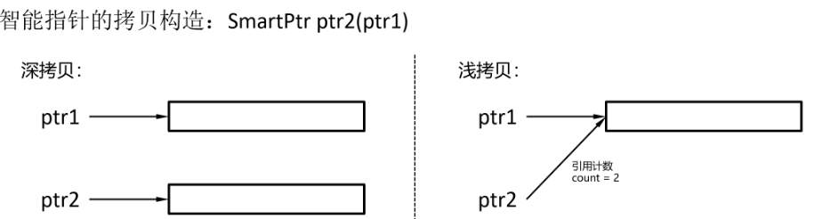
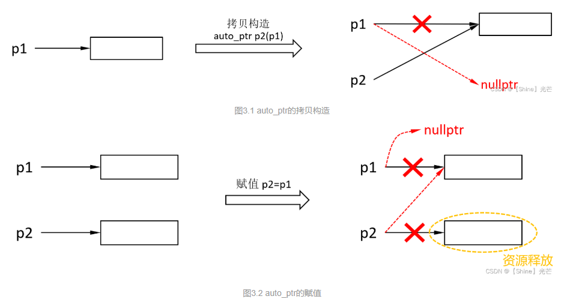
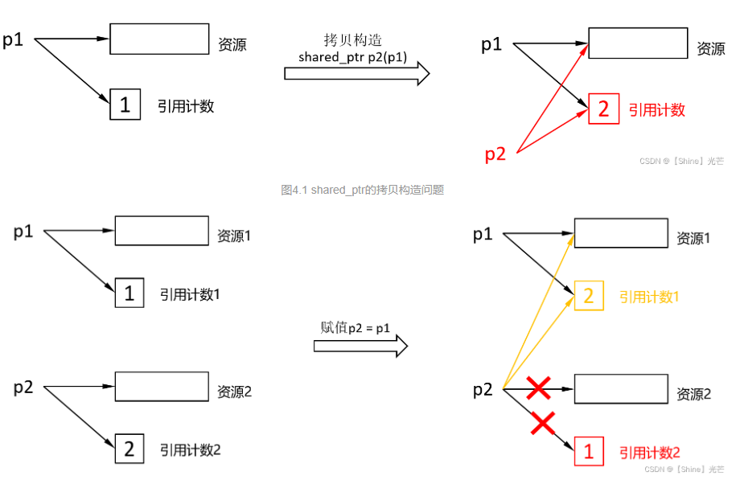
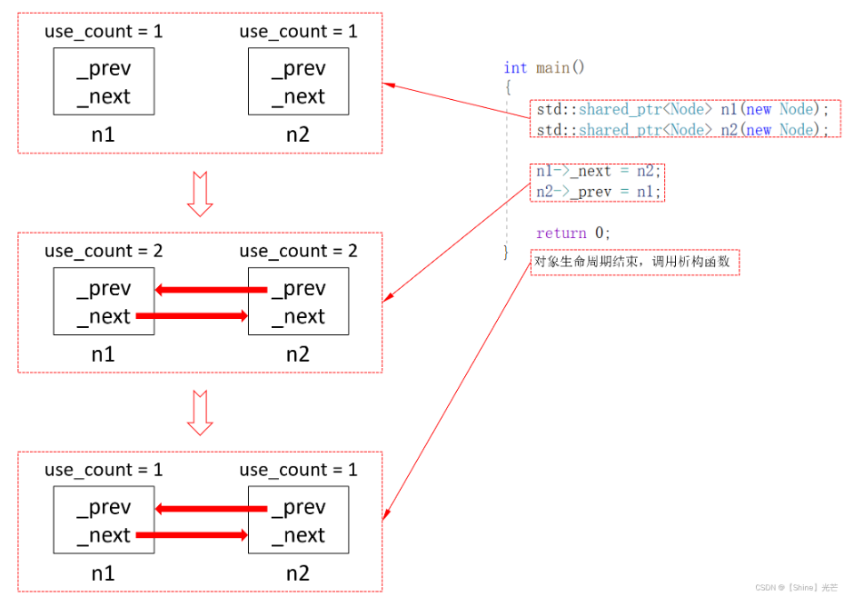

# C++指针

主要介绍一些C++指针的一些知识，基础的就不做介绍了

## 智能指针

参考：https://blog.csdn.net/weixin_43908419/article/details/131060402

### 什么是智能指针

智能指针RAII(Resource Acquisition Is Initialization)，是一种利用对象的生命周期来管理资源的技术。如果我们采用传统的new/delete来申请和释放资源，如果忘记调用delete，或者在调用delete之前程序抛出异常，都会导致内存泄漏问题

最简单的例子：
```cpp
void Func()
{
	int* p1 = new int[5];
	int* p2 = new int[5];
 
	//这里Div函数会抛异常，main函数会捕获异常，delete[]没有执行，引发内存泄漏
	int ret = Div(5, 0);
 
	delete[] p1;
	delete[] p2;
}
```

Func函数中的new p2和Div都可能抛异常，导致后面的delete没有执行从而引发内存泄漏，采用智能指针对资源进行管理，能够杜绝这类问题。

智能指针是一个类，在对象构造时调用构造函数获取资源，在对象生命周期内，保证资源不被释放，在对象生命周期结束时，编译器自动调用析构函数来释放资源。这就相当于，将管理资源的责任移交给了对象，这样即使程序抛出异常也不存在内存泄漏，因为捕获异常往往跳出函数体，执行流会离开对象的作用域，对象生命周期结束，编译器自动调用析构函数释放了资源。

采用智能指针管理资源，有如下优点：

- 将资源管理的责任转移给智能指针对象，不用显示地释放资源，杜绝了异常安全问题。

- 保证对象管理的资源在其生命周期内有效。

简单定义：

定义了一种简易的智能指针SmartPtr，在其析构函数中会对资源进行释放。因为申请的资源可能是通过new T、new T[n]、malloc(...)这几种方法的任意之一来申请的，每种方式申请的资源需要不同的关键字/函数来释放资源，否则程序可能会崩溃。

因此，需要一个模板参数Del，这个模板参数用于接收仿函数，以匹配不同的资源释放方式。我们默认采用delete的方式释放资源，C++标准库中提供的智能指针，如果不显示给定仿函数来定义释放资源的方式，也是默认delete释放资源。

```cpp
#include<iostream>
using namespace std;

template<typename T>
struct Delete {
    void operator()(T * ptr){
        delete ptr;
    }
};

template<typename T>
struct DeleteArray {
    void operator()(T * ptr){
        delete[] ptr;
    }
};

template<typename T>
struct Free {
    void operator()(T * ptr){
        free(ptr);
    }
};


template<typename T,typename Del = Delete<T>>
class SmartPtr{
private:
    T* _ptr;
public:
    SmartPtr(T* ptr=nullptr):_ptr(ptr){};
    ~SmartPtr(){
        Del del;
        del(_ptr);
    }

    //基础访问功能
    T* get() const noexcept { return _ptr; }
};

int main(){
    // 单个对象
    SmartPtr<int> p1(new int(42));
    cout<<*p1.get()<<endl;

    // 动态数组（需配套删除器）
    SmartPtr<int, DeleteArray<int>> p2( new int[5] );
    cout<<*p2.get()<<endl;
    
    // C语言内存分配（需配套删除器）
    SmartPtr<int, Free<int>> p3(static_cast<int*>(malloc(sizeof(int))));
    cout<<*p3.get()<<endl;

    return 0;
}
```

### 智能指针的原理

智能指针，顾名思义，不能仅仅是用于资源管理，还应当具有指针的一般功能。因此，需要重载operator*、operator->函数（见代码1.3），用于访问指针指向的资源。注意：C++标准库中的智能指针均不重载operator[]函数。

```cpp
#include<iostream>
using namespace std;

// 自定义一个简单的结构体用于测试operator->
struct Point {
    int x;
    int y;
};

template<typename T>
struct Delete {
    void operator()(T * ptr){
        delete ptr;
    }
};

template<typename T>
struct DeleteArray {
    void operator()(T * ptr){
        delete[] ptr;
    }
};

template<typename T>
struct Free {
    void operator()(T * ptr){
        free(ptr);
    }
};


template<typename T,typename Del = Delete<T>>
class SmartPtr{
private:
    T* _ptr;
public:
    SmartPtr(T* ptr=nullptr):_ptr(ptr){};
    ~SmartPtr(){
        Del del;
        del(_ptr);
    }

    //基础访问功能
    T* get() const noexcept { return _ptr; }

    T& operator*()
	{
		return *_ptr;
	}
 
	T* operator->()
	{
		return _ptr;
	}

};

int main(){
    // 测试默认删除器（Delete<T>）
    {
        SmartPtr<int> ptr1(new int(10));
        cout << "Default Deleter Test: " << *ptr1 << endl;  // 输出10
        *ptr1 = 20;
        cout << "Modified Value: " << *ptr1 << endl;         // 输出20
    } // 此处自动调用delete

    // 测试数组删除器（DeleteArray<T>）
    {
        SmartPtr<int, DeleteArray<int>> ptr2(new int[3]{1, 2, 3});
        cout << "Array Test: ";
        cout << ptr2.get()[0] << ", " << ptr2.get()[1] << ", " << ptr2.get()[2] << endl; // 输出1,2,3
    } // 此处自动调用delete[]

    // 测试C风格内存释放（Free<T>）
    {
        int* raw_ptr = static_cast<int*>(malloc(sizeof(int)));
        *raw_ptr = 30;
        SmartPtr<int, Free<int>> ptr3(raw_ptr);
        cout << "Free Test: " << *ptr3 << endl; // 输出30
    } // 此处自动调用free

    // 测试结构体与operator->
    {
        SmartPtr<Point> ptr4(new Point);
        ptr4->x = 100;    // 通过operator->修改成员
        ptr4->y = 200;
        cout << "Struct Test: " << ptr4->x << ", " << ptr4->y << endl; // 输出100,200
    } // 此处自动调用delete

    { //对结构体使用operator*
        SmartPtr<Point> ptr6(new Point{300, 400});
        cout << "Struct Dereference Test:" << endl;
        
        // 通过operator*访问结构体
        (*ptr6).x = 500;  // 等价于ptr6->x = 500
        (*ptr6).y = 600;
        
        // 混合使用两种访问方式
        cout << "Modified values: " 
             << (*ptr6).x << ", "    // 500
             << ptr6->y << endl;      // 600
    }

    return 0;
}
```


### 智能指针的拷贝问题

我们要求智能指针具有一般的指针行为，因此，我们也就需要智能指针支持拷贝。但是，智能指针中的成员涉及到执行动态申请资源的指针，按照一般要求，应当进行深拷贝。

但是如果我们进行深拷贝，就会让两个智能指针指向不同的空间，但是我们所希望的是两个指针共同管理一块资源，因此我们就是要浅拷贝（值拷贝）。

但是值拷贝会存在对同一块空间多次释放的问题，对此，C++标准库中的智能指针auto_ptr和shared_ptr分别采用了管理权转移和引用计数的方法来解决问题，但一般会通过引用计数解决多次释放的问题

- 即使涉及到动态申请内存，智能指针的拷贝也不应为深拷贝，应当是浅拷贝。

- 采用管理权转移（auto_ptr）或引用计数（shared_ptr）来解决同一块空间多次释放的问题。

- 一般都使用引用计数来解决多次释放问题，auto_ptr大部分情况下不使用。



### auto_ptr

#### auto_ptr的拷贝构造和赋值问题

auto_ptr采用管理权转移的方法进行赋值和拷贝构造，假设原先有一个auto_ptr对象p1，要通过p1构造p2，当拷贝构造完成后，用于拷贝构造传参的对象p1中管理资源的指针会被更改为nullptr，赋值也一样，假设p2=p1，p1中资源的管理权会转移给p2，p2原本的资源会被释放。

采用管理权转移的方法进行智能指针拷贝是一种极不负责任的行为，auto_ptr已经被很多公司明令禁止使用，一般项目中也极少使用auto_ptr。



#### auto_ptr的模拟实现

```cpp
#include<iostream>
using namespace std;

template<typename T>
class autoPtr{
private:
    T * _ptr;
public:
    //构造函数
    autoPtr(T* ptr = nullptr):_ptr(ptr){};
    //拷贝构造
    autoPtr(autoPtr<T> & ap):_ptr(ap._ptr){
        ap._ptr = nullptr;
    }
    //赋值构造
    autoPtr<T>& operator=(autoPtr<T> & ap){
        if (_ptr != ap._ptr){  //自赋值
            delete this->_ptr;
            this->_ptr = ap._ptr;
            ap._ptr = nullptr;
        }
        return *this;
    }

    T& operator*(){
        return *_ptr;
    }

    T* operator->(){
        return _ptr;
    }

    // 析构函数
    ~autoPtr() {
        delete _ptr;
    }

    // 辅助函数：检查指针是否为空
    bool isNull() const {
        return _ptr == nullptr;
    }
};

// 测试类
struct Test {
    int value;
    Test(int v) : value(v) {}
    ~Test() {
        std::cout << "Test destroyed: " << value << std::endl;
    }
};

int main(){
    // 测试1: 基础构造和析构
    {
        std::cout << "--- Test 1: Basic ---" << std::endl;
        autoPtr<Test> ap1(new Test(1));
    } // 此处应输出"Test destroyed: 1"

    // 测试2: 拷贝构造所有权转移
    {
        std::cout << "\n--- Test 2: Copy Constructor ---" << std::endl;
        autoPtr<Test> ap1(new Test(2));
        autoPtr<Test> ap2(ap1);  // 所有权转移
        
        std::cout << "ap1.isNull(): " << ap1.isNull() << std::endl;  // 应输出1
        std::cout << "ap2->value: " << ap2->value << std::endl;     // 应输出2
    } // 此处应输出"Test destroyed: 2"

    // 测试3: 赋值运算符所有权转移
    {
        std::cout << "\n--- Test 3: Assignment Operator ---" << std::endl;
        autoPtr<Test> ap3(new Test(3));
        autoPtr<Test> ap4;
        ap4 = ap3;  // 所有权转移
        
        std::cout << "ap3.isNull(): " << ap3.isNull() << std::endl; // 应输出1
        std::cout << "ap4->value: " << ap4->value << std::endl;     // 应输出3
    } // 此处应输出"Test destroyed: 3"

    // 测试4: 操作符功能
    {
        std::cout << "\n--- Test 4: Operators ---" << std::endl;
        autoPtr<Test> ap5(new Test(5));
        (*ap5).value = 6;
        std::cout << "Modified value via *: " << ap5->value << std::endl;  // 应输出6
        
        ap5->value = 7;
        std::cout << "Modified value via ->: " << (*ap5).value << std::endl; // 应输出7
    } // 此处应输出"Test destroyed: 7"

    // 测试5: 自赋值
    {
        std::cout << "\n--- Test 5: Self-Assignment ---" << std::endl;
        autoPtr<Test> ap6(new Test(6));
        ap6 = ap6;  // 自赋值应安全处理
        
        std::cout << "ap6->value: " << ap6->value << std::endl;  // 应输出6
    } // 此处应输出"Test destroyed: 6"

    return 0;
}
```

### unique_ptr 

unique_ptr 直接将拷贝构造和赋值禁止，也就不存在浅拷贝的多次释放同一块空间的问题。


```cpp
#include<iostream>
using namespace std;

template<typename T>
class uniquePtr{
private:
    T* _ptr;
public:
    uniquePtr(T* ptr):_ptr(ptr){};
    ~uniquePtr(){
        delete _ptr;
    }

    uniquePtr(const uniquePtr<T>& up) = delete;
    uniquePtr<T> & operator=(const uniquePtr<T>& up) = delete;

    T& operator*(){
        return *_ptr;
    }

    T* operator->(){
        return _ptr;
    }

};

struct TestStruct {
    int val;
    TestStruct(int v) : val(v) {}
};


int main(){

    {// 基础功能测试
        uniquePtr<int> up1(new int(42));
        cout << *up1 << endl; // 输出: 42

        uniquePtr<TestStruct> up2(new TestStruct{99});
        cout << up2->val << endl; // 输出: 99
    }

    //{
    //    // 以下代码取消注释会编译错误（测试拷贝禁止）
    //    uniquePtr<int> up3(new int(42));
    //    uniquePtr<int> up4(up3);
    //    uniquePtr<int> up5 = up3;          // 错误：拷贝构造被删除
    //    uniquePtr<int> up6; up6 = up4;     // 错误：拷贝赋值被删除
    //}


    return 0;
}
```


### shared_ptr

#### 常用功能

| 接口函数                                                                 | 功能                                                                                     |
|--------------------------------------------------------------------------|----------------------------------------------------------------------------------------|
| `shared_ptr(T* ptr = nullptr, Del del = Delete<T>())`                   | 构造函数，del为定制删除器（仿函数对象），用于不同情况下的资源释放操作                                            |
| `shared_ptr(shared_ptr<T>& sp)`                                          | 拷贝构造函数                                                                                 |
| `shared_ptr<T>& operator=(shared_ptr<T>& sp)`                            | 赋值运算符重载函数                                                                               |
| `T& operator*()`                                                        | 解引用操作符重载函数                                                                              |
| `T* operator->()`                                                       | 成员访问操作符重载函数                                                                             |
| `T* get()`                                                              | 获取`shared_ptr`内部管理资源的指针                                                           |
| `long int use_count()`                                                  | 获取引用计数（当前智能指针管理的资源被多少智能指针共同管理）                                                      |
| `bool unique()`                                                         | 判断当前智能指针管理的资源是否只有它本身在管理（引用计数是否为1）                                                      |


#### shared_ptr的拷贝构造和赋值问题

- shared内部有一个成员变量long int* _pcount，它指向一块存储引用计数的空间，当进行拷贝构造时，引用计数+1，即：++(*_pcount)。

- 进行赋值操作（sp2 = sp1）时，首先应当检查自赋值，如果是自赋值直接返回*this即可。如果不是自赋值，那么首先将sp2的引用计数-1，如果sp2的引用计数-1后变为了0，那么就释放sp2的资源，然后赋予sp2管理sp1管理的资源的权限，sp2和sp1共用一个引用计数，引用计数+1。

- 调用析构函数时，先让引用计数-1，如果此时引用计数变为0，就释放资源。



#### shared_ptr的模拟实现

```cpp
#include<iostream>
using namespace std;

template<typename T>
struct Delete {
    void operator()(T * ptr){
        delete ptr;
    }
};

template<typename T>
struct DeleteArray {
    void operator()(T * ptr){
        delete[] ptr;
    }
};

template<typename T>
struct Free {
    void operator()(T * ptr){
        free(ptr);
    }
};


template<typename T, typename Del = Delete<T>>
class sharedPtr{
private:
    T* _ptr;
    long int* _pcount;   //引用计数
public:
    sharedPtr(T* ptr):_ptr(ptr),_pcount(new long int(1)){};
    //拷贝构造
    sharedPtr(sharedPtr<T,Del> & sp):_ptr(sp._ptr),_pcount(sp._pcount){
        ++(*_pcount); //计数+1
    }
    //赋值函数
    sharedPtr<T,Del>& operator=(sharedPtr<T,Del> & sp){
        if(_ptr == sp._ptr){
            return *this;
        }
        //this的引用计数-1，并判断是否需要释放资源
        (*_pcount)--; //
        if((*_pcount)==0){
            Del del;
            del(_ptr); _ptr = nullptr;
            delete _pcount; _pcount = nullptr;
        }
        //赋值
        _ptr = sp._ptr;
        _pcount = sp._pcount;
        (*_pcount)++;
        return *this;
    }

    //指针获取函数
    T* get(){
        return _ptr;
    }

    //引用计数获取函数
    long int use_count(){
        return *_pcount;
    }

    T& operator*(){
        return *_ptr;
    }

    T* operator->(){
        return _ptr;
    }

    bool unique(){
		return *_pcount == 1;
	}

    //析构函数
    ~sharedPtr(){
        (*_pcount)--; //
        if((*_pcount)==0){
            Del del;
            del(_ptr); _ptr = nullptr;
            delete _pcount; _pcount = nullptr;
        }
    }


};

int main(){

    // 测试基础类型和引用计数
    sharedPtr<int> p1(new int(42));
    cout << "p1 use count: " << p1.use_count() << endl;  // 1

    {
        sharedPtr<int> p2 = p1;
        cout << "p1 use count after copy: " << p1.use_count() << endl;  // 2
        cout << "p2 use count: " << p2.use_count() << endl;             // 2
    }
    cout << "p1 use count after p2销毁: " << p1.use_count() << endl;    // 1

    // 测试赋值运算符
    sharedPtr<int> p3(new int(100));
    p1 = p3;
    cout << "p1 use count after assignment: " << p1.use_count() << endl; // 2
    cout << "p3 use count: " << p3.use_count() << endl;                  // 2

    // 测试自赋值
    p1 = p1;
    cout << "p1 use count after self-assignment: " << p1.use_count() << endl; // 2

    // 测试数组类型
    sharedPtr<int, DeleteArray<int>> arr(new int[5]);
    // 此处arr析构时会调用delete[]

    // 测试malloc/free
    sharedPtr<int, Free<int>> malloc_ptr(static_cast<int*>(malloc(sizeof(int))));
    // 此处malloc_ptr析构时会调用free

    return 0;
}
```

#### shared_ptr的循环引用问题

在绝大部分情况下，shared_ptr能够解决智能指针赋值造成的多次析构问题，也不会引发内存泄漏。但是，代码4.1展现了一种特殊情况，定义一个Node节点，其中包含两个shared_ptr成员_prev和_next。在主函数中实例化出两个shared_ptr\<Node\>对象n1和n2，n1的_next指向n2，n2的_prev指向n1，n1和n2相互指向对方，这样就属于循环引用，会造成n1和n2的资源释放失败，引发内存泄漏问题

```cpp
struct Node
{
	int _val;
	std::shared_ptr<Node> _prev;
	std::shared_ptr<Node> _next;
 
	~Node()
	{
		std::cout << "~Node()" << std::endl;
	}
};
 
int main()
{
	std::shared_ptr<Node> n1(new Node);
	std::shared_ptr<Node> n2(new Node);
 
	n1->_next = n2;
	n2->_prev = n1;
 
	return 0;
}
```


- 构造对象n1和n2，引用计数为1，然后n1->_next = n2、n2->_prev = n1后，引用计数变为2。

- 先后由n2和n1调用析构函数，引用计数变为1。

- 此时，n1和n2的资源还都没有释放，n1的_next依旧指向n2，n2的_prev依旧指向n1。

- n1释放，就需要n2的_prev成员释放，n1释放，就需要n1的_next成员释放。但是，只有对象本身析构，它的成员才会析构，因此n1和n2彼此制约对方的析构，最终n1和n2的资源都无法释放，造成了内存泄漏。




为了避免循环引用，可以把Node节点中的_next和_prev成员变量的类型改为weak_ptr\<Node\>，weak_ptr是C++标准库中的比较特殊的一个“智能指针”，允许使用shared_ptr对象来构造weak_ptr对象，但是，**weak_ptr不增加引用计数，不参与资源的申请和释放**，从严格意义上讲，weak_ptr不算是智能指针。

```cpp
struct Node
{
	int _val;
	std::weak_ptr<Node> _prev;
	std::weak_ptr<Node> _next;
 
	~Node()
	{
		std::cout << "~Node()" << std::endl;
	}
};
 
int main()
{
	std::shared_ptr<Node> n1(new Node);
	std::shared_ptr<Node> n2(new Node);
 
	n1->_next = n2;
	n2->_prev = n1;
 
	return 0;
}
```

### weak_ptr

weak_ptr不参与资源的管理和释放，可以使用shared_ptr对象来构造weak_ptr对象，但是不能直接使用指针来构造weak_ptr对象，在weak_ptr中，也没有operator*函数和operator->成员函数，不具有一般指针的行为，因此，weak_ptr严格意义上并不是智能指针，weak_ptr的出现，就是为了解决shared_ptr的循环引用问题。

weak_ptr在进行拷贝构造和赋值时，不增加引用计数，由于weak_ptr不参与资源管理，也不需要显示定义析构函数来释放资源。


```cpp
#include<iostream>
#include <memory>
using namespace std;

template<typename T>
class weakPtr{
private:
    T* _ptr;
public:
    weakPtr():_ptr(nullptr){};
    //拷贝构造
    weakPtr(weakPtr<T>& wp):_ptr(wp._ptr){}
    //share_prt 构造
    weakPtr(shared_ptr<T>& sp):_ptr(sp.get()){}
    //赋值函数
	weakPtr<T>& operator=(weakPtr<T>& wp){
        if(_ptr == wp._ptr){
            return *this;
        }
		_ptr = wp._ptr;
        return *this;
	}
	//通过shared_ptr对象赋值
	weakPtr<T>& operator=(shared_ptr<T>& sp){
		_ptr = sp.get();
        return *this;
	}

    // 添加get方法用于测试
    T* get() const { return _ptr; }
};

int main(){

    // 创建一个shared_ptr并初始化
    shared_ptr<int> sp1(new int(42));
    cout << "sp1.get() = " << sp1.get() << ", *sp1 = " << *sp1 << endl;

    // 测试从shared_ptr构造weakPtr
    weakPtr<int> wp1(sp1);
    std::cout << "wp1.get() = " << wp1.get() << std::endl;

    // 测试拷贝构造
    weakPtr<int> wp2(wp1);
    std::cout << "wp2.get() = " << wp2.get() << std::endl;

    // 测试赋值运算符（weakPtr赋值给weakPtr）
    weakPtr<int> wp3;
    wp3 = wp2;
    std::cout << "wp3.get() = " << wp3.get() << std::endl;

    // 测试从新的shared_ptr赋值
    std::shared_ptr<int> sp2(new int(100));
    wp3 = sp2;
    std::cout << "sp2.get() = " << sp2.get() << ", *sp2 = " << *sp2 << std::endl;
    std::cout << "wp3.get() after sp2 assignment = " << wp3.get() << std::endl;

    // 验证所有weakPtr的指针值
    std::cout << "\nFinal pointers:" << std::endl;
    std::cout << "wp1 (from sp1): " << wp1.get() << std::endl;
    std::cout << "wp2 (copy of wp1): " << wp2.get() << std::endl;
    std::cout << "wp3 (assigned sp2): " << wp3.get() << std::endl;

 

    return 0;
}
```

### 总结
- 智能指针是用来对资源进行管理的类，在对象创建时动态申请内存资源，在对象生命周期结束时由编译器自动调用析构函数完成资源的释放，智能指针除了用来管理资源外，还应当具有指针的一般行为（operator*函数和operator->函数）。
  
- 使用智能指针，相当于把资源管理的责任转交给智能指针对象。这样能够有效避免因为忘记delete或者程序抛出异常而引起的内存泄漏。

- 智能指针应支持浅拷贝，但是浅拷贝存在同一块空间被多次释放的问题，为此，C++标准库中的三种智能指针auto_ptr、unique_ptr和shared_ptr分别采用了不同的方法来解决这一问题。
  - auto_ptr支持拷贝的方式是进行管理权转移，这是一种不负责任的处理方式，auto_ptr因此被许多公司禁止使用。

  - unique_ptr直接强行禁止拷贝构造和赋值。

  - shared_ptr通过引用计数的方式来进行浅拷贝，当引用计数为0时析构函数才释放资源，这样既支持了浅拷贝，也保证一块空间仅被析构一次。但是shared_ptr存在循环引用这一隐患，会造成内存泄漏。

- 使用weak_ptr可以避免shared_ptr的循环引用问题，weak_ptr可以通shared_ptr对象来构造而不增加引用计数，weak_ptr不参与资源的管理，不支持operator*和operator->。
