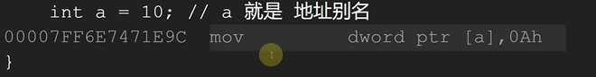
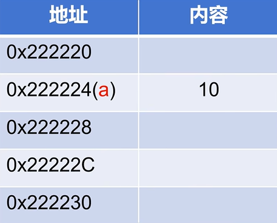
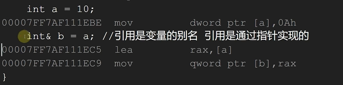
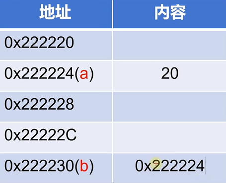
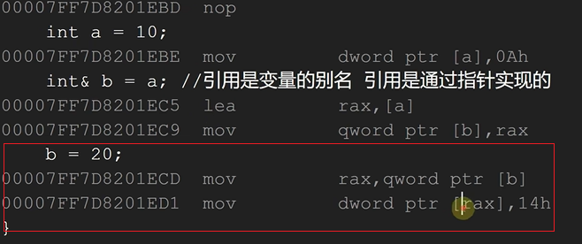

# C++引用
在 C++ base 之中已经介绍了一些 引用的基本概念，本来我以为引用就是我想象的那样(就是最为基础的用法&)但是今天做线程池的项目的时候涉及到了左值引用和右值引用的概念

这个概念不是很懂，因此拿出来学一学 说一说

## 引用的基础用法
就是咱们平时用的那种,这种其实是一种左值引用，这个概念下面再说

```cpp
#include<iostream>
using namespace std;

int main(){

    int i = 10;
	int &j = i;
	cout << "i = " << i << " j = " << j << endl;
	cout << "i的地址为 " << &i << endl;
	cout << "j的地址为 " << &j << endl;

    return 0;
}
```

### 引用如何实现

我们先来看一下一个最为基础的赋值语句

```cpp
int a = 10;   //其实A就是地址的别名
```

我们把他进行反汇编



可以看到：返回汇编之后就是一个简单的mv语句，把10 放到 地址[a]之中



那么我们后面修改值的话就会修改(a)地址里面所存的值

现在我们要为这个变量添加引用，相当于为地址a取一个别名

```cpp
int a = 10;
int& b = a;   //引用是变量的别名，是通过指针实现的
```

我们把他进行反汇编



我们可以看到 int& b = a; 对应两条指令 ，这两句话的意思是将[a]存储到rex之中，然后在将rex存储到[b]之中

最后的意思是：




然后我们再用引用来修改值试试

```cpp
int a = 10;
int& b = a;   //引用是变量的别名，是通过指针实现的
b = 20;
```



我们可以看到，分成了两步，第一步：先拿到[b]之中存储的值(也就是地址a)，第二步：赋值

以上就是咱们最常见的引用的实现！！！

## 左值引用与右值引用

首先理解一下什么是左值和右值

对于一个语句 int a = 10;

我们可以看到，将10放入变量a之中，a是有地址的，也可以说a就是地址的别名，10是没有地址的。左值就是那些有地址的量，比如：有名字的变量 右值就是那些临时的没有地址的量 比如：临时对象或者字面量

或者换一种解释：


对左边的引用是左值引用 对右边的引用是右值引用  ： )


咱们上面说的 **引用的基础用法** 其实就是左值引用，下面就介绍一下 右值引用

### 右值引用

Type &&
```cpp
int &&rref = 10; // 右值引用绑定到字面量10
//rref = 20; // 错误，不能修改右值
```

其实就这么简单，就是对一些临时的量的引用，不可以修改右值

这看上去好像有点鸡肋，没啥用，但是用处确实不小

#### 右值引用的用处

**移动语义（Move Semantics）**

这个很重要！它允许资源的“转移”，从而避免不必要的拷贝，显著提高程序的性能。

当一个对象被赋值给另一个对象时，通常会调用拷贝构造函数或拷贝赋值运算符，这可能导致不必要的资源拷贝，尤其是对于大型对象(比如很大的vector，或者是string)

举个例子：

```cpp
vector<int> createVector() {
    return std::vector<int>(1000000); // 创建一个包含1000000个元素的向量
}
```

我们来看一下怎么返回值，在返回的时候返回一个1000000的vector (假设名字为A)，我们通常会使用一个vector (假设名字为B)来接收，那么过程通常是 B = A 使用拷贝来构造B，然后A再销毁，那么有了右值引用的话就可以临时接管A，然后再将控制权转给B，这样就是移动构造


**完美转发（Perfect Forwarding）**

它允许函数将参数原样传递给另一个函数，保留其左值或右值的性质。

一个函数要接收 左值或右值 可能得需要对函数进行重载

通过：forward实现

```cpp
template <typename T>
void wrapper(T&& arg) {
    // 完美转发arg到另一个函数
    wrappedFunction(std::forward<T>(arg));
}
std::forward<T>(arg)：根据T的类型（左值或右值），将arg原样转发到wrappedFunction。
```

比如：

```cpp
void print(int& x) {
    std::cout << "lvalue: " << x << std::endl;
}

void print(int&& x) {
    std::cout << "rvalue: " << x << std::endl;
}

template <typename T>
void wrapper(T&& arg) {
    print(std::forward<T>(arg));
}

int main() {
    int x = 10;
    wrapper(x);       // 输出 "lvalue: 10"
    wrapper(20);      // 输出 "rvalue: 20"
    return 0;
}
```

参考：https://www.bilibili.com/video/BV1wvX7YtEk3/?spm_id_from=333.337.search-card.all.click&vd_source=28887ecca1f25a715214067a2b3b58ac