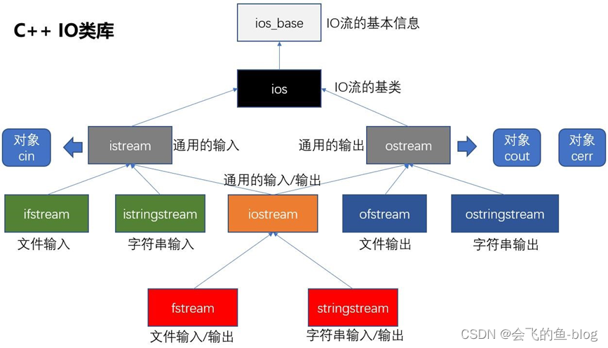

# C++流

## 基本概念

主要是文件操作比较重要

用户数据不能永久保存, 程序关闭后, 数据消失. 因此需要把一些重要的东西存储在文件之中

IO: 向设备输入数据和输出数据


**设备：**

- 文件
  
- 控制台

- 特定的数据类型(stringstream)

**C++之中的IO库**



## 文件流

文件流: 对文件进行读写操作头文件: \<fstream\> 类库:

- ifstream: 文件输入（读文件）

- ofstream: 文件输出（写文件）

- fstream: 文件输入或输出

对文本文件流读写，打开标识(可以使用位操作 | 组合起来):

- ios::in : 读方式打开文件

- ios:out : 写方式打开文件

- ios::trunc : 	如果此文件已经存在, 就会打开文件之前把文件长度截断为 0

- ios::app : 尾部最加方式(在尾部写入)

- ios::ate : 文件打开后, 定位到文件尾

- ios::binary : 二进制方式(默认是文本方式)

写文件样例(简单的写)：

```cpp
#include<iostream>
#include<fstream>
using namespace std;

int main(){

    string name; 
    int age;
    //也可以使用fstream, 但是fstream的默认打开方式不截断文件长度
    ofstream outfile; 

    //打开文件
    outfile.open("test.txt", ios::out | ios::trunc);

    cout << "请输入姓名:"; 
    cin >> name; 
    outfile << name << "\t";

    cout << "请输入年龄: "; 
    cin >> age; 
    outfile << age << endl; //文本文件写入

    outfile.close();

    return 0;
}
```

读文件样例（简单的读）：

```cpp

#include<iostream>
#include<fstream>
#include<string>
using namespace std;

int main(){

    string name; 
    int age;
    ifstream infile; 

    infile.open("test.txt");

    infile >> name; 
    cout << name << "\t";
    infile >> age;
    cout << age << endl;

    infile.close();

    return 0;
}
```

**对二进制文件流读写**

思考：文本文件和二进制文件的区别？

文本文件： 写数字 1， 实际写入的是 ‘1’（字符1）

二进制文件：写数字 1， 实际写入的是 整数 1（4 个字节，最低字节是 1， 高 3 个字节都是 0）写字符‘R’实际输入的还是‘R’

写二进制文件

使用文件流对象的 write 方法写入二进制数据

```cpp
#include<iostream>
#include<fstream>
#include <string>
using namespace std;

int main(){

    string name; 
    int age; 
    ofstream outfile; 

    outfile.open("test.dat", ios::out | ios::trunc | ios::binary);

    cout << "请输入姓名:"; 
    cin >> name; 
    outfile << name << "\t";


    cout << "请输入年龄: "; 
    cin >> age; 
    outfile.write((char*)&age, sizeof(age));

    outfile.close();

    return 0;
}
```
读二进制文件

```cpp
#include<iostream>
#include<fstream>
#include <string>
using namespace std;

int main(){

    string name; 
    int age;
    ifstream infile; 

    infile.open("test.dat", ios::in | ios::binary);

    infile >> name; 
    cout << name << "\t";

    // 跳过中间的制表符
    char tmp;
    infile.read(&tmp, sizeof(tmp));


    infile.read((char*)&age, sizeof(age));
    cout << age << endl;

    infile.close();

    return 0;
}
```

什么时候会用到二进制的读写：

- 处理非文本数据：如图像、音频等，避免数据格式错误。

- 保持数据完整性：直接按内存布局存储和读取，不受字符编码等影响。(对结构体的读写)

- 提高读写效率：减少格式解析步骤，适合大量数据处理。

- 实现加密或压缩：加密和压缩算法通常基于二进制操作。

- 与外部程序或设备交互：满足特定协议要求。

**对文件流按格式读写取数据**

使用 stringstream

按指定格式写文件

```cpp
#include<iostream>
#include<fstream>
#include<sstream>
#include<string>
using namespace std;

int main(){

    string name; 
    int age;
    //也可以使用fstream, 但是fstream的默认打开方式不截断文件长度
    ofstream outfile; 

    //打开文件
    outfile.open("test.txt", ios::out | ios::trunc);

    cout << "请输入姓名:"; 
    cin >> name; 

    cout << "请输入年龄: "; 
    cin >> age; 

    stringstream s; 
    s << "name:" << name << "\t\tage:" << age << endl; 
    outfile << s.str();

    outfile.close();

    return 0;
}
```

读就正常的读就好了

## 其他的一些函数

**文件状态函数**(这些函数都不经常用到，但是is_open一定要记住，用于作异常处理)

- file.is_open();   //判断文件打开状态，成功打开返回TRUE，否则返回FALSE

- file.eof();   //判断文件是否到达文件末尾，到达返回TRUE，否则返回FALSE

- file.bad();   //在读写过程中出错，返回TRUE，否则默认为FALSE

- file.fail();    //读写过程中出错，或者格式错误是返回TRUE，否则默认为FALSE

- file.good();   //以上函数返回TRUE时，此函数返回FALSE

- file.clear();   //重置上述函数的参数为默认值

```cpp
#include <iostream>
#include <fstream>
#include <string>
using namespace std;

int main() {
    ifstream file("example.txt"); // 尝试打开文件

    // 检查文件是否成功打开
    if (!file.is_open()) {
        cerr << "无法打开文件！" << endl;
        return 1;
    }

    cout << "文件已成功打开！" << endl;

    string line;
    int lineCount = 0;

    // 逐行读取文件内容
    while (!file.eof()) { // 判断是否到达文件末尾
        getline(file, line);

        // 检查读取是否成功
        if (file.fail()) {
            cerr << "读取文件时出错！" << endl;
            break;
        }

        if (!line.empty()) {
            lineCount++;
            cout << "第 " << lineCount << " 行: " << line << endl;
        }
    }

    // 检查文件是否正常关闭
    file.close();
    if (file.bad()) {
        cerr << "关闭文件时出错！" << endl;
        return 1;
    }

    // 模拟一个错误状态
    file.clear(); // 清除之前的错误状态
    file.setstate(ios::failbit); // 设置失败状态
    if (file.fail()) {
        cerr << "文件状态已设置为失败！" << endl;
    }

    // 检查文件状态
    if (file.good()) {
        cout << "文件状态良好！" << endl;
    } else {
        cerr << "文件状态异常！" << endl;
    }

    return 0;
}
```


**文件流位置函数**（了解一下，需要用到的时候知道就行）

- file.tellg();
  - 返回pos_type类型的值（根据ANSI-C++标准），是一个整数，代表当前get流指针的位置（指向下一个将被读取的元素）文件打开时（非ios::ate方式）该指针指向文件开头，即0。
  
- file.tellp();  
  - 返回put流指针的位置（指向写入下一个元素的位置），注意，如果文件不是以ios::ate方式打开，该指针在文件打开时是指向文件开头的，也就是说，在写入时，会覆盖之前的文件内容。
  
- file.seekg(pos_type position); 
  - 设置get流指针的位置，参数即表示第几个字符的下标
  
- file.seekg(off_typeoffset,seekdir direction);   
  - 参数一为偏移量，可正可负，参数二为偏移基址，可取的值有三个：ios::beg 输入流的开始 ios::cur 输入流的当前位置 ios::end 输入流的结束
  
- file.seekp(pos_typeposition);

- file.seekp(off_type,seekdirdirection);

**获取文件内容**(getline比较常用)

文件以ios::in打开时，可以获取文件内容：

- file.getline(buffer,size);//从文件中读取一行字符到buffer指向的缓存中

- file.read(uchar *buffer, int size);//从文件中读取size个字符到buffer中

- int x;  file>>x;//从文件中输入一个int值到x中（其实cin也是一个输入流文件，它指键盘）

- file.get();//从文件流当前位置获取一个字符并返回（默认为int，可以显式转换为char）

- file.get(x);//从文件中读取一个字符保存到x中

- file.get(char *buf,int num ,char delim=’n’);// 这种形式把字符读入由buf 指向的数组，直到读入了 num 个字符或遇到了由 delim 指定的字符，如果没使用 delim 这个参数，将使用缺省值换行符'n'。例如：

- file2.get(str1,127,'A');//从文件中读取字符到字符串str1，当遇到字符'A'或读取了127个字符时终止。

```cpp
#include <iostream>
#include <fstream>
#include <string>
#include <cstring> // 用于字符串操作
using namespace std;
int main() {
    // 创建并写入文件
    ofstream outFile("example.txt");
    if (!outFile.is_open()) {
        cerr << "无法创建文件！" << endl;
        return 1;
    }

    outFile << "Hello, World!\n";
    outFile << "12345\n";
    outFile << "This is a test line with A character A\n";
    outFile << "Another line.\n";
    outFile.close();

    ifstream inFile("example.txt");
    if (!inFile.is_open()) {
        cerr << "无法打开文件！" << endl;
        return 1;
    }

    // 使用 file.getline(buffer, size)
    char buffer[100];
    cout << "使用 file.getline(buffer, size) 读取一行：" << endl;
    inFile.getline(buffer, 100);
    cout << buffer << endl;

    // 使用 file.read(buffer, size)
    char buffer2[10];
    cout << "\n使用 file.read(buffer, size) 读取 10 个字符：" << endl;
    inFile.read(buffer2, 10);
    buffer2[9] = '\0'; // 确保字符串以空字符结尾
    cout << buffer2 << endl;

    // 使用 file >> x 读取一个 int 值
    int x;
    cout << "\n使用 file >> x 读取一个 int 值：" << endl;
    inFile >> x;
    cout << "读取的整数是：" << x << endl;

    // 使用 file.get() 读取一个字符
    char ch = inFile.get();
    cout << "\n使用 file.get() 读取一个字符：" << endl;
    cout << "读取的字符是：" << ch << endl;

    // 使用 file.get(x) 读取一个字符到变量中
    char ch2;
    cout << "\n使用 file.get(x) 读取一个字符到变量中：" << endl;
    inFile.get(ch2);
    cout << "读取的字符是：" << ch2 << endl;

    // 使用 file.get(buffer, num, delim)
    char str1[127];
    cout << "\n使用 file.get(buffer, num, delim) 读取字符到字符串，直到遇到 'A'：" << endl;
    inFile.get(str1, 127, 'A');
    cout << "读取的字符串是：" << str1 << endl;

    inFile.close();
    return 0;
}
```


**获取文件内容**

- file<<”xxxxx”<<endl;//将字符串“xxxxx”输出到文件中

- file.put(‘a’);//向文件流当前位置写入一个字符’a’

- file.write(uchar *buffer,int counter); //从buffer指向的缓存中写num个字符到文件中

  
```cpp
#include <iostream>
#include <fstream>
#include <cstring> // 用于字符串操作
using namespace std;

int main() {
    // 创建并打开文件用于写入
    ofstream outFile("output.txt");
    if (!outFile.is_open()) {
        cerr << "无法打开文件！" << endl;
        return 1;
    }

    // 使用 file << "xxxxx" << endl; 写入字符串
    outFile << "Hello, World!" << endl;
    outFile << "This is a test file." << endl;

    // 使用 file.put('a'); 写入单个字符
    outFile.put('a');
    outFile.put('b');
    outFile.put('c');
    outFile << endl; // 换行

    // 使用 file.write(buffer, counter); 写入缓冲区中的数据
    const char* buffer = "This is written using write()";
    int bufferSize = strlen(buffer); // 获取字符串长度
    outFile.write(buffer, bufferSize); // 写入缓冲区中的数据

    // 写入一些额外内容
    outFile << endl;
    outFile << "Another line added at the end." << endl;

    // 关闭文件
    outFile.close();

    cout << "文件写入完成！" << endl;

    return 0;
}
```


