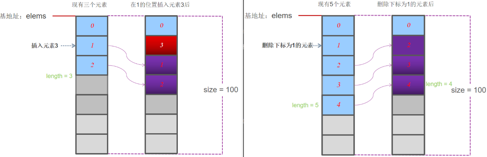
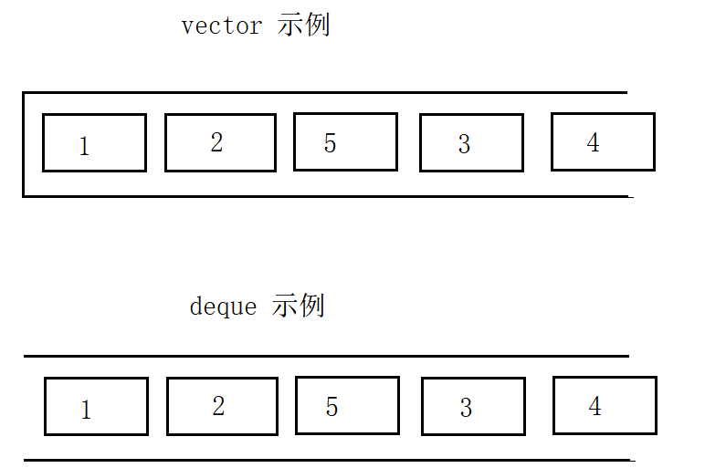
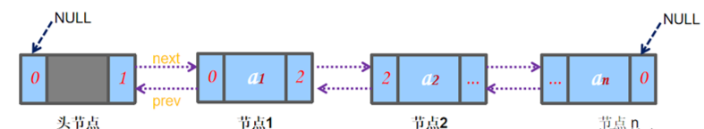
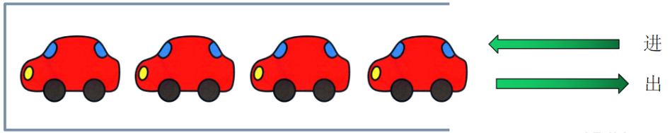

# 简单的学习以下C++的STL

## 基本概念：

STL主要分为分为三类：

- algorithm（算法）  -   对数据进行处理(解决问题)步骤的有限集合

- container（容器）  -   用来管理一组数据元素

- Iterator  (迭代器) -   可遍历STL容器内全部或部分元素的对象

**容器**

\<vector\>,\<list\>,\<deque\>,\<set\>,\<map\>,\<stack\> 和\<queue\>

| 数据结构            | 描述                                                                 | 实现头文件   |
|---------------------|----------------------------------------------------------------------|--------------|
| 向量(vector)        | 连续存储的元素                                                       | `<vector>`    |
| 列表(list)          | 由节点组成的双向链表，每个结点包含着一个元素                         | `<list>`      |
| 双向队列(deque)     | 连续存储的指向不同元素的指针所组成的数组                             | `<deque>`     |
| 集合(set)           | 由节点组成的红黑树，每个节点都包含着一个元素，节点之间以某种作用于元素对的谓词排列，没有两个不同的元素能够拥有相同的次序 | `<set>`       |
| 多重集合(multiset)  | 允许存在两个次序相等的元素的集合                                     | `<set>`       |
| 栈(stack)           | 后进先出的元素的排列                                                 | `<stack>`     |
| 队列(queue)         | 先进先出的元素的排列                                                 | `<queue>`     |
| 优先队列(priority_queue) | 元素的次序是由作用于所存储的值对上的某种优先级决定的一种队列 | `<queue>`     |
| 映射(map)           | 由(键，值)对组成的集合，以某种作用于键对上的谓词排列                 | `<map>`       |
| 多重映射(multimap)  | 允许键对有相等的次序的映射                                           | `<map>`       |


## Vector容器

vector是将元素置于一个动态数组中加以管理的容器。

vector可以随机存取元素,支持索引值直接存取， 用[]操作符或at()方法对元素进行操作



vector尾部添加或移除元素非常快速。但是在中部或头部插入元素或移除元素比较费时

**构造**

```cpp
vector(beg,end);//构造函数将[beg, end)区间中的元素拷贝给本身。注意该区间是左闭右开的区间
vector(n,elem); //构造函数将n个elem拷贝给本身
vector(const vector &v1);  //拷贝构造函数


#include<iostream>
#include<vector>
using namespace std;

int main(){
    vector<int> v1; //默认构造
    cout<<"v1 的元素个数: "<<v1.size()<<endl;
	cout<<"v1 容器的大小："<<v1.capacity()<<endl;

    vector<int> v2(10);  //构造时就分配空间，同时插入10个元素，元素为0
    cout<<"v2 的元素个数: "<<v2.size()<<endl;
	cout<<"v2 容器的大小："<<v2.capacity()<<endl;

    for(int i=0; i<v2.size(); i++){
		cout<<v2[i]<<" ";
	}
    cout<<endl;


    vector<int> v3(10, 666);  //构造时就分配空间，同时插入10个元素，元素为666
    cout<<"v3 的元素个数: "<<v3.size()<<endl;
	cout<<"v3 容器的大小："<<v3.capacity()<<endl;

    for(int i=0; i<v3.size(); i++){
		cout<<v3[i]<<" ";
	}
    cout<<endl;


    int test[]={1, 2, 3, 4, 5};
	vector<int> v4(test, test+2);  //构造函数将[beg, end)区间中的元素拷贝给本身。注意该区间是左闭右开的区间

    cout<<"v4 的元素个数: "<<v4.size()<<endl;
	cout<<"v4 容器的大小："<<v4.capacity()<<endl;

    for(int i=0; i<v4.size(); i++){
		cout<<v4[i]<<" ";
	}
    cout<<endl;

    return 0;
}
```

**vector的基本操作(比较常用的)**

```cpp
// vector 的赋值-------------------
v2.assign(2, 888);               //第一种玩法  改变原来vector 中的元素个数和值(个数比变成2个，值都是888)
v2.assign(v3.begin(), v3.end()); //第二种玩法，使用迭代器重新赋值
int test1[]={1, 2, 3, 4, 5};
v2.assign(test1, test1+3);       //第三种玩法，使用指针赋值
v2 = v3;                         //第四种玩法，赋值运算

// vector的大小-------------------
vector.size();       //返回容器中元素的个数
vector.empty();      //判断容器是否为空

//vector末尾的添加移除操作 --------------
v2.push_back(1);    //在容器尾部加入一个元素
v2.pop_back();      //移除容器中最后一个元素

//vector的数据存取------------
v2[0] = 100;                   // 使用下标操作 
v2.at(2) = 100;                //使用at 方法 //第一和第二种方式必须注意越界
v2.front() 和 v2.back()        //接口返回的引用 v2.front() 和 v2.back() 

//vector的插入------------
vector.insert(pos,elem);      //在pos位置插入一个elem元素的拷贝，返回新数据的位置。
vector.insert(pos,n,elem);    //在pos位置插入n个elem数据，无返回值。
vector.insert(pos,beg,end);   //在pos位置插入[beg,end)区间的数据，无返回值

// vector的删除------------
v2.clear();                  //把整个vector 都干掉
v2.erase(v2.begin()+1);      //干掉单个元素
v2.erase(v2.begin(), v2.begin()+3);  //干掉多个元素
```

**基本操作：**
```cpp
#include<iostream>
#include<vector>
using namespace std;

int main(){

	vector<int> myVector = {0,1,2,3,4,5,6,7,8,9};
    vector<int> myVectorCopy = {10,11,12,13,14,15};
    cout<<"myVector 的元素个数: "<<myVector.size()<<endl;
	cout<<"myVector 容器的大小："<<myVector.capacity()<<endl;

    for(int i=0; i<myVector.size(); i++){
		cout<<myVector[i]<<" ";
	}
    cout<<endl;

    myVector.assign(2,888); //改变原来vector 中的元素个数和值(个数比变成2个，值都是888)
    for(int i=0; i<myVector.size(); i++){
		cout<<myVector[i]<<" ";
	}
    cout<<endl;

    myVector.assign(myVectorCopy.begin(),myVectorCopy.end());  //用迭代器重新赋值
    for(int i=0; i<myVector.size(); i++){
		cout<<myVector[i]<<" ";
	}
    cout<<endl;

    cout<<"myVector 的元素个数: "<<myVector.size()<<endl;       //返回容器中元素的个数
    cout<<"myVector 是否为空: "<<myVector.empty()<<endl;        //判断容器是否为空

    myVector.push_back(1000); //在容器尾部加入一个元素
    for(int i=0; i<myVector.size(); i++){
		cout<<myVector[i]<<" ";
	}
    cout<<endl;

    myVector.pop_back();      //移除容器中最后一个元素
    for(int i=0; i<myVector.size(); i++){
		cout<<myVector[i]<<" ";
	}
    cout<<endl;

    myVector.insert(myVector.begin()+1,888); //在pos位置插入一个elem元素的拷贝，返回新数据的位置。
    for(int i=0; i<myVector.size(); i++){
		cout<<myVector[i]<<" ";
	}
    cout<<endl;

    myVector.erase(myVector.begin()+1);   //干掉单个元素
    for(int i=0; i<myVector.size(); i++){
		cout<<myVector[i]<<" ";
	}
    cout<<endl;


    myVector.insert(myVector.begin()+1,5,888); //在pos位置插入n个elem数据，无返回值。
    for(int i=0; i<myVector.size(); i++){
		cout<<myVector[i]<<" ";
	}
    cout<<endl;

    myVector.erase(myVector.begin()+1,myVector.begin()+6);   //干掉多个元素(左开右闭)
    for(int i=0; i<myVector.size(); i++){
		cout<<myVector[i]<<" ";
	}
    cout<<endl;

    myVector.clear();
    cout<<"myVector 的元素个数: "<<myVector.size()<<endl;
	cout<<"myVector 容器的大小："<<myVector.capacity()<<endl;
    for(int i=0; i<myVector.size(); i++){
		cout<<myVector[i]<<" ";
	}
    cout<<endl;


    return 0;
}
```


## deuqe容器

deque是“double-ended queue”的缩写，和vector一样都是STL的容器，唯一不同的是：

deque是双端数组，而vector是单端的。



Deque 特点：

- deque在接口上和vector非常相似，在许多操作的地方可以直接替换。

- deque可以随机存取元素（支持索引值直接存取，用[]操作符或at()方法）

- **deque头部和尾部添加或移除元素都非常快速, 但是在中部安插元素或移除元素比较费时。**

**基本操作**

```cpp
//构造-------------------------------
deque(beg,end);                   //构造函数将[beg, end)区间中的元素拷贝给本身。
deque(n,elem);                    //构造函数将n个elem拷贝给本身。
deque(const deque  &deq);         //拷贝构造函数。

//deque头部和末尾的添加移除操作-------------------
deque.push_back(element);        //容器尾部添加一个数据
deque.push_front(element);       //容器头部插入一个数据
deque.pop_back();                //删除容器最后一个数据
deque.pop_front();               //删除容器第一个数据

//deque的数据存取------------------------
deqIntA[0] = 100;                  //使用下标操作
deqIntA.at(2) = 100;               // 使用at 方法
deqIntA.front() 和 deqIntA.back()  //接口返回的引用

//deque与迭代器------------------------
deque.begin();   //返回容器中第一个元素的迭代器。
deque.end();     //返回容器中最后一个元素之后的迭代器。（注意之后！！！）
deque.rbegin();  //返回容器中倒数第一个元素的迭代器。
deque.rend();    //返回容器中第一个元素之前的迭代器。 （注意之前！！！）

//deque的赋值------------------------
deque.assign(beg,end);    //将[beg, end)区间中的数据拷贝赋值给本身。注意该区间是左闭右开的区间。
deque.assign(n,elem);     //将n个elem拷贝赋值给本身。
deque& operator=(const deque &deq); //重载等号操作符
deque.swap(deq);          // 将deque与本身的元素互换

//deque的大小------------------------
deque.size();	  	//返回容器中元素的个数
deque.empty();	   	//判断容器是否为空

//deque的插入------------------------
deque.insert(pos,elem);     //在pos位置插入一个elem元素的拷贝，返回新数据的位置。
deque.insert(pos,n,elem);   //在pos位置插入n个elem数据，无返回值。
deque.insert(pos,beg,end);  //在pos位置插入[beg,end)区间的数据，无返回值

//deque的删除------------------------
deque.clear();          //移除容器的所有数据
deque.erase(beg,end);   //删除[beg,end)区间的数据，返回下一个数据的位置。
deque.erase(pos);       //删除pos位置的数据，返回下一个数据的位置。
```

很多都用不到，要记住push 迭代器，判空 getsize等基本操作

```cpp
#include<iostream>
#include<deque>

using namespace std;

int main(){

    deque<int> myDeque= {0,1,2,3,4,5,6,7,8,9};

    for(int i=0; i<myDeque.size(); i++){
		cout<<myDeque[i]<<" ";
	}
    cout<<endl;

    for(deque<int>::iterator it = myDeque.begin();it!=myDeque.end();it++){
		cout<<*it<<" ";
	}
    cout<<endl;

    //注意反向迭代器的使用 it++ 不是 -- 
    for(auto it = myDeque.rbegin();it != myDeque.rend();it++){
		cout<<*it<<" ";
	}
    cout<<endl;

    myDeque.push_back(8888); 
    myDeque.push_front(6666); 
    for(int i=0; i<myDeque.size(); i++){
		cout<<myDeque[i]<<" ";
	}
    cout<<endl;
    
    myDeque.pop_back();
    myDeque.pop_front();
    for(int i=0; i<myDeque.size(); i++){
		cout<<myDeque.at(i)<<" ";
	}
    cout<<endl;


    return 0;
}
```


## List容器

list是一个双向链表容器，可高效地进行插入删除元素。

list不可以随机存取元素，所以不支持at.(position)函数与[]操作符。可以对其迭代器执行++，但是不能这样操作迭代器：it+3



**基本操作**
```cpp
//list对象的带参数构造--------------
list(beg,end);              //将[beg, end)区间中的元素拷贝给本身。
list(n,elem);               //构造函数将n个elem拷贝给本身。
list(const list &lst);      //拷贝构造函数。

//添加移除操作--------------
list.push_back(elem);      //在容器尾部加入一个元素
list.pop_back();           //删除容器中最后一个元素
list.push_front(elem);     //在容器开头插入一个元素
list.pop_front();          //从容器开头移除第一个元素

//list的数据存取--------------
list.front();   //返回第一个元素。
list.back();    //返回最后一个元素。

//list与迭代器--------------
list.begin();   //返回容器中第一个元素的迭代器。
list.end();     //返回容器中最后一个元素之后的迭代器。（注意之后！！！）
list.rbegin();  //返回容器中倒数第一个元素的迭代器。
list.rend();    //返回容器中第一个元素之前的迭代器。 （注意之前！！！）

//list的赋值--------------
list.assign(beg,end);               //将[beg, end)区间中的数据拷贝赋值给本身。
list.assign(n,elem);                //将n个elem拷贝赋值给本身。
list& operator=(const list &lst);   //重载等号操作符。
list.swap(lst);                     //将lst与本身的元素互换。

//list的大小--------------
list.size();         //返回容器中元素的个数
list.empty();        //判断容器是否为空


//list的插入--------------
list.insert(pos,elem);     //在pos位置插入一个elem元素的拷贝，返回新数据的位置。
list.insert(pos,n,elem);   //在pos位置插入n个elem数据，无返回值。
list.insert(pos,beg,end);  //在pos位置插入[beg,end)区间的数据，无返回值。

//list的删除--------------
list.clear();          //移除容器的所有数据
list.erase(beg,end);   //删除[beg,end)区间的数据，返回下一个数据的位置。
list.erase(pos);       //删除pos位置的数据，返回下一个数据的位置。
lst.remove(elem);      //删除容器中所有与elem值匹配的元素。

//list的反序排列--------------
list.reverse();       //反转链表，比如list包含1, 2, 3, 4, 5五个元素，运行此方
```

要记住一些基本的操作，还有反序，还有迭代器 遍历

```cpp
#include<iostream>
#include<list>
using namespace std;

int main(){

    list<int> myList= {0,1,2,3,4,5,6,7,8,9};
    for(auto it = myList.begin();it!=myList.end();it++){
		cout<<*it<<" ";
	}
    cout<<endl;
    
    //错误！！
    //auto it = myList.begin();
    //cout<<*(it+2)<<endl;

    myList.reverse();
    for(auto it = myList.begin();it!=myList.end();it++){
		cout<<*it<<" ";
	}
    cout<<endl;
    myList.reverse();


    myList.push_front(6666);
    myList.push_back(8888);
    for(auto it = myList.begin();it!=myList.end();it++){
		cout<<*it<<" ";
	}
    cout<<endl;
    myList.pop_front();
    myList.pop_back();

    //不支持myList.begin() + 5 这种格式感觉有点不方便
    myList.insert(++myList.begin(),10);
    for(auto it = myList.begin();it!=myList.end();it++){
		cout<<*it<<" ";
	}
    cout<<endl;
    myList.erase(++myList.begin());
    for(auto it = myList.begin();it!=myList.end();it++){
		cout<<*it<<" ";
	}
    cout<<endl;

    list<int>::iterator itBegin=myList.begin();
	++ itBegin;
	list<int>::iterator itEnd=myList.begin();
	++ itEnd;
	++ itEnd;
	++ itEnd;
    myList.erase(itBegin,itEnd);//(左开右闭)

    for(auto it = myList.begin();it!=myList.end();it++){
		cout<<*it<<" ";
	}
    cout<<endl;

    return 0;
}
```

## Set和multiset容器

set和multiset是一个集合容器，其中set所包含的元素是唯一的，集合中的元素按一定的顺序排列。set采用红黑树变体的数据结构实现，红黑树属于平衡二叉树。在插入操作和删除操作上比vector快。在n个数中查找目标数的效率是 log2 n

**Set 和 multiset 特点**

- set中元素插入过程是按排序规则插入，所以不能指定插入位置。

- set不可以直接存取元素。（不可以使用at.(pos)与[]操作符）。

- multiset与set的区别：set支持唯一键值，每个元素值只能出现一次；而multiset中同一值可以出现多次。

- 不可以直接修改set或multiset容器中的元素值，因为该类容器是自动排序的。如果希望修改一个元素值，必须先删除原有的元素，再插入新的元素

- 头文件 #include <set> 

**基本操作：**


```cpp
//构造
set<int> setInt;                     //一个存放int的set容器。
set<float> setFloat;                 //一个存放float的set容器。
set<string> setString;               //一个存放string的set容器。
multiset<int> mulsetInt;             //一个存放int的multi set容器。
multiset<float> multisetFloat;       //一个存放float的multi set容器。
multiset<string> multisetString;     //一个存放string的multi set容器

set(beg,end);                //将[beg, end)区间中的元素拷贝给本身。
set(const set &s);           //拷贝构造函数。
multiset(beg,end);           //将[beg, end)区间中的元素拷贝给本身。
multiset(const multiset &s); //拷贝构造函数。

set(const set &st);                      //拷贝构造函数
set& operator=(const set &st);           //重载等号操作符
set.swap(st);                            //交换两个集合容器

//constructorFunc.cpp
#include<iostream>
#include<set>
using namespace std;

int main(){

    set<int> setIntA;

    setIntA.insert(5);
    setIntA.insert(1);
    setIntA.insert(2);
    setIntA.insert(3);
    setIntA.insert(4);

    set<int> setIntB(setIntA);
    set<int> setIntC;
    setIntC = setIntA;		//1 2 3 4 5 
    setIntC.insert(6);      //1 2 3 4 5 6
    setIntC.swap(setIntA);	  //交换

    for (auto it = setIntA.begin();it!=setIntA.end();it++){
        cout<<*it<<" ";
    }
    cout<<endl;

    for (auto it = setIntB.begin();it!=setIntB.end();it++){
        cout<<*it<<" ";
    }
    cout<<endl;
    
    for (auto it = setIntC.begin();it!=setIntC.end();it++){
        cout<<*it<<" ";
    }
    cout<<endl;

    return 0;
}

```

set创建的时候会有比较的过程，默认是按照升序来进行排列的，这样会调用系统自带的一些比较（double，int，float等都可以，用模板来实现）

```cpp
//以int为例子（这个不用我们自己来实现，系统会自动调用）
struct greater{
    bool operator() (const int& iLeft, const int& iRight){
        return (iLeft>iRight);   
    }
}
 
struct less{
bool operator() (const int& iLeft, const int& iRight){
       return (iLeft<iRight);    
    }
}

//greaterLess.cpp
#include<iostream>
#include<set>
using namespace std;

int main(){
    //默认的是less
    set<int,greater<int>> setIntA;

    setIntA.insert(5);
    setIntA.insert(1);
    setIntA.insert(2);
    setIntA.insert(3);
    setIntA.insert(4);

    set<int,greater<int>> setIntB(setIntA);
    set<int,greater<int>> setIntC;
    setIntC = setIntA;		//1 2 3 4 5 
    setIntC.insert(6);      //1 2 3 4 5 6
    setIntC.swap(setIntA);	  //交换

    for (auto it = setIntA.begin();it!=setIntA.end();it++){
        cout<<*it<<" ";
    }
    cout<<endl;

    for (auto it = setIntB.begin();it!=setIntB.end();it++){
        cout<<*it<<" ";
    }
    cout<<endl;
    
    for (auto it = setIntC.begin();it!=setIntC.end();it++){
        cout<<*it<<" ";
    }
    cout<<endl;

    return 0;
}
```

如果碰到一些无法比较的，我们自己定义的结构的话就会出问题，比如类 结构体等，这个时候需要我们自己定义比较函数

```cpp
#include<iostream>
#include <set>
using namespace std;

class Student{
private:
    //主要是为了比较，name啥的属性就不写了
    int age;
public:

    Student(int age){
        this->age = age;
    }

    int getAge() const{
        return this->age;
    }

    bool operator < (const Student & right) const{
        return this->getAge() < right.getAge();
    }

    bool operator > (const Student & right) const{
        return this->getAge() > right.getAge();
    }

};

int main(){

    set<Student>  setStuLess;  //相当于 set<student,less<student>> （student之中定义了比较函数）
    setStuLess.insert(Student(20));
    setStuLess.insert(Student(18));
    setStuLess.insert(Student(19));
    setStuLess.insert(Student(19));   //这个插入无效，但是没有报错，这里一定要注意
    for(auto it =  setStuLess.begin();it!=setStuLess.end();it++){
        cout<<it->getAge()<<" ";
    }
    cout<<endl;


    set<Student,greater<Student>>  setStuGreater;  //相当于 set<student,less<student>> （student之中定义了比较函数）
    setStuGreater.insert(Student(20));
    setStuGreater.insert(Student(18));
    setStuGreater.insert(Student(19));
    for(auto it =  setStuGreater.begin();it!=setStuGreater.end();it++){
        cout<<it->getAge()<<" ";
    }
    cout<<endl;

    return 0;
}
```

set插入：insert，返回一个pair   pair\<set\<int\>::iterator, bool\>

```cpp
#include<iostream>
#include<set>
using namespace std;

int main(){

    set<int>  setInt;
	for(int i=5; i>0; i--){
		pair<set<int>::iterator, bool> ret = setInt.insert(i);
		if(ret.second){
			cout<<"插入 "<<i<<" 成功！"<<endl;
            cout<<*ret.first<<endl;
		}else {
			cout<<"插入 "<<i<<" 失败！"<<endl;
		}
	}

    for(int i=0; i<5; i++){
		pair<set<int>::iterator, bool> ret = setInt.insert(i);
		if(ret.second){
			cout<<"插入 "<<i<<" 成功！"<<endl;
            cout<<*ret.first<<endl;
		}else {
			cout<<"插入 "<<i<<" 失败！"<<endl;
		}
	}

    return 0;
}
```


set迭代器
```cpp
set.begin();   //返回容器中第一个元素的迭代器。
set.end();     //返回容器中最后一个元素之后的迭代器。（注意之后！！！）
set.rbegin();  //返回容器中倒数第一个元素的迭代器。
set.rend();    //返回容器中第一个元素之前的迭代器。 （注意之前！！！）
```

set/multiset的大小
```cpp
set.size(); //返回容器中元素的数目
set.empty();//判断容器是否为空
```

set/multiset的删除
```cpp
set.clear();             //清除所有元素
set.erase(pos);     //删除pos迭代器所指的元素，返回下一个元素的迭代器。
set.erase(beg,end);   //删除区间[beg,end)的所有元素，返回下一个元素的迭代器。
set.erase(elem);     //删除容器中值为elem的元素。
```

set/multiset的查找 !!!!!!!
```cpp
set.find(elem);   //查找elem元素，返回指向elem元素的迭代器。
set.count(elem);   //返回容器中值为elem的元素个数。对set来说，要么是0，要么是1。对multiset来说，值可能大于1。
set.lower_bound(elem);  //返回第一个>=elem元素的迭代器。
set.upper_bound(elem);    //  返回第一个>elem元素的迭代器。
set.equal_range(elem);         //返回容器中与elem相等的上下限的两个迭代器。上限是闭区间，下限是开区间，如[beg,end)。以上函数返回两个迭代器，而这两个迭代器被封装在pair中。

//setFind.cpp
#include<iostream>
#include<set>
using namespace std;

int main(){

    set<int>  setInt;
    setInt.insert(1);
    setInt.insert(2);
    setInt.insert(3);
    setInt.insert(4);
    setInt.insert(5);

    set<int>::iterator it1 = setInt.find(4);
    cout<<*it1<<endl;

    int iCount = setInt.count(3);
    cout<<iCount<<endl;
    iCount = setInt.count(100);	
    cout<<iCount<<endl;


    set<int>::iterator it2 = setInt.lower_bound(3);
    set<int>::iterator it3 = setInt.upper_bound(3);
    cout<<*it2<<"  "<<*it3<<endl;

    pair< set<int>::iterator, set<int>::iterator > pairIt = setInt.equal_range(4);  
    cout<<*pairIt.first<<"  "<<*pairIt.second<<endl;

    return 0;
}
```

## Map和multimap容器

map是标准的关联式容器，一个map里存储的元素是一个键值对序列，叫做(key,value)键值对。它提供基于key快速检索数据的能力。

- map中key值是唯一的。集合中的元素按一定的顺序排列。元素插入过程是按排序规则插入，所以不能指定插入位置。

- map底层的具体实现是采用红黑树变体的平衡二叉树的数据结构。在插入操作、删除和检索操作上比vector快很多。

- map可以直接存取key所对应的value，支持[]操作符，如map[key]=value。

- #include <map>

**multimap与map的区别：**

map支持唯一键值，每个键只能出现一次；而multimap中相同键可以出现多次。multimap不支持[]操作符。

**构造**

```cpp
map/multimap采用模板类实现，对象的默认构造形式：
map<T1,T2> map TT;
multimap<T1,T2>  multimap TT; 
如：
map<int, char> mapA;
map<string,float> mapB;
```

**map和multimap对象的带参数构造**
```cpp
map(beg,end);     //将[beg, end)区间中的元素拷贝给本身。
map(const map &mapObject); //拷贝构造函数。
```

**map的插入与迭代器**
```cpp
map.insert( pair<int,string>(1,"张三") );    //往容器插入元素，返回pair<iterator,bool>
//方式一、通过pair的方式插入对象
mapStu.insert(  pair<int,string>(1,"张三")  );
//方式二、通过pair的方式插入对象
mapStu.inset(make_pair(2, “李四”));
//方式三、通过value_type的方式插入对象
mapStu.insert(  map<int,string>::value_type(3,"王五")  );
//方式四、通过数组的方式插入值
mapStu[4] = "赵六";
mapStu[5] = "小七"；


#include<iostream>
#include<map>
using namespace std;

int main(){

    map<int,string> mapStu;

    mapStu.insert( pair<int,string>(1,"张三") );    //往容器插入元素，返回pair<iterator,bool>
    //方式一、通过pair的方式插入对象
    mapStu.insert(  pair<int,string>(1,"张三")  );
    //方式二、通过pair的方式插入对象
    mapStu.insert(make_pair(2, "李四"));
    //方式三、通过value_type的方式插入对象
    mapStu.insert(  map<int,string>::value_type(3,"王五")  );
    //方式四、通过数组的方式插入值
    mapStu[4] = "赵六";
    mapStu[5] = "小七";

    for(auto it=mapStu.begin();it!=mapStu.end();it++){
        cout<<it->first<<" "<<it->second<<endl;
    }


    return 0;
}

```


- 前三种方法，采用的是insert()方法，该方法返回值为pair<iterator,bool>

- 第四种方法非常直观，但碰到相同的键时会进行覆盖操作。比如插入key 为4的键值时，先在mapStu中查找主键为4的项，若不存在，则将一个键为4，值为默认初始化值的对组插入到mapStu中，然后再将值修改成“赵六”。若发现已存在4这个键，则修改这个键对应的value。

- string strName = mapStu[8];   //取值操作或插入操作

- 只有当mapStu存在8这个键时才是正确的取操作，否则会自动插入一个实例，键为8，值为默认构造时的初始化值。


**迭代器**
```cpp
set.begin();   //返回容器中第一个元素的迭代器。
set.end();     //返回容器中最后一个元素之后的迭代器。（注意之后！！！）
set.rbegin();  //返回容器中倒数第一个元素的迭代器。
set.rend();    //返回容器中第一个元素之前的迭代器。 （注意之前！！！）

```

**map/multimap 排序**
```cpp
map<T1,T2,less<T1> >  mapA;    //该容器是按键的升序方式排列元素。未指定函数对象，默认采用less<T1>函数对象。
map<T1,T2,greater<T1>> mapB;   //该容器是按键的降序方式排列元素。
less<T1>与greater<T1>          ///可以替换成其它的函数对象functor。
//可编写自定义函数对象以进行自定义类型的比较，使用方法与set构造时所用的函数对
```

**map对象的拷贝构造与赋值**
```cpp
map(const map &mp);                     //拷贝构造函数
map& operator=(const map &mp);          //重载等号操作符
map.swap(mp);                           //交换两个集合容器
```


**map的大小**
```cpp
map.size();     //返回容器中元素的数目
map.empty();    //判断容器是否为空
```


**map的删除**
```cpp
map.clear();          //删除所有元素
map.erase(pos);     //删除pos迭代器所指的元素，返回下一个元素的迭代器。
map.erase(beg,end);//删除区间[beg,end)的所有元素 ，返回下一个元素的迭代器。
map.erase(key);     //删除容器中key为key的对组,返回删除的对组个数
Map.erase(key_type *first, key_type *last)  //删除数组指定的半闭半开的区间中特定的key对应的所有队组
```

**map/multimap的查找**
```cpp
map.find(key);    //查找键key是否存在，若存在，返回该键的元素的迭代器；若不存在，返回map.end();
map.count(key);   //返回容器中键值为key的对组个数。对map来说，要么是0，要么是1;对multimap来说，值>=0。
map.lower_bound(keyElem);  //返回第一个key>=keyElem元素的迭代器。
map.upper_bound(keyElem);  // 返回第一个key>keyElem元素的迭代器。
map.equal_range(keyElem);  //返回容器中key与keyElem相等的上下限的两个迭代器。上限是闭区间，下限是开区间，如[beg,end)。
```

许多用法基本上和set是一样的

## Queue容器（队列的 先进先出）

queue是队列容器，是一种“先进先出”的容器。

- 默认情况下queue是利用deque容器实现的一种容器。
  
- 它只允许在队列的前端（front）进行删除操作，而在队列的后端（back）进行插入操作

- #include <queue>

**基本用法（都比较常规）**
```cpp
//构造------
queue采用模板类实现，queue对象的默认构造形式：queue<T> queT;  如：
queue<int> queueInt;             //一个存放int的queue容器。
queue<float> queueFloat;         //一个存放float的queue容器。
queue<string> queueString;       //一个存放string的queue容器。

queue<int, list<int>> queueList;        //内部使用list 来存储队列元素的queue 容器.
错误: queue<int, vector<int>> queueList; //内部不能使用vector来存储队列元素     

queue(const queue &que);                 //拷贝构造函数
queue& operator=(const queue &que);      //重载等号操作符


// queue的push()与pop()方法---------
queue.push(elem);   //往队尾添加元素
queue.pop();       //从队头处移除队首元素


//queue的数据存取----------
queue.back();   //返回最后一个元素
queue.front();   //返回第一个元素

//queue的大小-----
queue.empty();   //判断队列是否为空
queue.size();      //返回队列的大小


```

注意点：queue基本上不使用迭代器来遍历

- 可以使用底层的实现来迭代器遍历 如：使用deque实现的队列，可以直接对deque使用迭代器遍历，但是非常不推荐(这个理论上是可以的，但是GPT里面生成的代码也有问题)

```cpp
#include<iostream>
#include<queue>
using namespace std;

int main(){
    queue<int> q;
    q.push(1);
    q.push(2);
    q.push(3);
    q.push(4);

    //遍历 用一个tempQueue先存储一下，然后再push进取
    queue<int> tempQueue;
    while (!q.empty()) {
        int frontElement = q.front();
        cout << frontElement << " ";
        tempQueue.push(frontElement);
        q.pop();
    }
    cout << endl;
    // 将元素再压回原队列
    while (!tempQueue.empty()) {
        q.push(tempQueue.front());
        tempQueue.pop();
    }

    return 0;
}

//方法二:非常非常巧妙，利用函数的形参，来拷贝一份queue，对拷贝的queue进行pop不会影响u
//原来的queue，并且函数结束之后还会释放调拷贝的queue，

void traverseQueue(queue<int> q) { // 传值创建副本
    while (!q.empty()) {
        cout << q.front() << " ";
        q.pop(); // 弹出副本元素，不影响原队列
    }
    cout<<endl;
}

//最推荐的，不耗费内存
void traverse(std::queue<int>& q) {
    int size = q.size();
    for (int i = 0; i < size; ++i) {
        int element = q.front();  // 获取队首元素
        q.pop();                   // 弹出元素
        std::cout << element << " "; // 处理元素（此处为打印）
        q.push(element);           // 重新插入队尾
    }
    cout<<endl;
}

```

## 优先级队列priority_queue

英雄联盟游戏里面防御塔都有一个自动攻击功能，小兵排着队进入防御塔的攻击范围，防御塔先攻击靠得最近的小兵，这时候大炮车的优先级更高（因为系统判定大炮车对于防御塔的威胁更大），所以防御塔会优先攻击大炮车。而当大炮车阵亡，剩下的全部都是普通小兵，这时候离得近的优先级越高，防御塔优先攻击距离更近的小兵。

优先队列： 它的入队顺序没有变化，但是出队的顺序是根据优先级的高低来决定的。优先级高的优先出队。

- 最大值优先级队列、最小值优先级队列  

- 用来开发一些特殊的应用

- #include <queue>

```cpp
#include<iostream>
#include<queue>
using namespace std;

int main(){

	priority_queue<int, deque<int>, greater<int>> pqA;  //使用deque 值越小，优先级越大
    pqA.push(1);
	pqA.push(2);
	pqA.push(3);
	pqA.push(3);
	pqA.push(4);
	pqA.push(5);
	pqA.push(3);

    while(!pqA.empty()){
            cout<<pqA.top()<<" ";//读取队首的元素,但元素不出列
            pqA.pop();           //出队列
    }

	cout<<endl;

    return 0;
}
```

## stack容器 (栈，先进后出)

stack是堆栈容器，是一种“先进后出”的容器。



- stack是基于deque容器而实现的容器。

- #include <stack> 

基本操作：

```cpp
//尖括号内还可以设置指针类型或自定义类型。
stack的push()与pop()方法
stack.push(elem);   //往栈头添加元素
stack.pop();        //从栈头移除第一个元素
stack<int> stkInt;        
stkInt.push(1);
stkInt.push(2);
stkInt.pop();  
stkInt.push(3);
此时stkInt存放的元素是1, 3
 
stack对象的拷贝构造与赋值
stack(const stack &stk);             //拷贝构造函数
stack& operator=(const stack &stk);     //重载等号操作符
stack<int> stkIntA;
stkIntA.push(1);
stkIntA.push(2);
stkIntA.push(3);
stack<int> stkIntB(stkIntA);         //拷贝构造
stack<int> stkIntC;
stkIntC = stkIntA;                       //赋值
 
stack的数据存取
stack.top();       //返回最后一个压入栈元素
stack<int> stkIntA;
stkIntA.push(1);
stkIntA.push(2);
stkIntA.push(3);
int iTop = stkIntA.top();        //3
stkIntA.top() = 88;               //88
 
stack的大小
stack.empty();   //判断堆栈是否为空
stack.size();        //返回堆栈的大小
stack<int> stkInt;
stkInt.push(1);
stkInt.push(2);
stkInt.push(3);
int iSize = stkInt.size();         //3

```


## Array容器

array是将元素置于一个固定数组中加以管理的容器。

array可以随机存取元素,支持索引值直接存取， 用[]操作符或at()方法对元素进行操作，也可以使用迭代器访问

不支持动态的新增删除操作

array可以完全替代C语言中的数组，使操作数组元素更加安全！

基本操作
```cpp
//构造
//<类型，大小>
array<int, 6> a1;     //一个存放int的array容器
array<float, 6> a2;   //一个存放float的array容器
array<student, 6> a3; //一个存放student的array容器
array<int, 6> a1={1,2,3,4,5,6}; //定义时同时初始化
 
//arra的赋值
array 的赋值
a2.assign(0);//第一种玩法  改变原来array中的所有元素的值
array<int, 6> a1 = {1, 2, 3};
array<int, 6> a2 ;
a2 = a1;    //第二种玩法 赋值运算，将a1 赋值给a2

//array的大小
array.size();        //返回容器中元素的个数
array.max_size(); //返回容器中最大的元素个数，与size 等同
array.empty();   //判断容器是否为空

//存取
a1[0] = 100; //第一  使用下标操作
a1.at(2) = 100; //第二  使用at 方法 如: 
a2.front() 和 a2.back() //第三  接口返回的引用 
a1.data()  //第四  返回内建数组的指针 

```

# algorithm

## 查找

find、find_if、find_first_of、adjacent_find、search、binary_search、lower_bound、upper_bound、equal_range

# C++ 查找算法速查表

| 函数             | 作用                                                                 |
|------------------|----------------------------------------------------------------------|
| `find`           | 在范围内线性查找**指定值**的首次出现                                 |
| `find_if`        | 查找第一个满足**谓词条件**的元素                                     |
| `find_first_of`  | 查找范围内**任意匹配指定集合**的元素                                 |
| `adjacent_find`  | 查找**相邻重复元素**的首次出现                                       |
| `search`         | 在范围内查找**子序列**的首次出现                                     |
| `binary_search`  | 在有序范围内通过二分查找**判断值是否存在**（返回布尔值）             |
| `lower_bound`    | 在有序范围中找**第一个不小于目标值**的位置（下界）                   |
| `upper_bound`    | 在有序范围中找**第一个大于目标值**的位置（上界）                     |
| `equal_range`    | 在有序范围中**同时获取目标值的下界和上界**，返回区间范围             |

---

### 关键特性
- **线性查找**：`find`/`find_if`/`find_first_of`/`adjacent_find`/`search`（时间复杂度 O(n)）
- **二分查找**：`binary_search`/`lower_bound`/`upper_bound`/`equal_range`（要求有序范围，时间复杂度 O(log n)）
- **边界定位**：`lower_bound` + `upper_bound` = `equal_range`
- **模式匹配**：`search` 用于子序列定位，`find_first_of` 用于集合元素匹配


```cpp
#include<iostream>
#include <vector>
#include <algorithm>
#include <iterator>

using namespace std;

int main(){
    vector<int> data = {5, 3, 3, 7, 2, 8, 3, 9, 1, 3, 8, 6, 4};
    vector<int> subset = {3, 9, 1};

    // find() 函数，返回迭代器（指针|位置），其指向的是在 [first, last) 区域内查找到的第一个目标元素；如果查找失败，则该迭代器的指向和 last 相同。
    auto it_find = find(data.begin(), data.end(),8);
    if (it_find != data.end()){
        cout << "find(8) at pos: " << distance(data.begin(), it_find) << endl; // 输出: 5
    }

    //find_if()、find_if_not() 函数，根据指定的【查找规则】进行查找，在指定区域内查找第一个符合该函数要求（使函数返回 true）的元素
    auto it_find_if = find_if(data.begin(), data.end(), [](int x){return x > 7;});
    if (it_find_if != data.end()){
        cout << "find_if(>7): " << *it_find_if << " at pos: " << distance(data.begin(), it_find_if) << endl; // 输出: 7 at pos:5
    }
    
    // find_first_of() 函数，查找范围A中第一个与范围B中【任一元素】等价的元素的位置
    auto it_first_of = find_first_of(data.begin(), data.end(), subset.begin(), subset.end());
    if (it_first_of != data.end()){
        cout << "find_first_of(subset) at pos: " << distance(data.begin(), it_first_of) << endl; // 输出:1
    }

    // adjacent_find() 函数，查找两个相邻（adjacent）的等价（identical）元素
    auto it_adj = adjacent_find(data.begin(), data.end());
    if (it_adj != data.end()){
        cout << "adjacent_find: " << *it_adj << " at pos: " << distance(data.begin(), it_adj) << endl; // 输出:3 at pos:5
    }
    
    // 查找子串
    auto it_search = search(data.begin(), data.end(), subset.begin(), subset.end());
    if (it_search != data.end()){
        cout << "search(subset) at pos: " << distance(data.begin(), it_search) << endl; // 输出:6
    }

    // 对有序区间操作
    sort(data.begin(), data.end()); // 排序为:1 2 3 3 3 3 4 5 6 7 8 8 9

    // binary_search: 检查元素是否存在
    bool exists = binary_search(data.begin(), data.end(), 6);
    cout << "binary_search(6): " << boolalpha << exists << endl; // 输出:true

    //lower_bound: 第一个>=5的位置
    auto it_low = lower_bound(data.begin(), data.end(), 5);
    cout << "lower_bound(5) at pos: " << distance(data.begin(), it_low) << endl; // 输出:7

    //upper_bound: 第一个>8的位置
    auto it_high = upper_bound(data.begin(), data.end(), 8);
    cout << "upper_bound(8) at pos: " << distance(data.begin(), it_high) << endl; // 输出:12

    //equal_range: 查找3的范围
    auto eq_pair = equal_range(data.begin(), data.end(), 3);
    cout << "equal_range(3): [" << distance(data.begin(), eq_pair.first) 
         << "," << distance(data.begin(), eq_pair.second) << ")" << endl; // 输出:[2,5)
    
}
```