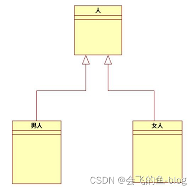
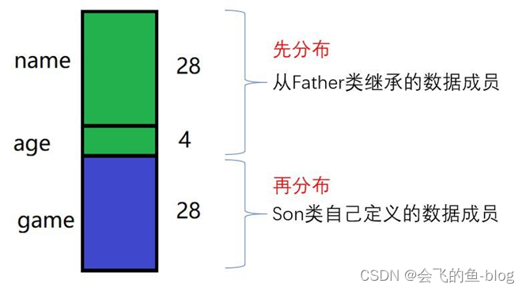
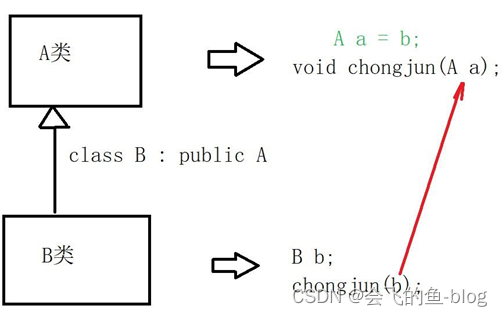
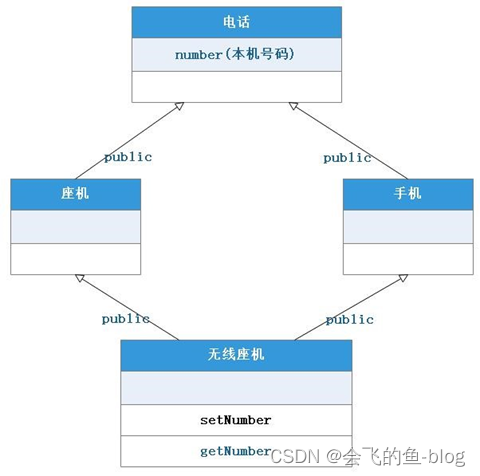

# C++类
**资料**

https://blog.csdn.net/m0_65635427/article/details/132167140?ops_request_misc=%257B%2522request%255Fid%2522%253A%25220ab0fd1216bb98b226c2b7065f969166%2522%252C%2522scm%2522%253A%252220140713.130102334..%2522%257D&request_id=0ab0fd1216bb98b226c2b7065f969166&biz_id=0&utm_medium=distribute.pc_search_result.none-task-blog-2~all~top_positive~default-1-132167140-null-null.142^v102^pc_search_result_base4&utm_term=C%2B%2B%E5%AD%A6%E4%B9%A0&spm=1018.2226.3001.4187

## 基本的小概念

**面向过程**：根据程序的执行过程，来设计软件的所有细节。开发大型项目时，越来越难以把控，甚至失去控制。后期维护、更新成本很大。

**类的使用**

面向对象编程，最重要的第一个概念：类

“人类”是一个抽象的概念，不是具体的某个人。

“类”，是看不见，摸不着的，是一个纯粹的概念.

“类”，是一种特殊的“数据类型”，不是一个具体的数据。

注意：类， 和基本数据类型（char/int/short/long/long long/float/double）不同类的构成：方法和数据

类是由：方法 + 数据 构成的

**对象**

对象，是一个特定“类”的具体实例。

一般地，一个对象，就是一个特殊的变量，但是有跟丰富的功能和用法。

## 类的构造函数

在创建一个新的对象时，自动调用的函数，用来进行“初始化”工作：对这个对象内部的数据成员进行初始化

构造函数的特点：

1. 自动调用（在创建新对象时，自动调用）

2. 构造函数的函数名，和类名相同

3. 构造函数没有返回类型

4. 可以有多个构造函数（即函数重载形式）
   
5. 没有参数的构造函数为默认构造函数

**默认构造函数**

注意：没有手动定义默认构造函数时，编译器自动为这个类定义一个构造函数。

如果数据成员使用了“类内初始值”，就使用这个值来初始化数据成员。【C++11】
```cpp
public:
    int age = 18; //在定义类的属性的时候就直接初始化，就是类内初始值
```
否则，就使用默认初始化（实际上，不做任何初始化）

只要手动定义了任何一个构造函数，编译器就不会生成“合成的默认构造函数” 一般情况下，都应该定义自己的构造函数，不要使用“合成的默认构造函数”【仅当数据成员全部使用了“类内初始值”，才宜使用“合成的默认构造函数”

一个典型案例

```cpp
#include<iostream>
#include<string>
using namespace std;

class Human {
private:
    string name; 
    int age;
    int salary;

public:
    Human(); //构造函数
    
    void eat(); //方法， “成员函数”
    void sleep(); 
    void play(); 
    void work();
 
    string getName(); 
    int getAge(); 
    int getSalary();

};


Human::Human() { 
    name = "无名氏"; 
    age = 18; 
    salary = 30000;
}
 
void Human::eat() {
    cout << "吃炸鸡，喝啤酒！" << endl;
}
 
void Human::sleep() { 
    cout << "我正在睡觉!" << endl;
}
 
void Human::play() { 
    cout << "我在唱歌! " << endl; }
 
void Human::work() { 
    cout << "我在工作..." << endl;
}
 
string Human::getName() { 
    return name;
}
 
int Human::getAge() { 
    return age;
}
 
int Human::getSalary() { 
    return salary;
} 


int main(){

    Human	h1;	// 使用自定义的默认构造函数
    cout << "姓名：" << h1.getName() << endl; 
    cout << "年龄: " << h1.getAge() << endl; 
    cout << "薪资：" << h1.getSalary() << endl;

    return 0;
}

```

**重载构造函数**

对构造函数进行重载(传入的参数的数量和类型不同等)

对上面案例进行修改：

```cpp

    Human(int age, int salary); //重载构造函数

    Human::Human(int age, int salary) {
        cout << "调用自定义的构造函数" << endl; 
        this->age = age;	//this 是一个特殊的指针，指向这个对象本身 
        this->salary = salary;
        name = "无名";
    }

```

如果某数据成员使用类内初始值，同时又在构造函数中进行了初始化，那么以构造函数中的初始化为准。相当于构造函数中的初始化，会覆盖对应的类内初始值。

**拷贝构造函数**

**浅拷贝**:简单的赋值拷贝操作

1. 浅拷贝指的是对象的逐位复制：

2. 当一个对象被浅拷贝时，所有的成员变量都会直接复制其值，包括指针类型的成员变量。

3. 对于指针成员，浅拷贝只复制指针的值（即内存地址），而不复制指针所指向的数据。这意味着原对象和拷贝对象的指针成员将指向同一块内存地址。

**第二点和第三点尤其要注意**，这是浅拷贝的重大隐患，也就是说，指针数据 浅拷贝 只会简单的拷贝指针所指向的地址，而不是指针内部所存储的地址的内容，如果，因此就会出现修改两个不同的对象的属性，反而是的修改之后的属性相同（也就是说两个或者多个对象共享了同一个地址），这样也会出现另外一个重要的问题，就是说，在析构函数的时候如果要释放掉这些指针，就会导致**多重释放**。会出现异常！！！！！

简单样例

```cpp
// 这代码是有问题的，没做析构，没释放内存！！！
#include <iostream>
#include <string>
#include <cstring>
 
using namespace std;
 
// 定义一个“人类”
class Human { 
public:
    Human();
    Human(int age, int salary);
	//Human(const Human&);	//不定义拷贝构造函数，编译器会生成“合成的拷贝构造函数”
 
    void eat(); 
    void sleep();
    void play(); 
    void work();
 
    string getName(); 
    int getAge(); 
    int getSalary();

    void setAddr(const char *newAddr); 
    const char* getAddr();
 
private:
    string name = "Unknown"; 
    int age = 28;
    int salary; 
    char *addr;
};
 
Human::Human() { 
    name = "无名氏"; 
    age = 18; 
    salary = 30000;
}
 
Human::Human(int age, int salary) {
    cout << "调用自定义的构造函数" << endl; 
    this->age = age;	//this 是一个特殊的指针，指向这个对象本身 
    this->salary = salary;
    name = "无名";
    addr = new char[64]; 
    strcpy(addr, "China");
}
 
void Human::eat() {
    cout << "吃炸鸡，喝啤酒！" << endl;
}
 
void Human::sleep() { 
    cout << "我正在睡觉!" << endl;
}
 
void Human::play() {     
    cout << "我在唱歌! " << endl;
}
 
void Human::work() { 
    cout << "我在工作..." << endl; 
}
 
string Human::getName() { 
    return name;
}
 
int Human::getAge() { 
    return age;
}
 
int Human::getSalary() { 
    return salary;
}

void Human::setAddr(const char *newAddr) { 
    if (!newAddr) { 
        return;
    }
    strcpy(addr,newAddr);
}
 
const char* Human::getAddr() { 
    return addr;
}

int main(void) {
    Human	h1(25, 35000);	// 使用自定义的默认构造函数 
    Human	h2(h1);	// 使用自定义的拷贝构造函数
 
    cout << "h1 addr:" << h1.getAddr() << endl; 
    cout << "h2 addr:" << h2.getAddr() << endl; 
    h1.setAddr("长沙");
    cout << "h1 addr:" << h1.getAddr() << endl; 
    cout << "h2 addr:" << h2.getAddr() << endl;

    
    return 0;
}

结果：
调用自定义的构造函数
h1 addr:China
h2 addr:China
h1 addr:长沙
h2 addr:长沙
```

**深拷贝**:在堆区重新申请空间，进行拷贝操作

1. 深拷贝不仅复制对象的值，还复制指针指向的数据：

2. 当进行深拷贝时，不仅对象的基本成员变量被复制，对于指针类型的成员变量，还会动态分配一块新的内存，复制原对象指针指向的内容到新分配的内存中。

3. 这样，原对象和拷贝对象的指针成员就分别指向不同的内存地址，互不干扰。这避免了浅拷贝中的资源竞争或双重释放等问题。

样例：

```cpp
	Human(const Human&); //声明
    //实现
    Human::Human(const Human &man) { 
        cout << "调用自定义的拷贝构造函数" << endl; 
        age = man.age;	//this 是一个特殊的指针，指向这个对象本身 
        salary = man.salary; 
        name = man.name;

        // 深度拷贝
        addr = new char[64]; 
        strcpy(addr,man.addr);
    }

结果:
调用自定义的构造函数
调用自定义的拷贝构造函数
h1 addr:China
h2 addr:China
h1 addr:长沙
h2 addr:China
```

**赋值构造函数** 对=进行重载

```cpp
    Human& operator=(const Human &);
    Human& Human::operator=(const Human &man) { 
        cout << "调用" << __FUNCTION__ << endl; 

        if (this == &man) { 
            return *this; //检测是不是对自己赋值：比如 h1 = h1;
        }
        
        // 深拷贝
        strcpy(addr, man.addr);
    
        // 处理其他数据成员
        name = man.name; 
        age = man.age; 
        salary = man.salary;
    
        // 返回该对象本身的引用， 以便做链式连续处理，比如 a = b = c; 
        return *this;
    }

```

如果没有定义赋值构造函数，编译器会自动定义“合成的赋值构造函数”，与其他合成的构造函数，是“浅拷贝”（又称为“位拷贝”）。

## 类的析构函数

作用：对象销毁前，做清理工作。

1. 具体的清理工作，一般和构造函数对应

2. 比如：如果在构造函数中，使用 new 分配了内存，就需在析构函数中用 delete 释放。

3. 如果构造函数中没有申请资源（主要是内存资源），那么很少使用析构函数。
如果不定义，编译器会自动生成一个析构函数（什么也不做）

4. 没有返回值，没有参数，最多只能有一个析构函数（**析构函数不能重载**）

5. 访问权限一般是public，并且不可以主动调用，一般是对象销毁时，自动调用。

6. 如果不定义，编译器会自动生成一个析构函数（什么也不做）

类的构造函数中的那几个例子，就需要我们手动创建析构函数对申请的内存空间进行释放

```cpp
Human::~Human(){
    cout<<"调用了析构函数！"<<endl;
    delete [] addr;   //释放调内存
}
```
## this指针

1. 定义：this 是一个指向类实例本身的指针，它在成员函数内部自动定义并可用。

2. 类型：this 的类型是指向当前类类型的指针。例如，在类 MyClass 的成员函数内部，this 的类型是 MyClass*。

3. 访问：虽然不需要显式地传递 this 指针给成员函数，但可以在函数体内通过 this 来访问类的成员。

4. 自动传递：当调用一个对象的成员函数时，不需要显式地传递 this 指针。编译器会自动处理它。this 指针作为隐藏参数传递给成员函数，使得成员函数能够知道它属于哪个对象。

5. 用途：this 指针主要用于以下几种情况：
   
   - 访问调用对象的成员变量和成员函数。
  
   - 返回当前对象的引用或指针（如链式调用）。

   - 在成员函数内部，区分成员变量和局部变量（如果它们同名）。
  
6. 特性：
   
   - this指针只能在成员函数的内部使用，且由编译器自动传递，用户无需显式传递。
  
   - this指针不是对象的一部分，不影响对象的大小（即不影响sizeof运算符的结果）。
  
   - this指针在成员函数的调用期间始终有效，指向调用该函数的对象。

7. 在类的静态成员函数中，不能使用this指针！(静态成员不属于任何一个对象)

8. this 不能指向其他对象，只能指向本身

例子

```cpp
#include <iostream>
#include <string>
#include <cstring>

using namespace std;

class Box {  
    public:  
        double width;  
        double height;  
      
        // 构造函数  
        Box(double width, double height) {
            //区分局部变量和成员变量
            this->width = width;
            this->height = height;
        }  
      
        // 成员函数，用于计算盒子的体积  
        double getVolume() {  
            return width * height;  
        }  
      
        // 成员函数，使用 this 指针返回指向当前对象的指针  
        Box* getBiggerBox(double extraWidth, double extraHeight) {  
            this->width += extraWidth; // 使用 this 指针访问成员变量  
            this->height += extraHeight;  
            return this; // 返回当前对象的指针  
        }  
};  

void processObject(Box* obj){  
    cout<<obj->getVolume()<<endl;
}  
      
int main() {  
    Box myBox(3.0, 4.0);  
    cout << "Original Volume: " << myBox.getVolume() << endl;  
      
        // 使用 getBiggerBox 成员函数改变 myBox 的尺寸，并返回 myBox 的引用  链式调用
    Box* biggerBox = myBox.getBiggerBox(1.0, 1.0)->getBiggerBox(1.0,1.0);  
      
        // 输出改变后的体积  
    cout << "Bigger Volume: " << biggerBox->getVolume() << endl;  

    processObject(myBox.getBiggerBox(1.0, 1.0));
    
      
    return 0;  
}
```

## 静态数据 与 静态函数

**静态数据**

需求分析：需要获取总的实例的个数，如何实现？

只能使用一个全局变量，然后在构造函数中对这个全局变量进行修改（加 1）缺点：使用全局变量不方便，破坏程序的封装性。

因此便引入了静态数据

**注意点：**

- 对于非 const 的类静态成员，只能在类的实现文件中初始化。

- const 类静态成员，可以在类内设置初始值，也可以在类的实现文件中设置初始值。（但是不要同时在这两个地方初始化，只能初始化 1 次）

```cpp
#include<iostream>
using namespace std;

class Human { 
public:
    Human();
    int getCount();
    ~Human();
     
private:
    static int count;
};


//对于非 const 的类静态成员，只能在类的实现文件中初始化。
int Human::count = 0;

Human::Human(){
    count++;
}

int Human::getCount()
{
    return count;
}

Human::~Human(){
    count--;
}


int main(){

    Human h1;
    cout << h1.getCount() << endl;

    Human h2; 
    cout << h1.getCount() << endl;


    {
        Human h3; 
        cout << h1.getCount() << endl;
    }

    cout << h1.getCount() << endl;


    return 0;
}
```
**静态函数**

需求：

当需要获取总的人数时，还必须通过一个对象来访问，比如 h1.getCount().

如果当前没有可用的对象时，就非常尴尬，不能访问 getCount()!

如果为了访问总的人数，而特意去创建一个对象，就很不方便，而且得到的总人数还不真实（包含了一个没有实际用处的人）

解决方法：把 getCount()方法定义为类的静态方法！

注意点：

- 可以直接通过类来访问【更常用】，也可以通过对象（实例）来访问。

- 在类的静态方法中，不能访问普通数据成员和普通成员函数（对象的数据成员和成员函数）

样例

```cpp
#include<iostream>
using namespace std;

class Human { 
public:
    Human();
    static int getCount();
    ~Human();
     
private:
    static int count;
};


//对于非 const 的类静态成员，只能在类的实现文件中初始化。
int Human::count = 0;

Human::Human(){
    count++;
}

//实现的时候不用家static！！！
int Human::getCount()
{
    return count;
}

Human::~Human(){
    count--;
}


int main(){

    cout << Human::getCount() << endl;


    Human h1;
    cout << Human::getCount() << endl;

    Human h2; 
    cout << Human::getCount() << endl;


    {
        Human h3; 
        cout << Human::getCount() << endl;
    }

    cout << Human::getCount() << endl;


    return 0;
}

```

1.静态数据成员对象的成员函数（没有 static 的成员函数）内部，可以直接访问“静态数据成员” 

类的静态成员函数（有 static 的成员函数）内部，可以直接访问“静态数据成员” 

即：所有的成员函数，都可以访问静态数据成员。

类可以直接访问public静态数据成员（Human::humanCount 非法）

2.静态成员函数

对象可以直接访问静态成员函数

类可以直接访问静态成员函数（Human::getHumanCount()）在类的静态成员函数（类的静态方法）内部，不能直接访问 this 指针和对象的数据成员！在类的静态成员函数（类的静态方法）内部，只能访问类的数据成员

## 常成员（常成员数据和常成员函数）

**常成员数据**

需求：怎样表示人的“血型”？血型可以修改吗？

把血型定义为 const 数据类型（常量数据成员）

const 数据成员的初始化方式：

- 使用类内值（C++11 支持）

- 使用构造函数的初始化列表


**常成员函数**

const 的 Human 对象，不能调用普通的成员函数。

**原因**： C++认为，const(常量)对象，如果允许去调用普通的成员函数，而这个成员函数内部可能会修改这个对象的数据成员！而这讲导致 const 对象不再是 const 对象！

如果一个成员函数内部，不会修改任何数据成员，就把它定义为 const 成员函数。

```cpp
#include<iostream>
using namespace std;

class Human { 
public:
    Human();
    void description() const; //注意，const的位置
    ~Human();
     
private:
    const string bloodType;
    static int count;

};

int Human::count = 0;
//使用初始化列表，对const数据成员初始化
Human::Human():bloodType("A"){
    count++;
}

//注意，const的位置
void Human::description() const { 
    cout << " bloodType:" << bloodType << endl; //其他成员函数可以“读”const变量
}

Human::~Human(){
    count--;
}

int main(){

    Human h1;
 
    h1.description();

    return 0;
}

```

const 成员函数内，不能修改任何数据成员！

C++的成员函数设置建议：如果一个对象的成员函数，不会修改任何数据成员，那么就强烈：把这个成员函数，定义为 const 成员函数！


## 继承与派生

**基础定义**



除了“构造函数”和“析构函数”，

父类的所有成员函数，以及数据成员，都会被子类继承！

简单案例
```cpp
#include<iostream>
#include<string>
#include <sstream>
using namespace std;

class Father{

private:
    int age; 
    string name;

public:
    Father(const char*name, int age):name(name),age(age){};
    ~Father(){};
 
    string getName(){
        return this->name;
    }
    int getAge(){
        return this->age;
    } 
    string description(){
        stringstream ret; 
        ret << "name:" << name << " age:" << age;
        return ret.str();
    }

};

//public继承 
class Son : public Father { 
private:
    string game;

public:
    Son(const char *name, int age, const char *game):Father(name, age),game(game){};
    ~Son(){}; 
 
    string getGame(){
        return game;
    }
    string description(){
        stringstream ret;
        // 子类的成员函数中, 不能访问从父类继承的private成员
        ret << "name:" << getName() << " age:" << getAge()
            << " game:" << game; return ret.str();
    }
};

int main(){
    Father wjl("王健林", 68);
    Son wsc("王思聪", 32, "电竞");
 
    cout << wjl.description() << endl;
    // 子类对象调用方法时, 先在自己定义的方法中去寻找, 如果有, 就调用自己定义的方法
    // 如果找不到, 就到父类的方法中去找, 如果有, 就调用父类的这个同名方法 // 如果还是找不到, 就是发生错误!
    cout << wsc.description() << endl;

    return 0;
}
```

**内存分布**

先分配父类的数据成员，再分配子类的数据成员

说明：成员函数，不占用对象的内存空间，但是也被子类继承了！！！



**protected权限保护**

为什么要使用 protected 访问权限？

- 子类的成员函数中，不能直接访问父类的 private 成员，已经这些成员已经被继承下来了，但是却不能访问。

- 只有通过父类的 public 函数来间接访问，不是很方便。比如，刚才 Demo 中 Father 类中的 name 和 age 成员。

把name和age定义为protected 就可以了

-  Son 类的成员函数中，可以直接访问它的父类的 protected 成员。

-  但是在外部，别人又不能直接通过 Son 对象来访问这些成员。

-  一个类, 如果希望, 它的成员, 可以被自己的子类(派生类)直接访问, 但是, 又不想被外部访问那么就可以把这些成员, 定义为 protected访问权限!!!

**访问权限：！！！**

1. public 外部可以直接访问.

2. protecte: 子类的成员函数中可以直接访问，外部不可以访问

3. private:  子类的成员函数中不可以访问

**派生和继承的各种方式**

1. public（公有）继承

- 父类中定义的成员（数据成员和函数成员）被继承后，访问权限不变！ 
  - public --> public
  - protected -->protected 
  - private --> private

2. private（私有）继承
- 父类中定义的成员（数据成员和函数成员）被继承后，访问权限都变成 private
  - public --> private
  - protected -->private 
  - private --> private

3. protected（保护）继承
- 类中定义的成员（数据成员和函数成员）被继承后，访问权限底的都变成都变成 protected，其余不变
  - public --> protected
  - protected -->private 
  - private --> private

4. 总结：
- public 继承全不变 private 继承全变私
- protected 继承只把 public 降级为 protected

**子类对父类成员的访问权限**

- 无论通过什么方式（public、protected、private）继承，在子类内部均可访问父类中的 public、protected 成员，

- private 成员不可访问（如果想要子类能够访问，就定义为 protected）

- 继承方式只影响外界通过子类对父类成员的访问权限。

  - public 继承，父类成员的访问权限全部保留至子类；

  - protected 继承，父类 public 成员的访问权限在子类中降至 protected；

  - private 继承，父类 public、protected 成员的访问权限在子类中均降至 private。
  
**父类与子类的构造函数与析构函数**

子类最好要显式调用一下父类的构造函数，如果没有显式的调用父类的构造函数，那么会自动调用父类的默认构造函数（就是那个没有参数并且啥也不干的那个构造函数）

```cpp
class Son : public Father { 
public:
    // 在子类的构造函数中，显式调用父类的构造函数
    Son(const char *name, int age, const char *game):Father(name, age) { 
        this->game = game;
}
 
// 没有显式的调用父类的构造函数，那么会自动调用父类的默认构造函数
Son(const char *name, const char *game){ 
    this->game = game;
}
......
};
```

**子类和父类的构造函数的调用顺序!!!!**

当创建子类对象时, 构造函数的调用顺序：

    静态数据成员的构造函数 -> 父类的构造函数 -> 非静态的数据成员的构造函数 -> 自己的构造函数

    无论创建几个对象, 该类的静态成员只构建一次, 所以静态成员的构造函数只调用 1 次!!!

```cpp
#include <iostream> 
 
using namespace std;
 
class M { 
public:
    M() { cout << __FUNCTION__ << endl; }
};
 
class N { 
public:
    N() { cout << __FUNCTION__ << endl; }
};
 
class A { 
public:
    A() { cout << __FUNCTION__ << endl; }
};
 
class B : public A {
public:
    B() { cout << __FUNCTION__ << endl;
} 
private:
    M m1; 
    M m2; 
    static N ms;
};
 
N B::ms; //静态成员
 
int main(void) { 
    B b;
 
    return 0;
}

结果：
N //静态成员的
A //父类的
M //非静态成员的
M //非静态成员的
B //自己的
```

析构函数与构造函数的顺序是相反的

    自己的构造函数  ->  非静态的数据成员的构造函数 -> 父类的构造函数 -> 静态数据成员的构造函数


样例：

```cpp
#include <iostream>
 
using namespace std;
 
class M {
public:
    M() { 
        cout << __FUNCTION__ << endl;
    }
    ~M() { 
        cout << __FUNCTION__ << endl; 
    }
};
 
class N { 
public:
    N() { 
        cout << __FUNCTION__ << endl;
    }
    ~N() { 
        cout << __FUNCTION__ << endl; }
    };
 
class A { 
public:
    A() { 
        cout << __FUNCTION__ << endl;
    }
    ~A() { 
        cout << __FUNCTION__ << endl; 
    }
};
 
class B : public A { 
public:
    B() { 
        cout << __FUNCTION__ << endl;
    }
    ~B() {
        cout << __FUNCTION__ << endl;
    } 
private:
    M	m1; 
    M m2; 
    static N ms;
};
 
N	B::ms; //静态成员
 
int main() {
    {
        B b; 
        cout << endl;
    }

    return 0;
}
结果：
N //静态成员的
A //父类的
M //非静态成员的
M //非静态成员的
B //自己的

~B //自己的析构
~M //非静态成员的析构
~M //非静态成员的析构
~A //父类的析构
~N //程序结束的时候才会调用的 静态成员的析构
```

**子类型**

公有继承时，派生类的对象可以作为基类的对象处理，派生类是基类的子类型！！！！。



在需要父类对象的任何地方， 可以使用”公有派生”的子类的对象来替代，从而可以使用相同的函数统一处理基类对象和公有派生类对象即：形参为基类对象时，实参可以是派生类对象

基类构造函数的调用顺序和和它们在派生类构造函数中出现的顺序无关，而是和声明派生类时基类出现的顺序相同。

```cpp
#include<iostream>
#include <string>

using namespace std;


class Father { 

protected:
    string lastName; //姓 
    string firstName; //名
public:
    Father(const char *lastName="无姓", const char *firstName="无名"){
        this->lastName = lastName; 
        this->firstName = firstName;
        cout<<"Father"<<endl;
    };
    void playBasketball(){
        cout << "呦呦, 我要三步上篮了!" << endl;
    };
    ~Father(){

    };
 
};


class Mother
{ 
private:
    string lastName; //姓 
    string firstName; //名 
    string food; //喜欢的食物

public:
    Mother(const char * food, const char *lastName = "无姓", const char *firstName = "无名"){
        this->food = food; 
        this->lastName = lastName; 
        this->firstName = firstName;
        cout<<"Mother"<<endl;
    };
    void dance(){
        cout << "一起跳舞吧, 一二三四, 二二三四..." << endl;
    };
    ~Mother(){

    };
 
};


class Son : public Father, public Mother { 
private:
    string game;
public:
    Son(const char *lastName, const char *firstName, const char *food, const char *game):Father(lastName, firstName),Mother(food){
        this->game = game;
        cout<<"Son"<<endl;
    };
    ~Son(){

    };
     
    void playGame(){
        cout << "一起玩" << game << "吧..." << endl;
    };

};


int main(void) {
    Son wsc("川菜", "王", "思聪", "电竞");
 
    wsc.playBasketball(); 
    wsc.dance(); 
    wsc.playGame();
 
    return 0;
}
```

**多重继承的二义性**

比如上面的例子：

如果 father 和 mother 都有dance这个方法，那么调用的时候就不知道方法是谁的了

```cpp
#include<iostream>
#include <string>

using namespace std;


class Father { 

protected:
    string lastName; //姓 
    string firstName; //名
public:
    Father(const char *lastName="无姓", const char *firstName="无名"){
        this->lastName = lastName; 
        this->firstName = firstName;
        cout<<"Father"<<endl;
    };
    void playBasketball(){
        cout << "呦呦, 我要三步上篮了!" << endl;
    };

    void dance(){
        cout << "嘿嘿, 我要跳霹雳舞!" << endl;
    };
    ~Father(){

    };
 
};


class Mother
{ 
private:
    string lastName; //姓 
    string firstName; //名 
    string food; //喜欢的食物

public:
    Mother(const char * food, const char *lastName = "无姓", const char *firstName = "无名"){
        this->food = food; 
        this->lastName = lastName; 
        this->firstName = firstName;
        cout<<"Mother"<<endl;
    };
    void dance(){
        cout << "一起跳舞吧, 一二三四, 二二三四..." << endl;
    };
    ~Mother(){

    };
 
};


class Son : public Father, public Mother { 
private:
    string game;
public:
    Son(const char *lastName, const char *firstName, const char *food, const char *game):Father(lastName, firstName),Mother(food){
        this->game = game;
        cout<<"Son"<<endl;
    };
    ~Son(){

    };
     
    void playGame(){
        cout << "一起玩" << game << "吧..." << endl;
    };

    void dance(){
        Father::dance();
        Mother::dance();
        cout << "霍霍, 我们来跳街舞吧! " << endl;
    }

};


int main(void) {
    Son wsc("川菜", "王", "思聪", "电竞");
    // 解决多重继承的二义性的方法1:
    // 使用 "类名::" 进行指定, 指定调用从哪个基类继承的方法! 
    wsc.Father::dance();         
    wsc.Mother::dance();


    // 解决多重继承的二义性的方法2:
    // 在子类中重新实现这个同名方法, 并在这个方法内部, 使用基类名进行限定,
    // 来调用对应的基类方法 
    wsc.dance(); 
    wsc.playGame();
 
    return 0;
}
```

解决方法：

1. 使用 "类名::" 进行指定, 指定调用从哪个基类继承的方法! 

2. 在子类中重新实现这个同名方法, 并在这个方法内部, 使用基类名进行限定,

**虚类(这个很重要，后面多态的时候会详细来学习)**

解决菱形继承的问题



```cpp
#include <iostream>
#include <string> 
using namespace std;
 
// 电话类 
class Tel { //虚基类 
public:
    Tel() { 
        this->number = "未知";
    } 
protected:
    string number; //电话号码;
};
 
// 座机类
class FixedLine : virtual public Tel { //虚继承
};
 
 
// 手机类 
class MobilePhone :virtual public Tel { //虚继承
};
 
// 无线座机
class WirelessTel :public FixedLine, public MobilePhone { 
public:
    void setNumber(const char *number) { 
        this->number = number; //直接访问number
    } 
 
    string getNumber() { 
        return this->number; //直接访问number
    } 
};
 
int main(void) { 
    WirelessTel phone; 
 
    phone.setNumber("123456789"); 
    cout << phone.getNumber() << endl; 
 
    return 0;
}
```

