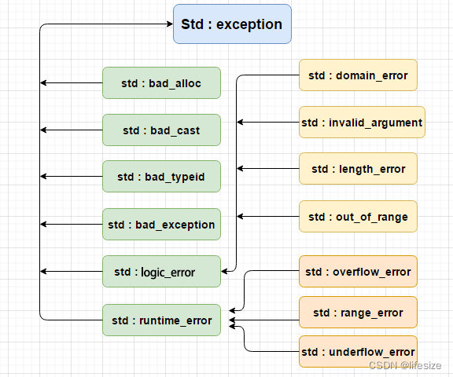

# C++异常处理

异常无处不在，程序随时可能误入歧途！C++ 提出了新的异常处理机制！

异常是一种程序控制机制，与函数机制互补

函数是一种以栈结构展开的上下函数衔接的程序控制系统,异常是另一种控制结构,它可以在出现“意外”时中断当前函数,并以某种机制（类型匹配）回馈给隔代的调用者相关的信息.

## 传统错误处理机制

通过函数返回值来处理错误

```cpp
#include <stdio.h>
#include <stdlib.h>
 
#define BUFSIZE 1024
 
//实现文件的二进制拷贝
int copyfile(const char *dest,const char *src){
	FILE *fp1 = NULL, *fp2 = NULL;
 
	//rb 只读方式打开一个二进制文件，只允许读取数据
	fopen_s(&fp1, src, "rb");
 
	if(fp1 == NULL){
		return -1;
	}
 
	//wb 以只写的方式打开或新建一个二进制文件，只允许写数据。
	fopen_s(&fp2, dest, "wb");
	if(fp2 == NULL){
		return -2;
	}
 
	char buffer[BUFSIZE];
	int readlen, writelen;
 
	//如果读到数据，则大于0
	while( (readlen = fread(buffer, 1, BUFSIZE, fp1)) > 0 ){
		writelen = fwrite(buffer, 1, readlen, fp2);
		if(readlen != writelen){
			return -3 ;
		}
	}
 
	fclose(fp1);
	fclose(fp2);
	return 0;
}
 
void main(){
	int ret = 0;
	ret = copyfile("c:/test/dest.txt", "c:/test/src.txt");
 
	if(ret != 0){
		switch(ret){
		case -1:
			printf("打开源文件失败!\n");
			break;
		case -2:
			printf("打开目标文件失败!\n");
			break;
		case -3:
			printf("拷贝文件时失败!\n");
			break;
		default:
			printf("出现未知的情况!\n");
			break;
		}
	}
	system("pause");
}
```

## C++异常处理基本语法

异常发生第一现场，抛出异常
```cpp
void  function( ){
//... ...
  throw 表达式;
//... ...
}
```

在需要关注异常的地方，捕捉异常

```cpp
try{
//程序
function();
//程序
 
}catch(异常类型声明){
//... 异常处理代码 ...
}catch(异常类型 形参){
//... 异常处理代码 ...
}catch(...){ //其它异常类型
//
}
```

C++之中有一些已经定义好的异常类型



- `std::exception`：该异常是所有标准 C++ 异常的父类。
- `std::bad_alloc`：该异常可以通过 `new` 抛出。
- `std::bad_cast`：该异常可以通过 `dynamic_cast` 抛出。
- `std::bad_typeid`：该异常可以通过 `typeid` 抛出。
- `std::bad_exception`：这在处理 C++ 程序中无法预期的异常时非常有用。
- `std::logic_error`：理论上可以通过读取代码来检测到的异常。
- `std::domain_error`：当使用了一个无效的数学域时，会抛出该异常。
- `std::invalid_argument`：当使用了无效的参数时，会抛出该异常。
- `std::length_error`：当创建了太长的 `std::string` 时，会抛出该异常。
- `std::out_of_range`：该异常可以通过方法抛出，例如 `std::vector` 和 `std::bitset<>::operator`。
- `std::runtime_error`：理论上不可以通过读取代码来检测到的异常。
- `std::overflow_error`：当发生数学上溢时，会抛出该异常。
- `std::range_error`：当尝试存储超出范围的值时，会抛出该异常。
- `std::underflow_error`：当发生数学下溢时，会抛出该异常。

