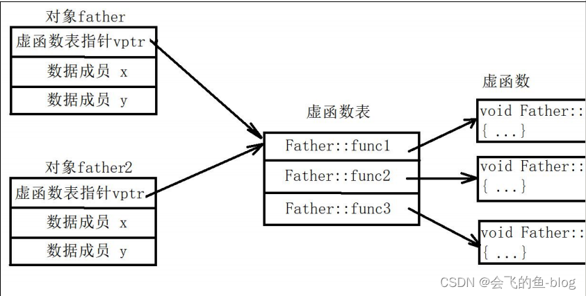
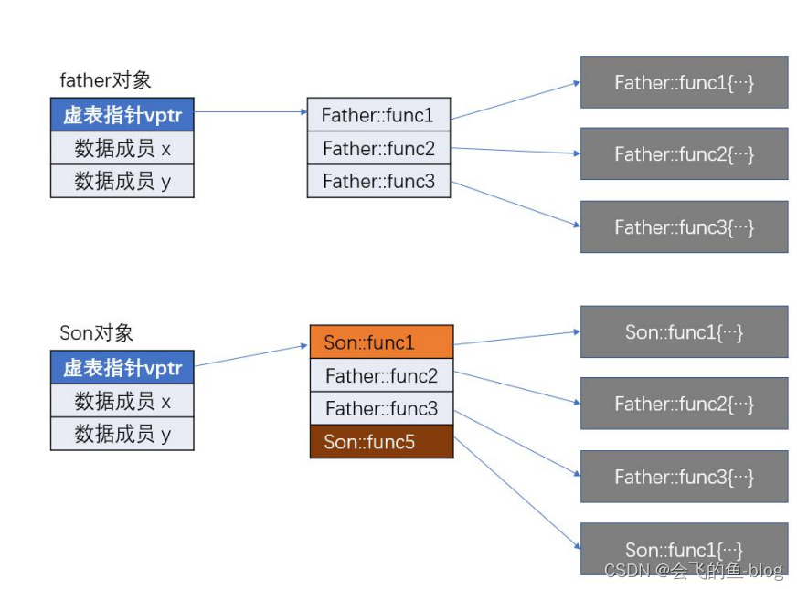
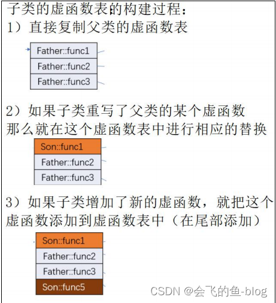
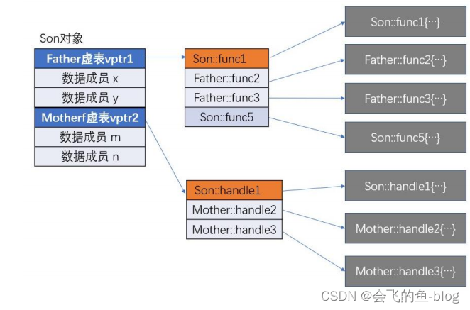

# C++多态

## 基本概念
允许一个接口被多种不同的实现使用

虚函数，实现多态。

```cpp
#include <iostream>
using namespace std;
 
class Father {
public:
    virtual void play() {
        cout << "到 KTV 唱歌..." << endl;
    }
};
 
class Son :public Father {
public:
    virtual void play() {
        cout << "一起打王者吧！" << endl;
    }
};
 
void party(Father **men, int n) {
    for (int i = 0; i<n; i++) {
        men[i]->play();
    }
}
 
int main(void) {
    Father father;
    Son son1, son2;
    Father* men[] = { &father, &son1, &son2 };
    party(men, sizeof(men) / sizeof(men[0]));
 
    return 0;
}
```

## 实现多态：虚函数

多态的本质：

- 形式上，使用统一的父类指针做一般性处理，

- 但是实际执行时，这个指针可能指向子类对象，

- 形式上，原本调用父类的方法，但是实际上会调用子类的同名方法。
   
   
程序执行时，父类指针指向父类对象，或子类对象时，在形式上是无法分辨的！只有通过多态机制，才能执行真正对应的方法。

**虚函数的使用**

虚函数的定义：

- 在函数的返回类型之前使用 virtual

- 只在成员函数的声明中添加 virtual, 在成员函数的实现中不要加 virtual（声明的时候加就好，实现的时候不用加）

虚函数的继承：
- 如果某个成员函数被声明为虚函数，那么它的子类【派生类】，以及子类的子类中，所
继承的这个成员函数，也自动是虚函数。

- 如果在子类中重写这个虚函数，可以不用再写 virtual, 但是仍建议写 virtual！！！！

## 虚函数的原理-虚函数表

```cpp
#include<iostream>
using namespace std;

class Father{

public: //为了便于测试，特别该用 public
    int x = 100;
    int y = 200;
    static int z;

public:
    virtual void func1(){ cout << "Father::func1" << endl; }
    virtual void func2(){ cout << "Father::func2" << endl; }
    virtual void func3(){ cout << "Father::func3" << endl; }
    void func4() { cout << "非虚函数：Father::func4" << endl; }

};
//静态数据初始化
int Father::z = 1;
typedef void (*func_t)(void);
int main(){
    Father father;

    // 安全地获取对象地址
    cout << "对象地址：" << static_cast<void*>(&father) << endl;

    // 安全地获取虚函数表指针
    void** vptr = *reinterpret_cast<void***>(&father);
    cout << "虚函数表指针 vptr：" << vptr << endl;

    // 调用虚函数表中的函数
    cout << "调用第 1 个虚函数: ";
    reinterpret_cast<func_t>(vptr[0])();
    cout << "调用第 2 个虚函数：";
    reinterpret_cast<func_t>(vptr[1])();
    cout << "调用第 3 个虚函数: ";
    reinterpret_cast<func_t>(vptr[2])();

    // 安全地访问数据成员
    cout << "第 1 个数据成员的地址: " << &father.x << endl;
    cout << "第 1 个数据成员的值：" << father.x << endl;

    cout << "第 2 个数据成员的地址: " << &father.y << endl;
    cout << "第 2 个数据成员的值：" << father.y << endl;

    cout << "sizeof(father)==" << sizeof(father) << endl;

    Father father2;
    cout << "father 的虚函数表：" << *reinterpret_cast<void***>(&father) << endl;
    cout << "father2 的虚函数表：" << *reinterpret_cast<void***>(&father2) << endl;

    return 0;

}
```


对象内，首先存储的是“虚函数表指针”，又称“虚表指针”。

然后再存储非静态数据成员。

对象的非虚函数，保存在类的代码中！

对象的内存，只存储虚函数表和数据成员

（类的静态数据成员，保存在数据区中，和对象是分开存储的）

添加虚函数后，对象的内存空间不变！仅虚函数表中添加条目

多个对象，共享同一个虚函数表！

## 使用继承的虚函数表

```cpp
#include <iostream>
using namespace std;
class Father {
public:
    virtual void func1() { cout << "Father::func1" << endl; }
    virtual void func2() { cout << "Father::func2" << endl; }
    virtual void func3() { cout << "Father::func3" << endl; }
    void func4() { cout << "非虚函数：Father::func4" << endl; }
public: //为了便于测试，特别该用 public
    int x = 100;
    int y = 200;
};
 
class Son : public Father {
public:
    void func1() { cout << "Son::func1" << endl; }
    virtual void func5() { cout << "Son::func5" << endl; }
};
 
typedef void (*func_t)(void);

int main(void) {
    Father father;
    Son son;

    // 安全地获取对象地址
    cout << "son 对象地址：" << static_cast<void*>(&son) << endl;

    // 安全地获取虚函数表指针
    void** vptr = *reinterpret_cast<void***>(&son);
    cout << "虚函数表指针 vptr：" << vptr << endl;

    // 调用虚函数表中的函数
    for (size_t i = 0; i < 4; i++) {
        if (vptr[i] != nullptr) {
            cout << "调用第" << i + 1 << "个虚函数：";
            reinterpret_cast<func_t>(vptr[i])();
        } else {
            break; // 避免访问无效的函数指针
        }
    }

    // 安全地访问数据成员
    cout << "第 1 个数据成员的地址: " << &son.x << endl;
    cout << "第 1 个数据成员的值：" << son.x << endl;

    cout << "第 2 个数据成员的地址: " << &son.y << endl;
    cout << "第 2 个数据成员的值：" << son.y << endl;

    cout << "sizeof(son)==" << sizeof(son) << endl;

    return 0;
}
```
内存分布：



补充：



## 多重继承(能不用尽量还是别用了)

```cpp
#include <iostream>
using namespace std;
class Father {
public:
    virtual void func1() { cout << "Father::func1" << endl; }
    virtual void func2() { cout << "Father::func2" << endl; }
    virtual void func3() { cout << "Father::func3" << endl; }
    void func4() { cout << "非虚函数：Father::func4" << endl; }
public: //为了便于测试，特别该用 public
    int x = 100;
    int y = 200;
};


class Mother {
public:
    virtual void handle1() { cout << "Mother::handle1" << endl; }
    virtual void handle2() { cout << "Mother::handle2" << endl; }
    virtual void handle3() { cout << "Mother::handle3" << endl; }
public: //为了便于测试，使用 public 权限
    int m = 400;
    int n = 500;
};

class Son : public Father, public Mother {
public:
    void func1() { cout << "Son::func1" << endl; }
    virtual void func5() { cout << "Son::func5" << endl; }
    virtual void handle1() { cout << "Son::handle1" << endl; }
};
 
typedef void (*func_t)(void);

int main() {
    Son son;

    // 输出对象地址
    cout << "son 对象地址：" << static_cast<void*>(&son) << endl;

    // 获取 Father 的虚表指针
    Father* fatherPtr = &son;
    void** vptr_father = *reinterpret_cast<void***>(fatherPtr);
    cout << "Father 的虚表指针：" << vptr_father << endl;

    // 调用 Father 虚表中的函数（前 4 个：func1, func2, func3, func5）
    for (size_t i = 0; i < 4; ++i) {
        if (vptr_father[i]) {
            cout << "Father 虚表第 " << i+1 << " 个函数: ";
            reinterpret_cast<func_t>(vptr_father[i])();
        } else break;
    }

    // 输出 Father 数据成员
    cout << "Father::x = " << son.x << " at " << &son.x << endl;
    cout << "Father::y = " << son.y << " at " << &son.y << endl;

    // 获取 Mother 的虚表指针
    Mother* motherPtr = &son;
    void** vptr_mother = *reinterpret_cast<void***>(motherPtr);
    cout << "Mother 的虚表指针：" << vptr_mother << endl;

    // 调用 Mother 虚表中的函数（3 个）
    for (size_t i = 0; i < 3; ++i) {
        if (vptr_mother[i]) {
            cout << "Mother 虚表第 " << i+1 << " 个函数: ";
            reinterpret_cast<func_t>(vptr_mother[i])();
        } else break;
    }

    // 输出 Mother 数据成员
    cout << "Mother::m = " << son.m << " at " << &son.m << endl;
    cout << "Mother::n = " << son.n << " at " << &son.n << endl;

    return 0;
}

```

内存：




## final
用来修饰类，让该类不能被继承

理解：使得该类终结！

```cpp
class XiaoMi {
public:
    XiaoMi(){}
};
 
class XiaoMi2 final : public XiaoMi {
    XiaoMi2(){}
};
 
class XiaoMi3 : public XiaoMi2 { //不能把 XiaoMi2 作为基类
};
```

用来修饰类的虚函数，使得该虚函数在子类中，不能被重写

理解：使得该功能终结！

```cpp
class XiaoMi {
public:
    virtual void func() final;
};
void XiaoMi::func() { //不需要再写 final
    cout << "XiaoMi::func" << endl;
}
class XiaoMi2 : public XiaoMi {
public:
    void func() {}; // 错误！不能重写 func 函数
};
```

## override

override 仅能用于修饰虚函数。

作用：
- 提示程序的阅读者，这个函数是重写父类的功能。
- 防止程序员在重写父类的函数时，把函数名写错。

```cpp
#include <iostream>
 
using namespace std;
 
class XiaoMi {
public:
virtual void func() { 
    cout << "XiaoMi::func" << endl; };
};
 
class XiaoMi2 : public XiaoMi {
public:
    void func() override {}
    //void func() override; 告诉程序员 func 是重写父类的虚函数
    //void func1() override{} 错误！因为父类没有 func1 这个虚函数
};
 
int main(void) {
    XiaoMi2 xiaomi;
 
    return 0;
}
```


## 遗失的子类析构函数

为了防止内存泄露，最好是在基类析构函数上添加 virtual 关键字，使基类析构函数为虚函数

目的在于，当使用 delete 释放基类指针时，会实现动态的析构：

如果基类指针指向的是基类对象，那么只调用基类的析构函数

**如果基类指针指向的是子类对象，那么先调用子类的析构函数，再调用父类的析构函数**

```cpp
#include <iostream>
#include <string.h>
using namespace std;

class Father {
public:
    Father(const char* addr ="中国"){
        cout << "执行了 Father 的构造函数" << endl;
        int len = strlen(addr) + 1;
        this->addr = new char[len];
        strcpy(this->addr, addr);
    }
    // 把 Father 类的析构函数定义为 virtual 函数时，
    // 如果对 Father 类的指针使用 delete 操作时，
    // 就会对该指针使用“动态析构”：
    // 如果这个指针，指向的是子类对象，
    // 那么会先调用该子类的析构函数，再调用自己类的析构函数
    virtual ~Father(){
        cout << "执行了 Father 的析构函数" << endl;
        if (addr) {
            delete addr;
            addr = NULL;
        }
    }
private:
    char* addr;
};

class Son :public Father {
public:
    Son(const char *game="吃鸡", const char *addr="中国")
    :Father(addr){
        cout << "执行了 Son 的构造函数" << endl;
        int len = strlen(game) + 1;
        this->game = new char[len];
        strcpy(this->game, game);
    }
 
~Son(){
    cout << "执行了 Son 的析构函数" << endl;
    if (game) {
        delete game;
        game = NULL;
    }
}
 
private:
    char* game;
};
 
int main(void) {
    cout << "----- case 1 -----" << endl;
    Father* father = new Father();
    delete father;
    cout << "----- case 2 -----" << endl;
    Son* son = new Son();
    delete son;
    cout << "----- case 3 -----" << endl;
    father = new Son();
    delete father;
 
    return 0;
}
```

## 纯虚函数与抽象类

什么时候使用纯虚函数

某些类，在现实角度和项目实现角度，都**不需要实例化**（不需要创建它的对象），这个类中定义的某些成员函数，只是为了提供一个形式上的接口，准备让子类来做具体的实现。

此时，这个方法，就可以定义为“纯虚函数”， 包含纯虚函数的类，就称为抽象类。

纯虚函数的使用方法

**用法：纯虚函数，使用 virtual 和 =0**

```cpp
#include <iostream>
#include <string>
 
using namespace std;
 
class Shape {
public:
    Shape(const string& color = "white") { this->color = color; }
    virtual float area() = 0; //不用做具体的实现
    string getColor() { return color; }
private:
    string color;
};
 
class Circle : public Shape {
public:
    Circle(float radius = 0, const string& color="White"):Shape(color), r(radius){}
    float area();
private:
    float r; //半径
};
 
float Circle::area() {
    return 3.14 * r * r;
}
 
int main() {
//使用抽象类创建对象非法！
//Shape s;
    Circle c1(10);
    cout << c1.area() << endl;
    Shape* p = &c1;
    cout << p->area() << endl;

    return 0;
}
```

父类声明某纯虚函数后，那么它的子类

- 要么实现这个纯虚函数 （最常见）

- 要么继续把这个纯虚函数声明为纯虚函数，这个子类也成为抽象类

- 要么不对这个纯虚函数做任何处理，等效于上一种情况（该方式不推荐）

常见错误：

1. 虚函数的函数原型
   
    子类在重新实现继承的虚函数时，要和主要函数的原型一致
    
    如果已经继承虚函数：
    
    bool heartBeat();
    
    那么重写虚函数时，函数原型必须保持完全一致：
    
    bool heartBeat();
    
    而且子类不能添加：
    
    int heartBeat();
    
    //因为仅函数的返回类型不同时，不能区别两个函数。
    
    但是可以添加：
    
    int heartBeat(int);

2. 析构函数是否使用虚函数

    有子类时，析构函数就应该使用虚函数
