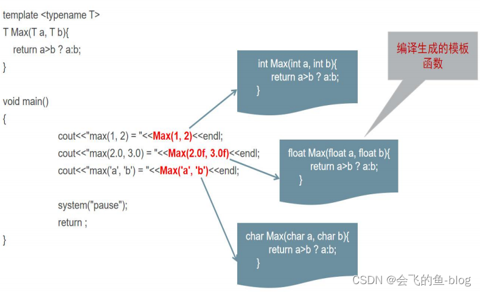

# C++模板

C++提供了模板(template)编程的概念。所谓模板，实际上是建立一个通用函数或类，其类内部的类型和函数的形参类型不具体指定，用一个虚拟的类型来代表。这种通用的方式称为模板。模板是泛型编程的基础,泛型编程即以一种独立于任何特定类型的方式编写代码。


## C++函数模板的使用

所谓函数模板，实际上是建立一个通用函数，其函数类型和形参类型不具体指定，用一个虚拟的类型来代表。这个通用函数就称为函数模板。 凡是函数体相同的函数都可以用这个模板来代替，不必定义多个函数，只需在模板中定义一次即可。在调用函数时系统会根据实参的类型来取代模板中的虚拟类型，从而实现了不同函数的功能。

    由以下三部分组成：
    模板说明 + 函数定义 + 函数模板调用
        template < 类型形式参数表 > 类型
        函数名 ( 形式参数表 )
        {
                //语句序列
        }

```cpp
#include <iostream>
using namespace std;
 
/*
int Max(int a, int b)
{
    return a>b ? a:b;
}
char Max(char a, char b)
{
    return a>b ? a:b;
}
float Max(float a, float b)
{
    return a>b ? a:b;
}
*/
//template 关键字告诉 C++编译器 我要开始泛型编程了,请你不要随意报错
//T - 参数化数据类型
template <typename T>
T Max(T a, T b){
    return a>b ? a:b;
}
 
int main()
{
    int x = 1;
    int y = 2;
    cout<<"max(1, 2) = "<<Max(x, y)<<endl; //实现参数类型的自动推导
    cout<<"max(1, 2) = "<<Max<int>(x,y)<<endl;//显示类型调用
    float a = 2.0;
    float b = 3.0;
    cout<<"max(2.0, 3.0) = "<<Max(a, b)<<endl;
    
    return 0;
}
```



函数模板和普通函数区别结论：

- 两者允许并存

- 函数模板不允许自动类型转化

- 普通函数能够进行自动类型转换


函数模板和普通函数在一起，调用规则：

- 函数模板可以像普通函数一样被重载

- C++编译器优先考虑普通函数

- 如果函数模板可以产生一个更好的匹配，那么选择模板

- 可以通过空模板实参列表的语法限定编译器只通过模板匹配


**编译器并不是把函数模板处理成能够处理任意类型的函数**

**编译器从函数模板通过具体类型产生不同的函数**


## 类模板的使用

类模板与函数模板的定义和使用类似，有时，有两个或多个类，其功能是相同的，仅仅是 数据类型不同，我们可以通过如下面语句声明了一个类模板：

```cpp
template <typenameType>
classClassName
{
 //ClassName的成员函数
 private：
     TypeDataMember;
}

template<typename T>
class A {
public:
    A(T t){
        this->t=t;
    }
 
    T& getT(){
        return t;
    }
public:
    T t;
};
```

类模板用于实现类所需数据的类型参数化

类模板在表示支持多种数据结构显得特别重要，这些数据结构的表示和算法不受所 包含的元素类型的影响

简单样例：

```cpp
#include<iostream>
using namespace std;

template<typename T>
class A {
public:
    A(T t){
        this->t=t;
    }
 
    T& getT(){
        return t;
    }
public:
    T t;
};

//这里还是需要指明参数的 A<int> &a
void printA(A<int> &a){
     cout<<a.getT()<<endl;
}

int main(){
     //1.模板类定义类对象，必须显示指定类型
     //2.模板种如果使用了构造函数，则遵守以前的类的构造函数的调用规则
     A<int> a(666);

     cout<<a.getT()<<endl;
     //模板类做为函数参数
     printA(a);

     return 0;
}
```

**继承中类模板的使用**

子类从模板类继承的时候,需要让编译器知道父类的数据类型具体是什么

- 父类一般类，子类是模板类,和普通继承的玩法类似

- 子类是一般类，父类是模板类,继承时必须在子类里实例化父类的类型参数

- 父类和子类都时模板类时，子类的虚拟的类型可以传递到父类中

```cpp
#include<iostream>
using namespace std;

template<typename T>
class A {
public:
    A(T t){
        this->t=t;
    }
 
    T& getT(){
        return t;
    }
public:
    T t;
};

template<typename Tb>
class B:public A<Tb>{
public:
    B(Tb b):A<Tb>(b){
        this->b = b;
    }
private:
    Tb b;
};

//这里还是需要指明参数的 A<int> &a
void printA(A<int> &a){
     cout<<a.getT()<<endl;
}

int main(){
    //1.模板类定义类对象，必须显示指定类型
    //2.模板种如果使用了构造函数，则遵守以前的类的构造函数的调用规则
    A<int> a(666);
    
    cout<<a.getT()<<endl;

    B<int> b(888);

    cout<<"b(888):"<<b.getT()<<endl;

    //模板类做为函数参数
    printA(a);
    //模板类做为函数参数
    printA(b);

    return 0;
}
```


**类模板函数的三种表达描述方式**

- 所有的类模板函数写在类的内部(如上面的例子)

- 所有的类模板函数写在类的外部，在一个cpp中

- 所有的类模板函数写在类的外部，在不同的.h和.cpp中

对与第二点：所有的类模板函数写在类的外部，在一个cpp中

```cpp
template<typename T>
class A {
public:
    A(T t);
 
    T& getT();
public:
    T t;
};

template<typename T>
A<T>::A(T t){
    this->t=t;
}

template<typename T>
T& A<T>::getT(){
    return this->t;
}
```
在同一个cpp文件中把模板类的成员函数放到类的外部，需要注意以下几点

- 函数前声明template

- 类的成员函数前的类限定域说明必须要带上虚拟参数列表

- 返回的变量是模板类的对象时必须带上虚拟参数列表

- 成员函数参数中出现模板类的对象时必须带上虚拟参数列表

- 成员函数内部没有限定

对于第三点：所有的类模板函数写在类的外部，在不同的.h和.cpp中

```cpp

//simpleTemplateClass.h
#ifndef SIMPLE_TEMPLATE_CLASS
#define SIMPLE_TEMPLATE_CLASS

template<typename T>
class A {
public:
    A(T t);
 
    T& getT();
public:
    T t;
};


#endif

//simpleTemplateClass.cpp
#include"simpleTemplateClass.h"
using namespace std;

template<typename T>
A<T>::A(T t){
    this->t=t;
}

template<typename T>
T& A<T>::getT(){
    return this->t;
}

//main.cpp
#include "simpleTemplateClass.h"
#include "simpleTemplateClass.cpp"
#include <iostream>
using namespace std;

//这里还是需要指明参数的 A<int> &a
void printA(A<int> &a){
    cout<<a.getT()<<endl;
}

int main(){
    //1.模板类定义类对象，必须显示指定类型
    //2.模板种如果使用了构造函数，则遵守以前的类的构造函数的调用规则
    A<int> a(666);

    cout<<a.getT()<<endl;
    //模板类做为函数参数
    printA(a);

    return 0;
}

```

注意：当类模板的声明(.h文件)和实现(.cpp或.hpp文件)完全分离，因为类模板的特殊实现， 我们应在使用类模板时使用#include包含实现部分的.cpp或.hpp文件。

**特殊情况友元函数**

```cpp
#include<iostream>
using namespace std;

// 前置声明模板类和模板函数
template<typename T> class A;
template<typename T> A<T> addA(const A<T>& a, const A<T>& b);

template<typename T>
class A {
public:

    A();

    A(T t);
 
    T& getT();

    friend A<T> addA<T>(const A<T>& a, const A<T>& b); 

    void print();
public:
    T t;
};

template<typename T>
A<T>::A(){}


template<typename T>
A<T>::A(T t){
    this->t=t;
}

template<typename T>
T& A<T>::getT(){
    return this->t;
}


template<typename T>
void A<T>::print(){
     cout<<this->t<<endl;
 }

template<typename T>
A<T> addA(const A<T> &a, const A<T> &b){
    A<T> tmp;
    cout<<"call add A()..."<<endl;
    tmp.t=a.t+b.t;
    return tmp;
}


int main(){
    A<int> a(666),b(888);
    //cout<<a.getT()<<endl;
    A<int> tmp1=addA<int>(a,b);
    tmp1.print();


     return 0;
}

```


**模板类和静态成员**

```cpp
#include <iostream>
#include <string>

// 定义一个模板类
template <typename T>
class MyClass {
private:
    static T staticValue; // 静态成员变量
    T value;              // 普通成员变量

public:
    // 构造函数
    MyClass(T val) : value(val) {
        staticValue = val; // 初始化静态成员变量
    }

    // 静态成员函数：打印静态成员变量
    static void printStaticValue() {
        std::cout << "Static Value: " << staticValue << std::endl;
    }

    // 静态成员函数：设置静态成员变量
    static void setStaticValue(const T& newVal) {
        staticValue = newVal;
    }

    // 普通成员函数
    void printValue() const {
        std::cout << "Value: " << value << std::endl;
    }
};

// 显式模板实例化 ！！！！！
template <typename T>
T MyClass<T>::staticValue = T(); // 直接初始化静态成员变量

int main() {
    // 创建两个对象
    MyClass<int> obj1(10);
    MyClass<int> obj2(20);

    // 打印静态成员变量的初始值
    obj1.printStaticValue(); // 输出：Static Value: 0
    obj2.printStaticValue(); // 输出：Static Value: 0

    // 使用静态成员函数修改静态成员变量
    MyClass<int>::setStaticValue(100);

    // 再次打印静态成员变量的值
    obj1.printStaticValue(); // 输出：Static Value: 100
    obj2.printStaticValue(); // 输出：Static Value: 100

    // 调用普通成员函数
    obj1.printValue();       // 输出：Value: 10
    obj2.printValue();       // 输出：Value: 20

    // 创建一个不同类型的对象
    MyClass<std::string> obj3("Hello");

    // 打印静态成员变量的初始值
    obj3.printStaticValue(); // 输出：Static Value: (空字符串)

    // 修改静态成员变量
    MyClass<std::string>::setStaticValue("World");

    // 再次打印静态成员变量的值
    obj3.printStaticValue(); // 输出：Static Value: World

    return 0;
}
```


从类模板实例化的每个模板类有自己的类模板数据成员，该模板类的所有对象共享一个static数据成员

和非模板类的static数据成员一样，模板类的static数据成员也应该在文件范围定义和初始化

static 数据成员也可以使用虚拟类型参数T