# C++设计模式
**资料**https://blog.csdn.net/qq_52860170/article/details/142577985

## 软件的设计原则

目的：为了提高软件系统的可维护性、可复用性，增强软件的可扩展性、灵活性

### 开闭原则（OCP）

软件实体对扩展是开放的，但对修改是关闭的，即在不修改一个软件实体的基础上去扩展其功能。

对扩展开放，对修改关闭

实现：接口和抽象类

### 里氏替换原则（LSP）

任何基类可以出现的地方，子类一定可以出现，通俗来说，子类可以扩展父类的功能，但不能改变父类原有的功能

### 依赖倒置原则(DIP)

高层模块不应该依赖于低层模块，两者都应该依赖于抽象；抽象不应该依赖于细节，细节应该依赖于抽象；对抽象编程，不对实现编程，降低了客户与实现模块间的耦合。

### 接口隔离原则(ISP)

客户端不应该被迫依赖于它不使用的方法；一个类对另一个类的依赖应该建立在最小的接口上。

### 单一职责原则(SRP)

一个类应该有且仅有一个职责

比如：手机：拍照、摄影、游戏、GPS

拆分成多个类:

拍摄职责：照相机、摄影机

游戏：PSP

GPS：专业GPS导航

## 高内聚、低耦合

## 创建型模式

### 简单工厂模式

只需要知道水果的名字则可得到相应的水果

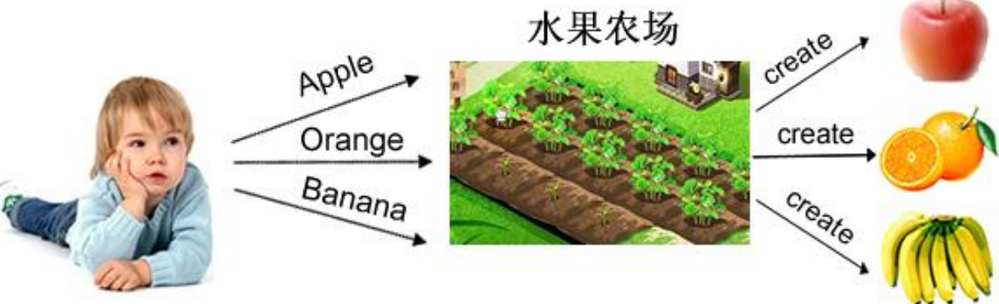

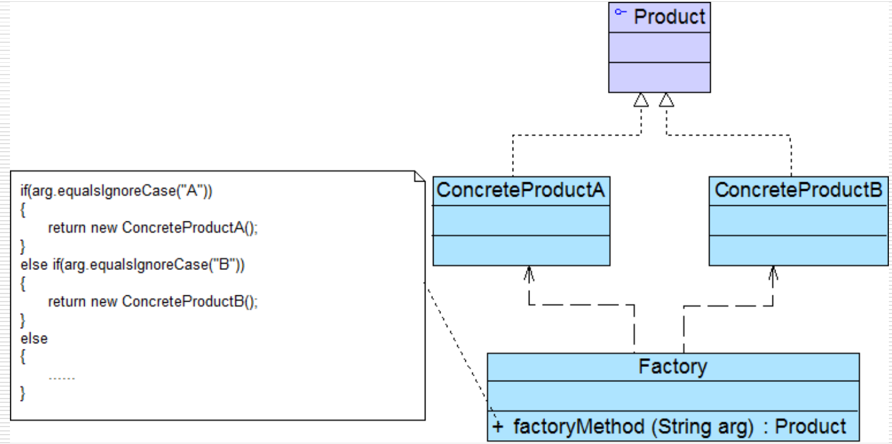

角色：

- Factory：工厂角色

- Product：抽象产品角色

- ConcreteProduct：具体产品角色


```cpp
#include<iostream>
using namespace std;

// 抽象产品类
class Shape{
public:
    virtual void draw() const = 0;
    virtual ~Shape(){};
};

// 具体的产品：圆形
class Circle: public Shape{
public:
    void draw() const override{
        cout<<"绘制圆形"<<endl;
    }

};

// 具体的产品：矩形
class Rectangle : public Shape{
public:
    void draw() const override{
        cout<<"绘制矩形"<<endl;
    }
};

// 工厂类，静态的创建函数
class ShapeFactory {
public:
    static Shape* createShape(const string& type){
        if (type == "Circle") {
            return new Circle();
        }else if(type == "Rectangle"){
            return new Rectangle();
        }
        throw invalid_argument("无效的形状类型！");        
    }

};


int main(){

    try{
        Shape* circle = ShapeFactory::createShape("Circle");
        Shape* rectangle = ShapeFactory::createShape("Rectangle");

        circle->draw();      // 输出：绘制圆形
        rectangle->draw();   // 输出：绘制矩形

        delete circle;
        delete rectangle;

        Shape* unknown = ShapeFactory::createShape("Triangle");

    }catch(const exception& e){
        cout << e.what() << endl;
    }
    
    return 0;
}
```

简单工厂模式虽然很好用，但是其违背了 **开闭原则** 当需要添加一个产品的时候，需要修改createShape部分的代码，因此便引入了工厂模式。

PPT之中一个例子
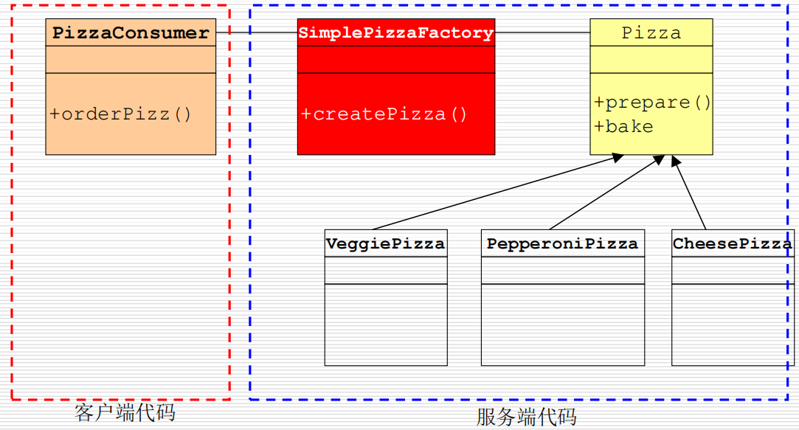


### 工厂模式

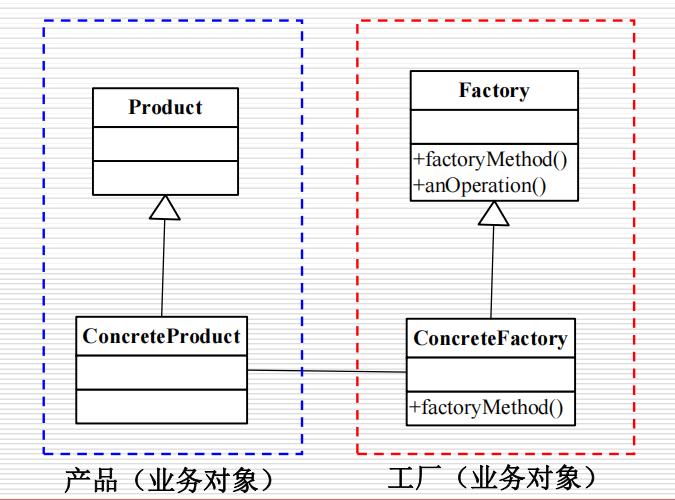

通过 将对象的实例化推迟到子类 来实现：每个具体工厂类只需要关注自己负责的产品创建，系统的扩展通过新增工厂-产品对实现，而不是修改现有代码。这种设计更符合面向对象的设计原则，特别适合需要支持多平台、多系列产品等场景。

- 抽象工厂：提供了创建产品的接口，调用者通过它访问具体工厂的工厂方法来创建产品

- 具体工厂：主要是实现抽象工厂中的抽象方法，完成具体产品的创建

- 抽象产品：定义了产品的规范，描述了产品的主要特性和功能

- 具体产品：实现了抽象产品角色所定义的接口，由具体工厂来创建，它同具体工厂之间一一对应

```cpp
#include<iostream>
using namespace std;

// 抽象产品类
class Shape{
public:
    virtual void draw() const = 0;
    virtual ~Shape(){};
};

// 具体的产品：圆形
class Circle: public Shape{
public:
    void draw() const override{
        cout<<"绘制圆形"<<endl;
    }

};

// 具体的产品：矩形
class Rectangle : public Shape{
public:
    void draw() const override{
        cout<<"绘制矩形"<<endl;
    }
};

// 添加产品： 三角形
class Triangle : public Shape{
public:
    void draw() const override{
        cout<<"绘制三角形"<<endl;
    }
};

// 抽象工厂类
class ShapeFactory {
public:
    virtual Shape* createShape() const = 0;
    virtual ~ShapeFactory(){};
};

// 圆形工厂
class CircleFactory: public ShapeFactory{
public:
    Shape* createShape() const override{
        return new Circle();
    }
};

// 矩形工厂
class RectangleFactory: public ShapeFactory{
public:
    Shape* createShape() const override{
        return new Rectangle();
    }
};

//新增 三角形工厂
class TriangleFactory: public ShapeFactory{
public:
    Shape* createShape() const override{
        return new Triangle();
    }
};


int main(){

    ShapeFactory* circleFactory = new CircleFactory();
    Shape* circle = circleFactory->createShape();
    
    ShapeFactory* rectangleFactory = new RectangleFactory();
    Shape* rectangle = rectangleFactory->createShape();

    circle->draw();      // 输出：绘制圆形
    rectangle->draw();   // 输出：绘制矩形

    //新增：
    ShapeFactory* triangleFactory = new TriangleFactory();
    Shape* triangle = triangleFactory->createShape();
    triangle->draw();


    delete circle;
    delete rectangle;
    delete circleFactory;
    delete rectangleFactory;

    delete triangle;
    delete triangleFactory;
    

    return 0;
}
```

### 抽象工程模式

提供一个创建一系列相关或相互依赖对象的接口，而无需指定他们具体的类

当系统所提供的工厂所需生产的具体产品并不是一个简单的对象，而是多个位于不同产品等级结构中属于不同类型的具体产品时需要使用抽象工厂模式

抽象工厂模式与工厂方法模式最大的区别在于，工厂方法模式针对的是一个产品等级结构，而抽象工厂模式则需要面对多个产品等级结构。

- 抽象工厂：提供了创建产品的接口，包含多个创建产品的方法，可以创建多个不同等级的产品

- 具体工厂：实现了抽象工厂中的多个抽象方法，完成具体产品的创建

- 抽象产品：定义了产品的规范，描述了产品的主要特征和功能，抽象工厂模式有多个抽象产品

- 具体产品：实现了抽象产品所定义的接口，由具体工厂来创建，它具体工厂是多对一关系


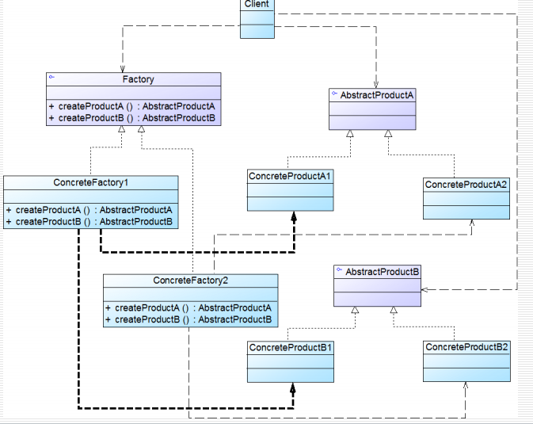

```cpp
#include<iostream>
#include <memory>
using namespace std;

// ------------------------- 抽象产品接口 -------------------------
// 按钮抽象类
class Button{
public:
    virtual void render() const = 0;
    virtual ~Button() = default;
};

// 文本框抽象类
class TextBox{
public:
    virtual void input(const string& text) const = 0;
    virtual ~TextBox() = default;
};

// 开关抽象类
class Switch{
public:
    virtual void toggle() const = 0;
    virtual ~Switch() = default;
};

// ------------------------- 具体产品实现 -------------------------
// 现代风格组件
class ModernButton: public Button{
public:
    void render() const override {
        cout << "渲染现代风格按钮 [▣ Minimal]" << endl;
    }
};

class ModernTextBox : public TextBox {
public:
    void input(const string& text) const override {
        cout << "现代风格文本框输入: \"" << text << "\" (无边框)" << endl;
    }
};

class ModernSwitch : public Switch {
public:
    void toggle() const override {
        cout << "切换现代风格开关 ●━━━━●" << endl;
    }
};

// 复古风格组件
class RetroButton : public Button {
public:
    void render() const override {
        cout << "渲染复古风格按钮 [▣ Beveled]" << endl;
    }
};

class RetroTextBox : public TextBox {
public:
    void input(const string& text) const override {
        cout << "复古风格文本框输入: \"" << text << "\" (像素字体)" << endl;
    }
};

class RetroSwitch : public Switch {
public:
    void toggle() const override {
        cout << "切换复古开关 ◈━━━◈" << endl;
    }
};

// ------------------------- 抽象工厂接口 -------------------------
class UIFactory{
public:
    virtual unique_ptr<Button> createButton() = 0;
    virtual unique_ptr<TextBox> createTextBox() = 0;
    virtual unique_ptr<Switch> createSwitch() = 0;
    virtual ~UIFactory() = default;
};

// ------------------------- 具体工厂实现 -------------------------
class ModernUIFactory : public UIFactory {
public:
    unique_ptr<Button> createButton() override {
        return make_unique<ModernButton>();
    }

    unique_ptr<TextBox> createTextBox() override {
        return make_unique<ModernTextBox>();
    }

    unique_ptr<Switch> createSwitch() override {
        return make_unique<ModernSwitch>();
    }
};

class RetroUIFactory : public UIFactory {
public:
    unique_ptr<Button> createButton() override {
        return make_unique<RetroButton>();
    }

    unique_ptr<TextBox> createTextBox() override {
        return make_unique<RetroTextBox>();
    }

    unique_ptr<Switch> createSwitch() override {
        return make_unique<RetroSwitch>();
    }
};

// ------------------------- 客户端代码 -------------------------
void createUI(const unique_ptr<UIFactory>& factory) {
    auto button = factory->createButton();
    auto textbox = factory->createTextBox();
    auto switchCtrl = factory->createSwitch();

    button->render();
    textbox->input("Hello World");
    switchCtrl->toggle();
}


int main(){

    cout << "=== 现代风格 UI ===" << endl;
    createUI(make_unique<ModernUIFactory>());

    cout << "\n=== 复古风格 UI ===" << endl;
    createUI(make_unique<RetroUIFactory>());


    return 0;
}
```

三种工厂模式对比表

| 特性       | 简单工厂模式           | 工厂方法模式               | 抽象工厂模式                 |
|------------|------------------------|----------------------------|------------------------------|
| 创建目标   | 单一产品               | 单一产品                   | 产品家族（多个关联产品）      |
| 扩展维度   | 垂直扩展（产品类型）   | 垂直扩展（产品类型）       | 水平扩展（产品家族）          |
| 开闭原则   | 违反                   | 支持产品扩展               | 支持产品族扩展               |
| 工厂类数量 | 1个全能工厂            | N个工厂对应N个产品         | N个工厂对应N个产品族         |
| 适用场景   | 简单对象创建           | 单一产品扩展               | 多系列关联对象创建            |


### 单例模式

单例模式确保一个类只有一个实例，并提供一个全局访问点。

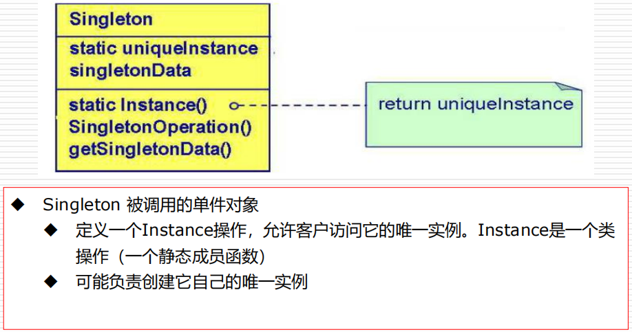

```cpp
#include <iostream>
using namespace std;

class Singleton {
private:
    Singleton() = default; // 私有构造函数
    ~Singleton() = default; // 私有析构函数（可选）
    
    // 删除拷贝和赋值操作
    Singleton(const Singleton&) = delete;
    Singleton& operator=(const Singleton&) = delete;

public:
    static Singleton& getInstance() {
        static Singleton instance; // 线程安全且自动析构
        return instance;
    }

    void testFunction() {
        cout << "testFunction" << endl;
    }
};

int main() {
    Singleton::getInstance().testFunction();
    return 0;
}
```

### 生成器(buider)模式

将一个复杂对象的构建与分离分开表示，使得同样的构建过程可以创建不同的表示

- 分离了部件的构造(由Builder来负责)和装配(由Director负责)。 从而可以构造出复杂的对象。这个模式适用于: 某个对象的构建过程复杂的情况。

- 由于实现了构建和装配的解耦。不同的构建器，相同的装配，也可以做出不同的对象，相同的构建器，不同的装配顺序也可以做出不同的对象。也就是实现了构建算法、装配算法的解耦，实现了更好的复用。

- 建造者模式可以将部件和其组装过程分开，一步一步创建一个复杂的对象。用户只需要指定复杂对象的类型就可以得到该对象，而无须知道其内部的具体构造细节。

**结构**

- 抽象建造者类：这个接口规定要实现复杂对象的哪些部分的创建，并不涉及具体对象部件的创建。

- 具体建造者类：实现Builder接口，完成复杂产品的各个部件的具体创建方法。在构造过程完成后，提供产品的实例。

- 产品类：要创建的复杂对象

- 指挥者类：调用具体的建造者来创建复杂对象的各个部分，在指导者中不涉及具体产品的信息，只负责保证对象各部分完整创建或按某种顺序创建

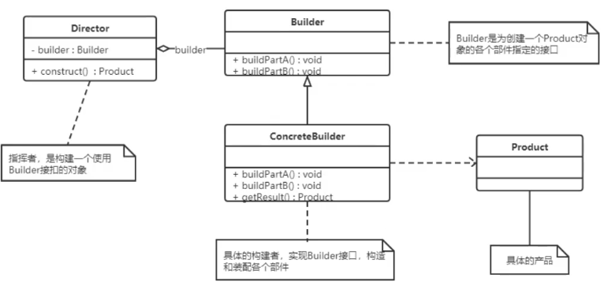

```cpp
#include<iostream>
#include<string>
using namespace std;

// 产品类：Computer
class Computer{
private:
    string m_cpu;
    string m_memory;
    string m_hardDisk;
public:
    void setCPU(const string& cpu){ m_cpu = cpu;}
    void setMemory(const string& memory) { m_memory = memory; }
    void setHardDisk(const string& hardDisk) { m_hardDisk = hardDisk; }

    void show() const {
        cout << "Computer Configuration:" << endl;
        cout << "CPU: " << m_cpu << endl;
        cout << "Memory: " << m_memory << endl;
        cout << "Hard Disk: " << m_hardDisk << endl;
    }
};

// 抽象建造者接口
class ComputerBuilder {
public:
    virtual void buildCPU() = 0;
    virtual void buildMemory() = 0;
    virtual void buildHardDisk() = 0;
    virtual Computer* getResult() = 0;
    virtual ~ComputerBuilder() = default;
};


//  具体建造者：高端配置
class HighEndComputerBuilder : public ComputerBuilder {
private:
    Computer* m_computer;
public:
    HighEndComputerBuilder() : m_computer(new Computer()) {}

    void buildCPU() override {
        m_computer->setCPU("Intel Core i9-12900K");
    }

    void buildMemory() override {
        m_computer->setMemory("64GB DDR5 4800MHz");
    }

    void buildHardDisk() override {
        m_computer->setHardDisk("2TB Samsung 980 Pro NVMe SSD");
    }

    Computer* getResult() override {
        return m_computer;
    }

    ~HighEndComputerBuilder() {
        delete m_computer;
    }

};

// 具体建造者：办公配置
class OfficeComputerBuilder : public ComputerBuilder {
private:
    Computer* m_computer;

public:
    OfficeComputerBuilder() : m_computer(new Computer()) {}

    void buildCPU() override {
        m_computer->setCPU("Intel Core i5-12400");
    }

    void buildMemory() override {
        m_computer->setMemory("16GB DDR4 3200MHz");
    }

    void buildHardDisk() override {
        m_computer->setHardDisk("512GB Crucial P2 NVMe SSD");
    }

    Computer* getResult() override {
        return m_computer;
    }

    ~OfficeComputerBuilder() {
        delete m_computer;
    }
};

// 指挥者类
class Director{
public:
    void construct(ComputerBuilder* builder){
        builder->buildCPU();
        builder->buildMemory();
        builder->buildHardDisk();
    }
};


int main(){

    Director director;

    // 构建高端电脑
    HighEndComputerBuilder highEndBuilder;
    director.construct(&highEndBuilder);
    Computer* gamingPC = highEndBuilder.getResult();
    cout << "High-end Gaming PC:" << endl;
    gamingPC->show();

    cout << "\n";

    // 构建办公电脑
    OfficeComputerBuilder officeBuilder;
    director.construct(&officeBuilder);
    Computer* officePC = officeBuilder.getResult();
    cout << "Office PC:" << endl;
    officePC->show();

    return 0;
}
```

## 结构型模式

描述如何将类和对象按某种布局组成更大的结构

### 代理模式

为其他对象提供一种代理以控制对该对象的访问


- 远程（Remote）代理：为一个对象在不同地址空间提供局部代表
  
- 虚拟（Virtual）代理：在需要创建开销很大对象时缓存对象信息

- 保护（Protection）代理：控制对原始对象的访问
  
- 智能引用（Smart Reference）代理：当一个对象被引用时，提供一些额外的操作，例如记录访问的流量和次数等

结构：

- 抽象主题类：通过接口或抽象类声明真实主题和代理对象实现的业务方法

- 真实主题类：实现了抽象主题中的具体业务，是代理对象所代表的真实对象，是最终要引用的对象

- 代理类：提供了与真实主题相同的接口，其内部含有对真实主题的引用，它可以访问、控制、扩展真实主图的功能

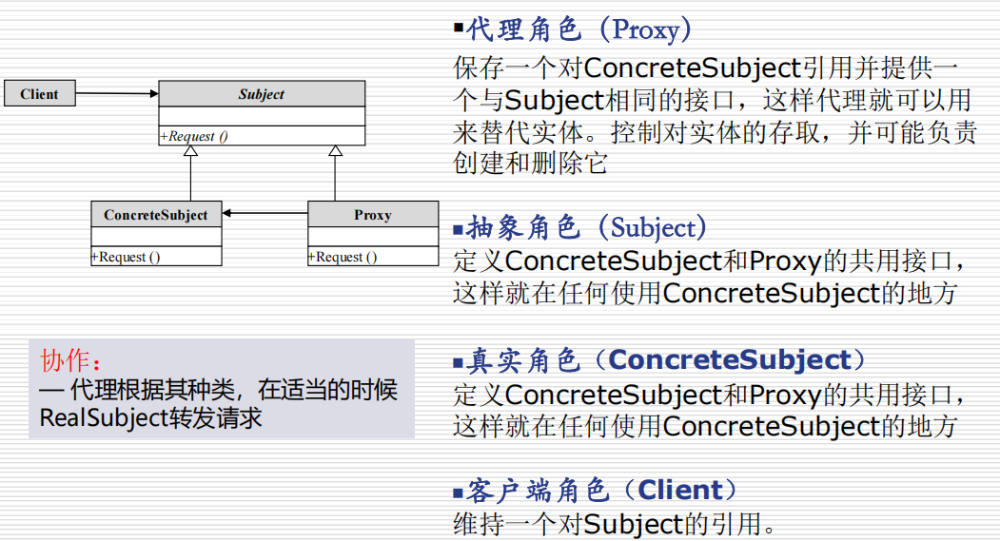

样例：

如果对象是一个大图片,需要花费很长时间才能显示出来，此时需要做个图片Proxy来代替真正的图片

如果对象在某远端服务器上,直接操作这个对象因为网络速度原因可能比较慢，那我们可以先用Proxy来代替那个对象


```cpp
#include<iostream>
#include<string>
using namespace std;

// 抽象主题接口
class Image{
public:
    virtual void display() = 0;
    virtual ~Image() = default;
};

// 真实主题类
class RealImage: public Image{
private:
    string filename;
    // 从磁盘之中加载图片
    void loadFromDisk() {
        cout << "Loading image: " << filename << " from disk" << endl;
    }
public:
    RealImage(const string& filename):filename(filename){
        loadFromDisk();
    };

    void display() override {
        cout << "Displaying image: " << filename << endl;
    }

};

// 代理类
class ProxyImage :public Image{
private:
    RealImage* realImage = nullptr;
    string filename;
    bool accessAllowed = true; // 简单的访问控制标志

    bool checkAccess() const {
        // 这里可以添加更复杂的访问控制逻辑
        return accessAllowed;
    }

    void logAccess() {
        cout << "Logged access to image: " << filename << endl;
    }
    
public:
    ProxyImage(const string& filename) : filename(filename) {}

    void display() override {
        if (!checkAccess()) {
            std::cout << "Access denied for image: " << filename << std::endl;
            return;
        }

        if (realImage == nullptr) {
            realImage = new RealImage(filename); // 延迟初始化
        }
        realImage->display();
        logAccess();
    }

    ~ProxyImage() {
        delete realImage;
    }

};


int main(){

    Image* image1 = new ProxyImage("photo1.jpg");
    Image* image2 = new ProxyImage("photo2.jpg");

    // 第一次访问会加载图片
    image1->display(); 

    // 第二次访问直接显示（已加载）
    image1->display();

    image2->display();

    delete image1;
    delete image2;
    
    return 0;
}
```


### 适配器模式

将一个类的接口换成客户希望的另一个接口，使得原本由于接口不兼容而不能在一起工作那些类能一起工作

分类：

- 类适配器模式（耦合更高，应用较少）

- 对象适配器模式

结构：

- 目标接口：当前系统业务所期待的接口，它可以是抽象类或者接口

- 适配者类：它是被访问和适配的现存主件库中的组件接口

- 适配器类：它是一个转换器，通过继承或引用适配者的对象，把适配者接口转换成目标接口，让客户按照目标接口的格式访问适配者


```cpp
#include<iostream>
using namespace std;

// 目标接口（Target Interface） - 客户端期望的充电器规格
class Charger{
public:
    virtual void charge() const = 0;
    virtual ~Charger() = default;
};


// 被适配者（Adaptee） - 已存在的欧洲插头实现
class EuroPlug{
public:
    void specificCharge() const {
        cout << "⚡ 使用欧洲插头充电 (220V)" << endl;
    }
};

// 适配器（Adapter） - 将欧洲插头适配到标准充电器接口
class EuroChargerAdapter : public Charger{
private:
    EuroPlug* euroPlug_;  // 持有被适配对象的指针
public:
    EuroChargerAdapter(EuroPlug* plug){
        this->euroPlug_ = plug;
    }

    void charge() const override {
        if(euroPlug_) {
            //使用转接口之后，就可以用欧洲的插头了
            cout << "🔌 使用电源适配器转换" << endl;
            euroPlug_->specificCharge();
        }
    }

};

// 客户端代码
int main() {
    // 创建被适配的欧洲插头
    EuroPlug euroPlug;
    
    // 创建适配器并将欧洲插头接入
    Charger* charger = new EuroChargerAdapter(&euroPlug);
    
    // 使用标准接口充电
    charger->charge();
    
    delete charger;
    return 0;
}
```

### 装饰者模式

指在不改变现有对象结构的情况下，动态的给该对象增加一些职责（增加额外功能）的模式

例子：快餐店有炒面、炒饭这些快餐，可以额外附加鸡蛋、火腿、培根这些配菜，当然加配菜需要额外加钱，每个配菜的价钱通常不太一样，那么计算总价就会显得比较麻烦。

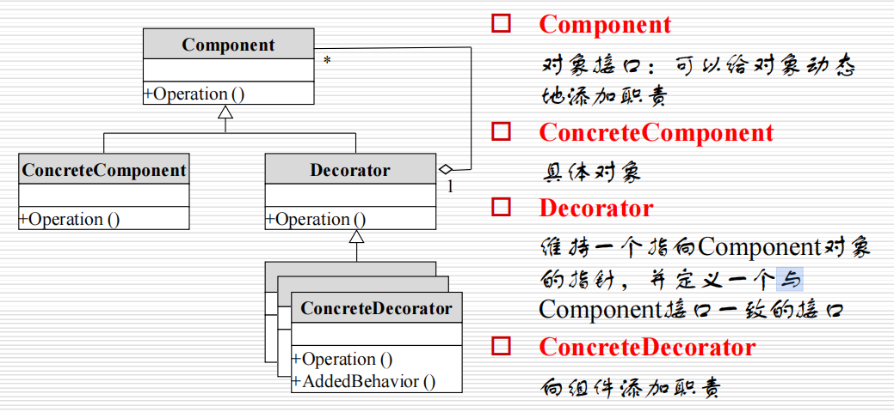


```cpp
#include<iostream>
#include<string>
using namespace std;

// 抽象组件
class Beverage {
public:
    virtual double cost() const = 0;
    virtual string description() const = 0;
    virtual ~Beverage() = default;
};

// 具体组件
class Espresso: public Beverage {
public:
    double cost() const override {
        return 1.99;
    }
    string description() const override{
        return "Espresso";
    }
};

// 抽象装饰者
class CondimentDecorator : public Beverage {
protected:
    Beverage* beverage;  // 被装饰的对象
public:
    CondimentDecorator(Beverage* b) : beverage(b) {};
    virtual ~CondimentDecorator(){
        delete beverage;
    }
};

// 具体装饰者：摩卡
class Mocha : public CondimentDecorator {
public:
    Mocha(Beverage* b) : CondimentDecorator(b) {}
    double cost() const override {
        return beverage->cost() + 0.20;
    }
    string description() const override{
        return beverage->description() + ", Mocha";
    }
};


// 具体装饰者：牛奶
class Milk : public CondimentDecorator {
public:
    Milk(Beverage* b) : CondimentDecorator(b) {}
    double cost() const override {
        return beverage->cost() + 0.50;
    }
    string description() const override {
        return beverage->description() + ", Milk";
    }
};

int main(){
    // 创建基础饮料
    Beverage* espresso = new Espresso();
    cout << espresso->description() 
              << " $" << espresso->cost() << endl;

    // 用装饰者添加配料
    Beverage* espressoWithMocha = new Mocha(espresso);
    Beverage* espressoWithMochaMilk = new Milk(espressoWithMocha);

    cout << espressoWithMochaMilk->description() 
              << " $" << espressoWithMochaMilk->cost() << endl;

    // 注意：装饰者会负责删除被装饰对象
    delete espressoWithMochaMilk;
}
```

### 桥接模式

​ 将抽象和实现分离，使它们可以独立变化。它是组合关系代替继承关系来实现的，从而降低了抽象和实现这两个可变维度的耦合度。

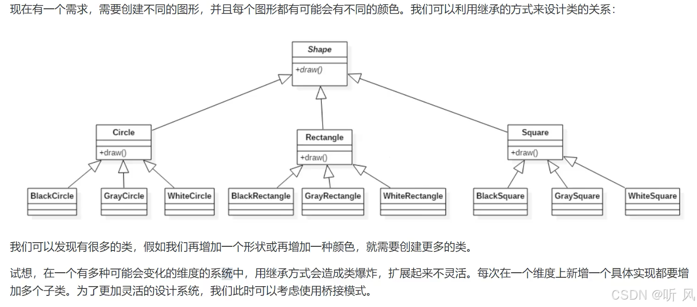

结构：

- 抽象化角色：定义抽象类，并包含一个对实现化角色的引用

- 扩展抽象化角色：是抽象化角色的子类，实现父类中的业务方法，并通过组合关系调用实现化角色中的业务方法
  
- 实现化角色：定义实现化角色的接口，供扩展抽象化角色调用

- 具体实现化角色：给出实现化角色接口的具体实现


```cpp
#include<iostream>
#include<memory>
#include<string>
using namespace std;

class DrawAPI{
public:
    virtual void draw(const string& shape) = 0;
    virtual ~DrawAPI() = default;
};

// 具体实现：使用OpenGL绘图
class OpenGLAPI:public DrawAPI{
public:
    void draw(const string& shape) override{
        cout << "OpenGL绘制: "<<shape<< endl;
    }
};

// 具体实现：使用DirectX绘图
class DirectXAPI: public DrawAPI{
public:
void draw(const string& shape) override{
    cout << "DirectX绘制: "<<shape<< endl;
}
};

// 抽象部分：图形基类
class Shape{
protected:
    unique_ptr<DrawAPI> drawAPI;
public:
    Shape(DrawAPI * api):drawAPI(api){};
    virtual void draw() = 0;
    virtual ~Shape() = default;
};

//圆形
class Circle:public Shape{
private:
    string myShape;
public:
    Circle(string shape,DrawAPI * api):Shape(api),myShape(shape){};
    void draw() override{
        drawAPI->draw(this->myShape);
    }
};

//矩形
class Rectangle:public Shape{
private:
    string myShape;
public:
    Rectangle(string shape,DrawAPI * api):Shape(api),myShape(shape){};
    void draw() override{
        drawAPI->draw(this->myShape);
    }
};

int main(){

    // 使用OpenGL绘制圆形
    unique_ptr<Shape> circle = make_unique<Circle>("圆形", new OpenGLAPI());
    // 使用DirectX绘制矩形
    unique_ptr<Shape> rect = make_unique<Rectangle>("矩形", new DirectXAPI());
    
    circle->draw();
    rect->draw();

    // 测试其他组合
    Shape* openglRect = new Rectangle("矩形", new OpenGLAPI());
    Shape* directxCircle = new Circle("圆形", new DirectXAPI());
    
    openglRect->draw();
    directxCircle->draw();
    
    delete openglRect;
    delete directxCircle;

    return 0;
}
```
### 外观模式

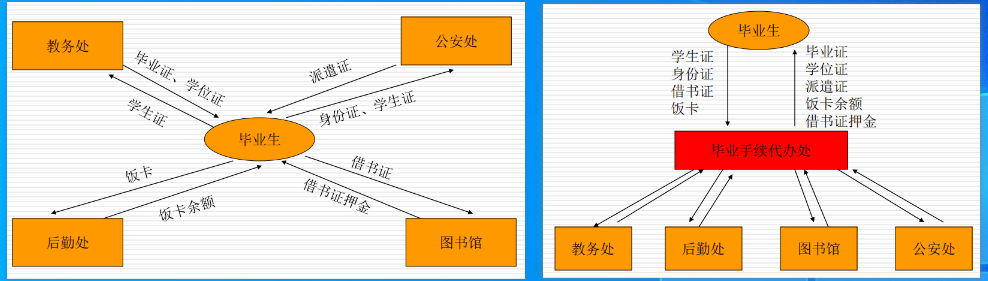

结构：

- 外观角色：为多个子系统对外提供一个共同的接口

- 子系统角色：实现系统的部分功能，客户可以通过外观角色访问它

```cpp
#include<iostream>
using namespace std;

//子系统类：音频解码器
class AudioDecoder{
public:
    void decodeAudio(const string& file){
        cout << "解码音频: " << file << endl;
    }
};

//子系统类：视频解码器
class VideoDecoder {
public:
    void decodeVideo(const string& file){
        cout << "解码视频: " << file << endl;
    }
};

//子系统类：文件加载器
class FileLoader {
public:
    string load(const string& path){
        cout << "加载文件: " << path << endl;
        return path.substr(path.find_last_of("/") + 1);
    }
};

//外观类：封装多媒体播放的复杂操作
class PlaybackManager{
private:
    FileLoader    fileLoader;
    AudioDecoder  audioDecoder;
    VideoDecoder  videoDecoder;

public:
    void play(const string& filePath) {
        string fileName = fileLoader.load(filePath);
        audioDecoder.decodeAudio(fileName);
        videoDecoder.decodeVideo(fileName);
        cout << "开始播放 " << fileName << endl;
    }

};

// 客户端代码
int main() {
    PlaybackManager player;
    player.play("/media/movie.mp4");
    return 0;
}
```

### 组合模式
部分整体模式，是用于把一组相似的对象当做一个单一的对象，组合模式依据树形结构来组合对象，用来表示部分以及整体层次。这种类型的设计模式属于结构型模式，她创建了对象组的树形结构。

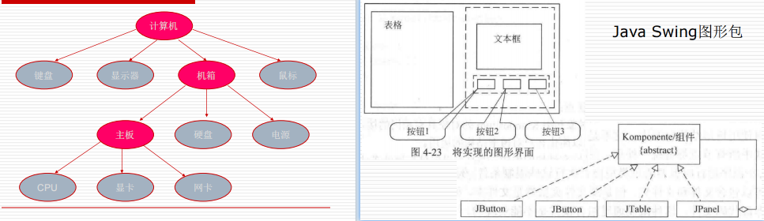

结构：

- 抽象根节点：定义系统各层次对象共有方法和属性，可以预先定义一些默认行为和属性

- 树枝节点：定义树枝节点的行为，存储子节点，组合树枝节点和叶子节点形成一个树形结构

- 叶子节点：叶子节点对象，其下再无分支，是系统层次遍历的最小单位

```cpp
#include <iostream>
#include <vector>
#include <memory>
#include <string>
#include <algorithm>
using namespace std;

//抽象接口
class FileSystemComponent{
public:
    virtual void display(int depth = 0) const = 0;
    virtual size_t getSize() const = 0;
    virtual ~FileSystemComponent() = default;
};

// 叶子节点：文件
class File : public FileSystemComponent {
private:
    string name_;
    size_t size_;
public:
    File(const string& name,size_t size):name_(name),size_(size){}

    void display(int depth = 0) const override{
        cout << string(depth, '\t') << "📄 " << name_ 
            << " (" << size_ << " bytes)" << endl;
    }

    size_t getSize() const override { return size_; }
};

// 复合节点：目录
class Directory:public FileSystemComponent{
private:
    string name_;
    vector<shared_ptr<FileSystemComponent>> children_;
public:
    Directory(const string& name) : name_(name) {}

    void addComponent(shared_ptr<FileSystemComponent> component){
        children_.push_back(component);
    }

    void removeComponent(shared_ptr<FileSystemComponent> component){
        children_.erase(
            remove(children_.begin(), children_.end(), component),
            children_.end()
        );
    }

    void display(int depth = 0) const override {
        cout << string(depth, '\t') << "📁 " << name_ 
            << " [" << getSize() << " bytes]" << endl;

        for (const auto& child : children_) {
            child->display(depth + 1);
        }
    }

    size_t getSize() const override {
        size_t total = 0;
        for (const auto& child : children_) {
            total += child->getSize();
        }
        return total;
    }
};

int main(){
    // 创建文件
    auto file1 = make_shared<File>("document.txt", 1500);
    auto file2 = make_shared<File>("image.jpg", 2500);
    auto file3 = make_shared<File>("notes.md", 800);

    // 创建子目录
    auto subdir = make_shared<Directory>("Downloads");
    subdir->addComponent(file2);
    subdir->addComponent(file3);

    // 创建根目录
    auto root = make_shared<Directory>("Root");
    root->addComponent(file1);
    root->addComponent(subdir);

    // 添加另一个文件到根目录
    root->addComponent(make_shared<File>("backup.zip", 4200));

    // 显示整个结构
    cout << "File System Structure:\n";
    root->display();

    cout << "\nTotal size of root: " 
            << root->getSize() << " bytes" << endl;

    return 0;
}
```

### 享元模式

​运用共享技术来有效地支持大量细粒度对象的复用。它通过共享已经存在的对象来大幅度减少需要创建的对象数量、避免大量相似对象的开销，从而提高系统资源的利用率。

内部状态。不会随着环境的改变而改变的可共享部分

外部状态。随着环境的改变而改变的不可共享的部分。享元模式的实现要领就是区分应用中的这两种状态，并将外部状态外部化。

引例：

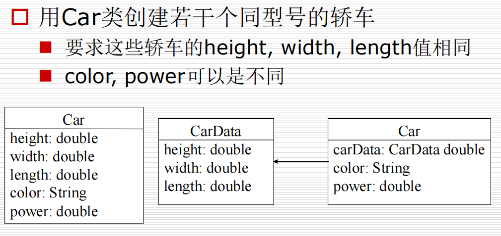

```cpp
#include<iostream>
#include <string>
#include <unordered_map>
#include <vector>
using namespace std;

// 享元对象：包含树木的固有属性（内部状态）
class TreeType {
private:
    string name_;   // 内部状态
    string color_;  // 内部状态
    string texture_; // 内部状态
public:
    TreeType(const string& name, const string& color, const string& texture)
        : name_(name), color_(color), texture_(texture) {}
    
    void draw(int x, int y, int age) const { // 外部状态作为参数
        cout << "绘制 " << name_ << " 在 (" << x << ", " << y 
                  << ")，颜色：" << color_ 
                  << "，纹理：" << texture_
                  << "，年龄：" << age << "年\n";
    }
};

// 享元工厂
class TreeFactory {
private:
    unordered_map<string,TreeType> treeTypes_;
    // 生成唯一键
    string makeKey(const string& name, 
                const string& color, 
                const string& texture) {
        return name + "_" + color + "_" + texture;
    }
public:
    const TreeType& getTreeType(const string& name, 
                               const string& color, 
                               const string& texture) {
        string key = makeKey(name, color, texture);
        // 如果不存在则创建新类型
        if (treeTypes_.find(key) == treeTypes_.end()) {
            cout << "创建新的树木类型: " << key << endl;
            treeTypes_.emplace(key, TreeType(name, color, texture));
        }
        return treeTypes_.at(key);
    }
};

// 包含外部状态的树木对象
class Tree {
private:
    int x_;         // 外部状态
    int y_;         // 外部状态
    int age_;       // 外部状态
    const TreeType& type_; // 指向享元的引用

public:
    Tree(int x, int y, int age, const TreeType& type)
        : x_(x), y_(y), age_(age), type_(type) {}

    void draw() const {
        type_.draw(x_, y_, age_);
    }
};


// 森林包含多个树木
class Forest {
private:
    vector<Tree> trees_;
    TreeFactory factory_;

public:
    void plantTree(int x, int y, int age,
                   const string& name,
                   const string& color,
                   const string& texture) {
        const TreeType& type = factory_.getTreeType(name, color, texture);
        trees_.emplace_back(x, y, age, type);
    }

    void draw() const {
        for (const auto& tree : trees_) {
            tree.draw();
        }
    }
};


int main() {
    Forest forest;
    
    // 种植不同类型的树
    forest.plantTree(1, 2, 5, "松树", "深绿", "针叶纹理");
    forest.plantTree(3, 4, 7, "橡树", "浅绿", "宽叶纹理");
    forest.plantTree(5, 6, 3, "松树", "深绿", "针叶纹理"); // 复用已有类型
    forest.plantTree(7, 8, 2, "白桦", "白色", "条纹纹理");
    forest.plantTree(9, 0, 4, "橡树", "浅绿", "宽叶纹理"); // 复用已有类型

    cout << "\n开始绘制森林：\n";
    forest.draw();

    return 0;
}
```

## 行为型模式

行为型模式用于描述程序在运行时复杂的流程控制，即描述多个类或对象之间怎样相互协作共同完成单个对象都无法完成的任务，涉及算法与对象之间职责的分配

- 类行为型模式（继承实现）

- 对象行为型模式（组合或聚合实现）（满足合成复用原则，灵活性高）

### 模板方法模式

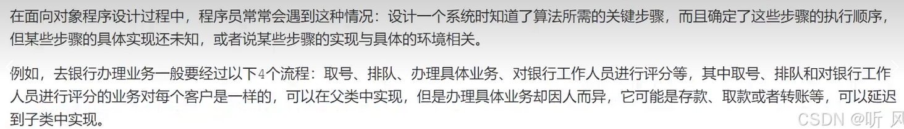

​ 定义一个操作中的算法骨架，而将算法的一些步骤延迟到子类中，使得子类可以不改变算法结构的情况下重定义该算法的某些特定步骤

```cpp
#include<iostream>
using namespace std;

class Beverage{
public:
    virtual void prepareBeverage() final {
        boilWater();
        brew();
        pourInCup();
        if (customerWantsCondiments()) { // 钩子方法
            addCondiments();
        }
    }
protected:
    // 具体方法（已实现）
    void boilWater() {
        cout << "Boiling water" << endl;
    }

    void pourInCup() {
        cout << "Pouring into cup" << endl;
    }

    // 抽象方法（需要子类实现）
    virtual void brew() = 0;
    virtual void addCondiments() = 0;

    // 钩子方法（可选重写）
    virtual bool customerWantsCondiments() {
        return true; // 默认添加调料
    }
};

// 具体子类：咖啡
class Coffee:public Beverage{
protected:
    void brew() override {
        std::cout << "Brewing coffee grounds" << std::endl;
    }

    void addCondiments() override {
        std::cout << "Adding sugar and milk" << std::endl;
    }

    // 重写钩子方法
    bool customerWantsCondiments() override {
        char choice;
        std::cout << "Would you like milk and sugar with your coffee? (y/n) ";
        std::cin >> choice;
        return choice == 'y' || choice == 'Y';
    }
};

// 具体子类：茶
class Tea : public Beverage {
protected:
    void brew() override {
        std::cout << "Steeping the tea" << std::endl;
    }

    void addCondiments() override {
        std::cout << "Adding lemon" << std::endl;
    }

    // 不重写钩子方法，保持默认添加调料
};


// 使用示例
int main() {
    std::cout << "Making coffee:" << std::endl;
    Coffee coffee;
    coffee.prepareBeverage();

    std::cout << "\nMaking tea:" << std::endl;
    Tea tea;
    tea.prepareBeverage();

    return 0;
}
```