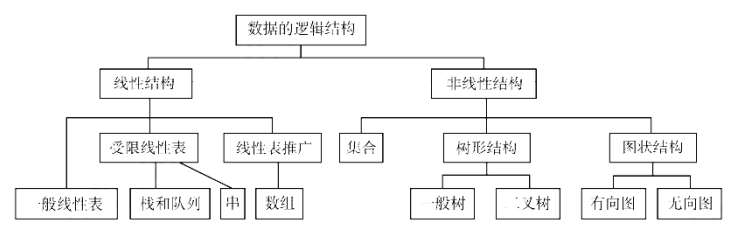
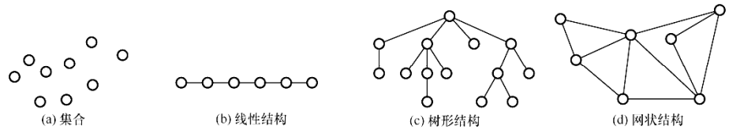

# 数据结构 王道2026学习笔记

# 第一章 绪论

## 1.1 数据结构的基本概念

### 概念和术语

- **数据**数据是描述客观事物的符号，是计算机中可以操作的对象，是能被计算机识别，并输入给计算机处理的符号集合。

- **数据元素**数据元素是数据的基本单位，在计算机中通常作为一个整体进行考虑和处理。

- **数据项**一个数据元素可以由若干个数据项组成，数据项是数据不可分割的最小单位。

- **数据对象**数据对象是性质相同的数据元素的集合，是数据的子集。

- **数据类型** 数据类型是一个值的集合和定义在此集合上的一组操作的总称。
  - 原子类型：其值不可再分的类型，如整型、浮点型、字符型等。
  - 结构类型：其值可以再分的类型，如整形数组、浮点型数组、结构体、链表、栈、队列等。
  - 抽象数据类型（Abstract Data Type, ADT）：抽象数据类型是指一个数学模型及定义在该模型上的一组操作。

### 数据结构三要素

1.逻辑结构：数据元素之间的逻辑关系。

2.存储结构：数据元素及其关系在计算机存储器中的表示。

3.数据运算：针对某种逻辑结构在相应存储结构上的操作。

**逻辑结构**

- 集合：集合结构中的数据元素除了同属于一个集合外，它们之间没有其他关系。
- 线性结构：线性结构中的数据元素之间存在一对一的关系。
- 树形结构：树形结构中的数据元素之间存在一对多的层次关系。
- 图状结构或网状结构：图状结构中的数据元https://xiaolincoding.com/素之间存在多对多的关系。
  
**存储结构**

- 顺序存储: 用一组连续的存储单元依次存储数据元素，数据元素之间的逻辑关系由元素的存储位置来表示。
- 链式存储: 用一组任意的存储单元存储数据元素，数据元素之间的逻辑关系用指针来表示。
- 索引存储: 在存储数据元素的同时，还建立附加的索引表，索引表中的每项称为索引项，索引项的一般形式是（关键字，地址）。
- 散列存储: 散列存储是根据元素的关键字直接计算出该元素的存储地址，因此散列存储不需要建立索引表。
  
**数据运算**
- 包括运算的定义和运算的实现两个部分。
- 数据运算的定义是针对逻辑的，指出运算的功能
- 数据运算的实现是针对存储的，指出运算的具体实现方法

## 1.2 算法

### 算法的概念

算法是解决特定问题求解步骤的描述，在计算机中表现为指令的有限序列，并且每条指令表示一个或多个操作。

算法具有以下五个特性(了解)：
- 有穷性：一个算法必须总在执行有穷步之后结束，且每一步都可在有穷时间内完成。
- 确定性：算法中每条指令必须有确切的含义，对于相同的输入只能得到相同的输出。  
- 可行性：算法的每一步操作都是可行的，即每一步都能够通过执行有限次数完成。
- 输入：一个算法有零个或多个输入，这些输入取自于某个特定的对象的集合。
- 输出：一个算法有一个或多个输出，这些输出是与输入有着某种特定关系的量。

算法达到的目标(了解)：

- 正确性：算法对于合法的输入，能够产生满足要求的输出，对非法输入能够做出相应处理。
- 可读性：算法应具有良好的可读性，以帮助人们理解。
- 健壮性：当输入数据不合法时，算法也能做出相关处理，而不是产生异常或莫名其妙的结果。
- 高效性：算法应尽量简短，算法的执行时间应尽可能短，算法所需的存储空间应尽量小。

### 算法效率的度量！！！

时间复杂度：算法的时间复杂度是指算法执行时间随问题规模n的变化而变化的函数，记作：T(n)=O(f(n))。其中f(n)是问题规模n的某个函数，O是数量级符号。

空间复杂度：算法的空间复杂度是指算法在计算机内执行时所需存储空间的度量，记作：S(n)=O(g(n))。其中g(n)是问题规模n的某个函数，O是数量级符号。

# 第二章 线性表
