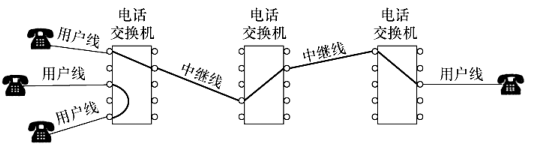
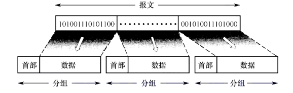
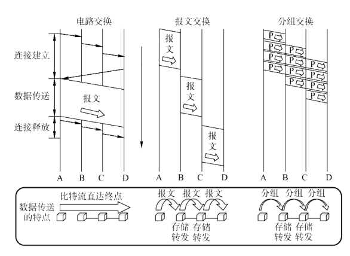
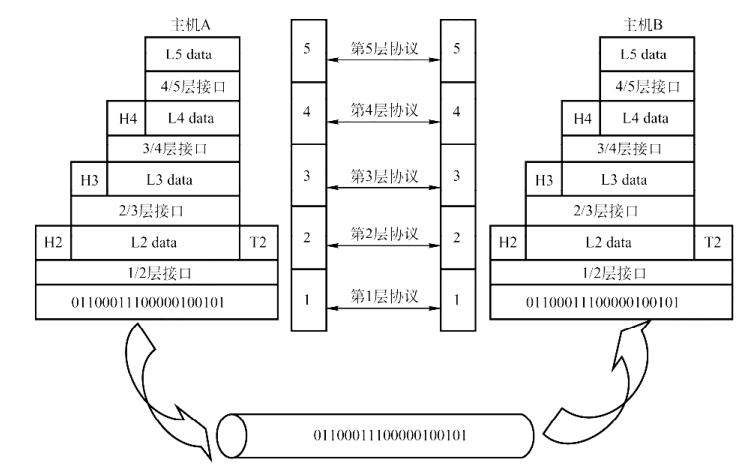
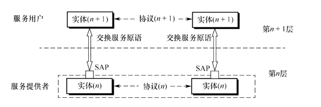
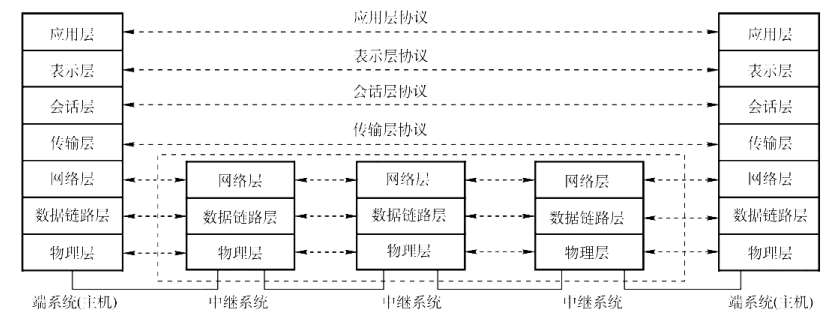
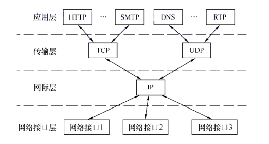
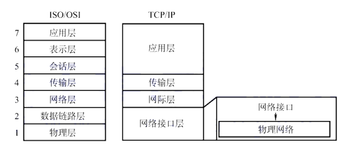
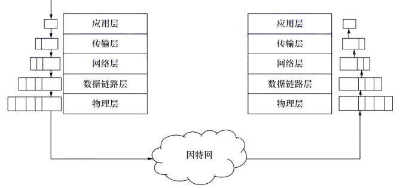

# 计算机网络 王道2026学习笔记

# 第一章 计算机网络体系结构

## 1.1 计算机网络概述

### 计算机网络的概念

计算机网络是一个将分散的、独立的计算机系统，通过通信设备和线路连接起来，由功能完善的软件实现资源共享和信息传递的系统。

由若干节点（计算机，集线器，交换机或路由器等）和连接这些节点的链路组成。

网络之间通过 路由器 互联

### 计算机网络的组成
分角度
- **组成部分**：硬件(主机、路由器、交换机、集线器、调制解调器等)、软件(网络协议、网络操作系统、网络应用软件等),协议
- **工作方式**：边缘部分（用户直接使用）和核心部分（数据交换）
- **功能组成**：通信子网（实现数据传输）和资源子网（实现资源共享）

### 计算机网络的功能
- **数据通信**：数据传输、信号传输
- **资源共享**：硬件、软件、数据
- **分布式处理**：多台计算机协同完成一项任务
- **提高系统可靠性**：一台计算机故障，其他计算机可以顶替
- **负载均衡**：多台计算机共同承担工作任务

### 电路交换、报文交换、分组交换
**电路交换**
- 通信之前需要建立连接，连接建立后才能通信，通信结束后释放连接(建立连接->传输数据->释放连接)
- 优点：通信时延小，有序传输，没有冲突，实时性强
- 缺点：建立连接时间长，信道利用率低，灵活性差，难以实现差错控制
- 样例：传统的电话网

**报文交换**
- 将整个报文发送到下一个节点，再由下一个节点转发，直到到达目的节点(存储转发技术)
- 优点：无建立连接时延，灵活分配线路，线路利用率高，易于实现差错控制
- 缺点：转发时延大，缓存开销大，有序性难以保证，实时性差

**分组交换**
- 将报文划分为若干个分组，每个分组独立传输，到达目的节点后重新组装(存储转发技术)
- 分组：
  - 分组头：分组序号、分组长度、目的地址、源地址等
  - 分组数据：报文数据

- 优点：由报文交换的优点，此外还有 方便存储和管理，传输效率高，减少了出错的概率和重传的代价
- 缺点：存在存储转发的时延，需要传输额外的分组头信息，可能会出现失序、重复以及丢失分组的情况

### 计算机网络的分类
**按交换技术分类**
- 电路交换网
- 报文交换网
- 分组交换网

**按网络范围分类**
- 广域网(WAN)
- 城域网(MAN)
- 局域网(LAN)
- 个人区域网(PAN)

**按传播技术**
- 广播式网络：所有节点共享一个通信信道
- 点对点网络：每条物理线路连接两个节点

**按拓扑结构分类**
- 总线型网络
- 星型网络
- 环型网络
- 网状型网络

### 计算机网络的性能指标(了解)
**速率**
- 数据传输速率，即数据率，表示单位时间内传输的数据量，单位是比特/秒(bps)
- 带宽，即数据传输速率，单位是比特/秒(bps)
- 吞吐量，即单位时间内通过某个网络(信道或接口)的数据量，单位是比特/秒(bps)
- 时延，即数据从网络的一端传送到另一端所需的时间，单位是秒(s)
  - 发送时延：主机或路由器发送数据帧所需要的时间
  - 传播时延：电磁波在信道中传播一定距离所需要的时间
  - 处理时延：主机或路由器对收到的数据帧进行处理所需要的时间
  - 排队时延：数据帧在路由器输入队列和输出队列中排队等待处理所需要的时间
  - 总时延：发送时延 + 传播时延 + 处理时延 + 排队时延

- 时延带宽积：时延带宽积 = 传播时延 * 带宽，表示信道中可以容纳的数据量，单位是比特
- 往返时延RTT：从发送端发送数据开始，到发送端收到接收端的确认，所需要的时间，单位是秒(s)
- 利用率：网络中处于活跃状态的链路或节点所占用的比例，单位是百分比

## 1.2 计算机网络体系结构与参考模型

### 计算机网络分层结构
**分层的原则：**
- 每一层都实现一种相对独立的功能，降低大系统的复杂性
- 每层之间的接口自然清晰，易于理解，相互交流尽可能的少
- 各层功能的精确定义独立于具体的实现方法，可以采用最合适的技术来实现
- 保持下层对上层的独立性，上层单向依赖下层，下层单向服务上层
- 整个分层结构应能促进标准化工作

一些概念：
- 对等层：同一网络(不同机器上)中相同层次上的实体
- 对等实体：同一网络(不同机器上)中相同层次上的实体
- 协议数据单元(PDU)：对等层之间交换的信息单元
- 服务数据单元(SDU)：同一层内部传递的数据单元
- 协议控制信息(PCI)：控制协议操作的信息
- n-SDU + n-PCI = n-PDU = (n-1)-SDU !!!!

### 计算机网络协议，接口，服务的概念
**协议：**

为了在网络中进行数据交换而建立的规则、标准或约定成为**网络协议**

网络协议时控制对等实体之间进行通信的规则，是水平的。

协议由三部分组成：
- 语法：定义了数据与控制信息的格式
- 语义：需要发出何种控制信息，以及完成的动作以及如何响应对方的动作
- 同步：执行各个操作的条件以及时序关系

**接口：**

同一节点内相邻两层之间交换信息的逻辑接口，服务访问点(SAP). 每层只能在紧邻的层之间定义接口，不可以跨层定义

**服务：**

下层为紧邻的上层所提供的一组操作，是垂直的

计算机网络提供的服务可分为以下三种类型：
1. 面向连接和无连接的服务
  - 面向连接的服务：在数据传输之前需要先建立连接，数据传输结束后需要释放连接
  - 无连接的服务：在数据传输之前不需要建立连接，数据传输结束后不需要释放连接
2. 可靠服务和不可靠服务
  - 可靠服务：保证数据传输的可靠性，包括数据传输的顺序、数据传输的完整性等
  - 不可靠服务：不保证数据传输的可靠性，只负责将数据传输到目的节点，不保证数据传输的顺序、数据传输的完整性等
3. 有应答服务和无应答服务 
  - 有应答服务：在数据传输过程中需要接收方的应答，以确保数据传输的可靠性
  - 无应答服务：在数据传输过程中不需要接收方的应答，只负责将数据传输到目的节点，不保证数据传输的可靠性

### 计算机网络体系结构参考模型
**OSI参考模型**
- OSI参考模型是一个理论模型，用于描述计算机网络的结构和功能
- OSI参考模型将计算机网络分为七个层次，从低到高分别为：物理层、数据链路层、网络层、传输层、会话层、表示层和应用层
- 每一层都有特定的功能和协议，用于实现网络通信的不同方面
- OSI参考模型是一种理论模型，实际的网络协议和实现可能不完全符合该模型，但可以作为理解和设计网络协议的参考

先有一个概念，后面重要的层会详细讲解

**1.物理层**
- 物理层是OSI参考模型的最底层，负责实现物理连接，即实现数据传输的物理介质和传输速率
- 物理层的主要功能包括：定义物理连接的电气特性、机械特性、功能特性和规程特性等
- 物理层的主要设备包括：网卡、调制解调器、中继器、集线器等
- 传输的数据单位是比特(bit)

**2.数据链路层**
- 数据链路层是OSI参考模型的第二层，负责在物理连接上进行**可靠的数据传输**
- 数据链路层的主要功能包括：帧的封装与拆封、帧的校验与确认(差错控制)、流量控制等
- 数据链路层的主要设备包括：交换机、路由器等
- 传输的数据单位是帧(frame)

**3.网络层**
- 网络层是OSI参考模型的第三层，负责实现数据在网络中的传输
- 网络层的主要功能包括：路由选择、拥塞控制、网络互联等
- 网络层的主要设备包括：路由器、交换机等
- 传输的数据单位是数据报(packet)

**4.传输层**
- 传输层是OSI参考模型的第四层，负责实现端到端(端口到端口)的可靠数据传输
- 传输层的主要功能包括：可靠传输、流量控制、拥塞控制等
- 传输层的主要设备包括：防火墙、代理服务器等
- 传输的数据单位是报文段(segment)

**5.会话层**
- 会话层是OSI参考模型的第五层，负责在两个进程之间建立、管理和终止会话
- 会话层的主要功能包括：会话的建立、管理和终止、同步等
- 会话层的主要设备包括：会话服务器等
- 传输的数据单位是会话数据单元(session data unit)

**6.表示层**
- 表示层是OSI参考模型的第六层，负责数据的表示、加密、压缩等
- 表示层的主要功能包括：数据格式的转换、数据加密、数据压缩等
- 表示层的主要设备包括：加密设备、解密设备等
- 传输的数据单位是表示数据单元(representation data unit)

**7.应用层**
- 应用层是OSI参考模型的第七层，负责提供网络应用服务
- 应用层的主要功能包括：文件传输、电子邮件、远程登录、Web浏览等
- 应用层的主要设备包括：服务器、客户端等
- 传输的数据单位是应用数据单元(application data unit)

**TCP/IP参考模型**
- TCP/IP参考模型是一个实际使用的网络协议栈，用于实现网络通信
- TCP/IP参考模型将计算机网络分为四个层次，从低到高分别为：网络接口层、互联网层(网络层，网际层)、传输层和应用层
- 每一层都有特定的功能和协议，用于实现网络通信的不同方面
- TCP/IP参考模型是一种实际使用的网络协议栈，实际的网络协议和实现可能不完全符合该模型，但可以作为理解和设计网络协议的参考

**TCP/IP参考模型与OSI参考模型的区别**
- OSI参考模型是一个理论模型，用于描述计算机网络的结构和功能，而TCP/IP参考模型是一个实际使用的网络协议栈，用于实现网络通信
- OSI参考模型将计算机网络分为七个层次，而TCP/IP参考模型将计算机网络分为四个层次
- OSI参考模型中的数据链路层和物理层在TCP/IP参考模型中合并为网络接口层
- OSI参考模型中的会话层、表示层和应用层在TCP/IP参考模型中合并为应用层

**应用层DNS报文逐层封装的关系**
就是之前说的SDU PCI 与 PDU的关系

