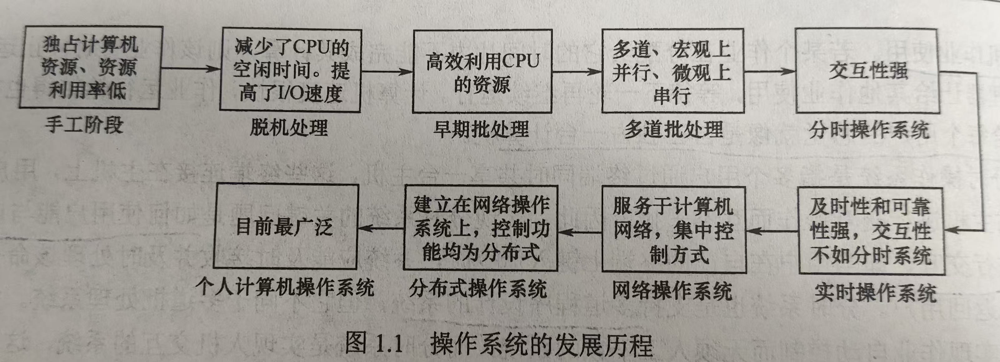

# 擦作系统 王道2026学习笔记

# 第一章计算机系统概述

## 1.1 操作系统的基本概念

### 操作系统的定义：

控制和管理整个计算机系统的硬件与软件资源，合理地资助、调度计算机的工作和资源的分配，基进而为用户和其他软件提供方便的接口与环境的程序集合。操作系统是计算机中族基本的软件系统。

### 操作系统的功能和目标

**1.系统资源的管理者**

- 处理器管理
- 存储器管理
- 文件管理
- 设备管理

**2.作为用户和计算机系统之间的接口**
- 命令接口
  - 联机命令接口：强调交互性，用户输入命令，操作系统来完成指令
  - 脱机命令接口：批处理命令接口，用户提前编辑命令列表，操作系统来完成
- 程序接口
  - 由一系列的系统调用组成，用户通过请求这些命令来使得操作系统完成指令（GUI界面的等）

**3.实现了对计算机资源的扩充**
- 工人 操作 机器，机器就有更大的作用，于是，工人 便成为了 机器 的 扩充机器

### 操作系统特性
**1.并发**（注意和并行的区别）

概念：两个或者多个事件在同一时间间隔内发生

注意和**并行**的区别

并性的概念：两个或者多个事件在**同一时刻**内发生

引入进程的目的就是使程序能够并发执行

**2.共享**

资源共享：系统中的资源可以提供给内存之中多个并发执行的进程使用

- 互斥共享方式
  - 某些资源虽然可以提供给多个进程使用，但是在同一时刻只允许一个进程访问该资源
  - 打印机、磁带机
- 同时共享方式
  - 允许一段时间内由多个进程''同时''访问
  - 磁盘设备

**3.虚拟**

一个物理的实体变为若干逻辑上的对应物品
- 时分复用技术: 虚拟处理器。批处理的时候，多个进程并发执行，使得用户感觉，就是多个处理器在运行
- 空分复用技术：虚拟存储器

**4.异步**

并发执行的程序，由于资源限制，不是一贯到底的执行，而是走走停停，他以不可预知的速度向前推进

## 1.2 操作系统的发展历史

### 手工操作阶段
计算机上所有的工作都需要人工干预（程序的装入，运行，输出等）

用户独占机器，CPU等待人工操作，人机上的速度的冲突

### 批处理阶段
主要是为了解决人机矛盾以及CPU与I/O设备之间的速度不匹配等问题

- 单道批处理系统：将一批作业以脱机方式输入磁带，在监督程序的控制下，一个接一个的顺序的执行
  - 自动性（不需要人工干涉） 
  - 顺序性（磁带上的各个作业依次进入内存并执行）
  - 单道性（内存之中只存在一个程序）

- 多道批处理系统：作业在外存排成队列，然后按调度算法调入内存，一次可以调多个，相互穿插着执行
  - 多道
  - 宏观上并行（调入内存的程序都在运行，但还没有执行完毕）
  - 微观上串行（内存之中的多道程序，不可以同时占有CPU，还是交替占有执行）

### 分时操作系统
分时技术：将处理器的运行时间分成很短的时间片，按时间片轮流将处理器分配给各个作业使用；计算机速度很快，时间片轮转速度也很快，使得用户感觉自己在独占机器。

特点：
- 同时性：多个终端用户可以同时使用一台计算机
- 交互性：用户通过终端采用人机对话的方式直接控制程序，与程序进行交互
- 独立性：多个用户独立的操作计算机，不会存在相互干扰。就好像自己在独占这台机器一样
- 及时性：用户的请求能够在很短时间内获得响应
  
### 实时操作系统
必须在某一个时间限制内完成某些紧急的任务。

- 硬实时系统：必须，绝对在规定的时间内完成任务（飞行器的控制系统）
- 软实时系统：偶尔不再一定时间内完成也不会造成太大的影响（飞机购票，银行管理等）

### 网络操作系统和分布式计算机系统（略）
### 个人计算机操作系统（略）

