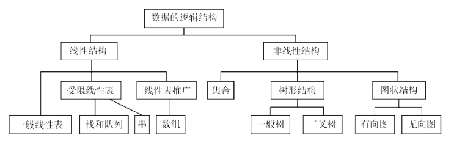
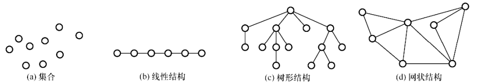
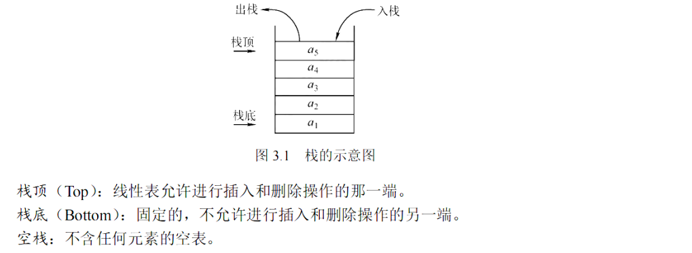
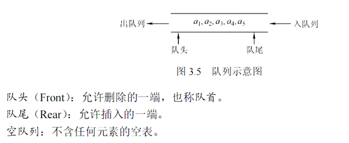
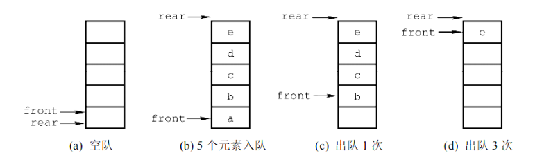
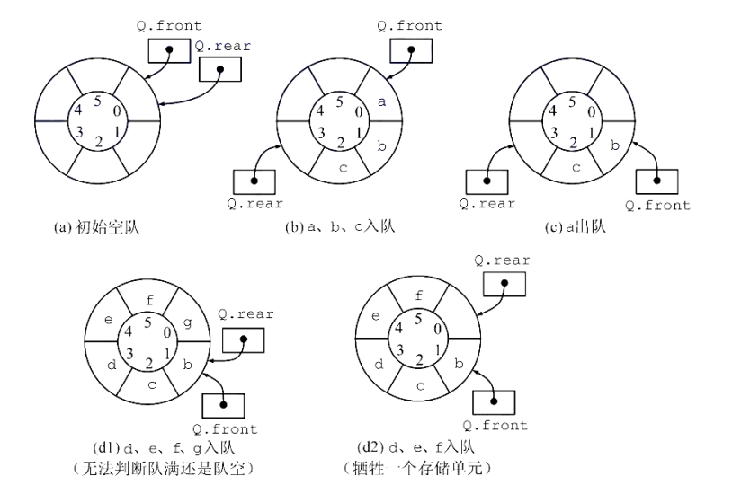
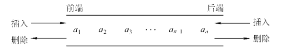
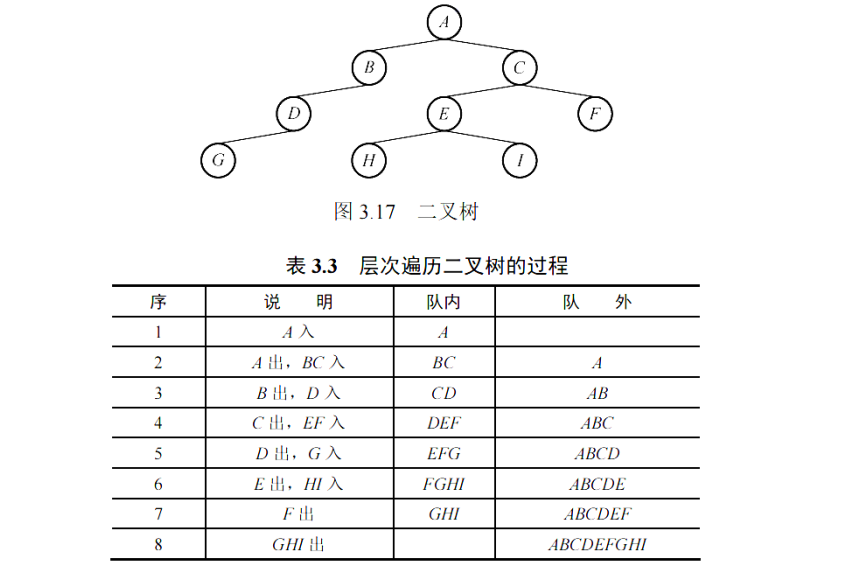
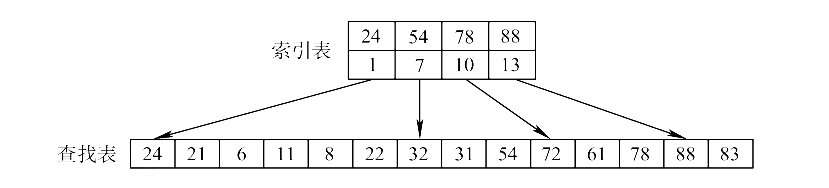

# 数据结构 王道2026学习笔记

# 第一章 绪论

## 1.1 数据结构的基本概念

### 概念和术语

- **数据**数据是描述客观事物的符号，是计算机中可以操作的对象，是能被计算机识别，并输入给计算机处理的符号集合。

- **数据元素**数据元素是数据的基本单位，在计算机中通常作为一个整体进行考虑和处理。

- **数据项**一个数据元素可以由若干个数据项组成，数据项是数据不可分割的最小单位。

- **数据对象**数据对象是性质相同的数据元素的集合，是数据的子集。

- **数据类型** 数据类型是一个值的集合和定义在此集合上的一组操作的总称。
  - 原子类型：其值不可再分的类型，如整型、浮点型、字符型等。
  - 结构类型：其值可以再分的类型，如整形数组、浮点型数组、结构体、链表、栈、队列等。
  - 抽象数据类型（Abstract Data Type, ADT）：抽象数据类型是指一个数学模型及定义在该模型上的一组操作。

### 数据结构三要素

1.逻辑结构：数据元素之间的逻辑关系。

2.存储结构：数据元素及其关系在计算机存储器中的表示。

3.数据运算：针对某种逻辑结构在相应存储结构上的操作。

**逻辑结构**





- 集合：集合结构中的数据元素除了同属于一个集合外，它们之间没有其他关系。
- 线性结构：线性结构中的数据元素之间存在一对一的关系。
- 树形结构：树形结构中的数据元素之间存在一对多的层次关系。
- 图状结构或网状结构：图状结构中的数据元https://xiaolincoding.com/素之间存在多对多的关系。
  
**存储结构**

- 顺序存储: 用一组连续的存储单元依次存储数据元素，数据元素之间的逻辑关系由元素的存储位置来表示。
- 链式存储: 用一组任意的存储单元存储数据元素，数据元素之间的逻辑关系用指针来表示。
- 索引存储: 在存储数据元素的同时，还建立附加的索引表，索引表中的每项称为索引项，索引项的一般形式是（关键字，地址）。
- 散列存储: 散列存储是根据元素的关键字直接计算出该元素的存储地址，因此散列存储不需要建立索引表。
  
**数据运算**
- 包括运算的定义和运算的实现两个部分。
- 数据运算的定义是针对逻辑的，指出运算的功能
- 数据运算的实现是针对存储的，指出运算的具体实现方法

## 1.2 算法

### 算法的概念

算法是解决特定问题求解步骤的描述，在计算机中表现为指令的有限序列，并且每条指令表示一个或多个操作。


算法具有以下五个特性(了解)：
- 有穷性：一个算法必须总在执行有穷步之后结束，且每一步都可在有穷时间内完成。
- 确定性：算法中每条指令必须有确切的含义，对于相同的输入只能得到相同的输出。  
- 可行性：算法的每一步操作都是可行的，即每一步都能够通过执行有限次数完成。
- 输入：一个算法有零个或多个输入，这些输入取自于某个特定的对象的集合。
- 输出：一个算法有一个或多个输出，这些输出是与输入有着某种特定关系的量。

算法达到的目标(了解)：

- 正确性：算法对于合法的输入，能够产生满足要求的输出，对非法输入能够做出相应处理。
- 可读性：算法应具有良好的可读性，以帮助人们理解。
- 健壮性：当输入数据不合法时，算法也能做出相关处理，而不是产生异常或莫名其妙的结果。
- 高效性：算法应尽量简短，算法的执行时间应尽可能短，算法所需的存储空间应尽量小。

### 算法效率的度量！！！

时间复杂度：算法的时间复杂度是指算法执行时间随问题规模n的变化而变化的函数，记作：T(n)=O(f(n))。其中f(n)是问题规模n的某个函数，O是数量级符号。

空间复杂度：算法的空间复杂度是指算法在计算机内执行时所需存储空间的度量，记作：S(n)=O(g(n))。其中g(n)是问题规模n的某个函数，O是数量级符号。


# 第二章 线性表

# 第三章 栈、队列和数组

## 栈

### 栈的定义和基本操作

只允许在一端进行插入或删除的线性表



当有n个不同的元素入栈的时候，出栈排列有(1/n+1)/C^n_{2n}种

**共享栈**

一个数组两个栈用，一个用栈底一个用栈顶（好奇怪）

栈的实现（数组实现比较简单，这里采用链栈实现）

链栈的优点在于不存在上溢问题

```cpp
#include<iostream>
using namespace std;

enum operation_code {success,overflow,underflow};

template <typename T>
struct Node{
    T data;
    Node<T>* next;
};

template <typename T>
class LinkStack{
private:
    Node<T> *top;
    int stackSize;

public:
    LinkStack(){
        top = new Node<T>();
        top->next = nullptr;
        stackSize = 0;
    };

    //判空
    bool isEmpty(){
        return stackSize==0;
    }

    //入栈
    operation_code push(T data){
        Node<T>* newNode = new Node<T>();
        newNode->data = data;
        newNode->next = top->next;
        top->next = newNode;
        stackSize++;
        return success;
    }

    //读栈顶元素
    operation_code getTop(T &x){
        if (!top->next){
            return underflow;
        }
        x = top->next->data;
        return success;
    }

    //出栈
    operation_code pop(T &x){
        if (!top->next){
            return underflow;
        }
        Node<T>* popNode = top->next;
        x = popNode->data;
        top->next = popNode->next;
        delete popNode;
        stackSize--;
        return success;
    }

    ~LinkStack(){
        T temp;
        while(!isEmpty()){
            pop(temp);
        }
        delete top;
        top = nullptr;
    }
};


int main(){
    LinkStack<int> stack;

    // 测试空栈弹出
    int x;
    if (stack.pop(x) == underflow) {
        cout << "1. 空栈弹出失败测试通过" << endl;
    }

    // 测试入栈和栈顶
    stack.push(10);
    stack.getTop(x);
    cout << "2. 当前栈顶元素（应为10）: " << x << endl;

    stack.push(20);
    stack.push(30);

    // 连续弹出测试
    stack.pop(x);
    cout << "3. 弹出元素（应为30）: " << x << endl;
    stack.pop(x);
    cout << "4. 弹出元素（应为20）: " << x << endl;

    // 测试栈顶更新
    stack.getTop(x);
    cout << "5. 当前栈顶元素（应为10）: " << x << endl;

    // 清空栈测试
    stack.pop(x);
    cout << "6. 弹出元素（应为10）: " << x << endl;

    if (stack.isEmpty()) {
        cout << "7. 栈已空测试通过" << endl;
    }

    // 再次测试空栈操作
    if (stack.getTop(x) == underflow) {
        cout << "8. 空栈获取栈顶测试通过" << endl;
    }

    return 0;
}
```

## 队列
### 队列的定义

先进先出的受限线性表



### 顺序存储

这里有一个假溢出的概念



这个时候如果使用rear == front 判断栈满，就会出现假溢出现象

引入循环队列：



还是无法判断队列满不满（rear == front 可能是空，也可能是满）

- 牺牲一个存储单元
  - (rear+1) % maxSize == front 满
  - rear == front  空
  - (rear - front + MaxSize) % MaxSize 队内元素
- 增加size属性
  - size == 0 空
  - size == maxSize 满
- 增加tag
  - 出队的时候 将 tag = 0, 入队的时候 将 tag = 1
  - tag == 0 && rear == front 空
  - tag == 1 && rear == front 满
  
### 循环队列的实现

```cpp
#include<iostream>
using namespace std;

#define MaxSize 100
enum operation_code {success,overflow,underflow};

template <typename T>
class Queue{
private:
    T data[MaxSize];
    int size;
    int front;
    int rear;
public:
    //构造初始化
    Queue(){
        front = 0;
        rear = 0;
        size = 0;
    }
    //判空
    bool isEmpty(){
        return size==0;
    }
    //判满
    bool isFull(){
        return size==MaxSize;
    }
    //入队
    operation_code push(T x){
        if (isFull()){
            return overflow;
        }
        data[rear]= x;
        rear = (rear + 1)%MaxSize;
        size++;
        return success;
    }
    //出队
    operation_code pop(T &x){
        if (isEmpty()){
            return underflow;
        }
        x = data[front];
        front = (front + 1)%MaxSize;
        size--;
        return success;
    }
};

int main() {
    Queue<int> q;
    int x;

    // 填满队列
    for (int i = 0; i < 100; ++i) {
        if (q.push(i) != success) {
            cout << "队列已满，无法入队元素 " << i << endl;
        }
    }

    // 测试满队列入队
    operation_code result = q.push(100);
    cout << "满队列入队结果: " << result << " (1 表示overflow)" << endl;

    // 清空队列
    while (q.pop(x) == success) {
        cout << x << " ";
    }
    cout << "\n队列已清空" << endl;

    // 测试空队列出队
    result = q.pop(x);
    cout << "空队列出队结果: " << result << " (2 表示underflow)" << endl;

    // 正常入队和出队测试
    q.push(10);
    q.push(20);
    q.pop(x);
    cout << "出队元素: " << x << endl;  // 应输出10
    q.pop(x);
    cout << "出队元素: " << x << endl;  // 应输出20

    return 0;
}
```


### 链式队列

```cpp
#include<iostream>
using namespace std;

enum operation_code {success,overflow,underflow};

template <typename T>
struct Node{
    T data;
    Node<T>* next;
};

template <typename T>
class Queue{
private:
    Node<T>* front;
    Node<T>* rear;
    int size;
public:
    Queue(){
        front = new Node<T>();
        front->next = nullptr;
        rear = front;
        size = 0;
    }

    //判空
    bool isEmpty(){
        // return rear == front;
        return size == 0;
    }

    //入队
    operation_code push(T x){
        Node<T> * newNode = new Node<T>();
        newNode->data = x;
        newNode->next = nullptr;
        rear->next = newNode;
        rear = newNode;
        size++;
        return success;
    }   

    //出队
    operation_code pop(T &x){
        if (isEmpty()){
            return underflow;
        }
        Node<T> *tmp = front->next;
        x = tmp->data;
        front->next = tmp->next;
        if (rear == tmp){
            rear = front;
        }
        delete tmp;
        size--;
        return success;      
    }

    ~Queue(){
        while (front != nullptr) {
            Node<T>* tmp = front;
            front = front->next;
            delete tmp;
        }
    }
};


int main(){
    Queue<int> q;
    int val;

    // 测试空队列出队
    cout << "空队列出队结果: " << q.pop(val) << " (应返回2 underflow)" << endl;

    // 入队测试
    q.push(10);
    q.push(20);
    q.push(30);

    // 出队测试
    q.pop(val);
    cout << "第一次出队元素: " << val << " (应输出10)" << endl;
    q.pop(val);
    cout << "第二次出队元素: " << val << " (应输出20)" << endl;

    // 再次入队
    q.push(40);
    q.pop(val);
    cout << "第三次出队元素: " << val << " (应输出30)" << endl;
    q.pop(val);
    cout << "第四次出队元素: " << val << " (应输出40)" << endl;

    // 测试空队列
    cout << "空队列出队结果: " << q.pop(val) << " (应返回2 underflow)" << endl;

    return 0;
}
```

### 双端队列（了解）



## 栈和队列的应用

看一看书，队列的遍历非常重要！！！



## 数组（了解）


# 第六章 图

## 图的基本概念

## 图的存储以及基本操作

```cpp
#include<iostream>
#include<vector>
using namespace std;

class GraphMatrix{
private:
    int nodeNum = 5;
    int data[5][5];
public:
    GraphMatrix(){
        for(int i=0;i<nodeNum;i++){
            for(int j=0;j<nodeNum;j++){
                data[i][j] = 0;
            }
        }
        data[0][1] = 1;   // 0 -> 1
        data[0][3] = 1;   // 0 -> 3
        data[1][4] = 1;   // 1 -> 4
        data[2][4] = 1;   // 2 -> 4
        data[3][1] = 1;   // 3 -> 1
        data[4][3] = 1;   // 4 -> 3
    }

    int firstNeighbor(int x){
        if(x>nodeNum-1||x<0){
            return -1;
        }

        for (int  i = 0; i < nodeNum; i++){
            if(data[x][i]!=0){
                return i;
            }
        }

        return -1;
        
    }

    int nextNeighbor(int x,int y){
        if(x>nodeNum-1||x<0){
            return -1;
        }
        if(y>nodeNum-1||y<0){
            return -1;
        }

        for (int  i = y+1; i < nodeNum; i++){
            if(data[x][i]!=0){
                return i;
            }
        }
        return -1;   
    }
};

class GraphTable{
private:
    const int nodeNum = 5;
    vector<int> data[5];
public:
    GraphTable(){
        data[0].push_back(1);   // 0 -> 1
        data[0].push_back(3);   // 0 -> 3
        data[1].push_back(4);   // 1 -> 4
        data[2].push_back(4);   // 2 -> 4
        data[3].push_back(1);   // 3 -> 1
        data[4].push_back(3);   // 4 -> 3
    }

    int firstNeighbor(int x) {
        if (x < 0 || x >= nodeNum || data[x].empty()) {
            return -1;
        }
        return data[x][0];
    }

    int nextNeighbor(int x, int y) {
        if (x < 0 || x >= nodeNum || y < 0 || y >= nodeNum) {
            return -1;
        }
        for (int i = 0; i < data[x].size(); ++i) {
            if (data[x][i] == y) {
                if (i + 1 < data[x].size()) {
                    return data[x][i + 1];
                } else {
                    return -1;
                }
            }
        }
        return -1;
    }
};


int main(){
    // 测试 GraphMatrix
    GraphMatrix gm;
    cout << "Testing GraphMatrix:" << endl;
    for (int x = 0; x < 5; x++) {
        cout << "Node " << x << " neighbors: ";
        int current = gm.firstNeighbor(x);
        if (current == -1) {
            cout << "None" << endl;
            continue;
        }
        cout << current;
        while ((current = gm.nextNeighbor(x, current)) != -1) {
            cout << ", " << current;
        }
        cout << endl;
    }

    // 测试 GraphTable
    GraphTable gt;
    cout << "\nTesting GraphTable:" << endl;
    for (int x = 0; x < 5; x++) {
        cout << "Node " << x << " neighbors: ";
        int current = gt.firstNeighbor(x);
        if (current == -1) {
            cout << "None" << endl;
            continue;
        }
        cout << current;
        while ((current = gt.nextNeighbor(x, current)) != -1) {
            cout << ", " << current;
        }
        cout << endl;
    }

    return 0;
}
```
这个例子有点取巧了，对于临接表法的处理，因为是存储的node是int型的，而且连续的，所以直接使用下标作为顶点表了

## 图的遍历

```cpp
#include<iostream>
#include<queue>
using namespace std;

class GraphMatrix{
private:
    int nodeNum = 5;
    int data[5][5];
    bool visited[5];
public:
    GraphMatrix(){
        for(int i=0;i<nodeNum;i++){
            for(int j=0;j<nodeNum;j++){
                data[i][j] = 0;
            }
        }
        data[0][1] = 1;   // 0 -> 1
        data[0][3] = 1;   // 0 -> 3
        data[1][4] = 1;   // 1 -> 4
        data[2][4] = 1;   // 2 -> 4
        data[3][1] = 1;   // 3 -> 1
        data[4][3] = 1;   // 4 -> 3
    }

    int firstNeighbor(int x){
        if(x>nodeNum-1||x<0){
            return -1;
        }

        for (int  i = 0; i < nodeNum; i++){
            if(data[x][i]!=0){
                return i;
            }
        }

        return -1;
        
    }

    int nextNeighbor(int x,int y){
        if(x>nodeNum-1||x<0||y>nodeNum-1||y<0){
            return -1;
        }
        for (int  i = y+1; i < nodeNum; i++){
            if(data[x][i]!=0){
                return i;
            }
        }
        return -1;   
    }

    //广度优先遍历BFS Traverse
    void BFSTraverse(){
        //初始化 visited
        for(int i=0;i<nodeNum;i++){
            visited[i] = false;
        };
        //遍历 为了防止这个图是非连通图，所以必须这么写
        for(int i=0;i<nodeNum;i++){
            if (!visited[i]) {
                BFS(i);
            }
            
        };
    }

    void BFS(int node){
        queue<int> bfsQueue;
        bfsQueue.push(node);
        cout<<node<<" ";
        visited[node] = true;
        while(!bfsQueue.empty()){
            int temp = bfsQueue.front();
            bfsQueue.pop();
            for (int i = firstNeighbor(temp); i != -1; i = nextNeighbor(temp,i)) {
                if (!visited[i]){
                    bfsQueue.push(i);
                    cout<<i<<" ";
                    visited[i] = true;
                }
                
            }
            
        }
    }
    //深度优先搜索DFS Traverse
    void DFSTraverse(){
        //初始化 visited
        for(int i=0;i<nodeNum;i++){
            visited[i] = false;
        };
        //遍历 为了防止这个图是非连通图，所以必须这么写
        for(int i=0;i<nodeNum;i++){
            if (!visited[i]) {
                DFS(i);
            }
            
        };
    }

    void DFS(int node){
        cout<<node<<" ";
        visited[node]=true;
        for (int i = firstNeighbor(node); i != -1; i = nextNeighbor(node,i)){
            if (!visited[i]){
                DFS(i);
            }
            
        }
        
    }

};


class GraphTable{
private:
    const int nodeNum = 5;
    vector<int> data[5];
    bool visited[5];
public:
    GraphTable(){
        data[0].push_back(1);   // 0 -> 1
        data[0].push_back(3);   // 0 -> 3
        data[1].push_back(4);   // 1 -> 4
        data[2].push_back(4);   // 2 -> 4
        data[3].push_back(1);   // 3 -> 1
        data[4].push_back(3);   // 4 -> 3
    }

    int firstNeighbor(int x) {
        if (x < 0 || x >= nodeNum || data[x].empty()) {
            return -1;
        }
        return data[x][0];
    }

    int nextNeighbor(int x, int y) {
        if (x < 0 || x >= nodeNum || y < 0 || y >= nodeNum) {
            return -1;
        }
        for (int i = 0; i < data[x].size(); ++i) {
            if (data[x][i] == y) {
                if (i + 1 < data[x].size()) {
                    return data[x][i + 1];
                } else {
                    return -1;
                }
            }
        }
        return -1;
    }


        //广度优先遍历BFS Traverse
    void BFSTraverse(){
        //初始化 visited
        for(int i=0;i<nodeNum;i++){
            visited[i] = false;
        };
        //遍历 为了防止这个图是非连通图，所以必须这么写
        for(int i=0;i<nodeNum;i++){
            if (!visited[i]) {
                BFS(i);
            }
            
        };
    }

    void BFS(int node){
        queue<int> bfsQueue;
        bfsQueue.push(node);
        cout<<node<<" ";
        visited[node] = true;
        while(!bfsQueue.empty()){
            int temp = bfsQueue.front();
            bfsQueue.pop();
            for (int i = firstNeighbor(temp); i != -1; i = nextNeighbor(temp,i)) {
                if (!visited[i]){
                    bfsQueue.push(i);
                    cout<<i<<" ";
                    visited[i] = true;
                }
                
            }
            
        }
    }
    //深度优先搜索DFS Traverse
    void DFSTraverse(){
        //初始化 visited
        for(int i=0;i<nodeNum;i++){
            visited[i] = false;
        };
        //遍历 为了防止这个图是非连通图，所以必须这么写
        for(int i=0;i<nodeNum;i++){
            if (!visited[i]) {
                DFS(i);
            }
            
        };
    }

    void DFS(int node){
        cout<<node<<" ";
        visited[node]=true;
        for (int i = firstNeighbor(node); i != -1; i = nextNeighbor(node,i)){
            if (!visited[i]){
                DFS(i);
            }
            
        }
        
    }
};

int main(){

     // 测试 GraphMatrix
     GraphMatrix gm;
     cout << "Testing GraphMatrix:" << endl;
     for (int x = 0; x < 5; x++) {
         cout << "Node " << x << " neighbors: ";
         int current = gm.firstNeighbor(x);
         if (current == -1) {
             cout << "None" << endl;
             continue;
         }
         cout << current;
         while ((current = gm.nextNeighbor(x, current)) != -1) {
             cout << ", " << current;
         }
         cout << endl;
     }
 
     // 测试 GraphMatrix 的 BFS 和 DFS
     cout << "\nTesting GraphMatrix BFS and DFS:" << endl;
     cout << "BFS starting from 0: ";
     gm.BFSTraverse();
     cout<<endl;
     cout << "DFS starting from 0: ";
     gm.DFSTraverse();
     cout<<endl;
 
     // 测试 GraphTable
     GraphTable gt;
     cout << "\nTesting GraphTable:" << endl;
     for (int x = 0; x < 5; x++) {
         cout << "Node " << x << " neighbors: ";
         int current = gt.firstNeighbor(x);
         if (current == -1) {
             cout << "None" << endl;
             continue;
         }
         cout << current;
         while ((current = gt.nextNeighbor(x, current)) != -1) {
             cout << ", " << current;
         }
         cout << endl;
     }
 
     // 测试 GraphTable 的 BFS 和 DFS
     cout << "\nTesting GraphTable BFS and DFS:" << endl;
     cout << "BFS starting from 0: ";
     gt.BFSTraverse();
     cout<<endl;
     cout << "DFS starting from 0: ";
     gt.DFSTraverse();
     cout<<endl;
 
    

    return 0;
}
```

基本思路是这样的，这里要注意，不管是邻接表还是邻接矩阵，只要实现了基础的firstNeighbor与nextNeighbor函数，其流程基本上是差不多的，这个可以多看看，注意理解！！！

## 最小生成树

prim算法与Kruskal算法
```cpp
#include<iostream>
#include<vector>
#include<algorithm>
using namespace std;

class GraphMatrix{
private:
    int nodeNum = 6;
    int data[6][6];
public:
    GraphMatrix(){
        for(int i=0;i<nodeNum;i++){
            for(int j=0;j<nodeNum;j++){
                data[i][j] = 0;
            }
        }
        data[0][1] = 6;data[0][2] = 1;data[0][3] = 5;
        data[1][0] = 6;data[1][2] = 5;data[1][4] = 3;
        data[2][0] = 1;data[2][1] = 5;data[2][4] = 6;data[2][5] = 4;data[2][3] = 5;
        data[3][0] = 5;data[3][2] = 5;data[3][5] = 2;
        data[4][1] = 3;data[4][2] = 6;data[4][5] = 6;
        data[5][4] = 6;data[5][2] = 4;data[5][3] = 2;
    }

    int firstNeighbor(int x){
        if(x>nodeNum-1||x<0){
            return -1;
        }

        for (int  i = 0; i < nodeNum; i++){
            if(data[x][i]!=0){
                return i;
            }
        }

        return -1;
        
    }

    int nextNeighbor(int x,int y){
        if(x>nodeNum-1||x<0||y>nodeNum-1||y<0){
            return -1;
        }
        for (int  i = y+1; i < nodeNum; i++){
            if(data[x][i]!=0){
                return i;
            }
        }
        return -1;   
    }

    int getWeight(int x,int y){
        if(x>nodeNum-1||x<0||y>nodeNum-1||y<0){
            return -1;
        }
        return data[x][y];
    }

};


void prim(GraphMatrix &graph) {
    const int n = 6;
    int parent[n];   // 存储MST中节点的父节点
    int key[n];      // 存储各节点到MST的最小权重
    bool mstSet[n];  // 记录节点是否在MST中


    // 初始化
    for(int i=0; i<n; i++) {
        key[i] = 9999;
        mstSet[i] = false;
    }

    key[0] = 0;      // 选择节点0作为起始点
    parent[0] = -1;  // 起始点没有父节点

    // 构建MST需要n-1次迭代 有n个点就得有n-1个边
    for(int count=0; count < n-1; count++) {
        // 找出当前未加入MST且key最小的节点
        int u = -1;
        int minKey = 9999;
        for(int i=0; i<n; i++) {
            if(!mstSet[i] && key[i] < minKey) {
                minKey = key[i];
                u = i;
            }
        }

        if(u == -1) break;  // 图不连通，无法形成MST

        mstSet[u] = true;  // 将节点u加入MST

        // 更新u的邻接节点的key值和父节点
        for(int v = graph.firstNeighbor(u);v!=-1;v = graph.nextNeighbor(u, v)){
            int weight = graph.getWeight(u, v);
            if(!mstSet[v] && weight < key[v]) {
                parent[v] = u;
                key[v] = weight;
            }
        }
    }


    // 输出MST
    cout << "Prim's MST:" << endl;
    int totalWeight = 0;
    for(int i=1; i<n; i++) {
        int w = graph.getWeight(parent[i], i);
        cout << parent[i] << " - " << i << " \tWeight: " << w << endl;
        totalWeight += w;
    }
    cout << "Total Weight: " << totalWeight << endl << endl;
}


// Kruskal算法所需的数据结构
struct Edge {
    int u, v, weight;
    Edge(int u, int v, int w) : u(u), v(v), weight(w) {}
    bool operator<(const Edge &other) const {
        return weight < other.weight;
    }
};

// 并查集实现
class UnionFind {
private:
    vector<int> parent;
public:
    UnionFind(int size) {
        parent.resize(size);
        for(int i=0; i<size; i++) parent[i] = i;
    }

    int find(int x) {
        if(parent[x] != x)
            parent[x] = find(parent[x]);  // 路径压缩
        return parent[x];
    }

    void unite(int x, int y) {
        int rootX = find(x);
        int rootY = find(y);
        if(rootX != rootY)
            parent[rootX] = rootY;
    }
};


// Kruskal算法实现
void kruskal(GraphMatrix &graph) {
    vector<Edge> edges;
    // 收集所有无向边（只保存u < v的情况避免重复）
    for(int u=0; u<6; u++) {
        int v = graph.firstNeighbor(u);
        while(v != -1) {
            if(u < v) {  // 避免重复添加边
                edges.emplace_back(u, v, graph.getWeight(u, v));
            }
            v = graph.nextNeighbor(u, v);
        }
    }

    sort(edges.begin(), edges.end());

    UnionFind uf(6);
    vector<Edge> mst;
    int totalWeight = 0;

    // 遍历所有边构建MST
    for(Edge &e : edges) {
        if(uf.find(e.u) != uf.find(e.v)) {
            uf.unite(e.u, e.v);
            mst.push_back(e);
            totalWeight += e.weight;
            if(mst.size() == 5) break;  // MST有n-1条边
        }
    }

    // 输出结果
    cout << "Kruskal's MST:" << endl;
    for(Edge &e : mst) {
        cout << e.u << " - " << e.v << " \tWeight: " << e.weight << endl;
    }
    cout << "Total Weight: " << totalWeight << endl;
}


int main(){
    GraphMatrix graph;
    prim(graph);
    kruskal(graph);
    return 0;
}
```

## 最短路径

dijkstra算法和floyd算法

```cpp
#include<iostream>
#include<vector>
#include<algorithm>
using namespace std;

class GraphMatrix{
private:
    int nodeNum = 5;
    int data[5][5];
public:
    GraphMatrix(){
        for(int i=0;i<nodeNum;i++){
            for(int j=0;j<nodeNum;j++){
                data[i][j] = 0;
            }
        }
        data[0][1] = 10;data[0][4] = 5;
        data[1][4] = 2;data[1][2] = 1;
        data[2][3] = 4;
        data[3][2] = 6;data[3][0] = 7;
        data[4][1] = 3;data[4][2] = 9;data[4][3] = 2;
    }

    int firstNeighbor(int x){
        if(x>nodeNum-1||x<0){
            return -1;
        }

        for (int  i = 0; i < nodeNum; i++){
            if(data[x][i]!=0){
                return i;
            }
        }

        return -1;
        
    }

    int nextNeighbor(int x,int y){
        if(x>nodeNum-1||x<0||y>nodeNum-1||y<0){
            return -1;
        }
        for (int  i = y+1; i < nodeNum; i++){
            if(data[x][i]!=0){
                return i;
            }
        }
        return -1;   
    }

    int getWeight(int x,int y){
        if(x>nodeNum-1||x<0||y>nodeNum-1||y<0){
            return -1;
        }
        return data[x][y];
    }

};


void dijkstra(GraphMatrix &graph) {
    const int nodeNum = 5;
    const int INF = 999999;
    int dist[nodeNum];
    bool visited[nodeNum] = {false};

    for (int i = 0; i < nodeNum; i++){
        dist[i] = INF;
    }
    dist[0] = 0;

    for (int count = 0; count < nodeNum; count++) {
        int u = -1, minDist = INF;
        for (int i = 0; i < nodeNum; i++) {
            if (!visited[i] && dist[i] < minDist) {
                minDist = dist[i];
                u = i;
            }
        }
        if (u == -1) break;

        visited[u] = true;

        for(int v = graph.firstNeighbor(u);v!=-1;v = graph.nextNeighbor(u, v)){
            int weight = graph.getWeight(u, v);
            if (!visited[v] && dist[u] != INF && dist[u] + weight < dist[v]) {
                dist[v] = dist[u] + weight;
            }
        }

    }

    cout << "Dijkstra算法（起点0）的最短路径：" << endl;
    for (int i = 0; i < nodeNum; i++) {
        if (dist[i] != INF)
            cout << "0->" << i << " 的最短距离: " << dist[i] << endl;
        else
            cout << "0->" << i << " 不可达" << endl;
    }
}

void floyd(GraphMatrix &graph) {
    const int nodeNum = 5;
    const int INF = 999999;
    int dist[nodeNum][nodeNum];

    //设置一下，有边则距离设置为边的权重，反之，设置为无穷大
    for (int i = 0; i < nodeNum; i++) {
        for (int j = 0; j < nodeNum; j++) {
            if (i == j) dist[i][j] = 0;
            else {
                int w = graph.getWeight(i, j);
                dist[i][j] = (w != 0) ? w : INF;
            }
        }
    }

    for (int k = 0; k < nodeNum; k++){
        for (int i = 0; i < nodeNum; i++){
            for (int j = 0; j < nodeNum; j++){
                if (dist[i][k]!=INF&&dist[k][j]!=INF&&dist[i][j]>dist[i][k]+dist[k][j]) {
                    dist[i][j]=dist[i][k]+dist[k][j];
                }
                
            } 
        }
    }


    cout << "\nFloyd算法的所有顶点对最短路径：" << endl;
    for (int i = 0; i < nodeNum; i++) {
        for (int j = 0; j < nodeNum; j++) {
            if (dist[i][j] == INF) cout << "INF\t";
            else cout << dist[i][j] << "\t";
        }
        cout << endl;
    }
    
}

int main(){
    GraphMatrix graph;
    dijkstra(graph);
    floyd(graph);
    return 0;
}
```


## 拓扑排序

```cpp
#include<iostream>
#include<queue>
#include<algorithm>
#include<vector>
using namespace std;

class GraphMatrix{
private:
    int nodeNum = 5;
    int data[5][5];
public:
    GraphMatrix(){
        for(int i=0;i<nodeNum;i++){
            for(int j=0;j<nodeNum;j++){
                data[i][j] = 0;
            }
        }
        data[0][1] = 1;data[0][3] = 1;
        data[1][3] = 1;data[1][2] = 1;
        data[2][4] = 1;
        data[3][2] = 1;data[3][4] = 1;
    }

    int firstNeighbor(int x){
        if(x>nodeNum-1||x<0){
            return -1;
        }

        for (int  i = 0; i < nodeNum; i++){
            if(data[x][i]!=0){
                return i;
            }
        }

        return -1;
        
    }

    int nextNeighbor(int x,int y){
        if(x>nodeNum-1||x<0||y>nodeNum-1||y<0){
            return -1;
        }
        for (int  i = y+1; i < nodeNum; i++){
            if(data[x][i]!=0){
                return i;
            }
        }
        return -1;   
    }

    int getWeight(int x,int y){
        if(x>nodeNum-1||x<0||y>nodeNum-1||y<0){
            return -1;
        }
        return data[x][y];
    }

    int indegree(int x){
        if(x>nodeNum-1||x<0){
            return -1;
        }
        int result = 0;
        for(int i = 0; i < nodeNum; i++) {
            if(data[i][x] != 0) { // 计算入度
                result++;
            }
        }
        return result;
    }

};


vector<int> topologicalSort(GraphMatrix &graph) {
    const int nodeNum = 5; // 节点数固定为5
    vector<int> inDegree(nodeNum);
    for (int i = 0; i < nodeNum; ++i) {
        inDegree[i] = graph.indegree(i);
    }

    queue<int> q;
    for (int i = 0; i < nodeNum; ++i) {
        if (inDegree[i] == 0) {
            q.push(i);
        }
    }

    vector<int> result;
    while (!q.empty()){
        int u = q.front();
        q.pop();
        result.push_back(u);
        for(int v = graph.firstNeighbor(u);v!=-1;v = graph.nextNeighbor(u, v)){
            if (--inDegree[v] == 0) {
                q.push(v);
            }
        }
    }

    if (result.size() != nodeNum) {
        return {}; // 存在环
    }
    return result;
}


int main() {
    GraphMatrix graph;
    vector<int> sorted = topologicalSort(graph);

    if (sorted.empty()) {
        cout << "图中存在环，无法进行拓扑排序" << endl;
    } else {
        cout << "拓扑排序结果：";
        for (int node : sorted) {
            cout << node << " ";
        }
        cout << endl;
    }

    return 0;
}
```

## 关键路径(看书吧哥，这个好复杂)

# 第七章 查找

## 基本概念

## 顺序查找和折半查找

### 顺序查找

1.一般顺序查找

很简单，直接遍历

2.有序线性表的顺序查找

也是遍历，但是如果之前的都是小于findKey,突然值大于了findKey,那么就不必再查找了，就直接停止遍历(因为是有序的)

- 1 3 5 7 9 11 13 15 17 19 21 23 25
- findKey = 11 遍历的时候查找到11 成功返回index
- findKey = 12 遍历的时候查找到11之前一直小于12,但是到下一个点13就突然大于12,那么就直接返回-1(错误处理的结果)就好，查找不到

### 折半查找

这个就不过多介绍了

```cpp
#include<iostream>
using namespace std;

int main(){

    int data[10] = {2,5,7,11,13,17,19,23,29,31};
    int findKey = 11;
    int low=0,high=9,mid;
    bool flag = false;
    while (low<=high){
        mid = (low + high)/2;
        if(data[mid]==findKey){
            cout<<"找到了! 位置为："<<mid<<endl;
            flag = true;
            break;
        }
        if(data[mid]>findKey){
            high = mid - 1;
        }
        if(data[mid]<findKey){
            low = mid + 1;
        }
    }

    if(!flag){
        cout<<"没找到"<<endl;
    }
    

    return 0;
}
```


分块查找：

索引表折半，表内顺序


