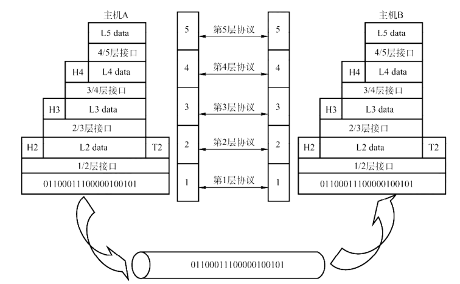
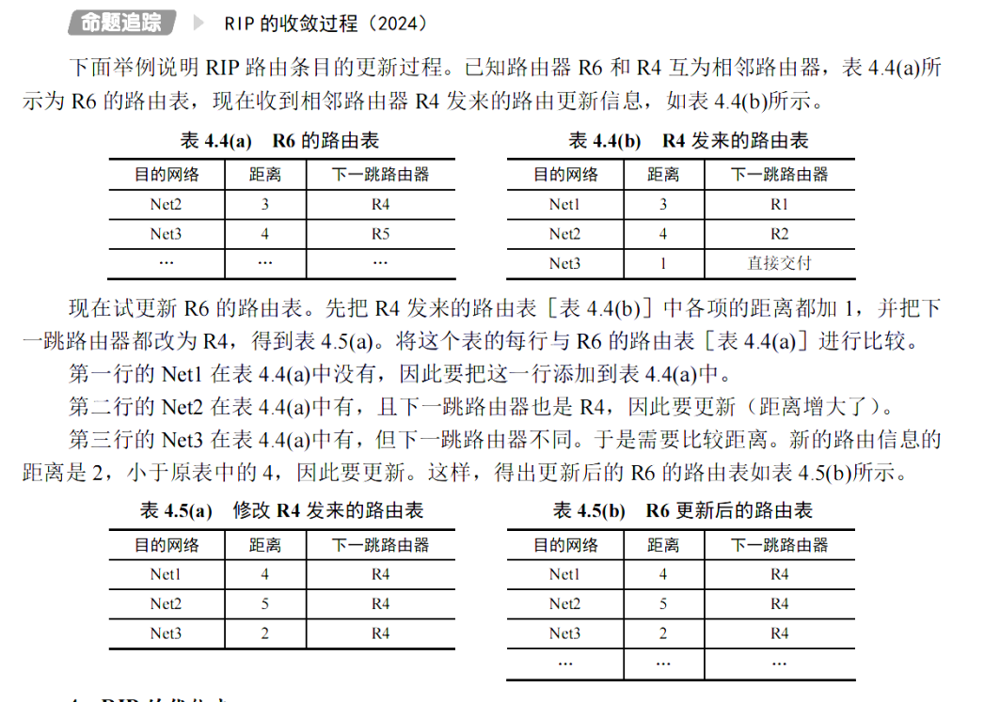
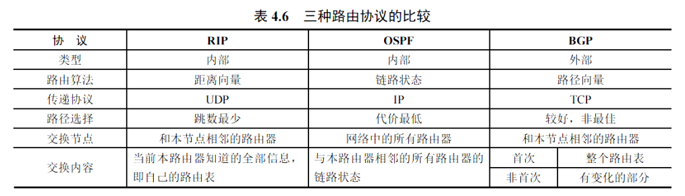
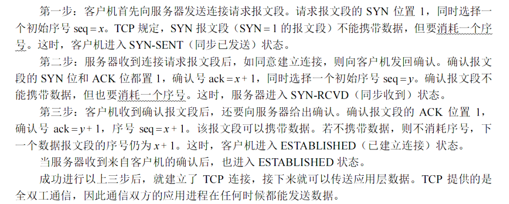

# 计算机网络 王道2026学习笔记

# 第一章 计算机网络体系结构

## 1.1 计算机网络概述

### 计算机网络的概念

计算机网络是一个将分散的、独立的计算机系统，通过通信设备和线路连接起来，由功能完善的软件实现资源共享和信息传递的系统。

由若干节点（计算机，集线器，交换机或路由器等）和连接这些节点的链路组成。

网络之间通过 路由器 互联

### 计算机网络的组成
分角度
- **组成部分**：硬件(主机、路由器、交换机、集线器、调制解调器等)、软件(网络协议、网络操作系统、网络应用软件等),协议
- **工作方式**：边缘部分（用户直接使用）和核心部分（数据交换）
- **功能组成**：通信子网（实现数据传输）和资源子网（实现资源共享）

### 计算机网络的功能
- **数据通信**：数据传输、信号传输
- **资源共享**：硬件、软件、数据
- **分布式处理**：多台计算机协同完成一项任务
- **提高系统可靠性**：一台计算机故障，其他计算机可以顶替
- **负载均衡**：多台计算机共同承担工作任务

### 电路交换、报文交换、分组交换
**电路交换**
- 通信之前需要建立连接，连接建立后才能通信，通信结束后释放连接(建立连接->传输数据->释放连接)
- 优点：通信时延小，有序传输，没有冲突，实时性强
- 缺点：建立连接时间长，信道利用率低，灵活性差，难以实现差错控制
- 样例：传统的电话网

**报文交换**
- 将整个报文发送到下一个节点，再由下一个节点转发，直到到达目的节点(存储转发技术)
- 优点：无建立连接时延，灵活分配线路，线路利用率高，易于实现差错控制
- 缺点：转发时延大，缓存开销大，有序性难以保证，实时性差

**分组交换**
- 将报文划分为若干个分组，每个分组独立传输，到达目的节点后重新组装(存储转发技术)
- 分组：
  - 分组头：分组序号、分组长度、目的地址、源地址等
  - 分组数据：报文数据

- 优点：由报文交换的优点，此外还有 方便存储和管理，传输效率高，减少了出错的概率和重传的代价
- 缺点：存在存储转发的时延，需要传输额外的分组头信息，可能会出现失序、重复以及丢失分组的情况

### 计算机网络的分类
**按交换技术分类**
- 电路交换网
- 报文交换网
- 分组交换网

**按网络范围分类**
- 广域网(WAN)
- 城域网(MAN)
- 局域网(LAN)
- 个人区域网(PAN)

**按传播技术**
- 广播式网络：所有节点共享一个通信信道
- 点对点网络：每条物理线路连接两个节点

**按拓扑结构分类**
- 总线型网络
- 星型网络
- 环型网络
- 网状型网络

### 计算机网络的性能指标(了解)
**速率**
- 数据传输速率，即数据率，表示单位时间内传输的数据量，单位是比特/秒(bps)
- 带宽，即数据传输速率，单位是比特/秒(bps)
- 吞吐量，即单位时间内通过某个网络(信道或接口)的数据量，单位是比特/秒(bps)
- 时延，即数据从网络的一端传送到另一端所需的时间，单位是秒(s)
  - 发送时延：主机或路由器发送数据帧所需要的时间
  - 传播时延：电磁波在信道中传播一定距离所需要的时间
  - 处理时延：主机或路由器对收到的数据帧进行处理所需要的时间
  - 排队时延：数据帧在路由器输入队列和输出队列中排队等待处理所需要的时间
  - 总时延：发送时延 + 传播时延 + 处理时延 + 排队时延

- 时延带宽积：时延带宽积 = 传播时延 * 带宽，表示信道中可以容纳的数据量，单位是比特
- 往返时延RTT：从发送端发送数据开始，到发送端收到接收端的确认，所需要的时间，单位是秒(s)
- 利用率：网络中处于活跃状态的链路或节点所占用的比例，单位是百分比

## 1.2 计算机网络体系结构与参考模型

### 计算机网络分层结构
**分层的原则：**
- 每一层都实现一种相对独立的功能，降低大系统的复杂性
- 每层之间的接口自然清晰，易于理解，相互交流尽可能的少
- 各层功能的精确定义独立于具体的实现方法，可以采用最合适的技术来实现
- 保持下层对上层的独立性，上层单向依赖下层，下层单向服务上层
- 整个分层结构应能促进标准化工作

一些概念：
- 对等层：同一网络(不同机器上)中相同层次上的实体
- 对等实体：同一网络(不同机器上)中相同层次上的实体
- 协议数据单元(PDU)：对等层之间交换的信息单元
- 服务数据单元(SDU)：同一层内部传递的数据单元
- 协议控制信息(PCI)：控制协议操作的信息
- n-SDU + n-PCI = n-PDU = (n-1)-SDU !!!!

### 计算机网络协议，接口，服务的概念
**协议：**

为了在网络中进行数据交换而建立的规则、标准或约定成为**网络协议**

网络协议时控制对等实体之间进行通信的规则，是水平的。

协议由三部分组成：
- 语法：定义了数据与控制信息的格式
- 语义：需要发出何种控制信息，以及完成的动作以及如何响应对方的动作
- 同步：执行各个操作的条件以及时序关系

**接口：**

同一节点内相邻两层之间交换信息的逻辑接口，服务访问点(SAP). 每层只能在紧邻的层之间定义接口，不可以跨层定义

**服务：**

下层为紧邻的上层所提供的一组操作，是垂直的

计算机网络提供的服务可分为以下三种类型：
1. 面向连接和无连接的服务
  - 面向连接的服务：在数据传输之前需要先建立连接，数据传输结束后需要释放连接
  - 无连接的服务：在数据传输之前不需要建立连接，数据传输结束后不需要释放连接
2. 可靠服务和不可靠服务
  - 可靠服务：保证数据传输的可靠性，包括数据传输的顺序、数据传输的完整性等
  - 不可靠服务：不保证数据传输的可靠性，只负责将数据传输到目的节点，不保证数据传输的顺序、数据传输的完整性等
3. 有应答服务和无应答服务 
  - 有应答服务：在数据传输过程中需要接收方的应答，以确保数据传输的可靠性
  - 无应答服务：在数据传输过程中不需要接收方的应答，只负责将数据传输到目的节点，不保证数据传输的可靠性

### 计算机网络体系结构参考模型
**OSI参考模型**
- OSI参考模型是一个理论模型，用于描述计算机网络的结构和功能
- OSI参考模型将计算机网络分为七个层次，从低到高分别为：物理层、数据链路层、网络层、传输层、会话层、表示层和应用层
- 每一层都有特定的功能和协议，用于实现网络通信的不同方面
- OSI参考模型是一种理论模型，实际的网络协议和实现可能不完全符合该模型，但可以作为理解和设计网络协议的参考

先有一个概念，后面重要的层会详细讲解

**1.物理层**
- 物理层是OSI参考模型的最底层，负责实现物理连接，即实现数据传输的物理介质和传输速率
- 物理层的主要功能包括：定义物理连接的电气特性、机械特性、功能特性和规程特性等
- 物理层的主要设备包括：网卡、调制解调器、中继器、集线器等
- 传输的数据单位是比特(bit)

**2.数据链路层**
- 数据链路层是OSI参考模型的第二层，负责在物理连接上进行**可靠的数据传输**
- 数据链路层的主要功能包括：帧的封装与拆封、帧的校验与确认(差错控制)、流量控制等
- 数据链路层的主要设备包括：交换机、路由器等
- 传输的数据单位是帧(frame)

**3.网络层**
- 网络层是OSI参考模型的第三层，负责实现数据在网络中的传输
- 网络层的主要功能包括：路由选择、拥塞控制、网络互联等
- 网络层的主要设备包括：路由器、交换机等
- 传输的数据单位是数据报(packet)

**4.传输层**
- 传输层是OSI参考模型的第四层，负责实现端到端(端口到端口)的可靠数据传输
- 传输层的主要功能包括：可靠传输、流量控制、拥塞控制等
- 传输层的主要设备包括：防火墙、代理服务器等
- 传输的数据单位是报文段(segment)

**5.会话层**
- 会话层是OSI参考模型的第五层，负责在两个进程之间建立、管理和终止会话
- 会话层的主要功能包括：会话的建立、管理和终止、同步等
- 会话层的主要设备包括：会话服务器等
- 传输的数据单位是会话数据单元(session data unit)

**6.表示层**
- 表示层是OSI参考模型的第六层，负责数据的表示、加密、压缩等
- 表示层的主要功能包括：数据格式的转换、数据加密、数据压缩等
- 表示层的主要设备包括：加密设备、解密设备等
- 传输的数据单位是表示数据单元(representation data unit)

**7.应用层**
- 应用层是OSI参考模型的第七层，负责提供网络应用服务
- 应用层的主要功能包括：文件传输、电子邮件、远程登录、Web浏览等
- 应用层的主要设备包括：服务器、客户端等
- 传输的数据单位是应用数据单元(application data unit)

**TCP/IP参考模型**
- TCP/IP参考模型是一个实际使用的网络协议栈，用于实现网络通信
- TCP/IP参考模型将计算机网络分为四个层次，从低到高分别为：网络接口层、互联网层(网络层，网际层)、传输层和应用层
- 每一层都有特定的功能和协议，用于实现网络通信的不同方面
- TCP/IP参考模型是一种实际使用的网络协议栈，实际的网络协议和实现可能不完全符合该模型，但可以作为理解和设计网络协议的参考

**TCP/IP参考模型与OSI参考模型的区别**
- OSI参考模型是一个理论模型，用于描述计算机网络的结构和功能，而TCP/IP参考模型是一个实际使用的网络协议栈，用于实现网络通信
- OSI参考模型将计算机网络分为七个层次，而TCP/IP参考模型将计算机网络分为四个层次
- OSI参考模型中的数据链路层和物理层在TCP/IP参考模型中合并为网络接口层
- OSI参考模型中的会话层、表示层和应用层在TCP/IP参考模型中合并为应用层

**应用层DNS报文逐层封装的关系**
就是之前说的SDU PCI 与 PDU的关系

# 第二章 物理层
## 2.1 通信基础

### 基本概念
1.数据，信号和码元
- 数据：数据是信息的载体，是各种文字、图像、声音、视频等信息的集合
- 信号：信号是数据在传输过程中的表现形式，包括模拟信号(连续的)和数字信号(离散的)
- 码元：码元是信号的基本单位，是数字信号的基本单位

2.信源，信宿，信道
- 信源：信源是信息的发送者，将信息转换为信号发送出去
- 信宿：信宿是信息的接收者，将信号转换为信息接收进来
- 信道：信道是信号传输的通道，包括有线信道和无线信道

三种基本通信方式：
- 单工通信：单工通信是指信号只能单向传输，即只有发送方和接收方，没有双向通信
- 半双工通信：半双工通信是指信号可以双向传输，但同一时刻只能有一方发送信号，另一方接收信号
- 全双工通信：全双工通信是指信号可以双向传输，即发送方和接收方可以同时发送和接收信号

3.速率，波特与带宽
- 速率：速率是指单位时间内传输的数据量，单位是比特/秒(bps)
- 波特：波特是指单位时间内传输的信号数，单位是波特(bps)
- 带宽：带宽是指信号传输的频率范围，单位是赫兹(Hz)

### 信道的极限容量：
- 奈奎斯特定理(无噪)：奈奎斯特定理是描述信道极限容量的定理，它指出，在理想条件下，信道的极限容量为2Wlog2V bps，其中W为信道的带宽，V为信道内可分辨的最小信号电压幅值
- 香农定理(考虑到噪声)：香农定理是描述信道极限容量的定理，它指出，在噪声存在的条件下，信道的极限容量为Wlog2(1+S/N) bps，其中W为信道的带宽，S为信号功率，N为噪声功率

### 编码与调制
- 编码：编码是将数据转换为信号的过程，包括数字编码和模拟编码
- 调制：调制是将信号转换为适合传输的过程，包括模拟调制和数字调制

1.数字数据编码为数字信号
- 归零编码：归零编码是一种数字编码方式，将数字信号转换为归零信号，即信号在0电平上归零
- 不归零编码：不归零编码是一种数字编码方式，将数字信号转换为不归零信号，即信号在0电平上不归零
- 反向不归零编码：反向不归零编码是一种数字编码方式，将数字信号转换为反向不归零信号，即信号在0电平上不归零，但在1电平上归零
- 曼彻斯特编码：曼彻斯特编码是一种数字编码方式，将数字信号转换为曼彻斯特信号，即信号在0电平上从高电平跳变到低电平，在1电平上从低电平跳变到高电平
- 差分曼彻斯特编码：看每个码元的开始是否有跳变，有跳变就是0，没有跳变就是1(中间的跳变无意义，只代表时钟)
  

2.模拟数据编码为数字信号
采样，量化，编码

3.数字信号调制为模拟信号
- 调幅：调幅是将数字信号转换为模拟信号的过程，通过改变信号的幅度来表示数字信号
- 调频：调频是将数字信号转换为模拟信号的过程，通过改变信号的频率来表示数字信号
- 调相：调相是将数字信号转换为模拟信号的过程，通过改变信号的相位来表示数字信号
- 正交调幅：正交调幅是将数字信号转换为模拟信号的过程，通过改变信号的幅度和相位来表示数字信号

## 2.2 传输介质(看书)
(双绞线，同轴电缆，光纤，无线等)

# 第三章 数据链路层
## 3.1 数据链路层的功能
封装成帧，差错控制，流量控制，透明传输等

## 3.2 组帧
### 字符计数法
- 字符计数法是一种简单的组帧方法，它通过在帧的头部添加一个计数字段来表示帧的长度

若某一段计数字段出错了(或者丢失了) ，那么接收方无法判断帧的长度

### 字节填充法
- 字节填充法是一种常用的组帧方法，它通过在帧的头部和尾部添加特殊的控制字符来表示帧的开始和结束(比如：在头部添加SOH表示开始，在尾部添加 EOT表示结束)，为了防止这些控制字符与数据中的字符冲突，所以使用转义字符ESC来表示

### 零比特填充法
- 使用一个特殊的字符序列01111110来表示帧的开始和结束，如果数据中出现了这个字符序列，检测到5个连续的1，就插入一个0，这样就可以避免数据中的字符与帧的开始和结束字符冲突

### 违规编码法
- 举个例子，曼彻斯特编码，1 为 ‘高-低’ 0 为 ‘低-高’ 那么，‘高-高’ 或者 ‘低-低’就是违规编码，可以用这些表示帧的开始和结束

## 3.3 差错控制
比特差错：比特差错是指数据传输过程中，由于信道干扰等原因，导致数据中的**比特位**发生错误(除了比特差错之外，还有帧丢失，帧重复，帧失序等差错，这一节只讨论比特差错)

两种：
- 自动重传请求ARQ：简单来说就是遇到差错让对方重新传
- 前向纠错FEC：简单来说就是自己纠正错误(检错和纠错)

### 奇偶校验码(检错码)
奇偶校验码是一种简单的检错码，它通过在数据中添加一个校验位来表示数据的奇偶性
- 奇校验码：奇校验码是指在数据中添加一个校验位，使得数据中的1的个数加上校验位的1的个数是奇数(比如：数据为1010，校验位为1，则数据为10101，1的个数为3 为奇数)
- 偶校验码：偶校验码是指在数据中添加一个校验位，使得数据中的1的个数加上校验位的1的个数是偶数(比如：数据为1010，校验位为0，则数据为10100，1的个数为2，校验位的1的个数为0，总共为2，为偶数)
- 注意：这里不仅要考虑数据中的1的个数，还要考虑校验位的1的个数
- 再举个例子：1001101，奇校验码，校验位为1(10011011)，偶校验码，校验位为0(10011010)

### 循环冗余校验码CRC(检错码)
基本思想:
- 收发双方约定一个生成多项式G(x)，最低位为1，比如x^3+x^2+1 为 1101
- 发送方基于待发送的数据计算出冗余码，然后将冗余码添加到数据的末尾，形成发送帧
- 接收方收到数据和冗余码之后，基于生成多项式G(x)进行校验，如果校验结果为0，则说明数据没有错误，否则说明数据有错误
  
计算方法(看懂这个例子)：

### 海明码(纠错码)
这个太复杂了，可以看书了解以下，感觉一般面试的话不会问这个细节，但是要知道这个海明码可以检错和纠错

## 3.4 流量控制和可靠传输
流量控制：流量控制是指发送方和接收方之间的协调，以防止发送方发送的数据过多，导致接收方无法处理

可靠传输：可靠传输是指发送方和接收方之间的数据传输是可靠的，即发送的数据能够正确地到达接收方，并且接收方能够正确地接收数据

### 流量控制与滑动窗口

1.停止-等待流量控制的思想
- 发送方每次只允许发送一帧，接收方收到数据后，发送一个确认帧，发送方收到确认帧后，才能发送下一帧
  
2.滑动窗口流量控制的思想
- 发送方维护一组连续的，允许发送的帧的序号，称为发送窗口，这个意思是，还未收到对方的确认信息的情况下，发送方最多还能发送多少帧，和相应的帧的序号
- 接收方维护一组连续的，允许接收的帧的序号，称为接收窗口，控制可以接收那些帧和不可以接受那些帧

### 可靠传输
- 停止-等待协议 S-W：停止-等待ARQ是一种简单的可靠传输协议，它通过停止-等待机制来实现可靠传输，即发送方每次只允许发送一帧，接收方收到数据后，发送一个确认帧，发送方收到确认帧后，才能发送下一帧(相当于发送窗口大小为1，接收窗口大小为1)

- 后退N帧协议 GBN：发送窗口内的多个数据可以同时发送，后退N协议的思想是，如果接收方收到一个错误的帧，那么接收方会发送一个NAK帧，发送方收到NAK帧后，会重传从该帧开始的所有帧(相当于发送窗口大小大于1，接收窗口大小为1)
  - 这里有个捎带确认的概念：ACKn表示对第n帧已经确认收到了，并且其前面的帧也没问题。
  

- 选择重传协议 SR: 发送窗口一次可以传输多个数据，接收窗口可以接收多个数据，如果接收方收到一个错误的帧，那么接收方会发送一个NAK帧，发送方收到NAK帧后，会重传该帧(相当于发送窗口大小大于1，接收窗口大小大于1)
  - 这里不会再有累计确认的概念了，每一个帧都要发送一个确认帧来保证其已经收到，如果没有收到，就重传该帧

## 3.5 介质访问控制
介质访问控制是指控制多个设备如何共享同一个通信介质的技术(避免冲突)

### 信道划分介质访问控制
这里是直接控制信道，将信道划分为多个子信道，每个设备使用不同的子信道进行通信
- 频分复用FDM：频分复用是指将通信介质划分为多个频段，每个设备使用不同的频段进行通信
- 时分复用TDM：时分复用是指将通信介质划分为多个时间片，每个设备使用不同的时间片进行通信
- 波分复用WDM：波分复用是指将通信介质划分为多个波长，每个设备使用不同的波长进行通信
- 码分复用CDM：码分复用是指将通信介质划分为多个码片，每个设备使用不同的码片进行通信(这个理解以下，就相当于比如三个机器共享，那个我们就建立一个三维的坐标系 x轴y轴z轴，当发送一个数据的时候，我们就可以将之类比为发送一个向量，该向量可以拆分为x,y,z三个分量，每个分量对应一个码片，这样就可以实现多个设备同时发送数据，并且不会发生冲突)

### 随机访问介质访问控制
这里是直接控制设备，不对信道进行划分，而是让设备随机访问信道，通过一定的协议来控制冲突

1.ALOHA协议
- 纯ALOHA协议：其他的都不管，就直接发送，没收到(超时未确认)就是遇到冲突了，重发就行。
- 时隙ALOHA协议：将时间划分为固定的时间片，每个设备只能在时间片开始时发送数据, 并且时隙要大于最大传播时延，这样的话保证了在一个数据发送的过程中，没其他的数据要发送，从而避免了冲突。

2.CSMA(载波监听多路访问)
- 1-坚持CSMA：如果一个设备检测到信道空闲，那么它就会发送数据，如果检测到信道忙，他就会继续监听，直到空闲再发送数据
- 非坚持CSMA：如果一个设备检测到信道空闲，那么它就会发送数据，如果检测到信道忙，就会放弃监听，等待一段时间之后再继续监听，如果等待时间过长，那么它就会放弃发送数据
- p-坚持CSMA：如果一个设备检测到信道空闲，那么它就会以p的概率发送数据，以(1-p)的概率等待一段时间后再次检测信道

3.CSMA/CD(载波监听多路访问/冲突检测)
- CSMA/CD协议是CSMA协议和检测冲突的协议的结合，它通过检测冲突来避免冲突的发生，如果检测到冲突，那么就会停止发送数据，等待一段时间后再次发送数据
- CSMA/CD的原理是，当一个设备发送数据时，它会监听信道，如果检测到信道空闲，那么它就会发送数据，如果检测到信道忙，那么它会继续监听，直到空闲再发送数据，发送数据的过程种也在不停的监听信道吗，如果检测到冲突，那么它会停止发送数据，等待一段时间后再次发送数据
- 先听后发，边听边发，冲突停发，随机重发

4.CSMA/CA(载波监听多路访问/冲突避免)
- 用于无线局域网(CSMA/CD用于有线局域网)

### 轮询访问：令牌传递协议
- 令牌传递协议是一种轮询访问介质访问控制协议，它通过一个令牌来控制设备访问介质，令牌在设备之间传递，只有持有令牌的设备才能发送数据，其他设备只能等待令牌的到来

流程：
- 当网络空闲的时候，环路之中只有令牌帧在循环传递
- 当令牌帧到达了某个要传输设备的站点的时候，该站点回修改令牌帧之中的一个标志位，并在令牌之中附加上自己需要传输的数据，将令牌变成一个数据帧发出去。
- 数据帧沿着环路持续传输，接受到数据帧的站点，一边转发一边查看帧的目的地址，如果和自己的相同则复制帧，以便进一步处理
- 数据帧沿着环路继续传输，直到源站点，原站点会进行校验，查看传输的过程中有没有出现什么问题，如果有问题，则重传
- 原站点传送完数据之后产生一个新的令牌，将令牌沿着环路继续传递，交出信到的控制权

## 3.6 局域网(看书)

关键的知识点：

1.IEEE 802 局域网标准 将 数据链路层分为两个子层：LLC(逻辑链路控制)和MAC(媒体访问控制)

2.以太网的MAC地址
- 48位，6个字节，高24位为厂商代码，低24位为厂商自定义的代码
- 适配器从网络之中收到一个MAC帧，则会查看帧中的目的MAC地址，如果目的MAC地址与自己的MAC地址相同，那么就会接收该帧，否则就会丢弃该帧
- 发往本站的帧：
  - 单播帧(一对一):收到的帧的目的地址与本站的MAC地址相同
  - 广播帧(一对全体):发送给本局域网上的所有的站点的帧(全1地址)
  - 多播帧(一对多):发送给本局域网之中部分站点的帧

 

- MAC帧格式
  - 前导码：8个字节，前7个字节为前同步码，用于同步时钟，后一个字节为帧开始定界符，用于标识帧的开始
  - 目的地址：6个字节，表示帧的接收方
  - 源地址：6个字节，表示帧的发送方
  - 类型：2个字节，表示帧的数据类型(交给上层的那个协议处理)
  - 数据：46-1500个字节，表示帧的数据
  - FCS：4个字节，表示帧的校验码
    - 32位CRC码，目的地址，源地址，类型。不检验前导码和数据

## 3.7 广域网(看书，这个确实没仔细看)

关键的知识点：

PPP协议：点对点协议，用于在点对点链路上传输数据，它是一种面向字节的协议，它支持多种网络层协议，如IP，IPX等

- PPP协议的帧格式
  - 标志字段：1个字节，用于标识帧的开始和结束，值为01111110
  - 地址字段：1个字节，值为0xFF
  - 控制字段：1个字节，值为0x03
  - 协议字段：2个字节，表示帧的数据类型
  - 帧数据：可变长度，表示帧的数据
  - FCS字段：2个字节，表示帧的校验码

# 第四章 网络层
## 4.1 网络层的功能
### 异构网络的互连

### 路由与转发
路由器提供两个功能
- 路由选择：根据路由协议构造路由表
- 分组转发：根据路由表将分组从合适的端口转发出去

### 网络层提供的两种服务

1.虚电路

虚电路建立->数据传输->虚电路释放

特点
- 虚电路通信链路建立和拆除需要时间，对长时间、频繁的数据交换效率比较高
- 虚电路的路由选择体现在虚电路建立的过程
- 虚电路提供可靠的通信，能保证每个分组正常且有序的到达(还方便流量控制)
- 虚电路有个致命缺点，就是当虚电路之中的一个节点出现故障，那么整个虚电路都会失效
- 虚电路传输的分组不需要有目的地址，只需要包含虚电路号便可以(虚电路建立的时候需要)

虚电路之所有叫**虚**电路，是因为这条电路不是专用的，不像带你路交换那样，独占线路上的所有节点，其他虚电路也能使用这条虚电路上的节点

2.数据报

不需要建立连接，每个分组独立选择路由，不同分组可以走不同的路径

特点
- 发送分组之前不需要建立连接，发送方随时发送，接收方随时接收
- 网络尽最大可能交付，不保证可靠性
- 网络为不同的分组独立的选择路径，不同的的分组可能经过不同的路径
- 数据报分组必须包含接收方和发送发完整的地址
- 分组在节点进行存储转发的时候，需要排队等待处理，如果网络拥塞，那么可能会出现分组丢失的情况
- 收发双方不会独占某条链路，网络资源利用率高

### SDN的基本概念
SDN（Software Defined Networking，软件定义网络）是一种新型的网络架构，它将网络的控制平面和数据平面分离，通过软件定义的方式来实现网络的控制和管理。

- 控制平面：控制平面是网络的控制部分，负责路由选择、流量控制、安全策略等网络管理功能。控制平面由控制器组成，控制器通过南向接口与网络设备通信，通过北向接口与上层应用通信。
- 数据平面：数据平面是网络的数据传输部分，负责数据的转发和传输。数据平面由网络设备组成，如交换机和路由器等。

简单理解，就是设置一个服务器负责构建，存储，更新转发表；实现路由选择等功能。这样的话路由器只需要负责 查表，转发数据便可以了。

### 拥塞控制
注意和流量控制的区别：
- 流量控制：是点对点的通信控制，是接收方控制发送方发送数据的速率，使得发送方的发送速率不要超过接收方的接收速率
- 拥塞控制：是全局性的通信控制，是网络层面的，防止过多的数据注入到网络中，避免网络中的路由器或者链路过载

## 4.2 IPv4

### IPv4数据报格式

- 版本：4位，表示IP协议的版本，IPv4的值为4
- 首部长度：4位，表示IP数据报的首部长度，单位为4字节，最小值为5，最大值为15，最大值为15*4=60字节
- 服务类型：8位，表示IP数据报的服务类型，用于指示数据报的优先级和可靠性要求
- 总长度：16位，表示IP数据报的总长度，单位为字节，最大值为65535字节
- 标识：16位，用于标识数据报，用于分片和重组
- 标志：3位，MF(更多分片) DF(分不分片)
- 片偏移：13位，用于标识分片的位置
- TTL(生存时间)：8位，表示IP数据报的生存时间，每经过一个路由器，TTL减1，当TTL为0时，数据报被丢弃
- 协议：8位，表示IP数据报的协议类型，如TCP，UDP等
- 首部校验和：16位，用于校验IP数据报的首部，注意不包含数据部分
- 源地址：32位，表示IP数据报的源地址
- 目的地址：32位，表示IP数据报的目的地址
  
### IP数据报分片
- IP数据报在传输过程中可能会经过不同的网络，不同的网络可能对数据报的长度有不同的要求，因此需要进行分片
- 分片是在数据链路层进行的，数据链路层对数据报的长度有限制，如果数据报的长度超过了数据链路层的限制，那么就需要进行分片
- 分片是在IP数据报的首部进行标识的，每个分片都有一个标识，用于标识分片所属的数据报
- 分片在到达目的地之后需要进行重组，重组是根据标识进行重组的

### IPv4地址与NAT

- IPv4地址由32位组成，通常用点分十进制表示，如192.168.1.1
- IPv4地址分为网络地址和主机地址，网络地址表示网络，主机地址表示主机，网络地址和主机地址之间用点分十进制表示，如192.168.1.1/24，表示网络地址为192.168.1.0，主机地址为1
- IP地址 = {<网络号>，<主机号>}

特殊地址
- 主机号全为0：表示网络地址，如192.168.1.0/24
- 主机号全为1：表示广播地址，如192.168.1.255/24
- 127.0.0.1：回环地址，用于本地回环测试
- 0.0.0.0：表示本网络上的任何主机
- 255.255.255.255：广播地址，表示本网络上的所有主机

NAT(Network Address Translation，网络地址转换)是一种将私有IP地址转换为公有IP地址的技术，用于解决IPv4地址不足的问题。

私有地址IP：
- A类：10.0.0.0~10.255.255.255
- B类：172.16.0.0~172.31.255.255
- C类：192.168.0.0~192.168.255.255

- NAT工作原理
  - 当一个私有网络中的主机需要访问外部网络时，NAT会将主机的私有IP地址转换为公有IP地址，并将数据报发送到外部网络
  - 当外部网络返回数据报时，NAT会将数据报的公有IP地址转换为私有IP地址，并将数据报发送到私有网络中的主机

- NAT的优点
  - 可以解决IPv4地址不足的问题
  - 可以隐藏内部网络的拓扑结构

### 子网划分
- IP地址 = {<网络号>,<子网号>,<主机号>}
- 划分主机只是把主机号部分再划分成子网号和主机号两部分，不会改变原始的网络号
- 子网之中主机号为全0和全1的不会被指派给主机使用，全0表示子网地址，全1表示广播地址

### 子网掩码
- 子网掩码是一个32位的二进制数，用于标识IP地址中的网络号和主机号
- 子网掩码中的网络号部分为1，主机号部分为0
- 子网掩码与IP地址进行按位与运算，可以得到网络地址

### CIDR(无类别域间路由)
不需要考虑A,B,C等类别的网络，直接使用斜线记法，表示IP地址和子网掩码，如192.168.1.1/24
- CIDR使用斜线记法，表示IP地址和子网掩码，如192.168.1.1/24
- CIDR可以表示任意大小的子网，而不仅仅是2的幂次方
- CIDR可以减少路由表的大小，因为CIDR可以表示多个子网，只需要一个路由表项就可以表示多个子网

有几个概念：
- 路由聚合：将多个连续的子网合并为一个更大的子网，减少路由表的大小，看书中的例子(206.1.0.0/17与206.1.128.0/17合并为206.1.0.0/16)
- 最长前缀匹配：当路由器收到一个数据报时，会根据数据报的目的IP地址，在路由表中查找最长的匹配项，然后根据匹配项进行转发(前缀越长越具体)

### 地址解析协议
ARP(Address Resolution Protocol，地址解析协议)用于将IP地址转换为MAC地址，用于局域网中的通信。

ARP工作原理：
- 当一个主机需要发送数据报给另一个主机时，首先会查询ARP缓存，如果缓存中有对应的MAC地址，那么就直接使用，如果没有，那么就发送ARP请求，请求目的主机的MAC地址
- 目的主机收到ARP请求后，会发送ARP响应，将自己的MAC地址发送给请求的主机
- 请求的主机收到ARP响应后，会将目的主机的IP地址和MAC地址添加到ARP缓存中，以便下次使用

### DHCP(Dynamic Host Configuration Protocol，动态主机配置协议)
DHCP用于为局域网中的主机动态分配IP地址，DHCP服务器会为客户端分配一个IP地址，并在一段时间后回收该IP地址。

DHCP工作原理：
- 当一个主机需要获取IP地址时，会发送DHCP Discover报文，广播给局域网中的所有主机和DHCP服务器(源地址为0.0.0.0，目的地址为255.255.255.255)
- DHCP服务器收到DHCP Discover报文后，会发送DHCP Offer报文，将自己的IP地址和提供给主机的IP地址提供出去。(源地址为DHCP服务器的IP地址，目的地址为255.255.255.255)
- 主机收到DHCP Offer报文后，若同意这个IP，就会发送DHCP Request报文，请求DHCP服务器分配IP地址。(源地址为0.0.0.0，目的地址为255.255.255.255)
- DHCP服务器收到DHCP Request报文后，会发送DHCP Ack报文，确认分配IP地址。(源地址为DHCP服务器的IP地址，目的地址为255.255.255.255)

注意DHCP分配的IP地址是临时的，时间由DHCP服务器决定，时间到了之后，DHCP服务器会回收该IP地址。

### ICMP(Internet Control Message Protocol，互联网控制消息协议)
ICMP用于在主机和路由器之间传递控制消息，用于诊断网络问题。

ICMP报文5种类型
- 终点不可达：当路由器或主机无法将数据报发送到目的地时，会发送终点不可达报文
- 源点抑制：当路由器或主机收到数据报时，如果网络拥塞，会发送源点抑制报文，要求发送方降低发送速率
- 时间超过：当路由器或主机收到数据报时，如果TTL为0，会发送时间超过报文
- 参数问题：当路由器或主机收到数据报时，如果IP数据报的首部有问题，会发送参数问题报文
- 重定向：当路由器或主机收到数据报时，如果发现更优的路径，会发送重定向报文，告诉发送方使用新的路径

## 4.3 IPv6(了解一下)
### IPv6引入
IPv4地址空间已经耗尽
- 采用无类别编址CIDR，使得IP地址分配更加合理
- 采用NAT技术，使得IPv4地址可以重复使用
- 引入更大的地址空间，IPv6地址由128位组成，可以提供2^128个地址

### IPv6数据报格式

- 版本：4位，表示IP协议的版本，IPv6的值为6
- 通信量类：8位，用来区分不同IPv6数据报的类别或优先级
- 流标签：20位，用来标识一条数据报流，用于QoS
- 有效载荷长度：16位，表示IPv6数据报的有效载荷长度，单位为字节
- 下一个首部：8位，表示IPv6数据报的下一个首部，用于标识IPv6数据报的协议类型
- 跳限制：8位，类似于IPv4的TTL，用于限制数据报的传输跳数
- 源地址：128位，表示IPv6数据报的源地址
- 目的地址：128位，表示IPv6数据报的目的地址

## 4.4 路由算法和路由协议

### 路由算法
**静态路由和动态路由**
- 静态路由：由网络管理员手动配置，不会自动更新，适用于小型网络或网络拓扑变化不大的情况
- 动态路由：由路由器自动计算和更新，适用于大型网络或网络拓扑变化较大的情况
  - 可以分为两类：距离-向量路由算法和链路状态路由算法

**距离-向量路由算法**
- 每个路由器维护一个路由表，记录到达每个目的地的最短路径
- 路由器会定期向**相邻**的路由器发送自己的路由表，相邻的路由器收到路由表后，会更新自己的路由表
- 路由器会根据路由表中的信息，选择到达目的地的最短路径

注意：只会与相邻的路由器交换路由表，不会与所有的路由器交换路由表，这样可以减少网络流量，提高网络效率

**链路状态路由算法**
- 每个路由器维护一个链路状态数据库，记录到达每个目的地的最短路径
- 路由器会定期向**所有**的路由器发送自己的链路状态信息，所有路由器收到链路状态信息后，会更新自己的链路状态数据库
- 路由器会根据链路状态数据库中的信息，选择到达目的地的最短路径

注意：会与所有的路由器交换链路状态信息，这样可以保证路由器拥有最新的网络拓扑信息，提高路由的准确性

### 分层次的路由选择协议
- 内部网关协议IGP：RIP、OSPF
- 外部网关协议EGP：BGP

### 路由信息协议RIP(Routing Information Protocol)
基本介绍：
- 每个路由器都要维护一个路由表，记录到达每个目的地的最短路径
- RIP使用跳数(它认为最好的路由就是通过路由器数量最少的路径)作为度量值，跳数越小，路径越短
- 最大跳数为15，超过15跳的路由被认为是不可达的
- 路由表项的三个关键词：目的网络、距离、下一跳
- RIP使用UDP协议，端口号为520

特点：
- 和谁交换信息：和相邻的路由器交换信息
- 交换什么信息：交换路由表的全部信息
- 多久交换一次：每隔30秒交换一次

算法过程可以看一下书中的例子，这个不难理解

RIP的优缺点：
- 优点：简单，易于实现
- 缺点：收敛速度慢，跳数限制为15，不适合大型网络
- (好消息传递速度快，坏消息传递慢)

### 开放最短路径优先OSPF(Open Shortest Path First)
基本介绍：
- OSPF使用链路状态路由算法，每个路由器维护一个链路状态数据库，记录到达每个目的地的最短路径
- OSPF允许对每条路径设计代价，可以不适用跳数作为度量值
  
特点：
- OSPF使用洪范法，和所有的路由器交换链路状态信息
- 发送的信息是与本路由器**相邻**的路由器的链路状态信息
- 只有当链路状态发生变化时，才洪范发送链路状态信息
- OSPF使用IP协议(网络层协议)，端口号为89

OSPF的分组类型：
- 问候分组： 用于发现和维护邻居关系
- 数据库描述分组：用于交换链路状态数据库中的信息
- 链路状态请求分组：用于请求邻居路由器的链路状态信息
- 链路状态更新分组：用于发送链路状态信息
- 链路状态确认分组：用于确认收到的链路状态信息

### 边界网关协议BGP(Border Gateway Protocol)
基本介绍：
- BGP是运行在AS之间的路由协议，用于在不同的AS(Autonomous System，自治系统)之间交换路由信息
- BGP使用TCP协议，端口号为179
- 寻找一条能够到达目的地的最佳路径，而不是寻找一条最短路径

BGP路由的选择：
- 选择本地偏好度最高的路由
- 选择AS路径最短的路由
- 使用热土豆算法
- 选择BGP标识符最小的路由

BGP的分组类型：
- 打开分组：用于建立TCP连接
- 更新分组：用于交换路由信息
- 保活分组：用于周期性的证实邻站的连通性
- 通知报文：用于报告错误

## 4.5 IP多播(了解，看书吧)
## 4.6 移动IP(了解，看书吧)
## 4.7 网络层设备(了解，看书吧)

# 第五章 传输层

## 5.1 传输层提供的服务

### 传输层功能
- 为应用进程之间提供端到端的通信
  - 网络层提供的IP地址完成了主机与主机之间的通信，而传输层提供的端口号则完成了应用进程之间的通信
- 复用和分用
- 差错检测
- 提供面向连接和无连接的服务
  - 面向连接的服务：TCP
  - 无连接的服务：UDP

### 传输层的寻址与端口
- 传输层使用端口号来标识不同的应用进程
- 端口号是一个16位的无符号整数，范围是0-65535
- 熟知端口号：0-1023，用于系统进程
- 注册端口号：1024-49151，用于用户进程
- 动态或私有端口号：49152-65535，用于用户进程

套接字：
- 套接字是传输层提供的一种抽象，用于表示一个通信端点
- 套接字由IP地址和端口号组成，用于标识一个通信端点
- 套接字(Socket) = (IP地址:端口号)

## 5.2 用户数据报协议UDP(User Datagram Protocol)
### UDP概述
特点：
- UDP是无连接的，发送数据之前不需要建立连接
- UDP首部开销小，只有8个字节（TCP有20个字节）
- UDP不保证数据报的顺序，不保证数据报的完整性
- UDP没有拥塞控制，因此网络之中的拥塞不会影响主机发送数据，这就需要某些实时的应用能够接受部分的数据丢失
- UDP适用于实时通信，如视频会议、语音通信等
- UDP支持一对一，一对多，多对一和多对多的通信方式（TCP不提供广播和多播的服务）

### UDP首部格式

- 源端口：源端口号，占16位
- 目的端口：目的端口号，占16位
- 长度：UDP数据报的长度，占16位
- 检验和：用于检验UDP数据报的完整性，占16位

### UDP校验和
这里要注意，UDP校验的时候会先在UDP数据报的头部加上12字节的伪首部，伪首部包含源IP地址、目的IP地址、协议号和UDP长度，用于计算校验和。

IP数据报只校验IP数据报的首部，而UDP校验的是整个UDP数据报，包括UDP首部和UDP数据。

具体的校验方法：看书吧

## 5.3 传输控制协议TCP(Transmission Control Protocol)
在不可靠的IP层之上实现的可靠的数据传输协议；可靠，有序，无丢失，无重复

特点：
- TCP是面向连接的，发送数据之前需要建立连接(TCP连接是一条逻辑连接)
- 每一条TCP连接只能有两个端点，每一条TCP连接只能是点对点的
- TCP提供可靠的数据传输服务，保证传送的数据，无差错，无丢失，无重复，并且按序到达
- TCP提供全双工通信，即通信的双方可以在任何时候发送数据(双方都会设有发送缓存和接收缓存)
- TCP是面向字节流的，发送数据时，将数据(来自应用层的数据块)拆分成字节流，接收数据时，将字节流重新组合成数据

### TCP数据报

- 源端口：源端口号，占16位
- 目的端口：目的端口号，占16位
- 序号：占32位，用于标识从TCP发送端向TCP接收端发送的数据字节流，表示在这个报文段中的第一个数据字节
- 确认号：占32位，用于标识期望接收到的下一个报文段的序号，表示期望接收到的下一个报文段的第一个数据字节的序号
- 数据偏移：占4位，用于标识TCP报文段的数据部分起始处距离TCP报文段的起始处有多远(其实就是首部长度)
- 保留：占6位，保留位，目前未使用
- 紧急URG：占1位，当URG=1时，表示紧急指针字段有效，表示该报文段中有紧急数据
- 确认ACK：占1位，当ACK=1时，表示确认号字段有效，表示该报文段是确认报文
- 推送PSH：占1位，当PSH=1时，表示接收方应该尽快将这个报文段交给应用层
- 复位RST：占1位，当RST=1时，表示TCP连接出现严重错误，必须释放连接，重新建立连接
- 同步SYN：占1位，当SYN=1时，表示这是一个连接请求报文段
- 终止FIN：占1位，当FIN=1时，表示此报文段的发送方已经没有数据要发送了，要求释放连接
- 窗口：占16位，用于表示发送方愿意接收的字节数
- 检验和：占16位，用于检验TCP报文段的完整性(校验要包含TCP首部和TCP数据)
- 紧急指针：占16位，当URG=1时，紧急指针字段有效，用于标识紧急数据在报文段中的位置
- 选项：占32位，用于提供一些可选的参数
- 填充：用于将TCP首部填充到4B的整数倍
- 数据：TCP报文段的数据部分

### TCP连接管理
TCP连接的时候要解决以下问题：
- 每一方都能够确认对方的存在
- 双方能够协商一些参数(如窗口大小等)
- 能够对一些运输实体资源进行分配

**TCP连接的建立：三次握手** 

这里很重要，要仔细看

**TCP连接的释放：四次挥手**

这里很重要，要仔细看

TCP建立和释放连接的总结：

1.建立连接 3 步
  - SYN=1，seq=x
  - SYN=1，ACK=1，seq=y，ack=x+1
  - ACK=1，seq=x+1，ack=y+1

2.释放连接 4 步
  - FIN=1，seq=u
  - ACK=1，seq=v，ack=u+1
  - FIN=1，ACK=1，seq=w，ack=v+1
  - ACK=1，seq=u+1，ack=w+1

### TCP的可靠传输
1.序号
- TCP给发送的每个字节都编上一个序号用于标识本次传输的第一个字节

2.ACK确认
- 表示期待接收到的下一个字节的序号
- TCP使用累积确认的方式，即确认序号之前的所有字节都已经收到

3.重传
- 超时重传：TCP会为每个发送的字节都设置一个超时计时器，如果在超时时间内没有收到ACK，则重传该字节
- 冗余ACK: 不好解释，举个例子，比如发送方发送1 2 3 4 5，但是2丢失了，那么接收方对 3 4 5三个字节都会发送ACK，表示期待接收到的下一个字节的序号是2，这样就会造成冗余ACK。当接收方收到3个冗余ACK时，就会直接重传丢失的字节，不会等到超时再重传，这个技术也被称为快速重传。

### TCP流量控制
这个就比较简单了，发送方与接收方相互商量窗口大小便可以，下面是书中的一个例子，看一下就明白

### TCP拥塞控制
拥塞控制就是防止网络中的数据过多，导致网络拥塞，影响网络性能

发送方除了维护一个发送窗口之外，还需要维护一个拥塞窗口cwnd，拥塞窗口的大小取决于网络的拥塞程度，并且动态变化。

拥塞控制的方法：
- 慢开始：一开始发送方以一个MSS的速率发送数据，然后每经过一个RTT，发送速率就翻倍，直到达到阈值cwnd，然后进入拥塞避免阶段
- 拥塞避免：拥塞避免阶段，发送方以一个MSS的速率发送数据，每经过一个RTT，发送速率就增加一个MSS，直到达到阈值cwnd，然后进入拥塞避免阶段
- 快重传：快重传是指接收方在收到一个冗余ACK时，会立即发送一个ACK，表示期待接收到的下一个字节的序号，这样发送方就可以立即重传丢失的字节，而不需要等到超时再重传
- 快恢复：快恢复是指当发送方收到一个冗余ACK时，会将拥塞窗口的大小设置为阈值cwnd的一半，然后进入拥塞避免阶段

这个挺简单的，下面是数中的两个例子

# 第六章 应用层

## 6.1 网络应用模型(看一看，了解)
### 客户/服务器模型(C/S模型)
- 客户端(Client)：发起请求的一方
- 服务器(Server)：响应请求的一方

工作流程：
- 服务器处于接受请求的状态，等待客户端的请求
- 客户端发起请求，服务器响应请求
- 服务器处理完请求后，将结果返回给客户端

特点：
- 网络中计算机的地位不平，服务器可以限制用户权限
- 客户机相互之间不可以通信
- 可扩展性不佳

### P2P模型
- 整个网络之中不再有固定的服务器，每个节点都可以既是客户端又是服务器
- 每个节点都具有下载、上传的功能，其权力和义务都大体相等
- 各个节点之间可以相互通信

## 6.2 域名系统DNS(Domain Name System)！！！
采用客户/服务器模式

### 域名
- 域名是由多个标号组成的，每个标号之间用点号分隔
- 标号只能由字母、数字和连字符组成，且不能以连字符开头或结尾
- 标号中的字母不区分大小写
- 域名最长为255个字符，每个标号不超过63个
- 域名由顶级域名(TLD)、二级域名、三级域名等组成
- 级别最低的在最左边

### 域名空间

### 域名服务器
- 根域名服务器：负责管理最高层次的域名，所有的根服务器都知道所有的顶级域名服务器的域名和IP地址
- 顶级域名服务器：负责管理该顶级域名所注册的所有二级域名服务器
- 权限域名服务器：负责管理该权限域名下的所有主机
- 本地域名服务器：负责管理该本地网络中的所有主机

### 域名解析过程
递归查询和迭代查询

主机向本地服务器发送的查询请求都采用递归查询
- 主机向本地服务器发送查询请求
- 本地域名服务器若知道相应的IP地址，则直接返回给主机
- 本地域名服务器若不知道相应的IP地址，会代替主机，继续发送请求，而不知主机直接发送

本地服务器向根域名服务器发送的查询请求都采用递归查询和迭代查询

下面这个例子一定要看！！！

## 6.3 文件传输协议FTP(File Transfer Protocol)(看看书)
采用客户/服务器模式,采用TCP实现可靠传输

### 控制连接与数据连接
- 控制连接：用于传输FTP命令和响应
  - 端口 21
- 数据连接：用于传输文件数据
  - 端口 20
  - 主动模式：FTP服务器主动向客户端发起连接(客户端连接21端口之后，启动一个随机端口供FTP服务器连接)
  - 被动模式：FTP服务器被动地等待客户端连接(客户端连接21端口之后，FTP服务器启动一个随机端口供客户端连接)

## 6.4 电子邮件(看看书)
注意
- 用户代理：用户代理是用户与电子邮件系统的接口，用户通过用户代理发送和接收邮件

- 邮件服务器：邮件服务器是电子邮件系统的核心，负责存储和管理用户的邮件

- 邮件发送协议：SMTP

- 邮件接收协议：POP3、IMAP4

- 邮件格式和MIME
  - MIME就是邮件扩展协议，用于传输非ASCII编码的邮件，发送的时候将非ASCII编码的邮件转换为ASCII编码的邮件，接收的时候将ASCII编码的邮件转换为非ASCII编码的邮件

## 6.5 万维网WWW(World Wide Web)
万维网是一个分布式、协作的、超媒体的信息系统

在这个空间之中一样有用的事物成为资源，这些资源通过统一资源定位符(URL)进行标识,通过超文本传输协议(HTTP)协议传送给使用者。

万维网的内核由三部分构成
- 统一资源定位符(URL):用于标识万维网中的资源
- 超文本传输协议(HTTP):用于传输万维网中的资源
- 超文本标记语言(HTML):用于描述万维网中的资源

URL的格式
- 协议://主机名:端口号/路径/文件名
- 协议：如http、https、ftp等
- 主机名：如www.baidu.com
- 端口号：如80
- 路径：如/index.html
- 文件名：如index.html

### 超文本传输协议HTTP(HyperText Transfer Protocol)
HTTP操作过程：
- 首先需要DNS解析URL中的主机名，得到对应的IP地址
- 服务器进程不断监听80端口，等待客户端的请求，当监听到连接请求后便与浏览器建立TCP连接
- 浏览器向服务器发送HTTP请求报文，获取某个web界面
- 服务器收到请求报文后，根据请求报文中的URL，找到对应的资源，并将资源发送给浏览器
- 浏览器收到资源后，根据资源类型进行解析，并显示在浏览器上
- 浏览器与服务器断开连接(TCP释放)

这个比较重要

HTTP特点：

- HTTP是无状态的，即服务器不保留客户端的信息(可以用cookies解决)
- HTTP是面向连接的，即浏览器与服务器建立TCP连接后，才能进行通信
- HTTP是媒体独立的，即浏览器可以接收任何类型的资源，服务器也可以发送任何类型的资源
- HTTP是可扩展的，即可以增加新的请求方法、响应状态码等

HTTP报文结构：

两类报文：
- 请求报文：浏览器发送给服务器的报文
- 响应报文：服务器发送给浏览器的报文

- 开始行：在请求和响应报文之中分别称为 请求行或状态行 ，用于描述请求或响应的基本信息，最后的CR LF表示回车和换行
- 首部行：用来说明浏览器、服务器或者报文的一些属性，每行一个属性，最后以一个回车和换行来结束
- 实体体：用于存放请求或响应的具体数据，比如HTML、图片等

HTTP请求方法：
- GET：请求获取URL所标识的资源
- POST：请求服务器接收所描述的信息
- HEAD：请求获取URL所标识资源的响应报文首部
- PUT：请求服务器存储所描述的信息
- DELETE：请求服务器删除所标识的资源
- OPTIONS：请求查询服务器支持哪些方法

HTTP状态码:
- **202 Accepted：请求已接受，但处理尚未完成**
- 204 No Content：请求已成功处理，但响应不包含内容
- 301 Moved Permanently：请求的资源已被永久移动到新位置
- 302 Found：请求的资源临时移动到新位置
- 304 Not Modified：请求的资源未修改，服务器返回此状态码时，不会返回响应实体
- **400 Bad Request：请求无效，服务器无法理解请求的内容**
- 401 Unauthorized：请求需要身份验证
- 403 Forbidden：服务器拒绝请求
- **404 Not Found：请求的资源不存在**
- 500 Internal Server Error：服务器内部错误
- 502 Bad Gateway：服务器作为网关或代理，从上游服务器收到无效的响应
- 503 Service Unavailable：服务器暂时无法处理请求
- 504 Gateway Timeout：服务器作为网关或代理，没有及时从上游服务器收到响应
- 505 HTTP Version Not Supported：服务器不支持请求的HTTP版本

应用层协议小结：

