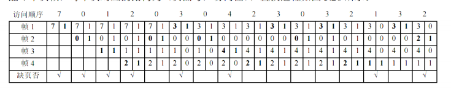
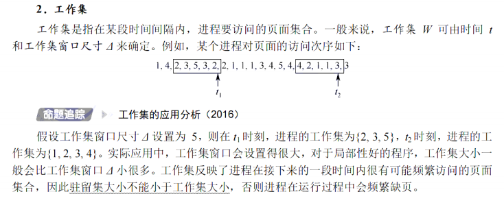
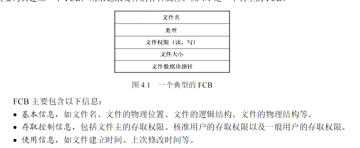
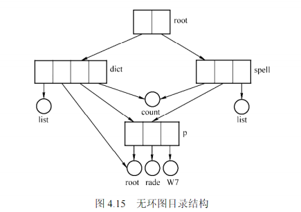

# 擦作系统 王道2026学习笔记

# 第一章 计算机系统概述

## 1.1 操作系统的基本概念

### 操作系统的定义：

控制和管理整个计算机系统的硬件与软件资源，合理地资助、调度计算机的工作和资源的分配，基进而为用户和其他软件提供方便的接口与环境的程序集合。操作系统是计算机中族基本的软件系统。

### 操作系统的功能和目标

**1.系统资源的管理者**

- 处理器管理
- 存储器管理
- 文件管理
- 设备管理

**2.作为用户和计算机系统之间的接口**
- 命令接口
  - 联机命令接口：强调交互性，用户输入命令，操作系统来完成指令
  - 脱机命令接口：批处理命令接口，用户提前编辑命令列表，操作系统来完成
- 程序接口
  - 由一系列的系统调用组成，用户通过请求这些命令来使得操作系统完成指令（GUI界面的等）

**3.实现了对计算机资源的扩充**
- 工人 操作 机器，机器就有更大的作用，于是，工人 便成为了 机器 的 扩充机器


### 操作系统特性
**1.并发**（注意和并行的区别）

概念：两个或者多个事件在同一时间间隔内发生

注意和**并行**的区别

并性的概念：两个或者多个事件在**同一时刻**内发生

引入进程的目的就是使程序能够并发执行

**2.共享**

资源共享：系统中的资源可以提供给内存之中多个并发执行的进程使用

- 互斥共享方式
  - 某些资源虽然可以提供给多个进程使用，但是在同一时刻只允许一个进程访问该资源
  - 打印机、磁带机
- 同时共享方式
  - 允许一段时间内由多个进程''同时''访问
  - 磁盘设备

**3.虚拟**

一个物理的实体变为若干逻辑上的对应物品
- 时分复用技术: 虚拟处理器。批处理的时候，多个进程并发执行，使得用户感觉，就是多个处理器在运行
- 空分复用技术：虚拟存储器

**4.异步**

并发执行的程序，由于资源限制，不是一贯到底的执行，而是走走停停，他以不可预知的速度向前推进


## 1.2 操作系统的发展历史

### 手工操作阶段
计算机上所有的工作都需要人工干预（程序的装入，运行，输出等）

用户独占机器，CPU等待人工操作，人机上的速度的冲突

### 批处理阶段
主要是为了解决人机矛盾以及CPU与I/O设备之间的速度不匹配等问题

- 单道批处理系统：将一批作业以脱机方式输入磁带，在监督程序的控制下，一个接一个的顺序的执行
  - 自动性（不需要人工干涉） 
  - 顺序性（磁带上的各个作业依次进入内存并执行）
  - 单道性（内存之中只存在一个程序）

- 多道批处理系统：作业在外存排成队列，然后按调度算法调入内存，一次可以调多个，相互穿插着执行
  - 多道
  - 宏观上并行（调入内存的程序都在运行，但还没有执行完毕）
  - 微观上串行（内存之中的多道程序，不可以同时占有CPU，还是交替占有执行）

### 分时操作系统
分时技术：将处理器的运行时间分成很短的时间片，按时间片轮流将处理器分配给各个作业使用；计算机速度很快，时间片轮转速度也很快，使得用户感觉自己在独占机器。

特点：
- 同时性：多个终端用户可以同时使用一台计算机
- 交互性：用户通过终端采用人机对话的方式直接控制程序，与程序进行交互
- 独立性：多个用户独立的操作计算机，不会存在相互干扰。就好像自己在独占这台机器一样
- 及时性：用户的请求能够在很短时间内获得响应
  
### 实时操作系统
必须在某一个时间限制内完成某些紧急的任务。

- 硬实时系统：必须，绝对在规定的时间内完成任务（飞行器的控制系统）
- 软实时系统：偶尔不再一定时间内完成也不会造成太大的影响（飞机购票，银行管理等）

### 网络操作系统和分布式计算机系统（略）
### 个人计算机操作系统（略）


## 1.3 操作系统运行环境

### 操作系统运行机制

**特权指令和非特权指令**

- 特权指令：操作系统内核的指令，只能由操作系统使用，普通用户程序不能使用, 如 I/O指令，中断指令等

- 非特权指令：操作系统内核以外的指令，普通用户程序可以使用

**内核态和用户态**

- 内核态：操作系统内核的运行状态，特权指令的运行状态
  - 时钟管理
  - 中断机制
  - 原语
  - 系统控制的数据结构和处理
    - 进程控制块，作业控制块，设备控制等
    - 进程管理，存储器管理，设备管理等

- 用户态：应用程序的运行状态，非特权指令的运行状态


### 中断和异常

- 中断：（外中断）由于内部事件（如I/O操作完成）或者外部事件（如用户按键）的发生，使得CPU暂时中止当前程序的执行，转而去处理中断事件，处理完毕后返回被中断的程序继续执行

- 异常：（内中断）由于执行指令的异常而引起的中断，如除0，地址越界等

**中断和异常的处理过程：**
- 保存被中断进程的CPU环境
- 根据中断类型转入相应的中断处理程序
- 中断处理程序处理中断
- 恢复被中断进程的CPU环境，返回被中断的进程继续执行
  
中断和异常的区别：中断是由外部事件引起的，异常是由执行指令引起的


### 系统调用

**系统调用：**操作系统提供给应用程序使用的接口，应用程序通过系统调用请求操作系统提供服务

**系统调用的功能**
- 进程管理。 完成进程的创建，撤销，阻塞，唤醒等操作。
- 进程通信。 完成进程之间的消息传递，信号传递等。
- 设备管理。 完成设备的请求和释放，以及设备的启动等。
- 内存管理。 完成存储分配与回收，地址映射等。
- 文件管理。 完成文件的读、写、创建、删除等操作。

**系统调用与库函数的区别：**
  - 系统调用是操作系统提供给应用程序使用的接口，库函数是应用程序提供给应用程序使用的接口
  - 系统调用是操作系统内核的接口，库函数是应用程序的接口
  - 系统调用是操作系统内核的指令，库函数是应用程序的指令
  - 系统调用是操作系统内核的指令，库函数是应用程序的指令

### 操作系统的体系结构

**1.分层法**

分层法是将操作系统分成若干层， 底层（层0）为硬件，顶层（层N）为用户接口，每一层只能调用紧邻它的底层的功能和服务（单向依赖）


**2.模块化**
模块化是将操作系统分成若干个模块，每个模块负责完成一个功能，模块之间通过接口进行通信


**高内聚，低耦合**

- 模块划分的大 增加了模块内部的复杂性

- 模块划分的小 会使得模块之间的依赖关系复杂

**3.宏内核**

将系统的主要的功能模块都作为一个紧密联系的整体，运行在核心态，内核态的模块之间可以直接相互调用

**4.微内核**

内核之中最基本的功能保留在内核之中(进程管理，中断处理，内存管理)，其他功能都放在用户态的模块之中，内核与用户态的模块之间通过消息传递的方式进行通信


# 第二章 进程与线程

## 2.1 进程与线程

### 进程的概念和特征

**进程**：进程是程序的一次执行过程，是系统进行资源分配和调度的独立单位

**为什么要引入进程：** 为了使多个程序能够并发执行，提高资源利用率和系统效率

**进程控制块(PCB)** ：用于描述进程的基本信息和运行状态，系统通过它来控制和管理进程

**进程实体：** 程序段 + 相关数据段 + 进程控制块(PCB)

**进程的特征：**
- 动态性：进程是程序的一次执行过程，是动态产生，动态消亡的
- 并发性：多个进程可以在单个处理器上并发执行
- 独立性：进程是系统独立运行的基本单位，拥有自己独立的资源
- 异步性：进程的执行是走走停停的，进程以不可预知的速度向前推进

### 进程的组成
1.进程控制块（PCB）

进程创建的时候先创建进程控制块，进程控制块是进程存在的唯一标志

PCB包含的信息：


2.程序段

进程被调度到CPU之后所执行的代码

3.数据段

一个进程的数据段，可以是进程对应的程序加工处理的原始数据，也可以是进程在运行过程中产生的数据

### 进程的状态与转换

**进程的5种状态**
- 运行态：进程占有处理器(CPU)正在运行
- 就绪态：进程获得了除处理器(CPU)以外的所有资源，等待系统分配处理器(CPU)资源
- 阻塞态：进程在等待某个事件完成（如I/O操作完成），暂时无法执行
- 创建态：进程正在被创建，操作系统为进程分配资源，初始化PCB
- 终止态：进程正在被撤销，操作系统回收进程所拥有的资源，撤销PCB

注意区分就绪态和阻塞态的：就绪态是进程已经获得了除处理器(CPU)以外的所有资源，等待系统分配处理器(CPU)资源；阻塞态是进程在等待某个事件完成（如I/O操作完成），暂时无法执行


### 进程控制

**进程控制：** 进程控制的主要功能是进程的创建，撤销，阻塞，唤醒等操作

1.进程的创建
- 申请一个空白的PCB(PCB是有限的)，若PCB申请失败则进程创建失败
- 为进程分配必要的资源，如CPU，内存，I/O，CPU时间等
- 初始化PCB，如设置进程的优先级，进程的状态，进程的ID等
- 将PCB插入就绪队列(进程的队列能够接纳新的进程)，等待进程调度

2.进程的终止

**引起终止的事件：**
- 正常结束：进程自己正常结束，如执行完任务
- 异常结束：由于进程出错而结束，如除0操作
- 外部干预：其他进程通过系统调用kill来结束某个进程

**终止进程时候的操作：**
- 检索出进程的PCB，检查其状态
- 若进程处于运行态，则立即终止进程的执行，将CPU资源分配给其他进程
- 若进程还有子孙进程，则通常会将所有的子孙进程都终止(有些操作系统不会)
- 将进程持有的资源归还给父进程或者操作系统
- 将进程的PCB从相应的队列中移除，如就绪队列，阻塞队列等

3.进程的阻塞与唤醒

**阻塞：**  进程在等待某个事件完成的时候，暂时无法执行，此时进程的状态由运行态变为阻塞态，并将PCB插入相应的阻塞队列中
- 找到将要被阻塞的进程的标识号(PID),所对应的PCB
- 若进程处于运行态，则保护其现场，将其状态设置为阻塞态，停止运行
- 将PCB插入相应事件的等待队列中，将CPU资源分配给其他进程

**唤醒：** 进程所等待的事件已经完成，进程的状态由阻塞态变为就绪态，等待系统调度
- 在该事件的等待队列之中找到相应的PCB
- 将PCB从等待队列中移除，修改其状态为就绪态
- 将PCB插入就绪队列中，等待系统调度

### 进程通信

**进程通信：** 进程通信是指进程之间的信息交换

**进程通信的方式：**

- **共享存储**: 在通信的进程之间存在一块共享的存储区域，进程可以直接读写这块存储区域中的数据，实现进程间的通信
- **消息传递**: 进程间的数据交换以格式化的消息(Message)为单位，进程通过发送消息来传递数据，通过接收消息来获取数据
  - 直接通信：发送进程直接将消息发送给接收进程，接收进程从消息队列中获取消息
  - 间接通信：发送进程将消息发送给消息队列，接收进程从消息队列中获取消息
- **管道通信**: 管道是一种特殊的文件，它允许一个进程将数据直接写入到另一个进程中，实现进程间的通信, 管道通过先进先出的队列实现
- **信号通信**: 信号是一种通知进程发生了某种事件的机制，不同的系统事件对应不同的信号类型，每个信号对应一个序号。进程通过信号来传递信息，实现进程间的通信
  
### 线程的概念与特点

**线程：** 线程是进程的一个实体，是CPU调度和分派的基本单位，它是比进程更小的能独立运行的基本单位，线程自己基本上不拥有系统资源，只拥有一点在运行中必不可少的资源（如程序计数器，一组寄存器和栈），但是它可与同属一个进程的其他线程共享进程所拥有的全部资源

**为什么要引入线程：** 为了进一步提高系统并发执行的程度，减少进程切换的开销，提高系统资源利用率

**线程和进程的比较：**
- 调度：在同一进程中，线程的切换不会引起进程切换，从一个进程中的线程切换到另一个进程中的线程时，会引起进程切换
- 并发性：进程的引入使得作业可以并发，线程的引入使得进程可以并发
- 资源：进程拥有独立的资源，是系统中拥有资源的基本单位，线程共享进程的资源(本身不拥有资源，只拥有一些能维持运行的必要资源)
- 独立性：每个进程都拥有独立的地址空间和资源。除却共享变量之外，进程之间不可以访问对方的资源。线程之间共享进程的资源，线程之间可以相互访问对方的资源。
- 系统开销：创建和撤销进程的系统开销比创建和撤销线程的系统开销大得多，因为创建和撤销进程需要系统资源，而创建和撤销线程只需要系统资源的一小部分
- 支持多处理器系统：单线程进程，不管由多少个CPU，线程只能在单个CPU上运行。多线程进程，可以充分利用多处理器的优势，将线程分配到多个CPU上运行。
  
**线程的状态和转换**
- 执行态：线程占有处理器(CPU)正在运行
- 就绪态：线程获得了除处理器(CPU)以外的所有资源，等待系统分配处理器(CPU)资源  
- 阻塞态：线程在等待某个事件完成（如I/O操作完成），暂时无法执行

**线程控制块**
- 线程ID(线程标识符)
- 一组寄存器
- 线程的运行状态
- 线程的优先级
- 线程专有的存储区
- 堆栈指针

**线程的实现方式：**
- 用户级线程：线程的创建，撤销，切换等操作都由应用程序来完成，操作系统内核不知道线程的存在，线程的调度由应用程序自己完成
- 内核级线程：线程的创建，撤销，切换等操作都由操作系统内核来完成，线程的调度由操作系统内核完成
- 组合方式：线程的实现方式是用户级线程和内核级线程的组合


注意：用户级线程切换的时候不会进入内核态，内核级线程切换的时候会进入内核态，并且会存在　保护现场和恢复现场的操作

**多线程模型**
- 多对一模型：一个用户级线程对应一个内核级线程，线程的创建，撤销，切换等操作都由应用程序来完成，线程的调度由操作系统内核完成
- 一对一模型：一个用户级线程对应一个内核级线程，线程的创建，撤销，切换等操作都由操作系统内核来完成，线程的调度由操作系统内核完成
- 多对多模型：n个用户级线程对应m个内核级线程，线程的创建，撤销，切换等操作都由应用程序来完成，线程的调度由操作系统内核完成


## 2.2 CPU调度

### CPU调度的概念

**CPU调度：** CPU调度是指操作系统为多个进程分配CPU资源，决定哪个进程应该使用CPU，以及分配多少CPU时间给进程

**调度的层次**
- 高级调度：也称为作业调度，主要功能是根据某种算法，从外存的后备队列中选取某些作业，将它们调入内存，并为它们创建进程，以准备运行
- 中级调度：也称为内存调度，主要功能是将处于等待状态的进程调出内存，或将暂时不能运行的进程调出内存，以便为其他进程让出足够的内存空间，或者将已经完成部分任务的进程调出内存，以便回收其占用的内存空间
- 低级调度：也称为进程调度，主要功能是按照某种算法，从就绪队列中选取一个进程，将CPU资源分配给它，使其执行

三级调度之间的联系：
作业调度将作业从外存调入内存，并为它们创建进程，以准备运行；进程调度从就绪队列之中选择一个进程，将CPU资源分配给它，使其执行；内存调度是为了提高内存利用率，系统将那些暂时不能运行的进程调出内存。


**调度的实现**

用于调度和分配CPU的组件成为调度程序，三部分组成

-　排队器：将系统中所有的就绪进程按照一定的算法，将它们排成一个或多个队列，当某个进程就绪时，排队器将其插入到相应的就绪队列之中
-　分派器：根据调度程序所选择的进程，将CPU资源分配给它，使其执行
-　上下文切换器：将被移出的进程保存上下文。为将要执行的进程恢复上下文


### 进程调度的目标

- CPU利用率：CPU利用率是指CPU在单位时间内执行了多少进程，CPU利用率越高，说明CPU资源利用率越高
  - CPU利用率 = CPU有效工作时间 / (CPU有效工作时间 + CPU空闲时间)
- 系统吞吐量：系统吞吐量是指单位时间内完成的进程数量，系统吞吐量越高，说明系统的效率越高
- 周转时间：周转时间是指进程从提交到完成所经历的时间，周转时间越短，说明进程的响应时间越短
  - 作业周转时间 = 作业完成时间 - 作业提交时间
  - 平均周转时间 = (所有作业的周转时间之和) / (作业数量)
  - 带权周转时间 = 作业周转时间　/　作业实际运行时间
  - 平均带权周转时间 = (所有作业的带权周转时间之和) / (作业数量)

### 进程切换
- 挂起一个进程，将CPU上下文保存到进程的PCB中，包括程序计数器，寄存器，内存指针等
- 将该进程的PCB移入相应的队列，如就绪队列，阻塞队列等
- 选择另外一个进程执行，并更新其PCB
- 恢复新进程的PCB中存储的CPU上下文信息
- 转跳到新进程PCB中程序计数器所指向的位置，开始执行

### 进程调度的算法

**先来先服务(FCFS)调度算法：** 按照进程到达的顺序进行调度，即先到达的进程先得到CPU资源，后到达的进程后得到CPU资源

**短作业优先(SJF)调度算法：** 按照进程的执行时间进行调度，即执行时间短的进程先得到CPU资源，执行时间长的进程后得到CPU资源

- 抢占式与非抢占式
- 容易造成长作业的饥饿现象


**高相应比优先调度算法**：按照进程的响应比进行调度，即响应比高的进程先得到CPU资源，响应比低的进程后得到CPU资源

- 相应比 = (进程等待时间 + 进程要求服务时间) / 进程要求服务时间
- 当等待时间相同时，短作业优先
- 当某一个进程的等待时间过长的时候，其响应比会变得很大，从而得到优先执行

**优先级调度算法**：按照进程的优先级进行调度，即优先级高的进程先得到CPU资源，优先级低的进程后得到CPU资源
- 抢占式与非抢占式
- 静态优先级以及动态优先级
- 一般情况下：
  - 系统进程 > 用户进程
  - 交互型进程(前台进程) > 非交互性进程(后台进程)
  - I/O型进程 > 计算型进程
    - I/O型进程：频繁进行I/O操作，CPU等待I/O操作的时间较长
    - 计算型进程：CPU密集型进程，CPU等待I/O操作的时间较短 
    - 让I/O型进程优先执行，可以减少CPU的空闲时间，提高CPU的利用率

**时间片轮转调度算法**：按照进程的到达顺序进行调度，每个进程分配一个时间片，时间片用完后，进程被挂起，下一个进程开始执行，直到所有进程都执行完毕


**多级反馈队列调度算法**：将就绪队列分成多个队列，每个队列的优先级不同，优先级高的队列的进程先得到CPU资源，优先级低的队列的进程后得到CPU资源，每个队列的时间片长度不同，优先级高的队列的时间片长度短，优先级低的队列的时间片长度长

## 2.3 同步与互斥
### 同步与互斥的基本概念
**临界资源：** 临界资源是指多个进程需要共享的资源，这些资源在同一时间只能被一个进程使用，其他进程需要等待该进程使用完毕后才能使用

- 临界区：临界区是指访问临界资源的代码段，临界区是进程中的关键部分，需要保护起来，防止多个进程同时访问临界区，导致数据不一致
- 进入区，临界区，退出区，剩余区

**同步：** 同步是指多个进程之间需要按照一定的顺序执行，即一个进程需要等待另一个进程执行完毕后才能继续执行

**互斥：** 互斥是指多个进程之间需要共享某些资源，这些资源在同一时间只能被一个进程使用，其他进程需要等待该进程使用完毕后才能使用

临界区互斥的四个必要条件：
- 空闲让进：当临界区资源空闲时，允许请求访问的进程进入临界区
- 忙则等待：当临界区资源被占用时，不允许其他进程进入临界区
- 有限等待：进程在请求访问临界区资源时，必须在有限的时间内得到响应
- 让权等待：当进程请求访问临界区资源时，如果无法立即获得资源，则应立即释放CPU

### 实现临界区互斥的方法：
**1.软件实现方法**

在进入区设置并检查一些标志来标明是否有进程在临界区中，若已有进程在临界区，则在进入区通过循环检查进行等待，进程离开临界区后则在退出区修改标志。


**算法一：单标志法（我想进！）**

变量turn表示选择权在谁手上，turn=0表示P0可进入，turn=1表示P1可进入，进入后将turn设置为另一方值。

```
P0{
	while(turn != 0); //进入区
	临界区资源; //临界区
	turn = 1; //退出区
}

P1{
	while(turn != 1); //进入区
	临界区资源; //临界区
	turn = 0; //退出区
}
```

缺点：违反空闲让进、让权等待

**算法二：双标志法先检查法（你想进不？我想进！）**

布尔型数组 flag[2]用来标记各个进程是否想进临界区，flag[i]=true表示Pi想要进入临界区(i=0或1)。Pi进入临界区前，先检查对方是否想进入临界区，若想，则等待；否则，将flag[i]置为true后，再进入临界区；当Pi退出临界区时，将flag[i]置为false。

```
P0{
	while(flag[1]);  //进入区 你想进不？
	flag[0] = true; //进入区 我想进！
	临界区资源；//临界区
	flag[0] = flase; //退出区
}

P1{
	while(flag[0]);  //进入区
	flag[1] = true; //进入区
	临界区资源；//临界区
	flag[0] = flase; //退出区
}

```

缺点：违反忙则等待、让权等待

**算法三：双标志法后检查法（我想进！你想进不？）**

先检查法先检查对方的标志，再设置自己的标志，但这两个操作又无法一气呵成，于是使得两个进程同时进入临界区的问题。因此，想到先设置后检查法，以避免上述问题。后检查法先设置自己的标志，再检查对方的标志，若对方的标志为true，则等待；否则，进入临界区。

```
P0{
	flag[0] = true; //进入区 我想进！
	while(flag[1]);  //进入区 你想进不？
	临界区资源；//临界区
	flag[0] = flase; //退出区
}

P1{
	flag[1] = true; //进入区
	while(flag[0]);  //进入区
	临界区资源；//临界区
	flag[0] = flase; //退出区
}

```

**算法四：皮特森算法（我想进！你先进吧~）**

Peterson 算法结合了算法一和算法三的思想，利用flag[]解决互斥访问问题，而利用 turn解决“饥饿”问题。若双方都争着进入临界区，则可让进程将进入临界区的机会谦让给对方。也就是说，在每个进程进入临界区之前，先设置自己的flag标志，再设置允许进入turn标志；之后，再同时检测对方的flag和turn标志，以保证双方同时要求进入临界区时，只允许一个进程进入。

```
P0{
	flag[0] = true; //进入区 我想进
	turn = 1； //进入区 你先进吧
	while(turn == 1 && flag[1] == true); //进入区 你先进吧
	临界区资源； //临界区
	flag[0] = false; //退出区
}

P1{
	flag[1] = true; //进入区 我想进
	turn = 0； //进入区 你先进吧
	while(turn == 0 && flag[0] == true); //进入区 你先进吧
	临界区资源； //临界区
	flag[1] = false; //退出区
}

```

**2.硬件实现的方法**

**算法一：中断屏蔽方法**

当一个进程正在执行它的临界区代码时，防止其他进程进入其临界区的最简单方法是关中断。因为CPU只在发生中断时引起进程切换，因此屏蔽中断能够保证当前运行的进程让临界区代码顺利地执行完，进而保证互斥的正确实现，然后执行开中断。

```
关中断；
临界区；
开中断；
```

缺点：
- 限制了 CPU交替执行程序的能力。
- 将关中断的权限交给用户不安全。
- 不适用于多处理器系统，

**算法二：硬件指令方法——TestAndSet 指令**

TestAndSet 指令(简称 TS 指令)可以读出指定标志后将该标志设置为真，是原子操作。指令的功能描述如下：

```
boolean TestAndSet (boolean *lock){
	boolean old;
	old=*lock;	//old 用来存放 lock 的旧值
	*lock=true;	//无论之前是否已加锁，都将lock 置为true
	return old;	//返回 lock 的旧值
}
```

lock有两种状态：true已加锁，false未加锁。进程在进入临界区之前，先用TS指令检查lock值：①若为 false，则表示没有进程在临界区，可以进入，并将 lock 置为 true，这意味着关闭了临界资源(加锁)，使任何进程都不能进入临界区；②若为 true，则表示有进程在临界区中，进入循环等待，直到当前访问临界区的进程退出时解锁(将lock置为 false)。

利用 TS指令实现互斥的过程描述如下：

```
while TestAndSet(&lock); //加锁并检查
临界区代码段；
lock=false; //解锁 
```

**算法三：交换指令方法——Swap 指令**

用Swap指令管理临界区时，为每个临界资源设置一个共享布尔变量lock，初值为 false;在每个进程中再设置一个局部布尔变量key，初值为true，用于与 lock交换信息。

```
Swap(boolean *lock,boolean *key){
	boolean temp;
	temp=*lock;
	*lock=*key;
	*key=temp;
}
```

从逻辑上看，Swap指令和TS指令实现互斥的方法并无太大区别，都先记录此时临界区是否已加锁(记录在变量 key中)，再将锁标志lock置为true，最后检查key，若 key为false，则说明之前没有其他进程对临界区加锁，于是跳出循环，进入临界区。其处理过程描述如下：

```
boolean key=true;
while(key!=false)
	Swap(&lock,&key);
临界区代码段；
lock=false;
```

**互斥锁(mutex)**

一个进程进入临界区时，先对互斥锁加锁(调用acquire()函数)，若互斥锁已被其他进程加锁，则该进程等待，直到互斥锁被解锁；当进程退出临界区时，解锁互斥锁(调用release()函数)。

```
acquire(){
	while(mutex == true); //进入区
	mutex = true; //进入区
}

release(){
	mutex = false; //退出区
}
```

**信号量**

**1.整型信号量**
整型信号量是一种最简单的信号量，只有三种操作：初始化、wait(P)操作和signal(V)操作。P、V操作是原语操作，不可中断，具有原子性。

```
wait(s){ //P操作
	while(s <= 0); //进入区
	s--; //进入区
}

signal(s){ //V操作
	s++; //退出区
}
```
在wait之中s <= 0时，会一直循环，未遵循让权等待原则，因此需要改进。

**2.记录型信号量**
记录型信号量是一种更复杂的信号量，除了整型信号量的三个操作外，还增加了一个进程链表，用于记录所有等待该信号量的进程。

```
typedef struct semaphore{
	int value; //信号量值
	struct process *L; //等待进程链表
}semaphore;
```
wait 和 signal 操作如下：

```
wait(semaphore s){ //P操作
	s.value--; //进入区
	if(s.value < 0){
		//将当前进程插入到s.L中，并挂起该进程； //进入区
    block(s.L);
	}
}

signal(semaphore s){ //V操作
	s.value++; //退出区
	if(s.value <= 0){
		//从s.L中移出一个进程P，并将P置于就绪队列； //退出区
    wakeup(P);
	}
}
```

利用信号量实现互斥和同步：
- 互斥：将临界区代码段放在 wait(s) 和 signal(s) 之间。
- 同步：将两个进程的并发执行顺序用 wait(s) 和 signal(s) 来描述。

互斥：
```
P0{
	wait(s);
	//临界区代码段
	signal(s);
}

P1{
	wait(s);
	//临界区代码段
	signal(s);
}
```

同步：
```
P0{
	x;
	signal(s);
	···
}

P1{
  ···
	wait(s);
  y;
	···
}
```


### 经典同步问题

这里就不写了，一定要偶尔看看，非常经典

### 管程

管程也是用来解决进程同步互斥的一种工具，它的操作比信号量更加简单，管程封装了同步操作，对进程隐藏了同步细节。管程之所以被说是一个类，是因为管程采用了封装的思想，把复杂的细节隐藏了，我们只需要调用管程提供的特定“入口”就能实现进程同步/互斥了。

- 背景：管程是在程序设计语宣中被引入的，是一种高级的同步机制；
- 特点：管程把对共享资源的操作封装起来；每次仅允许一个进程进入管程


**管程的定义**
- 管程的名称
- 局部于管程的共享数据
- 对共享数据操作的一组过程(函数)
- 设置初始值的语句

举例：
```
monitor ProducerConsumer{
	int count = 0;
	condition empty, full;
	procedure producer(){
		while(count == N){
			wait(empty);
		}
		//生产一个产品
		count++;
		signal(full);
	}
	procedure consumer(){
		while(count == 0){
			wait(full);
		}
		//消费一个产品
		count--;
		signal(empty);
	}
}
```

**条件变量：**
条件变量是管程中的一种特殊变量，用于线程的挂起和唤醒。条件变量和互斥锁配合使用，能够实现线程的同步。条件变量和互斥锁的区别在于，互斥锁用于保护共享数据，确保同一时刻只有一个线程访问共享数据；而条件变量用于线程的挂起和唤醒，当条件不满足时，线程挂起等待，当条件满足时，线程被唤醒继续执行。

- x.wait：x条件不满足时，将自己插入x条件的等待队列，并释放管程，允许其他进程使用该管程（让其他人先用）
- x.signal：x条件满足时，唤醒一个因x条件而阻塞的进程

## 2.4 死锁

### 死锁的概念

**死锁**：两个或两个以上的进程在执行过程中，因争夺资源而造成的一种互相等待的现象，若无外力作用，它们都将无法推进下去。此时，称系统处于死锁状态或系统产生了死锁，这些永远在互相等待的进程称为死锁进程。


**死锁与饥饿的区别**
- 发生饥饿的进程可以只有一个，但是发生死锁的进程至少有两个。
- 发生饥饿的进程可能处于就绪态，但是发生死锁的进程一定处于阻塞态。
- 饥饿的进程在一段时间内得不到资源，但是饥饿的进程最终可以执行，而死锁的进程将永远无法执行(无干涉情况下)。

**死锁产生的原因**
- 竞争资源：系统资源不足，进程争抢资源而造成死锁。
- 进程推进顺序不当：进程在运行过程中，请求和释放资源的顺序不当，导致进程陷入死锁。

**死锁产生的必要条件：**
- **互斥条件**：进程对所分配的资源进行排他性使用，即在一段时间内某资源只由一个进程占用。如果此时还有其它进程请求资源，则请求者只能等待，直至占有资源的进程用毕释放。
- **请求和保持条件**：进程已经保持至少一个资源，但又提出了新的资源请求，而该资源已被其他进程占有，此时请求进程阻塞，但又对自己已获得的其它资源保持不放。
- **不可剥夺条件**：系统不能从占有资源的进程中抢占资源，只能由占有资源的进程自行释放（只能是主动释放）。
- **循环等待条件**：存在一种进程资源的循环等待链，链中每一个进程已获得的资源同时被链中的下一个进程所请求。

**死锁的处理**
- 死锁预防：预防死锁就是阻止系统进入不安全状态，从而避免死锁的发生。预防死锁需要确保死锁的四个必要条件中至少有一个不成立。
- 死锁避免：死锁避免是指系统在分配资源时，对资源请求进行动态检查，以确保资源分配不会导致系统进入不安全状态，从而避免死锁的发生。
- 死锁检测与解除：死锁检测是指系统定期检查系统中的资源分配情况，以确定是否存在死锁。一旦检测到死锁，就需要采取相应的措施来解除死锁，如资源剥夺、进程回退等。


### 死锁的预防
**预防死锁**：预防死锁就是阻止系统进入不安全状态，从而避免死锁的发生。预防死锁需要确保死锁的四个必要条件中至少有一个不成立。

(GPT生成的，看看就行)

**1. 破坏互斥条件**
互斥条件是进程对所分配的资源进行排他性使用，即在一段时间内某资源只由一个进程占用。如果此时还有其它进程请求资源，则请求者只能等待，直至占有资源的进程用毕释放。因此，破坏互斥条件就是允许资源同时被多个进程共享，这样每个进程都可以得到自己所需要的资源。

**2. 破坏请求和保持条件**
请求和保持条件是指进程已经保持至少一个资源，但又提出了新的资源请求，而该资源已被其他进程占有，此时请求进程阻塞，但又对自己已获得的其它资源保持不放。因此，破坏请求和保持条件就是要求进程在开始运行之前，必须一次性地申请它所需要的所有资源，并且只有当进程所申请的所有资源都得到满足后，进程才能开始运行。这样，进程在运行过程中就不会再提出新的资源请求，从而避免了请求和保持条件。

**3. 破坏不可剥夺条件**
不可剥夺条件是指系统不能从占有资源的进程中抢占资源，只能由占有资源的进程自行释放（只能是主动释放）。因此，破坏不可剥夺条件就是允许进程在运行过程中主动释放它所占有的资源，这样，当进程在运行过程中需要新的资源时，如果该资源已被其他进程占用，进程可以主动释放自己所占有的资源，从而获得所需的资源。

**4. 破坏循环等待条件**
循环等待条件是指存在一种进程资源的循环等待链，链中每一个进程已获得的资源同时被链中的下一个进程所请求。因此，破坏循环等待条件就是要求进程在申请资源时，按照一定的顺序进行，即每个进程只能申请它所需要的下一个资源，而不能申请它所需要的其他资源。这样，就不会存在进程资源的循环等待链，从而避免了循环等待条件。

### 死锁的避免
**死锁避免**：死锁避免是指系统在分配资源时，对资源请求进行动态检查，以确保资源分配不会导致系统进入不安全状态，从而避免死锁的发生。

**安全状态**：系统按照某种进程的推进顺序，可以依次为每个进程分配它所需要的资源，直到所有进程都得到它们所需要的资源，此时系统处于安全状态。如果系统无法找到一个这样的进程推进顺序，则系统处于不安全状态。

**银行家算法和安全性算法要重点看一看，这里写的比较简单，重点过一下书中的例子，要理解**

**银行家算法**：银行家算法是一种死锁避免算法，用于防止系统进入不安全状态。银行家算法的基本思想是，当进程请求资源时，系统首先检查该进程是否可以得到它所需要的所有资源，如果可以，则分配资源给该进程，否则，该进程进入等待状态。如果系统无法找到一个这样的进程推进顺序，则系统处于不安全状态，此时系统会拒绝分配资源给任何进程，直到系统进入安全状态为止。

**安全性算法**：安全性算法是一种死锁避免算法，用于检查系统是否处于安全状态。安全性算法的基本思想是，从某个进程开始，依次检查该进程是否可以得到它所需要的所有资源，如果可以，则将该进程加入到安全序列中，并继续检查下一个进程。如果所有进程都可以得到它们所需要的所有资源，则系统处于安全状态，否则，系统处于不安全状态。

### 死锁的检测与解除

**死锁检测**：死锁检测是指系统定期检查系统中的资源分配情况，以确定是否存在死锁。一旦检测到死锁，就需要采取相应的措施来解除死锁，如资源剥夺、进程回退等。

根据资源分配图来检测死锁


**检测到死锁之后的处理：**

- 资源剥夺法：剥夺某些进程的资源，使其释放出资源，从而打破死锁。
- 撤销进程法：强制撤销部分甚至是全部的死锁进程，并剥夺这些进程的资源，从而打破死锁。
- 进程回退法：让进程回退到之前的一个安全状态，从而打破死锁。

# 第三章 内存管理
## 3.1 内存管理的概念
### 内存管理的基本概念
内存：计算机的主存储器，用于存储程序和数据。

内存管理的主要任务：
- 内存空间的分配与回收：为进程分配内存空间，并在进程结束时回收内存空间。
- 地址转换：将逻辑地址转换为物理地址。
- 内存空间的扩充：通过虚拟内存技术，扩充进程的可用内存空间。
- 内存共享：允许多个进程共享内存空间，提高内存利用率。
- 内存保护：防止进程访问非法内存地址，保护系统安全。

1.逻辑地址与物理地址
- 逻辑地址：程序编译之后，每个目标模块都从0号开始编址，这种地址称为逻辑地址，或者是相对地址
- 物理地址：内存中每个存储单元都有一个唯一的物理地址，用于标识该存储单元在内存中的位置。

2.程序的链接与装入


用户程序转化为内存之中可以运行的程序：
- 编译：将高级语言编写的源程序翻译成目标程序
- 链接：将目标程序链接成可执行程序，链接的时候还会带着库函数一起链接
- 装入：将可执行程序装入内存中运行

装入的方式：

1.绝对装入：

- 编译的时候就知道要将程序放在那个位置，程序的逻辑地址与实际的物理地址相同(地址可以是编译或者汇编的时候给出，也可以是程序员指定)
- 适用于单道程序系统

2.静态重定位：

- 编译的时候不知道程序放在那个位置，链接的时候不知道程序放在那个位置，装入的时候才知道程序放在那个位置，编译的时候使用的是逻辑地址(从0开始)，装入的时候会将逻辑地址转换为物理地址
- 一个作业分配之后必须全部装入内存，否则不能运行

3.动态重定位：

- 装入后的地址还是逻辑地址，运行的时候才会将逻辑地址转换为物理地址


链接的方式：
- 静态链接：在编译和链接阶段完成链接，生成一个完整的可执行文件
- 装入时动态链接：在装入时完成链接，生成一个可执行文件
- 运行时动态链接：在运行时完成链接，生成一个可执行文件

3.进程的内存映像

进程的内存映像：进程在内存中的映像，包括代码段、数据段、堆、栈、进程控制块等。


4.内存保护

内存保护：防止进程访问非法内存地址，保护系统安全。

内存保护机制：
- 地址越界检查：检查程序访问的内存地址是否在合法范围内。
- 内存访问权限检查：检查程序对内存的访问权限，如只读、可写、可执行等。
- 内存访问控制：通过设置内存访问控制位，控制程序对内存的访问权限。

5.内存共享

只有那些只读的区域才可以进程之间共享

### 连续分配管理方式

**单一连续分配**
- 分为两个区：系统区(操作系统用)和用户区
- 整个内存空间只划分一个连续的区域，用于存放一个进程。这种分配方式简单，但只能用于单道程序系统，无法实现内存的动态分配和回收。

**固定分区分配**
- 将内存空间划分为若干个固定大小的分区，每个分区只能容纳一个进程。
- 两种不同的方式：
  - 分区大小相等：每个分区的大小相同，适用于进程大小相近的情况。
  - 分区大小不等：每个分区的大小不同，适用于进程大小差异较大的情况。
- 分区使用表：记录每个分区的起始地址、大小、状态等信息。


**动态分区分配**


- 分区大小可变：每个分区的大小可以根据进程的大小动态调整。
- 空闲分区表：记录每个空闲分区的起始地址、大小、状态等信息。
  - 注意回收时候的合并操作
- 分配算法
  - 顺序：
    - 首次适应：从空闲分区表中找到第一个满足要求的空闲分区，将其分配给进程。
    - 邻近适应：和首次适应差不多，只不过不再从最开始找，维护一个指针，继续循环找
    - 最佳适应：从空闲分区表中找到大小最合适的空闲分区，将其分配给进程。
    - 最差适应：从空闲分区表中找到大小最大的空闲分区，将其分配给进程。
  - 索引：
    - 伙伴系统：
    - 快速适应：
    - 哈希算法

注意：上面都是连续分配的，别搞混了

### 基本分页存储管理！！！
小概念：
- 页面和页面大小：将内存空间划分为若干个大小相等的区域，每个区域称为一个页面，页面大小一般为2的整数次幂，如4KB、8KB等。
- 地址结构：
  - 页号+页内偏移量：将逻辑地址分为页号和页内偏移量两部分，页号用于标识页面，页内偏移量用于标识页面内的具体位置。
- 页表：记录每个页面在内存中的存放位置


**基本的地址变换！！！**
这个比较重要，书中很详细！！


**快表的地址变换**
- 快表：用于提高地址变换的速度，将常用的页面号存储在快表中，当进行地址变换时，首先在快表中查找页面号，如果找到则直接得到物理地址，否则再在页表中查找。


**两级页表**
- 当进程的页表太大时，可以将页表分为多个子页表，每个子页表称为一个页目录，页目录中记录了每个子页表的起始地址和长度。


### 基本分段存储管理！！！
小概念：
- 段：将内存空间划分为若干个大小不等的段，每个段用于存放特定类型的数据，如代码段、数据段、堆、栈等。段内连续，段间不一定连续。

- 段表


- 地址变换


### 段页式存储管理！！！
小概念：
- 段页式存储管理：结合了分段和分页两种存储管理方式，将内存空间划分为若干个大小不等的段，每个段再划分为若干个大小相等的页面。(段内分页)


地址映射：


## 3.2 虚拟内存

### 虚拟内存的基本概念
传统的内存管理方式：
- 一次性: 进程一次性将所有数据装入内存，如果进程所需内存空间超过物理内存大小，则无法运行。
- 驻留性：进程在运行期间一直驻留在内存中，即使暂时不使用的部分也不释放。

局部性原理！！！
- 时间局部性：如果程序中的某条指令被执行，那么在不久的将来，这条指令很可能会再次被执行。（循环）
- 空间局部性：如果程序中的某条指令被执行，那么在不久的将来，与此指令相邻的指令也很有可能被执行。（顺序）

虚拟内存的三个重要特性：
- 多次性：进程可以分多次将数据装入内存，而不是一次性将所有数据装入内存。
- 对换性：进程在运行期间，如果内存空间不足，可以将暂时不使用的部分数据换出到外存，腾出空间给其他进程使用，当需要使用这些数据时，再将其换入内存。
- 虚拟性：进程可以访问比实际物理内存更大的地址空间，即虚拟内存。

### 请求分页管理方式

1.页表机制

页表内容:页号+物理块号+状态位+访问字段+修改位+外存地址

- 状态位：表示该页是否在内存中，1表示在内存中，0表示不在内存中。
- 访问字段：记录该页是否被访问过。
- 修改位：记录该页是否被修改过。
- 外存地址：记录该页在外存中的位置。

2.缺页中断与地址变换！！！！！背会


### 页框分配
驻留集的概念：驻留集是指在内存中实际存在的页面集合，即进程在内存中实际占用的页面数。

分配策略：
- 固定分配：进程启动时，系统为其分配固定数量的页框，进程运行期间，页框数不变。
- 可变分配：进程启动时，系统为其分配一定数量的页框，进程运行期间，根据需要动态调整页框数。

置换策略：
- 全局置换：系统根据全局信息选择一个页面进行置换。
- 局部置换：系统根据局部信息选择一个页面进行置换。

组合一下：
- 固定分配+全局置换：不存在
- 固定分配+局部置换：为每个进程分配固定数量的页框，进程运行期间，从这些固定的页框中选择一个页面进行置换。
- 可变分配+全局置换：为每个进程分配一定数量的页框，进程运行期间，根据需要动态调整页框数，系统根据全局信息选择一个页面进行置换。
- 可变分配+局部置换：为每个进程分配一定数量的页框，进程运行期间，根据需要动态调整页框数，系统根据分配的页框选择一个页面进行置换。

**后面一些小概念：**

调入页表的时机：
- 预调入策略：在进程运行期间，如果预见到将要访问的页面不在内存中，则提前将其调入内存。(根据局部性原理，但是目前预测成功率不是很高)
- 请求调页策略：在进程运行期间，如果访问的页面不在内存中，则产生缺页中断，系统将页面调入内存。

从何处调入：
- 系统拥有足够的对换区：从系统拥有的兑换区中调入页面。需要先将和进程有关的信息复制一份到对换区
- 系统拥有有限的对换区：不被修改的页面从文件区直接调入，当换出的时候，不必经过对换区，直接丢弃就行。被修改的页面，当换出的时候，需要将页面复制到对换区，当换入的时候，需要将页面复制到内存中，后续需要修改文件区之中的内容
- UNIX：第一次被调入的时候，直接从文件区中调入，后续调出的时候存在对换区，再次调入的时候，直接从对换区中调入，不需要再次从文件区中调入。(对于一些共享的资源非常友好)

### 页面置换
1.最佳置换算法(不可实现，主要用来评估其他算法)
- 选择淘汰的页面是后面再也用不到的页面


2.先进先出置换算法(FIFO)
- 选择最早调入的页面进行置换


3.最近最久未使用置换算法(LRU)
- 选择最近最久未使用的页面进行置换


4.时钟置换算法(Clock)
- 访问位为0的页面进行置换
- 访问位为1的页面，将其访问位清零，然后继续查找下一个页面，直到找到一个访问位为0的页面进行置换


5.改进的时钟置换算法(改进的Clock)
- 访问位(A),修改位(M)
- 四类
  - 1类：A=0,M=0:最近没有访问过，也没有修改过，最佳淘汰页
  - 2类：A=0,M=1:最近没有访问过，但是修改过，次佳淘汰页
  - 3类：A=1,M=0:最近访问过，但是没有修改过
  - 4类：A=1,M=1:最近访问过，也修改过
- 访问位为1的页面，将其访问位清零，然后继续查找下一个页面，直到找到一个访问位与修改位同时为0的页面进行置换(最后都会转化为1类或者2类)

### 抖动与工作集
- 抖动：频繁的页面置换，导致系统性能下降。
  - 主要与驻留集大小有关，提出工作集的概念
- 工作集：一段时间内，进程可能频繁访问的页面集合。


- 驻留集的大小不得小于工作集的大小，否则会导致频繁的页面置换，降低系统性能。

# 第四章 文件管理
## 4.1 文件系统基础
### 基本小概念
系统运行时，计算机以进程为基本单位，用户进行输入输出时，则以文件为基本单位

文件的定义：
- 数据项：是文件中最小的数据单位。
  - 基本数据项：是构成记录的基本单位，如姓名、年龄等。
  - 组合数据项：由基本数据项组合而成
- 记录：是文件中一组相关数据的集合。
- 文件：是具有符号名的相关信息的集合。
(仿照数据库，文件是数据库，记录是表，数据项是字段)

文件的属性
- 名称：文件的标识符，文件名唯一
- 类型：文件的类型，如文本文件、二进制文件等
- 创建者：文件的创建者ID
- 所有者：文件的拥有者ID
- 位置：指向设备和设备上下文的指针
- 大小：文件的大小
- 保护：文件的访问权限，如只读、读写等
- 时间戳：文件的创建时间、修改时间等

### 文件控制块
文件控制块（FCB）：是文件属性及其相关信息的集合，用于描述和控制文件。
- FCB是文件存在的标志，每个文件都有一个唯一的FCB。
- FCB的集合构成文件目录。



索引节点
- 当文件很多的时候，检索文件目录会非常耗时，但是其实检索的时候只需要使用FCB之中的文件名这一属性，不需要使用完整的FCB，所以引入索引节点
- 索引节点是文件目录的简化版，只包含文件名和索引节点号
- 索引节点号指向FCB，FCB中包含文件的其他属性

### 文件的操作
- 创建文件：分配外存空间，在目录之中创建一个目录项
- 删除文件：查找目录项，释放空间，删除目录项
- 读文件：查找目录项，找到外存地址，在目录项之中有一个用于文件读操作的指针
- 写文件：查找目录项，找到外存地址，在目录项之中有一个用于文件写操作的指针，更新写指针

**文件的打开与关闭**
- 打开文件，维护两个表
  - 整个系统的打开文件表：包含与进程无关的信息
    - 文件在磁盘的位置
    - 文件的大小
    - 访问日期等
  - 进程的打开文件表：包含与进程相关的信息
    - 当前的读/写指针
    - 文件访问权限
    - 指向系统表之中适当条目的指针

注意：
- 系统的打开文件表之中会维护一个打开计数器，当进程打开文件时，计数器加1，当进程关闭文件时，计数器减1，当计数器为0时，系统会删除该文件
- 文件名不是打开文件表之中的必要部分，当用文件名检索到FCB的磁盘定位(索引节点)，之后，就不在需要文件名了
- 例子：C++ open文件之后会生成一个文件描述符，后续的read，write等操作都是基于文件描述符进行的，不需要文件名

### 文件的逻辑结构
无结构文件：
- 文件中的数据没有明显的结构，数据项之间没有关系。所以也成为流文件，其长度以字节为单位。比如系统中运行的大量的程序文件，它们都是无结构的文件。

有结构文件
- 也成为记录式文件：文件中的数据由若干个记录组成，每个记录由若干个数据项组成。记录式文件又分为定长记录和变长记录两种。
  - 定长记录：每个记录的长度相同，如学生信息管理系统中的学生记录，每个记录包含姓名、年龄、性别等字段，每个记录的长度相同。
  - 变长记录：每个记录的长度不同，如电子邮件，每个邮件的长度不同。
- 按照记录的组织方式，记录式文件又分为顺序文件、索引文件和索引顺序文件三种。
  - 顺序文件：文件之中的记录按照一定的顺序排列。；两种结构串结构(记录之间的顺序与关键字无关，通常是按照存入的顺序排列的)和顺序结构(按照关键字的顺序排列，适合查找)
  - 索引文件：文件之中包含一个索引表，索引表中的每个索引项包含一个关键字和指向该记录的指针。
    - 定长记录的文件：直接A = n*len + 1便可以得到相应的文件的下标注
    - 变长记录的文件：得依靠索引表
 
  - 索引顺序文件：顺序与索引的结合(看一下书中例子，很好理解，就像微信朋友上面的ABCD...)


### 文件的物理结构
小概念：
- 磁盘块：类似于内存的分页，磁盘也分成若干个块，每个块的大小相等
- 注意文件的分配以及空闲块的管理
- 文件分配的三种方式
  - 连续分配：将文件分配给连续的磁盘块，文件在磁盘上的位置是连续的。
  - 链接分配：将文件分配给不连续的磁盘块，每个磁盘块包含一个指针，指向下一个磁盘块。
  - 索引分配：将文件分配给不连续的磁盘块，每个文件包含一个索引表，索引表中的每个索引项包含一个磁盘块号和指向该磁盘块的指针。

#### 连续分配
将文件分配给连续的磁盘块，文件在磁盘上的位置是连续的。


#### 链接分配
1.隐式链接

将文件分配给不连续的磁盘块，每个磁盘块包含一个指针，指向下一个磁盘块。


2.显式链接

维护一个FAT(文件分配表)


-1表示文件的最后一块 -2表示空闲，因此FAT还能做空闲块管理

#### 索引分配
打开某个文件的时候，不需要把全部的FAT调入内存，只需要调入相应文件的FAT即可，因此将伟哥文件的盘块号放在一起


**多级索引分配**

- 文件太大，一个索引表放不下，因此引入多级索引分配


**混合索引分配**

单级索引放不下大文件，多级索引需要多次访问磁盘，因此引入混合索引分配


### 文件保护
文件保护：防止文件被非法访问和修改。

访问类型：
- 读：读取文件内容
- 写：修改文件内容
- 执行：运行文件
- 添加：向文件中添加内容
- 删除：删除文件
- 列表清单：列出文件名和文件属性

访问控制：

三种用户类型：
- 所有者：文件的创建者
- 群组：文件的创建者所在的群组
- 其他：其他用户

访问控制表:


其他的访问控制方式：
- 口令和密码

## 4.2 目录
### 目录的基本概念
目录：是文件控制块（FCB）的有序集合，用于描述和控制文件。

### 目录的操作：
- 搜索
- 创建文件
- 删除文件
- 创建目录
- 删除目录
- 移动目录
- 显示目录
- 修改目录

### 目录结构
1.单级目录结构

整个文件系统只有一个目录，所有文件的FCB都放在这个目录下。


缺点: 不同的用户可能拥有相同的文件名，无法对文件进行分类管理。

2.两级目录结构

将文件系统按照用户进行分类，每个用户都有一个自己的目录，目录下存放该用户的文件。


3.树型目录结构

将文件系统按照层次进行分类，每个目录下可以包含子目录和文件。


4.无环图目录结构(了解)



### 目录实现
1.顺序列表
2.哈希表

### 文件共享
1.硬链接

基于索引点的方式，创建一个指向索引点的指针，相当于复制了一个指针，而不是复制了文件本身。


删除的时候，需要count等于0的时候，才会删除文件，即使是文件拥有者删除文件，也需要count等于0的时候，才可以删除文件。

2.符号链接

符号链接类似于快捷方式，指向的文件

当文件删除之后，再想通过符号链接访问文件，会访问失败，这个时候，需要删除符号链接


## 4.3 文件系统实例

文件系统结构


看一看书吧！


### 文件存储空间管理

主要是空闲空间管理

1.空闲表法

空闲表法：将所有空闲块用一个在外存上用一个空闲表来记录


盘块的分配：
- 首次适应，最佳适应

盘块的回收：
- 内存的回收，涉及到空闲块的合并

2.空闲链表法

空闲盘块链：将所有空闲块用一个链

空闲盘区链：将磁盘之中的空闲盘区拉成一个链

3.位士图


4.成组链接法

成组链接法：将磁盘分为若干个盘组，每个盘组包含若干个盘块，每个盘组包含一个索引表，索引表中的每个索引项包含一个盘块号和指向该盘块的指针。


### 虚拟文件系统

虚拟文件系统：将多个文件系统整合成一个统一的文件系统，用户无需关心文件系统的具体实现，只需要使用统一的接口进行操作。


# 第五章  输入输出管理
这里就不说太详细了
## 5.1 I/O管理概述

小概念:
- I/O设备分类
- I/O接口
- I/O接口类型
- I/O端口
  - 独立编址
  - 统一编址

I/O控制方式
- 程序控制：CPU对I/O设备进行直接控制，CPU不断查询I/O设备的状态，当I/O设备准备好数据后，CPU将数据从I/O设备读入内存。
- 中断驱动：CPU对I/O设备进行间接控制，当I/O设备准备好数据后，向CPU发送中断信号，CPU响应中断，将数据从I/O设备读入内存。
- DMA：直接存储器访问，CPU将I/O设备的数据直接读入内存，无需CPU干预。
- 通道：CPU将I/O设备的数据直接读入内存，无需CPU干预。
  


I/O软件层次结构


## 5.2 设备独立性软件

### 高速缓存与缓冲区
注意：逻辑上告诉缓存属于磁盘，但是物理上属于内存

缓存技术：
- 单缓存：只有一个缓存
- 双缓存：有两个缓存。
- 循环缓存：有多个缓存，按照顺序循环使用
- 缓存池：有多个缓存，按照一定的策略选择使用


### SPOOLing技术


1.提高了I/O的速度
2.将独占设备转换为共享设备
3.实现了虚拟设备(每个进程都觉得自己独占这个设备)

## 磁盘和固态硬盘
一些概念性的直接看书吧

有一些比较重要：

1.磁盘调度算法：
- 先来先服务(FCFS)
- 最短寻道时间优先(SSTF)

- 扫描算法(SCAN)
- 循环扫描算法(C-SCAN)
- LOOK算法
- CLOOK算法


2.减少延迟

磁盘读入数据的之后需要一定时间的处理，才能读下一个盘块！

