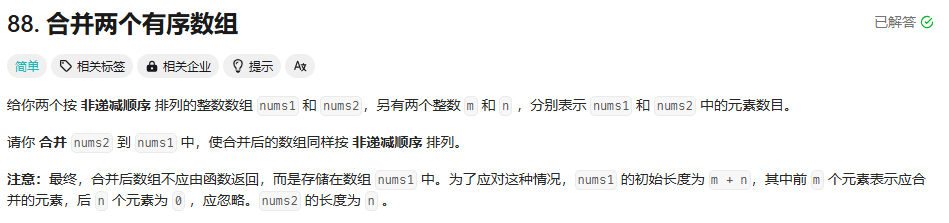

# 88_合并两个有序数组


和归并排序类似，这里采用一空间换时间的想法（重新定义一个m+n的vector来元素）

运用双指针（下标）来做，从而实现o（m+n）的效果

```cpp
class Solution {
public:
    void merge(vector<int>& nums1, int m, vector<int>& nums2, int n) {
        //先把两个最特殊的情况排除掉
        if(n==0){
            return;
        }
        if(m==0){
            for(int k=0;k<n;k++){
                nums1[k] = nums2[k];
            }
            return;
        }

        vector<int> resultList;
        int i=0,j=0;
        while(i<m||j<n){
            // num1处理完了，只要处理num2就好了
            if(i==m){
                for(j;j<n;j++){
                    resultList.push_back(nums2[j]);
                } 
                break;
            }
            // num2处理完了，只要处理num1就好了
            if(j==n){
                for(i;i<m;i++){
                    resultList.push_back(nums1[i]);
                } 
                break;
            }

            // 找到比较小的元素，并处理
            if(nums1[i]<=nums2[j]&&i<m){
                resultList.push_back(nums1[i]);
                i++;
                continue;
            }
            
            // 找到比较小的元素，并处理
            if(nums1[i]>nums2[j]&&j<n){
                resultList.push_back(nums2[j]);
                j++;
                continue;
            }
        }

        for(int k=0;k<m+n;k++){
            nums1[k] = resultList[k];
        }
        
    }
};
```

