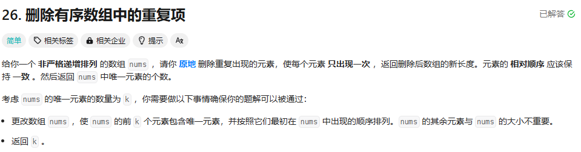

第一印象：vector 转 set 很好解决

算法：

还是双重下标。一个用来记录插入的位置，一个用来遍历

这样一遍遍历就可以解决


```cpp
class Solution {
public:
    int removeDuplicates(vector<int>& nums) {
        if(nums.size()<=1){
            return nums.size();
        }
        int insertIndex = 1;
        for(int i=1;i<nums.size();i++){
            if(nums[insertIndex-1]<nums[i]){
                nums[insertIndex] = nums[i];
                insertIndex++;
            }
        }
        return insertIndex;
    }
};
```