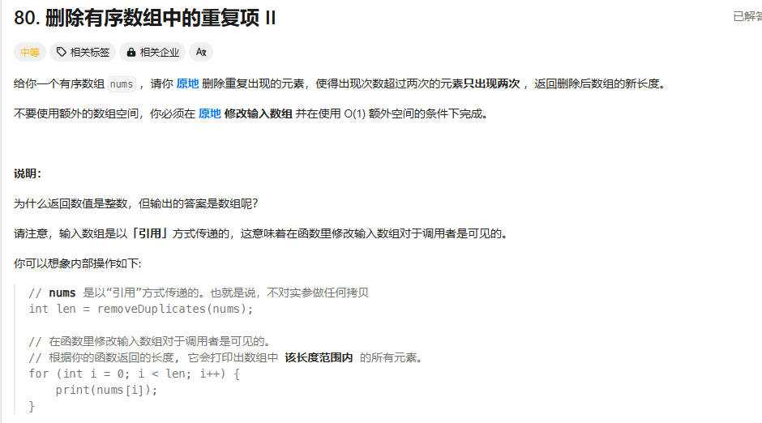

和3_26 类似

还是双重下标。一个用来记录插入的位置，一个用来遍历

值不过这次检查的是insertIndex - 2的数值

可以这么理解：insertIndex 是当前可以插入的位置

在遍历的过程中，检查当前的index 是否和 insertIndex - 2的元素相同，如果相同，则必会存在 insertIndex - 2，insertIndex - 1，insertIndex ... index 都是相同的元素，这个时候就不需要处理index位置的元素（因为只保留两个就行了），反之，若是不一样，则将index位置的元素，插入到insertIndex的位置，insertIndex 位置更新（++），后面就反复操作便可以。

```cpp
class Solution {
public:
    int removeDuplicates(vector<int>& nums) {
        if(nums.size()<=2){
            return nums.size();
        }
        int insertIndex = 2;
        for(int i=2;i<nums.size();i++){
            if(nums[insertIndex-2]<nums[i]){
                nums[insertIndex] = nums[i];
                insertIndex++;
            }
        }
        return insertIndex;
    }
};
```