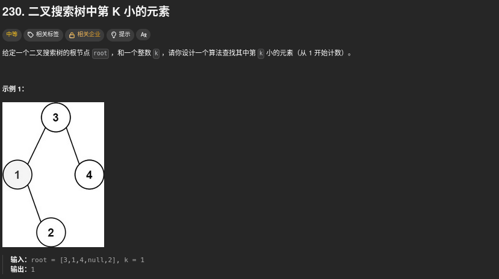
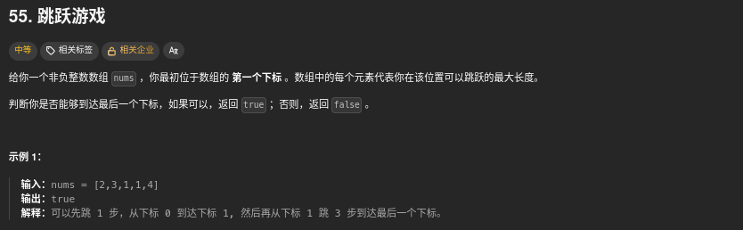
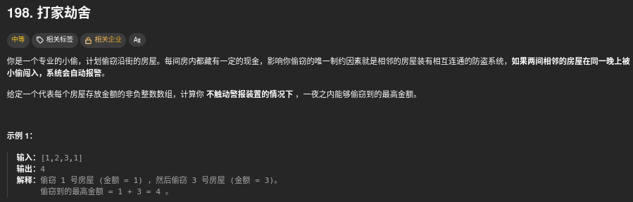

# 第一题 两数之和


当然是暴力最简单，两层循环

这一题主要考验哈希制表，key是数组元素，value是数组下标。

然后每一次都检查一下，是否存在target-nums[i] 值

```cpp
class Solution {
public:
    vector<int> twoSum(vector<int>& nums, int target) {
        unordered_map<int,int> hashtable;
        for(int i=0;i<nums.size();i++){
            auto it = .find(target-nums[i]);
            if(it != hashtable.end()){
                return {it->second,i};
            }
            hashtable[nums[i]] = i;
        }
        return {};
    }
};
```

# 第二题 字母异位词分组


还是哈希制表，主要是处理key，有好多方法，比如：对strs里面的 item 进行排序，作为key。或者对对strs里面的 item 统计 字符的个数，反正只要是唯一的就好

```cpp
class Solution {
public:
    vector<vector<string>> groupAnagrams(vector<string>& strs) {
        unordered_map<string,vector<string> > mp;
        for(string& str: strs){
            string key = str;
            sort(key.begin(),key.end());
            mp[key].push_back(str);
        }
        vector<vector<string> > ans;
        for(auto it = mp.begin();it != mp.end();it++){
            ans.push_back(it->second);
        }
        return ans;
    }
};
```

# 第三题 最长连续序列


这一题要用O(n)的复杂度来做

首先使用set来去重

后面就遍历的时候要找到序列之中的第一个数据，也就是找一找 set nums中index nums[index]-1 在不在 set 中，在的话表示不是序列的第一个数据

如果不在表示是第一个数据，后面就检查一下nums[index]+1在不在，nums[index]+2在不在...

比如：[100,4,200,1,3,2]

a.遍历到100,100-1不在，表示是序列里面的第一个数据，然后100+1不在，长度是1

b.4 4-1在，表示不是序列里面的第一个数据，跳过

c.200， 200-1 不在，表示是序列里面的第一个数据，然后200+1不在，长度是1

d.1 1-1不在，表示是序列里面的第一个数据，然后1+1在，1+2在，1+3在，长度为4

e. ......

```cpp
class Solution {
public:
    int longestConsecutive(vector<int>& nums) {
        unordered_set<int> num_set;
        for(const int& num: nums){
            num_set.insert(num);
        }

        int longestStreak = 0;

        for(const int& num: nums){
            if(!num_set.count(num-1)){
                int currentNum = num;
                int currentStreak = 1;

                while(num_set.count(currentNum+1)){
                    currentNum++;
                    currentStreak++;
                }
                
                longestStreak = max(currentStreak,longestStreak);
            }
        }

        return longestStreak;
    }
};
```

# 第四题 移动零


这一题相对而言简单一些，双指针，一个记录0的位置，一个记录非0的位置，看一下代码就好

```cpp
class Solution {
public:
    void moveZeroes(vector<int>& nums) {
        int left=0,right=0;
        while(right<nums.size()){
            if(nums[right]){
                swap(nums[left], nums[right]);
                left++;
            }
            right++;
        }
    }
};
```


# 第五题 盛最多水的容器


双指针，left 从 左侧 开始， right 从 右侧 开始。 计算每一个 容量 大小 保存一下

```cpp
class Solution {
public:
    int maxArea(vector<int>& height) {
        int left=0,right=height.size()-1;
        int ans = 0;
        while(left < right){
            int res = min(height[left],height[right]) * (right - left);
            ans = max(ans,res);
            if(height[left] < height[right]){
                left++;
            }else{
                right--;
            }
        }
        return ans;
    }
};
```

# 第六题 三数之和


也可以说是三指针，先排序，固定一个first，然后second = first + 1， third  = nums.size() - 1; 然后查询 nums[second] + nums[third] 与  -nums[first]的关系
需要注意的是，去重的操作。

```cpp
class Solution {
public:
    vector<vector<int>> threeSum(vector<int>& nums) {
        int n = nums.size();
        sort(nums.begin(),nums.end());
        vector<vector<int> > ans;
        //也是双指针,也可以说是三指针，a b c, 只需要让 nums[b] + nums[c] = - nums[a] 就可以了，nums是已经排序好的
        for(int first = 0;first < n;first++){
            // 去掉那些重复的
            if(first > 0 && nums[first] == nums[first-1]){
                continue;
            }
            int third = n - 1; //最右侧
            int target = -nums[first];
            for(int second = first+1;second < n;second++){
                //去重
                if(second > first+1 && nums[second] == nums[second-1]){
                    continue;
                }
                while(second < third && nums[second] + nums[third] > target){
                    third--;
                }
                // 没找到，不满足条件
                if(second == third){
                    break;
                }
                if(nums[second] + nums[third] == target){
                    ans.push_back({nums[first],nums[second],nums[third]});
                }
            }
        }

        return ans;
    }
};
```

# 第七题 接雨水


首先需要了解一点，对于下标 i，下雨后水能到达的最大高度等于下标 i 两边的最大高度的最小值，下标 i 处能接的雨水量等于下标 i 处的水能到达的最大高度减去 height[i]。

因此，只需要知道左边和右边的最大高度即可


当 1≤i≤n−1 时，leftMax[i]=max(leftMax[i−1],height[i])

当 0≤i≤n−2 时，rightMax[i]=max(rightMax[i+1],height[i])

最终结果：ans += min(leftMax[i], rightMax[i]) - height[i];

```cpp
class Solution {
public:
    int trap(vector<int>& height) {
        int n = height.size();
        vector<int> leftMax(n);  
        leftMax[0] = height[0];
        vector<int> rightMax(n); 
        rightMax[n-1] = height[n-1];
        for(int i=1;i<n;i++){
            leftMax[i] = max(leftMax[i-1],height[i]);
        }
        for(int i=n-2;i>-1;i--){
            rightMax[i] = max(rightMax[i+1],height[i]);
        }
        int ans = 0;
        for(int i=0;i<n;i++){
            ans += min(leftMax[i],rightMax[i]) - height[i];
        }
        return ans;
    }
};
```

# 第八题 无重复字符的最长子串


滑动窗口。以 abcabcbb 为例

- 以 (a)bcabcbb 开始的最长字符串为 (abc)abcbb；
- 以 a(b)cabcbb 开始的最长字符串为 a(bca)bcbb；
- 以 ab(c)abcbb 开始的最长字符串为 ab(cab)cbb；
- 以 abc(a)bcbb 开始的最长字符串为 abc(abc)bb；
- 以 abca(b)cbb 开始的最长字符串为 abca(bc)bb；
- 以 abcab(c)bb 开始的最长字符串为 abcab(cb)b；
- 以 abcabc(b)b 开始的最长字符串为 abcabc(b)b；
- 以 abcabcb(b) 开始的最长字符串为 abcabcb(b)。

```cpp
class Solution {
public:
    int lengthOfLongestSubstring(string s) {
        unordered_set<char> occ;
        int ans = 0, left = 0,right = 0,temp = 0;
        while(right < s.length()){
            if(occ.count(s[right])!=0){
                occ.erase(s[left]);
                left++;
                temp--;
            }else{
                occ.insert(s[right]);
                right++;
                temp++;
            }
            ans = max(ans,temp);
        }
        return ans;
    }
};
```

# 第九题 找到字符串中所有字母异位词


滑动窗口，主要是比较两个字符串是否是一样的

可以排序，也可以使用字母count来表示

```cpp
class Solution {
public:
    vector<int> findAnagrams(string s, string p) {
        int sLen = s.size(),pLen = p.size();

        if(sLen < pLen){
            return vector<int>();
        }

        vector<int> ans;
        vector<int> sCount(26);
        vector<int> pCount(26);

        for(int i=0;i<pLen;i++){
            sCount[s[i]-'a']++;
            pCount[p[i]-'a']++;
        }
        if(sCount == pCount){
            ans.push_back(0);
        }

        for(int i=0;i<s第九题 找到字符串中所有字母异位词Len-pLen;i++){
            --sCount[s[i]-'a'];
            ++sCount[s[i+pLen]-'a'];
            if(sCount == pCount){
                ans.push_back(i+1);
            }
        }

        return ans;
    }
};
```

# 第十题 和为 K 的子数组


1.首先想法肯定是暴力 两层循环

好吧，超时了

```cpp
class Solution {
public:
    int subarraySum(vector<int>& nums, int k) {
        int count = 0;
        for(int i=0;i<nums.size();i++){
            int sum = 0;
            for(int j=i;j<nums.size();j++){
                sum+=nums[j];
                if(sum == k){
                    count++;
                }
            }
        }
        return count;
    }
};
```


2.前缀和 + 哈希制表

pre[i]记录 前i个和； 则 pre[i] - pre[j-1] = k 则表示 j...i 这个子区间之内的和为k。

因此pre[j-1] = pre[i] - k 则满足条件。

因此值表，key为前缀和 value为出现次数

```cpp
class Solution {
public:
    int subarraySum(vector<int>& nums, int k) {
        unordered_map<int, int> mp;
        mp[0] = 1;
        int count = 0, pre = 0;
        for(int i=0;i<nums.size();i++){
            pre += nums[i];
            if(mp.find(pre-k) != mp.end()){
                count += mp[pre-k];
            }
            mp[pre]++;
        }
        return count;
    }
};
```

# 第十一题 滑动窗口最大值


第一想法：暴力！！！

果然，超时

官方题解 ：优先队列

优先队列：priority_queue 会将最大的数据放在对顶

priority_queue<pair<int,int>> q; 值表，first 为 num[i] second 为 i

每次循环的时候查询一下 q.top().second. 看一看是不是 小于 i - k 小于的话就代表在滑动窗口之外

```cpp
class Solution {
public:
    vector<int> maxSlidingWindow(vector<int>& nums, int k) {
        int n=nums.size();
        priority_queue<pair<int,int>> q;
        for(int i=0;i<k;i++){
            q.emplace(nums[i],i);
        }
        vector<int> ans = {q.top().first};
        for(int i=k;i<n;i++){
            q.emplace(nums[i],i);
            while(q.top().second <= i-k){
                q.pop();
            }
            ans.push_back(q.top().first);
        }
        return ans;
    }
};
```

# 第十二题 最小覆盖子串


直接看官方题解：


这其中会出现一些问题

1.如何存储字符串？

2.如何比较两个字符串的包含关系？

其实两个算一个问题之前我们在做 第九题 找到字符串中所有字母异位词 的时候 提到过，这种类字母异位词有两种存储 排序和count值表 但是这里不适用。

这里使用了unordered_map，key为字符char value为包含的数量 int

那么包含关系就好处理了，check的时候只要确定目标map里面的字符的数量不得大于当前窗口里面的量就好。

```cpp
class Solution {
public:
    //ori 存储t里面的值，cnt存储窗口里面的值
    unordered_map<char,int> ori,cnt;
    //cnt之中的c的count要大于 ori 之中对应的值，否则就不包含
    bool check(){
        for(const auto &p:ori){
            if(cnt[p.first] < p.second){
                return false;
            }
        }
        return true;
    }

    string minWindow(string s, string t) {
        // 初始化ori
        for(const auto &c:t){
            ori[c]++;
        }

        int left = 0,right = -1;
        int len = INT_MAX, ansL = -1;
        while(right < int(s.size())){
            // 只要看ori之中有的字符就好，其他的没必要看
            if(ori.find(s[++right])!=ori.end()){
                ++cnt[s[right]];
            }

            while(check() && left<=right){
                //更新长度
                if(right - left + 1 < len){
                    len = right - left + 1;
                    ansL = left;
                }
                if(ori.find(s[left]) != ori.end()){
                    --cnt[s[left]];
                }
                ++left;
            }
        }

        return ansL == -1 ? string() : s.substr(ansL, len);
    }
};
```

# 第十三题 最大子数组和


子数组和，第一印象应该是前缀和，那么，记录一下最小的和最大的前缀和两者相减就可以得到结果

```cpp
class Solution {
public:
    int maxSubArray(vector<int>& nums) {
        int max1=-99999,pre=0;
        int min1=0;
        for(int i=0;i<nums.size();i++){
            pre+=nums[i];
            max1=max(max1,pre-min1);
            min1=min(min1,pre);
        }
        return max1;
    }
};
```

另外一个解法是动态规划

dp[i]=max{nums[i],dp[i−1]+nums[i]}


```cpp
class Solution {
public:
    int maxSubArray(vector<int>& nums) {
        int res = nums[0];
        for(int i=1;i<nums.size();i++){
            if(nums[i-1]>0){
                nums[i] += nums[i-1];
            }
            if(nums[i]>res){
                res = nums[i];        
            }
        }
        return res;
    }
};
```

# 第十四题 合并区间


这一题研一的时候好像讲过

先对数组按照left进行排序，那么可以合并的就连续了


后面查看一下合并的条件

a[i].end<a[j].start (a[i] 和 a[j] 不能合并)

a[j].end<a[k].start (a[j] 和 a[k] 不能合并)

a[i].end≥a[k].start(a[i] 和 a[k] 可以合并)

因此：

```cpp
class Solution {
public:
    vector<vector<int>> merge(vector<vector<int>>& intervals) {
        if(intervals.size()==0){
            return {};
        }
        sort(intervals.begin(),intervals.end());
        vector<vector<int>> resultList;
        for(int i=0;i<intervals.size();i++){
            int L = intervals[i][0],R = intervals[i][1];
            // 不能合并直接push进去
            if(!resultList.size()||resultList.back()[1]<L){
                resultList.push_back({L,R});
            }else{
                resultList.back()[1] = max(resultList.back()[1],R);
            }

        }
        return resultList;
    }
};
```

# 第十五题 轮转数组


解法一很简单，就是申请一个额外的数组

```cpp
class Solution {
public:
    void rotate(vector<int>& nums, int k) {
        int Lnums = nums.size();
        k = k % Lnums;
        vector<int> tempList(nums.begin(),nums.end());
        for(int i=0;i<Lnums;i++){
            nums[(i+k)%Lnums] = tempList[i];
        }
    }
};
```

解法二很巧妙

原始数组        1 2 3 4 5 6 7

翻转所有元素	 7 6 5 4 3 2 1
  
翻转 [0,kmodn−1] 区间的元素	 5 6 7 4 3 2 1

翻转 [kmodn,n−1] 区间的元素	 5 6 7 1 2 3 4

```cpp
class Solution {
public:
    void reverse(vector<int>& nums, int start, int end) {
        while (start < end) {
            swap(nums[start], nums[end]);
            start += 1;
            end -= 1;
        }
    }

    void rotate(vector<int>& nums, int k) {
        k %= nums.size();
        reverse(nums, 0, nums.size() - 1);
        reverse(nums, 0, k - 1);
        reverse(nums, k, nums.size() - 1);
    }
};
```

# 第十六题 除自身以外数组的乘积


第一印象肯定是，把所有数都乘一下，然后除以自身。但是因为有0所以不行

那么 对于 index 位置的数据 除自身以外数组的乘积 就是index左侧的乘积 * index右侧的乘积

那么申请两个数组保存一下就好

```cpp
class Solution {
public:
    vector<int> productExceptSelf(vector<int>& nums) {
        vector<int> L(nums.size(),1);
        vector<int> R(nums.size(),1);

        for(int i=1;i<nums.size();i++){
            L[i] = L[i-1] * nums[i-1];
        }

        for(int i=nums.size()-2;i>-1;i--){
            R[i] = R[i+1] * nums[i+1];
        }

        vector<int> answer(nums.size());
        for(int i=0;i<nums.size();i++){
            answer[i] =  L[i] * R[i];
        }

        return answer;
    }
};
```

# 第十七题 缺失的第一个正数


想一下 length为N的数组，缺失的第一个正数的分布。最极端的情况是1 2 3 4 ... N 那么缺失的第一个正数就是N+1，否则但凡有一个非正数，则缺失的第一个正数一定是[1,N]之间

那么后面就好处理了，结果一定是[1,N+1] 因此 两次循环就好。

这样的话就暴力了

看官方解题：

因为结果一定是[1,N+1] 所以可以使用下标存储结果

如何处理：


注意第二步的处理，下标变负数表示该下标的数据出现过，比如 3 对应的下标 2 变成负数了，表示 2 + 1 在数组里面出现过！！！

```cpp
class Solution {
public:
    int firstMissingPositive(vector<int>& nums) {
        int Lnums = nums.size();
        for(int i=0;i<Lnums;i++){
            if(nums[i] <= 0){
                nums[i] = Lnums + 1;
            }
        }

        for(int i=0;i<Lnums;i++){
            int num = abs(nums[i]);
            if(num <= Lnums){
                nums[num-1] =  -abs(nums[num - 1]);
            }
        }

        for(int i=0;i<Lnums;i++){
            if(nums[i] > 0){
                return i+1;
            }
        }

        return Lnums+1;
    }
};
```

# 第十八题 矩阵置零


第一印象，申请两个数组，分别代表行和列，当matrix[i][j] == 0的时候，将对应的行或者列设为true，后面再遍历一遍就好

```cpp
class Solution {
public:
    void setZeroes(vector<vector<int>>& matrix) {
        int m = matrix.size();
        int n = matrix[0].size();
        vector<int> row(m), col(n);
        for (int i = 0; i < m; i++) {
            for (int j = 0; j < n; j++) {
                if (!matrix[i][j]) {
                    row[i] = col[j] = true;
                }
            }
        }
        for (int i = 0; i < m; i++) {
            for (int j = 0; j < n; j++) {
                if (row[i] || col[j]) {
                    matrix[i][j] = 0;
                }
            }
        }
    }
};

```

省空间的解法，就是将直接使用matrix[i][0] 以及 matrix[0][i] 代替原来的行和列数组，不过要单独申请两个参数来记录一下第0行和第0列对应有没有0

```cpp
class Solution {
public:
    void setZeroes(vector<vector<int>>& matrix) {
        int m = matrix.size();
        int n = matrix[0].size();
        bool flag_row = false, flag_col = false;
        for(int i = 0;i<m;i++){
            if(matrix[i][0]==0){
                flag_col = true;
            }
        }

        for(int i = 0;i<n;i++){
            if(matrix[0][i]==0){
                flag_row = true;
            }
        }

        for(int i = 1;i<m;i++){
            for(int j=1;j<n;j++){
                if(matrix[i][j] == 0){
                    matrix[0][j] = matrix[i][0] = 0;
                }
            }
        }

        for(int i = 1;i<m;i++){
            for(int j=1;j<n;j++){
                if(matrix[0][j] == 0||matrix[i][0] == 0){
                    matrix[i][j] = 0;
                }
            }
        }

        if(flag_col){
            for(int i=0;i<m;i++){
                matrix[i][0] = 0;
            }
        }
        
        if(flag_row){
            for(int i=0;i<n;i++){
                matrix[0][i] = 0;
            }
        }


    }
};
```
# 第十九题 螺旋矩阵


最直接的方法就是模拟，模拟 上下左右 的 走 直接看代码把

```cpp
class Solution {
public:
    static constexpr int directions[4][2] = {{0, 1}, {1, 0}, {0, -1}, {-1, 0}};
    vector<int> spiralOrder(vector<vector<int>>& matrix) {
        if(matrix.size() == 0 || matrix[0].size() == 0){
            return {};
        }
        int rows = matrix.size();
        int columns = matrix[0].size();
        int total = rows * columns;
        vector<vector<bool>> visited(rows,vector<bool>(columns));
        
        int row = 0, column = 0;
        int directionIndex = 0;
        vector<int> order(total);

        for(int i = 0;i<total;i++){
            order[i] = matrix[row][column];
            visited[row][column] = true;
            int nextRow = row + directions[directionIndex][0], nextColumn = column + directions[directionIndex][1];
            if(nextRow < 0 || nextRow >= rows || nextColumn < 0 || nextColumn >= columns ||  visited[nextRow][nextColumn]){
                directionIndex = (directionIndex + 1) % 4;
            }
            row += directions[directionIndex][0];
            column += directions[directionIndex][1];
        }
        return order;
    }
};
```

# 第二十题 旋转图像


最简单的，申请一个额外的二维数组，然后对比旋转前后位置的关系

matrix_new[j][n - i - 1] = matrix[i][j]; 

直接两层for循环就好

如果要原地，则使用翻转代替旋转


```cpp
class Solution {
public:
    void rotate(vector<vector<int>>& matrix) {
        int n = matrix.size();
        for(int i=0;i<n/2;i++){
            for(int j=0;j<n;j++){
                swap(matrix[i][j],matrix[n-i-1][j]);
            }
        }

        for(int i=0;i<n;i++){
            for(int j=0;j<i;j++){
                swap(matrix[i][j],matrix[j][i]);
            }
        }
    }
};

```

# 第二十一题 搜索二维矩阵 II


注意看每一行每一列的数据特点

最简单的，直接两层循环 得到结果

其次，没一行使用二分查找，遍历所有行

要想充分利用每一行每一列的数据特点，则从右上角出发，如果大于这个数据，则往下查找，反之，小于的话则往左查找。

```cpp
class Solution {
public:
    bool searchMatrix(vector<vector<int>>& matrix, int target) {
        int m = matrix.size(),n = matrix[0].size();
        int x = 0, y = n - 1;
        while(x < m && y >= 0){
            if(matrix[x][y] == target){
                return true;
            }
            if(matrix[x][y] > target){
                --y;
            }else{
                ++x;
            }
        }
        return false;
    }
};
```

# 第二十二题 相交链表


好怀念的题目，大三的时候第一次刷题就是这一题

```cpp
class Solution {
public:
    ListNode *getIntersectionNode(ListNode *headA, ListNode *headB) {
        if(headA == NULL || headB == NULL){
            return NULL;
        }
        ListNode * pA = headA;
        ListNode * pB = headB;
        while(pA!=pB){
            pA = pA == nullptr ? headB : pA->next;
            pB = pB == nullptr ? headA : pB->next;
        }
        return pA;
    }
};
```

# 第二十三题 反转链表


第一想法：暴力

一次遍历就好：最关键的是存储两个节点，对于相邻两个节点，只需要将他们两个的指针反过来就好！（我是SB，我老是想着暴力）

```cpp
class Solution {
public:
    ListNode* reverseList(ListNode* head) {
        if(!head){
            return nullptr;
        }
        ListNode* cur = head;
        ListNode* pre = nullptr;
        ListNode* tem = cur;
        while(cur){
            tem = cur->next;
            cur->next = pre;
            pre = cur;
            cur = tem;
        }
        return pre;

    }
};
```
# 第二十四题 回文链表


最为简单的，使用一个vector来存储一下链表里面的数据，然后直接双指针前后处理即可

```cpp
class Solution {
public:
    bool isPalindrome(ListNode* head) {
        vector<int> vals;
        while(head!=nullptr){
            vals.emplace_back(head->val);
            head = head->next;
        }
        for(int i=0,j=vals.size()-1;i<vals.size()&&j>=0;i++,j--){
            if(vals[i] != vals[j]){
                return false;
            }
        }
        return true;
    }
};
```

# 第二十五题 环形链表


快慢指针，快指针一次跑两步，慢指针一次跑一步，如果有环的话一定可以相遇

```cpp
class Solution {
public:
    bool hasCycle(ListNode *head) {
        if(head == NULL || head->next == NULL){
            return false;
        }
        ListNode* slow = head;
        ListNode* fast = head->next;
        while(slow != fast){
            if(fast == NULL || fast->next == NULL){
                return false;
            }
            slow = slow->next;
            fast = fast->next->next;
        }
        return true;
    }
};
```

# 第二十六题 环形链表 II


好吧，我先背会再说。

```cpp
class Solution {
public:
    ListNode *detectCycle(ListNode *head) {
        ListNode * slow = head;
        ListNode * fast = head;
        while(true){
            if(fast == NULL || fast->next == NULL){
                return NULL;
            }
            fast = fast->next->next;
            slow = slow->next;
            if(fast == slow){
                break;
            }
        }
        fast = head;
        while(slow != fast){
            slow = slow->next;
            fast = fast->next;
        }
        return fast;

    }
};
```

# 第二十七题 合并两个有序链表


注意的是这一题的要求是原地合并，不是再重新申请一个list

超内存～～～～
```cpp
class Solution {
public:
    ListNode* mergeTwoLists(ListNode* list1, ListNode* list2) {
        if(list1 == nullptr && list2 == nullptr){
            return nullptr;
        }
        ListNode* res = new ListNode();
        ListNode* tmp1 = res;
        while(!(list1 == nullptr || list2 == nullptr)){
            ListNode* tmp2 = new ListNode();
            if(list1->val <= list2->val){
                tmp2->val = list1->val;
                list1 = list1->next;
            }else{
                tmp2->val = list2->val;
                list2 = list2->next;
            }
            tmp1->next = tmp2;
            tmp1 = tmp2;
        }
        if(list1 == nullptr){
            while(list2 != nullptr){
                ListNode* tmp2 = new ListNode();
                tmp2->val = list2->val;
                tmp1->next = tmp2;
                tmp1 = tmp2;
            }
        }
        if(list2 == nullptr){
            while(list1 != nullptr){
                ListNode* tmp2 = new ListNode();
                tmp2->val = list1->val;
                tmp1->next = tmp2;
                tmp1 = tmp2;
            }
        }
        return res->next;
    }
};
```

递归：很牛的递归

```cpp
class Solution {
public:
    ListNode* mergeTwoLists(ListNode* list1, ListNode* list2) {
        if(list1 == nullptr){
            return list2;
        }else if(list2 == nullptr){
            return list1;
        }

        if(list1->val < list2->val){
            list1->next = mergeTwoLists(list1->next,list2);
            return list1;
        }else{
            list2->next = mergeTwoLists(list1,list2->next);
            return list2;
        }
    }
};
```

迭代：

```cpp
class Solution {
public:
    ListNode* mergeTwoLists(ListNode* list1, ListNode* list2) {
        ListNode * preHead = new ListNode(-1);
        ListNode * pre = preHead;
        while(list1!=nullptr&&list2!=nullptr){
            if(list1->val < list2->val){
                pre->next = list1;
                list1 = list1->next;
            }else{
                pre->next = list2;
                list2 = list2->next;
            }
            pre = pre->next;
        }

        pre->next = (list1==nullptr)?list2:list1;

        return preHead->next;
    }
};
```

# 第二十八题 两数相加


模拟一下，要注意的是要记得进位

```cpp
class Solution {
public:
    ListNode* addTwoNumbers(ListNode* l1, ListNode* l2) {
        ListNode* head = nullptr, *tail = nullptr;
        int carry = 0;
        while(l1||l2){
            int n1 = l1?l1->val:0;
            int n2 = l2?l2->val:0;
            int sum = n1 + n2 + carry;
            if(!head){
                head = tail = new ListNode(sum % 10);
            }else{
                tail->next = new ListNode(sum % 10);
                tail = tail->next;
            }

            carry = sum / 10;
            if(l1){
                l1 = l1->next;
            }

            if(l2){
                l2 = l2->next;
            }
        }

        if(carry > 0){
            tail->next = new ListNode(carry);
        }

        return head;
    }
};
```

# 第二十九题 删除链表的倒数第 N 个结点


双指针，一个就先跑N个节点，。然后两个再一起跑，这样的话就能找到倒数第N个节点的前一个节点了

```cpp
class Solution {
public:
    ListNode* removeNthFromEnd(ListNode* head, int n) {
        ListNode* dummy = new ListNode(0, head);
        ListNode* first = head;
        ListNode* second = dummy;
        for (int i = 0; i < n; ++i) {
            first = first->next;
        }
        while (first) {
            first = first->next;
            second = second->next;
        }
        second->next = second->next->next;
        ListNode* ans = dummy->next;
        delete dummy;
        return ans;
    }
};
```

# 第三十题 两两交换链表中的节点


递归永远是最神奇的算法

A B C D 举例 对于 A B A是head B就是反转之后的newhead 那么A 的 next 应该就是 对B的next执行的翻转，执行结束值周B的next应该变成A

看下面的代码就能看懂，很巧妙

```cpp
class Solution {
public:
    ListNode* swapPairs(ListNode* head) {
        if(head == nullptr || head->next == nullptr){
            return head;
        }
        ListNode* newHead = head->next;
        head->next = swapPairs(newHead->next);
        newHead->next = head;

        return newHead;
    }
};
```

# 第三十一题 K 个一组翻转链表


一样的，还可以用递归,和前面的一样的思路，先找一下K个数据的结尾tail，那么tail->next 应该就是 reverseKGroup(tail->next, k); 对tail->next后面链表的处理。注意这个时候head----tail之间还没翻转

当ail->next = reverseKGroup(tail->next, k);返回的时候，表示tail->next后面的链表已经处理完了，这个时候再对head----tail进行翻转

A B C D EEE  

模拟一下就明白了 假设k = 4，那么head = A tail = D 后面处理好的是EEE

A->B->C->D->EEE 

ListNode *p=head->next;（p = B） head->next=tail->next;  tail->next=head; 这两行就变成了 B->C->D->A->EEE  这样就好理解了

```cpp
class Solution {
public:
    ListNode* reverseKGroup(ListNode* head, int k) {
        if (!head || k == 1) return head;
        ListNode *tail = head;
        for (int i = 1; i < k; i++) {
            tail = tail->next;
            if (!tail) return head;
        }

        tail->next = reverseKGroup(tail->next, k);

        // 翻转【head-----tail】
        while(head!=tail){
            ListNode *p=head->next;
            head->next=tail->next;
            tail->next=head;
            head=p;
        }
        return head;
    }
};
```

# 第三十二题 随机链表的复制


不能直接返回head我很失望 流泪

一般这种题目主要是模拟！！！只要模拟好了就好处理了

直接看官方题解


```cpp
class Solution {
public:
    Node* copyRandomList(Node* head) {
        if(head == nullptr){
            return nullptr;
        }
        for(Node* node = head;node !=nullptr;node = node->next->next){
            Node* nodeNew = new Node(node->val);
            nodeNew->next = node->next;
            node->next = nodeNew;
        }
        for (Node* node = head; node != nullptr; node = node->next->next) {
            Node* nodeNew = node->next;
            nodeNew->random = (node->random != nullptr)? node->random->next:nullptr;
        }
        Node* headNew = head->next;
        for(Node* node = head; node != nullptr; node=node->next){
            Node* nodeNew = node->next;
            node->next = node->next->next;
            nodeNew->next = (nodeNew->next !=nullptr)?nodeNew->next->next:nullptr;
        }
        return headNew;
    }
};
```

# 第三十三题 排序链表


归并排序的思想，自上而下

运用递归的思想，先把链表分割成两个，然后分别对两个进行排序（递归），然后归并一下

```cpp
class Solution {
public:
    ListNode* sortList(ListNode* head) {
        // 结束的条件
        if(head == nullptr || head->next == nullptr){
            return head;
        }
        // 分割成两个，快慢指针，快指针走两步，满指针走一步就能找到中间节点了
        ListNode * slow = head;
        ListNode * fast = head->next;
        while(fast && fast->next){
            slow = slow->next;
            fast = fast->next->next;
        }
        ListNode* second = slow->next;
        // 分割一下，分割成两个链表
        slow->next = nullptr;
        ListNode* first = head;
        // 左右分别排序
        first = sortList(head);
        second = sortList(second);
        // 归并
        return margeList(first,second);
    }
    // 无需多言
    ListNode* margeList(ListNode* left,ListNode* right) {
        ListNode* dummy = new ListNode(0);
        ListNode* tail = dummy;
        while(left && right){
            if(left->val < right->val){
                tail->next = left;
                left = left->next;
            }else{
                tail->next = right;
                right = right->next;
            }
            tail = tail->next;
        }

        if(left){
            tail->next = left;
        }
        if(right){
            tail->next = right;
        }

        return dummy->next;
    }
};
```

# 第三十四题 合并 K 个升序链表


同样的，分治归并

```cpp
class Solution {
public:
    ListNode* mergeKLists(vector<ListNode*>& lists) {
        return marge(lists,0,lists.size()-1);
    }

    // 无语多言
    ListNode* mergeTwoLists(ListNode *a, ListNode *b) {
        if ((!a) || (!b)) return a ? a : b;
        ListNode head, *tail = &head, *aPtr = a, *bPtr = b;
        while (aPtr && bPtr) {
            if (aPtr->val < bPtr->val) {
                tail->next = aPtr; aPtr = aPtr->next;
            } else {
                tail->next = bPtr; bPtr = bPtr->next;
            }
            tail = tail->next;
        }
        tail->next = (aPtr ? aPtr : bPtr);
        return head.next;
    }

    // 分治的点
    ListNode* marge(vector<ListNode*>& lists, int l,int r){
        if(l == r){
            return lists[l];
        }
        if(l > r){
            return nullptr;
        }
        // 分割成两个
        int mid = (l + r) / 2;
        // 合并两个链表
        return mergeTwoLists(marge(lists,l,mid),marge(lists,mid+1,r));
    }
};
```

# 第三十五题 LRU 缓存


直接模拟，我觉得不大可能会考手撕这种题目

```cpp

struct DLinkedNode {
    int key, value;
    DLinkedNode* prev;
    DLinkedNode* next;
    DLinkedNode(): key(0), value(0), prev(nullptr), next(nullptr) {}
    DLinkedNode(int _key, int _value): key(_key), value(_value), prev(nullptr), next(nullptr) {}
};

class LRUCache {
private:
    unordered_map<int, DLinkedNode*> cache;
    DLinkedNode* head;
    DLinkedNode* tail;
    int size;
    int capacity;

public:
    LRUCache(int _capacity): capacity(_capacity), size(0) {
        // 使用伪头部和伪尾部节点
        head = new DLinkedNode();
        tail = new DLinkedNode();
        head->next = tail;
        tail->prev = head;
    }
    
    int get(int key) {
        if (!cache.count(key)) {
            return -1;
        }
        // 如果 key 存在，先通过哈希表定位，再移到头部
        DLinkedNode* node = cache[key];
        moveToHead(node);
        return node->value;
    }
    
    void put(int key, int value) {
        if (!cache.count(key)) {
            // 如果 key 不存在，创建一个新的节点
            DLinkedNode* node = new DLinkedNode(key, value);
            // 添加进哈希表
            cache[key] = node;
            // 添加至双向链表的头部
            addToHead(node);
            ++size;
            if (size > capacity) {
                // 如果超出容量，删除双向链表的尾部节点
                DLinkedNode* removed = removeTail();
                // 删除哈希表中对应的项
                cache.erase(removed->key);
                // 防止内存泄漏
                delete removed;
                --size;
            }
        }
        else {
            // 如果 key 存在，先通过哈希表定位，再修改 value，并移到头部
            DLinkedNode* node = cache[key];
            node->value = value;
            moveToHead(node);
        }
    }

    void addToHead(DLinkedNode* node) {
        node->prev = head;
        node->next = head->next;
        head->next->prev = node;
        head->next = node;
    }
    
    void removeNode(DLinkedNode* node) {
        node->prev->next = node->next;
        node->next->prev = node->prev;
    }

    void moveToHead(DLinkedNode* node) {
        removeNode(node);
        addToHead(node);
    }

    DLinkedNode* removeTail() {
        DLinkedNode* node = tail->prev;
        removeNode(node);
        return node;
    }
};

```


# 第三十六题 二叉树的中序遍历


中序遍历，基础操作

```cpp
class Solution {
public:
    vector<int> inorderTraversal(TreeNode* root) {
        vector<int> ans;
        inorderTraversalTemp(root,ans);
        return ans;
    }

    void inorderTraversalTemp(TreeNode* root,vector<int>& ans){
        if(root){
            inorderTraversalTemp(root->left,ans);
            ans.push_back(root->val);
            inorderTraversalTemp(root->right,ans);
        }
    }
};
```

非递归：

前序：
```cpp
class Solution {
public:
    vector<int> preorderTraversal(TreeNode* root) {
        vector<int> res; 
        stack<TreeNode*> stk;
        while(root!=nullptr || !stk.empty()){
            while(root != nullptr){
                stk.push(root);
                res.push_back(root->val);
                root = root->left;
            }
            root = stk.top();
            stk.pop();
            root = root->right;
        }
        return res;
    }
};
```

中序：
```cpp
class Solution {
public:
    vector<int> inorderTraversal(TreeNode* root) {
        // 采用迭代写法，需要借助栈结构来实现
        // 前序遍历；出栈顺序：根-左-右；入栈顺序：右-左-根；
        // 中序遍历；出栈顺序：左-根-右；入栈顺序：右-根-左；
        // 后序遍历；出栈顺序：左-右-根；入栈顺序：根-右-左；
        vector<int> res; 
        stack<TreeNode*> stk;
        while(root!=nullptr || !stk.empty()){
            while(root != nullptr){
                stk.push(root);
                root = root->left;
            }
            root = stk.top();
            stk.pop();
            res.push_back(root->val);
            root = root->right;
        }
        return res;
    }
};
```

后序：
```cpp
class Solution {
public:
    vector<int> postorderTraversal(TreeNode* root) {
        vector<int> res; 
        if(root == nullptr){
            return res;
        }
        stack<TreeNode*> stk;
        TreeNode *prev = nullptr;
        while(root!=nullptr || !stk.empty()){
            while(root != nullptr){
                stk.push(root);
                root = root->left;
            }
            root = stk.top();
            stk.pop();
            // 右节点为null或者右节点已经遍历过了
            if(root->right == nullptr || root->right == prev){
                res.push_back(root->val);
                prev = root;
                root = nullptr;
            }else{ //否则就先处理右节点 （左 右 中）
                stk.push(root);
                root = root->right;
            }
        }
        return res;
    }
};
```

# 第三十七题 二叉树的最大深度


递归基础操作
https://leetcode.cn/problems/implement-trie-prefix-tree/description/?envType=study-plan-v2&envId=top-100-liked
    }
};
```

# 第三十八题 翻转二叉树


二叉树递归很好用

```cpp
class Solution {
public:
    TreeNode* invertTree(TreeNode* root) {
        if(root == nullptr){
            return nullptr;
        }
        TreeNode* left = invertTree(root->left);
        TreeNode* right = invertTree(root->right);
        root->left = right;
        root->right = left;
        return root;
    }
};
```

# 第三十九题 对称二叉树


还是递归，要注意判断的条件 left->val == right->val && check(left->left,right->right) && check(left->right,right->left);

```cpp
class Solution {
public:
    bool check(TreeNode* left,TreeNode* right){
        // 都是空的
        if(!left && !right){
            return true;
        }
        // 一个空的另外一个非空
        if(!left || !right){
            return false;
        }

        return left->val == right->val && check(left->left,right->right) && check(left->right,right->left);
    }

    bool isSymmetric(TreeNode* root) {
        return check(root->left,root->right);
    }
};
```

# 第四十题 二叉树的直径


直接按照计算深度的方式来就好  L_depth + R_depth + 1

```cpp
class Solution {
public:
    int ans=1;
    int depth(TreeNode* root){
        if(root == nullptr){
            return 0;
        }
        int L = depth(root->left);
        int R = depth(root->right);
        ans = max(ans,L+R+1);
        return max(L,R) + 1;
    }
    int diameterOfBinaryTree(TreeNode* root) {
        depth(root);
        return ans-1;
    }
};
```

# 第四十一题 二叉树的层序遍历


一遍过，哼～

```cpp
class Solution {
public:
    vector<vector<int>> levelOrder(TreeNode* root) {
        if(root == nullptr){
            return {};
        }
        vector<vector<int>> ans;
        queue<TreeNode*> myqueue;
        myqueue.push(root);
        while(!myqueue.empty()){
            vector<int> temp;
            int levelSize = myqueue.size();
            for(int i=0;i<levelSize;i++){
                TreeNode* frontTmp = myqueue.front();
                myqueue.pop();
                temp.push_back(frontTmp->val);
                if(frontTmp->left){
                    myqueue.push(frontTmp->left);
                }
                if(frontTmp->right){
                    myqueue.push(frontTmp->right);
                }
            }
            ans.push_back(temp);
        }
        return ans;
    }
};
```

# 第四十二题 将有序数组转换为二叉搜索树


递归，伟大无需多言

```cpp
class Solution {
public:
    TreeNode* sortedArrayToBST(vector<int>& nums) {
        return helper(nums,0,nums.size()-1);
    }

    TreeNode* helper(vector<int>& nums,int left,int right){
        if(left > right){
            return nullptr;
        }

        int mid = (left + right) / 2;

        TreeNode * root = new TreeNode(nums[mid]);
        root->left = helper(nums,left,mid-1);
        root->right = helper(nums,mid+1,right);
        return root;
    }
};
```

# 第四十三题 验证二叉搜索树


记得 中序遍历的 二叉搜索树是有序的！！！！ 咱们按照中序遍历的写法来写就好

```cpp
class Solution {
public:
    long pre = LONG_MIN;
    bool helper(TreeNode* root){
        if(root == nullptr){
            return true;
        }
        bool l = helper(root->left);
        if(root->val <= pre){
            return false;
        }
        pre = root->val;
        bool r = helper(root->right);
        return l && r;
    }
    bool isValidBST(TreeNode* root) {
        return helper(root);
    }
};
```


# 第四十四题 二叉搜索树中第 K 小的元素

一样的，中序遍历的 二叉搜索树是有序的 所以按照中序遍历来就好，中序遍历的时候记录一下节点数，当有k个节点的时候就好



```cpp
class Solution {
public:
    int res = 0, k = 0;
    int kthSmallest(TreeNode* root, int k) {
        this->k = k;
        inorder(root);
        return res;
    }
    void inorder(TreeNode* root){
        if(root == nullptr){
            return;
        }
        inorder(root->left);
        if(k == 0){
            return;
        }
        if(--k == 0){
            res = root->val;
        }
        inorder(root->right);
    }

};
```

# 第四十五题 二叉树的右视图


这个直接层次（广度）遍历的每一层的最后一个就好，可以直接使用前面层次遍历的代码

```cpp
class Solution {
public:
    vector<int> rightSideView(TreeNode* root) {
        if(root == nullptr){
            return {};
        }
        vector<int> ans;
        queue<TreeNode*> myqueue;
        myqueue.push(root);
        while(!myqueue.empty()){
            int levelSize = myqueue.size();
            for(int i=0;i<levelSize;i++){
                TreeNode* frontTmp = myqueue.front();
                myqueue.pop();
                if(i == levelSize-1){
                    ans.push_back(frontTmp->val);
                }
                if(frontTmp->left){
                    myqueue.push(frontTmp->left);
                }
                if(frontTmp->right){
                    myqueue.push(frontTmp->right);
                }
            }
        }
        return ans;
    }
};
```

# 第四十六题 二叉树展开为链表


直接前序遍历，存储起来，然后连接就好！！！

非迭代模式将两步合并在一起的代码

```cpp
class Solution {
public:
    void flatten(TreeNode* root) {
        if(root == nullptr){
            return;
        }
        stack<TreeNode*> stk;
        stk.push(root);
        TreeNode *prev = nullptr;
        while(!stk.empty()){
            TreeNode* curr = stk.top();
            stk.pop();
            if(prev!=nullptr){
                prev->left = nullptr;
                prev->right = curr;
            }
            TreeNode* left = curr->left;
            TreeNode* right = curr->right;
            if(right != nullptr){
                stk.push(right);
            }
            if(left != nullptr){
                stk.push(left);
            }
            prev = curr;
        }

    }
};
```

# 第四十七题 从前序与中序遍历序列构造二叉树


例子：前序A = [3,9,20,15,7] 与 中序 B = [9,3,15,20,7]

前序的第一个节点就是根节点。比如这个例子：看前序 第一个根节点是3 。那么从B中我们可以看到 3 左边 是左子树[9] 3 右边是右子树 [15,20,7]

从中我们可以看到 左子树的长度是1,那么处理一下A，我们就可以看到 A 左子树 [9] A 右子树 [20,15,7] 那么结合一下 这两个 就可以递归处理了

左子树[9]就不看了  右子树 前序 [20,15,7]  中序列 [15,20,7] 后面处理方法和前面一样

```cpp
class Solution {
private:
    unordered_map<int,int> index;

public:
    TreeNode* myBuildTree(vector<int>& preorder, vector<int>& inorder, int preorder_left, int preorder_right, int inorder_left, int inorder_right) {
        if(preorder_left > preorder_right){
            return nullptr;
        }
        if(inorder_left > inorder_right){
            return nullptr;
        }
        // 前序遍历中的第一个节点就是根节点
        int preorder_root = preorder_left;
        // 在中序遍历中定位根节点
        int inorder_root = index[preorder[preorder_root]];

        // 先把根节点建立出来
        TreeNode* root = new TreeNode(preorder[preorder_root]);
        // 得到左子树中的节点数目
        int size_left_subtree = inorder_root - inorder_left;
        // 递归地构造左子树，并连接到根节点
        // 先序遍历中「从 左边界+1 开始的 size_left_subtree」个元素就对应了中序遍历中「从 左边界 开始到 根节点定位-1」的元素
        root->left = myBuildTree(preorder,inorder,preorder_left + 1, preorder_left + size_left_subtree,inorder_left, inorder_root - 1);
        // 递归地构造右子树，并连接到根节点
        // 先序遍历中「从 左边界+1+左子树节点数目 开始到 右边界」的元素就对应了中序遍历中「从 根节点定位+1 到 右边界」的元素
        root->right = myBuildTree(preorder,inorder,preorder_left + size_left_subtree + 1,preorder_right, inorder_root + 1, inorder_right);
        return root;
    }
    TreeNode* buildTree(vector<int>& preorder, vector<int>& inorder) {
        int n = preorder.size();
        // 构造哈希映射，帮助我们快速定位根节点
        for(int i=0;i<n;i++){
            index[inorder[i]] = i;
        }

        return myBuildTree(preorder, inorder, 0, n - 1, 0, n - 1);
    }
};
```

# 第四十八题 路径总和 III


注意看题目之中的路径的定义 路径 不需要从根节点开始，也不需要在叶子节点结束，但是路径方向必须是向下的（只能从父节点到子节点）。 也就是说，不存在那个 从左子树 经过 根节点 然后再到右子树的情况

所以就简单了，比如：targetSum  对   A->B->C->D 这个路径 判断 A->val==targetSum 是的话总结果++就好，不是的话往后对于B只需要判断B->val ==targetSum - A->val 就好

所以，递归

```cpp
class Solution {
public:
    int rootSum(TreeNode* root, int targetSum) {
        if(root == nullptr){
            return 0;
        }

        int ret = 0;
        if(root->val == targetSum){
            ret++;
        }
    
        ret += rootSum(root->left,targetSum-root->val);
        ret += rootSum(root->right,targetSum-root->val);

        return ret;
    }

    int pathSum(TreeNode* root, int targetSum) {
        if(root == nullptr){
            return 0;
        }

        int ret = rootSum(root,targetSum);
        ret += pathSum(root->left,targetSum);
        ret += pathSum(root->right,targetSum);

        return ret;
    }

};
```

emmm 官方题解好像过不了，因为减法溢出 把int改成 long 就好

```cpp
class Solution {
public:
    long rootSum(TreeNode* root, long targetSum) {
        if (!root) {
            return 0;
        }

        int ret = 0;
        if (root->val == targetSum) {
            ret++;
        } 

        ret += rootSum(root->left, targetSum - root->val);
        ret += rootSum(root->right, targetSum - root->val);
        return ret;
    }

    long pathSum(TreeNode* root, int targetSum) {
        if (!root) {
            return 0;
        }
        
        long ret = rootSum(root, targetSum);
        ret += pathSum(root->left, targetSum);
        ret += pathSum(root->right, targetSum);
        return ret;
    }
};

```

# 第四十九题 二叉树的最近公共祖先


这个递归就很更好理解了。我们要做的是找到p与q，然后递归回来的时候就相当于回溯的过程，自然可以找到祖先

因此，递归查询p与q在不在，看代码就懂了

```cpp
class Solution {
public:
    TreeNode* lowestCommonAncestor(TreeNode* root, TreeNode* p, TreeNode* q) {
        if(root == NULL || root == p || root == q){
            //只要当前根节点是p和q中的任意一个，就返回（因为不能比这个更深了，再深p和q中的一个就没了）
            return root;
        }
        //根节点不是p和q中的任意一个，那么就继续分别往左子树和右子树找p和q
        TreeNode* left = lowestCommonAncestor(root->left,p,q);
        TreeNode* right = lowestCommonAncestor(root->right,p,q);
        //p和q都没找到，那就没有
        if(left == NULL && right == NULL){
            return NULL;
        }
        //左子树没有p也没有q，就返回右子树的结果
        if(left == NULL){
            return right;
        }
        //右子树没有p也没有q就返回左子树的结果
        if(right == NULL){
            return left;
        }
        //左右子树都找到p和q了，那就说明p和q分别在左右两个子树上，所以此时的最近公共祖先就是root
        return root;
    }
};
```

# 第五十题 二叉树中的最大路径和


注意，这个节点的最大贡献值指的是 路径总和 III 这一题之中的路径相似的该该，而不是这一题的路径的概念

这一题的方法是对于一个节点，求左子树的最大贡献值A 与 右子树的最大贡献值B。然后 A + B + VAL 判断所有的节点，找到最大值，递归处理就好！！

```cpp
class Solution {
private:
    int maxSum = INT_MIN;

public:
    int maxGain(TreeNode* node) {
        if(node == nullptr){
            return 0;
        }
        // 递归计算左右子节点的最大贡献值
        // 只有在最大贡献值大于 0 时，才会选取对应子节点
        int leftGain = max(maxGain(node->left),0);
        int rightGain  = max(maxGain(node->right),0);
        // 节点的最大路径和取决于该节点的值与该节点的左右子节点的最大贡献值
        int priceNewpath = node->val + leftGain + rightGain;
        // 更新答案
        maxSum = max(maxSum,priceNewpath);
        // 返回节点的最大贡献值
        return node->val + max(leftGain,rightGain);
    }
    int maxPathSum(TreeNode* root) {
        maxGain(root);
        return maxSum;
    }
};
```

# 第五十一题 岛屿数量


图的遍历！！！

广度优先遍历 与 深度优先遍历

DFS

```cpp
class Solution {
public:
    void dfs(vector<vector<char>>& grid,int r,int c){
        int nr = grid.size();
        int nc = grid[0].size();

        grid[r][c] = '0';

        if(r-1>=0 && grid[r-1][c] == '1'){
            dfs(grid,r-1,c);
        }

        if(r+1<nr && grid[r+1][c] == '1'){
            dfs(grid,r+1,c);
        }

        if(c-1>=0 && grid[r][c-1] == '1'){
            dfs(grid,r,c-1);
        }

        if(c+1<nc && grid[r][c+1] == '1'){
            dfs(grid,r,c+1);
        }
    }
    int numIslands(vector<vector<char>>& grid) {
        int nr = grid.size();
        if(!nr){
            return 0;
        }
        int nc = grid[0].size();

        int ans = 0;

        for(int r=0;r<nr;r++){
            for(int c = 0;c < nc;c++){
                if(grid[r][c] == '1'){
                    ans++;
                    dfs(grid,r,c);
                }
            }
        }

        return ans;
    }
};
```

BFS

```cpp
class Solution {
public:
    int numIslands(vector<vector<char>>& grid) {
        int nr = grid.size();
        if(!nr){
            return 0;
        }
        int nc = grid[0].size();

        int ans = 0;

        for(int r=0; r< nr;r++){
            for(int c = 0;c < nc;c++){
                if(grid[r][c] == '1'){
                    ans++;
                    grid[r][c] = '0';
                    queue<pair<int,int>> neighbors;
                    neighbors.push({r,c});
                    while(!neighbors.empty()){
                        auto rc = neighbors.front();
                        neighbors.pop();
                        int row = rc.first;
                        int col = rc.second;
                        if(row-1>=0 && grid[row-1][col] == '1'){
                            neighbors.push({row-1,col});
                            grid[row-1][col] = '0';
                        }
                        if(row+1<nr && grid[row+1][col] == '1'){
                            neighbors.push({row+1,col});
                            grid[row+1][col] = '0';
                        }
                        if(col-1>=0 && grid[row][col-1] == '1'){
                            neighbors.push({row,col-1});   
                            grid[row][col-1] = '0';
                        }
                        if(col+1<nc && grid[row][col+1] == '1'){
                            neighbors.push({row,col+1});
                            grid[row][col+1] = '0';
                        }

                    }
                }
            }
        }

        return ans;
    }
};
```

# 第五十二题 腐烂的橘子


以腐烂橘子为起点，开始广度优先遍历，一看题目就知道

```cpp
class Solution {
public:
    int ans = 0;    // 记录当前剩余的新鲜橘子数量
    int time = 0;   // 记录已经过的分钟数
    int n,m;        // 网格的行数和列数
    typedef pair<int, int> PII;
    // 四个方向偏移：右、左、上、下
    int dx[4] = {0,0,-1,1};
    int dy[4] = {1,-1,0,0};

    // 判断 (i, j) 是否在网格内部
    bool isArea(int i,int j){
        return 0<=i&&i<n&&0<=j&&j<m;
    }

    int orangesRotting(vector<vector<int>>& grid) {
        queue<PII> q;
        n = grid.size();
        m = grid[0].size();

        // 第一次遍历：统计所有新鲜橘子，并将所有坏橘子入队
        for(int i=0;i<n;i++){
            for(int j=0;j<m;j++){
                int t = grid[i][j];
                // 新鲜句子
                if(t == 1){
                    ans++;
                }
                // 坏橘子
                if(t == 2){
                    q.push({i,j});
                }
            }
        }
        // 如果没有新鲜橘子，直接返回 0 分钟
        if(ans == 0){
            return 0;
        }

        // 广度优先搜索：每一轮处理当前所有的坏橘子，腐烂其四周新鲜橘子
        while(!q.empty()){
            // 如果新鲜橘子已全部腐烂，返回已用时间
            if (ans == 0) return time;

            int sz = q.size(); // 当前轮要处理的队列大小

            while(sz--){
                auto [x,y] = q.front();
                q.pop();
                // 遍历四个方向
                for(int k = 0;k < 4;k++){
                    int nx = x + dx[k];
                    int ny = y + dy[k];
                    // 如果在网格内且是新鲜橘子，则腐烂它
                    if(isArea(nx,ny) && grid[nx][ny] == 1){
                        grid[nx][ny] = 2; // 标记为坏橘子
                        ans--;            // 新鲜橘子数量减一
                        q.push({nx,ny});  // 新腐烂橘子加入队列
                    }
                }
            }
            // 一轮腐烂完毕，分钟数加一
            time++;
        }
        // 如果所有轮次结束后仍有新鲜橘子，返回 -1
        return ans?-1:time;
    }
};
```

# 第五十三题 课程表


拓扑排序，基本功

```cpp
class Solution {
private:
    vector<vector<int>> edges;
    vector<int> indeg;

public:
    bool canFinish(int numCourses, vector<vector<int>>& prerequisites) {
        edges.resize(numCourses);
        indeg.resize(numCourses);

        for(const auto& info: prerequisites){
            edges[info[1]].push_back(info[0]);
            ++indeg[info[0]];
        }

        queue<int> q;

        for(int i=0;i<numCourses;i++){
            if(indeg[i]==0){
                q.push(i);
            }
        }

        int visited = 0;

        while(!q.empty()){
            ++visited;
            int u = q.front();
            q.pop();
            // 学习u之后后续的v就都能学了
            for(int v:edges[u]){
                --indeg[v];
                if(indeg[v] == 0){
                    q.push(v);
                }
            }
        }

        return visited == numCourses;
    }
};
```

# 第五十四题 实现 Trie (前缀树)


模拟，要注意的是isEnd,否则的话可能不太能区分search与startsWith

```cpp
class Trie {
private:
    vector<Trie*> children;
    bool isEnd;

    Trie* searchPrefix(string prefix){
        Trie* node = this;
        for(char ch:prefix){
            ch -= 'a';
            if(node->children[ch] == nullptr){
                return nullptr;
            }
            node = node->children[ch];
        }
        return node;
    }

public:
    Trie():children(26),isEnd(false)  {}
    
    void insert(string word) {
        Trie* node = this;
        for(char ch:word){
            ch -= 'a';
            if(node->children[ch] == nullptr){
                node->children[ch] = new Trie();
            }
            node = node->children[ch];
        }
        node->isEnd = true;
    }
    
    bool search(string word) {
        Trie* node = this->searchPrefix(word);
        return node!=nullptr && node->isEnd;
    }

    
    bool startsWith(string prefix) {
        return this->searchPrefix(prefix) != nullptr;
    }
};
```

# 第五十五题 全排列

回溯三部曲：代码随想录 后面的回溯都是可以使用这个步骤来的


回溯，一般不好理解，但是如果画出来树图的话就好理解一些


```cpp
class Solution {
public:
    vector<vector<int>> permute(vector<int>& nums) {
        vector<vector<int> > res;
        backtrack(res, nums, 0, (int)nums.size());
        return res;
    }

    void backtrack(vector<vector<int>>& res, vector<int>& nums,int first,int len){
        if(first == len){
            res.push_back(nums);
            return;
        }

        for(int i=first;i<len;i++){
            swap(nums[i], nums[first]);
            backtrack(res, nums, first + 1, len);
            swap(nums[i], nums[first]);
        }
    }
};
```

# 第五十六题 子集


这个回溯就很巧妙了

```cpp
class Solution {
public:
    vector<int> t;
    vector<vector<int>> ans;

    void dfs(int cur,vector<int> & nums){
        if(cur == nums.size()){
            // 记录答案
            ans.push_back(t);
            return;
        }
        // 考虑选择当前位置
        t.push_back(nums[cur]);
        dfs(cur+1,nums);
        t.pop_back();
        // 考虑不选择当前位置
        dfs(cur+1,nums);
    }

    vector<vector<int>> subsets(vector<int>& nums) {
        dfs(0,nums);
        return ans;
    }
};
```

# 第五十七题 电话号码的字母组合


还是最为基础的回溯

```cpp
class Solution {
public:
    vector<string> letterCombinations(string digits) {
        vector<string> combinations;
        if(digits.empty()){
            return combinations;
        }
        unordered_map<char,string> phoneMap{
            {'2', "abc"},
            {'3', "def"},
            {'4', "ghi"},
            {'5', "jkl"},
            {'6', "mno"},
            {'7', "pqrs"},
            {'8', "tuv"},
            {'9', "wxyz"}
        };
        string combination;
        backtrack(combinations, phoneMap, digits, 0, combination);
        return combinations;
    }
    void backtrack(vector<string>& combinations, const unordered_map<char,string>& phoneMap, const string& digits,int index,string & combination){
        if(index == digits.length()){
            combinations.push_back(combination);
        }else{
            char digit = digits[index];
            const string& letters = phoneMap.at(digit);
            for(const char& letter:letters){
                combination.push_back(letter);
                backtrack(combinations,phoneMap,digits,index+1,combination);
                combination.pop_back();
            }
        }
    }
};
```

# 第五十八题 组合总和


这个要注意， 同一个 数字可以 无限制重复被选取 因此回溯的时候 backtrack(resultVector,path,candidates,target,i); 使用的是 i

```cpp
class Solution {
public:
    vector<vector<int>> combinationSum(vector<int>& candidates, int target) {
        vector<vector<int>> resultVector;
        vector<int> path;
        backtrack(resultVector,path,candidates,target,0);
        return resultVector;
    }

    void backtrack(vector<vector<int>>& resultVector,vector<int>& path,vector<int>& candidates, int target,int index){
        if(accumulate(path.begin(), path.end(), 0) == target){
            resultVector.push_back(path);
            return;
        }else if(accumulate(path.begin(), path.end(), 0) > target){
            return;
        }else{
            for(int i=index;i<candidates.size();i++){
                path.push_back(candidates[i]);
                backtrack(resultVector,path,candidates,target,i);
                path.pop_back();
            }
        }
    }
};
```

# 第五十九题 括号生成


这一题和排列组合差不多,但是有括号的约束 先push ( 再 push )

```cpp
class Solution {
public:
    void backtrack(vector<string> &ans, string& cur,int open,int close,int n){
        if(cur.size() == n*2){
            ans.push_back(cur);
            return;
        }
        if(open < n){
            cur.push_back('(');
            backtrack(ans,cur,open+1,close,n);
            cur.pop_back();
        }
        if(close < open){
            cur.push_back(')');
            backtrack(ans,cur,open,close+1,n);
            cur.pop_back();
        }
    }
    vector<string> generateParenthesis(int n) {
        vector<string> result;
        string current;
        backtrack(result,current,0,0,n);
        return result;
    }
};
```

# 第六十题 单词搜索


这个可以使用深度优先遍历BFS，区别再于递归回来要进行回溯。

```cpp
class Solution {
public:
    bool check(vector<vector<char>>& board, vector<vector<int>>& visited, int i, int j, string& s, int k) {
        if (board[i][j] != s[k]) {
            return false;
        } else if (k == s.length() - 1) {
            return true;
        }
        visited[i][j] = true;
        vector<pair<int, int>> directions{{0, 1}, {0, -1}, {1, 0}, {-1, 0}};
        bool result = false;
        for (const auto& dir: directions) {
            int newi = i + dir.first, newj = j + dir.second;
            if (newi >= 0 && newi < board.size() && newj >= 0 && newj < board[0].size()) {
                if (!visited[newi][newj]) {
                    bool flag = check(board, visited, newi, newj, s, k + 1);
                    if (flag) {
                        result = true;
                        break;
                    }
                }
            }
        }
        visited[i][j] = false;
        return result;
    }

    bool exist(vector<vector<char>>& board, string word) {
        int h = board.size(), w = board[0].size();
        vector<vector<int>> visited(h, vector<int>(w));
        for (int i = 0; i < h; i++) {
            for (int j = 0; j < w; j++) {
                bool flag = check(board, visited, i, j, word, 0);
                if (flag) {
                    return true;
                }
            }
        }
        return false;
    }
};

```

# 第六十一题 分割回文串


没怎么看懂说实话，我先背会


思路

定义递归函数 ：

定义一个递归函数 backing(string s, int start)，其中 start 表示当前子串的起始位置。每次进入递归时，将起始位置移动到当前位置的下一个位置（即 start + 1），从而逐步探索从该位置出发的所有可能子串。

递归终止条件 ：

当 start 达到字符串的长度 n 时，说明已经处理完所有可能的子串组合，递归终止。

遍历子串的结束位置 ：

在递归过程中，使用一个 for 循环来遍历从当前起始位置 start 开始的所有可能的子串结束位置。对于每个子串，判断其是否满足回文条件。如果满足，则将其加入结果集；如果不满足，则跳过。

解题过程

核心思想 ：

只有满足回文条件的子串才会被保留下来。通过递归和回溯，可以系统地枚举所有可能的子串，并在过程中动态判断是否符合要求。

具体实现逻辑：

从当前位置 start 出发，尝试生成长度为 1、2、... 的子串。对每个生成的子串进行回文性判断。如果是回文，则将其加入结果集，并继续递归处理剩余部分。如果某个子串不满足回文条件，则直接跳过，避免浪费计算资源。


```cpp
class Solution {
public:
    int n;
    vector<string> res;
    vector<vector<string>> ans;
    bool isHuiwen(string s) {
        if (s.size() == 1) {
            return true;
        }
        for (int i = 0; i < s.size() / 2; i++) {
            if (s[i] != s[s.size() - i - 1])
                return false;
        }
        return true;
    }
    
    void backing(string s, int start) {
        if (start == n) {
            ans.push_back(res);
            return;
        }
        // 遍历子串的长度（即子串的终点）
        for (int i = start; i < s.size(); i++) {
            // 满足回文条件，继续遍历剩余的子串
            if (isHuiwen(s.substr(start, i - start + 1))) {
                res.push_back(s.substr(start, i - start + 1));
                backing(s, i + 1);
                res.pop_back();
            }
        }
    }

    vector<vector<string>> partition(string s) {
        n = s.size();
        backing(s, 0);
        return ans;
    }
};
```

# 第六十二题 N 皇后


回溯，先检查对应位置是否合理(isValid)，如果合理的话就放置皇后，然后回溯

```cpp
class Solution {
private:
    vector<vector<string>> res;

public:
    vector<vector<string>> solveNQueens(int n) {
        vector<string> cur(n,string(n,'.'));
        backtracking(cur,0,n);
        return res;
    }

    void backtracking(vector<string>& cur,int level,int n){
        if(level == n){
            res.push_back(cur);
            return;
        }
        for(int j=0;j<n;j++){
            if(isValid(cur,level,j)){
                cur[level][j] = 'Q';
                backtracking(cur,level+1,n);
                cur[level][j] = '.';
            }
        }
    }

    bool isValid(const vector<string>& cur,int i,int j){
        int n = cur.size();
        // 检查上下是否存在Q
        for(int a = 0;a < n;a++){
            if(cur[a][j] == 'Q'){
                return false;
            }
        }
        // 检查左上角是否存在Q
        for(int a = i, b = j; a >= 0 && b >= 0; a--,b--){
            if(cur[a][b] == 'Q'){
                return false;
            }
        }
        // 检查右上角是否存在Q
        for(int a = i, b = j; a >= 0 && b < n; a--,b++){
            if(cur[a][b] == 'Q'){
                return false;
            }
        }

        return true; // 其他方向都是未放过皇后的，不可能为false
    }
};
```

# 第六十二题 搜索插入位置


直接最为简单的二分法就好

```cpp
class Solution {
public:
    int searchInsert(vector<int>& nums, int target) {
        int left = 0, right = nums.size()-1;法v
        while(left <= right){
            int mid = (left + right) / 2;
            if(target < nums[mid]){
                right = mid - 1;
            }else if(target > nums[mid]){
                left = mid + 1; 
            }else{
                return mid;
            }
        }    
        return left;
    }
};
```

# 第六十三题 搜索二维矩阵


两次搜索，第一次要查找一下再那一行，第二次就在这一行搜索

```cpp
class Solution {
public:
    bool searchMatrix(vector<vector<int>>& matrix, int target) {
        // 搜索对应行
        int row = matrix.size();
        int col = matrix[0].size();
        int left = 0;
        int right = row - 1;
        while(left <= right){
            int mid = (left + right) / 2;
            if(matrix[mid][0] == target){
                return true;
            }else if(matrix[mid][0] > target){
                right = mid - 1;
            }else{
                left = mid + 1;
            }
        }
        int temp = right;
        if(right < 0){
            return false;
        }
        // 搜索对应列
        left = 0;
        right = col - 1;
        while(left <= right){
            int mid = (left + right) / 2;
            if(matrix[temp][mid] == target){
                return true;
            }else if(matrix[temp][mid]>target){
                right = mid - 1;
            }else{
                left = mid + 1;
            }
        }

        return false;
    }
};
```

# 第六十四题 在排序数组中查找元素的第一个和最后一个位置


两次二分搜索就好，主要是如何在找到的时候不会停而是找到第一个和最后一个位置。

```cpp
class Solution {
public:

    int binarySearch(vector<int>& nums,int target,bool lower){
        int left = 0;
        int right = nums.size() - 1;
        int ans = nums.size();
        while(left <= right){
            int mid = (left + right) / 2;
            //搜索lower的时候nums[mid] == target的时候也会继续right向左搜索
            if(nums[mid] > target || (lower && nums[mid] >= target)){
                right = mid - 1;
                ans = mid;
            }else{
                left = mid + 1;
            }
        }
        return ans;
    }

    vector<int> searchRange(vector<int>& nums, int target) {
        int leftIdx = binarySearch(nums,target,true);
        int rightIdx = binarySearch(nums,target,false) - 1;
        if(leftIdx <= rightIdx && rightIdx < nums.size() && nums[leftIdx] == target && nums[rightIdx] == target){
            return vector<int>{leftIdx,rightIdx};
        }
        return vector<int>{-1,-1};
    }
};
```

其实我觉得这个更好，还是原来的二分查找，修改一下target

```cpp
class Solution {
public:

    int binarySearch(vector<int>& nums,double target){
        int left = 0;
        int right = nums.size() - 1;
        while(left <= right){
            int mid = (left + right) / 2;
            if(nums[mid] == target){
                return mid;
            }else if(nums[mid] < target){
                left = mid + 1;
            }else{
                right = mid - 1;
            }
        }
        return left;
    }

    vector<int> searchRange(vector<int>& nums, int target) {
        int leftIdx = binarySearch(nums,target - 0.5);
        int rightIdx = binarySearch(nums,target + 0.5) - 1;
        if(leftIdx <= rightIdx && rightIdx < nums.size() && nums[leftIdx] == target && nums[rightIdx] == target){
            return vector<int>{leftIdx,rightIdx};
        }
        return vector<int>{-1,-1};

    }
};
```

# 第六十五题 搜索旋转排序数组


[4,5,6,7,0,1,2] 在做二分查找的时候，一定会有一侧是有序的，我们来看，left 0 right 6 mid 为 3 那么 nums[mid]与 nums[0]比较，如果nums[mid] >= nums[0]的话，表示，左侧肯定是有序的，反之则右侧是有序的

然后就是正常的二分了，这个要注意，要比较一下nums[0] 或者是 nums[n-1]

```cpp
class Solution {
public:
    int search(vector<int>& nums, int target) {
        int n = nums.size();
        if(n == 0){
            return -1;
        }
        if(n == 1){
            return nums[0] == target ? 0 : -1;
        }

        int left = 0, right = n - 1;

        while(left <= right){
            int mid = (left + right) / 2;
            if(nums[mid] == target){
                return mid;
            }
            // 判断那边是有序的 true的花就是左侧是有序的，false的花就是右侧是有序的
            if(nums[0] <= nums[mid]){
                // 在左侧进行二分查找,nums[0]是左侧最小的值，如果小于nums[0]的话就肯定不行
                if(nums[0]<=target && target < nums[mid]){
                    right = mid - 1;
                }else{
                    left = mid + 1;
                }
            }else{
                // 在右侧进行二分查找,nums[n-1]是右侧最小的值，如果大于nums[n-1]的话就肯定不行
                if(nums[mid] < target && target <= nums[n-1]){
                    left = mid + 1;
                }else{
                    right = mid - 1;
                }
            }
        }

        return -1;
    }
};
```

# 第六十六题 寻找旋转排序数组中的最小值


观察特点


数组中的最后一个元素 x 在最小值右侧的元素（不包括最后一个元素本身），它们的值一定都严格小于 x；而在最小值左侧的元素，它们的值一定都严格大于 x。因此，我们可以根据这一条性质，通过二分查找的方法找出最小值。

在二分查找的每一步中，左边界为 low，右边界为 high，区间的中点为 pivot，最小值就在该区间内。我们将中轴元素 nums[pivot] 与右边界元素 nums[high] 进行比较。

第一种情况是 nums[pivot]<nums[high]。这说明 nums[pivot] 是最小值右侧的元素，因此我们可以忽略二分查找区间的右半部分。

第二种情况是 nums[pivot]>nums[high]。如下图所示，这说明 nums[pivot] 是最小值左侧的元素，因此我们可以忽略二分查找区间的左半部分。

由于数组不包含重复元素，并且只要当前的区间长度不为 1，pivot 就不会与 high 重合；而如果当前的区间长度为 1，这说明我们已经可以结束二分查找了。因此不会存在 nums[pivot]=nums[high] 的情况。

```cpp
class Solution {
public:
    int findMin(vector<int>& nums) {
        int low = 0;
        int high = nums.size() - 1;
        while(low < high){
            int mid = (low + high) / 2;
            if(nums[mid] < nums[high]){
                high = mid;
            }else{
                low =  mid + 1;
            }
        }

        return nums[low];
    }
};
```

# 第六十七题 寻找两个正序数组的中位数

# 第六十八题 有效的括号


栈，数据结构课程上讲过

```cpp
class Solution {
public:
    bool isValid(string s) {
        stack<int> st;
        for(int i=0;i<s.size();i++){
            if(s[i]=='('||s[i]=='['||s[i]=='{'){
                st.push(i);
            }else{
                if(st.empty()){
                    return false;
                }
                if(s[i] == ')' && s[st.top()] != '('){
                    return false;
                } 
                if(s[i] == ']' && s[st.top()] != '['){
                    return false;
                }
                if(s[i] == '}' && s[st.top()] != '{'){
                    return false;
                } 
                st.pop();
            }
        }
        return st.empty();
    }
};
```

# 第六十九题 最小栈


两个栈就好 一个存储最小值，一个存储正常值

```cpp
class MinStack {
private:
    stack<int> x_stack;
    stack<int> min_stack;
public:
    MinStack() {
        min_stack.push(INT_MAX);
    }
    
    void push(int x) {
        x_stack.push(x);
        min_stack.push(min(min_stack.top(),x));
    }
    
    void pop() {
        x_stack.pop();
        min_stack.pop();
    }
    
    int top() {
        return x_stack.top();
    }
    
    int getMin() {
        return min_stack.top();
    }
};
```

# 第七十题 字符串解码


数字存放在数字栈，字符串存放在字符串栈，遇到右括号时候弹出一个数字栈，字母栈弹到左括号为止。

```cpp
class Solution {
public:
    string decodeString(string s) {
        stack<int> num_stk;    //数字栈
        stack<string> str_stk; //字符串栈
        string str;            //当前正在累积的字符串
        for(int i=0;i<s.size();i++){
            if(isdigit(s[i])){ // 遇到数字
                int n = s[i] - '0';
                while(isdigit(s[++i])){
                    n = 10 * n + s[i] - '0';
                }
                num_stk.push(n);// 加入数组栈
                i--;            // 往后退一步(for循环处有自增操作)
            }else if(s[i] == '['){ //遇到左括号
                str_stk.push(str); // 将当前累积的字符串入栈
                str = "";          //开始记录新的一段字符串
            }else if(s[i] == ']'){ //遇到右括号
                string tmp;
                //将当前字符串按数字栈栈顶元素为倍数进行扩展
                for(int i=0;i<num_stk.top();i++){
                    tmp += str;
                }
                str = tmp;
                num_stk.pop(); //数字栈栈顶元素弹出
                //字符串栈栈顶元素弹出来并与当前字符串拼接，作为新的当前正在累积的字符串
                str = str_stk.top() + str;
                str_stk.pop();
            }else{
                str += s[i]; //当前字符串继续累积
            }
        }
        return str;
    }
};
```

# 第七十一题 每日温度


把index push进取，每次push的时候都检查一下栈顶元素，如果temperatures[i] 大于 temperatures[st.top()] 那么就可以记录st.top()的结果了，顺便pop出去

```cpp
class Solution {
public:
    vector<int> dailyTemperatures(vector<int>& temperatures) {
        int n = temperatures.size();
        vector<int> res(n,0);
        stack<int> st;
        for(int i=0;i<n;i++){
            while(!st.empty() && temperatures[i] > temperatures[st.top()]){
                int t = st.top();
                st.pop();
                res[t] = i - t;
            }
            st.push(i);
        }

        return res;
    }
};
```

# 第七十二题 柱状图中最大的矩形

# 第七十三题 数组中的第K个最大元素

# 第七十四题 前 K 个高频元素

# 第七十五题 数据流的中位数

# 第七十六题 买卖股票的最佳时机


前面最低价买入，后面最高加卖出

```cpp
class Solution {
public:
    int maxProfit(vector<int>& prices) {
        int res = 0;
        int minData = prices[0];
        for(int i = 0;i<prices.size();i++){
            minData = prices[i] < minData ? prices[i] : minData;
            res = max(prices[i]-minData,res);
        }
        return res;
    }
};
```

# 第七十七题 跳跃游戏



直接一次遍历，看看能不能到不到对应位置

```cpp
class Solution {
public:
    bool canJump(vector<int>& nums) {
        int res = 0;
        for(int i=0;i<nums.size();i++){
            if(i > res){ // 前面的到不了这个地方
                return false;
            }
            res = max(res,i+nums[i]);
        }
        return true;
    }
};
```

# 第七十八题 跳跃游戏 II


找到他的状态转移方程

我们来看一下，对于 i 这个位置 那个往后的到 i + nums[i] 这个位置（i+1 - i + nums[i]）都可以到达，也就是说都可以加一步到达这个位置

所以对于dp[i+j] = min(dp[i+j],dp[i]+1) //也就是不经过i 这个位置 和经过 i 这个位置然后再跳(这个有点偏暴力了)


```cpp
class Solution {
public:
    int jump(vector<int>& nums) {
        int n = nums.size();
        vector<int> dp(n, INT_MAX);
        dp[0] = 0;
        for(int i=0;i<n;i++){
            for(int j=1;j<=nums[i]&&i+j<n;j++){
                dp[i+j] = min(dp[i+j],dp[i]+1);
            }
        }
        return dp[n-1];
    }
};
```

# 第七十九题 划分字母区间

# 第八十题 爬楼梯


不多说了，dp[i] = dp[i-1] + dp[i-2]

```cpp
class Solution {
public:
    int climbStairs(int n) {
        if(n==1){
            return 1;
        }else if(n==2){
            return 2;
        }
        int first = 1;
        int second = 2;
        int current = first + second;
        for(int i=3;i<=n;i++){
            current = first + second;
            first = second;
            second = current;
        }
        return current;
    }
};
```
 
# 第八十一题 杨辉三角


直接模拟

```cpp
class Solution {
public:
    vector<vector<int>> generate(int numRows) {
        vector<vector<int>> res;
        for(int i=0;i<numRows;i++){
            res.push_back(vector<int>(0));
            for(int j=0;j<i+1;j++){
                if(j==0||j==i){
                    res[i].push_back(1);
                }else{
                    res[i].push_back(res[i-1][j-1]+res[i-1][j]);
                }
            }
        }

        return res;
    }
};
```

# 第八十二题 打家劫舍



偷窃第 k 间房屋，那么就不能偷窃第 k−1 间房屋，偷窃总金额为前 k−2 间房屋的最高总金额与第 k 间房屋的金额之和。

不偷窃第 k 间房屋，偷窃总金额为前 k−1 间房屋的最高总金额。

dp[i] = max(dp[i-2]+nums[i],dp[i-1]);

```cpp
class Solution {
public:
    int rob(vector<int>& nums) {
        
        int n = nums.size();
        if(n==0){
            return 0;
        }else if(n==1){
            return nums[0];
        }else if(n==2){
            return max(nums[0],nums[1]);
        }

        int dp[n];
        dp[0] = nums[0];
        dp[1] = max(nums[1],nums[0]);
        for(int i=2;i<n;i++){
            dp[i] = max(dp[i-2]+nums[i],dp[i-1]);
        }

        return dp[n-1];
    }
};
```

# 第八十三题 完全平方数


dp[i] 表示最少需要多少个数的平方来表示整数 i; 这些数必然落在区间 [1, sqrt（i）]，那么从1到j*j<i   dp[i] = 1 + min [（j=1）到 sqrt(i)] dp[i-j*j]

f[i-j*j] + j*j 也就是 dp[i-j*j] + 1

```cpp
class Solution {
public:
    int numSquares(int n) {
        vector<int> f(n+1);
        for(int i=1;i<=n;i++){
            int minn = INT_MAX;
            for(int j=1;j*j<=i;j++){
                minn = min(minn,f[i-j*j]);
            }
            f[i] = minn +1;
        }
        return f[n];
    }
};
```

# 第八十四题 零钱兑换


F[0] 0;

F[1] 1 //F(1)=min(F(1−1),F(1−2),F(1−5))+1=1

F(2) 1 //F(2)=min(F(2−1),F(2−2),F(2−5))+1=1

F(3) 2 //F(3)=min(F(3−1),F(3−2),F(3−5))+1=2

F(4) 2 //F(4)=min(F(4−1),F(4−2),F(4−5))+1=2

...

F(11) 3 //F(11)=min(F(11−1),F(11−2),F(11−5))+1=3

```cpp
class Solution {
public:
    int coinChange(vector<int>& coins, int amount) {
        int Max = amount + 1;
        vector<int> dp(amount + 1,Max);
        dp[0] = 0;
        for(int i = 1;i <= amount;i++){
            for(int j = 0;j<coins.size();j++){
                if(coins[j] <= i){
                    dp[i] = min(dp[i],dp[i-coins[j]] + 1);
                }
            }
        }
        return dp[amount] > amount ? -1 : dp[amount];
    }
};
```

# 第八十五题 单词拆分


以leet code为例，态转移：

当i=0时，""为空字符串，dp[0] = true

当i=1时，"l"不在字典，dp[1]=false

i=2时，"le"不在字典，dp[2]=false

i=3时，"lee"不在字典，dp[3]=false

i=4时，"leet"在字典，dp[4]=true

由于有两个位置，0和4都为true，接下来要检查两个子串

i=5时，"leetc"和"c"都不在字典，dp[5]=false

i=6时，"leetco"和"co"都不在字典，dp[6]=false

i=7时，"leetcod"和"cod"都不在字典，dp[7]=false

i=8时，"leetcode"不在字典，但"code"在字典，dp[8]=true

dp[x],就代表前x个字母能不能被字典拼出来

```cpp
class Solution {
public:
    bool wordBreak(string s, vector<string>& wordDict) {
        auto wordDictSet = unordered_set<string>();
        for(auto word:wordDict){
            wordDictSet.insert(word);
        }
        
        auto dp = vector<bool> (s.size() + 1);
        dp[0] = true;
        // dp[i],就代表前x个字母能不能被字典拼出来 dp[j]表示0-j &&  s.substr(j,i-j) 表示 j 到 i
        for(int i=1;i<=s.size();i++){
            for(int j=0;j<i;j++){
                if(dp[j] && wordDictSet.find(s.substr(j,i-j))!=wordDictSet.end()){
                    dp[i] = true;
                    break;
                }
            }
        }

        return dp[s.size()];
    }
};
```

# 第八十六题 最长递增子序列


dp[i] 就表示 前 i 最长递增子序列 的长度，对于num[i] j 在 0 -- i 之间 对于num[i] > num[j] 则 dp[i] = max(dp[i],dp[j]+1);

```cpp
class Solution {
public:
    int lengthOfLIS(vector<int>& nums) {
        int n = nums.size();
        if(n == 0) return 0;

        vector<int> dp(n,0);

        int ans = 0;
        for(int i=0;i<n;i++){
            dp[i]=1;
            for(int j=0;j<i;j++){
                if(nums[j] < nums[i]){
                    dp[i] = max(dp[i],dp[j]+1);
                }
            }
            ans = ans > dp[i] ? ans: dp[i];
        }

        return ans;
    }
};
```

# 第八十七题 乘积最大子数组


本来应该max(maxF[i-1] * nums[i],(long)nums[i]); 这样的，但是因为有负数，这样不行 比如 1 -3 50 -4，因此维护了一个minF

maxF[i] = max(maxF[i-1] * nums[i],max((long)nums[i],minF[i-1]*nums[i]));

minF[i] = min(minF[i-1] * nums[i],min((long)nums[i],maxF[i-1]*nums[i]));

```cpp
class Solution {
public:
    int maxProduct(vector<int>& nums) {
        vector<long> maxF(nums.begin(),nums.end()),minF(nums.begin(), nums.end());
        long ans = nums[0];
        for(int i=1;i<nums.size();i++){
            maxF[i] = max(maxF[i-1] * nums[i],max((long)nums[i],minF[i-1]*nums[i]));
            minF[i] = min(minF[i-1] * nums[i],min((long)nums[i],maxF[i-1]*nums[i]));
            ans = ans > maxF[i] ? ans : maxF[i];
        }
        return ans;
    }
};
```

# 第八十八题 分割等和子集


# 第八十九题 最长有效括号

# 第九十题 不同路径


f(i,j)=f(i−1,j)+f(i,j−1) 最为简单的多纬动态规划

```cpp
class Solution {
public:
    int uniquePaths(int m, int n) {
        vector<vector<int> > dp(m,vector<int>(n,1));
        for(int i=0;i<m;i++){
            dp[i][0] = 1;
        }
        for(int i=0;i<n;i++){
            dp[0][i] = 1;
        }
        for(int i=1;i<m;i++){
            for(int j=1;j<n;j++){
                dp[i][j] = dp[i-1][j] + dp[i][j-1];
            }
        }
        return dp[m - 1][n - 1];
    }
};
```

# 第九十一题 最小路径和


和上面的一样

```cpp
class Solution {
public:
    int minPathSum(vector<vector<int>>& grid) {
        if(grid.size() == 0 || grid[0].size() == 0){
            return 0;
        }
        int rows = grid.size(),columns = grid[0].size();
        vector<vector<int>> dp(rows,vector<int>(columns));
        dp[0][0] = grid[0][0];
        for(int i=1;i<rows;i++){
            dp[i][0] = dp[i-1][0] + grid[i][0];
        }
        for(int j=1;j<columns;j++){
            dp[0][j] = dp[0][j-1] + grid[0][j];
        }
        for(int i=1;i<rows;i++){
            for(int j=1;j<columns;j++){
                dp[i][j] = min(dp[i-1][j],dp[i][j-1]) + grid[i][j];
            }
        }

        return dp[rows - 1][columns - 1];
    }
};
```

# 第九十二题 最长回文子串

# 第九十三题 最长公共子序列

# 第九十四题 编辑距离

# 第九十五题 只出现一次的数字


任何数和 0 做异或运算，结果仍然是原来的数，即 a⊕0=a。

任何数和其自身做异或运算，结果是 0，即 a⊕a=0。

异或运算满足交换律和结合律，即 a⊕b⊕a=b⊕a⊕a=b⊕(a⊕a)=b⊕0=b。

```cpp
class Solution {
public:
    int singleNumber(vector<int>& nums) {
        int ret = 0;
        for(auto e:nums){
            ret ^= e;
        }
        return ret;
    }
};
```

# 第九十六题 多数元素


第一印象:

1.sort排序一下，输出中间值(O(nlogn))
```cpp
sort(nums.begin(),nums.end());
return nums[nums.size()/2];
```
2.使用一个非常大的数组存储O(n) 但是空间复杂度极高
```cpp
count[nums[i]]++;
return max(count.begin(),count.end());
```

官方解法：

多数元素是指在数组中出现次数 大于 ⌊ n/2 ⌋ 的元素。

因此总体看来 其对应的 count 不可能为负，而其他的元素 小于 ⌊ n/2 ⌋ ，因此必定为 负

```cpp
class Solution {
public:
    int majorityElement(vector<int>& nums) {

        int major = nums[0];
        int count = 0;
        for(int i=0;i<nums.size();i++){
            if(nums[i]==major){
                count++;
            }else{
                count--;
                if(count < 0){
                    major = nums[i];
                    count = 0;
                }
            }
        }
        return major;

    }
};
```


# 第九十七题 颜色分类


其实就相当于计数了

22222222222 先全变成2

11111122222 再变成1

00011122222 再变成0


```cpp
class Solution {
public:
    void sortColors(vector<int>& nums) {
        int p0 = 0,p1 = 0;
        for(int i=0;i<nums.size();i++){
            int x = nums[i];
            nums[i] = 2;
            if(x<=1){
                nums[p1++] = 1;
            }
            if(x == 0){
                nums[p0++] = 0;
            }
        }
    }
};
```

# 第九十八题 下一个排列

# 第九十九题 寻找重复数

# 第一百题


