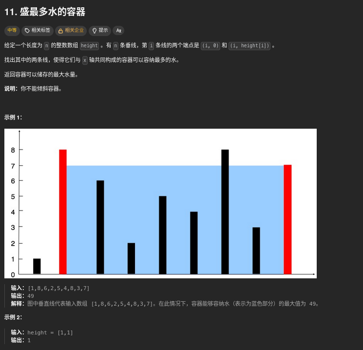
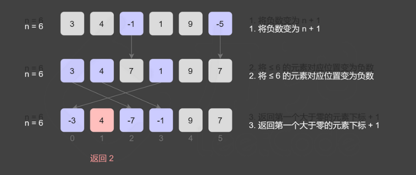

# 第一题 两数之和


当然是暴力最简单，两层循环

这一题主要考验哈希制表，key是数组元素，value是数组下标。

然后每一次都检查一下，是否存在target-nums[i] 值

```cpp
class Solution {
public:
    vector<int> twoSum(vector<int>& nums, int target) {
        unordered_map<int,int> hashtable;
        for(int i=0;i<nums.size();i++){
            auto it = .find(target-nums[i]);
            if(it != hashtable.end()){
                return {it->second,i};
            }
            hashtable[nums[i]] = i;
        }
        return {};
    }
};
```

# 第二题 字母异位词分组


还是哈希制表，主要是处理key，有好多方法，比如：对strs里面的 item 进行排序，作为key。或者对对strs里面的 item 统计 字符的个数，反正只要是唯一的就好

```cpp
class Solution {
public:
    vector<vector<string>> groupAnagrams(vector<string>& strs) {
        unordered_map<string,vector<string> > mp;
        for(string& str: strs){
            string key = str;
            sort(key.begin(),key.end());
            mp[key].push_back(str);
        }
        vector<vector<string> > ans;
        for(auto it = mp.begin();it != mp.end();it++){
            ans.push_back(it->second);
        }
        return ans;
    }
};
```

# 第三题 最长连续序列


这一题要用O(n)的复杂度来做

首先使用set来去重

后面就遍历的时候要找到序列之中的第一个数据，也就是找一找 set nums中index nums[index]-1 在不在 set 中，在的话表示不是序列的第一个数据

如果不在表示是第一个数据，后面就检查一下nums[index]+1在不在，nums[index]+2在不在...

比如：[100,4,200,1,3,2]

a.遍历到100,100-1不在，表示是序列里面的第一个数据，然后100+1不在，长度是1

b.4 4-1在，表示不是序列里面的第一个数据，跳过

c.200， 200-1 不在，表示是序列里面的第一个数据，然后200+1不在，长度是1

d.1 1-1不在，表示是序列里面的第一个数据，然后1+1在，1+2在，1+3在，长度为4

e. ......

```cpp
class Solution {
public:
    int longestConsecutive(vector<int>& nums) {
        unordered_set<int> num_set;
        for(const int& num: nums){
            num_set.insert(num);
        }

        int longestStreak = 0;

        for(const int& num: nums){
            if(!num_set.count(num-1)){
                int currentNum = num;
                int currentStreak = 1;

                while(num_set.count(currentNum+1)){
                    currentNum++;
                    currentStreak++;
                }
                
                longestStreak = max(currentStreak,longestStreak);
            }
        }

        return longestStreak;
    }
};
```

# 第四题 移动零


这一题相对而言简单一些，双指针，一个记录0的位置，一个记录非0的位置，看一下代码就好

```cpp
class Solution {
public:
    void moveZeroes(vector<int>& nums) {
        int left=0,right=0;
        while(right<nums.size()){
            if(nums[right]){
                swap(nums[left], nums[right]);
                left++;
            }
            right++;
        }
    }
};
```


# 第五题 盛最多水的容器



双指针，left 从 左侧 开始， right 从 右侧 开始。 计算每一个 容量 大小 保存一下

```cpp
class Solution {
public:
    int maxArea(vector<int>& height) {
        int left=0,right=height.size()-1;
        int ans = 0;
        while(left < right){
            int res = min(height[left],height[right]) * (right - left);
            ans = max(ans,res);
            if(height[left] < height[right]){
                left++;
            }else{
                right--;
            }
        }
        return ans;
    }
};
```

# 第六题 三数之和


也可以说是三指针，先排序，固定一个first，然后second = first + 1， third  = nums.size() - 1; 然后查询 nums[second] + nums[third] 与  -nums[first]的关系
需要注意的是，去重的操作。

```cpp
class Solution {
public:
    vector<vector<int>> threeSum(vector<int>& nums) {
        int n = nums.size();
        sort(nums.begin(),nums.end());
        vector<vector<int> > ans;
        //也是双指针,也可以说是三指针，a b c, 只需要让 nums[b] + nums[c] = - nums[a] 就可以了，nums是已经排序好的
        for(int first = 0;first < n;first++){
            // 去掉那些重复的
            if(first > 0 && nums[first] == nums[first-1]){
                continue;
            }
            int third = n - 1; //最右侧
            int target = -nums[first];
            for(int second = first+1;second < n;second++){
                //去重
                if(second > first+1 && nums[second] == nums[second-1]){
                    continue;
                }
                while(second < third && nums[second] + nums[third] > target){
                    third--;
                }
                // 没找到，不满足条件
                if(second == third){
                    break;
                }
                if(nums[second] + nums[third] == target){
                    ans.push_back({nums[first],nums[second],nums[third]});
                }
            }
        }

        return ans;
    }
};
```

# 第七题 接雨水


首先需要了解一点，对于下标 i，下雨后水能到达的最大高度等于下标 i 两边的最大高度的最小值，下标 i 处能接的雨水量等于下标 i 处的水能到达的最大高度减去 height[i]。

因此，只需要知道左边和右边的最大高度即可


当 1≤i≤n−1 时，leftMax[i]=max(leftMax[i−1],height[i])

当 0≤i≤n−2 时，rightMax[i]=max(rightMax[i+1],height[i])

最终结果：ans += min(leftMax[i], rightMax[i]) - height[i];

```cpp
class Solution {
public:
    int trap(vector<int>& height) {
        int n = height.size();
        vector<int> leftMax(n);  
        leftMax[0] = height[0];
        vector<int> rightMax(n); 
        rightMax[n-1] = height[n-1];
        for(int i=1;i<n;i++){
            leftMax[i] = max(leftMax[i-1],height[i]);
        }
        for(int i=n-2;i>-1;i--){
            rightMax[i] = max(rightMax[i+1],height[i]);
        }
        int ans = 0;
        for(int i=0;i<n;i++){
            ans += min(leftMax[i],rightMax[i]) - height[i];
        }
        return ans;
    }
};
```

# 第八题 无重复字符的最长子串


滑动窗口。以 abcabcbb 为例

- 以 (a)bcabcbb 开始的最长字符串为 (abc)abcbb；
- 以 a(b)cabcbb 开始的最长字符串为 a(bca)bcbb；
- 以 ab(c)abcbb 开始的最长字符串为 ab(cab)cbb；
- 以 abc(a)bcbb 开始的最长字符串为 abc(abc)bb；
- 以 abca(b)cbb 开始的最长字符串为 abca(bc)bb；
- 以 abcab(c)bb 开始的最长字符串为 abcab(cb)b；
- 以 abcabc(b)b 开始的最长字符串为 abcabc(b)b；
- 以 abcabcb(b) 开始的最长字符串为 abcabcb(b)。

```cpp
class Solution {
public:
    int lengthOfLongestSubstring(string s) {
        unordered_set<char> occ;
        int ans = 0, left = 0,right = 0,temp = 0;
        while(right < s.length()){
            if(occ.count(s[right])!=0){
                occ.erase(s[left]);
                left++;
                temp--;
            }else{
                occ.insert(s[right]);
                right++;
                temp++;
            }
            ans = max(ans,temp);
        }
        return ans;
    }
};
```

# 第九题 找到字符串中所有字母异位词


滑动窗口，主要是比较两个字符串是否是一样的

可以排序，也可以使用字母count来表示

```cpp
class Solution {
public:
    vector<int> findAnagrams(string s, string p) {
        int sLen = s.size(),pLen = p.size();

        if(sLen < pLen){
            return vector<int>();
        }

        vector<int> ans;
        vector<int> sCount(26);
        vector<int> pCount(26);

        for(int i=0;i<pLen;i++){
            sCount[s[i]-'a']++;
            pCount[p[i]-'a']++;
        }
        if(sCount == pCount){
            ans.push_back(0);
        }

        for(int i=0;i<s第九题 找到字符串中所有字母异位词Len-pLen;i++){
            --sCount[s[i]-'a'];
            ++sCount[s[i+pLen]-'a'];
            if(sCount == pCount){
                ans.push_back(i+1);
            }
        }

        return ans;
    }
};
```

# 第十题 和为 K 的子数组


1.首先想法肯定是暴力 两层循环

好吧，超时了

```cpp
class Solution {
public:
    int subarraySum(vector<int>& nums, int k) {
        int count = 0;
        for(int i=0;i<nums.size();i++){
            int sum = 0;
            for(int j=i;j<nums.size();j++){
                sum+=nums[j];
                if(sum == k){
                    count++;
                }
            }
        }
        return count;
    }
};
```


2.前缀和 + 哈希制表

pre[i]记录 前i个和； 则 pre[i] - pre[j-1] = k 则表示 j...i 这个子区间之内的和为k。

因此pre[j-1] = pre[i] - k 则满足条件。

因此值表，key为前缀和 value为出现次数

```cpp
class Solution {
public:
    int subarraySum(vector<int>& nums, int k) {
        unordered_map<int, int> mp;
        mp[0] = 1;
        int count = 0, pre = 0;
        for(int i=0;i<nums.size();i++){
            pre += nums[i];
            if(mp.find(pre-k) != mp.end()){
                count += mp[pre-k];
            }
            mp[pre]++;
        }
        return count;
    }
};
```

# 第十一题 滑动窗口最大值


第一想法：暴力！！！

果然，超时

官方题解 ：优先队列

优先队列：priority_queue 会将最大的数据放在对顶

priority_queue<pair<int,int>> q; 值表，first 为 num[i] second 为 i

每次循环的时候查询一下 q.top().second. 看一看是不是 小于 i - k 小于的话就代表在滑动窗口之外

```cpp
class Solution {
public:
    vector<int> maxSlidingWindow(vector<int>& nums, int k) {
        int n=nums.size();
        priority_queue<pair<int,int>> q;
        for(int i=0;i<k;i++){
            q.emplace(nums[i],i);
        }
        vector<int> ans = {q.top().first};
        for(int i=k;i<n;i++){
            q.emplace(nums[i],i);
            while(q.top().second <= i-k){
                q.pop();
            }
            ans.push_back(q.top().first);
        }
        return ans;
    }
};
```

# 第十二题 最小覆盖子串


直接看官方题解：


这其中会出现一些问题

1.如何存储字符串？

2.如何比较两个字符串的包含关系？

其实两个算一个问题之前我们在做 第九题 找到字符串中所有字母异位词 的时候 提到过，这种类字母异位词有两种存储 排序和count值表 但是这里不适用。

这里使用了unordered_map，key为字符char value为包含的数量 int

那么包含关系就好处理了，check的时候只要确定目标map里面的字符的数量不得大于当前窗口里面的量就好。

```cpp
class Solution {
public:
    //ori 存储t里面的值，cnt存储窗口里面的值
    unordered_map<char,int> ori,cnt;
    //cnt之中的c的count要大于 ori 之中对应的值，否则就不包含
    bool check(){
        for(const auto &p:ori){
            if(cnt[p.first] < p.second){
                return false;
            }
        }
        return true;
    }

    string minWindow(string s, string t) {
        // 初始化ori
        for(const auto &c:t){
            ori[c]++;
        }

        int left = 0,right = -1;
        int len = INT_MAX, ansL = -1;
        while(right < int(s.size())){
            // 只要看ori之中有的字符就好，其他的没必要看
            if(ori.find(s[++right])!=ori.end()){
                ++cnt[s[right]];
            }

            while(check() && left<=right){
                //更新长度
                if(right - left + 1 < len){
                    len = right - left + 1;
                    ansL = left;
                }
                if(ori.find(s[left]) != ori.end()){
                    --cnt[s[left]];
                }
                ++left;
            }
        }

        return ansL == -1 ? string() : s.substr(ansL, len);
    }
};
```

# 第十三题 最大子数组和


子数组和，第一印象应该是前缀和，那么，记录一下最小的和最大的前缀和两者相减就可以得到结果

```cpp
class Solution {
public:
    int maxSubArray(vector<int>& nums) {
        int max1=-99999,pre=0;
        int min1=0;
        for(int i=0;i<nums.size();i++){
            pre+=nums[i];
            max1=max(max1,pre-min1);
            min1=min(min1,pre);
        }
        return max1;
    }
};
```

另外一个解法是动态规划

dp[i]=max{nums[i],dp[i−1]+nums[i]}


```cpp
class Solution {
public:
    int maxSubArray(vector<int>& nums) {
        int res = nums[0];
        for(int i=1;i<nums.size();i++){
            if(nums[i-1]>0){
                nums[i] += nums[i-1];
            }
            if(nums[i]>res){
                res = nums[i];        
            }
        }
        return res;
    }
};
```

# 第十四题 合并区间


这一题研一的时候好像讲过

先对数组按照left进行排序，那么可以合并的就连续了


后面查看一下合并的条件

a[i].end<a[j].start (a[i] 和 a[j] 不能合并)

a[j].end<a[k].start (a[j] 和 a[k] 不能合并)

a[i].end≥a[k].start(a[i] 和 a[k] 可以合并)

因此：

```cpp
class Solution {
public:
    vector<vector<int>> merge(vector<vector<int>>& intervals) {
        if(intervals.size()==0){
            return {};
        }
        sort(intervals.begin(),intervals.end());
        vector<vector<int>> resultList;
        for(int i=0;i<intervals.size();i++){
            int L = intervals[i][0],R = intervals[i][1];
            // 不能合并直接push进去
            if(!resultList.size()||resultList.back()[1]<L){
                resultList.push_back({L,R});
            }else{
                resultList.back()[1] = max(resultList.back()[1],R);
            }

        }
        return resultList;
    }
};
```

# 第十五题 轮转数组


解法一很简单，就是申请一个额外的数组

```cpp
class Solution {
public:
    void rotate(vector<int>& nums, int k) {
        int Lnums = nums.size();
        k = k % Lnums;
        vector<int> tempList(nums.begin(),nums.end());
        for(int i=0;i<Lnums;i++){
            nums[(i+k)%Lnums] = tempList[i];
        }
    }
};
```

解法二很巧妙

原始数组        1 2 3 4 5 6 7

翻转所有元素	 7 6 5 4 3 2 1
  
翻转 [0,kmodn−1] 区间的元素	 5 6 7 4 3 2 1

翻转 [kmodn,n−1] 区间的元素	 5 6 7 1 2 3 4

```cpp
class Solution {
public:
    void reverse(vector<int>& nums, int start, int end) {
        while (start < end) {
            swap(nums[start], nums[end]);
            start += 1;
            end -= 1;
        }
    }

    void rotate(vector<int>& nums, int k) {
        k %= nums.size();
        reverse(nums, 0, nums.size() - 1);
        reverse(nums, 0, k - 1);
        reverse(nums, k, nums.size() - 1);
    }
};
```

# 第十六题 除自身以外数组的乘积


第一印象肯定是，把所有数都乘一下，然后除以自身。但是因为有0所以不行

那么 对于 index 位置的数据 除自身以外数组的乘积 就是index左侧的乘积 * index右侧的乘积

那么申请两个数组保存一下就好

```cpp
class Solution {
public:
    vector<int> productExceptSelf(vector<int>& nums) {
        vector<int> L(nums.size(),1);
        vector<int> R(nums.size(),1);

        for(int i=1;i<nums.size();i++){
            L[i] = L[i-1] * nums[i-1];
        }

        for(int i=nums.size()-2;i>-1;i--){
            R[i] = R[i+1] * nums[i+1];
        }

        vector<int> answer(nums.size());
        for(int i=0;i<nums.size();i++){
            answer[i] =  L[i] * R[i];
        }

        return answer;
    }
};
```

# 第十七题 缺失的第一个正数


想一下 length为N的数组，缺失的第一个正数的分布。最极端的情况是1 2 3 4 ... N 那么缺失的第一个正数就是N+1，否则但凡有一个非正数，则缺失的第一个正数一定是[1,N]之间

那么后面就好处理了，结果一定是[1,N+1] 因此 两次循环就好。

这样的话就暴力了

看官方解题：

因为结果一定是[1,N+1] 所以可以使用下标存储结果

如何处理：



注意第二步的处理，下标变负数表示该下标的数据出现过，比如 3 对应的下标 2 变成负数了，表示 2 + 1 在数组里面出现过！！！

```cpp
class Solution {
public:
    int firstMissingPositive(vector<int>& nums) {
        int Lnums = nums.size();
        for(int i=0;i<Lnums;i++){
            if(nums[i] <= 0){
                nums[i] = Lnums + 1;
            }
        }

        for(int i=0;i<Lnums;i++){
            int num = abs(nums[i]);
            if(num <= Lnums){
                nums[num-1] =  -abs(nums[num - 1]);
            }
        }

        for(int i=0;i<Lnums;i++){
            if(nums[i] > 0){
                return i+1;
            }
        }

        return Lnums+1;
    }
};
```