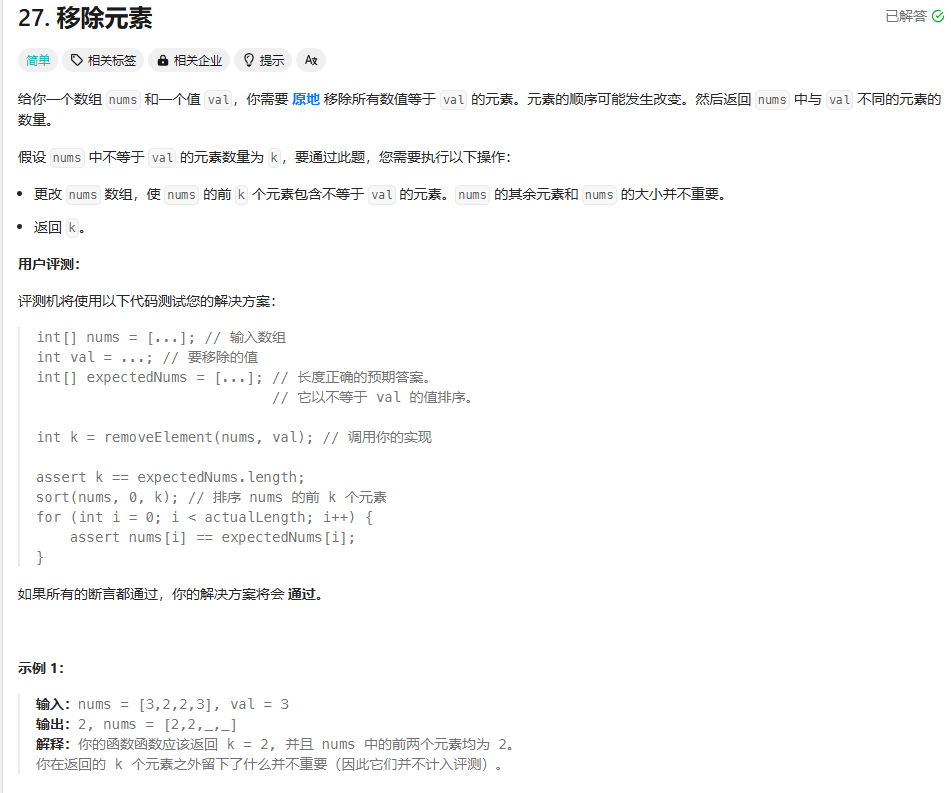

最先想到的解法---暴力！

申请一个新的vector,将不等于val的元素存进去

```cpp
class Solution {
public:
    int removeElement(vector<int>& nums, int val) {
        vector<int> resultList;
        for(int i=0;i<nums.size();i++){
            if(nums[i]!=val){
                resultList.push_back(nums[i]);
            }
        }
        for(int i=0;i<resultList.size();i++){
            nums[i] = resultList[i];
        }
        return resultList.size();
    }
};
```

后面通过直接记录非val元素，直接将其插入到前面去就好了

```cpp
class Solution {
public:
    int removeElement(vector<int>& nums, int val) {
        int insertPos = 0; // 用于记录非val元素应该插入的位置
        for (int i = 0; i < nums.size(); ++i) {
            if (nums[i] != val) {
                nums[insertPos++] = nums[i]; // 将非val元素移动到前面
            }
        }
        return insertPos; // 返回移除val后的新长度
    }
};
```

