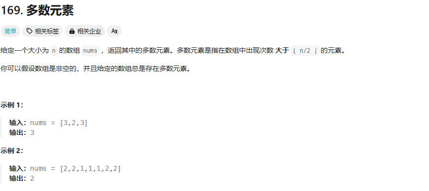

第一印象:

1.sort排序一下，输出中间值(O(nlogn))
```cpp
sort(nums.begin(),nums.end());
return nums[nums.size()/2];
```
2.使用一个非常大的数组存储O(n) 但是空间复杂度极高
```cpp
count[nums[i]]++;
return max(count.begin(),count.end());
```

官方解法：

```cpp
class Solution {
public:
    int majorityElement(vector<int>& nums) {

        int major = nums[0];
        int count = 0;
        for(int i=0;i<nums.size();i++){
            if(nums[i]==major){
                count++;
            }else{
                count--;
                if(count < 0){
                    major = nums[i];
                    count = 0;
                }
            }
        }
        return major;

    }
};
```

非常巧妙：

多数元素是指在数组中出现次数 大于 ⌊ n/2 ⌋ 的元素。

因此总体看来 其对应的 count 不可能为负，而其他的元素 小于 ⌊ n/2 ⌋ ，因此必定为 负
