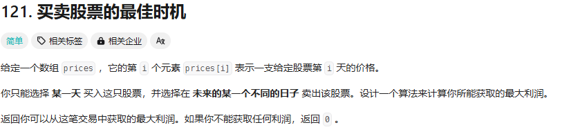

第一印象：

遍历两次，两层for循环，时间复杂度为O(nlogn) 会超时


正确解法：

一次遍历，遍历的过程中一直 维护最小的值，拿后面的值减去前面最小的值就是最终的结果

```cpp
class Solution {
public:
    int maxProfit(vector<int>& prices) {
        int result = -1;
        int minDate = prices[0];
        for(int i=0;i<prices.size();i++){
            minDate = minDate < prices[i]?minDate:prices[i];
            result = result > (prices[i] - minDate)?result:(prices[i] - minDate);
        }
        return result>0?result:0;
    }
};
```