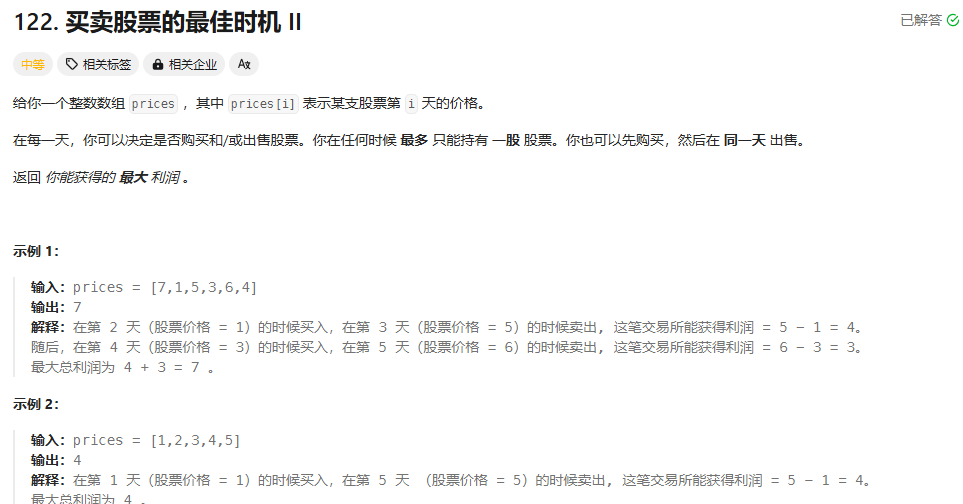

贪心算法：

一看就了解意思：

```cpp
class Solution {
public:
    int maxProfit(vector<int>& prices) {   
        int ans = 0;
        int n = prices.size();
        for (int i = 1; i < n; ++i) {
            ans += max(0, prices[i] - prices[i - 1]);
        }
        return ans;
    }
};
```