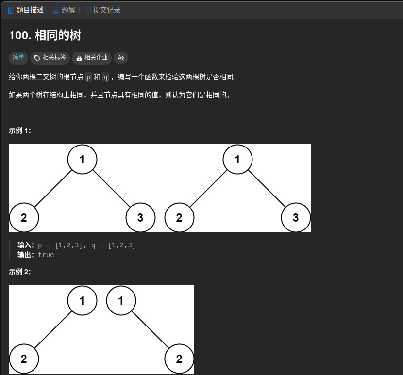

100、222、101、226、437、563、617、508、572、543、654、687、87102、429、690、559、662、671、513、515、637、103、107、257、623、653、104、111、112、113、129、404、199、655、116、117、144、589、606、331、652、297、449
145、590、94、700、530、538、230、98、173、669、450、110、95、108、109、105、106114、235、236、501、99、558、427

# 100



第一想法：按一个顺序遍历一遍，看看递归得到的结果顺序对不对  这个肯定不幸，一个递归(先 中或后 不可以) 不可以得到一个具体的树

后面就是递归的想法了，我本来以为可能会超时来着，没想到一次就过了

```cpp
/**
 * Definition for a binary tree node.
 * struct TreeNode {
 *     int val;
 *     TreeNode *left;
 *     TreeNode *right;
 *     TreeNode() : val(0), left(nullptr), right(nullptr) {}
 *     TreeNode(int x) : val(x), left(nullptr), right(nullptr) {}
 *     TreeNode(int x, TreeNode *left, TreeNode *right) : val(x), left(left), right(right) {}
 * };
 */
class Solution {
public:
    bool isSameTree(TreeNode* p, TreeNode* q) {
        if(p == nullptr && q == nullptr){
            return true;
        }else if(p == nullptr && q != nullptr){
            return false;
        }else if(p != nullptr && q == nullptr){
            return false;
        }else{
            bool root_flag = (p->val == q->val);
            bool left_flag = isSameTree(p->left, q->left);
            bool right_flag = isSameTree(p->right, q->right);
            return root_flag&&left_flag&&right_flag;
        }
    }
};
```