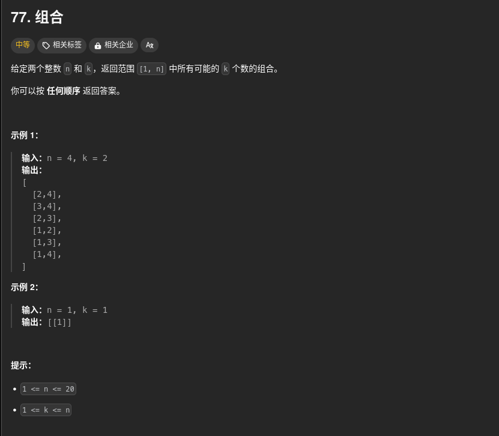
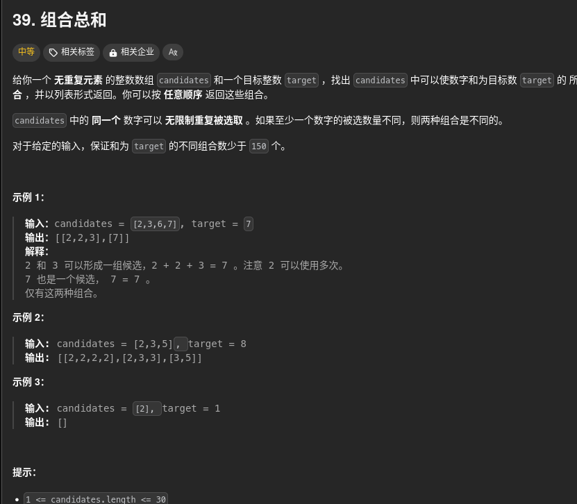

565、17、397、526、401、36、37、51、52、77、39、216、40、46、47、31、556、60、491、78、90、79、93、332
241、282、679、22、301、488、133、200、695、463、542、130、417、529、127、126433、675
547、684、685、399、207、210、65、468

先看一下代码随想录的视频回溯的

三步骤，与剪枝

# 77



那么，就看按照视频里面的回溯三不步来走。

```cpp
class Solution {
public:
    vector<vector<int>> combine(int n, int k) {
        vector<vector<int>> resultVector;
        vector<int> path;
        backtrack(resultVector,path,n,k,1);
        return resultVector;
    }

    void backtrack(vector<vector<int>>& resultVector,vector<int>& path,int n,int k,int index){
        if(path.size()==k){
            resultVector.push_back(path);
            return;
        }

        for(int i=index;i<=n;i++){
            path.push_back(i);
            backtrack(resultVector,path,n,k,i+1);
            path.pop_back();
        }
    }
};
```

```cpp
//减枝
class Solution {
public:
    vector<vector<int>> combine(int n, int k) {
        vector<vector<int>> resultVector;
        vector<int> path;
        backtrack(resultVector,path,n,k,1);
        return resultVector;
    }

    void backtrack(vector<vector<int>>& resultVector,vector<int>& path,int n,int k,int index){
        if(path.size()==k){
            resultVector.push_back(path);
            return;
        }

        for(int i=index;i<=n;i++){
            //看这里很重要
            if(n- i + 1 < k- path.size()){
                break;
            }
            // (n- i + 1)是剩下还可以选择的元素的个数
            // k- path.size() 是还需要多少元素
            path.push_back(i);
            backtrack(resultVector,path,n,k,i+1);
            path.pop_back();
        }
    }
};
```

把他合并到for循环里面

```cpp
class Solution {
public:
    vector<vector<int>> combine(int n, int k) {
        vector<vector<int>> resultVector;
        vector<int> path;
        backtrack(resultVector,path,n,k,1);
        return resultVector;
    }

    void backtrack(vector<vector<int>>& resultVector,vector<int>& path,int n,int k,int index){
        if(path.size()==k){
            resultVector.push_back(path);
            return;
        }

        for(int i=index;i<=n-(k-path.size())+1;i++){
            path.push_back(i);
            backtrack(resultVector,path,n,k,i+1);
            path.pop_back();
        }
    }
};
```

# 39



这种排列组合的都是一样的

```cpp
class Solution {
public:
    vector<vector<int>> combinationSum(vector<int>& candidates, int target) {
        vector<vector<int>> resultVector;
        vector<int> path;
        backtrack(resultVector,path,candidates,target,0);
        return resultVector;
    }

    void backtrack(vector<vector<int>>& resultVector,vector<int>& path,vector<int>& candidates, int target,int index){
        if(accumulate(path.begin(), path.end(), 0) == target){
            resultVector.push_back(path);
            return;
        }else if(accumulate(path.begin(), path.end(), 0) > target){
            return;
        }else{
            for(int i=index;i<candidates.size();i++){
                path.push_back(candidates[i]);
                backtrack(resultVector,path,candidates,target,i);
                path.pop_back();
            }
        }
    }
};
```