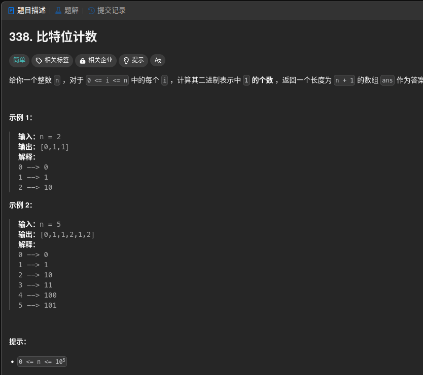

509、70、338、45、55、198、213、650、91、639、552、123、188、309、32、264、313、403
689、413、446、368、416、279、322、518、474、494、377、62、63、64、120、576、688、221、629、174、96、329、583、72、97、115、516、132、131、139、140、514、10、44
464、691、698、638、473、486、664、375、312、546、337、124、233、600

# 509 

这个是 斐波那契数 就不说了

# 70

这个是爬楼梯的那个，也不说了，相当于 斐波那契数 的变体

```cpp
class Solution {
public:
    int climbStairs(int n) {
        if(n == 1){
            return 1;
        }else if(n == 2){
            return 2;
        }

        int pre = 1;
        int now = 2;
        int sum = 3;

        for(int i=3;i<=n;i++){
            sum = pre + now;
            pre = now;
            now = sum;
        }

        return sum;
    }
};
```

动态规划的做法

```cpp
class Solution {
public:
    int climbStairs(int n) {

        if(n == 1){
            return 1;
        }else if(n == 2){
            return 2;
        }
        int dp[n];
        dp[0] = 1;
        dp[1] = 2;

        for(int i=2;i<n;i++){
            dp[i] = dp[i-2] + dp[i-1];
        }

        return dp[n-1];
    }
};
```

# 338



动态规划最主要的事情就是找规律，也就是状态转移方程

我们来看一下

0  0
1  1
2  10
3  11
4  100
5  101
6  110
7  111
8  1000

我们可以观察到 一个数 * 2 就代表着 二进制后面要加个 0 ，这个时候 1 的数量是一样的

dp[2 * i] = dp[i]


而对应的+1位置的奇数就相当于把最后一个 0 变成 1 ，就是 1 的个数 +1

dp[2 * i + 1] = dp[i] + 1

```cpp
class Solution {
public:
    vector<int> countBits(int n) {
        vector<int> resultList(n + 1);
        resultList[0] = 0;
        for(int i=0;i<=n/2;i++){
            resultList[2*i] = resultList[i];
            if(2*i+1 <= n){
                resultList[2*i+1] = resultList[i] + 1;
            }
        }
        return resultList;
    }
};
```

# 45


找到他的状态转移方程

我们来看一下，对于 i 这个位置 那个往后的到 i + nums[i] 这个位置（i+1 - i + nums[i]）都可以到达，也就是说都可以加一步到达这个位置

所以对于dp[i+j] = min(dp[i+j],dp[i]+1) //也就是不经过i 这个位置 和经过 i 这个位置然后再跳(这个有点偏暴力了)

```cpp
class Solution {
public:
    int jump(vector<int>& nums) {
        int n = nums.size();
        vector<int> dp(n, std::numeric_limits<int>::max());
        dp[0] = 0;
        for(int i=0;i<n;i++){
            for(int j=1;j<=nums[i]&&i+j<n;j++){
                dp[i+j] = min(dp[i+j],dp[i]+1);
            }
        }
        return dp[n-1];
    }
};
```


