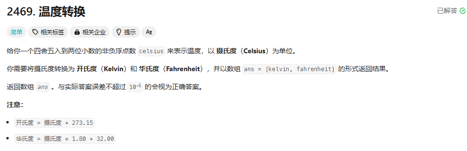

**2469**、**2235**、**2413**、**2160**、**2520**、**1688**、1281、2427、728、2119、509、70、
372、7、479、564、231、342、326、504、263、190、191、476、461、477、50、:693、393、172、458、258、319、405、171、168、670、233、357、400


## 2469



想法： 直接套公式！

```cpp
class Solution {
public:
    vector<double> convertTemperature(double celsius) {
        vector<double> resultList;
        double Kelvin = celsius + 273.15;
        double Fahrenheit = celsius * 1.80 + 32.00;
        resultList.push_back(Kelvin);
        resultList.push_back(Fahrenheit);
        return resultList;
    }
};
‵‵‵
发现空间复杂度竟然不是最好的，看了一下最好的，他们是这么写的：

```cpp
class Solution
{
public:
    vector<double> convertTemperature(double celsius)
    {(),
        return {celsius + 273.15, celsius * 1.80 + 32.00};
    }
};  
```

这个有些简单的题目就不往上写了，就太简单了，比如 num1 + num2 