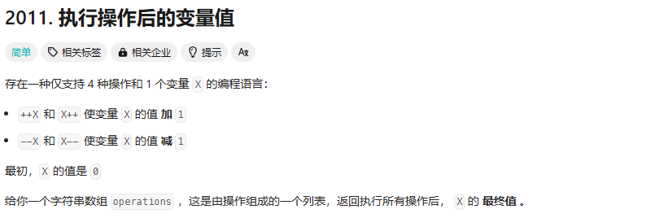

2011、1929、1720、2574、1cp01、lcp06、1365、1732、1464、2496、1979、485、495、414、628、645、697、448、442、41、274、453、665、283、118、119、661、598、419、189、396、54、59、498、566、48、73、289、303、304、238

## 2011


想法：这里没要求顺序（++X 与 X++） 所以就直接判断中间位置的字符就好了

```cpp
class Solution {
public:
    int finalValueAfterOperations(vector<string>& operations) {
        int x = 0;
        for(int i=0;i<operations.size();i++){
            if(operations[i][1]=='+'){
                x++;
            }else{
                x--;
            }
        }
        return x;
    }
};
```

时间复杂度是最好的，但是空间复杂度不行，看了一下人家的：

```cpp
class Solution
{
public:
  int finalValueAfterOperations(std::vector<std::string> &operations)
  {
    int x = 0;
    for (const auto& op : operations) {
      if (op[0] == '+' || op[2] == '+') {
        ++x;
      } else {
        --x;
      }
    }
    return x;
  }
};
```