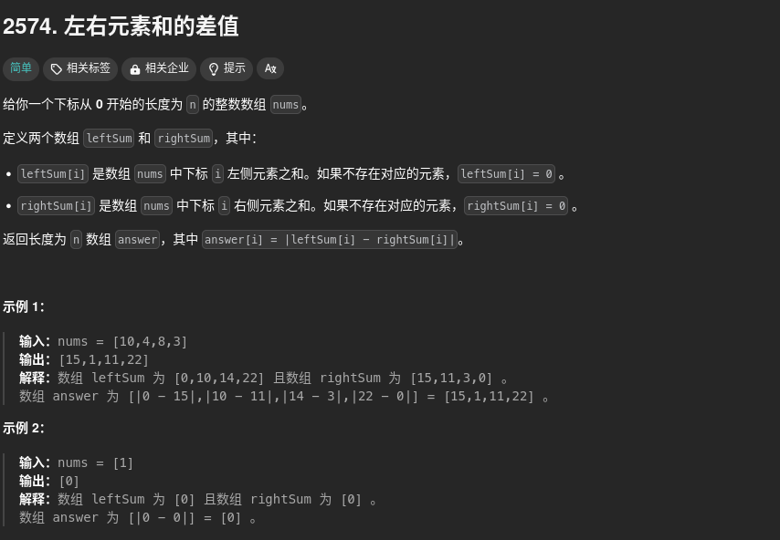

**2011、1929**、1720、2574、1cp01、lcp06、1365、1732、1464、2496、1979、485、495、414、628、645、697、448、442、41、274、453、665、283、118、119、661、598、419、189、396、54、59、498、566、48、73、289、303、304、238

## 2011


想法：这里没要求顺序（++X 与 X++） 所以就直接判断中间位置的字符就好了

```cpp
class Solution {
public:
    int finalValueAfterOperations(vector<string>& operations) {
        int x = 0;
        for(int i=0;i<operations.size();i++){
            if(operations[i][1]=='+'){
                x++;
            }else{
                x--;
            }
        }
        return x;
    }
};
```

时间复杂度是最好的，但是空间复杂度不行，看了一下人家的：

```cpp
class Solution
{
public:
  int finalValueAfterOperations(std::vector<std::string> &operations)
  {
    int x = 0;
    for (const auto& op : operations) {
      if (op[0] == '+' || op[2] == '+') {
        ++x;
      } else {
        --x;
      }
    }
    return x;
  }
};
```

## 2574



第一想法，申请两个数组，模拟一下：

```CPP
class Solution {
public:
    vector<int> leftRightDifference(vector<int>& nums) {
        int sum = accumulate(nums.begin(),nums.end(),0);
        vector<int> left(nums.size(),0);
        vector<int> right(nums.size(),0);
        int sum1 = nums[0];
        for(int i = 1;i<nums.size();i++){
            left[i] = left[i-1] + nums[i-1];
            right[i-1] = sum - left[i-1] - nums[i-1];
        }

        for(int i=0;i<nums.size();i++){
            left[i] = abs(left[i] - right[i]);
        }
        return left;
    }
};
```

看一下人家的，感觉比较好，不用申请数组，直接两个int模拟

```cpp
class Solution {
public:
    vector<int> leftRightDifference(vector<int>& nums) {
        int leftSum = 0, rightSum = accumulate(nums.begin(), nums.end(), 0);
        vector<int> ans;
        for (int i = 0; i < nums.size(); ++i) {
            rightSum -= nums[i];
            ans.push_back(abs(leftSum - rightSum));
            leftSum += nums[i];
        }
        return ans;
    }
};
```