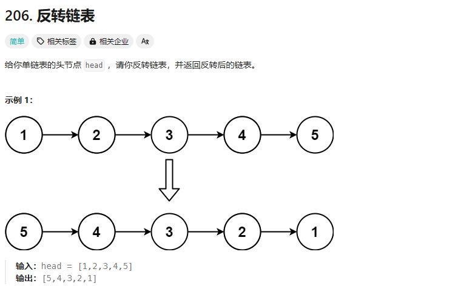

206、203、237、19、430、61、24、、92、25、2、445、21、23

## 206


第一想法：暴力

一次遍历就好：最关键的是存储两个节点，对于相邻两个节点，只需要将他们两个的指针反过来就好！（我是SB，我老是想着暴力）

```cpp
/**
 * Definition for singly-linked list.
 * struct ListNode {
 *     int val;
 *     ListNode *next;
 *     ListNode() : val(0), next(nullptr) {}
 *     ListNode(int x) : val(x), next(nullptr) {}
 *     ListNode(int x, ListNode *next) : val(x), next(next) {}
 * };
 */
class Solution {
public:
    ListNode* reverseList(ListNode* head) {
        if(!head){
            return head;
        }
        ListNode* cur = head;
        ListNode* pre = nullptr;
        ListNode* tmp;
        while(cur){
            tmp = cur->next;
            cur->next = pre;
            pre = cur;
            cur = tmp;
        }
        return pre;
    }
};
```