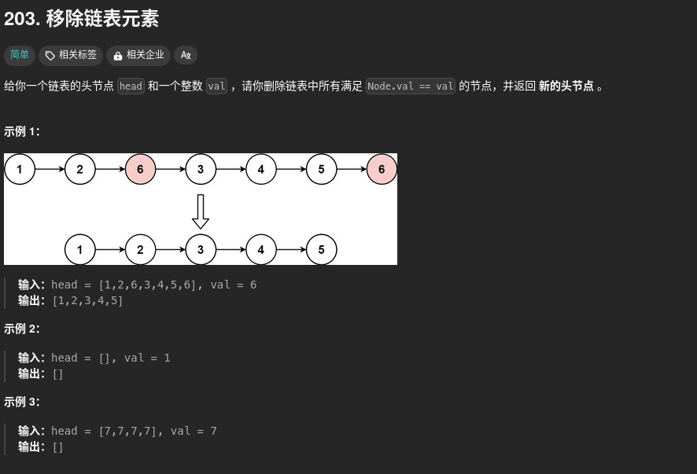
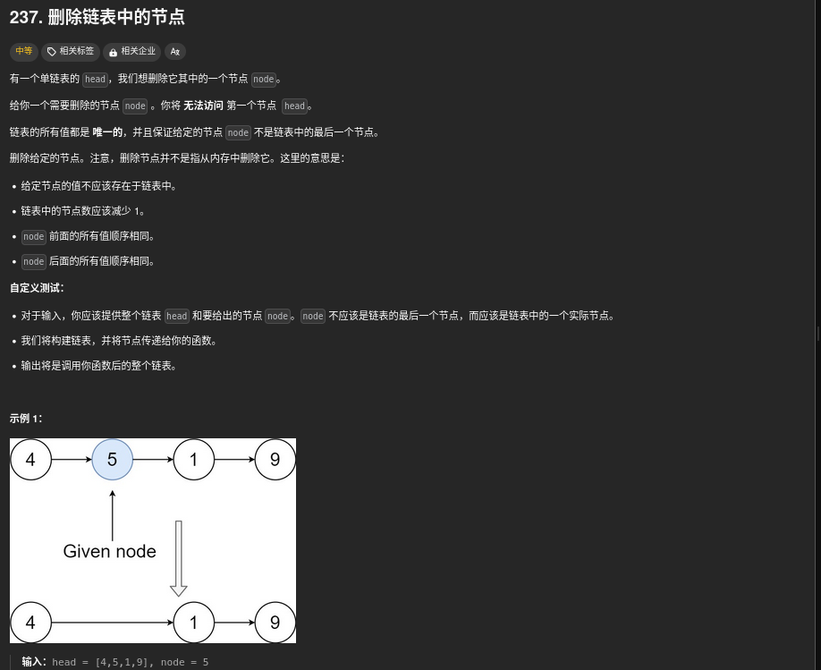
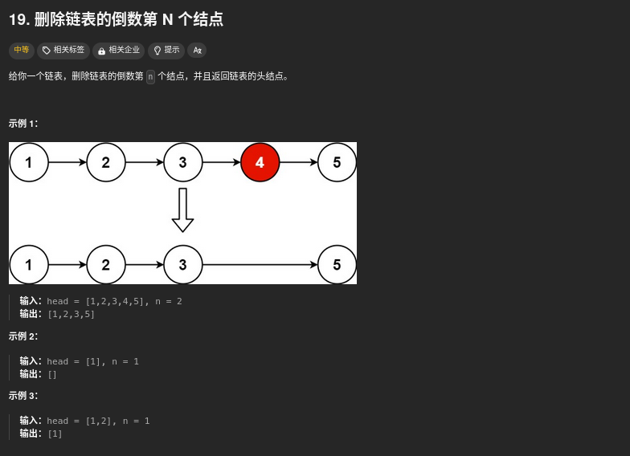

206、203、237、19、430、61、24、、92、25、2、445、21、23

## 206


第一想法：暴力

一次遍历就好：最关键的是存储两个节点，对于相邻两个节点，只需要将他们两个的指针反过来就好！（我是SB，我老是想着暴力）

```cpp
/**
 * Definition for singly-linked list.
 * struct ListNode {
 *     int val;
 *     ListNode *next;
 *     ListNode() : val(0), next(nullptr) {}
 *     ListNode(int x) : val(x), next(nullptr) {}
 *     ListNode(int x, ListNode *next) : val(x), next(next) {}
 * };
 */
class Solution {
public:
    ListNode* reverseList(ListNode* head) {
        if(!head){
            return head;
        }
        ListNode* cur = head;
        ListNode* pre = nullptr;
        ListNode* tmp;
        while(cur){
            tmp = cur->next;
            cur->next = pre;
            pre = cur;
            cur = tmp;
        }
        return pre;
    }
};
```

## 203



这个其实很简单，但是会有很多坑，就比如第三个例子，连续的头都为val的

```cpp
/**
 * Definition for singly-linked list.
 * struct ListNode {
 *     int val;
 *     ListNode *next;
 *     ListNode() : val(0), next(nullptr) {}
 *     ListNode(int x) : val(x), next(nullptr) {}
 *     ListNode(int x, ListNode *next) : val(x), next(next) {}
 * };
 */
class Solution {
public:
    ListNode* removeElements(ListNode* head, int val) {
        
        // 先删除一下头为val的情况
        while(head!=NULL&&head->val==val) {
            struct ListNode*del=head;
            head=head->next;
            delete del;
        }
        if(!head){
            return head;
        }
        // 再删除一下其他地方
        struct ListNode* pre = head;
        struct ListNode* next = head->next;
        while(next!=NULL){
            if(next->val == val){
                pre->next = next->next;
                delete next;
                next = pre->next;
            }else{
                pre = next;
                next = next->next;
            }
        }

        return head;
    }
};
```

## 237



这个刚开始没有啥思路，按正常的想法就是先找到前驱节点，然后正常删除，但是这个没办法找前驱

4 5 1 9 -> 4 1 1 9  然后删除第二个1就好了

```cpp
/**
 * Definition for singly-linked list.
 * struct ListNode {
 *     int val;
 *     ListNode *next;
 *     ListNode(int x) : val(x), next(NULL) {}
 * };
 */
class Solution {
public:
    void deleteNode(ListNode* node) {
        node->val = node->next->val;
        node->next = node->next->next;
    }
};
```


# 19



第一个想法就是遍历一遍，求得链表的长度，然后再遍历一遍，遍历到要删除的这个节点的前驱节点，然后删除

需要注意的是有很多的坑，最大的原因就是没有空头节点

可以使用双指针，第一个指针先走n个点，然后再两个指针一起走 (加一个头节点来处理一些坑)

```cpp
/**
 * Definition for singly-linked list.
 * struct ListNode {
 *     int val;
 *     ListNode *next;
 *     ListNode() : val(0), next(nullptr) {}
 *     ListNode(int x) : val(x), next(nullptr) {}
 *     ListNode(int x, ListNode *next) : val(x), next(next) {}
 * };
 */
class Solution {
public:
    ListNode* removeNthFromEnd(ListNode* head, int n) {
        ListNode* dummy = new ListNode(0, head);
        ListNode* first = head;
        ListNode* second = dummy;
        for (int i = 0; i < n; ++i) {
            first = first->next;
        }
        while (first) {
            first = first->next;
            second = second->next;
        }
        second->next = second->next->next;
        ListNode* ans = dummy->next;
        delete dummy;
        return ans;
    }
};
```