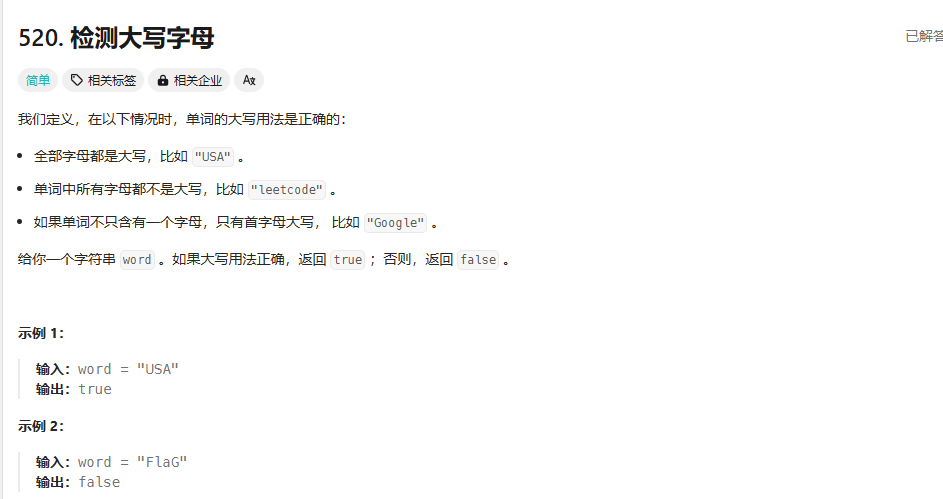

**520**、125、14、34、58、344、541、557、151、387、389、383、242、49、451、3、、8..13、22、293、3、不8、32、824、号2、83、86、 7、218. 43、 306423、657、551、696、482、6、68、28、686、459、214、5、647

## 520


第一想法：保存状态，然后判断：

```cpp
class Solution {
public:
    bool detectCapitalUse(string word) {
        if(word.length() == 1){
            return true;
        }
        bool first = word[0]<='z'&&word[0]>='a';
        bool second = word[1]<='z'&&word[1]>='a';
        if(first&&!second){
            return false;
        }
        for(int i=2;i<word.length();i++){
            if(first){
                if(!(word[i]<='z'&&word[i]>='a')){
                    return false;
                }
            }else{
                if(second){
                    if(!(word[i]<='z'&&word[i]>='a')){
                        return false;
                    } 
                }else{
                    if(word[i]<='z'&&word[i]>='a'){
                        return false;
                    } 
                }
            }
        }
        return true;
    }
};
```

看人家的解法：

1.和我一样的思路，但是更加巧妙
- 首先排除 first 与 second (mL)一小一大这种特殊情况
- 其次后面所有的字符串要和第二个字符的情况一样，要大写都大写，要小写都小写
```cpp
class Solution {
public:
    bool detectCapitalUse(string word) {
        if(word.size()>=2&&islower(word[0])&&isupper(word[1])){
            return false;
        }
        for (int i=2;i<word.size();i++){
            if(islower(word[1])^islower(word[i]))
            return false;
        }
    return true;}
};
```

2.节省空间的做法
- 计算大写字母的count
- 根据大写字母的count来计算最终结果

```cpp
class Solution {
public:
    bool detectCapitalUse(string word) {
        int count = 0, n = word.size();
        for (char c : word) {
            if (c >= 'A' && c <= 'Z') {
                count++;
            }
        }
        return count == 0 || count == n || (count == 1 && (word[0] >= 'A' && word[0] <= 'Z'));
    }
};
```