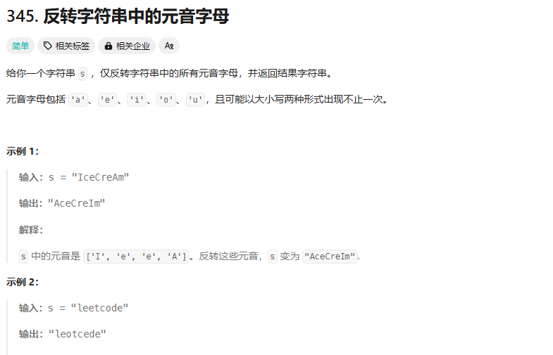

345、680、167、15、16、18、11、42、27、26、80、83、82、611、187643、674、209、3、438、567、424、76、30、86、328、160、88、475、141、142、143234、457、287

## 345



想法：双指针，但是要注意指针移动时候的条件，这个很容易越界

```cpp
class Solution {
public:
    string reverseVowels(string s) {
        const string yuanYin = "AEIOUaeiou";
        int start = 0;
        int end = s.length() - 1;
        while(start<end){
            while(start<=s.length()-1&&yuanYin.find(s[start])==string::npos){
                start++;
            }
            while(end>=0&&yuanYin.find(s[end])==string::npos){
                end--;
            }
            if(start>=end||start>s.length()-1||end<0){
                break;
            }else{
                char temp = s[start];
                s[start] = s[end];
                s[end] = temp;
                start++;
                end--;
            }
        }
        return s;
    }
};
```