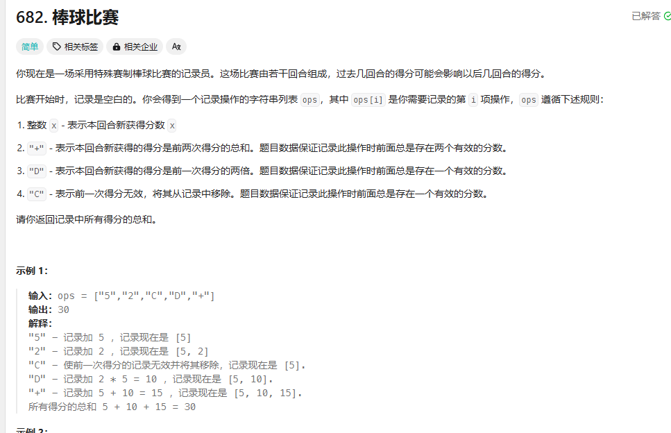

682、71、388、150、227、224、20、636、591、32

## 682


思路，模拟栈，听有意思的，主要是用后进先出的思想，我看题解还有用vector实现的，不过我觉得栈好一些

```cpp
class Solution {
public:
    int calPoints(vector<string>& operations) {
        stack<int> resultstack;
        for(auto op:operations){
            switch(op[0]){
                case 'D':{
                    resultstack.push(2 * resultstack.top());
                    break;
                }
                case 'C':{
                    resultstack.pop();
                    break;
                }
                case '+':{
                    int temp_1 = resultstack.top();
                    resultstack.pop();
                    int temp_2 = temp_1 + resultstack.top();
                    resultstack.push(temp_1);
                    resultstack.push(temp_2);
                    break;
                }
                default:{
                    resultstack.push(stoi(op));
                }
            }
            
        }
        int result = 0;
        int temp_1 = 0;
        while(!resultstack.empty()){
            temp_1 = resultstack.top();
            resultstack.pop();
            result += temp_1;
        }

        return result;
    }
};
```