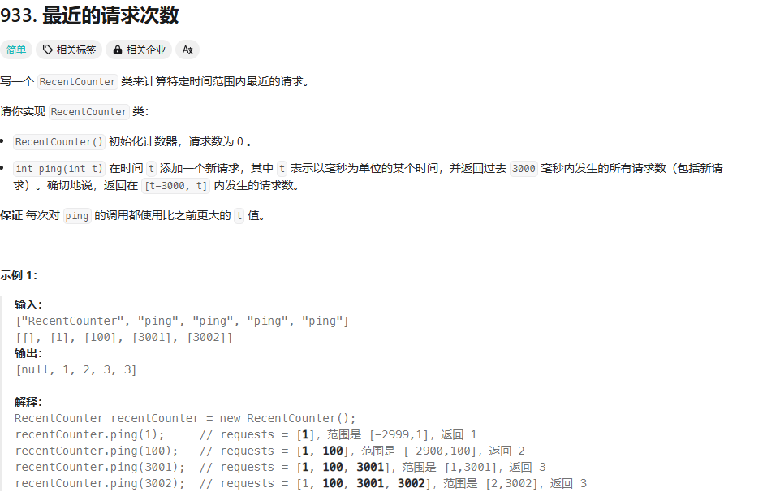

933、1700、232、225、2073、387

## 933



这一题很简单，看一下就知道了

```cpp
class RecentCounter {
public:
    queue<int> q;
    RecentCounter() {
        
    }
    
    int ping(int t) {
        q.push(t);
        while(q.front()<t-3000){
            q.pop();
        }
        return q.size();
    }
};

/**
 * Your RecentCounter object will be instantiated and called as such:
 * RecentCounter* obj = new RecentCounter();
 * int param_1 = obj->ping(t);
 */
```