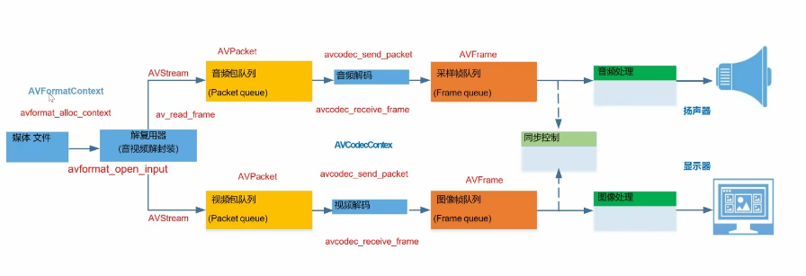

# C++ FFMPEG 项目

这个项目主要是为了学习FFMPEG

完整的主要功能 是 实现对一个封装格式的视频（比如MP4）进行解码，随后获取音视频采样的数据，通过实现音视频同步之后再调用音频驱动与视频取驱动进行播放

这里做了一些简化操作

完成的功能 是  解码之后再进行编码最后再将之组合一下 形成 一个新的 封装好的mp4文件

整体的框架是这样的：


# FFMPEG介绍

对于FFMPEG这个强大的的跨平台多媒体框架就不过多介绍了。咱们平时再用的时候主要是用他的命令行来进行操作。这个项目主要是使用C++结合FFMPEG对音视频进行处理。所以这里主要介绍一下C++ FFMPEG的一些API

我们先来介绍一下一般FFMPEG的一些整体的流程，如下图所示：



## 基本流程介绍

我们一般拿到一个音视频文件，首先需要对其进行拆分，得到音频和视频对应的包。

这里要注意，我们平时所接触到的视频都是以某一种封装格式封装压缩好的一些比如（视频H264,音频AAC等），所以我们得到的音频和视频对应的包都是编码之后的。

因此后面我们需要对其进行解码，然后得到相应的结果解码之后的视频帧(YUV数据)与音频帧（PCM数据）。

在这里我们就可以对原始的视频数据和音频数据进行处理了，比如加一些滤镜等操作。

后面我们将处理之后的原始数据再重新编码，在得到编码之后的视频包和音频包

最后我们可以把音视频包组合在一起，输出为最后的音视频文件。

所以使用C++调用FFMPEG API的时候一般都会有一些基本流程的

## 基本API介绍

### 1.打开文件

#### 涉及到的结构：

**AVFormatContext**

这个是管理媒体文件格式（容器格式）的核心结构体

下面是精简版本：

```cpp
typedef struct AVFormatContext {
    const AVClass *av_class;          // FFmpeg内部使用的类信息
    AVInputFormat *iformat;           // 输入格式（如MP4、FLV等）
    AVOutputFormat *oformat;          // 输出格式（用于写入文件）
    
    // 关键成员
    unsigned int nb_streams;          // 流的数量（视频/音频/字幕等）
    AVStream **streams;               // 流数组指针（核心！）
    int64_t duration;                // 媒体时长（微秒）
    int64_t bit_rate;                // 全局比特率（bps）
    AVDictionary *metadata;          // 元数据（作者、标题等）
    
    // ... 其他成员
    
} AVFormatContext;
```

这个里面存储的数据信息有很多，上面只是列出一些基本的信息

有两个比较重要的值是：unsigned int nb_streams; 与 AVStream **streams; 

- unsigned int nb_streams 存储的是流的数量
- AVStream **streams用来存储流的数组，里面有很多流。比如视频流[AVStream1]，音频流[AVStream2]，字幕流[AVStream3]

我们来介绍一下 AVStream 流 

流里面存储的一些视频与音频等的元数据，比如编码器参数AVCodecParameters等

我们来看一下 AVStream 一些基本结构：

```cpp
typedef struct AVStream {
    int index;  // 流的索引号
    AVCodecParameters *codecpar; // 编解码参数
    AVRational time_base; // 时间基(time base)
    AVRational avg_frame_rate; // 平均帧率(视频流)
    AVDictionary *metadata; // 元数据
    // ... 其他成员
};
```

其他的就不多介绍了，主要是index和codecpar比较重要

- index是流的索引，也就是AVStream **streams 数组对应的下标
- AVCodecParameters 是编码器参数，主要标注一些视频或者音频等的信息，下面来看一下基本结构
```cpp
typedef struct AVCodecParameters {
    enum AVMediaType codec_type; // 流类型(视频/音频/字幕等)
    enum AVCodecID   codec_id;   // 编解码器ID
    // 视频相关
    int width, height;          // 视频宽高
    // 音频相关
    int sample_rate;            // 采样率
    int channels;               // 声道数
    uint64_t channel_layout;    // 声道布局
    // ... 其他成员
};
```

那么问题来了，流里面存储的是元数据或者是信息数据，那么视频包音频包存在那里，怎么区分这是视频包还是音频包？

首先视频包和音频包肯定不是存在流里面的，这样的话流就太大了。视频包和音频包还是存储在文件里面，只不过包里面有一个 stream_index 用来指示对应的那一个流（流里面的index），这样的话就可以区分视频包和音频包或者其他包了。（AVPacket咱们后面介绍）

这样抛析来讲是不是就理解AVFormatContext了

#### 涉及到的API 

**avformat_open_input**

原型：

```cpp
/**
 *  @param ps   指向AVFormatContext指针的指针
 *  @param url  输入媒体文件的路径或URL（如文件路径、网络流地址等）。
 *  @param fmt  指定的输入格式（AVInputFormat）。若为NULL，则自动检测文件格式；
 *  @param options   额外选项的字典（如协议参数、解封装器选项等）
 *  @return 成功返回0，失败返回负的错误码（参考AVERROR宏）。
 * */
int avformat_open_input(AVFormatContext **ps, const char *url, ff_const59 AVInputFormat *fmt, AVDictionary **options);
```

这个就是用来打开文件的，具体怎么做的就不多介绍了（我没看源码），咱们先知道其作用就好

一般在使用的时候都会把后面两个参数设成NULL除非有特殊的需求

比如在这个项目里面：

```cpp
// 打开输入文件
int openResult = avformat_open_input(&formatCtx,filePath,nullptr,nullptr);
if (openResult!=0) {
     cout<<"不可以打开视频文件"<<filePath<<endl;
     return -1;
}
```

### 2.获取流信息

#### 涉及到的API 

**avformat_find_stream_info**

这个函数主要是为了确定文件的流信息的完整性

在调用 avformat_open_input 后，文件的流信息可能不完整，此时调用avformat_find_stream_info 可以获取更完整的流信息

```cpp
/**
 * @param ic      指向AVFormatContext的指针，表示已经打开的媒体文件上下文。
 * @param options 额外选项的字典，用于为每个流的解码器传递选项。
 * @return 成功返回非负值，表示获取到的流信息的数量；失败返回负的错误码（参考AVERROR宏）。
 */
int avformat_find_stream_info(AVFormatContext *ic, AVDictionary **options);
```

说一下咱们一般会怎么用：

在打开文件之后，调用这个确保流信息完整，然后在遍历整个 AVStream 数组得到视频流和音频流的index

(这里就单处理音视频哈，其他的字幕流啥的就不处理了)

通过上面对流的介绍，那么就很容易写代码了，咱们来看一下

```cpp
int vsIndex,asIndex;
vsIndex = asIndex = -1;
// 获取流信息
int findStreaResuly = avformat_find_stream_info(formatCtx,nullptr);
if(findStreaResuly<0) {
    cout<<"无法找到流信息"<<endl;
    return -2;
}
// 查找视频流   AVMEDIA_TYPE_VIDEO 为视频流 AVMEDIA_TYPE_AUDIO 音频流
for (int i=0;i<formatCtx->nb_streams;i++) {
    if (formatCtx->streams[i]->codecpar->codec_type == AVMEDIA_TYPE_VIDEO) {
        vsIndex = i;
        break;
    }
}
if (vsIndex==-1) {
    cout<<"无法找到视频流"<<endl;
    return -3;
}

// 查找音频流   AVMEDIA_TYPE_VIDEO 为视频流 AVMEDIA_TYPE_AUDIO 音频流
for (int i=0;i<formatCtx->nb_streams;i++) {
    if (formatCtx->streams[i]->codecpar->codec_type == AVMEDIA_TYPE_AUDIO) {
        asIndex = i;
        break;
    }
}
if (asIndex==-1) {
    cout<<"无法找到音频流"<<endl;
    return -4;
}
```

### 3.拆分视频包与音频包

#### 涉及到的结构

**AVPacket**

用于存储压缩后的媒体数据（如 H.264 视频帧、AAC 音频帧等）的结构体

这个是GPT生成的，不一定对，还是要看源码的哈。这里咱们主要讲主要的东西

```cpp
typedef struct AVPacket {
    // 数据缓冲区（存储压缩后的数据，如 H.264 NAL 单元、AAC 帧等）
    uint8_t *data;
    int      size;          // 数据大小（字节数）

    // 所属的流索引（对应 AVFormatContext->streams 的下标）
    int      stream_index;

    // 时间戳（单位：流的时间基 time_base）
    int64_t  pts;           // 显示时间戳（Presentation TimeStamp）
    int64_t  dts;           // 解码时间戳（Decoding TimeStamp）
    int      duration;      // 持续时间（单位：time_base）

    // 位置信息（用于字节流或文件定位）
    int64_t  pos;           // 数据在文件中的偏移量（字节）

    // 标志位（如关键帧、损坏数据等）
    int      flags;
#define AV_PKT_FLAG_KEY     0x0001  // 关键帧（I帧）
#define AV_PKT_FLAG_CORRUPT 0x0002  // 数据可能损坏

    // 附加数据（如 SEI、编解码器私有数据）
    uint8_t *side_data;     // 额外数据（如 H.264 SEI）
    int      side_data_elems; // 附加数据数量

    // 引用计数（用于内存管理）
    AVPacketSideData *side_data; // 更详细的附加数据
    int      side_data_elems;

    // 内存分配信息
    void    *opaque;        // 私有数据，由 FFmpeg 内部使用
    void    (*destruct)(struct AVPacket *); // 释放数据的回调函数
    void    *priv;          // 内部使用

    // 时间基（通常由流决定，但可能被修改）
    AVRational time_base;   // 时间基（pts/dts 的单位）
} AVPacket;
```

主要的东西

- 缓冲区数据, 这个理解一下，就是包里面的数据
  - uint8_t *data;
  - int      size;          // 数据大小（字节数）
- 流索引 int stream_index;
  - 这个就是咱们之前说的，指向对应类型的包的索引，这个很重要，可以区分这个包属于什么流（音频流视频流）


#### 涉及到的API

**av_packet_alloc**

一般咱们获取包都是使用从音视频文件之中解析下来的，但是解析下来的时候咱们总得有个空的来接收把。

因此就需要申请一个空的AVPacket，这个函数就是用来干这件事的

```cpp
/**
 * 分配一个新的 AVPacket 并初始化其字段。
 *
 * @return
 *  - 成功时返回一个指向新分配的 AVPacket 的指针。
 *  - 失败时返回 NULL（例如内存分配失败）。
 */
AVPacket *av_packet_alloc(void);
```
**av_read_frame**

这个函数是用来读取包的，这个我觉得有点变态了，读包的函数名字是读帧，当时我还搞混了。

```cpp
/**
 * 从媒体文件中读取下一个数据包，并将其存储到提供的AVPacket中。
 *
 * @param s    指向AVFormatContext的指针，表示已经打开的媒体文件上下文。
 * @param pkt  指向AVPacket的指针，用于存储读取到的数据包。
 * @return
 *  - 成功时返回0，表示成功读取了一个数据包。
 *  - 如果已到达文件末尾或没有更多数据包可读，返回AVERROR_EOF。
 *  - 其他负的错误码表示读取过程中发生错误（参考AVERROR宏）。
 */
int av_read_frame(AVFormatContext *s, AVPacket *pkt);
```

**av_packet_ref**

复制包的函数，很好理解

```cpp
/**
 * 将一个 AVPacket 的内容复制到另一个 AVPacket 中，并增加引用计数。
 *
 * @param dst 目标 AVPacket，即要复制到的 AVPacket。
 * 在调用此函数之前，dst 应该已经通过 av_packet_alloc 或其他方式分配好内存。
 * @param src 源 AVPacket，即要从中复制内容的 AVPacket。
 * @return
 *  - 成功时返回 0。
 *  - 失败时返回负的错误码（参考 AVERROR 宏），例如：
 */
int av_packet_ref(AVPacket *dst, const AVPacket *src);
```

**av_packet_unref**

注意哈，咱们调用av_read_frame之后获取一个包，做了处理之后，要清空一下包里面的东西，以便于下一次再存储新的包，这个函数就是这么用的，就是清空包


```cpp
/**
 * 释放 AVPacket 中的内容，并将其字段重置为默认值。
 *
 * @param pkt 指向 AVPacket 的指针，表示要释放内容的 AVPacket。
 */
void av_packet_unref(AVPacket *pkt);
```

**av_packet_free**

同理，最后咱们用完了这个临时的包，后面不需要再用了，就得释放掉咱们申请的空间，于是就有了av_packet_free

```cpp
/**
 * 释放整个 AVPacket 对象及其内部资源。
 *
 * @param pkt 指向 AVPacket 指针的指针，表示要释放的 AVPacket 对象。
 */
void av_packet_free(AVPacket **pkt);
```

那么到这里咱们来看一下拆分整个包的过程(这个项目是使用一个线程来进行操作的，所以会涉及到一些线程的操作，大家看一看，能理解就好)

```cpp
// 分配包
AVPacket* packet = av_packet_alloc();
//一直读包
while (av_read_frame(formatCtx, packet) >= 0) {
    if (packet->stream_index == vsIndex) {        // 处理视频包
        lock_guard<mutex> lock(videoMtx);         //上锁
        AVPacket* videoPkt = av_packet_alloc();   //这里要注意，packet一直在被使用，不能直接push，否则会和解析的线程抢占这个packet
        av_packet_ref(videoPkt, packet);          //复制一份再push进去
        videoPacketQueue.push(videoPkt);          //push
        videoCV.notify_one();                     //唤醒
    } else if (packet->stream_index == asIndex) { // 处理音频包
        lock_guard<mutex> lock(audioMtx);         //上锁
        AVPacket* audioPkt = av_packet_alloc();   //这里要注意，packet一直在被使用，不能直接push，否则会和解析的线程抢占这个packet
        av_packet_ref(audioPkt, packet);          //复制一份再push进去
        audioPacketQueue.push(audioPkt);          //push
        audioCV.notify_one();                     //唤醒
    }
    av_packet_unref(packet); //释放当前包的引用
}

av_packet_free(&packet);     //循环结束后释放packet
av_packet_free(&packet);     //循环结束后释放packet
doneVideoReading = true;     //视频读完了
videoCV.notify_all();        //唤醒
doneAudioReading = true;     //音频读完了
audioCV.notify_all();        //唤醒
```

这里留个小问题哈，为啥要复制一下包av_packet_ref


### 4.解码包

这里要注意哈，咱们得到的包是编码之后的结果，到这里才是解码的过程

这里以视频为例哈，音频是同样的操作

#### 涉及到的结构

**AVCodecParameters**

既然要解码，咱们就得获取一下**编解码器**的参数，获取参数之后才能做解码操作

这个咱们前面在介绍流的时候已经做了介绍，现在再拿下来说一下

```cpp
typedef struct AVCodecParameters {
    enum AVMediaType codec_type; // 流类型(视频/音频/字幕等)
    enum AVCodecID   codec_id;   // 编解码器ID
    // 视频相关
    int width, height;          // 视频宽高
    // 音频相关
    int sample_rate;            // 采样率
    int channels;               // 声道数
    uint64_t channel_layout;    // 声道布局
    // ... 其他成员
};
```

这里要特别注意哈，这里是一个结构体，里面存储的是**编解码器**的参数，不是所谓的**编解码器**

注意这里比较重要的是 enum AVCodecID   codec_id;   // **编解码器**ID

它是**编解码器**对应的id，我们点进去可以看到，这是一个枚举类型的数据，里面有好多比那解码器的类型

```cpp
enum AVCodecID {
    AV_CODEC_ID_NONE,

    /* video codecs */
    AV_CODEC_ID_MPEG1VIDEO,
    AV_CODEC_ID_MPEG2VIDEO, ///< preferred ID for MPEG-1/2 video decoding
    AV_CODEC_ID_H261,
    AV_CODEC_ID_H263,
    //其他....
    /* various PCM "codecs" */
    AV_CODEC_ID_FIRST_AUDIO = 0x10000,     ///< A dummy id pointing at the start of audio codecs
    AV_CODEC_ID_PCM_S16LE = 0x10000,
    AV_CODEC_ID_PCM_S16BE,
    AV_CODEC_ID_PCM_U16LE,
    //其他....
    //.......
    /*其他*/
}
```

**AVCodec**

这个才是相应的**编解码器**，为什么我老是加粗这个**编解码器**，因为AVCodec这个结构既可以表示编码器又可以表示解码器！！！这里一定要注意，非常非常容易搞混乱

```cpp
typedef struct AVCodec {
    const char *name;          // 编解码器的简短名称
    const char *long_name;     // 编解码器的描述性名称
    enum AVMediaType type;     // 媒体类型(AVMEDIA_TYPE_VIDEO/AVMEDIA_TYPE_AUDIO等)
    enum AVCodecID id;         // 编解码器ID
    const AVRational *supported_framerates; // 支持的帧率(视频)
    const enum AVPixelFormat *pix_fmts;     // 支持的像素格式(视频)
    const int *supported_samplerates;       // 支持的采样率(音频)
    const enum AVSampleFormat *sample_fmts; // 支持的采样格式(音频)
    const uint64_t *channel_layouts;        // 支持的声道布局(音频)
    int priv_data_size;        // 私有数据大小
    // 各种函数指针(init, encode, decode, close等)
} AVCodec;
```
上面是一些常规的内容，区分编码器与解码器主要靠着下面两个：

```cpp
/**
 * Encode data to an AVPacket.
 *
 * @param      avctx          codec context
 * @param      avpkt          output AVPacket
 * @param[in]  frame          AVFrame containing the raw data to be encoded
 * @param[out] got_packet_ptr encoder sets to 0 or 1 to indicate that a
 *                            non-empty packet was returned in avpkt.
 * @return 0 on success, negative error code on failure
 */
int (*encode2)(struct AVCodecContext *avctx, struct AVPacket *avpkt,
                   const struct AVFrame *frame, int *got_packet_ptr);
/**
 * Decode picture or subtitle data.
 *
 * @param      avctx          codec context
 * @param      outdata        codec type dependent output struct
 * @param[out] got_frame_ptr  decoder sets to 0 or 1 to indicate that a
 *                            non-empty frame or subtitle was returned in
 *                            outdata.
 * @param[in]  avpkt          AVPacket containing the data to be decoded
 * @return amount of bytes read from the packet on success, negative error
 *         code on failure
 */
int (*decode)(struct AVCodecContext *avctx, void *outdata,
                  int *got_frame_ptr, struct AVPacket *avpkt);
```

```cpp
if (codec->encode2 != NULL) {
    // 这是一个编码器
}
if (codec->decode != NULL) {
    // 这是一个解码器
}
```

注意哈，这里只是简单的区分，其实在用的时候总得初始化吧，初始化的时候会针对编码器和解码器会调用不同的函数来做

比如：

```cpp
// 查找解码器
AVCodec *decoder = avcodec_find_decoder(AV_CODEC_ID_H264);
// 查找编码器
AVCodec *encoder = avcodec_find_encoder(AV_CODEC_ID_H264);
```


**AVCodecContext**

AVCodec是**编解码器** 那么这个AVCodecContext就是**编解码器的上下文*

这是**编解码器**的上下文，保存了编解码过程中的所有状态信息：


```cpp
typedef struct AVCodecContext {
    enum AVMediaType codec_type;  // 编解码器类型
    const struct AVCodec *codec;  // 使用的AVCodec
    enum AVCodecID codec_id;      // 编解码器ID
    // 各种编解码参数...
    int bit_rate;                 // 比特率
    int width, height;            // 图像尺寸(视频)
    enum AVPixelFormat pix_fmt;   // 像素格式(视频)
    int sample_rate;              // 采样率(音频)
    int channels;                 // 声道数(音频)
    enum AVSampleFormat sample_fmt; // 采样格式(音频)
    uint64_t channel_layout;      // 声道布局(音频)
    // 更多字段...
} AVCodecContext;

```

注意区分一下AVCodec与AVCodecContext哈，咱们来对比一下

你看上面的AVCodec的结构，一般里面是不是有很多的指针也就是数组的类型，这里表示这个**编解码器**锁支持的，举个简单的例子，比如对于与编码格式 支持 [A,B,C,D...G]编码格式

VCodecContext里面一般都是非常具体的值，比如还用那个例子，编码格式所对应的状态是**A** 具体的A

因此，咱们在后面进行编解码操作的时候使用的都是VCodecContext

**AVFrame**

咱们已经介绍了AVPacket，也就是咱们上一步所获取的压缩状态的数据包，那么AVFrame就是解码之后的

```cpp
typedef struct AVFrame {
    // 数据存储（核心字段）
    uint8_t *data[AV_NUM_DATA_POINTERS];      // 数据指针数组（多平面存储）
    int linesize[AV_NUM_DATA_POINTERS];       // 每个平面的行字节数（含对齐填充）
    int width, height;                        // 视频帧尺寸
    int nb_samples;                           // 音频样本数
    int format;                               // 格式标识（对应 AVPixelFormat 或 AVSampleFormat）
    
    // 时间信息
    int64_t pts;                              // 显示时间戳
    int64_t duration;                         // 帧持续时间
    
    // 引用计数
    AVBufferRef *buf[AV_NUM_DATA_POINTERS];   // 数据缓冲引用
    AVBufferRef *hw_frames_ctx;               // 硬件加速上下文
    
    // 元数据
    AVDictionary *metadata;                   // 附加信息字典
    
    // 其他字段（色彩空间、音频声道布局等）
    // ...
} AVFrame;
```

这里咱们就先知道AVFrame就是解码之后的数据就好了，里面涉及到一些平面存储的概念这个感兴趣的可以取搜索一下学习学习

```cpp
// 示例：分辨率为 1280x720 的 YUV420P 视频帧 (可以想一想，这个存储会压缩多少)
// 原来是1280x720 现在是1280 + 640 + 640 
linesize[0] = 1280;  // Y平面每行字节数
linesize[1] = 640;   // U平面每行字节数（宽度减半）
linesize[2] = 640;   // V平面每行字节数
```

#### 涉及到的API

首先要获取**编解码器**的参数吧（这里不涉及API哈，别激动）就是从咱们刚得到的流中拿哈

这里以视频为例哈

```cpp
// 获取视频流的编解码器参数
videoCodecParams = formatCtx->streams[vsIndex]->codecpar;
if (!videoCodecParams) {
    cout<<"无法获取解码器参数-视频"<<endl;
    return -5;
}
```

emmm就这么简单，哈哈哈哈

**avcodec_find_decoder**

那么获取之后就要创建一个**编解码器**了，也就是一个 AVCodec 这里主要是解码，所以用decoder

```cpp
/**
 * 根据编解码器ID查找解码器。
 *
 * @param id 编解码器ID，是一个枚举值，例如 AV_CODEC_ID_H264 表示 H.264 编解码器。
 * @return
 *  - 成功时返回指向找到的解码器的 AVCodec 结构体指针。
 *  - 如果未找到匹配的解码器，返回 NULL。
 */
AVCodec *avcodec_find_decoder(enum AVCodecID id);
```

avcodec_find_decoder 只是创建的一种哈，还有很多其他的函数比如

```cpp
AVCodec *avcodec_find_decoder_by_name(const char *name);
```

那么这里咱们再和之前获取的videoCodecParams结合再一起，那就是

```cpp
AVCodec* videoCodec = avcodec_find_decoder(videoCodecParams->codec_id);
if (!videoCodec) {
    cout<<"无法识别解码器-视频"<<endl;
    return -7;
}
```
记得回想一下videoCodecParams->codec_id是什么，上面介绍了

**avcodec_alloc_context3**

那么创建完了之后就需要 创建AVCodecContext 保存咱们上面所创建的**解码器**（这里不是编解码器了哈，上面调用的是avcodec_find_decoder，创建的是解码器）上下文了


```cpp
/**
 * 分配一个新的 AVCodecContext，并将其初始化为默认值。
 *
 * @param codec 指向 AVCodec 的指针，表示要使用的编解码器。如果为 NULL，则分配一个未绑定编解码器的 AVCodecContext。
 * @return
 *  - 成功时返回一个指向新分配的 AVCodecContext 的指针。
 *  - 失败时返回 NULL（例如内存分配失败）。
 */
AVCodecContext *avcodec_alloc_context3(const AVCodec *codec);
```

```cpp
AVCodecContext* videoCodecCtx = avcodec_alloc_context3(videoCodec);
```


**avcodec_parameters_to_context**

注意哈，上面创建只是创建一个空壳子，意味着videoCodecCtx可以保存videoCodec的状态，这里就需要给他赋值了，那么想到状态是不是就想到了之前提到的AVCodecParameters 

没错，看看下面的函数原型

```cpp
/**
 * 将 AVCodecParameters 中的参数复制到 AVCodecContext 中。
 *
 * @param codec_ctx 目标 AVCodecContext，即要将参数复制到的解码器上下文。
 * @param codec_par 源 AVCodecParameters，即要从中复制参数的结构体。
 * @return
 *  - 成功时返回 0。
 *  - 失败时返回负的错误码（参考 AVERROR 宏），例如：
 *    - AVERROR(EINVAL)：输入参数无效。
 */
int avcodec_parameters_to_context(AVCodecContext *codec_ctx, const AVCodecParameters *codec_par);
```

所以咱们就这么使用：

```cpp
int P2CResultVi = avcodec_parameters_to_context(videoCodecCtx, videoCodecParams);
if (P2CResultVi<0) {
    cout<<"无法将解码器参数复制到解码器上下文之中-视频"<<endl;
    return -11;
}
```

**avcodec_open2**

OK,到这里就把所有的东西都初始化好了，最后一步就是打开解码器

```cpp
/**
 * 打开一个编解码器，并将其与指定的 AVCodecContext 绑定。
 *
 * @param avctx 指向 AVCodecContext 的指针，表示要绑定的编解码器上下文。
 * @param codec 指向 AVCodec 的指针，表示要使用的编解码器。
 * @param options 指向 AVDictionary 的指针，表示编解码器的选项。如果为 NULL，则不传递任何选项。
 * @return
 *  - 成功时返回 0。
 *  - 失败时返回负的错误码（参考 AVERROR 宏），例如：
 */
int avcodec_open2(AVCodecContext *avctx, AVCodec *codec, AVDictionary **options);
```

```cpp
int openAvcodecResultVi = avcodec_open2(videoCodecCtx, videoCodec, nullptr);
if (openAvcodecResultVi<0) {
    cout<<"无法打开解码器-视频"<<endl;
    return -13;
}
```

**av_frame_alloc**

仿照之前的av_packet_alloc，这里就不过多介绍了

```cpp
/**
 * 分配一个新的 AVFrame，并将其初始化为默认值。
 *
 * @return
 *  - 成功时返回一个指向新分配的 AVFrame 的指针。
 *  - 失败时返回 NULL（例如内存分配失败）。
 */
AVFrame *av_frame_alloc(void);
```

同样的还有 **av_frame_unref** 与 **av_frame_free**

```cpp
/**
 * 释放 AVFrame 中的引用，并将其重置为初始状态。
 *
 * @param frame 指向 AVFrame 的指针，表示要释放引用的 AVFrame。
 */
void av_frame_unref(AVFrame *frame);
```
```cpp
/**
 * 释放整个 AVFrame 对象及其内部资源。
 *
 * @param frame 指向 AVFrame 指针的指针，表示要释放的 AVFrame 对象。
 */
void av_frame_free(AVFrame **frame);
```

OK,下面是两个非常关键的函数

**avcodec_send_packet**

第一个是 把文件packet放进解码器里面解码,然后解码

```cpp
/**
 * 提供原始数据包数据作为解码器的输入。
 *
 * @param avctx 指向 AVCodecContext 的指针，表示解码器上下文。
 * @param avpkt 指向 AVPacket 的指针，表示要解码的数据包。通常是一个视频帧或多个音频帧。
 *              如果为 NULL 或数据为空，则视为刷新数据包，用于通知解码器流结束。
 * @return
 *  - 0：成功，数据包被接受。
 *  - AVERROR(EAGAIN)：当前状态下不接受输入，需要先调用 avcodec_receive_frame() 读取输出。
 *  - AVERROR_EOF：解码器已被刷新，无法再发送新数据包。
 *  - AVERROR(EINVAL)：编解码器未打开，或为编码器，或需要刷新。
 *  - AVERROR(ENOMEM)：内部队列添加数据包失败，或其他类似错误。
 *  - 其他负值：合法的解码错误。
 */
int avcodec_send_packet(AVCodecContext *avctx, const AVPacket *avpkt);
```
```cpp
avcodec_send_packet(videoCodecCtx, packet)
```

**avcodec_receive_frame**

解码之后，咱们得拿一下所得到的解码帧

```cpp
/**
 * 从解码器中获取一个已解码的帧。
 *
 * @param avctx 指向 AVCodecContext 的指针，表示解码器上下文。
 * @param frame 指向 AVFrame 的指针，用于存储解码后的帧。
 * @return
 *  - 成功时返回 0，表示成功获取了一个解码后的帧。
 *  - AVERROR(EAGAIN)：解码器需要更多输入数据才能产生输出，需要先调用 avcodec_send_packet。
 *  - AVERROR_EOF：解码器已处理完所有输入数据，没有更多输出。
 *  - 其他负值：解码过程中发生错误。
 */
int avcodec_receive_frame(AVCodecContext *avctx, AVFrame *frame);
```
```cpp
avcodec_receive_frame(videoCodecCtx, frame)
```

这里就要注意理解一下哈，avcodec_send_packet解码之后会放入一个缓冲区里面，avcodec_receive_frame会来取

avcodec_receive_frame的返回值里面会有一个AVERROR(EAGAIN)：解码器需要更多输入数据才能产生输出，需要先调用 avcodec_send_packet。这里做一下简单的介绍

- 关键帧（I帧）：通常一个AVPacket对应一个AVFrame。
- B/P帧：可能需要参考前后帧，解码器可能缓存多个AVPacket后才输出AVFrame。
- 分包处理：某些编码格式（如H.264）可能将一个帧拆分到多个AVPacket中。

一般的使用的格式：
```cpp
while(condition){
    avcodec_send_packet(codec_ctx, packet); // 将AVPacket送入解码器
    while (avcodec_receive_frame(codec_ctx, frame) == 0) {
        // 处理AVFrame
    }
}

```

这里再说一下为什么会有第二个循环，其实上面的已经可以解释了，这里再说一下音频

音频解码的典型场景，音频帧打包：一个AVPacket可能包含多个音频帧（如AAC每个包含1024帧）。解码时需循环调用avcodec_receive_frame()直到返回AVERROR(EAGAIN)，表示需要新输入。

到这里解码就结束了，那么来看一下这个项目里面完整的处理流程(初始化就不说了，这里还是涉及到一些线程安全的操作哈，记得理解一下)

```cpp
void processVideoPackets() {
    
    //初始化临时的负责接收的包和帧
    AVFrame* frame = av_frame_alloc();
    AVPacket* packet = av_packet_alloc();

    //如果还在push视频或者videoPacketQueue还没有空，就要一直执行
    while (!doneVideoReading || !videoPacketQueue.empty()) {
        std::unique_lock<std::mutex> lock(videoMtx);   //上锁（队列）
        videoCV.wait(lock, [] { return !videoPacketQueue.empty() || doneVideoReading; });  //等待（队列）
        if (!videoPacketQueue.empty()) {              //videoPacketQueue还没空
            *packet = *videoPacketQueue.front();      //并且取头pop出去
            videoPacketQueue.pop();
            lock.unlock();                            //用完了解锁
            if (avcodec_send_packet(videoCodecCtx, packet) == 0) {      
                while (avcodec_receive_frame(videoCodecCtx, frame) == 0){
                    AVFrame* frameCopy = av_frame_alloc();  // 复制帧数据到新帧 防止当前帧正在使用出现资源争夺
                    if (av_frame_ref(frameCopy, frame) != 0) {
                        av_frame_free(&frameCopy);
                        cout<<"视频 复制失败"<<endl;
                        continue; // 复制失败则跳过该帧
                    }
                    // 将复制的帧推入环形缓冲区
                    unique_lock<mutex> frameLock(videoFrameMtx);
                    //这里是用来输出查看环形缓冲区是不是正常的
                    //if (videoFrameBuffer.full()){
                        //cout<<"视频环形缓冲区满了，一直等待"<<endl;
                    //}
                    //等待缓冲区有空位  
                    videoFrameCV.wait(frameLock, [&] {
                        return !videoFrameBuffer.full();
                    });
                    videoFrameBuffer.push(frameCopy);
                    videoFrameCV.notify_all(); // 有新帧 唤醒
                }
            }
            av_frame_unref(frame);
            av_packet_unref(packet);
        }
    }

    doneVideoFrameReading = true;
    videoFrameCV.notify_all();
    //关文件，放资源
    av_frame_free(&frame);
    av_packet_free(&packet);
    
    cout<<"--线程解析视频包完成！--"<<endl;
}
```

### 5.处理解码之后的数据

这里的操作有很多，主要是为解码之后的数据添加滤镜，比如旋转，倍速，变声等操作都是在这里完成的

你看上面的代码我是不是就只是单纯的拿到解码之后的数据，然后放在一个环形缓冲区里面，其实这里放在环形缓冲区之前还可以做我上面所说的加滤镜的操作，然后再放进去。

这里太多了，就不一一介绍了，感兴趣的可以搜一下，学习一下，很有意思的。

### 6.再编码回去

哈哈哈哈，好不容易做了解码这里咋又编码回去了

我们看一下前面的 FFMPEG介绍 里面的那个图，我们可以看到，再解码之后我们再加上一些同步的机制就可以分别调用视频和音频的驱动进行播放了

这里之前做过安卓的 native C++的项目 是这样处理的

但是我们这里主要是工作是 解码之后 做出处理（比如添加滤镜等功能） 然后再合成最后输出的mp4

所以我们还得再编码回去

这里编码就会简单了

因为编码也是用的  AVCodec 这个东西咱们之前已经介绍了，这里就不多说了

这里主要说一下编码器的初始化的操作，这里使用不同的方式进行初始化

之前咱们做解码的时候直接使用的是AVCodecParameters里面参数（解码器这样处理是必须的，毕竟不使用原始音视频文件之中的参数进行初始化的话就无法解码了）

咱们再编码的时候就可以自己定制编码器的参数了（这里需要有一些专业的视频编码的一些知识，我也没有这个知识，我写的时候是GPT生成了，哈哈哈哈）

这边要一定要搞懂 AVCodec 与 AVCodecContext的关系哈，一定要清楚，不然就会糊里糊涂的，用的时候根本搞不明白

#### 涉及到的结构

**AVCodec**

看前面的介绍

**AVCodecContext**

看前面的介绍


#### 涉及到的API

**avcodec_find_encoder_by_name**

这里咱们前面其实也介绍了 avcodec_find_**decoder**_by_name

这个和那个是一样的，只不过这里是 avcodec_find_**encoder**_by_name


```cpp
/**
 * 根据编码器名称查找编码器。
 *
 * @param name 编码器的名称，例如 "libx264" 或 "aac"。
 * @return
 *  - 成功时返回指向找到的编码器的 AVCodec 结构体指针。
 *  - 如果未找到匹配的编码器，返回 NULL。
 */
const AVCodec *avcodec_find_encoder_by_name(const char *name);
```

可以通过这个来获取咱们指定的编码器格式

```cpp
// 这里使用的是 mpeg4 编码器
const AVCodec* videoEncoder = avcodec_find_encoder_by_name("mpeg4");
```

**avcodec_alloc_context3**

后面就是创建编器的上下文状态（AVCodecContext）了

这个函数和之前的一样，就不介绍了哈

```cpp
AVCodecContext* videoEncoderCtx = avcodec_alloc_context3(videoEncoder);
```

这里要注意了哈，之前 咱们是用的 avcodec_parameters_to_context 给 AVCodecContext赋值的

这里可以回头到前面看看，是咋处理的

在这里咱们需要手动赋值

```cpp
videoEncoderCtx->width = 1024;                     // 视频宽度
videoEncoderCtx->height = 436;                     // 视频高度
videoEncoderCtx->pix_fmt = AV_PIX_FMT_YUV420P;     // MPEG4 标准支持的像素格式
videoEncoderCtx->time_base = {1, int(25 * playSpeed)}; // 25 FPS
videoEncoderCtx->bit_rate = 2500000;               // 2.5 Mbps 码率
videoEncoderCtx->gop_size = 12;                    // 关键帧间隔
videoEncoderCtx->max_b_frames = 10;                // B帧最大数量
videoEncoderCtx->level = 5;                        // Level 5
```

说实话有些参说我也搞不动，我这个是GPT生成的

大概意思就是把那些重要的参数给赋值了，后面就直接用就好了

**avcodec_open2**

后面就是打开编码器了，这个前面已经说过了，就不再赘述了。

**avcodec_send_frame**

咱们之前已经说了解码的时候的 avcodec_send_packet 函数

packet是封住之后的包，那么咱们现在需要对原始数据frame做处理，自然就是 avcodec_send_frame

这个用法和avcodec_send_packet是一样的


```cpp
/**
 * 将一个 AVFrame 发送到编码器进行编码。
 *
 * @param avctx 指向 AVCodecContext 的指针，表示编码器上下文。
 * @param frame 指向 AVFrame 的指针，表示要编码的帧。如果为 NULL，则表示刷新编码器。
 * @return
 *  - 成功时返回 0。
 *  - AVERROR(EAGAIN)：当前状态下不接受输入，需要先调用 avcodec_receive_packet 读取输出。
 *  - AVERROR_EOF：编码器已被刷新，无法再发送新帧。
 *  - AVERROR(EINVAL)：输入参数无效，或编码器未打开。
 *  - 其他负值：编码过程中发生错误。
 */
int avcodec_send_frame(AVCodecContext *avctx, const AVFrame *frame);
```


**avcodec_receive_packet**

同理哈，就和前面的一样， avcodec_send_packet 与  avcodec_receive_frame 配套出现

这里就是 avcodec_send_frame 与 avcodec_receive_packet 配套出现


```cpp
/**
 * 从编码器中获取一个已编码的数据包。
 *
 * @param avctx 指向 AVCodecContext 的指针，表示编码器上下文。
 * @param avpkt 指向 AVPacket 的指针，用于存储编码后的数据包。
 * @return
 *  - 成功时返回 0，表示成功获取了一个编码后的数据包。
 *  - AVERROR(EAGAIN)：编码器需要更多输入帧才能产生输出，需要先调用 avcodec_send_frame。
 *  - AVERROR_EOF：编码器已处理完所有输入帧，没有更多输出。
 *  - 其他负值：编码过程中发生错误。
 */
int avcodec_receive_packet(AVCodecContext *avctx, AVPacket *avpkt);
```

这里做一下说明哈，这里面的一些处理的操作基本上都是配套出现的，就比如咱们上面的所说的

avcodec_send_packet 与 avcodec_receive_frame

avcodec_send_frame 与 avcodec_receive_packet

还有其他的操作，比如说 滤镜 也是先把帧send进入，然后再receive一下

再比如音频的重定向 也是这样的。

那么咱们再来看一下视频部分的整体操作（同样的哈，我这里面有一些线程的操作，清稍微忽略一下哈）

```cpp
static int64_t frame_pts = 0;
//还在处理视频帧，或者videoFrameBuffer非空
while (!doneVideoFrameReading||!videoFrameBuffer.empty()){
    // 从队列中区取帧
    unique_lock<mutex> frameLock(videoFrameMtx);    //上锁
    videoFrameCV.wait(frameLock, [&] {return !videoFrameBuffer.empty() || doneVideoFrameReading;});  //空等待
    if(!videoFrameBuffer.empty()) {
        AVFrame* frame = videoFrameBuffer.front();
        videoFrameBuffer.pop();
        frame->pts = frame_pts++;        //！！！很关键的pts设置
        frameLock.unlock();
        videoFrameCV.notify_all();       //环形缓冲区有空间了
        videoEncoderCtxMtx.lock();       //videoEncoderCtxMtx的锁，防止和输出的部分有竞争
        if (avcodec_send_frame(videoEncoderCtx,frame)<0){
            av_frame_free(&frame);
            cout<<"视频，发送帧到编码器失败！"<<endl;
            continue;
        }
        videoEncoderCtxMtx.unlock();
        av_frame_free(&frame); //释放帧资源
        
        AVPacket* encodedPacket = av_packet_alloc();
        videoEncoderCtxMtx.lock();
        int receivePacketResult = avcodec_receive_packet(videoEncoderCtx, encodedPacket);
        videoEncoderCtxMtx.unlock();
        while (receivePacketResult == 0) {
            AVPacket* pkt = av_packet_clone(encodedPacket);     //克隆包并存入队列
            unique_lock<mutex> encLock(videoFrameEncoderMtx);   //上锁
            videoFrameEncoderQueue.push(pkt);                   //push   结束了开锁
            encLock.unlock();
            videoFrameEncoderCV.notify_all();                    // 通知有新包
            av_packet_unref(encodedPacket);
            videoEncoderCtxMtx.lock();
            receivePacketResult = avcodec_receive_packet(videoEncoderCtx, encodedPacket);
            videoEncoderCtxMtx.unlock();
        }
        //释放资源
        av_packet_free(&encodedPacket);
    }
}
```

有一个点忘记说了，这里的frame_pts很重要，这是时间戳，一般会有编码时间戳和显示时间戳，这里要设置好，看这一行！frame->pts = frame_pts++;        //！！！很关键的pts设置

还有一点，音频在编码的时候如果像咱们这样 自己设置了编码器的参数，就需要有一个重定向的过程。

这个重定向的过程就不详细讲了。感兴趣的可以取搜一下

### 7.最后就是封装在一起了

这个过程就很简单了，理解了之前打开的例子，这个就好理解了

唯一一点需要注意的就是音视频的同步的问题

#### 涉及到的结构

没有新的结构，上面都介绍过了。

#### 涉及到的API


**avformat_alloc_output_context2**

就是打开一个输出的AVFormatContext

```cpp
/**
 * 分配并初始化一个用于输出多媒体文件的 AVFormatContext。
 *
 * @param ctx 指向 AVFormatContext 指针的指针，用于存储分配的上下文。
 * @param oformat 指向 AVOutputFormat 的指针，指定输出格式。如果为 NULL，将根据 format_name 或 filename 自动推断输出格式。
 * @param format_name 指定输出格式的名称，例如 "mp4"。如果 oformat 为 NULL 且 format_name 非空，FFmpeg 会尝试根据这个名字找到合适的输出格式。
 * @param filename 输出文件的名称。如果 oformat 为 NULL，此参数用于根据文件扩展名自动生成输出格式。
 * @return
 *  - 成功时返回 0。
 *  - 失败时返回负的错误代码，例如 AVERROR_NOENT 或 AVERROR_INVALIDDATA。
 */
int avformat_alloc_output_context2(AVFormatContext **ctx, const AVOutputFormat *oformat, const char *format_name, const char *filename);
```

没啥复杂的用法

```cpp
//初始化输出 MP4 文件
AVFormatContext* outFormatCtx = nullptr;
avformat_alloc_output_context2(&outFormatCtx, nullptr, nullptr, outFilePath);
if (!outFormatCtx) {
    cout << "无法创建输出上下文" << endl;
    return;
}
```

是不是很简单

后面就需要创建流了，咱们前面也说了，AVFormatContext有很多的流信息，现在咱们有个空的AVFormatContext就需要先把流信息填进取。

咱们这里只需要视频流和音频流就可以了

**avformat_new_stream**

```cpp
/**
 * 创建一个新的 AVStream 并将其添加到 AVFormatContext 中。
 *
 * @param s 指向 AVFormatContext 的指针，表示要添加新流的上下文。
 * @param c 指向 AVCodec 的指针，表示新流的编解码器。如果为 NULL，则不设置编解码器[^61^]。
 * @return
 *  - 成功时返回新创建的 AVStream 的指针。
 *  - 失败时返回 NULL。
 */
AVStream *avformat_new_stream(AVFormatContext *s, const AVCodec *c);
```

相当于new一个

基本用法也很简单

```cpp
AVStream* videoStream = avformat_new_stream(outFormatCtx, nullptr);
```

**avcodec_parameters_from_context**

注意哈，咱们用avformat_new_stream创建了一个流，并且放进了outFormatCtx里面，但是这个流是啥流还不知道哇，因此咱们需要给他的codecpar赋值（这里想一下前面是如何判断是啥流的的哈）

就是把咱们的编码器的参数给放进去哈

```cpp
/**
 * 创建一个新的 AVStream 并将其添加到 AVFormatContext 中。
 *
 * @param s 指向 AVFormatContext 的指针，表示要添加新流的上下文。
 * @param c 指向 AVCodec 的指针，表示新流的编解码器。如果为 NULL，则不设置编解码器[^61^]。
 * @return
 *  - 成功时返回新创建的 AVStream 的指针。
 *  - 失败时返回 NULL。
 */
AVStream *avformat_new_stream(AVFormatContext *s, const AVCodec *c);
```

基本用法：

```cpp
avcodec_parameters_from_context(videoStream->codecpar, videoEncoderCtx);
```

那么咱们看一下完整的

```cpp
//创建视频流
AVStream* videoStream = avformat_new_stream(outFormatCtx, nullptr);
avcodec_parameters_from_context(videoStream->codecpar, videoEncoderCtx);
videoStream->time_base = videoEncoderCtx->time_base;

//创建音频流
AVStream* audioStream = avformat_new_stream(outFormatCtx, nullptr);
avcodec_parameters_from_context(audioStream->codecpar, audioEncoderCtx);
audioStream->time_base = audioEncoderCtx->time_base;
```

**avio_open**

然后就需要打开文件了

```cpp
// 打开输出文件
// AVIO_FLAG_READ：以只读方式打开文件。
// AVIO_FLAG_WRITE：以只写方式打开文件。
// AVIO_FLAG_READ_WRITE：以读写方式打开文件。
if (avio_open(&outFormatCtx->pb, outFilePath, AVIO_FLAG_WRITE) < 0) {
    cout<<"无法打开输出文件"<<endl;
    return;
}
```

**avformat_write_header**

这些都是一些固定的操作了

```cpp
/**
 * 写入媒体文件的头部信息。
 *
 * @param s 指向 AVFormatContext 的指针，表示要写入头部信息的上下文。
 * @param options 指向 AVDictionary 的指针，表示写入头部时的额外选项。如果为 NULL，则不传递任何选项。
 * @return
 *  - 成功时返回 0。
 *  - 失败时返回负的错误码（参考 AVERROR 宏），例如：
 *    - AVERROR(EINVAL)：输入参数无效。
 *    - AVERROR(ENOMEM)：内存分配失败。
 *    - 其他负值：写入过程中发生错误。
 */
int avformat_write_header(AVFormatContext *s, AVDictionary **options);
```

```cpp
//写入文件头
if (avformat_write_header(outFormatCtx, nullptr) < 0) {
    cout << "无法写入文件头" << endl;
    return;
}
```

**av_packet_rescale_ts**

咱们拿到一个包之后还不能直接写，得先调用av_packet_rescale_ts转化一下时间基，就是把原来的时间其转化到对应流的时间基下，这样才能保证正常的播放那个

```cpp
/**
 * 将 AVPacket 中的时间戳从一个时间基转换为另一个时间基。
 *
 * @param pkt 指向 AVPacket 的指针，表示要调整时间戳的数据包。
 * @param tb_src 源时间基，即原始时间戳所依据的时间基。
 * @param tb_dst 目标时间基，即要转换到的时间基。
 */
void av_packet_rescale_ts(AVPacket *pkt, AVRational tb_src, AVRational tb_dst);
```

咱们来看一下整体的流程

```cpp
*videoPacket = *videoFrameEncoderQueue.front();
videoFrameEncoderQueue.pop(); 
av_packet_rescale_ts(videoPacket, videoEncoderCtx->time_base, videoStream->time_base);
videoPacket->stream_index = videoStream->index;
packetToWrite = videoPacket;
streamIndex = videoStream->index;    
```
其他的都不用多看哈，这里就两行比较重要，后面的都是逻辑处理的

1.转化时间基
av_packet_rescale_ts(videoPacket, videoEncoderCtx->time_base, videoStream->time_base);

2.设置videoPacket的stream_index，这个非常重要，要不然不知道他是啥流

**av_interleaved_write_frame**

这里就是写的了

```cpp
/**
 * 交错写入一个数据包到媒体文件中。
 *
 * @param s 指向 AVFormatContext 的指针，表示要写入数据包的上下文。
 * @param pkt 指向 AVPacket 的指针，表示要写入的数据包。
 * @return
 *  - 成功时返回 0。
 *  - 失败时返回负的错误码（参考 AVERROR 宏），例如：
 *    - AVERROR(EINVAL)：输入参数无效。
 *    - AVERROR(ENOMEM)：内存分配失败。
 *    - AVERROR(EAGAIN)：当前状态下不接受输入，需要先调用 avformat_write_header。
 *    - 其他负值：写入过程中发生错误。
 */
int av_interleaved_write_frame(AVFormatContext *s, AVPacket *pkt);
```

注意哈，这里是交叉写入。这里可以搜一下为啥要交叉写入。

#### 同步的基本操作

后面就没啥了，但是这边还有一个比较重要的就是音频和视频的同步

如果不进行同步的话，就会发现 视频和音频各播各的

同步的思路：

获得到的视频和音频的 packet 先把两个包转化到同一个时间基下

比较一下那个时间基小，先把小的给写进取

（你品，你细品）

整体的代码(涉及的到线程的操作)：

```cpp
void videoOutMP4File(const char* outFilePath){

    videoEncoderCtxMtx.lock();
    audioEncoderCtxMtx.lock();
    //初始化输出 MP4 文件
    AVFormatContext* outFormatCtx = nullptr;
    avformat_alloc_output_context2(&outFormatCtx, nullptr, nullptr, outFilePath);
    if (!outFormatCtx) {
        audioEncoderCtxMtx.unlock();
        videoEncoderCtxMtx.unlock();
        cout << "无法创建输出上下文" << endl;
        return;
    }

    //创建视频流
    AVStream* videoStream = avformat_new_stream(outFormatCtx, nullptr);
    avcodec_parameters_from_context(videoStream->codecpar, videoEncoderCtx);
    videoStream->time_base = videoEncoderCtx->time_base;

    //创建音频流
    AVStream* audioStream = avformat_new_stream(outFormatCtx, nullptr);
    avcodec_parameters_from_context(audioStream->codecpar, audioEncoderCtx);
    audioStream->time_base = audioEncoderCtx->time_base;

    //打开输出文件
    if (avio_open(&outFormatCtx->pb, outFilePath, AVIO_FLAG_WRITE) < 0) {
        cout<<"无法打开输出文件"<<endl;
        audioEncoderCtxMtx.unlock();
        videoEncoderCtxMtx.unlock();
        avformat_free_context(outFormatCtx);
        return;
    }
    
    //写入文件头
    if (avformat_write_header(outFormatCtx, nullptr) < 0) {
        cout << "无法写入文件头" << endl;
        audioEncoderCtxMtx.unlock();
        videoEncoderCtxMtx.unlock();
        avio_closep(&outFormatCtx->pb);
        avformat_free_context(outFormatCtx);
        return;
    }

    //用完了解锁 上锁和解锁的顺序是反者的，防止死锁
    audioEncoderCtxMtx.unlock();
    videoEncoderCtxMtx.unlock();

    //临时变量
    AVPacket* videoPacket = av_packet_alloc();
    AVPacket* audioPacket = av_packet_alloc();

    //循环退出条件  只有当两个队列都是空的并且对视频和音频的编码的操作也都结束了才会停止 确保所有的数据都写进去
    bool videoDone = videoFrameEncoderQueue.empty() && doneVideoFrameEncoderReading;
    bool audioDone = audioFrameEncoderQueue.empty() && doneAudioFrameEncoderReading;
    while (!videoDone||!audioDone) {
        
        AVPacket* packetToWrite = nullptr;
        int streamIndex = -1;
        {
            unique_lock<mutex> videoQueue(videoFrameEncoderMtx);
            unique_lock<mutex> audioQueue(audioFrameEncoderMtx);


            //等待两个队列都有数据 或者两个队列都已经push完了，要保证两个队列之中都有数据
            videoFrameEncoderCV.wait(videoQueue,[]{return !videoFrameEncoderQueue.empty()||doneVideoFrameEncoderReading; });
            audioFrameEncoderCV.wait(audioQueue,[]{return !audioFrameEncoderQueue.empty()||doneAudioFrameEncoderReading; });

            //获取音视频当前时间戳，要放在确定的时间基下
            int64_t video_pts = (!videoFrameEncoderQueue.empty()) ? 
                av_rescale_q(videoFrameEncoderQueue.front()->pts,videoEncoderCtx->time_base,videoStream->time_base):INT64_MAX;
            int64_t audio_pts = (!audioFrameEncoderQueue.empty()) ? 
                av_rescale_q(audioFrameEncoderQueue.front()->pts,audioEncoderCtx->time_base,audioStream->time_base):INT64_MAX;


            //选择时间戳较小的帧进行写入
            if (!videoFrameEncoderQueue.empty()&&
            (audioFrameEncoderQueue.empty()||
            av_compare_ts(video_pts,videoStream->time_base,audio_pts,audioStream->time_base)<=0)) {     //通过av_compare_ts作比较（不同的时间基下）
                *videoPacket = *videoFrameEncoderQueue.front();                                         //取包
                videoFrameEncoderQueue.pop();                                                           //pop
                av_packet_rescale_ts(videoPacket, videoEncoderCtx->time_base, videoStream->time_base);  //转化到对应的时间基下
                videoPacket->stream_index = videoStream->index;                                         //设置stream_index（视频的）
                packetToWrite = videoPacket;                                                            //拷贝过来（这里还没有写入）
                streamIndex = videoStream->index;                                                       //当前的index（后面是醋糊错误信息用）
            } else if (!audioFrameEncoderQueue.empty()) {                                               //下面是一样的流程
                *audioPacket = *audioFrameEncoderQueue.front();
                audioFrameEncoderQueue.pop();
                av_packet_rescale_ts(audioPacket, audioEncoderCtx->time_base, audioStream->time_base);
                audioPacket->stream_index = audioStream->index;
                packetToWrite = audioPacket;
                streamIndex = audioStream->index;
            }
            //while结束条件 只有当两个队列都是空的并且对视频和音频的编码的操作也都结束了才会停止
            videoDone = videoFrameEncoderQueue.empty() && doneVideoFrameEncoderReading;
            audioDone = audioFrameEncoderQueue.empty() && doneAudioFrameEncoderReading;
            audioQueue.unlock();
            videoQueue.unlock();
        }

        if (packetToWrite) {  //这里一定要注意不可以视频和音频是交叉写入的，这样才是正确的效果（之前老师让我哦门使用CSV输出的信息的时候可以观察到）
            if (av_interleaved_write_frame(outFormatCtx, packetToWrite) < 0) {
                cout<<"写入包失败: "<<streamIndex<<endl;
            }
            av_packet_unref(packetToWrite);
        }

    }

    //释放资源
    videoEncoderCtxMtx.lock();
    avcodec_send_frame(videoEncoderCtx, nullptr);
    videoEncoderCtxMtx.unlock();

    audioEncoderCtxMtx.lock();
    avcodec_send_frame(audioEncoderCtx, nullptr);
    audioEncoderCtxMtx.unlock();

    av_packet_free(&videoPacket);
    av_packet_free(&audioPacket);

    av_write_trailer(outFormatCtx);
    avio_closep(&outFormatCtx->pb);
    avformat_free_context(outFormatCtx);

    cout<<"--线程写入MP4完成！--"<<endl;
}
```

# 项目介绍

说实话有些不想写了，前面已经把所有的基本的流程给介绍过了，这里最多补充一下细节

## 运行起来

地址：https://github.com/zqzhang2023/zzqStudy/tree/main/project/1_ffmpeg

环境：

linux ubuntu 20.04

C++ 11

ffmpeg（这个有没有都可以）

cmake

进入根目录文件夹

然后

cd build

cmake ..

make

./transcode

(要处理的是视频文件在resources里面 1.mp4 输出为 2.mp4)

## 文件说明

**transcode.cpp**                 为入口程序

**lib/include/manageAll.h**       为管理全局变量和函数以及参数的头文件

**src/initGlobalVariable.cpp**    为全局变量以及参数的初始化和释放

**src/productionPackage.cpp**     实现了拆分音视频为音频包和视频包的线程

**src/videoAnalysis.cpp**         实现了对视频包进行解码成视频帧的线程

**src/videoFrameEncoding.cpp**    实现了对视频帧重新编码成为视频包的线程

**src/audioAnalysis.cpp**         实现了对音频包进行解码成音频帧的线程

**src/audioFrameEncoding.cpp**    实现了对音频帧重新编码成为音频包的线程

**src/videoOutMP4File.cpp**       实现了重新整合音频包和视频包为MP4文件的线程

**lib/include/queue.h**           队列的声明与实现

**lib/include/circularbuffer.h**  环形缓冲区的声明与实现

## ffmpeg 库的编译

就是把ffmpeg的库编译成静态库，然后后面咱们使用的话就可以直接用这个库，不需要安装ffmpeg

这里很方便，比如我把我写的这些东西复制给其他人，他们不需要再配置ffmpeg的环境了，可以直接运行起来

（我现在的机子里面就没装ffmpeg，也可以正常运行）

方法：

1.把源码下下来 https://ffmpeg.org/download.html

找一下适合的版本号就好

2.进入根目录创建一个build.sh的空文件


```sh
PREFIX="/home/ubuntu2204/ffmpge/out_one"  

build() {   
    make clean
    ./configure \
        --disable-shared \
        --enable-static \
        --disable-doc \
        --disable-programs \
        --enable-avcodec \
        --enable-avfilter \
        --enable-avformat \
        --enable-avutil \
        --enable-swscale \
        --enable-swresample \
        --prefix="$PREFIX" \
        --extra-cflags="-fPIC" \
        --extra-ldflags="-Wl,-rpath='\$ORIGIN'" 

    make -j$(nproc) 
    make install

    # 使用gcc链接共享库
    gcc -shared -o libffmpeg.so \
        -Wl,--whole-archive \
        "$PREFIX/lib/libavcodec.a" \
        "$PREFIX/lib/libavfilter.a" \
        "$PREFIX/lib/libavformat.a" \
        "$PREFIX/lib/libswscale.a" \
        "$PREFIX/lib/libswresample.a" \
        "$PREFIX/lib/libavutil.a" \
        -Wl,--no-whole-archive \
        -Wl,-Bsymbolic -Wl,--no-undefined \
        -lm -lz -pthread -ldl
}

# 执行编译
build
```

PREFIX 是 输出的目录

里面会有 一个  libffmpeg.so 的文件 还有 一个include文件夹，记得把这些都复制过来

为什么要有include 头文件，因为libffmpeg.so相当于对头文件的实现，必须得有include文件咱们才能在代码里面用


