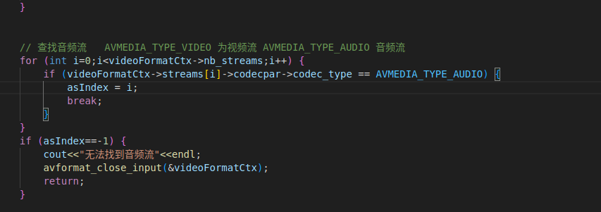

# 整体项目结构
**transcode.cpp**                 为入口程序

**lib/include/manageAll.h**       为管理全局变量和函数以及参数的头文件

**src/initGlobalVariable.cpp**    为全局变量以及参数的初始化和释放

**src/productionPackage.cpp**     实现了拆分音视频为音频包和视频包的线程

**src/videoAnalysis.cpp**         实现了对视频包进行解码成视频帧的线程

**src/videoFrameEncoding.cpp**    实现了对视频帧重新编码成为视频包的线程

**src/audioAnalysis.cpp**         实现了对音频包进行解码成音频帧的线程

**src/audioFrameEncoding.cpp**    实现了对音频帧重新编码成为音频包的线程

**src/videoOutMP4File.cpp**       实现了重新整合音频包和视频包为MP4文件的线程

**lib/include/queue.h**           队列的声明与实现

**lib/include/circularbuffer.h**  环形缓冲区的声明与实现

# Day3

## 整体架构

分析：我们需要实现6个线程，一个用来获取包，两个分别用于对视频包和音频包进行解码，后面两个分别用于将解码后的包重新编码，最后一个需要将编码后的包重新整合起来，输出mp4文件

## 第一题 添加环形缓冲区

和昨天的添加队列的题目类似，这里的环形缓冲区只是用于进程之间数据的传递，不需要复杂的操作，这里实现了push pop getFront 判满与判空操作

（代码在 lib/include/queue.h）

部分代码：

在修改昨天的代码，替换为环形缓冲区部分的代码的时候，需要注意，这里的环形缓冲区是需要查看是不是满的，如果是满的就需要wait，等待空间空出才可以继续push

## 第二题 第三题 播放转码后的音频和视频，可以正常的听到声音，并且要求音画同步

1.首先和昨天的操作一样，先将音频的部分跑通

参照视频部分的代码，修改跑通音频，其中包括音频解码的线程和音频编码的线程

对于音频解码的线程，可以参考第一天的代码，这里不需要再输出为YUV文件了，只需要将所得到的帧数据PUSH进环形缓冲区就好（注意判断满）

关键代码：

对于音频编码部分的线程，先在全局声明和初始化音频的编码器（后面输出到mp4还需要用到），随后就和视频编码的过程差不多（这里一定要注意编码器的参数），需要注意的点还在于，我们为其手动定义了参数，这和原来的参数不匹配，因此我们需要进行重采样操作。

初始化编码器部分代码（这里使用了AAC格式）：

编码音频帧部分代码(前面是重采样的过程)：

2.将两者整合在一起，并实现音画同步

将音频写入的操作和将视频写入的操作类似，只需要再额外添加一个音频的流就可以控制写入了。本题的难点在于音视频的同步

音视频同步的核心思路：比较两者的pts时间戳，选择目前较小时间戳的帧（可能是视频帧也可能是音频帧）写入。这里要特别注意，因为视频与音频的时间基不同，因此不能够直接进行比较，需要转化一下，确认一下当前所用的时间基，然后使用av_compare_ts进行比较。

核心部分代码：

3.最终效果输出为一个mp4文件

（在resources/第二题和第三题输出结果.mp4）

# 第四题
实现倍速功能

1.视频的倍速：通过调整视频编码器的time_base便可以实现，在这里通过一个简单的全局变量playSpeed来控制，可以为其赋于我们想要的倍数

参数调整代码

实现效果截图（原来是45s，现在提升了两倍 文件在resources/第四题视频倍速播放效果（没有音频）.mp4）：

2.实现音频的倍速：想要和实现视频倍速的做法一样调整时间基和采样率等方法，虽然实现了时间压缩

## 最终效果

生成的文件放在了resources里面了。

录屏之中的最终效果只展示了到第三题的结果  放在了  day3-最终效果.mp4

# Day2

## 修复昨天的工作

**优化点-1** 把编译的库方进来，并修改CMakeLists.txt文件

之前的错误（最后在连接包的时候还得注意顺序，如果顺序不对会出现字符冲突）

./configure后面是一些东西的禁用（disable）和使用（enable），在这里我禁用了动态库，释放了静态库，后面一些是需要编译进来的库/

extra-cflags 是为了防止字符冲突， extra-ldflags是告诉脚本，系统包可以在这里面找

后面就是连接的过程，把各个库都加进去，同时注意顺序把一些最基础的库（libavutil）放在后面，防止字符冲突

**优化点-2** 整理一下昨天的代码，把入口代码之中的许多的东西都封装到其他的文件之中,并为代码添加了注释

**lib/include/manageAll.h** 里面声明了全部的全局变量和一些函数

**src/initGlobalVariable.cpp** 里面包含了全局变量的初始化和全局变量最后的释放

**src/productionPackage.cpp** 里面包含了将包推入队列的整个过程

**src/videoAnalysis.cpp** 里面包含解析视频包的过程

**src/audioAnalysis.cpp** 里面包含解析音频包的过程

## 整体架构

从架构之中我们可以看到，我们需要完成四个线程，一个用来获取包，一个用来解码包，一个用来对解码之后的包进行编码，最后一个将编好和之后的包再转回mp4文件

这里我们需要注意，在第二个和第三个线程之间，并没有标注中间的存储单元，这里我加了一个队列来进行线程之间的数据传递

## 第一题 编写队列代码

这里的队列用于线程之间信息的传递，不需要实现很多复杂的功能，在这里，我只是简单的实现了push pop getfront 以及 判空的操作，这些操作完全足够线程之间的数据传递了

（代码在 lib/include/queue.h ）

代码：

## 第二题 播放转码之后的视频数据

1.首先根据昨天的代码略做改动，第一个线程可以基本不动，第二个线程需要修改一下，不再需要输出YUV文件了，我们把解码之后的视频帧存储到一个队列之中，这里和第一个线程一样，需要注意读写队列时的上锁

代码：

2.对解码后的视频帧进行编码

编码需要使用编码器，不可以使用之前的全局变量的那个videoCodecCtx，那个是解码器，我之前错误了使用了这个，导致可以编译通过，但是就是跑不通过（-22参数错误）

在这里我们需要申请一个编码器，然后对其进行初始化操作（设定参数信息，宽 高 帧率等）

代码：

后面就需要把帧馈入到编码器中（avcodec_send_frame），然后再把编好的包拿回来（avcodec_receive_packet）

最后需要写线程循环，这一部分的进程部分的操作和之前的一样，都是需要将编码后的包push到一个新的队列之中，方便下一个写入mp4文件的进程使用

（这部分一个点要注意，一定要重新缕一下帧的pts，我之前没有注意这点，结果输出了一个4M但是时长却有6个小时的视频文件）

代码

3.写入mp4

因为我们已经有了编码之后的包了，我们只需要打开一个mp4文件（avformat_alloc_output_context2）然后把包写（av_interleaved_write_frame）进去就行

打开文件部分代码：

后面写线程循环就比较简单了，这里只需要读队列就好了，不像之前那样需要需要读旧的，然后写入新的处理之后的数据

写入部分代码（这里要注意，最后写完了需要调用 av_write_trailer(fmt_ctx); 把结束符号写进去，否则的话输出的文件无法打开，会提示，没有可播放的流）

5.结果

生成视频前：（build文件夹之中没有视频）

生成视频后：（build文件夹之中没有生成了视频）

视频播放：视频可以正常的播放

## 第三题 添加旋转效果

这部分内容需要添加到视频解码的线程里面，在获取解码后的帧的时候进行相应的操作，等操作完成之后，再把操作的结果放入队列之中

这部分代码和之前解码视频的时候差不多，有一套固定的流程，可以按照这个流程来写（这里的旋转操作只在这个部分使用，因此就没有定义成全局的部分，当线程结束的时候注意释放资源）

这里有一个小坑，在对参数进行设置的时候对于时间基不可以直接使用原来的videoCodecCtx之中的参数来设置，这里面存储的有0数据，如果设置的话会出现参数不正确的报错（-22）

部分代码：

运行结果：

## 最终运行结果（放在了根目录的录屏文件之中了 day2-最终结果.mp4）

(放在了  day2-最终结果.mp4  之中了)

# Day1

# 分析
**整体架构**：

思路：这里需要三个线程来执行相应的操作，一个线程用来生成包（视频包和音频包），另外两个线程分别用于解析视频包和音频包

**第一步** 需要将ffmpeg编译成为一个单个的包,写了一份代码，执行过程中无报错，但是编译出来的只有几十kb，明显有问题

**第二步** 编写Cmake管理项目，这里直接使用了已经安装好的库进行连接（第一步没有通过）

代码：

**第三步-实现基础的功能** 首先需要先跑通可以正常生成YUV文件以及生成pcm音频的代码

生成YUV的代码可以复用 3月4号的 生成YUV文件的代码

生成pcm音频的代码也可以稍微复用一下，需要改动的小点在于

a.在查找流的时候需要修改参数，之前查找的是视频流，现在需要查找音频流 AVMEDIA_TYPE_AUDIO 

b.输出音频需要先设置一个音频采样器，并初始化其各种参数（声道布局，采样率以及采样格式）

c.在解析包的时候，都是一些固定的操作（重采样输出缓冲区，执行重采样，以及写入的操作）

**第四步-实现改成多线程同步操作-1包上传** 将原始的代码修改成多线程的同步的操作 

首先需要将一些变量声明为全局的变量来使用

在获取包的时候，需要稍作改动，将video与audio的操作放在一起，对一些全局的变量进行初始化操作

部分代码

后面就是上传包到两个队列之中（通过流index可以判断是那个包，上传的过程中要加锁防止多线程占用）

**第四步-实现改成多线程同步操作-2解析包** 

解析视频包的过程可以直接复用之前的代码，需要注意的是要wait和加锁！！

解析音频包的时候需要作一下改动， 初始化音频重采样器 的时候要确保audioCodecCtx有（这里是先wait，等到初始化完成之后再唤醒，后面的操作就一样了）

# 最后运行

使用了手机录制（声音可能有点小）

