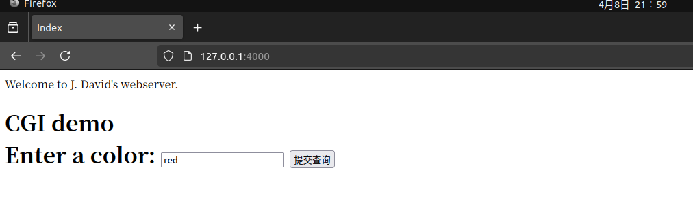
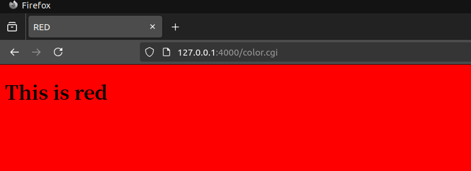
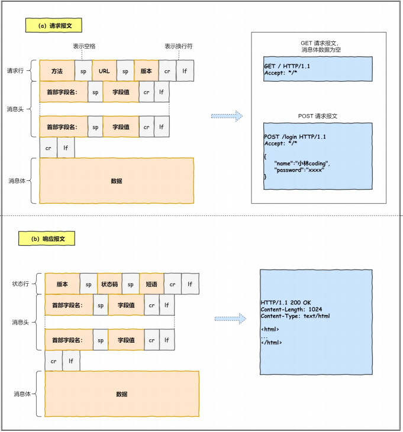
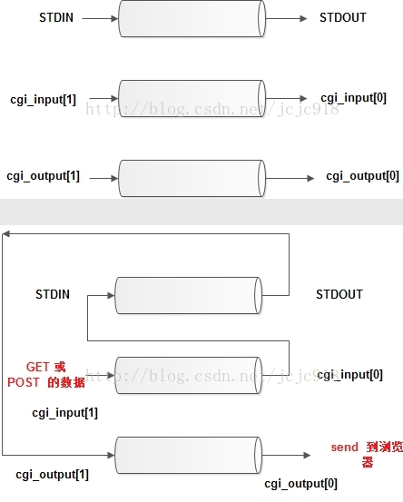

# tinyhttpd 项目

写在前面：这个项目是  J. David 大佬 在1999年做出来的，虽然很老旧, 而且手打一遍之后也感觉有些地方可能不适合这么写，但是做完这个项目之后学到的东西有很多很多，如果大家有时间的话，不妨跟着做一做，相信一定会有很大的收获

膜拜大佬！！！

GIT 原始项目地址：https://github.com/EZLippi/Tinyhttpd

我这边加上注释的代码：

# 运行起来

做之前需要先确定自己的环境能够正常把项目运行起来，要不然做的过程之中不知道是自己代码的问题还是环境的问题

我用的Linux ubuntu 提前安装了perl 地址在 /usr/bin/perl(这个可以通过 which perl 命令得到)

GIT 原始项目地址：https://github.com/EZLippi/Tinyhttpd

1.克隆下来，解压 这个不必对多说

2.执行make命令
- 会生成 httpd 与 client (会有一些警告，不必在意)

3.执行httpd(./httpd)
- 这个时候浏览器输入 http://127.0.0.1:4000 会发现 没有东西
- 这需要修改资源文件(htdocs里面的CGI文件)

4.修改资源文件
- 两个CGI文件的路径 perl 
  - 两个文件的第一行都有 #!/usr/local/bin/perl -Tw 把这改成咱们自己的，我的是 /usr/bin/perl
- 修改资源文件权限
  - 修改一下 index.html 的权限
  - sudo chmod 600 index.html
  - 要为 check.cgi color.cgi 添加可执行的权限
  - sudo chmod +x check.cgi
  - sudo chmod +x color.cgi

5.正常运行起来





# tinyhttpd

无论怎么说，还是得自己对着做一遍的 ： )

重写顺序：main -> startup -> accept_request -> get_line -> serve_file -> cat -> execute_cgi

可以按照上面这个顺序来写，其他的函数可知看一看，直接复制上来就好

## 前置知识

- Socket 网络变成
- 计算机网络 TCP HTTP
- 进程之间的通信

要理解HTTP报文，这个很重要，要不然代码可能会看不懂(注意请求报文和响应报文，两者不一样)



## 代码解读

按照上面的顺序来

```cpp
// 对收到的请求进行处理，每次受到请求都会创建一个新的线程来做处理
// 这个就是定义的线程函数，void * 其实是用来接收 client_sock 的
// 其实这里我觉得使用int 来接收可能更好一些，可能原作者有一些其他的想法
void accept_request(void *);

// 处理一些错误的请求
void bad_request(int);

// 读取文件操作
void cat(int,FILE *);

// 无法执行的错误操作
void cannot_execute(int);

// 错误输出
void error_die(const char *);

// 执行CIG脚本 // 如果没接触CIG也没关系，CIG可以直接用人家的，咱们第一次学的话就先学习网络的操作，后续想要加深理解可以学一下CIG
void execute_cgi(int, const char *, const char *, const char *);

// 得到一行数据 这里要注意看里面咋操作的
int get_line(int, char *, int);

// 返回http头
void headers(int, const char *);

// 没有发现文件
void not_found(int);

//如果不是CGI文件，直接读取文件返回给请求的http客户端
void serve_file(int, const char *);

//开启tcp连接，绑定端口等操作
int startup(unsigned short *);

//如果不是Get或者Post，就报方法没有实现
void unimplemented(int);
```

### mian()

这个很简单，就是一些服务器，客户端的基础操作，服务端在startup函数里面初始化，后面是客户端链接的过程，链接之后会使用 pthread_create 创建一个线程来处理，处理函数是 accept_request

```cpp
int main(){

    int server_sock = -1;
    unsigned short port = 4000;
    int client_sock = -1;
    struct sockaddr_in client_name;
    // 注意这个类型哈,因为后面要取地，所以不能是size_t 或者 int 等其他类型 (函数就是这么定义的)
    socklen_t client_name_len = sizeof(client_name);

    // 线程
    pthread_t newthread;

    server_sock = startup(&port);
    printf("httpd running on port %d\n", port);

    while(1){
        //socket - accept
        client_sock = accept(server_sock,(struct sockaddr *)&client_name,&client_name_len);
        if(client_sock == -1){ // 没accept到，错误处理
            error_die("accept");
        }

        //后面加一个线程来处理这个HTTP请求
        if(pthread_create(&newthread,NULL,(void*)accept_request,(void *)(intptr_t)client_sock)!=0){
            perror("pthread_create");
        }
    }

    close(server_sock);

    return 0;
}
```


### startup

开启tcp连接，绑定端口等操作, 就是TCP服务器部分的基本操作

套接字 -> 绑定 -> 监听 -> 返回描述符

```cpp
int startup(unsigned short *port){

    int httpd = 0; //serverFd
    int on = 1;
    struct sockaddr_in name;
    // 套接字
    httpd = socket(PF_INET,SOCK_STREAM,IPPROTO_TCP);
    if (httpd == -1){
        error_die("socket");
    }
    // 清空一下内容 后面再赋值
    memset(&name, 0, sizeof(name));
    name.sin_family = AF_INET;
    name.sin_port = htons(*port); //小端转大端
    name.sin_addr.s_addr = htonl(INADDR_ANY); //本地能使用的IP地址都行
    // 这个是为了复用端口的，其实有没有都可以，不太重要
    if ((setsockopt(httpd, SOL_SOCKET, SO_REUSEADDR, &on, sizeof(on))) < 0) {  
        error_die("setsockopt failed");
    }
    // 绑定操作
    if(bind(httpd,(struct sockaddr *)&name,sizeof(name))<0){
        error_die("bind");
    }
    // 如果没有提供端口，系统会分配一个端口
    if (*port == 0)  /* if dynamically allocating a port */
    {
        socklen_t namelen = sizeof(name);
        if (getsockname(httpd, (struct sockaddr *)&name, &namelen) == -1)
            error_die("getsockname");
        *port = ntohs(name.sin_port);
    }
    // 监听
    if (listen(httpd, 5) < 0){
        error_die("listen");
    }  

    return httpd;
}
```

### accept_request

处理请求的线程函数 

这里先不管 get_line 等其他函数 先知道他是干啥的就行了

下面代码写了注释，可以看的很清楚

这里一定要记得HTTP请求报文的报文头

第一行：方法（post get ..） + 空格 + URL + 空格 + 版本 + ‘\r\n’

这里要注意这一行：sprintf(path, "../htdocs%s", url);

要把地址找对，我自己这边习惯用cmake，所以一般会建一个build文件夹来存储一些中间文件，生成的可执行程序也在build文件夹之中，因此要找到与build文件夹同级的htdocs，得用../htdocs


```cpp
void accept_request(void *arg){
    int client = (intptr_t)arg; // clientFd
    char buf[1024];      //缓冲区
    size_t numchars;     //存储get_line返回的第一行的长度
    char method[255];    //存储请求的方法，这里只支持两种 POST与GET
    char url[255];       //存储URL
    char path[512];      //存储路径 就是资源文件的路径 咱们这里的资源文件存储到 htdocs 里面了
    size_t i, j;
    struct stat st;
    int cgi = 0;         //一个标志，看需不需要调用 CGI 程序
    char *query_string = NULL;

    numchars = get_line(client, buf, sizeof(buf));
    i = 0;j = 0;
    // 注意这里一定要对这HTTP报文头来看，HTTP 请求报文第一行 方法（post get ..） + 空格 + URL + 空格 + 版本 + ‘\r\n’
    while(!ISspace(buf[i]) && (i < sizeof(method)-1)){
        method[i] = buf[i];
        i++;
    }
    j=i;  // 保存一下现在的位置
    method[i] = '\0';  // 字符串结束符号

    // strcasecmp 这个就不过多解释了，忽略大小写比较字符串，等于0的时候表示两个字符串在忽略大小写的时候完全相等
    if(strcasecmp(method, "GET") && strcasecmp(method, "POST")){
        // 这里就只有GET 和 POST两种请求，其他的不支持
        unimplemented(client);
        return;
    }

    // 如果是POST，cgi置为1 需要运行CGI脚本
    if (strcasecmp(method, "POST") == 0){
        cgi = 1;
    }

    // 跳过着一个空格
    while(ISspace(buf[j]) && (j < numchars)){
        j++;
    }

    //要处理下一个东西了 URL
    //再强调一下HTTP请求报文的第一行  HTTP 请求报文第一行 方法（post get ..） + 空格 + URL + 空格 + 版本 + ‘\r\n’
    i = 0; 
    // 还是一样的操作，先把url拿过来
    while(!ISspace(buf[j]) && (i < sizeof(url) - 1) && (j < numchars)){
        url[i] = buf[j];
        i++;j++;
    }
    url[i] = '\0';

    //http://127.0.0.1:9734/
    //http://127.0.0.1:9734/color.cgi?color=red  
    //注意哈，前面是IP + 端口 不是 url 内部 哈 这个 第二个实际发送的是 实际客户发送的为 GET /color.cgi?color=red HTTP/1.1 记得看一下HTTP请求报文头
    //处理get请求，get请求如果不带参数就是上面第一种，get请求如果带参数就是上面第二种，参数放在?后面，color=red 参数名=参数值
    if (strcasecmp(method, "GET") == 0){
        query_string = url;
        //找一下?的位置 或者没有的话就到结尾了
        while ((*query_string != '?') && (*query_string != '\0')){
            query_string++;
        }
        // 处理一下带参数的get请求
        if(*query_string == '?'){
            cgi = 1; // 带参数就得调用CGI脚本了
            *query_string = '\0'; // 注意这里把url给截断了 ? 改成 '\0' 表示结尾 color.cgi?color=red - > color.cgi
            query_string++;
        }
    }

    //把地址拿一下，注意以下htdocs是相对地址哈，我的可执行文件放在了build里面了，build与htdocs同级，所以是
    sprintf(path, "../htdocs%s", url);   //还是拿上面第一个和第二个例子距离，如果没有参数 那么路径为 ../htdocs/  有参数则为../htdocs/color.cgi(因此这个需要cgi = 1)
    if(path[strlen(path)-1] == '/'){     //无参的情况
        strcat(path, "index.html");      //把咱们的初始界面 index.html 加上 然后 返回去给客户端
    }
    if (stat(path, &st) == -1) { // stat 失败（文件或者目录不存在） stat 成功返回 0 反之 返回 -1
        // 读取并丢弃剩余的请求头（直到空行）销毁报文头 返回 404 就好了
        while ((numchars > 0) && strcmp("\n", buf)){  // 注意：HTTP 头以 \r\n 结尾
            numchars = get_line(client, buf, sizeof(buf));
        }
        not_found(client); // 发送 404 Not Found
    }else{
        // 这里再次判断是个目录还是文件 详细的看一下struct stat 了解一下，这里就不多介绍了
        // 知道这是一个判断目录还是文件的操作就好了
        if ((st.st_mode & S_IFMT) == S_IFDIR){ 
            strcat(path, "/index.html"); //还是一样的操作，是目录就加上 index.html 
        }
        // 检查文件是否有执行权限（任意用户组）
        if ((st.st_mode & S_IXUSR) ||    //检查所有者是否有执行权限。
            (st.st_mode & S_IXGRP) ||    //检查组是否有执行权限。
            (st.st_mode & S_IXOTH)    ){ //检查其他人是否有执行权限
                cgi = 1;
            }
        if (!cgi){
            //接读取文件返回给请求的http客户端
            serve_file(client, path); 
        }else{
             //执行cgi文件
            execute_cgi(client, path, method, query_string);
        }
    }

    //执行完毕关闭socket
    close(client);
}
```

### get_line

得到一行HTTP报文数据

这里再强调一下HTTP请求报文的报文头

报文头的每一行都是以 '\r\n' 结尾的

```cpp
int get_line(int sock, char *buf, int size){
    int i = 0;
    char c = '\0';
    int n;
    // '\n'就换行了
    while((i < size - 1)&&(c != '\n')){
        //一个字节一个字节的接收
        n = recv(sock, &c , 1 ,0);
        if(n > 0){ // 判断是否接收成功
            // 处理回车符 '\r' // 注意：看一下HTTP报文，每一个行的结尾是'\r\n'
            if (c == '\r'){
                // 注意这里 这里的参数是 MSG_PEEK，这指的是‘窥探’ 只是看一下，并不会拿出来
                // 下一次再调用recv的话，取出的还是那个字符   ！！！‘窥探’ 
                n = recv(sock, &c, 1, MSG_PEEK);
                if((n > 0) && (c == '\n')){
                    recv(sock, &c, 1, 0);
                }else{
                    c = '\n';
                }
            }
            buf[i] = c;
            i++;
        }else{
            c = '\n';
        }
    }
    //最后加上 ‘\0’ 结束符
    buf[i] = '\0';

    return i;
}
```

### serve_file

这个主要针对那些没有参数的，不需要运行CGI脚本的请求，这些请求一般只会请求一些文件，咱们直接把请求的文件传递过去就行了

```cpp
void serve_file(int client, const char *filename){
    FILE *resource = NULL;
    int numchars = 1;
    char buf[1024];

    buf[0] = 'A'; buf[1] = '\0';
    while ((numchars > 0) && strcmp("\n", buf)){ /* read & discard headers */
        //后面就销毁头部其他的信息就好了，反正已经知道要返回什么了，并且也知道client客户端的信息，没必要再保留请求报文头了
        numchars = get_line(client, buf, sizeof(buf));
    }

    resource = fopen(filename, "r"); //以读的方式打开文件
    if (resource == NULL){  //打开失败
        not_found(client); 
    }else{
        headers(client, filename); //组合响应报文头  //这里一定要对着响应报文看一看呀
        cat(client, resource);     //把文件传过去
    }
    fclose(resource);
}
```

###  cat

就是传文件的过程

```cpp
void cat(int client, FILE *resource)
{
    // 这里就不说了，基本的文件操作
    char buf[1024];

    fgets(buf, sizeof(buf), resource);  // 获取文件
    while (!feof(resource))             // 只要没到文件结尾
    {
        send(client, buf, strlen(buf), 0);  // 一直send
        fgets(buf, sizeof(buf), resource);  //再拿
    }
}
```

### execute_cgi

这个是用来处理那些带参的，需要运行CGI脚本的请求

注意：POST 和 GET 请求是不一样的，GET请求会直接将参数附带到URL之中 ?query=dsada POST的话得看HTTP报文消息体数据

这里的处理是，父进程负责读POST请求的参数将参数传递到管道之中，子进程通过管道拿到参数(如果是GET请求的话就不需要拿了)负责运行CGI脚本，将脚本结果传递到管道，父进程再拿到数据，然后send除去


    父进程
    │
    ├─ 创建管道 cgi_input 和 cgi_output
    ├─ fork()
    │  ├─ 子进程
    │  │  ├─ dup2(cgi_output[1], STDOUT)  // 输出重定向
    │  │  ├─ dup2(cgi_input[0], STDIN)    // 输入重定向
    │  │  ├─ close(cgi_output[0])         // 关闭无关端
    │  │  ├─ close(cgi_input[1])
    │  │  ├─ 设置环境变量（REQUEST_METHOD等）
    │  │  └─ execl(path)                  // 执行CGI脚本
    │  │
    │  └─ 父进程
    │     ├─ close(cgi_output[1])         // 关闭无关端
    │     ├─ close(cgi_input[0])
    │     ├─ 向cgi_input[1]写入POST数据
    │     └─ 从cgi_output[0]读取CGI输出
    

```cpp

void execute_cgi(int client, const char *path,
    const char *method, const char *query_string){
    
    char buf[1024];            // 缓冲区，用于读取请求头或临时数据
    int cgi_output[2];         // 管道，子进程写输出，父进程读
    int cgi_input[2];          // 管道，父进程写输入，子进程读
    pid_t pid;                 // 进程 ID
    int status;                // 子进程退出状态
    int i;                     // 循环计数器
    char c;                    // 临时字符
    int numchars = 1;          // 记录读取的行数
    int content_length = -1;   // POST 请求的内容长度

    buf[0] = 'A'; buf[1] = '\0';
    if (strcasecmp(method, "GET") == 0){
        //同理，GET请求不需要那些有的没的 client 有客户端的信息 path有请求的文件，method有请求的方法 query_string有请求的参数
        //剩下的头就没必要用了
        while ((numchars > 0) && strcmp("\n", buf)){
            numchars = get_line(client, buf, sizeof(buf));
        }
    }else if(strcasecmp(method, "POST") == 0){ //POST 这才是麻烦的 因为 这个没能获取参数，参数在 请求报文里面
        numchars = get_line(client, buf, sizeof(buf));
        while ((numchars > 0) && strcmp("\n", buf)){ // 一样的用法 遍历 请求报文
            buf[15] = '\0'; // 截断字符串，检查是否是 "Content-Length:"(Content-Length:字符串长度为15哈)
            if (strcasecmp(buf, "Content-Length:") == 0){
                content_length = atoi(&(buf[16]));  //注意这里哈atoi是将字符串转int的函数，这里&(buf[16])不是取 第16个字符和  第16个字符是数字字符串的开始地址
            }
            numchars = get_line(client, buf, sizeof(buf));
            // 上面的我举个例子：这一行报文头的内容是(首部字段名 + 空格 + 值 + '\r\n') 
            // Content-Length: 1234  那么将buf[15] = '\0' 则分成了两个串 Content-Length: 与 1234 1234的起始地址为buf[16]
        }
        if (content_length == -1) { //同样的处理异常情况
            bad_request(client);
            return;
        }
    }else{ //其他请求，这里暂时不支持哈
        unimplemented(client);
        return;
    }

    // 管道创建失败，返回 500 错误
    if (pipe(cgi_output) < 0) {
        cannot_execute(client);
        return;
    }
    if (pipe(cgi_input) < 0) {
        cannot_execute(client);
        return;
    }

    if ((pid = fork()) < 0) {
        cannot_execute(client);  // fork 失败，返回 500 错误
        return;
    }

    // 这里发送了200的信息，其实不应该的，应该执行完CGI再发的，毕竟执行的时候可能会出现错误
    sprintf(buf, "HTTP/1.0 200 OK\r\n");
    send(client, buf, strlen(buf), 0);
    if (pid == 0) {  // 子进程
        char meth_env[255];
        char query_env[255];
        char length_env[255];
        // cgi_output这个pipe的写端，重定向到标准输出流，
        // 即cgi脚本的控制台输出，会传递到cgi_output这个pipe中。
        // 后续父进程可以从cgi_output里读cgi脚本处理结果
        dup2(cgi_output[1], STDOUT); //这里是啥意思呢？简单举个例子：咱们的执行的CGI文件应该是输出到控制台的也就是STDOUT，现在把STDOUT与管道的cgi_output[1]链接在一起，也就是会写到管道里面
        // cgi_input这个pipe的读端，重定向到标准输入流。
        // 这意味着以后从标准输入读取数据时，实际上是从cgi_input这个pipe中读取数据。
        // 后续父进程向cgi_input里写入数据，等于向标准输入流写入数据
        dup2(cgi_input[0], STDIN);   //这个也是一样的STDIN标准输入，现在他也接受cgi_input[0]的输入//这个例子还是不太清楚，我写的可能也有点模糊，README之中有个图，参考理解一下
        //在子进程中，关闭另外2个pipe的端口
        close(cgi_output[0]);
        close(cgi_input[1]);
        //写入新的环境变量，用于后续cgi脚本使用
        sprintf(meth_env, "REQUEST_METHOD=%s", method);
        putenv(meth_env);
        if (strcasecmp(method, "GET") == 0) { //get
            sprintf(query_env, "QUERY_STRING=%s", query_string);
            putenv(query_env);
        }
        else {   /* POST */
            sprintf(length_env, "CONTENT_LENGTH=%d", content_length);
            putenv(length_env);
        }
        //替换后续代码的进程镜像，执行cgi脚本。
        execl(path,path, NULL);
        //int m = execl(path, path, NULL);
        //如果path有问题，例如将html网页改成可执行的，但是执行后m为-1
        //退出子进程，管道被破坏，但是父进程还在往里面写东西，触发Program received signal SIGPIPE, Broken pipe.
        exit(0);
    }else {    /* parent */
        //关闭无用管道口
        close(cgi_output[1]);
        close(cgi_input[0]);
        //父进程拿参数 输入的 管道 再让子进程 拿
        //得到post请求数据，写到input管道中，供子进程使用
        //其实是向标准输入流写数据，cgi脚本会从标准输入流，获取post协议携带的数据，做出处理。
        //考虑父子进程启动顺序问题
        /**
         * 1. 父进程先启动，则post协议数据被存入标准输入流，等待子进程启动后，调用cgi脚本，脚本从标准输入流得到post数据
         * 2. 子进程先启动，则需要从标准输入得到数据的cgi脚本，需要阻塞等待，直到父进程把post数据填入标准输入流。
         */
        if (strcasecmp(method, "POST") == 0){
            for (i = 0; i < content_length; i++) {
                recv(client, &c, 1, 0);
                write(cgi_input[1], &c, 1);
            }
        }
        //从output管道读到子进程处理后的信息，然后send出去
        //其实是cgi脚本运行后，向控制台打印的标准输出流，被重定向到cgi_output这个pipe里。
        //因此父进程是截获了cgi脚本的运行结果，转发给http客户端了。
        while (read(cgi_output[0], &c, 1) > 0){
            send(client, &c, 1, 0);
        }
        //完成操作后关闭管道
        close(cgi_output[0]);
        close(cgi_input[1]);
        waitpid(pid, &status, 0);
    }
}
```

这里整体看来其实没什么大问题，但是管道那部分比较难理解，下面是GIT官方源码里面给的图，配合这个图就很好理解了（官方的图实效了，不知道咋回事，在这里找到的https://www.cnblogs.com/pluviophile/p/7440529.html）




# 总体代码：

https://github.com/zqzhang2023/zzqStudy

```cpp
#include <stdio.h>
#include <sys/socket.h>
#include <sys/types.h>
#include <netinet/in.h>
#include <arpa/inet.h>
#include <unistd.h>
#include <ctype.h>
#include <strings.h>
#include <string.h>
#include <sys/stat.h>
#include <pthread.h>
#include <sys/wait.h>
#include <stdlib.h>
#include <stdint.h>
#include <linux/stat.h>

#define ISspace(x) isspace((int) x)

#define SERVER_STRING "Server: jdbhttpd/0.1.0\r\n"
#define STDIN   0
#define STDOUT  1
#define STDERR  2

// 对收到的请求进行处理，每次受到请求都会创建一个新的线程来做处理
// 这个就是定义的线程函数，void * 其实是用来接收 client_sock 的
// 其实这里我觉得使用int 来接收可能更好一些，可能原作者有一些其他的想法
void accept_request(void *);

// 处理一些错误的请求
void bad_request(int);

// 读取文件操作
void cat(int,FILE *);

// 无法执行的错误操作
void cannot_execute(int);

// 错误输出
void error_die(const char *);

// 执行CIG脚本 // 如果没接触CIG也没关系，CIG可以直接用人家的，咱们第一次学的话就先学习网络的操作，后续想要加深理解可以学一下CIG
void execute_cgi(int, const char *, const char *, const char *);

// 得到一行数据 这里要注意看里面咋操作的
int get_line(int, char *, int);

// 返回http头
void headers(int, const char *);

// 没有发现文件
void not_found(int);

//如果不是CGI文件，直接读取文件返回给请求的http客户端
void serve_file(int, const char *);

//开启tcp连接，绑定端口等操作
int startup(unsigned short *);

//如果不是Get或者Post，就报方法没有实现
void unimplemented(int);

// 下面是一些功能性的函数，包括错误处理等，这个挺好理解的，但是要看一看
/**********************************************************************/
/* Inform the client that a request it has made has a problem.
 * Parameters: client socket */
/**********************************************************************/
void bad_request(int client)
{
    char buf[1024];

    sprintf(buf, "HTTP/1.0 400 BAD REQUEST\r\n");
    send(client, buf, sizeof(buf), 0);
    sprintf(buf, "Content-type: text/html\r\n");
    send(client, buf, sizeof(buf), 0);
    sprintf(buf, "\r\n");
    send(client, buf, sizeof(buf), 0);
    sprintf(buf, "<P>Your browser sent a bad request, ");
    send(client, buf, sizeof(buf), 0);
    sprintf(buf, "such as a POST without a Content-Length.\r\n");
    send(client, buf, sizeof(buf), 0);
}

/**********************************************************************/
/* Inform the client that a CGI script could not be executed.
 * Parameter: the client socket descriptor. */
/**********************************************************************/
void cannot_execute(int client)
{
    char buf[1024];

    sprintf(buf, "HTTP/1.0 500 Internal Server Error\r\n");
    send(client, buf, strlen(buf), 0);
    sprintf(buf, "Content-type: text/html\r\n");
    send(client, buf, strlen(buf), 0);
    sprintf(buf, "\r\n");
    send(client, buf, strlen(buf), 0);
    sprintf(buf, "<P>Error prohibited CGI execution.\r\n");
    send(client, buf, strlen(buf), 0);
}

/**********************************************************************/
/* Return the informational HTTP headers about a file. */
/* Parameters: the socket to print the headers on
 *             the name of the file */
/**********************************************************************/
void headers(int client, const char *filename)
{
    char buf[1024];
    (void)filename;  /* could use filename to determine file type */

    strcpy(buf, "HTTP/1.0 200 OK\r\n");
    send(client, buf, strlen(buf), 0);
    strcpy(buf, SERVER_STRING);
    send(client, buf, strlen(buf), 0);
    sprintf(buf, "Content-Type: text/html\r\n");
    send(client, buf, strlen(buf), 0);
    strcpy(buf, "\r\n");
    send(client, buf, strlen(buf), 0);
}

/**********************************************************************/
/* Give a client a 404 not found status message. */
/**********************************************************************/
void not_found(int client)
{
    char buf[1024];

    sprintf(buf, "HTTP/1.0 404 NOT FOUND\r\n");
    send(client, buf, strlen(buf), 0);
    sprintf(buf, SERVER_STRING);
    send(client, buf, strlen(buf), 0);
    sprintf(buf, "Content-Type: text/html\r\n");
    send(client, buf, strlen(buf), 0);
    sprintf(buf, "\r\n");
    send(client, buf, strlen(buf), 0);
    sprintf(buf, "<HTML><TITLE>Not Found</TITLE>\r\n");
    send(client, buf, strlen(buf), 0);
    sprintf(buf, "<BODY><P>The server could not fulfill\r\n");
    send(client, buf, strlen(buf), 0);
    sprintf(buf, "your request because the resource specified\r\n");
    send(client, buf, strlen(buf), 0);
    sprintf(buf, "is unavailable or nonexistent.\r\n");
    send(client, buf, strlen(buf), 0);
    sprintf(buf, "</BODY></HTML>\r\n");
    send(client, buf, strlen(buf), 0);
}


/**********************************************************************/
/* Inform the client that the requested web method has not been
 * implemented.
 * Parameter: the client socket */
/**********************************************************************/
void unimplemented(int client)
{
    char buf[1024];

    sprintf(buf, "HTTP/1.0 501 Method Not Implemented\r\n");
    send(client, buf, strlen(buf), 0);
    sprintf(buf, SERVER_STRING);
    send(client, buf, strlen(buf), 0);
    sprintf(buf, "Content-Type: text/html\r\n");
    send(client, buf, strlen(buf), 0);
    sprintf(buf, "\r\n");
    send(client, buf, strlen(buf), 0);
    sprintf(buf, "<HTML><HEAD><TITLE>Method Not Implemented\r\n");
    send(client, buf, strlen(buf), 0);
    sprintf(buf, "</TITLE></HEAD>\r\n");
    send(client, buf, strlen(buf), 0);
    sprintf(buf, "<BODY><P>HTTP request method not supported.\r\n");
    send(client, buf, strlen(buf), 0);
    sprintf(buf, "</BODY></HTML>\r\n");
    send(client, buf, strlen(buf), 0);
}

/**********************************************************************/
/* Print out an error message with perror() (for system errors; based
 * on value of errno, which indicates system call errors) and exit the
 * program indicating an error. */
/**********************************************************************/
void error_die(const char *sc)
{
    perror(sc);
    exit(1);
}

// 下面是比较重要的一些操作，仔细看，对着重写一遍，了解过程，细节
/**********************************************************************/
/* This function starts the process of listening for web connections
 * on a specified port.  If the port is 0, then dynamically allocate a
 * port and modify the original port variable to reflect the actual
 * port.
 * Parameters: pointer to variable containing the port to connect on
 * Returns: the socket */
/**********************************************************************/
int startup(unsigned short *port){

    int httpd = 0; //serverFd
    int on = 1;
    struct sockaddr_in name;
    // 套接字
    httpd = socket(PF_INET,SOCK_STREAM,IPPROTO_TCP);
    if (httpd == -1){
        error_die("socket");
    }
    // 清空一下内容 后面再赋值
    memset(&name, 0, sizeof(name));
    name.sin_family = AF_INET;
    name.sin_port = htons(*port); //小端转大端
    name.sin_addr.s_addr = htonl(INADDR_ANY); //本地能使用的IP地址都行
    // 这个是为了复用端口的，其实有没有都可以，不太重要
    if ((setsockopt(httpd, SOL_SOCKET, SO_REUSEADDR, &on, sizeof(on))) < 0) {  
        error_die("setsockopt failed");
    }
    // 绑定操作
    if(bind(httpd,(struct sockaddr *)&name,sizeof(name))<0){
        error_die("bind");
    }
    // 如果没有提供端口，系统会分配一个端口
    if (*port == 0)  /* if dynamically allocating a port */
    {
        socklen_t namelen = sizeof(name);
        if (getsockname(httpd, (struct sockaddr *)&name, &namelen) == -1)
            error_die("getsockname");
        *port = ntohs(name.sin_port);
    }
    // 监听
    if (listen(httpd, 5) < 0){
        error_die("listen");
    }  

    return httpd;
}

/**********************************************************************/
/* Get a line from a socket, whether the line ends in a newline,
 * carriage return, or a CRLF combination.  Terminates the string read
 * with a null character.  If no newline indicator is found before the
 * end of the buffer, the string is terminated with a null.  If any of
 * the above three line terminators is read, the last character of the
 * string will be a linefeed and the string will be terminated with a
 * null character.
 * Parameters: the socket descriptor
 *             the buffer to save the data in
 *             the size of the buffer
 * Returns: the number of bytes stored (excluding null) */
/**********************************************************************/
int get_line(int sock, char *buf, int size){
    int i = 0;
    char c = '\0';
    int n;
    // '\n'就换行了
    while((i < size - 1)&&(c != '\n')){
        //一个字节一个字节的接收
        n = recv(sock, &c , 1 ,0);
        if(n > 0){ // 判断是否接收成功
            // 处理回车符 '\r' // 注意：看一下HTTP报文，每一个行的结尾是'\r\n'
            if (c == '\r'){
                // 注意这里 这里的参数是 MSG_PEEK，这指的是‘窥探’ 只是看一下，并不会拿出来
                // 下一次再调用recv的话，取出的还是那个字符   ！！！‘窥探’ 
                n = recv(sock, &c, 1, MSG_PEEK);
                if((n > 0) && (c == '\n')){
                    recv(sock, &c, 1, 0);
                }else{
                    c = '\n';
                }
            }
            buf[i] = c;
            i++;
        }else{
            c = '\n';
        }
    }
    //最后加上 ‘\0’ 结束符
    buf[i] = '\0';

    return i;
}

/**********************************************************************/
/* Put the entire contents of a file out on a socket.  This function
 * is named after the UNIX "cat" command, because it might have been
 * easier just to do something like pipe, fork, and exec("cat").
 * Parameters: the client socket descriptor
 *             FILE pointer for the file to cat */
/**********************************************************************/
void cat(int client, FILE *resource)
{
    // 这里就不说了，基本的文件操作
    char buf[1024];

    fgets(buf, sizeof(buf), resource);  // 获取文件
    while (!feof(resource))             // 只要没到文件结尾
    {
        send(client, buf, strlen(buf), 0);  // 一直send
        fgets(buf, sizeof(buf), resource);  //再拿
    }
}

/**********************************************************************/
/* Send a regular file to the client.  Use headers, and report
 * errors to client if they occur.
 * Parameters: a pointer to a file structure produced from the socket
 *              file descriptor
 *             the name of the file to serve */
/**********************************************************************/
//如果不是CGI文件，直接读取文件返回给请求的http客户端
void serve_file(int client, const char *filename){
    FILE *resource = NULL;
    int numchars = 1;
    char buf[1024];

    buf[0] = 'A'; buf[1] = '\0';
    while ((numchars > 0) && strcmp("\n", buf)){ /* read & discard headers */
        //后面就销毁头部其他的信息就好了，反正已经知道要返回什么了，并且也知道client客户端的信息，没必要再保留请求报文头了
        numchars = get_line(client, buf, sizeof(buf));
    }

    resource = fopen(filename, "r"); //以读的方式打开文件
    if (resource == NULL){  //打开失败
        not_found(client); 
    }else{
        headers(client, filename); //组合响应报文头  //这里一定要对着响应报文看一看呀
        cat(client, resource);     //把文件传过去
    }
    fclose(resource);
}

/**********************************************************************/
/* Execute a CGI script.  Will need to set environment variables as
 * appropriate.
 * Parameters: client socket descriptor
 *             path to the CGI script */
/**********************************************************************/
void execute_cgi(int client, const char *path,
    const char *method, const char *query_string){
    
    char buf[1024];            // 缓冲区，用于读取请求头或临时数据
    int cgi_output[2];         // 管道，子进程写输出，父进程读
    int cgi_input[2];          // 管道，父进程写输入，子进程读
    pid_t pid;                 // 进程 ID
    int status;                // 子进程退出状态
    int i;                     // 循环计数器
    char c;                    // 临时字符
    int numchars = 1;          // 记录读取的行数
    int content_length = -1;   // POST 请求的内容长度

    buf[0] = 'A'; buf[1] = '\0';
    if (strcasecmp(method, "GET") == 0){
        //同理，GET请求不需要那些有的没的 client 有客户端的信息 path有请求的文件，method有请求的方法 query_string有请求的参数
        //剩下的头就没必要用了
        while ((numchars > 0) && strcmp("\n", buf)){
            numchars = get_line(client, buf, sizeof(buf));
        }
    }else if(strcasecmp(method, "POST") == 0){ //POST 这才是麻烦的 因为 这个没能获取参数，参数在 请求报文里面
        numchars = get_line(client, buf, sizeof(buf));
        while ((numchars > 0) && strcmp("\n", buf)){ // 一样的用法 遍历 请求报文
            buf[15] = '\0'; // 截断字符串，检查是否是 "Content-Length:"(Content-Length:字符串长度为15哈)
            if (strcasecmp(buf, "Content-Length:") == 0){
                content_length = atoi(&(buf[16]));  //注意这里哈atoi是将字符串转int的函数，这里&(buf[16])不是取 第16个字符和  第16个字符是数字字符串的开始地址
            }
            numchars = get_line(client, buf, sizeof(buf));
            // 上面的我举个例子：这一行报文头的内容是(首部字段名 + 空格 + 值 + '\r\n') 
            // Content-Length: 1234  那么将buf[15] = '\0' 则分成了两个串 Content-Length: 与 1234 1234的起始地址为buf[16]
        }
        if (content_length == -1) { //同样的处理异常情况
            bad_request(client);
            return;
        }
    }else{ //其他请求，这里暂时不支持哈
        unimplemented(client);
        return;
    }

    // 管道创建失败，返回 500 错误
    if (pipe(cgi_output) < 0) {
        cannot_execute(client);
        return;
    }
    if (pipe(cgi_input) < 0) {
        cannot_execute(client);
        return;
    }

    if ((pid = fork()) < 0) {
        cannot_execute(client);  // fork 失败，返回 500 错误
        return;
    }

    // 父进程
    // │
    // ├─ 创建管道 cgi_input 和 cgi_output
    // ├─ fork()
    // │  ├─ 子进程
    // │  │  ├─ dup2(cgi_output[1], STDOUT)  // 输出重定向
    // │  │  ├─ dup2(cgi_input[0], STDIN)    // 输入重定向
    // │  │  ├─ close(cgi_output[0])         // 关闭无关端
    // │  │  ├─ close(cgi_input[1])
    // │  │  ├─ 设置环境变量（REQUEST_METHOD等）
    // │  │  └─ execl(path)                 // 执行CGI脚本
    // │  │
    // │  └─ 父进程
    // │     ├─ close(cgi_output[1])        // 关闭无关端
    // │     ├─ close(cgi_input[0])
    // │     ├─ 向cgi_input[1]写入POST数据
    // │     └─ 从cgi_output[0]读取CGI输出
    
    // 这里发送了200的信息，其实不应该的，应该执行完CGI再发的，毕竟执行的时候可能会出现错误
    sprintf(buf, "HTTP/1.0 200 OK\r\n");
    send(client, buf, strlen(buf), 0);
    if (pid == 0) {  // 子进程
        char meth_env[255];
        char query_env[255];
        char length_env[255];
        // cgi_output这个pipe的写端，重定向到标准输出流，
        // 即cgi脚本的控制台输出，会传递到cgi_output这个pipe中。
        // 后续父进程可以从cgi_output里读cgi脚本处理结果
        dup2(cgi_output[1], STDOUT); //这里是啥意思呢？简单举个例子：咱们的执行的CGI文件应该是输出到控制台的也就是STDOUT，现在把STDOUT与管程的cgi_output[1]链接在一起，也就是会写到管程里面
        // cgi_input这个pipe的读端，重定向到标准输入流。
        // 这意味着以后从标准输入读取数据时，实际上是从cgi_input这个pipe中读取数据。
        // 后续父进程向cgi_input里写入数据，等于向标准输入流写入数据
        dup2(cgi_input[0], STDIN);   //这个也是一样的STDIN标准输入，现在他也接受cgi_input[0]的输入//这个例子还是不太清楚，我写的可能也有点模糊，README之中有个图，参考理解一下
        //在子进程中，关闭另外2个pipe的端口
        close(cgi_output[0]);
        close(cgi_input[1]);
        //写入新的环境变量，用于后续cgi脚本使用
        sprintf(meth_env, "REQUEST_METHOD=%s", method);
        putenv(meth_env);
        if (strcasecmp(method, "GET") == 0) { //get
            sprintf(query_env, "QUERY_STRING=%s", query_string);
            putenv(query_env);
        }
        else {   /* POST */
            sprintf(length_env, "CONTENT_LENGTH=%d", content_length);
            putenv(length_env);
        }
        //替换后续代码的进程镜像，执行cgi脚本。
        execl(path,path, NULL);
        //int m = execl(path, path, NULL);
        //如果path有问题，例如将html网页改成可执行的，但是执行后m为-1
        //退出子进程，管道被破坏，但是父进程还在往里面写东西，触发Program received signal SIGPIPE, Broken pipe.
        exit(0);
    }else {    /* parent */
        //关闭无用管道口
        close(cgi_output[1]);
        close(cgi_input[0]);
        //父进程拿参数 输入的 管程 再让子进程 拿
        //得到post请求数据，写到input管道中，供子进程使用
        //其实是向标准输入流写数据，cgi脚本会从标准输入流，获取post协议携带的数据，做出处理。
        //考虑父子进程启动顺序问题
        /**
         * 1. 父进程先启动，则post协议数据被存入标准输入流，等待子进程启动后，调用cgi脚本，脚本从标准输入流得到post数据
         * 2. 子进程先启动，则需要从标准输入得到数据的cgi脚本，需要阻塞等待，直到父进程把post数据填入标准输入流。
         */
        if (strcasecmp(method, "POST") == 0){
            for (i = 0; i < content_length; i++) {
                recv(client, &c, 1, 0);
                write(cgi_input[1], &c, 1);
            }
        }
        //从output管道读到子进程处理后的信息，然后send出去
        //其实是cgi脚本运行后，向控制台打印的标准输出流，被重定向到cgi_output这个pipe里。
        //因此父进程是截获了cgi脚本的运行结果，转发给http客户端了。
        while (read(cgi_output[0], &c, 1) > 0){
            send(client, &c, 1, 0);
        }
        //完成操作后关闭管道
        close(cgi_output[0]);
        close(cgi_input[1]);
        waitpid(pid, &status, 0);
    }


}

/**********************************************************************/
/* A request has caused a call to accept() on the server port to
 * return.  Process the request appropriately.
 * Parameters: the socket connected to the client */
/**********************************************************************/
void accept_request(void *arg){
    int client = (intptr_t)arg; // clientFd
    char buf[1024];      //缓冲区
    size_t numchars;     //存储get_line返回的第一行的长度
    char method[255];    //存储请求的方法，这里只支持两种 POST与GET
    char url[255];       //存储URL
    char path[512];      //存储路径 就是资源文件的路径 咱们这里的资源文件存储到 htdocs 里面了
    size_t i, j;
    struct stat st;
    int cgi = 0;         //一个标志，看需不需要调用 CGI 程序
    char *query_string = NULL;

    numchars = get_line(client, buf, sizeof(buf));
    i = 0;j = 0;
    // 注意这里一定要对这HTTP报文头来看，HTTP 请求报文第一行 方法（post get ..） + 空格 + URL + 空格 + 版本 + ‘\r\n’
    while(!ISspace(buf[i]) && (i < sizeof(method)-1)){
        method[i] = buf[i];
        i++;
    }
    j=i;  // 保存一下现在的位置
    method[i] = '\0';  // 字符串结束符号

    // strcasecmp 这个就不过多解释了，忽略大小写比较字符串，等于0的时候表示两个字符串在忽略大小写的时候完全相等
    if(strcasecmp(method, "GET") && strcasecmp(method, "POST")){
        // 这里就只有GET 和 POST两种请求，其他的不支持
        unimplemented(client);
        return;
    }

    // 如果是POST，cgi置为1 需要运行CGI脚本
    if (strcasecmp(method, "POST") == 0){
        cgi = 1;
    }

    // 跳过着一个空格
    while(ISspace(buf[j]) && (j < numchars)){
        j++;
    }

    //要处理下一个东西了 URL
    //再强调一下HTTP请求报文的第一行  HTTP 请求报文第一行 方法（post get ..） + 空格 + URL + 空格 + 版本 + ‘\r\n’
    i = 0; 
    // 还是一样的操作，先把url拿过来
    while(!ISspace(buf[j]) && (i < sizeof(url) - 1) && (j < numchars)){
        url[i] = buf[j];
        i++;j++;
    }
    url[i] = '\0';

    //http://127.0.0.1:9734/
    //http://127.0.0.1:9734/color.cgi?color=red  
    //注意哈，前面是IP + 端口 不是 url 内部 哈 这个 第二个实际发送的是 实际客户发送的为 GET /color.cgi?color=red HTTP/1.1 记得看一下HTTP请求报文头
    //处理get请求，get请求如果不带参数就是上面第一种，get请求如果带参数就是上面第二种，参数放在?后面，color=red 参数名=参数值
    if (strcasecmp(method, "GET") == 0){
        query_string = url;
        //找一下?的位置 或者没有的话就到结尾了
        while ((*query_string != '?') && (*query_string != '\0')){
            query_string++;
        }
        // 处理一下带参数的get请求
        if(*query_string == '?'){
            cgi = 1; // 带参数就得调用CGI脚本了
            *query_string = '\0'; // 注意这里把url给截断了 ? 改成 '\0' 表示结尾 color.cgi?color=red - > color.cgi
            query_string++;
        }
    }

    //把地址拿一下，注意以下htdocs是相对地址哈，我的可执行文件放在了build里面了，build与htdocs同级，所以是
    sprintf(path, "../htdocs%s", url);   //还是拿上面第一个和第二个例子距离，如果没有参数 那么路径为 ../htdocs/  有参数则为../htdocs/color.cgi(因此这个需要cgi = 1)
    if(path[strlen(path)-1] == '/'){     //无参的情况
        strcat(path, "index.html");      //把咱们的初始界面 index.html 加上 然后 返回去给客户端
    }
    if (stat(path, &st) == -1) { // stat 失败（文件或者目录不存在） stat 成功返回 0 反之 返回 -1
        // 读取并丢弃剩余的请求头（直到空行）销毁报文头 返回 404 就好了
        while ((numchars > 0) && strcmp("\n", buf)){  // 注意：HTTP 头以 \r\n 结尾
            numchars = get_line(client, buf, sizeof(buf));
        }
        not_found(client); // 发送 404 Not Found
    }else{
        // 这里再次判断是个目录还是文件 详细的看一下struct stat 了解一下，这里就不多介绍了
        // 知道这是一个判断目录还是文件的操作就好了
        if ((st.st_mode & S_IFMT) == S_IFDIR){ 
            strcat(path, "/index.html"); //还是一样的操作，是目录就加上 index.html 
        }
        // 检查文件是否有执行权限（任意用户组）
        if ((st.st_mode & S_IXUSR) ||    //检查所有者是否有执行权限。
            (st.st_mode & S_IXGRP) ||    //检查组是否有执行权限。
            (st.st_mode & S_IXOTH)    ){ //检查其他人是否有执行权限
                cgi = 1;
            }
        if (!cgi){
            //接读取文件返回给请求的http客户端
            serve_file(client, path); 
        }else{
             //执行cgi文件
            execute_cgi(client, path, method, query_string);
        }
    }

    //执行完毕关闭socket
    close(client);
}


int main(){

    int server_sock = -1;
    unsigned short port = 4000;
    int client_sock = -1;
    struct sockaddr_in client_name;
    // 注意这个类型哈,因为后面要取地，所以不能是size_t 或者 int 等其他类型 (函数就是这么定义的)
    socklen_t client_name_len = sizeof(client_name);

    // 线程
    pthread_t newthread;

    server_sock = startup(&port);
    printf("httpd running on port %d\n", port);

    while(1){
        //socket - accept
        client_sock = accept(server_sock,(struct sockaddr *)&client_name,&client_name_len);
        if(client_sock == -1){ // 没accept到，错误处理
            error_die("accept");
        }

        //后面加一个线程来处理这个HTTP请求
        if(pthread_create(&newthread,NULL,(void*)accept_request,(void *)(intptr_t)client_sock)!=0){
            perror("pthread_create");
        }
    }

    close(server_sock);

    return 0;
}

运行：我习惯用Cmake

cd build

cmake ..

make

```

# 结尾

emmm, 好像写了又好像没写，哈哈哈哈，刚开始写README的时候想好好整理一下，但是写的过程中附上代码又感觉自己注释写的听清楚的，不知道补充啥。

git: https://github.com/zqzhang2023/zzqStudy