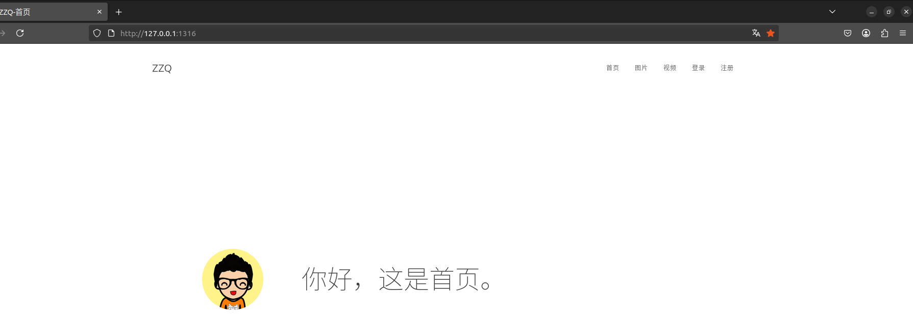
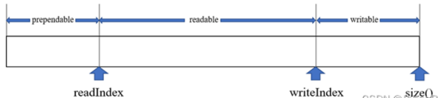
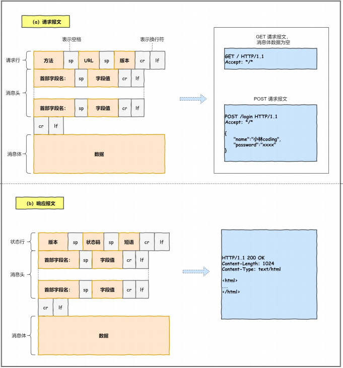
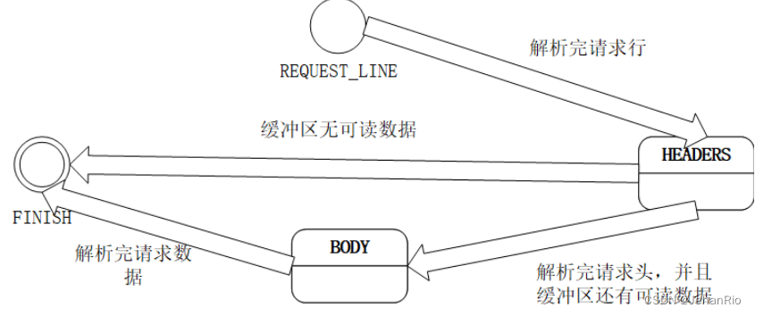

# tinyWebServer 项目

写在前面：

学习了C++很久一直很想找个项目来做做看一看，验证一下自己目前的学习进度，于是在网上搜了一下，几乎每一篇博客都会有这个项目的推荐，也有人说这个项目做的人很多，不可以写在简历上。但是我觉得做的人很多就代表着很经典，咱们应该尝试着做一下。

刚开始看这个项目的代码的时候完全不知道如何下手，看也看不懂，搞的我都快怀疑自己的能力了。后来想了一下，确实不应该这么着急，可以提前了解一下项目的知识再重新来做一下。

于是就先做了三个小项目，每个项目都挺经典的，而且项目的代码量也很小。

- 线程池的项目：(主要学习线程池的概念和用法)
  - 项目介绍：https://blog.zqzhang2025.com/2025/04/13/ThreadPool/
  - git链接：https://github.com/zqzhang2023/zzqStudy/tree/main/project/2_ThreadPool
- tinyhttpd 项目：（主要HTTP协议）
  - 项目介绍：https://blog.zqzhang2025.com/2025/04/13/tinyhttpd/
  - git链接：https://github.com/zqzhang2023/zzqStudy/tree/main/project/3_tinyhttpd
- chatRoom 项目：（主要学习socket和IO多路复用）
  - 项目介绍：
  - git链接：https://github.com/zqzhang2023/zzqStudy/tree/main/project/4_chatRoom

学习完基础知识之后，就开始尝试学学习这个项目

# 介绍

这个项目在github上面有很多的版本

先说一下我自己的（嘿嘿嘿）：

cmake版本：https://github.com/zqzhang2023/zzqStudy/tree/main/project/5_tinyWebServer

makefile版本：https://github.com/zqzhang2023/zzqStudy/tree/main/project/5_TinyWebServer_makefile


初始的应该是这个：https://github.com/qinguoyi/TinyWebServer

但是这个确实有些久远，有些语法可能目前不太常使用了， 在这个最初的版本后面有贴C++ 11 实现的版本

也就是这个：https://github.com/markparticle/WebServer

这个C++ 11 的版本看着很舒心，于是我就选择了这个版本开始学习

介绍：(这个是官方git上的原话，我直接拿过来了)

Linux下C++轻量级Web服务器，助力初学者快速实践网络编程，搭建属于自己的服务器.

- 使用 线程池 + 非阻塞socket + epoll(ET和LT均实现) + 事件处理(Reactor和模拟Proactor均实现) 的并发模型

- 使用状态机解析HTTP请求报文，支持解析GET和POST请求

- 访问服务器数据库实现web端用户注册、登录功能，可以请求服务器图片和视频文件

- 实现同步/异步日志系统，记录服务器运行状态

- 经Webbench压力测试可以实现上万的并发连接数据交换

    

# 快速运行

我的运行环境是Linux Ubuntu 20.04，Mysql，C++ 11

使用的版本是：https://github.com/markparticle/WebServer

1.首先要安装数据库（这个可以找一下教程，网上有很多，而且安装确实不难）

2.然后按照网站是给出的步骤来,建立数据库和创建表格添加数据

```
// 建立yourdb库
create database yourdb;

// 创建user表
USE yourdb;
CREATE TABLE user(
    username char(50) NULL,
    password char(50) NULL
)ENGINE=InnoDB;

// 添加数据
INSERT INTO user(username, password) VALUES('name', 'password');
```

3.修改一下 code/main.cpp 里面的参数
```cpp
#include <unistd.h>
#include "include/webserver.h"

int main() {
    // 守护进程 后台运行 
    WebServer server(
        1316, 3, 60000,              // 端口 ET模式 timeoutMs 
        3306, "用户(一般是root)", "密码", "数据库名", /* Mysql配置 */
        12, 8, true, 1, 1024);             /* 连接池数量 线程池数量 日志开关 日志等级 日志异步队列容量 */
    server.Start();
} 
```
4.在根目录下 执行  make

5.在根目录下 执行 sudo ./bin/server （这里要用sudo哈，要不然可能出现权限问题）

下面是运行成功图（这个是后面截的，我修改了一部分）：



# 项目文件作用

简单介绍一下各个文件的作用，官方给的是这个，但是咱们主要看code文件里面的东西

    .
    ├── code           源代码的目录
    │   ├── buffer     
    │   ├── config     
    │   ├── http       
    │   ├── log
    │   ├── timer
    │   ├── pool
    │   ├── server
    │   └── main.cpp
    ├── test           单元测试
    │   ├── Makefile
    │   └── test.cpp
    ├── resources      静态资源
    │   ├── index.html
    │   ├── image
    │   ├── video
    │   ├── js
    │   └── css
    ├── bin            可执行文件
    │   └── server
    ├── log            日志文件
    ├── webbench-1.5   压力测试
    ├── build          
    │   └── Makefile
    ├── Makefile
    ├── LICENSE
    └── readme.md

code文件夹目录：

    code/
    ├── buffer/
    │   ├── buffer.cpp
    │   ├── buffer.h             缓冲区的实现
    │   └── readme.md
    ├── http/
    │   ├── httpconn.cpp
    │   ├── httpconn.h           综合httprequest与httpresponse
    │   ├── httprequest.cpp
    │   ├── httprequest.h        处理http请求
    │   ├── httpresponse.cpp
    │   ├── httpresponse.h       处理http响应
    │   └── readme.md
    ├── log/
    │   ├── blockqueue.h         阻塞队列(生产者消费者模式)
    │   ├── log.cpp
    │   ├── log.h                日志系统
    │   └── readme.md
    ├── pool/
    │   ├── readme.md
    │   ├── sqlconnpool.cpp
    │   ├── sqlconnpool.h        mysql链接池
    │   └── threadpool.h         线程池
    ├── server/
    │   ├── epoller.cpp
    │   ├── epoller.h            对epoll接口的封装
    │   ├── readme.md
    │   ├── webserver.cpp    
    │   └── webserver.h          最后的实现，综合了前面所有东西
    ├── timer/
    │   ├── heap_timer.cpp 
    │   ├── heap_timer.h         小根堆计时器
    │   └── readme.md
    └── main.cpp                 入口文件


下面就开始复现该项目，这个是别人的思路：

- 通过采用从局部到整体的设计思想。先使用单一线程完成串行的HTTP连接建立、HTTP消息处理和HTTP应答发送，然后围绕高并发这个核心扩展多个模块。

- 首先就是日志模块和缓冲区模块的一个设计，这里优先实现是为了下面各个模块的调试方便，记录各个模块运行的状况和打印输出模块运作情况来排除明显的BUG。

- 然后是引入I/O多路复用实现单线程下也能在一次系统调用中同时监听多个文件描述符，再进一步搭配线程池实现多客户多任务并行处理，这是高并发的核心部分。

- 在这个基础上做一点优化，在应用层实现了心跳机制，通过定时器实现非活跃连接的一个检测和中断，减少系统资源（内存）不必要的浪费。最后将所有模块整合起来，实现一个单Reactor多线程的网络设计模式，将多个模块串联起来实现完整高并发的服务器程序。

- 线程安全这块是通过不断将锁的粒度降低，平衡性能和安全。一开始采用粒度较粗的锁实现互斥（通常是整个操作），然后慢慢分析将一些不共享的代码移出临界区，慢慢调整慢慢优化。

- 最后加入数据库部分，因为这一部分比较独立，采用RAII机制创建连接池，拿出连接来使用。在HTTP中加入数据库信息验证的功能。


我确实水平有限，没有按上面的思路实现，我的实现方法是：过两遍

- 先看一遍代码，为原先的代码添加注释，一行一行的添加，每一行都要理解
  
- 自己写一遍，写的时候只看头文件(第一遍加注释的时候已经在头文件上加上各个函数的功能了)，自己写cpp文件实现头文件，遇到不会的再看原作者的实现
  - 如何验证自己写的是对的？
  - 刚开始已经把原项目跑起来了，把自己写好的cpp实现替换跑起来的原项目的文件，看能不能再跑起来，有问题就调整。
  
# 项目复现流程

建立复现的流程：

- buffer 缓冲区的实现，这个和其不依赖其他模块，但是其他模块很依赖这个
- log    日志系统,这个只依赖buffer模块，而且实现这个之后咱们就可以通过日志来调试了
- pool   线程池和数据库连接池模块，这个模块比较独立，也是只依赖log和buffer
- http   处理http请求与响应，依赖buffer log pool
  - 内部建议实现顺序：
  - httprequest(http请求的处理)
  - httpresponse(根据http请求来生成响应)
  - httpconn(将上面两个连接在一起，包括请求的接收以及响应的发送等)
- timer  小根堆计时器，是一个工具，只依赖log，还是因为调试才依赖的，很独立
- server 最后的综合实现
  - 内部建议实现顺序：
  - epoller 对IO多路复用技术 epoll进行了一个封装
  - webserver 最后对所有模块进行综合

# 项目复现

按照项目复现流程开始复现

因为我已经提前看了一遍代码了，确实不知道如何从0开始写介绍，所以针对每个模块，我主要介绍一下我当时闭环模糊的点

## buffer

这是一个缓冲区模块模块，设计的非常的巧妙，通过两个指针来切分整个 vector ，我搜索的资料是这个设计的思路来源于 陈硕大佬的muduo网络库。


注意buffer的内容，要不然很容易搞迷糊，通过两个指针把buffer分成了三个区域 



|-------------A---------|------------B-----------|-----------C-------------|

- A区域：左侧是Buffer[0] 右侧是readPos_  这里表示prependable区域(正常情况下应该是读区域和写区域，读区域最开始的index应该是0，数据读除去之后 readPos_++ 就形成了这样一个区域，所以这个区域被称为备用区域，后续可以用这个区域来扩容写空间)
- B区域：左侧是readPos_  右侧是writePos_ 这篇区域表示可以被读出去的区域
- C区域：左侧是writePos_  右侧是readPos_ 这片区域表示便是可以写进来的区域

那么我们模拟一下过程，假设一个buffer为1024这么大，那么初始的readPos_，writePos_均为0，现在进行模拟(记得在脑海里面想象一下过程)
- 现在有一个socketfd要往buffer里面写东西，咱们调用他的read函数，然后把得到东西写入buffer中，假设使用了64字节那么大 (现在就是字节存进取，writePos_后移动64个位置)（现在写区域还剩下1024-64）
- 服务器读取内容，假设第一次读取32个字节(假设哈，这里是模拟，不是真实的)，那么readPos_向后移动32个位置，这个时候就形成了3个区域了，其中A区域，也就是0-31这些地方的内容已经被读出去了，不再需要了
- 现在服务器要把返回的东西写进来buffer，假设要写进来的东西是1024-64 + 16 比 还剩下的1024 - 64 多 16个字节，那么咱们就需要查找一下A区域的大小，咱们发现，A区域还有32个字节，可以支持，那么现在就需要合并一下A与C区域
  - 合并方法，移动B区域，将B区域移动到最前面，readPos_变成 0 writePos_变成 B.size B区域的大小
  - 如果发现合并区域之后还是不行的话，那么就要给buffer多分配空间了

**代码（其实项目里面有，但是我这里加了注释可能比较清楚一些）：**

```cpp
// buffer.h
#ifndef BUFFER_H
#define BUFFER_H

#include <cstring>   //perror
#include <iostream>
#include <unistd.h>  // write
#include <sys/uio.h> //readv
#include <vector>    //readv
#include <atomic>
#include <assert.h>

class Buffer{
private:
    std::vector<char> buffer_;         // 地层的容器
    std::atomic<std::size_t> readPos_; // 原子类型的读指针(当前的读的位置)
    std::atomic<std::size_t> writePos_;// 原子类型的写指针(当前的写的位置)

    // 获取缓冲区起始地址（非常量）
    char* BeginPtr_();
    // 获取缓冲区起始地址（常量）
    const char* BeginPtr_() const;
    // 扩容或整理缓冲区以提供至少len字节可写空间
    void MakeSpace_(size_t len);

public:
    //构造函数，初始化缓冲区大小及读写位置
    Buffer(int initBuffSize = 1024);
    //默认析构函数
    ~Buffer() = default;
    //获取当前可写空间大小
    size_t WritableBytes() const;
    //获取当前可读数据大小
    size_t ReadableBytes() const;
    //获取预留空间（已读区域）大小
    size_t PrependableBytes() const;
    //返回当前可读数据的起始地址（常量指针）
    const char* Peek() const;
    //确保至少有len字节的可写空间，否则扩容
    void EnsureWriteable(size_t len);
    //移动写指针（数据写入后调用）
    void HasWritten(size_t len);
    //移动读指针（消费len字节数据）
    void Retrieve(size_t len);
    //移动读指针到指定地址（消费到end的数据）
    void RetrieveUntil(const char* end);
    //重置缓冲区（清空数据，读写指针归零）
    void RetrieveAll();
    //取出所有可读数据并转为字符串，清空缓冲区
    std::string RetrieveAllToStr();
    //返回当前写位置常量指针
    const char* BeginWriteConst() const;
    //返回当前写位置指针
    char* BeginWrite();
    //添加字符串到缓冲区
    void Append(const std::string& str);
    //添加字符数组到缓冲区
    void Append(const char* str,size_t len);
    //添加任意类型数据到缓冲区（转换为char*）
    void Append(const void* data, size_t len);
    //添加另一个缓冲区的可读数据到当前缓冲区
    void Append(const Buffer& buff);
    //从文件描述符读取数据到缓冲区（使用readv,并且注意这里是读数据到缓冲区，所以要放入C区域，操作的是writePos_）
    ssize_t ReadFd(int fd, int* Errno);
    //将缓冲区的可读数据写入文件描述符(注意这里是写入文件描述符，因此要读缓冲区，是从B区域读出去，操作的是readPos_)
    ssize_t WriteFd(int fd, int* Errno);
    //注意上面俩参数，非常容易搞混乱
};

#endif

```

```cpp
// buffer.cpp
#include "buffer.h"

// 构造函数：初始化缓冲区大小和读写位置
Buffer::Buffer(int initBuffSize):buffer_(initBuffSize),readPos_(0),writePos_(0){
    assert(initBuffSize > 0 ); //确保initBuffSize的有效性
}

// 返回当前可写字节数 = 总容量 - 写位置
size_t Buffer::WritableBytes() const{
    return buffer_.size() - writePos_;
}

// 返回当前可读字节数 = 写位置 - 读位置
size_t Buffer::ReadableBytes() const{
    return writePos_ - readPos_;
}

// 返回预留空间（已读区域）大小 = 读位置 (已经读过的就没用了，等于读下标)
size_t Buffer::PrependableBytes() const{
    return readPos_;
}

// 返回可读数据起始地址（常量指针）
const char* Buffer::Peek() const{
    return &buffer_[readPos_];
}

// 确保至少有len字节可写空间，否则扩容
void Buffer::EnsureWriteable(size_t len){
    if(len > WritableBytes()){  //目前的空间不足
        MakeSpace_(len);        //整理(合并)一下空间，再不足就扩容了
    }
    assert(len < WritableBytes()); //打个断言
}

// 移动写下标，更新写位置（数据写入后调用)
void Buffer::HasWritten(size_t len){
    writePos_ += len; // 写指针后移len字节 注意：可能会有疑问，这里就不怕越界吗？其实一般情况下，要写入输入之前会调用EnsureWriteable，再写再移动指针，但是说实话还是程序控制比较好，现在的方法全靠程序员自觉（而且这还是个public方法）
}

// 读取len长度，移动读下标 消费数据：移动读指针
void Buffer::Retrieve(size_t len){
    readPos_ += len; //和HasWritten同理，如果跟着做完有时间的话，可以尝试一下重构一下代码
}

// 消费数据直到指定地址，这里没说要读哈，就是相当于把end之前的可读的区域都放弃掉
void Buffer::RetrieveUntil(const char* end){
    assert(Peek() <= end); //你看这这里就打断言了， &buffer_[readPos_] 要小于 end
    Retrieve(end - Peek()); // end指针 - 读指针 长度
}

// 取出所有数据，buffer归零，读写下标归零,在别的函数中会用到
void Buffer::RetrieveAll(){
    bzero(&buffer_[0], buffer_.size());  // 覆盖原本数据 清空数据 可选，因为readPos_ = writePos_ = 0; 其实就代表归0了，里面的内容就相当于全部舍弃了
    readPos_ = writePos_ = 0;
}

//  取出剩余可读的str 取出所有可读数据并转为字符串
std::string Buffer::RetrieveAllToStr(){
    std::string str(Peek(),ReadableBytes()); //string字符串构造，记得看了解一下字符串
    RetrieveAll();
    return str;
}

// 返回当前写位置常量指针
const char* Buffer::BeginWriteConst() const{
    return &buffer_[writePos_];
}

// 返回当前写位置指针
char* Buffer::BeginWrite(){
    return &buffer_[writePos_];
}

// 添加str到缓冲区
void Buffer::Append(const char* str, size_t len) {
    assert(str);
    EnsureWriteable(len);                       // 确保可写的长度
    std::copy(str, str + len, BeginWrite());    // 将str放到写下标开始的地方
    HasWritten(len);                            // 移动写下标
}

// 添加字符串到缓冲区
void Buffer::Append(const std::string& str){
    Append(str.c_str(),str.size());
}

// 任意类型，强制转换
void Buffer::Append(const void* data, size_t len) {
    Append(static_cast<const char*>(data), len);
}

// 添加另一个缓冲区的可读数据到当前缓冲区(不是合并俩缓冲区哈，就相当与把buff之中的可读数据写在现在这个缓冲区里面哈，别搞错了)
void Buffer::Append(const Buffer& buff){
    Append(buff.Peek(), buff.ReadableBytes());
}

// 获取缓冲区起始地址（内部使用）
char* Buffer::BeginPtr_() {
    return &buffer_[0];
}

// 获取缓冲区起始地址（常量版本）
const char* Buffer::BeginPtr_() const{
    return &buffer_[0];
}

// 扩展空间
void Buffer::MakeSpace_(size_t len) {
    if(WritableBytes() + PrependableBytes() < len){  // C + A 区域 都无法满足 len大小的数据了，这时候就要扩容了
        buffer_.resize(writePos_ + len + 1); //  扩容至所需大小+1（保险）
    }else{  //合并空间
        size_t readable = ReadableBytes();
        std::copy(BeginPtr_() + readPos_, BeginPtr_() + writePos_, BeginPtr_()); //将缓冲区中从readPos_到writePos_之间的数据复制到缓冲区的起始位置
        readPos_ = 0;          // 读指针归零
        writePos_ = readable;  // 写指针指向原数据末尾
        assert(readable == ReadableBytes()); // 确保数据完整性
    }
}

// 两个最为重要的函数，放在最后来写
// 将buffer中可读的区域写入fd中
ssize_t Buffer::WriteFd(int fd,int* Errno){
    ssize_t len = write(fd,Peek(),ReadableBytes()); //将读区域内部的所有的东西都写进fd之中，一般情况下都不会出错，也就是 len 会= ReadableBytes()，但是也有可能会出错
    if(len < 0){
        *Errno = errno;
        return len;
    }
    Retrieve(len);
    return len;
}

// 将fd的内容读到缓冲区，即writable的位置
// 这里要注意哈，看咱们前面的函数，一般情况下，咱们会调用咱们的Append函数来向buffer里面写东西
// 但是碰到一个问题，如何判断咱们要写入的长度，这取决于fd要传给咱们多少东西，咱们现在也不知道，要传给咱多少
// 因此这里要使用 分散读写 通过定义一个 struct iovec 数组接收, struct iovec iov[2]; ssize_t len = readv(fd, iov, 2); 会优先向iov[0]之中写,如果不够写的话,会再向iov[1]写
// struct iovec {
//     void  *iov_base;  // 指向缓冲区的指针
//     size_t iov_len;   // 缓冲区的长度
// };
ssize_t Buffer::ReadFd(int fd,int* Errno){
    char buff[65535];   // 栈区
    struct iovec iov[2];
    size_t writeable = WritableBytes(); // 获取现在缓冲区内部还有多少可写的空间
    // 分散读,保证数据能够读完
    iov[0].iov_base = BeginWrite();
    iov[0].iov_len = writeable;
    iov[1].iov_base = buff;
    iov[1].iov_len = sizeof(buff); //65535

    ssize_t len = readv(fd, iov, 2); //开始读
    if(len < 0){ // 出现错误了
        *Errno = errno;
    }else if(static_cast<size_t>(len) <= writeable){ //说明咱们基础的缓存空间是足够存储的,没有使用char buff[65535]; 
        writePos_ += len;   // 直接移动写下标 //你看你看,我就说HasWritten函数有问题,这里估计作者自己都忘记了有这么一个函数
    }else{ // 说明咱们的空间是不够的(同时说明了,咱们的buffer_空间内部已经填满了)
        writePos_ = buffer_.size(); // 写区写满了,下标移到最后
        Append(buff, static_cast<size_t>(len - writeable)); // 剩余的长度
    }
    return len;
}
```

## log

日志系统

1.使用单例模式来实现，目的是保证一个类只有一个实例，并提供一个他的全局访问点，该实例被所有程序模块共享。

2.异步日志，日志写入的时候需要写入文件，因此需要进行IO操作，IO操作如果放在主线程的话就会很大的阻塞线程，因此需要再创建一个线程来进行这个IO操作

3.日志的分级与分文件
- Debug，调试代码时的输出，在系统实际运行时，一般不使用。
- Warn，这种警告与调试时终端的warning类似，同样是调试代码时使用。
- Info，报告系统当前的状态，当前执行的流程或接收的信息等。
- Erro，输出系统的错误信息

4.分文件情况
- 按天分，日志写入前会判断当前today是否为创建日志的时间，若为创建日志时间，则写入日志，否则按当前时间创建新的log文件，更新创建时间和行数。
- 按行分，日志写入前会判断行数是否超过最大行限制，若超过，则在当前日志的末尾加lineCount / MAX_LOG_LINES为后缀创建新的log文件。

### blockqueue

这是一个安全队列，咱们普通的队列在进行多线程操作的时候会出现互斥，必须得先加锁，再进行队列操作才可以，现在将这些加锁的操作封装到队列之中，这就是安全队列。在其他多线程的地方调用安全队列的方法的的时候不需要加锁，因为内部已经加锁了

代码：

```cpp
#ifndef BLOCKQUEUE_H
#define BLOCKQUEUE_H

#include <deque>
#include <condition_variable>
#include <mutex>
#include <sys/time.h>
using namespace std;

template<typename T>
class BlockQueue{
private:
    deque<T> deq_;                      // 底层双端队列容器
    mutex mtx_;                         // 互斥锁，保护队列操作
    bool isClose_;                      // 关闭标志
    size_t capacity_;                   // 队列关闭标志
    condition_variable condConsumer_;   // 消费者条件变量（队列空时等待）
    condition_variable condProducer_;   // 生产者条件变量（队列满时等待）
public:
    explicit BlockQueue(size_t maxsize = 1000);   // 构造函数，设置队列容量
    ~BlockQueue();                                // 析构函数，关闭队列并释放资源
    bool empty();                                 // 判空
    bool full();                                  // 判满
    void push_back(const T& item);                // 在队尾添加元素
    void push_front(const T& item);               // 在队头添加元素
    bool pop(T& item);                            // 弹出的任务放入item
    bool pop(T& item, int timeout);               // 带超时的弹出操作
    void clear();                                 // 清空队列
    T front();                                    // 获取队头元素
    T back();                                     // 获取队尾元素
    size_t capacity();                            // 获取队列容量
    size_t size();                                // 获取当前元素数量

    void flush();                                 // 唤醒一个消费者线程
    void Close();                                 // 关闭队列，唤醒所有线程

};

/* 构造函数
 * @param maxsize 队列最大容量，必须大于0
 */
template<typename T>
BlockQueue<T>::BlockQueue(size_t maxsize):capacity_(maxsize){
    assert(maxsize > 0);        // 确保容量合法
    isClose_ = false;           // 初始化关闭标志为false
}

/* 析构函数：调用Close清理资源 */
template<typename T>
BlockQueue<T>::~BlockQueue(){  // 析构函数：调用Close清理资源
    Close();
}

/* 清空队列 */
template<typename T>
void BlockQueue<T>::clear(){
    lock_guard<mutex> locker(mtx_);  // 线程安全，一定要加锁
    deq_.clear();
}

/* 关闭队列：清空队列并唤醒所有等待线程 */
template<typename T>
void BlockQueue<T>::Close(){
    clear();  //内部加锁了，咱们这里就不用加锁了
    isClose_ = true;
    // 唤醒所有等待的消费者和生产者线程
    condConsumer_.notify_all();
    condProducer_.notify_all();
}

/* 判断队列是否为空 */
template<typename T>
bool BlockQueue<T>::empty(){
    lock_guard<mutex> locker(mtx_);  // 线程安全，一定要加锁
    return deq_.empty();
}

/* 判断队列是否已满 */
template<typename T>
bool BlockQueue<T>::full(){
    lock_guard<mutex> locker(mtx_);  // 线程安全，一定要加锁
    return deq_.size() >= capacity_;// 当前大小 >= 容量即为满
}

/* 在队尾插入元素（生产者调用）*/
template<typename T>
void BlockQueue<T>::push_back(const T& item){
    // 注意，条件变量需要搭配unique_lock
    unique_lock<mutex> locker(mtx_);
    condProducer_.wait(locker,[this]{
        return !(this->deq_.size() >= this->capacity_)||this->isClose_;
    });
    // 检查队列是否已关闭
    if (isClose_) { //关闭就抛出异常
        return;
    }
    deq_.push_back(item);               // 插入元素到队尾
    condConsumer_.notify_one();         // 通知一个消费者可以取数据
}

/* 在队头插入元素（生产者调用）*/
template<typename T>
void BlockQueue<T>::push_front(const T& item){
    // 注意，条件变量需要搭配unique_lock
    unique_lock<mutex> locker(mtx_);
    condProducer_.wait(locker,[this]{
        return !(this->deq_.size() >= this->capacity_)||this->isClose_;
    });
    // 检查队列是否已关闭
    if (isClose_) { //关闭就return
        return;
    }
    deq_.push_front(item);               // 插入元素到队尾
    condConsumer_.notify_one();         // 通知一个消费者可以取数据
}

/* 弹出队头元素（消费者调用，阻塞）*/
template<typename T>
bool BlockQueue<T>::pop(T& item) {
    unique_lock<mutex> locker(mtx_);    // 必须使用unique_lock以便操作条件变量
    while(deq_.empty()) {               // 队列空则等待
        condConsumer_.wait(locker);     // 挂起消费者，等待队列非空信号
        if(isClose_){                   // 检查队列是否已关闭
            return false;
        }
    }
    item = deq_.front();                // 取队头元素
    deq_.pop_front();
    condProducer_.notify_one();         // 通知生产者有空位
    return true;
}

/* 弹出队头元素（支持超时等待）
 * @param timeout 超时时间（秒）
 * @return 超时或队列关闭返回false，否则true
 */
template<typename T>
bool BlockQueue<T>::pop(T &item, int timeout) {
    unique_lock<std::mutex> locker(mtx_);   // 必须使用unique_lock以便操作条件变量
    while(deq_.empty()){
        if(condConsumer_.wait_for(locker, std::chrono::seconds(timeout)) 
                == std::cv_status::timeout){
            return false;                  // 超时返回false
        }
        if(isClose_){                      // 检查队列是否已关闭
            return false;
        }
    }
    item = deq_.front();
    deq_.pop_front();
    condProducer_.notify_one();
    return true;
}


/* 获取队头元素（线程安全）*/
template<typename T>
T BlockQueue<T>::front() {
    lock_guard<std::mutex> locker(mtx_);
    return deq_.front();
}

/* 获取队尾元素（线程安全）*/
template<typename T>
T BlockQueue<T>::back() {
    lock_guard<std::mutex> locker(mtx_);
    return deq_.back();
}

/* 获取队列容量 */
template<typename T>
size_t BlockQueue<T>::capacity() {
    lock_guard<std::mutex> locker(mtx_);
    return capacity_;
}

/* 获取当前元素数量 */
template<typename T>
size_t BlockQueue<T>::size() {
    lock_guard<std::mutex> locker(mtx_);
    return deq_.size();
}

/* 唤醒一个消费者线程（常用于手动触发处理）*/
template<typename T>
void BlockQueue<T>::flush() {
    condConsumer_.notify_one();
}

#endif

```

### log

(下面是我复现的时候的一些想法)

日志系统对整个项目来说非常重要，涉及到一些错误调试操作
- 单例模式：确保整个程序中只有一个日志实例，在这样一个“庞大”的系统之中，无法避免的的要全局的访问日志系统，如果使用多个日志实例的话，那么就需要考虑很多很多的同步的问题，因此单例模式是最优解
  - 这里要注意，这个项目是C++11实现的 C++11标准 （§6.7 [stmt.dcl] 第4段） 如果控制流在变量初始化时并发进入声明，并发线程必须等待初始化完成。 也就是说 静态局部变量 是线程安全的

- 同步与异步：这里又涉及到了同步与异步的概念，这个可以搜索了解一下，这里简单来说，就是：同步，在写入文件的时候直接在主线程里面写；异步：重新申请一个线程，在线程里面写，不会阻塞主线程
  - 咱们来理一下整个流程
  - 1.向外接口是 LOG_INFO （以LOG_INFO为例哈，其他的还有LOG_DEBUG啥的）看下面的宏定义。首先会获取实例，然后经过判断调用write
  - 2.在写的时候先判断一下对应的文件(比如日期，比如文件的行数是不是超过最大的行数)，如果有问题的话会重新生成一个新的日志文件
  - 3.然后会组合日志的语句，存储到buffer之中。比如：一行日志：2025-04-11 10:58:46.397812 [info] : Client[23](127.0.0.1:59563) in, userCount:6 这里需要生成前面的2025-04-11 10:58:46.397812 [info]还要组合后面的内容
  - 4.最后才是写进去，这里要注意，写的时候就涉及到同步和异步了
    - 同步：直接在主线程里面写就行了，也就是说直接写，并不需要啥多余的操作，因此这里的IO操作就会对主线程造成阻塞
    - 异步：通过申请一个新的线程来写。具体操作：设置一个阻塞队列，典型的生产者-消费者模型。咱们申请的线程会一直读取这个队列里面的的内容(也就是pop)，如果为空的话就会线程就会阻塞，但是只要有值push进去的话，就会重新唤醒线程
      - 因此，在异步的情况下，直接将buffer之中的内容push到队列之中就行了，push之后会唤醒线程从而执行写的操作
  
- 还有一个小点，就是可变参数，这个不解释其实也能的懂，但是这边还是记录一下把
  - 正常的调用比如：LOG_INFO("11111") 这种是没有可变参数的
  - 带有可变参数的比如：LOG_INFO("%s,%s,%d",str1,str2,int1) 这样就是有可变参数的 

代码：

```cpp
// log.h
#ifndef LOG_H
#define LOG_H

#include <mutex>
#include <string>
#include <thread>
#include <sys/time.h>
#include <string.h>
#include <stdarg.h>           // 可变参数支持（va_start, va_end）
#include <assert.h>
#include <sys/stat.h>         // 目录操作（mkdir）
#include "blockqueue.h"
#include "../buffer/buffer.h"

class Log{
private:
    // 常量定义  static const 可以直接在里面初始化
    static const int LOG_PATH_LEN = 256; // 日志文件最长文件名
    static const int LOG_NAME_LEN = 256; // 日志最长名字
    static const int MAX_LINES = 50000;  // 日志文件内的最长日志条数
    // 日志文件相关参数
    const char* path_;   // 日志文件存储路径
    const char* suffix_; // 日志文件后缀名
    int MAX_LINES_;      // 最大日志行数
    // 运行时状态
    int lineCount_;      // 当前日志文件行数计数器
    int toDay_;          // 记录当前日期（用于日志滚动）
    bool isOpen_;        // 日志系统是否开启标志
    // 缓冲区与日志级别
    Buffer buff_;        // 输出的内容，缓冲区
    int level_;          // 日志等级
    bool isAsync_;       // 是否开启异步日志
    // 文件与线程相关
    FILE* fp_;           // 打开log的文件指针
    std::unique_ptr<BlockQueue<std::string>> deque_; // 阻塞队列（用于异步模式） //注意哈，这里设置的是一个智能指针因此用的时候注意一下，这是一个指针
    std::unique_ptr<std::thread> writeThread_;       // 异步写线程 指针，同队列理
    std::mutex mtx_;                                 // 互斥锁（保证线程安全）
    
    // 私有构造与析构
    Log();                                          // 构造函数（私有，单例模式）
    void AppendLogLevelTitle_(int level);           // 添加日志级别前缀
    virtual ~Log();                                 // 析构函数
    void AsyncWrite_();                             // 异步写日志的实际执行方法


public:
    // 初始化日志系统
    // 参数：level-日志级别, path-日志路径, suffix-日志后缀, maxQueueCapacity-阻塞队列容量
    void init(int level, const char* path = "./log", const char* suffix = ".log",int maxQueueCapacity = 1024);

    static Log* Instance();       // 获取单例实例
    static void FlushLogThread(); // 异步写日志公有方法，调用私有方法asyncWrite 异步写日志线程入口

    // 写日志方法（核心方法
    // 参数：level-日志级别, format-格式化字符串, ...-可变参数
    void write(int level,const char* format,...);  // 将输出内容按照标准格式整理
    void flush();                                  // 刷新缓冲区到文件
    int GetLevel();                                // 获取当前日志级别
    void SetLevel(int level);                      // 设置日志级别
    bool IsOpen() { return isOpen_; }              // 判断日志系统是否开启
};

/******************** 日志宏定义（对外接口） ********************/
// 基础日志宏
#define LOG_BASE(level, format, ...) \
    do {\
        Log* log = Log::Instance();\
        if (log->IsOpen() && log->GetLevel() <= level) {\
            log->write(level, format, ##__VA_ARGS__); \
            log->flush();\
        }\
    } while(0);

// 四个宏定义，主要用于不同类型的日志输出，也是外部使用日志的接口
// ...表示可变参数，__VA_ARGS__就是将...的值复制到这里
// 前面加上##的作用是：当可变参数的个数为0时，这里的##可以把把前面多余的","去掉,否则会编译出错。
#define LOG_DEBUG(format, ...) do {LOG_BASE(0, format, ##__VA_ARGS__)} while(0);    
#define LOG_INFO(format, ...) do {LOG_BASE(1, format, ##__VA_ARGS__)} while(0);
#define LOG_WARN(format, ...) do {LOG_BASE(2, format, ##__VA_ARGS__)} while(0);
#define LOG_ERROR(format, ...) do {LOG_BASE(3, format, ##__VA_ARGS__)} while(0);

#endif //LOG_H
```
```cpp
#include "log.h"

// 构造
Log::Log(){
    fp_ = nullptr;           // 初始化文件指针为空
    deque_ = nullptr;        // 初始化阻塞队列为空
    writeThread_ = nullptr;  // 初始化写线程为空
    lineCount_ = 0;          // 初始化行计数器 
    toDay_ = 0;              // 初始化当前日期
    isAsync_ = false;        // 默认同步模式
}

// 析构函数
Log::~Log(){
    while(deque_->empty()){
        deque_->flush();      // 唤醒消费者，处理掉剩下的任务
    }
    deque_->Close();          // 关闭队列
    if(writeThread_ && writeThread_->joinable()){ // 确保线程存在且可join
        writeThread_->join();
    }
    if(fp_){                  // 冲洗文件缓冲区，关闭文件描述符
        lock_guard<mutex> locker(mtx_);
        flush();              // 清空缓冲区中的数据
        fclose(fp_);          // 关闭日志文件
    }
}

// 唤醒阻塞队列消费者，开始写日志 刷新缓冲区
void Log::flush(){
    if (isAsync_){         // 只有异步日志才会用到deque
        deque_->flush();
    }
    fflush(fp_);           // 清空输入缓冲区
}

// 懒汉模式 局部静态变量法（这种方法不需要加锁和解锁操作）
Log* Log::Instance(){
    static Log log;  // C++11保证静态局部变量线程安全
    return &log;
}

// 异步日志的写线程函数
void Log::FlushLogThread(){ 
    Log::Instance()->AsyncWrite_();   // 调用实际写方法
}

// 异步写线程真正的执行函数
void Log::AsyncWrite_(){
    string str = "";
    while(deque_->pop(str)){ // 从队列获取日志字符串 //阻塞的地方在这里 writeThread_ 相当于deque_的消费者，当没有数据的时候会阻塞
        lock_guard<mutex> locker(mtx_);     // 这里的加锁不是针对队列(安全队列会自己加锁)哈，针对的是 fp_
        fputs(str.c_str(), fp_);            // 写入文件
    }
}

// 初始化日志系统
void Log::init(int level, const char* path, const char* suffix, int maxQueCapacity) {
    isOpen_ = true;       // 标记日志系统开启
    level_ = level;       // 设置日志级别
    path_ = path;         // 日志存储路径
    suffix_ = suffix;     // 文件后缀

    if(maxQueCapacity){   // 异步方式 队列容量>0启用异步
        isAsync_ = true;
        if(!deque_){      // 为空则创建一个
            unique_ptr<BlockQueue<std::string>> newQue(new BlockQueue<std::string>);
            // 因为unique_ptr不支持普通的拷贝或赋值操作,所以采用move
            // 将动态申请的内存权给deque，newDeque被释放
            deque_ = move(newQue);
            // 启动写线程
            unique_ptr<thread>  newThread(new thread(FlushLogThread));
            writeThread_ = move(newThread); //注意这里哈，刚开始写的时候是不是有些疑问呀，就是这个时候已经对writeThread_进行初始化了，该线程已经执行了，但是他执行的啥呢？刚开始啥也么没有应当会阻塞的
        }
    }else{
        isAsync_ = false;
    }
    // 重置行计数器
    lineCount_ = 0;     

    // 时间处理（日志文件按日期滚动）
    time_t timer = time(nullptr);
    struct tm *sysTime = localtime(&timer);
    struct tm t = *sysTime;

    // 构建日志文件名
    path_ = path;     //和前面重复了，原作者没注意估计
    suffix_ = suffix;
    char fileName[LOG_NAME_LEN] = {0};
    snprintf(fileName, LOG_NAME_LEN - 1, "%s/%04d_%02d_%02d%s", 
        path_, t.tm_year + 1900, t.tm_mon + 1, t.tm_mday, suffix_);
    toDay_ = t.tm_mday;      // 记录当前日期

    // 文件操作（加锁保证线程安全）
    {
        lock_guard<mutex> locker(mtx_);
        buff_.RetrieveAll();   // 清空缓冲区
        if(fp_) {              // 处理旧文件指针
            flush();
            fclose(fp_);
        }
        fp_ = fopen(fileName, "a"); // 追加模式打开文件
        if(fp_ == nullptr){         // 文件不存在时创建目录
            mkdir(path_, 0777);     // 创建日志目录（rwx权限）
            fp_ = fopen(fileName, "a"); // 生成目录文件（最大权限）
        }
        assert(fp_ != nullptr);  // 确保文件打开成功
    }
}

// 核心写日志方法
void Log::write(int level, const char *format, ...){
    struct timeval now = {0, 0};
    gettimeofday(&now, nullptr);    // 获取精确时间（微秒级）
    time_t tSec = now.tv_sec;
    struct tm *sysTime = localtime(&tSec);
    struct tm t = *sysTime;
    va_list vaList;                // 可变参数列表

    /* 日志文件滚动判断 */
    // 条件1：日期变化 或 条件2：行数超过限制
    if(toDay_ != t.tm_mday || (lineCount_ && (lineCount_  %  MAX_LINES == 0))){
        unique_lock<mutex> locker(mtx_);
        locker.unlock();              // 临时释放锁，避免阻塞其他线程

        // 这个时候得重新创建一个新的文件了
        char newFile[LOG_NAME_LEN];
        char tail[36] = {0};          // 时间戳部分（yyyy_mm_dd）
        snprintf(tail, 36, "%04d_%02d_%02d", t.tm_year + 1900, t.tm_mon + 1, t.tm_mday); // 目前的精准事件

        if(toDay_!=t.tm_mday){  // 事件部匹配
            snprintf(newFile, LOG_NAME_LEN - 72, "%s/%s%s", path_, tail, suffix_);  //为啥要减72？
            toDay_ = t.tm_mday;      // 更新日期记录
            lineCount_ = 0;          // 重置行计数器
        }else{  // 行数超了
            snprintf(newFile, LOG_NAME_LEN - 72, "%s/%s-%d%s", path_, tail, (lineCount_  / MAX_LINES), suffix_);
        }

        locker.lock();  // 重新加锁
        flush();        // 确保数据写入当前文件
        fclose(fp_);    
        fp_ = fopen(newFile, "a");  // 创建新日志文件
        assert(fp_ != nullptr);
    }

    // 在buffer内生成一条对应的日志信息
    // 说实话，我说实话，我觉得这里的buff很没必要
    // 这是一条完整info log 2025-04-11 10:58:52.272179 [info] : Verify name:111 pwd:111 先看这个的话可能会好理解一些
    {
        unique_lock<mutex> locker(mtx_);
        lineCount_++; // 行号递增
        int n = snprintf(buff_.BeginWrite(), 128, "%d-%02d-%02d %02d:%02d:%02d.%06ld ",
        t.tm_year + 1900, t.tm_mon + 1, t.tm_mday,
        t.tm_hour, t.tm_min, t.tm_sec, now.tv_usec);  //这是一条完整info log 2025-04-11 10:58:52.272179 [info] : Verify name:111 pwd:111
        buff_.HasWritten(n);           // 移动写指针
        AppendLogLevelTitle_(level);    // 添加日志级别前缀 [info]

        // 处理可变参数 注意哈，这里的可变参数，刚开始可能会不太明白，但是你看一下上面的int n = snprintf(buff_.BeginWrite(), 128, "%d-%02d-%02d %02d:%02d:%02d.%06ld ",
        // 如果传递的是 format = "%d-%02d-%02d %02d:%02d:%02d.%06ld " vaList =         t.tm_year + 1900, t.tm_mon + 1, t.tm_mday, t.tm_hour, t.tm_min, t.tm_sec, now.tv_usec
        // 这样是不是就明白了
        va_start(vaList, format);
        int m = vsnprintf(buff_.BeginWrite(), buff_.WritableBytes(), format, vaList);
        va_end(vaList);

        buff_.HasWritten(m);      // 更新缓冲区写位置
        buff_.Append("\n\0", 2);  // 添加换行和结束符

        // 根据模式选择写入方式
        if(isAsync_ && deque_ && !deque_->full()){  // 异步方式（加入阻塞队列中，等待写线程读取日志信息）
            deque_->push_back(buff_.RetrieveAllToStr());
        }else{ // 同步方式（直接向文件中写入日志信息）
            fputs(buff_.Peek(), fp_);   // 同步就直接写入文件
        }
        buff_.RetrieveAll();    // 清空缓冲区
    }
}

// 添加日志等级
void Log::AppendLogLevelTitle_(int level) {
    switch(level) { // 不同级别添加不同前缀
    case 0:
        buff_.Append("[debug]: ", 9);
        break;
    case 1:
        buff_.Append("[info] : ", 9);
        break;
    case 2:
        buff_.Append("[warn] : ", 9);
        break;
    case 3:
        buff_.Append("[error]: ", 9);
        break;
    default:
        buff_.Append("[info] : ", 9);
        break;
    }
}

// 获取当前日志级别
int Log::GetLevel() {
    lock_guard<mutex> locker(mtx_);
    return level_;
}

// 设置日志级别
void Log::SetLevel(int level) {
    lock_guard<mutex> locker(mtx_);
    level_ = level;
}
```

## pool

1.线程池

我在博客 https://blog.zqzhang2025.com/2025/04/13/ThreadPool/ 里面也做了一些介绍，现在再介绍一下

线程池是一种用于优化线程管理和任务调度的并发编程机制，其核心在于复用线程、控制资源使用，并提升系统性能。说白了就是，为了防止这么构造线程的浪费太多的时间，先把线程创建好，放在那等着，有任务提交的话就直接处理，省去了构造线程的过程

2.数据库连接池

这里仿照了线程池的一些思路

服务器在运行的时候肯定不只一个用户连接，每个用户连接的时候都需要进行数据库操作，在连接的时候要对数据库连接进行初始化，那样就非常的耗时，因此引入了 数据库连接池
- 先进行数据库连接，把连接好的标识放入一个池子里面（这里是queue），然后用户来的时候只需要把这些连接好的标识非配给他就好了

因此：数据库连接池就需要使用 **单例模式** 了，为什么？

  - 整个系统就只需要一个池子，不需要多个池子，也就是说不需要多个实例
  - 如果想要更多的池子的话，把的第一个池子扩大一些不就好了吗
  - 因此单例模式是最为合适的

3.RAII

这个就是说，由系统来管理资源的申请和释放。智能指针就是用这个来思路来实现的，咱们不需要手动释放资源了，系统会帮忙管理。

再说白了：其实就是再单独设计一个class，用来申请资源，比如在构造的时候new 一个 地址空间，在析构的时候delete一下，设计一个向外的接口，可以获取这个地址空间的指针。那么咱们在用的时候就不需要考虑这个地址空间的释放问题了，因为随着这个class生命周期的结束，就会自动释放这个空间。

这个可以看一下智能指针的实现的思路就理解了

我在这里介绍了 https://blog.zqzhang2025.com/2025/04/13/C++pointer/


### threadpool

这里的实现比较简单了，因为task只需要接收void类型的函数，就是说没有返回值的函数，我之前实现的theadpool(https://blog.zqzhang2025.com/2025/04/13/ThreadPool/)是综合考虑到返回值和可变参数等问题的

这里的比较简单

```cpp
#ifndef THREADPOOL_H
#define THREADPOOL_H

#include <queue>
#include <mutex>
#include <condition_variable>
#include <functional>
#include <thread>
#include <assert.h>

class ThreadPool {
private:
    // 用一个结构体封装起来，方便调用  其实我感觉没必要，CLASS 已经有了很好的封装性了 再说了，你一个私有的，你让谁调用，你的友元吗
    struct Pool{
        std::mutex mtx_;
        std::condition_variable cond_;
        bool isClosed;
        std::queue<std::function<void()>> tasks;  // 任务队列，函数类型为void()
    };
    std::shared_ptr<Pool> pool_; //这个意思就是用智能指针管理Pool然后咱们不用手动释放了
public:
    // 默认构造函数（C++11特性）
    ThreadPool() = default;
    // 移动构造函数（默认实现）
    ThreadPool(ThreadPool&&) = default;
    /* 主要构造函数
     * @param threadCount: 线程数量，默认为8
     * @note 使用make_shared创建共享资源池，保证内存连续性
     */
    // 尽量用make_shared代替new，如果通过new再传递给shared_ptr，内存是不连续的，会造成内存碎片化
    explicit ThreadPool(int threadCount = 8) : pool_(std::make_shared<Pool>()) { // make_shared:传递右值，功能是在动态内存中分配一个对象并初始化它，返回指向此对象的shared_ptr
        assert(threadCount > 0);                  // 校验线程数量合法性
        // 创建指定数量的工作线程
        for(int i=0;i<threadCount;i++){
            std::thread([this]{ //注意哈，这里一定要把this传进去
                std::unique_lock<std::mutex> locker(pool_->mtx_);    // 自动加锁
                while(true){
                    // 任务队列非空时处理任务
                    if(!pool_->tasks.empty()){
                        // 获取队列首个任务（使用移动语义转移所有权） 左值变右值,资产转移
                        auto task = std::move(pool_->tasks.front());    
                        pool_->tasks.pop(); // 移除队列元素
                        locker.unlock();    // 因为已经把任务取出来了，所以可以提前解锁了
                        task();             // 执行任务
                        locker.lock();      // 马上又要取任务了，上锁
                    }else if(pool_->isClosed){ // 池关闭时退出线程
                        break;
                    }else{  // 队列空时进入等待状态
                        pool_->cond_.wait(locker); // 等待,如果任务来了就notify的
                    }
                }
            }).detach(); // 分离线程（线程生命周期与主线程无关）  其实更好的操作是用一个vector来管理线程
        }
    }

    /* 析构函数 */
    ~ThreadPool() {
        if(pool_){
            std::unique_lock<std::mutex> locker(pool_->mtx_);
            pool_->isClosed = true; // 设置关闭标志
        }
        pool_->cond_.notify_all();  // 唤醒所有的线程
    }


    /* 添加任务到队列
     * @tparam T: 可调用对象类型（自动推导）
     * @param task: 要添加的任务（通用引用）
     */
    template<typename T>
    void AddTask(T&& task){
        std::unique_lock<std::mutex> locker(pool_->mtx_); //上锁
        // 使用完美转发保持参数的值类别
        pool_->tasks.emplace(std::forward<T>(task));
        pool_->cond_.notify_one();                       // 通知一个等待线程
    }
};


#endif
```

### sqlconnpool

在看这个之前记得先了解一下C++数据库的基本操作哈，其实就是几个函数，挺简单了，去搜一下大概10分钟就业能了解了。

数据库的连接 数据库的查询 查询结果获取 数据库的插入 等

```cpp
#ifndef SQLCONNPOOL_H
#define SQLCONNPOOL_H

#include <mysql/mysql.h>
#include <string>
#include <queue>
#include <mutex>
#include <semaphore.h>
#include <thread>
#include "../log/log.h"

/* 数据库连接池类（单例模式） */
class SqlConnPool{
private:

    int MAX_CONN_; //最大连接数
    std::queue<MYSQL* > connQue_; //连接队列
    std::mutex mtx_;  // 互斥锁
    sem_t semId_;     // 信号量（控制并发访问） PV操作

    // 私有化构造函数
    SqlConnPool() = default;
    // 析构时自动关闭
    ~SqlConnPool() { ClosePool(); }
public:
    // 获取单例实例（C++11线程安全实现）
    static SqlConnPool* Instance();
    // 获取一个数据库连接
    MYSQL* GetConn();
    // 释放连接回池
    void FreeConn(MYSQL* conn);
    // 获取空闲连接数量
    int GetFreeConnCount();
    /* 初始化连接池
     * @param host:     数据库主机地址
     * @param port:     端口号
     * @param user:     用户名
     * @param pwd:      密码
     * @param dbName:   数据库名
     * @param connSize: 连接池大小
     */
    void Init(const char* host, uint16_t port,
        const char* user,const char* pwd, 
        const char* dbName, int connSize);

    // 关闭连接池
    void ClosePool();
};


/* 资源在对象构造初始化 资源在对象析构时释放  RAII数据库连接管理类*/
class SqlConnRAII{
private:
    MYSQL *sql_;               // 持有的数据库连接
    SqlConnPool* connpool_;    // 关联的连接池
public:
    /* 构造函数获取连接
     * @param sql:     输出参数，用于返回获得的连接
     * @param connpool: 连接池实例
     */
    SqlConnRAII(MYSQL** sql, SqlConnPool *connpool){
        assert(connpool);
        *sql = connpool->GetConn();   // 从池中获取连接
        sql_ = *sql;                  // 保存连接指针
        connpool_ = connpool;         // 保存连接池引用
    }
    // 析构时自动释放连接
    ~SqlConnRAII() {
        if(sql_) { connpool_->FreeConn(sql_); }
    }
};

#endif // SQLCONNPOOL_H
```

```cpp
#include "sqlconnpool.h"

// 获取单例实例（线程安全）
SqlConnPool* SqlConnPool::Instance() {
    static SqlConnPool pool; // C++11保证静态变量初始化线程安全
    return &pool;
}

/* 初始化数据库连接池
 * @param host     : 数据库主机名/IP
 * @param port     : 端口号（无符号16位）
 * @param user     : 用户名
 * @param pwd      : 密码
 * @param dbName   : 数据库名称
 * @param connSize : 连接池容量
 */
void SqlConnPool::Init(const char* host, uint16_t port,
    const char* user,const char* pwd, 
    const char* dbName, int connSize = 10) {

    assert(connSize > 0); // connSize 连接池容量 得大于 0 
    for(int i=0;i<connSize;i++){   // 创建连接
        MYSQL* conn = nullptr;
        conn = mysql_init(conn);   // 初始化MYSQL结构体
        if(!conn){
            LOG_ERROR("MySql init error!");     // 记录错误日志
            assert(conn);                       // 调试模式终止
        }
        // 建立实际连接
        conn = mysql_real_connect(conn, host, user, pwd, dbName, port, nullptr, 0);
        if(!conn){
            LOG_ERROR("MySql Connect error!");   // 连接失败记录
        }
        connQue_.emplace(conn);   // 将连接加入队列
    }
    MAX_CONN_ = connSize;
    sem_init(&semId_, 0, MAX_CONN_);  // 初始化信号量（进程间不共享，初始值为MAX_CONN_）
}

/* 获取数据库连接
 * @return: 可用MYSQL连接指针，无可用时返回nullptr
 */
MYSQL* SqlConnPool::GetConn() {
    MYSQL* conn = nullptr;
    if(connQue_.empty()){
        LOG_WARN("SqlConnPool busy!");    // 记录警告日志
        return nullptr;                   // 无可用时返回nullptr 
    }
    sem_wait(&semId_);                    // P操作（信号量-1），阻塞直到>0
    lock_guard<mutex> locker(mtx_);       // 加锁
    conn = connQue_.front();              // 获取队首连接
    connQue_.pop();                       // 移除队列元素
    return conn;                          // 可用MYSQL连接指针
}

/* 释放连接回池（实际上没有释放，只是放到池子里面去了）
 * @param conn: 要释放的数据库连接
 */
void SqlConnPool::FreeConn(MYSQL* conn) {
    assert(conn);                       // 确保连接有效
    lock_guard<mutex> locker(mtx_);
    connQue_.push(conn);                // 将连接放回队列
    sem_post(&semId_);                  // V操作（信号量+1）
}

// 关闭连接池（释放所有连接）
void SqlConnPool::ClosePool() {
    lock_guard<mutex> locker(mtx_);
    while(!connQue_.empty()) {    // 关闭数据库连接
        auto conn = connQue_.front(); 
        connQue_.pop();
        mysql_close(conn);
    }
    mysql_library_end();  // 清理MySQL库资源
}

// 获取当前空闲连接数
int SqlConnPool::GetFreeConnCount() {
    lock_guard<mutex> locker(mtx_);
    return connQue_.size();
}
```

## http

这里主要是针对HTTP的一些操作，注意学习一下HTTP报本的一些基本结构，包括请求报文以及响应报文

我在 https://blog.zqzhang2025.com/2025/04/13/tinyhttpd/ 里面做了一些基本介绍

在这里再说一下 报文结构



那么我们举个例子：

以下是百度的请求包

    > GET / HTTP/1.1\r\n
    > Accept:text/html,application/xhtml+xml,application/xml;q=0.9,image/webp,image/apng,/;q=0.8,application/signed-exchange;v=b3;q=0.9\r\n
    > Accept-Encoding: gzip, deflate, br\r\n
    > Accept-Language: zh-CN,zh;q=0.9,en;q=0.8,en-GB;q=0.7,en-US;q=0.6\r\n
    > Connection: keep-alive\r\n
    > Host: www.baidu.com\r\n
    > Sec-Fetch-Dest: document\r\n
    > Sec-Fetch-Mode: navigate\r\n
    > Sec-Fetch-Site: none\r\n
    > Sec-Fetch-User: ?1\r\n
    > Upgrade-Insecure-Requests: 1\r\n
    > User-Agent: Mozilla/5.0 (Windows NT 10.0; Win64; x64) AppleWebKit/537.36 (KHTML, like Gecko) Chrome/101.0.4951.41 Safari/537.36 Edg/101.0.1210.32\r\n
    > sec-ch-ua: " Not A;Brand";v=“99”, “Chromium”;v=“101”, “Microsoft Edge”;v=“101”\r\n
    > sec-ch-ua-mobile: ?0\r\n
    > sec-ch-ua-platform: “Windows”\r\n

上面只包括请求行、请求头和空行，请求数据为空。请求方法是GET，协议版本是HTTP/1.1；请求头是键值对的形式。（注意哈，上面的\r\n是我自己添加的哈，去掉才是正常的，我添加上只是为了表示，每一行的结尾是\r\n）

响应报文：

```HTML
HTTP/1.1 200 OK\r\n
Date: Fri, 22 May 2009 06:07:21 GMT\r\n
Content-Type: text/html; charset=UTF-8\r\n
\r\n
<html>
      <head></head>
      <body>
            <!--body goes here-->
      </body>
</html>
```

### httprequest

这个class主要是针对http请求的，所以看这部分代码之前务必要先了解HTTP请求，了解请求报文的基本结构

注意这里不做逻辑处理哈，比如一个get请求一个页面，这里只是找到这个html，不会返回给客户，只有post的登陆和注册会在这做逻辑处理，但是也是只处理，相当于处理出来一个结果，保存下来。到这里就这个class的任务就结束了，剩下的响应就交给httpresponse了

这里有个很重要的概念：有限状态机

我们再来看一下请求报文。第一行为请求行，往后为请求头，再后面就是请求数据了

因此一般是按照顺序来解析这个请求报文

- 先解析请求行 获取 请求方法，版本号 以及请求的url等
- 再解析请求头
- 最后看有没有请求体，有的话就需要解析了

因此这个有限状态机就是这样的：



来看一下代码吧：

```cpp
#ifndef HTTP_REQUEST_H
#define HTTP_REQUEST_H

#include <unordered_map>
#include <unordered_set>
#include <string>
#include <regex>          // 正则表达式
#include <errno.h>        // 错误号处理
#include <mysql/mysql.h>  //mysql

#include "../buffer/buffer.h"
#include "../log/log.h"
#include "../pool/sqlconnpool.h"


class HttpRequest {
public:
    // 定义HTTP解析状态机的状态
    enum PARSE_STATE {
        REQUEST_LINE,  // 正在解析请求行（如 GET / HTTP/1.1）
        HEADERS,       // 正在解析请求头部
        BODY,          // 正在解析请求体
        FINISH,        // 解析完成
    };

    HttpRequest() { Init(); }  // 构造函数初始化解析状态
    ~HttpRequest() = default;  // 默认析构函数

    // 成员函数声明
    void Init();               // 初始化/重置解析器状态
    bool parse(Buffer& buff);  // 主解析函数，传入数据缓冲区
    // 获取解析结果的访问方法
    std::string path() const;      // 获取请求路径（常量）
    std::string& path();           // 获取请求路径（可修改）
    std::string method() const;    // 获取请求方法
    std::string version() const;   // 获取HTTP版本
    std::string GetPost(const std::string& key) const;   // 获取POST表单值
    std::string GetPost(const char* key) const;           // 重载版本

    bool IsKeepAlive() const;    // 判断是否保持连接

private:

    bool ParseRequestLine_(const std::string& line);    // 处理请求行
    void ParseHeader_(const std::string& line);         // 处理请求头
    void ParseBody_(const std::string& line);           // 处理请求体

    void ParsePath_();                                  // 处理请求路径
    void ParsePost_();                                  // 处理Post事件
    void ParseFromUrlencoded_();                        // 从url种解析编码

    // 用户验证（静态方法，与具体请求实例无关）
    static bool UserVerify(const std::string& name, const std::string& pwd, bool isLogin);  // 用户验证

    // 成员变量
    PARSE_STATE state_;                        // 当前解析状态
    std::string method_,path_,version_,body_;  // 请求方法（GET/POST等） 请求路径  HTTP版本（如HTTP/1.1） 请求体内容
    std::unordered_map<std::string, std::string> header_;   // 请求头键值对
    std::unordered_map<std::string, std::string> post_;     // POST表单键值对
    // 静态常量：预定义的HTML页面和标签
    static const std::unordered_set<std::string> DEFAULT_HTML;   // 默认支持的页面
    static const std::unordered_map<std::string, int> DEFAULT_HTML_TAG; // 页面类型标记
    static int ConverHex(char ch);  // 十六进制字符转换辅助函数
};

#endif
```

```cpp
#include "httprequest.h"
using namespace std;

// // 定义HTTP解析状态机的状态
// enum PARSE_STATE {
//     REQUEST_LINE,  // 正在解析请求行（如 GET / HTTP/1.1）
//     HEADERS,       // 正在解析请求头部
//     BODY,          // 正在解析请求体
//     FINISH,        // 解析完成
// };

// 预定义的默认支持HTML页面（自动添加.html后缀）
const unordered_set<string> HttpRequest::DEFAULT_HTML {
    "/index", "/register", "/login", "/welcome", "/video", "/picture",
};

// 页面类型映射（登录页为1，注册页为0）
const unordered_map<string, int> HttpRequest::DEFAULT_HTML_TAG {
    {"/login.html", 1}, {"/register.html", 0}
};

// 初始化HTTP请求解析器状态 
void HttpRequest::Init() {
    state_ = REQUEST_LINE;                    // 初始状态为解析请求行
    method_ = path_ = version_= body_ = "";   // 清空请求方法 请求路径 HTTP版本  请求体
    header_.clear();    // 清空请求头
    post_.clear();      // 清空POST数据
}

// 主解析函数（核心状态机）
bool HttpRequest::parse(Buffer& buff) {
    const char END[] = "\r\n";      // HTTP换行符定义  HTTP每一行都是以 "\r\n" 结尾的 (请求体不是哈)
    if(buff.ReadableBytes() == 0){  // 没有可读的字节
        return false;
    }
    // 读取数据开始 当缓冲区有数据且未完成解析时循环处理
    while(buff.ReadableBytes() && state_!= FINISH){
        // 从buff中的读指针开始到读指针结束，这块区域是未读取得数据并去处"\r\n"，返回有效数据得行末指针
        const char* lineend = search(buff.Peek(), buff.BeginWriteConst(), END, END+2);  //查找子串 返回第一个子串的首地址
        string line(buff.Peek(),lineend); // 提取当前行内容（不包含换行符）这样就是一个完整的报文行了
        switch (state_){ // 根据当前状态处理不同部分
            case REQUEST_LINE:{
                bool res = ParseRequestLine_(line); //解析请求行，返返回解析结果
                if(!res){
                    return false;
                }
                ParsePath_();   // 处理请求路径（添加.html后缀等）
                break;
            }
            case HEADERS:{
                ParseHeader_(line);  // 解析头部字段
                if(buff.ReadableBytes() <= 2) {  // 说明是get请求，后面为\r\n 如果剩余数据<=2字节（只剩\r\n），说明没有请求体，直接完成
                    state_ = FINISH;   // 提前结束
                }
                break;
            }
            case BODY:{
                ParseBody_(line);  // 处理请求体
                break;
            }
            default:{
                break;
            }
        }

        // 处理缓冲区：移动读指针到下一行开始
        // 处理缓冲区：移动读指针到下一行开始
        if(lineend == buff.BeginWrite()) {  // 读完了
            buff.RetrieveAll();
            break;
        }
        buff.RetrieveUntil(lineend + 2);        // 跳过已处理的\r\n
    }
    LOG_DEBUG("[%s], [%s], [%s]", method_.c_str(), path_.c_str(), version_.c_str()); //这就是之前提的带参的
    return true;
}

// 解析请求行（格式：方法 路径 HTTP/版本） // 注意一正则操作哈
bool HttpRequest::ParseRequestLine_(const string& line) {
    regex patten("^([^ ]*) ([^ ]*) HTTP/([^ ]*)$");  //  // 正则表达式匹配三部分
    smatch Match;   // 用来匹配patten得到结果
    // 在匹配规则中，以括号()的方式来划分组别 一共三个括号 [0]表示整体
    if(regex_match(line, Match, patten)) {  // 匹配指定字符串整体是否符合
        method_ = Match[1];  // 第1组：方法（GET/POST）
        path_ = Match[2];    // 第2组：请求路径
        version_ = Match[3]; // 第3组：HTTP版本
        state_ = HEADERS;    // 状态转移到解析头部
        return true;
    }
    LOG_ERROR("RequestLine Error");
    return false;
}

// 解析路径，统一一下path名称,方便后面解析资源（添加默认页面或后缀）
void HttpRequest::ParsePath_() {
    if(path_ == "/") { //说明刚来请求，还没请求东西，先来给个首页
        path_ = "/index.html";
    } else {
        // 检查是否是预定义的页面，自动添加.html后缀
        if(DEFAULT_HTML.find(path_) != DEFAULT_HTML.end()) {
            path_ += ".html";
        }
    }
}

// 解析单个请求头字段（格式：Key: Value）
void HttpRequest::ParseHeader_(const string& line) {
    regex patten("^([^:]*): ?(.*)$"); // 匹配键值对
    smatch Match;
    if(regex_match(line, Match, patten)) {
        header_[Match[1]] = Match[2];   // 存储到header_哈希表
    } else {    // 匹配失败说明首部行匹配完了，状态变化
        state_ = BODY;  // 转移到解析请求体状态
    }
}

// 处理请求体（目前直接存储，后续处理由ParsePost_完成）
void HttpRequest::ParseBody_(const string& line) {
    body_ = line;       // 暂存请求体内容
    ParsePost_();       // 解析POST数据
    state_ = FINISH;    // 状态转换为下一个状态
    LOG_DEBUG("Body:%s, len:%d", line.c_str(), line.size());
}

// 16进制转化为10进制
int HttpRequest::ConverHex(char ch) {
    if (ch >= 'A' && ch <= 'F') 
        return ch - 'A' + 10;     // A(10) ~ F(15)
    if (ch >= 'a' && ch <= 'f') 
        return ch - 'a' + 10;     // a(10) ~ f(15)
    if (ch >= '0' && ch <= '9') 
        return ch - '0';          // 0(0) ~9(9)
    return 0;  // 非法字符可返回0或抛出异常
}

// 处理POST请求（表单数据解析和用户验证）
void HttpRequest::ParsePost_() {
    // 检查是否为表单提交
    if(method_ == "POST" && header_["Content-Type"] == "application/x-www-form-urlencoded") {
        // 解析URL编码的表单数据（处理%编码和键值对） 比如：name=John%20Doe&age=25%26under20
        ParseFromUrlencoded_();

        // 检查当前路径是否需要验证（登录/注册）
        if(DEFAULT_HTML_TAG.count(path_)){ // 如果是登录/注册的path
            int tag = DEFAULT_HTML_TAG.find(path_)->second;   // 获取页面类型标记
            LOG_DEBUG("Tag:%d", tag);
            if(tag==0||tag==1){
                bool isLogin = (tag == 1);  // 为1则是登录，处理登陆（数据库select，处理注册的话数据库得insert 无论是登陆还是注册，数据库都得select哈，毕竟得确认用户名未被使用）
                if(UserVerify(post_["username"], post_["password"], isLogin)) {
                    path_ = "/welcome.html";  //匹配成功则path_改成welcome
                } 
                else {
                    path_ = "/error.html";    //匹配不成功则path_改成error
                }
            }
        }
    }
}

// 解析URL编码的表单数据（处理%编码和键值对）
// 比如：name=John%20Doe%26age=25
// 处理name=John%20Doe %20解码为空格，键值对变为name=John Doe。
// %26解码为&，键值对变为name=John Doe&age=25
void HttpRequest::ParseFromUrlencoded_() {
    if(body_.size() == 0) { return; }  //空则return

    string key, value;
    int num = 0;
    int n = body_.size();
    int i = 0, j = 0;

    for(; i < n; i++) {
        char ch = body_[i];
        switch (ch) {
        case '=': // 键值分隔符
            key = body_.substr(j, i - j);
            j = i + 1;
            break;
        case '+': // 空格替换
            body_[i] = ' ';
            break;
        case '%': // 处理%编码（如%20为空格）
            num = ConverHex(body_[i + 1]) * 16 + ConverHex(body_[i + 2]);
            body_[i + 2] = num % 10 + '0';
            body_[i + 1] = num / 10 + '0';
            i += 2; // 跳过两个十六进制字符
            break;
        case '&':  // 键值对分隔符
            value = body_.substr(j, i - j);
            j = i + 1;
            post_[key] = value; //存储一下
            LOG_DEBUG("%s = %s", key.c_str(), value.c_str());
            break;
        default:
            break;
        }
    }
    assert(j <= i);
    // 处理最后一个键值对
    if(post_.count(key) == 0 && j < i) {
        value = body_.substr(j, i - j);
        post_[key] = value;
    }
}

// 用户验证（查询数据库）
bool HttpRequest::UserVerify(const string &name, const string &pwd, bool isLogin) {
    if(name == "" || pwd == "") { return false; }  //为空直接返回
    LOG_INFO("Verify name:%s pwd:%s", name.c_str(), pwd.c_str());

    // 从连接池获取数据库连接（RAII方式自动释放）
    MYSQL* sql;
    SqlConnRAII(&sql, SqlConnPool::Instance()); // SqlConnRAII Name(&sql, SqlConnPool::Instance()); 只不过这里不需要name来操作
    assert(sql);  //判断是拿到正常的sql

    bool flag = false;  //这个flag 前边表示是否需要执行注册(insert) 后面表示执行的结果 成功与否
    unsigned int j = 0;
    char order[256] = { 0 };
    MYSQL_FIELD *fields = nullptr;
    MYSQL_RES *res = nullptr;

    if(!isLogin){
        flag = true; //说明是注册操作 数据库得 insert 登陆的话 数据库只需要select  无论是登陆还是注册，数据库都得select哈，毕竟得确认用户名未被使用
    }

    // 查询用户及密码
    snprintf(order, 256, "SELECT username, password FROM user WHERE username='%s' LIMIT 1", name.c_str());
    LOG_DEBUG("%s", order);

    // 执行查询
    if(mysql_query(sql,order)){
        mysql_free_result(res);
        return false; 
    }

    res = mysql_store_result(sql);
    j = mysql_num_fields(res);
    fields = mysql_fetch_fields(res);

    // 处理查询结果
    while(MYSQL_ROW row = mysql_fetch_row(res)){
        LOG_DEBUG("MYSQL ROW: %s %s", row[0], row[1]);
        string password(row[1]); // 数据库中的密码
        if(isLogin){  //登陆表单 比对一下密码
            if(pwd == password) { 
                flag = true; 
            }else{
                flag = false;
                LOG_INFO("pwd error!");
            }
        }else{ //注册表单 //既然能够查询到用户名和密码，那么说明用户名已经存在了
            flag = false;
            LOG_INFO("user used!");
        }
    }
    mysql_free_result(res);

    // 注册行为 且 用户名未被使用
    if(!isLogin && flag == true) {
        LOG_DEBUG("regirster!");
        bzero(order, 256);
        snprintf(order, 256,"INSERT INTO user(username, password) VALUES('%s','%s')", name.c_str(), pwd.c_str());
        LOG_DEBUG( "%s", order);
        if(mysql_query(sql, order)) { 
            LOG_DEBUG( "Insert error!");
            flag = false; 
        }
        flag = true;
    }

    LOG_DEBUG( "UserVerify success!!");
    // 这里要注意哈， SqlConnRAII 会自动释放，执行析构函数，也就是说自动释放sql资源到池子里面，注意回去看看这个是怎么操作的 
    return flag;
}

std::string HttpRequest::path() const{
    return path_;
}

std::string& HttpRequest::path(){
    return path_;
}
std::string HttpRequest::method() const {
    return method_;
}

std::string HttpRequest::version() const {
    return version_;
}

std::string HttpRequest::GetPost(const std::string& key) const {
    assert(key != "");
    if(post_.count(key) == 1) {
        return post_.find(key)->second;
    }
    return "";
}

std::string HttpRequest::GetPost(const char* key) const {
    assert(key != nullptr);
    if(post_.count(key) == 1) {
        return post_.find(key)->second;
    }
    return "";
}

// 判断是否保持连接
bool HttpRequest::IsKeepAlive() const {
    if(header_.count("Connection") == 1) {
        return header_.find("Connection")->second == "keep-alive" && version_ == "1.1";
    }
    return false;
}
```

### httpresponse

这里就很常规了，和之前的httprequest类似，主要是组合响应报文，并不会将响应报文返回给客户端,这里一定要注意一下响应报文的格式

这里一定要注意，组合响应报文，并不会将响应报文返回给客户端

我举个例子：

- 比如httprequest解析了一个GET请求的，请求的是一个index.html的文件

- 那么httpresponse任务就是组合响应报文，比如响应报文的状态行  响应头 以及 添加响应内容

- 其中涉及到一些判断，比如状态行，如果发现没有index.html那个就是404 如果发现有但是咱们没有操作的权限就是403等。

- 这里会把状态行以及响应头放在一个buffer里面方便后面httpconn取

- 响应内容 是一个文件，那么就会把这个文件放到内存映射里面，这里不会放在buffer里面哈，毕竟文件很大，就是映射到内存，方便后面httpconn取
  - 简单介绍一下内存映射，比如一个文件里面存储abcd，内存映射就是把文件映射到内存里面，分配一个连续的空间存储abcd，给一个首地址，指向a，那么后续咱们要拿就直接操作这个地址就行了。
  - 这个就是简单理解哈，想要搞懂可以取网上搜一下，有很多的介绍。


代码：
```cpp
#ifndef HTTP_RESPONSE_H
#define HTTP_RESPONSE_H

#include <unordered_map>
#include <fcntl.h>       // open
#include <unistd.h>      // close
#include <sys/stat.h>    // stat
#include <sys/mman.h>    // mmap, munmap

#include "../buffer/buffer.h"
#include "../log/log.h"

class HttpResponse {
private:
    // 成员变量
    int code_;                           // HTTP状态码
    bool isKeepAlive_;                   // 是否保持长连接
    std::string path_;                   // 也就是文件名
    std::string srcDir_;                 // 资源的根目录（绝对）

    char* mmFile_;                       // 内存映射的文件指针
    struct stat mmFileStat_;             // 文件状态信息

    static const std::unordered_map<std::string, std::string> SUFFIX_TYPE;  // 后缀类型集
    static const std::unordered_map<int, std::string> CODE_STATUS;          // 编码状态集
    static const std::unordered_map<int, std::string> CODE_PATH;            // 编码路径集

    void AddStateLine_(Buffer &buff);    // 添加状态行到缓冲区
    void AddHeader_(Buffer &buff);       // 添加响应头到缓冲区
    void AddContent_(Buffer &buff);      // 添加响应内容到缓冲区
    void ErrorHtml_();                   // 处理错误页面路径
    std::string GetFileType_();          // 获取文件类型

public:
    HttpResponse();  // 构造函数
    ~HttpResponse(); // 析构函数

    // 初始化HTTP响应对象
    // 参数: srcDir-资源根目录，path-请求路径，isKeepAlive-是否保持连接，code-初始状态码
    void Init(const std::string& srcDir, std::string& path, bool isKeepAlive = false, int code = -1);
    // 构建完整的HTTP响应到缓冲区
    void MakeResponse(Buffer& buff);
    // 获取内存映射的文件指针
    char* File();
    // 解除内存映射
    void UnmapFile();
    // 获取文件长度
    size_t FileLen() const;
    // 生成错误内容到缓冲区
    void ErrorContent(Buffer& buff, std::string message);
    // 获取当前状态码
    int Code() const { return code_; }
};


#endif //HTTP_RESPONSE_H
```

```cpp
#include "httpresponse.h"

using namespace std;

// HTTP/1.1 200 OK\r\n
// Date: Fri, 22 May 2009 06:07:21 GMT\r\n
// Content-Type: text/html; charset=UTF-8\r\n
// \r\n
// <html>
//       <head></head>
//       <body>
//             <!--body goes here-->
//       </body>
// </html>


// 文件后缀到MIME类型的映射
// 告诉浏览器如何处理文件
// 例如：text/html 表示 HTML 文档，浏览器会渲染它；application/pdf 表示 PDF 文件，浏览器可能会调用 PDF 阅读器。
const unordered_map<string, string> HttpResponse::SUFFIX_TYPE = {
    { ".html",  "text/html" },
    { ".xml",   "text/xml" },
    { ".xhtml", "application/xhtml+xml" },
    { ".txt",   "text/plain" },
    { ".rtf",   "application/rtf" },
    { ".pdf",   "application/pdf" },
    { ".word",  "application/nsword" },
    { ".png",   "image/png" },
    { ".gif",   "image/gif" },
    { ".jpg",   "image/jpeg" },
    { ".jpeg",  "image/jpeg" },
    { ".au",    "audio/basic" },
    { ".mpeg",  "video/mpeg" },
    { ".mpg",   "video/mpeg" },
    { ".avi",   "video/x-msvideo" },
    { ".gz",    "application/x-gzip" },
    { ".tar",   "application/x-tar" },
    { ".css",   "text/css "},
    { ".js",    "text/javascript "},
};

// 状态码到状态描述的映射
const unordered_map<int, string> HttpResponse::CODE_STATUS = {
    { 200, "OK" },
    { 400, "Bad Request" },
    { 403, "Forbidden" },
    { 404, "Not Found" },
};

// 状态码到错误页面路径的映射
const unordered_map<int, string> HttpResponse::CODE_PATH = {
    { 400, "/400.html" },
    { 403, "/403.html" },
    { 404, "/404.html" },
};

// 构造函数初始化成员变量
HttpResponse::HttpResponse() {
    code_ = -1;              // 初始无效状态码
    path_ = srcDir_ = "";    // 清空路径
    isKeepAlive_ = false;    // 默认关闭长连接
    mmFile_ = nullptr;       // 初始无内存映射
    mmFileStat_ = { 0 };     // 清空文件状态
};

// 析构函数确保解除内存映射
HttpResponse::~HttpResponse() {
    UnmapFile();
}


// 初始化函数
void HttpResponse::Init(const string& srcDir, string& path, bool isKeepAlive, int code){
    assert(srcDir != "");             // 确保资源目录有效
    if(mmFile_){
        UnmapFile();                  // 首先解除之前的内存映射
    }
    // 设置成员变量
    code_ = code;
    isKeepAlive_ = isKeepAlive;
    path_ = path;
    srcDir_ = srcDir;
    mmFile_ = nullptr; 
    mmFileStat_ = { 0 };
}

// 构建HTTP响应主函数
void HttpResponse::MakeResponse(Buffer& buff){
    /* 判断请求的资源文件 */
    // 检查文件是否存在且不是目录
    if(stat((srcDir_ + path_).data(), &mmFileStat_) < 0 || S_ISDIR(mmFileStat_.st_mode)) {
        code_ = 404;   // 不存在或为目录
    }else if(!(mmFileStat_.st_mode & S_IROTH)){
        code_ = 403;   // 无读取权限
    }else if(code_ == -1){ 
        code_ = 200;   // 未指定状态码时默认成功
    }
    ErrorHtml_();           // 处理错误页面路径 这里相当于先判断一下是否存在错误(400,403,404)，如果存在的话就把文件换成响应的错误的页面
    AddStateLine_(buff);    // 构建状态行
    AddHeader_(buff);       // 构建头部
    AddContent_(buff);      // 构建内容
}

// 获取内存映射文件指针\r\n
char* HttpResponse::File() {
    return mmFile_;
}

// 获取文件长度
size_t HttpResponse::FileLen() const {
    return mmFileStat_.st_size;  // 从文件状态获取大小
}

// 处理错误页面路径
void HttpResponse::ErrorHtml_() {
    // 如果当前状态码有对应错误页面
    if(CODE_PATH.count(code_) == 1) {
        path_ = CODE_PATH.find(code_)->second;         // 更新路径为错误页面
        stat((srcDir_ + path_).data(), &mmFileStat_);  // 重新获取文件状态
    }
}

// 添加状态行
void HttpResponse::AddStateLine_(Buffer& buff) {
    string status;
    if(CODE_STATUS.count(code_) == 1) {  // 已知状态码
        status = CODE_STATUS.find(code_)->second;
    }else{
        code_ = 400;    // 未知状态码默认400
        status = CODE_STATUS.find(400)->second;
    }
    // 格式：HTTP/1.1 200 OK\r\n
    buff.Append("HTTP/1.1 " + to_string(code_) + " " + status + "\r\n");
}

// 添加响应头
void HttpResponse::AddHeader_(Buffer& buff) {
    // 连接状态
    buff.Append("Connection: ");
    if(isKeepAlive_){
        buff.Append("keep-alive\r\n");
        buff.Append("keep-alive: max=6, timeout=120\r\n");
    }else{
        buff.Append("close\r\n");
    }
    // 内容类型
    buff.Append("Content-type: " + GetFileType_() + "\r\n");
}

// 添加响应内容
void HttpResponse::AddContent_(Buffer& buff) {
    // 打开文件
    int srcFd = open((srcDir_ + path_).data(), O_RDONLY);
    if(srcFd < 0) { 
        ErrorContent(buff, "File NotFound!");  // 文件打开失败
        return; 
    }
    //将文件映射到内存提高文件的访问速度  MAP_PRIVATE 建立一个写入时拷贝的私有映射
    LOG_DEBUG("file path %s", (srcDir_ + path_).data());
        // mmap 是一个系统调用，用于将文件或设备映射到进程的地址空间，从而可以通过指针操作来访问文件内容。
    // 表示映射的地址由系统选择。 mmFileStat_.st_size：表示映射的长度，即文件的大小。mmFileStat_ 是一个 struct stat 类型的变量，st_size 是文件的大小。
    // PROT_READ表示映射区域的保护属性，只允许读取。  MAP_PRIVATE表示映射是私有的，对映射区域的修改不会写回文件。 文件描述符，表示要映射的文件。0 表示从文件的偏移量为 0 的位置开始映射。
    // 返回一个指向映射区域的指针。如果映射失败，返回 (void*)-1。 这里将返回值强制转换为 int* 类型，并赋值给 mmRet。
    int* mmRet = (int*)mmap(0, mmFileStat_.st_size, PROT_READ, MAP_PRIVATE, srcFd, 0);
    if(*mmRet == -1) {
        ErrorContent(buff, "File NotFound!");   // 映射失败
        return; 
    }
    mmFile_ = (char*)mmRet;  // 保存映射指针
    close(srcFd);
    // 添加内容长度头
    buff.Append("Content-length: " + to_string(mmFileStat_.st_size) + "\r\n\r\n"); //注意看上面的HTTP响应报文格式，就知道这里为啥会有两个"\r\n\r\n"了
}

// 解除内存映射
void HttpResponse::UnmapFile() {
    if(mmFile_) {
        munmap(mmFile_, mmFileStat_.st_size); // 释放映射内存
        mmFile_ = nullptr;
    }
}

// 判断文件类型 
string HttpResponse::GetFileType_() {
    // 查找最后一个.的位置 得找到后缀，然后查表
    string::size_type idx = path_.find_last_of('.');
    if(idx == string::npos) {   // 最大值 find函数在找不到指定值得情况下会返回string::npos 这个说明没有 .  也就是说没有后缀
        return "text/plain";    // 默认纯文本
    }
    string suffix = path_.substr(idx);   // 提取后缀
    if(SUFFIX_TYPE.count(suffix)==1){    // 查找已知类型
        return SUFFIX_TYPE.find(suffix)->second;
    }
    return "text/plain";    // 默认纯文本
}

// 生成错误内容HTML
void HttpResponse::ErrorContent(Buffer& buff, string message) 
{
    string body;
    string status;
    // 构建HTML结构
    body += "<html><title>Error</title>";
    body += "<body bgcolor=\"ffffff\">";
    if(CODE_STATUS.count(code_) == 1) {
        status = CODE_STATUS.find(code_)->second;
    } else {
        status = "Bad Request";
    }
    // 填充错误信息
    body += to_string(code_) + " : " + status  + "\n";
    body += "<p>" + message + "</p>";
    body += "<hr><em>TinyWebServer</em></body></html>";
    // 添加内容长度和内容本身
    buff.Append("Content-length: " + to_string(body.size()) + "\r\n\r\n");
    buff.Append(body);
}
```

### httpconn

这里是综合了前面 httprequest 与 httpresponse

什么意思呢？就是向外面提供一些接口，这个类里面会存储客户端的文件描述符(fd)，以及相应的客户端的地址（sockaddr_in），里面实现了读fd内容的操作，向fd里面写的操作，等。

httprequest 负责解析 请求内容

httpresponse 负责生成 响应内容

整体大概的流程：

相当于将 请求内容 读取到 readBuff_ 之中 然后 httprequest 负责解析 后面 httpresponse 负责生成响应的内容，写到 writeBuff_ 里面 然后再写到 fd 里面

1.这里简单介绍一下ET和LT，简单解释一下：

- 相当于通知我们有数据来了
- LT模式下如果缓冲区里面有数据就会一直不停的通知，一直到咱们把缓冲区里面的数据全部读完才会停止通知。因此LT模式下支持分次读或者写，因为如果咱们一次没读完，后面还会不停的继续通知咱们。这样虽然有效，但是确实会浪费系统资源，因为要不停通知
- ET模式下只有缓冲区里面来数据了才会通知一次，也只会通知一次。因此，咱们在进行读写的时候必须要保证一次性读完才可以。

代码：

```cpp
#ifndef HTTP_CONN_H
#define HTTP_CONN_H

#include <sys/types.h>
#include <sys/uio.h>     // readv/writev
#include <arpa/inet.h>   // sockaddr_in
#include <stdlib.h>      // atoi()
#include <errno.h>       //  

#include "../log/log.h"
#include "../buffer/buffer.h"
#include "httprequest.h"
#include "httpresponse.h"

class HttpConn {
private:
    // 连接相关成员
    int fd_;                      // 客户端socket文件描述符
    struct sockaddr_in addr_;     // 客户端地址结构
    bool isClose_;                // 连接是否已关闭标记

    // 写操作相关
    int iovCnt_;                  // iov数组有效元素个数
    struct iovec iov_[2];         // 分散写结构数组
    Buffer readBuff_;             // 读缓冲区    读缓冲区（存储客户端请求数据）
    Buffer writeBuff_;            // 写缓冲区    写缓冲区（存储生成的响应头）

    // HTTP处理对象
    HttpRequest request_;         // HTTP请求解析器
    HttpResponse response_;       // HTTP响应生成器

public:
    // 构造函数 & 析构函数
    HttpConn();
    ~HttpConn();

    // 核心接口方法
    void init(int sockFd, const sockaddr_in& addr); // 初始化连接
    ssize_t read(int* saveErrno);                   // 从socket读取数据
    ssize_t write(int* saveErrno);                  // 向socket写入数据
    void Close();                                   // 关闭连接
    int GetFd() const;                              // 获取文件描述符
    int GetPort() const;                            // 获取客户端端口
    const char* GetIP() const;                      // 获取客户端IP字符串
    sockaddr_in GetAddr() const;                    // 获取客户端地址结构
    bool process();                                 // 处理HTTP请求生成响应

    // 写的总长度              // 计算待发送数据总长度
    int ToWriteBytes() { 
        return iov_[0].iov_len + iov_[1].iov_len; 
    }
    
    // 判断是否保持连接
    bool IsKeepAlive() const{
        return request_.IsKeepAlive();
    }

    // 静态成员（类级别共享）
    static bool isET;                    // 标记是否使用ET（边沿触发）模式
    static const char* srcDir;           // 服务器资源目录路径
    static std::atomic<int> userCount;   // 原子计数器，记录当前连接数
};

#endif //HTTP_CONN_H
```

```cpp
#include "httpconn.h"
using namespace std;

// 静态成员初始化
const char* HttpConn::srcDir;         // 资源目录路径（由外部设置）
std::atomic<int> HttpConn::userCount; // 原子连接计数器初始化为0
bool HttpConn::isET;                  // ET模式标记（默认false，需外部设置）

// 构造函数
HttpConn::HttpConn() { 
    fd_ = -1;                // 初始无效文件描述符
    addr_ = { 0 };           // 清空地址结构
    isClose_ = true;         // 初始为关闭状态
}

// 析构函数
HttpConn::~HttpConn() { 
    Close();                 // 确保连接关闭
};

/* 初始化新连接
 * @param fd 客户端socket描述符
 * @param addr 客户端地址结构
 */
void HttpConn::init(int fd, const sockaddr_in& addr) {
    assert(fd > 0);        // 确保有效fd
    userCount++;
    addr_ = addr;
    fd_ = fd;
    writeBuff_.RetrieveAll();  // 清空写缓冲区
    readBuff_.RetrieveAll();   // 清空读缓冲区
    isClose_ = false;          // 标记为打开状态
    // 记录日志：客户端IP、端口和当前连接数
    LOG_INFO("Client[%d](%s:%d) in, userCount:%d", fd_, GetIP(), GetPort(), (int)userCount);
}

void HttpConn::Close() {
    response_.UnmapFile();     // 释放内存映射文件（如果有）
    if(isClose_ == false){
        isClose_ = true;      // 标记为已关闭
        userCount--;          // 连接数-1
        close(fd_);           // 关闭socket
        // 记录客户端退出日志
        LOG_INFO("Client[%d](%s:%d) quit, UserCount:%d", fd_, GetIP(), GetPort(), (int)userCount);
    }
}

// 获取文件描述符
int HttpConn::GetFd() const {
    return fd_;
};
// 获取客户端地址结构
struct sockaddr_in HttpConn::GetAddr() const {
    return addr_;
}
// 获取客户端IP字符串（点分十进制）
const char* HttpConn::GetIP() const {
    return inet_ntoa(addr_.sin_addr);  //还有记得大端转小端
}
// 获取客户端端口号（网络字节序）
int HttpConn::GetPort() const {
    return addr_.sin_port;
}

/* 读取数据到读缓冲区
 * @param saveErrno 用于保存错误码的输出参数
 * @return 读取的字节数（-1表示错误）
 */
ssize_t HttpConn::read(int* saveErrno) {
    ssize_t len = -1;
    do{
        // 使用Buffer的ReadFd读取数据到读缓冲区
        len = readBuff_.ReadFd(fd_, saveErrno);
        if (len <= 0) {  // 出错或读完了,关闭
            break;
        }
    }while(isET); // ET模式需一次性读完所有数据 //这里要理解一下为什么ET模式要一次性读完
    return len;
}

/* 写数据到socket（使用writev聚合写）
 * @param saveErrno 保存错误码的输出参数
 * @return 写入的字节数（-1表示错误）
 */
ssize_t HttpConn::write(int* saveErrno) {
    ssize_t len = -1;
    do{
        len = writev(fd_,iov_,iovCnt_); // writev将iov数组内容写入socket
        if(len <= 0) {
            *saveErrno = errno;
            break;
        }
        // 判断数据是否全部写完
        if(iov_[0].iov_len + iov_[1].iov_len  == 0) { 
            break; /* 传输结束 */
        }else if(static_cast<size_t>(len) > iov_[0].iov_len){  // 处理部分写入情况（先写iov[0]响应头，再写iov[1]文件内容）
            // 这里详细解释一下,很容易搞不懂(先看下面那个else)
            // OK 这里仿照 下面那个else就好理解了
            iov_[1].iov_base = (uint8_t*) iov_[1].iov_base + (len - iov_[0].iov_len); // iov_[0]已写完，调整iov_[1]的指针和长度
            iov_[1].iov_len -= (len - iov_[0].iov_len);
            // 但是着一块又难理解了
            // 首先咱们要知道一点 writeBuff_ 里面存储的是响应头部分,刚开始被赋予了iov_[0].iov_base,因此当iov_[0]写完了那么writeBuff_就没有用了,就清空一下就好了
            // 我们主要理解一下为什么到这个位置了iov_[0].iov_len还不为0
            // 举个例子好理解,比如原始的iov_[0].iov_len = 100 原始的iov_[1].iov_len = 1000 那么第一次写的时候len为200,那么是不是就理解了,这个时候不会进入下面那个else,只会进入这个,因此我们需要处理iov_[0]
            if(iov_[0].iov_len) {
                writeBuff_.RetrieveAll(); // 清空写缓冲区
                iov_[0].iov_len = 0;      // iov_[0]长度置零
            }
        }else{ // iov_[0]未写完，调整其指针和长度
            // 里详细解释一下,很容易搞不懂
            // 写的时候总得知道写的其实地址和写的总长度把
            // 刚开始第一个缓冲区的起始地址是 iov_[0].iov_base 和 长度是 iov_[0].iov_len  这个没的说
            // 到这里表示前面的 len = writev(fd_,iov_,iovCnt_);  正常执行了,并且已经写进入len这么多了,而且len要小于iov_[0].iov_len表示iov_[0]还没写完
            // 这个时候就需要调整一下后面写的其实地址和写的总长度了
            // 那么后面就好理解了 起始地址不就是 iov_base往后移动 len 个位置马
            iov_[0].iov_base = (uint8_t*)iov_[0].iov_base + len; 
            // 剩下的长度不就是iov_len减去len马
            iov_[0].iov_len -= len; 
            writeBuff_.Retrieve(len); // 更新写缓冲区读指针
        }
    }while(isET || ToWriteBytes() > 10240); // ET模式或数据量大时循环写 这里同样理解一下为什么T模式要一次性写完
    return len;
}

/* 处理HTTP请求生成响应
 * @return 处理是否成功
 */
bool HttpConn::process() {
    request_.Init();    // 初始化请求对象
    if(readBuff_.ReadableBytes() <= 0) {
        return false;   // 无数据可处理
    }else if(request_.parse(readBuff_)){     // 解析请求（成功则生成200响应，失败400）
        LOG_DEBUG("%s", request_.path().c_str());
        response_.Init(srcDir, request_.path(), request_.IsKeepAlive(), 200);
    }else{
        response_.Init(srcDir, request_.path(), false, 400);
    }
    // 生成响应到写缓冲区
    response_.MakeResponse(writeBuff_); // 生成响应报文放入writeBuff_中
    // 设置iov[0]指向响应头数据
    iov_[0].iov_base = const_cast<char*>(writeBuff_.Peek());
    iov_[0].iov_len = writeBuff_.ReadableBytes();
    iovCnt_ = 1;  // 默认只有响应头

    // 如果存在内存映射文件（如请求的文件），设置iov[1]
    if(response_.FileLen() > 0  && response_.File()) {
        iov_[1].iov_base = response_.File();
        iov_[1].iov_len = response_.FileLen();
        iovCnt_ = 2;
    }
    LOG_DEBUG("filesize:%d, %d  to %d", response_.FileLen() , iovCnt_, ToWriteBytes());
    return true;
}
```

## timer

先说一下为什么要有这个，有些socket连接很长事件不进行操作，还白白占用一个连接，这就很不合理，因此设置一个计时器，当超过一定时间之后就断开连接

通过小顶堆来实现，放在最前面的永远是最早就要超时的，对于超时的就调用回调函数来处理（一般情况下这里的回调函数就是断开连接了）

时钟操作，小根堆的实现，小根堆的下沉与上浮，小根堆的删除与添加

下面是代码：（务必注意一下回调函数是怎么搞的以及回调函数是什么时候调用的）

```cpp
#ifndef HEAP_TIMER_H
#define HEAP_TIMER_H

#include <queue>
#include <unordered_map>
#include <time.h>
#include <algorithm>
#include <arpa/inet.h> 
#include <functional> 
#include <assert.h> 
#include <chrono>
#include "../log/log.h"

// 定义超时回调函数类型
typedef std::function<void()> TimeoutCallBack;
// 使用高精度时钟
typedef std::chrono::high_resolution_clock Clock;
// 毫秒时间单位
typedef std::chrono::milliseconds MS;
// 时间点类型
typedef Clock::time_point TimeStamp;

// 定时器节点结构体
struct TimerNode {
    int id;             // 节点唯一标识
    TimeStamp expires;  // 超时的时间点
    TimeoutCallBack cb; // 回调function<void()>
    // 重载小于运算符，用于比较两个节点的超时时间
    bool operator<(const TimerNode& t) {    // 重载比较运算符
        return expires < t.expires;
    }
    // 重载大于运算符
    bool operator>(const TimerNode& t) {    // 重载比较运算符
        return expires > t.expires;
    }
};

// 堆定时器类（最小堆实现）
class HeapTimer{
private:
    std::vector<TimerNode> heap_;
    std::unordered_map<int, size_t> ref_;   // id对应的在heap_中的下标，方便用heap_的时候查找

    void del_(size_t i);                    // 删除指定位置的节点
    void siftup_(size_t i);                 // 将节点上浮以维护堆结构
    bool siftdown_(size_t i, size_t n);     // 将节点下沉，返回是否进行了下沉
    void SwapNode_(size_t i, size_t j);     // 交换两个节点的位置
public:
    HeapTimer() { heap_.reserve(64); }      // 预分配空间以减少扩容开销
    ~HeapTimer() { clear(); }

    void adjust(int id, int newExpires);    // 调整指定id节点的超时时间
    void add(int id, int timeOut, const TimeoutCallBack& cb);     // 添加新节点或更新已有节点
    void doWork(int id);                    // 执行指定id节点的回调并删除节点
    void clear();                           // 清空所有节点
    void tick();                            // 心跳，很重要很重要！！！
    void pop();                             // 删除堆顶节点
    int GetNextTick();                      // 获取下一个即将超时节点的剩余时间
};

#endif //HEAP_TIMER_H
```

```cpp
#include "heaptimer.h"

// 交换两个节点的位置
void HeapTimer::SwapNode_(size_t i, size_t j) {
    assert(i >= 0 && i <heap_.size());
    assert(j >= 0 && j <heap_.size());
    swap(heap_[i], heap_[j]);
    // 更新交换后的id索引映射
    ref_[heap_[i].id] = i;    // 结点内部id所在索引位置也要变化
    ref_[heap_[j].id] = j;    
}

// 上浮调整
void HeapTimer::siftup_(size_t i){
    assert(i >= 0 && i < heap_.size());
    int parent = (i-1)/2;  // 父节点下标计算
    while(parent >= 0){
        if(heap_[parent] > heap_[i]){  //如果父节点比较大，那么就交换一下，让现在的节点上浮
            SwapNode_(i, parent);
            i = parent;
            parent = (i-1)/2;          //继续判断需不需要上浮动
        }else{
            break;
        }
    }
}

// 下沉调整
// false：不需要下滑  true：下滑成功
bool HeapTimer::siftdown_(size_t i, size_t n) {
    assert(i >= 0 && i < heap_.size());
    assert(n >= 0 && n <= heap_.size());    // n:共几个结点
    auto index = i;
    auto child = 2 * index + 1;             // 左子节点
    while(child < n){
        // 选择较小的子节点 child+1为右子结点
        if(child+1 < n && heap_[child+1] < heap_[child]) {
            child++;//右子结点
        }
        if(heap_[child] < heap_[index]) { //当前节点比子结点要大，则需要下沉
            SwapNode_(index, child);
            index = child;
            child = 2 * child + 1;        //继续看孩子节点
        }else{
            break;  // 需要跳出循环
        }
    }
    return index > i; //说明有下沉，如果index == i 便是没有变动 不需要下沉
}

// 删除指定位置的结点
void HeapTimer::del_(size_t index) {
    assert(index >= 0 && index < heap_.size());
    // 将要删除的结点换到队尾，然后调整堆
    size_t tmp = index;
    size_t n = heap_.size() - 1;
    assert(tmp <= n);
    // 如果就在队尾，就不用移动了,反之就需要交换了
    if(index < heap_.size()-1){
        SwapNode_(tmp, heap_.size()-1);
        // 尝试下沉新节点
        if(!siftdown_(tmp, n)){
            siftup_(tmp); // 若不需要下沉则尝试上浮
        }
    }
    // 删除末尾节点
    ref_.erase(heap_.back().id);
    heap_.pop_back();
}

// 调整指定id的结点
void HeapTimer::adjust(int id, int newExpires) {
    assert(!heap_.empty() && ref_.count(id));
    heap_[ref_[id]].expires = Clock::now() + MS(newExpires);
    // 同理，修改完之后要调整堆
    size_t i = ref_[id];
    if(!siftdown_(i, heap_.size())) {
        siftup_(i);  // 若不需要下沉则尝试上浮
    }

}

// 添加新节点或者调整
void HeapTimer::add(int id, int timeOut, const TimeoutCallBack& cb) {
    assert(id >= 0);
    // 如果有，则调整
    if(ref_.count(id)){
        int tmp = ref_[id];
        heap_[tmp].expires = Clock::now() + MS(timeOut);
        heap_[tmp].cb = cb;
        //同理，修改完之后要调整堆
        if(!siftdown_(tmp, heap_.size())) {
            siftup_(tmp);
        }
    }else{
        size_t n = heap_.size();
        ref_[id] = n;
        // 这里应该算是结构体的默认构造
        heap_.push_back({id, Clock::now() + MS(timeOut), cb});  // 右值
        siftup_(n);  // 上浮新节点 因为已经是在最后了，不需要下沉
    }
}

// 删除指定id，并触发回调函数
void HeapTimer::doWork(int id) {
    if(heap_.empty() || ref_.count(id) == 0) { //heap_是空的或者id不存在
        return;
    }
    size_t i = ref_[id];
    auto node = heap_[i];
    node.cb();  // 触发回调函数
    del_(i);    // 删除节点
}

// 清除所有超时节点
void HeapTimer::tick() {
    if(heap_.empty()) {
        return;
    }
    // 循环检查堆顶节点
    while(!heap_.empty()){
        TimerNode node = heap_.front();  //取堆顶节点
        if(std::chrono::duration_cast<MS>(node.expires - Clock::now()).count() > 0) { 
            break; 
        }   // 未超时则停止
        node.cb(); // 执行超时回调
        pop();     // 删除堆顶
    }
}

// 删除堆顶节点
void HeapTimer::pop() {
    assert(!heap_.empty());
    del_(0);
}

// 清空所有节点
void HeapTimer::clear() {
    ref_.clear();
    heap_.clear();
}

// 获取下一个超时时间
int HeapTimer::GetNextTick() {
    tick();
    int res = -1;
    if(!heap_.empty()) {
        // 计算堆顶节点的剩余时间
        res = std::chrono::duration_cast<MS>(heap_.front().expires - Clock::now()).count();
        if(res < 0) { res = 0; }
    }
    return res;
}
```

## server

这里就是最后把所有的模块综合在一起的地方了

### epoller

这里要注意IO多路复用的概念

我在 https://blog.csdn.net/weixin_45769058/article/details/147102324 做了一些基本的介绍

这里就说一下为什么要有这个技术
- socket 中的许多操作会阻塞进程，比如服务端的accept 还有两端的 recv 等操作，如果要接受多个客户端，就不能阻塞进程。
- 有一种方法就是 多线程操作，每个线程接收一个，但是这种方法会严重的浪费内存空间，高并发的程序中 上千个客户端，就需要申请上千个线程
- 而且每一次切换线程 可能会需要 进行上下文操作，这就会很大的限制运行速度

因此引入了IO多路复用的技术，相当于咱们把咱们的socket连接之后的文件描述符交给epoll托管，每当有事件发生的时候，epoll就会向咱们发送通知，咱们可以获取那些发生事件的fd，从而执行操作。

（这里还是建议先学习一下IO多路复用的概念，以及epoll的基本操作，学习完之后就会发现这个epoller特别简单，就是把epoll的命令封装一下）

```cpp
#ifndef EPOLLER_H
#define EPOLLER_H

#include <sys/epoll.h> //epoll_ctl()
#include <unistd.h> // close()
#include <assert.h> // close()
#include <vector>
#include <errno.h>

class Epoller {
public:
    // 构造函数：创建 epoll 实例并初始化事件数组
    // 参数 maxEvent: 预分配的事件数组大小（默认 1024）
    explicit Epoller(int maxEvent = 1024);
    // 析构函数：关闭 epoll 文件描述符
    ~Epoller();

    // 添加文件描述符到 epoll 实例的监控列表中
    // 参数 fd: 要监控的文件描述符
    // 参数 events: 监控的事件类型（如 EPOLLIN、EPOLLOUT、EPOLLET 等）
    // 返回值: 操作是否成功（true 成功，false 失败）
    bool AddFd(int fd, uint32_t events);

    // 修改已监控文件描述符的事件类型
    // 参数 fd: 已监控的文件描述符
    // 参数 events: 新的事件类型
    // 返回值: 操作是否成功
    bool ModFd(int fd, uint32_t events);

    // 从 epoll 实例中删除文件描述符
    // 参数 fd: 要删除的文件描述符
    // 返回值: 操作是否成功
    bool DelFd(int fd);

    // 等待事件就绪（核心函数）
    // 参数 timeoutMs: 超时时间（毫秒，-1 表示阻塞等待）
    // 返回值: 就绪的事件数量（出错时返回 -1）
    int Wait(int timeoutMs = -1);

    // 获取第 i 个就绪事件对应的文件描述符
    // 参数 i: 事件数组的索引
    // 返回值: 文件描述符（需确保 i 在有效范围内）
    int GetEventFd(size_t i) const;

    // 获取第 i 个就绪事件的事件类型
    // 参数 i: 事件数组的索引
    // 返回值: 事件类型（如 EPOLLIN、EPOLLOUT 等）
    uint32_t GetEvents(size_t i) const;
        
private:
    int epollFd_;   // epoll 实例的文件描述符
    std::vector<struct epoll_event> events_;   // 存储就绪事件的数组 
};

#endif //EPOLLER_H
```

```cpp
#include "epoller.h"

// 构造函数
// 参数 maxEvent: 预分配事件数组的大小
// 创建 epoll 实例，参数 512 是历史遗留值（内核自动调整） 现在可以使用epoll_create1(0) 来创建
// 初始化事件数组大小为 maxEvent
Epoller::Epoller(int maxEvent):epollFd_(epoll_create(512)), events_(maxEvent){
    // 断言检查：确保 epoll 实例创建成功且事件数组非空
    assert(epollFd_ >= 0 && events_.size() > 0);
}

// 析构函数
Epoller::~Epoller() {
    close(epollFd_);  // 关闭 epoll 文件描述符，释放资源
}

// 添加文件描述符到 epoll 监控列表
bool Epoller::AddFd(int fd, uint32_t events) {
    if(fd < 0) return false;  // 检查文件描述符有效性
    epoll_event ev = {0};     // 初始化事件结构体（清零防止脏数据）
    ev.data.fd = fd;          // 关联目标文件描述符
    ev.events = events;       // 设置监控的事件类型
    // 调用 epoll_ctl 添加监控（EPOLL_CTL_ADD 模式）
    return 0 == epoll_ctl(epollFd_, EPOLL_CTL_ADD, fd, &ev);
}

// 修改已监控文件描述符的事件类型
bool Epoller::ModFd(int fd, uint32_t events) {
    if(fd < 0) return false;   // 检查文件描述符有效性
    epoll_event ev = {0};
    ev.data.fd = fd;
    ev.events = events;
    // 调用 epoll_ctl 修改事件（EPOLL_CTL_MOD 模式）
    return 0 == epoll_ctl(epollFd_, EPOLL_CTL_MOD, fd, &ev);
}

// 从 epoll 监控列表中删除文件描述符
bool Epoller::DelFd(int fd) {
    if(fd < 0) return false;  // 检查文件描述符有效性
    // 调用 epoll_ctl 删除监控（EPOLL_CTL_DEL 模式，最后一个参数可忽略）
    return 0 == epoll_ctl(epollFd_, EPOLL_CTL_DEL, fd, 0);
}

// 返回事件数量
int Epoller::Wait(int timeoutMs) {
    // 调用 epoll_wait 获取就绪事件
    // 参数 1: epoll 实例的文件描述符
    // 参数 2: 事件数组首地址（底层数组需连续，vector 保证这一点）
    // 参数 3: 最多返回的事件数（设为数组大小避免溢出）
    // 参数 4: 超时时间（-1 表示无限等待）
    return epoll_wait(epollFd_, &events_[0], static_cast<int>(events_.size()), timeoutMs);
    // 返回值:
    // - 正数: 就绪事件数
    // - 0: 超时无事件
    // - -1: 出错（需检查 errno）
}

// 获取事件的fd // 获取第 i 个事件关联的文件描述符
int Epoller::GetEventFd(size_t i) const {
    // 断言确保索引 i 在合法范围内（注意实际就绪事件数可能小于数组大小）
    assert(i < events_.size() && i >= 0);
    return events_[i].data.fd;
}

// 获取事件属性 // 获取第 i 个事件的事件类型
uint32_t Epoller::GetEvents(size_t i) const {
    assert(i < events_.size() && i >= 0);
    return events_[i].events;
}
```
### webserver

最后的所有模块的封装，前面咱们已经把所有的功能实现了，这里就吧前面所有的功能组合在一起，拼接成咱们的服务器。

初始化任务：
- 初始化日志系统（log模块）
- 初始化数据库连接池 （pool/sqlconnpool模块）
- 辅助功能的初始化（HeapTimer，ThreadPool，Epoller）
- 开启服务器，socket套接字创建，绑定，监听
- 获取资源的位置(resources文件夹的位置)

服务器运行的函数（Start函数流程，也就是那个主循环的流程）
- 开始的时候先让timer tick一下并获取下一次超时的时间，tick会这里就是处理那些长时间不干活的client
- 调用epoller的Wait，设置超时事件为上面获取的下一次超时的时间（这里挺巧妙的，可以想一下为啥）
- 后面正常执行的话，就会获取那些就绪client的fd，然后分事件执行就好
  - 如果是服务器收到消息，那么一定是来新的连接了 那么 accept 一下，添加新客户就好
  - 如果是异常事件就直接断开连接就好
  - 如果是读事件就 为线程池添加读任务，线程池会自动分配线程来执行读任务
  - 如果是写事件就 为线程池添加读任务，线程池会自动分配线程来执行写任务

这里要注意读写的整体的过程，也就是webserver设计的核心：

（这段来源于 https://blog.csdn.net/weixin_51322383/article/details/130545172 ）

浏览器向服务器发出request的时候，epoll会接收到EPOLL_IN读事件，此时调用OnRead去解析，将fd(浏览器)的request内容放到读缓冲区，并且把响应报文写到写缓冲区，这个时候调用OnProcess()是为了把该事件变为EPOLL_OUT，让epoll下一次检测到写事件，把写缓冲区的内容写到fd。当EPOLL_OUT写完后，整个流程就结束了，此时需要再次把他置回原来的EPOLL_IN去检测新的读事件到来。

理解了这段话就理解了整个webserver的设计

这里我还是想再解释解释epoll的机制，虽然在 https://blog.csdn.net/weixin_45769058/article/details/147102324 里面已经解释过了，这里就当成补充吧。

1.socket收发信息
- 这个大家应该都知道，我再废话说一遍
- 对于socket中的recv和send 这些函数，都有响应的缓冲区
- 比如：recv，外面的数据来了，会先放在内核之中的读缓冲区里面，然后咱们调用recv才能拿到数据
- 相应的send的时候，咱们会把数据发送到内核的写缓冲区里面，然后内核会调用网络操作把东西给发出去

2.epoll的触发
  
前面也提到了epoll的触发有两种模式：水平触发（LT）与边缘触发（ET）这里就详细的解释一下怎么触发的
- 水平触发（LT）
  - 对于读（EPOLLIN）事件：当内核之中的读缓冲区存在数据的时候，就会一直触发，就是不停的向用户通知，还有东西可以读。
  - 对于写（EPOLLOUT）事件：当内核之中的写缓冲区还可以写，也就是说写缓冲区还没满的时候就会不停的触发
  - 所以对于LT，并不会要求一次必须要把事情处理完，比如读的话，如果这次没读完，下次还可以继续读，因为epoll会一直通知我们读事件
- 边缘触发（ET）
  - 对于读（EPOLLIN）事件：内核之中的读缓冲区状态变化的时候才会触发，比如：有新的数据来了，就会触发一次，但也只会触发这一次，如果这次你读不完数据也没办法，后续也不会触发。
  - 对于写（EPOLLOUT）事件：内核之中的写缓冲区状态变化的时候才会触发，这个状态变化指的是 不可写->可写，就是缓冲区满->缓冲区不满。如果缓冲区满了的话会出现errno事件，事件为EAGAIN。
  - 对于写（EPOLLOUT）事件：还有另外一种情况，就是第一次绑定EPOLLOUT事件的时候会触发，这个时候写缓冲区肯定是可写的，因此先触发一次，让用户先写。

这样的话就很好理解了吧

再把上面那句话拷贝下来看一看，是不是就理解了

浏览器向服务器发出request的时候，epoll会接收到EPOLL_IN读事件，此时调用OnRead去解析，将fd(浏览器)的request内容放到读缓冲区（这里不是内核里面的哈，指的是咱们写的那个buffer），并且把响应报文写到写缓冲区这里不是内核里面的哈，指的是咱们写的那个buffer），这个时候调用OnProcess()是为了把该事件变为EPOLL_OUT，让epoll下一次检测到写事件，把写缓冲区的内容写到fd。当EPOLL_OUT写完后，整个流程就结束了，此时需要再次把他置回原来的EPOLL_IN去检测新的读事件到来。


代码:

```cpp
#ifndef HTTP_CONN_H
#define HTTP_CONN_H

#include <sys/types.h>
#include <sys/uio.h>     // readv/writev
#include <arpa/inet.h>   // sockaddr_in
#include <stdlib.h>      // atoi()
#include <errno.h>       //  

#include "../log/log.h"
#include "../buffer/buffer.h"
#include "httprequest.h"
#include "httpresponse.h"

class HttpConn {
private:
    // 连接相关成员
    int fd_;                      // 客户端socket文件描述符
    struct sockaddr_in addr_;     // 客户端地址结构
    bool isClose_;                // 连接是否已关闭标记

    // 写操作相关
    int iovCnt_;                  // iov数组有效元素个数
    struct iovec iov_[2];         // 分散写结构数组
    Buffer readBuff_;             // 读缓冲区    读缓冲区（存储客户端请求数据）
    Buffer writeBuff_;            // 写缓冲区    写缓冲区（存储生成的响应头）

    // HTTP处理对象
    HttpRequest request_;         // HTTP请求解析器
    HttpResponse response_;       // HTTP响应生成器

public:
    // 构造函数 & 析构函数
    HttpConn();
    ~HttpConn();

    // 核心接口方法
    void init(int sockFd, const sockaddr_in& addr); // 初始化连接
    ssize_t read(int* saveErrno);                   // 从socket读取数据
    ssize_t write(int* saveErrno);                  // 向socket写入数据
    void Close();                                   // 关闭连接
    int GetFd() const;                              // 获取文件描述符
    int GetPort() const;                            // 获取客户端端口
    const char* GetIP() const;                      // 获取客户端IP字符串
    sockaddr_in GetAddr() const;                    // 获取客户端地址结构
    bool process();                                 // 处理HTTP请求生成响应

    // 写的总长度              // 计算待发送数据总长度
    int ToWriteBytes() { 
        return iov_[0].iov_len + iov_[1].iov_len; 
    }
    
    // 判断是否保持连接
    bool IsKeepAlive() const{
        return request_.IsKeepAlive();
    }

    // 静态成员（类级别共享）
    static bool isET;                    // 标记是否使用ET（边沿触发）模式
    static const char* srcDir;           // 服务器资源目录路径
    static std::atomic<int> userCount;   // 原子计数器，记录当前连接数
};

#endif //HTTP_CONN_H
```

```cpp
#include "httpconn.h"
using namespace std;

// 静态成员初始化
const char* HttpConn::srcDir;         // 资源目录路径（由外部设置）
std::atomic<int> HttpConn::userCount; // 原子连接计数器初始化为0
bool HttpConn::isET;                  // ET模式标记（默认false，需外部设置）

// 构造函数
HttpConn::HttpConn() { 
    fd_ = -1;                // 初始无效文件描述符
    addr_ = { 0 };           // 清空地址结构
    isClose_ = true;         // 初始为关闭状态
}

// 析构函数
HttpConn::~HttpConn() { 
    Close();                 // 确保连接关闭
};

/* 初始化新连接
 * @param fd 客户端socket描述符
 * @param addr 客户端地址结构
 */
void HttpConn::init(int fd, const sockaddr_in& addr) {
    assert(fd > 0);        // 确保有效fd
    userCount++;
    addr_ = addr;
    fd_ = fd;
    writeBuff_.RetrieveAll();  // 清空写缓冲区
    readBuff_.RetrieveAll();   // 清空读缓冲区
    isClose_ = false;          // 标记为打开状态
    // 记录日志：客户端IP、端口和当前连接数
    LOG_INFO("Client[%d](%s:%d) in, userCount:%d", fd_, GetIP(), GetPort(), (int)userCount);
}

void HttpConn::Close() {
    response_.UnmapFile();     // 释放内存映射文件（如果有）
    if(isClose_ == false){
        isClose_ = true;      // 标记为已关闭
        userCount--;          // 连接数-1
        close(fd_);           // 关闭socket
        // 记录客户端退出日志
        LOG_INFO("Client[%d](%s:%d) quit, UserCount:%d", fd_, GetIP(), GetPort(), (int)userCount);
    }
}

// 获取文件描述符
int HttpConn::GetFd() const {
    return fd_;
};
// 获取客户端地址结构
struct sockaddr_in HttpConn::GetAddr() const {
    return addr_;
}
// 获取客户端IP字符串（点分十进制）
const char* HttpConn::GetIP() const {
    return inet_ntoa(addr_.sin_addr);  //还有记得大端转小端
}
// 获取客户端端口号（网络字节序）
int HttpConn::GetPort() const {
    return addr_.sin_port;
}

/* 读取数据到读缓冲区
 * @param saveErrno 用于保存错误码的输出参数
 * @return 读取的字节数（-1表示错误）
 */
ssize_t HttpConn::read(int* saveErrno) {
    ssize_t len = -1;
    do{
        // 使用Buffer的ReadFd读取数据到读缓冲区
        len = readBuff_.ReadFd(fd_, saveErrno);
        if (len <= 0) {  // 出错或读完了,关闭
            break;
        }
    }while(isET); // ET模式需一次性读完所有数据 //这里要理解一下为什么ET模式要一次性读完
    return len;
}

/* 写数据到socket（使用writev聚合写）
 * @param saveErrno 保存错误码的输出参数
 * @return 写入的字节数（-1表示错误）
 */
ssize_t HttpConn::write(int* saveErrno) {
    ssize_t len = -1;
    do{
        len = writev(fd_,iov_,iovCnt_); // writev将iov数组内容写入socket
        if(len <= 0) {
            *saveErrno = errno;
            break;
        }
        // 判断数据是否全部写完
        if(iov_[0].iov_len + iov_[1].iov_len  == 0) { 
            break; /* 传输结束 */
        }else if(static_cast<size_t>(len) > iov_[0].iov_len){  // 处理部分写入情况（先写iov[0]响应头，再写iov[1]文件内容）
            // 这里详细解释一下,很容易搞不懂(先看下面那个else)
            // OK 这里仿照 下面那个else就好理解了
            iov_[1].iov_base = (uint8_t*) iov_[1].iov_base + (len - iov_[0].iov_len); // iov_[0]已写完，调整iov_[1]的指针和长度
            iov_[1].iov_len -= (len - iov_[0].iov_len);
            // 但是着一块又难理解了
            // 首先咱们要知道一点 writeBuff_ 里面存储的是响应头部分,刚开始被赋予了iov_[0].iov_base,因此当iov_[0]写完了那么writeBuff_就没有用了,就清空一下就好了
            // 我们主要理解一下为什么到这个位置了iov_[0].iov_len还不为0
            // 举个例子好理解,比如原始的iov_[0].iov_len = 100 原始的iov_[1].iov_len = 1000 那么第一次写的时候len为200,那么是不是就理解了,这个时候不会进入下面那个else,只会进入这个,因此我们需要处理iov_[0]
            if(iov_[0].iov_len) {
                writeBuff_.RetrieveAll(); // 清空写缓冲区
                iov_[0].iov_len = 0;      // iov_[0]长度置零
            }
        }else{ // iov_[0]未写完，调整其指针和长度
            // 里详细解释一下,很容易搞不懂
            // 写的时候总得知道写的其实地址和写的总长度把
            // 刚开始第一个缓冲区的起始地址是 iov_[0].iov_base 和 长度是 iov_[0].iov_len  这个没的说
            // 到这里表示前面的 len = writev(fd_,iov_,iovCnt_);  正常执行了,并且已经写进入len这么多了,而且len要小于iov_[0].iov_len表示iov_[0]还没写完
            // 这个时候就需要调整一下后面写的其实地址和写的总长度了
            // 那么后面就好理解了 起始地址不就是 iov_base往后移动 len 个位置马
            iov_[0].iov_base = (uint8_t*)iov_[0].iov_base + len; 
            // 剩下的长度不就是iov_len减去len马
            iov_[0].iov_len -= len; 
            writeBuff_.Retrieve(len); // 更新写缓冲区读指针
        }
    }while(isET || ToWriteBytes() > 10240); // ET模式或数据量大时循环写 这里同样理解一下为什么T模式要一次性写完
    return len;
}

/* 处理HTTP请求生成响应
 * @return 处理是否成功
 */
bool HttpConn::process() {
    request_.Init();    // 初始化请求对象
    if(readBuff_.ReadableBytes() <= 0) {
        return false;   // 无数据可处理
    }else if(request_.parse(readBuff_)){     // 解析请求（成功则生成200响应，失败400）
        LOG_DEBUG("%s", request_.path().c_str());
        response_.Init(srcDir, request_.path(), request_.IsKeepAlive(), 200);
    }else{
        response_.Init(srcDir, request_.path(), false, 400);
    }
    // 生成响应到写缓冲区
    response_.MakeResponse(writeBuff_); // 生成响应报文放入writeBuff_中
    // 设置iov[0]指向响应头数据
    iov_[0].iov_base = const_cast<char*>(writeBuff_.Peek());
    iov_[0].iov_len = writeBuff_.ReadableBytes();
    iovCnt_ = 1;  // 默认只有响应头

    // 如果存在内存映射文件（如请求的文件），设置iov[1]
    if(response_.FileLen() > 0  && response_.File()) {
        iov_[1].iov_base = response_.File();
        iov_[1].iov_len = response_.FileLen();
        iovCnt_ = 2;
    }
    LOG_DEBUG("filesize:%d, %d  to %d", response_.FileLen() , iovCnt_, ToWriteBytes());
    return true;
}
```

# github链接

我平时比较喜欢用cmake，感觉这个比较方便一些，因此就整了两个版本，一个是cmake版本一个是makefile版本（原来的是makefile版本）

cmake 版本运行：https://github.com/zqzhang2023/zzqStudy/tree/main/project/5_tinyWebServer

（刚开始记得先把build里面东西给删除掉）

cd build

cmake ..

make

cd ../

sudo ./main

http://127.0.0.1:1316/

makefile版本：https://github.com/zqzhang2023/zzqStudy/tree/main/project/5_TinyWebServer_makefile

make

sudo ../bin/server


# 参考：

https://blog.csdn.net/weixin_51322383/article/details/130464403

https://blog.csdn.net/qq_44184756/article/details/130140778

# 友情链接

我自己的学习用的github仓库：

https://github.com/zqzhang2023/zzqStudy

我的个人博客：

https://blog.zqzhang2025.com/

# 结束

里面有很多都是我自己的理解，作为初学者，文章里面肯定会有一些错误。大家看的时候记得加上自己的理解去看，如果发现我那里理解有问题，非常欢迎大家能够指出来，咱们共同进步。非常感谢大家。
