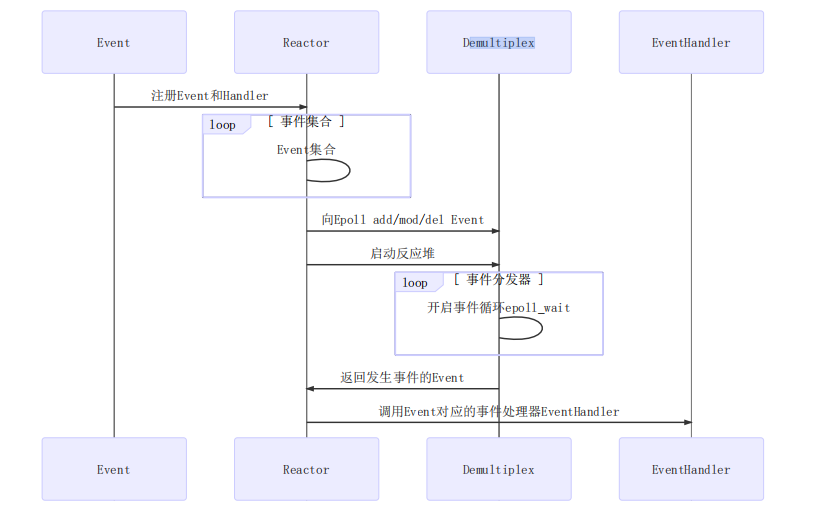
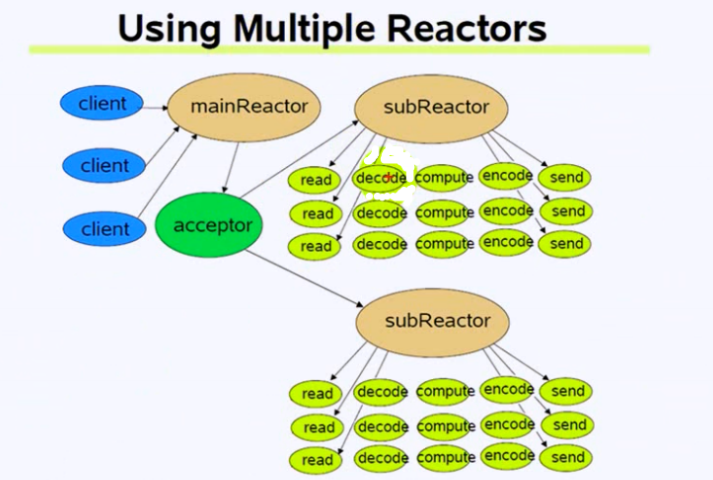

# C++ Muduo 库

https://www.bilibili.com/video/BV1UE4m1R72y/?spm_id_from=333.337.search-card.all.click&vd_source=28887ecca1f25a715214067a2b3b58ac





# noncopyable 禁止拷贝

我们在看Muduo库代码的时候可以看到，基本上大多数class都会继承noncopyable类，我们看一下noncopyable.h代码

```cpp
#ifndef NONCOPYABLE_H
#define NONCOPYABLE_H

class noncopyable{
public:
    noncopyable(const noncopyable&) = delete;
    noncopyable& operator=(const noncopyable&) = delete;
protected:
    noncopyable() = default;
    ~noncopyable() = default;
};

#endif
```

noncopyable会取消拷贝构造，这样子类继承它之后，在调用构造函数进行构造的时候会默认调用父类的构造函数来构造父类的属性，因此当进行拷贝构造的时候就会发现，父类没有拷贝构造，因此就无法实现，从而无法实现拷贝构造

# Timestamp 时间类

主要是用于格式化输出当前的时间，向外提供接口就好，非常的简单

```cpp
#ifndef TIMESTAMP_H
#define TIMESTAMP_H

#include <iostream>
#include <string>

// 时间类
class Timestamp {
public:
    //构造
    Timestamp(); 
    //带参构造 explicit 是为了防止编译器将microSecondsSinceEpoch优化成int
    explicit Timestamp(int64_t microSecondsSinceEpoch); 
    //返回当前的Timestamp
    static Timestamp now();
    //转化为string输出 //一般是Timestamp::now().toString() 这样用
    std::string toString() const;
private:
    int64_t microSecondsSinceEpoch_;
};

#endif
```

```cpp
#include "Timestamp.h"

#include <time.h>

//默认构造
Timestamp::Timestamp():microSecondsSinceEpoch_(0) {}
//带参构造
Timestamp::Timestamp(int64_t microSecondsSinceEpoch)
    : microSecondsSinceEpoch_(microSecondsSinceEpoch)
    {}

//返回当前的Timestamp
Timestamp Timestamp::now() {
    return Timestamp(time(NULL));
}

//格式化输出
std::string Timestamp::toString() const
{
    char buf[128] = {0};
    tm *tm_time = localtime(&microSecondsSinceEpoch_);
    snprintf(buf, 128, "%4d/%02d/%02d %02d:%02d:%02d", 
        tm_time->tm_year + 1900,
        tm_time->tm_mon + 1,
        tm_time->tm_mday,
        tm_time->tm_hour,
        tm_time->tm_min,
        tm_time->tm_sec);
    return buf;
}

// #include <iostream>
// int main()
// {
//     std::cout << Timestamp::now().toString() << std::endl; 
//     return 0;
// }
```


# Logger 日志

向外提供打印的接口，用以输出log信息，一共由四种信息

```cpp
// 定义日志的级别 INFO ERROR FATAL DEBUG
enum LogLevel{
    INFO,  // 普通信息
    ERROR, // 错误信息
    FATAL, // 崩溃信息(无法挽回的一些错误)
    DEBUG, // 调试信息
};
```
Logger class 里面只需要设置最为简单的接口就好，不需要写在txt里面，如果写的话涉及到日志的回滚等操作，很复杂。详细的可以看webserver的日志

那么这里只需要

```cpp
class Logger : noncopyable {
public:
    // 获取日志唯一的实例对象
    static Logger& instance();
    // 设置日志级别
    void  setLogLevel(int level);
    // 写日志
    void log(std::string message);
private:
    int logLevel_; //日志级别
    // 构造函数私有化 单例模式
    Logger(){}
};
```

单例模式，使用static，以及构造函数私有化等操作，其他的还有设置日志级别以及写日志的基础操作就好

```cpp
// 获取日志唯一的实例对象
Logger& Logger::instance(){
    static Logger logger;
    return logger;
}
// 设置日志级别
void  Logger::setLogLevel(int level){
    logLevel_ = level;
}
// 写日志 [级别日志] time : message
void Logger::log(std::string message){
    // 打印日志级别
    switch (logLevel_) {
        case INFO:
            std::cout << "[INFO]";
            break;
        case ERROR:
            std::cout << "[ERROR]";
            break;
        case FATAL:
            std::cout << "[FATAL]";
            break;
        case DEBUG:
            std::cout << "[DEBUG]";
            break;
        default:
            break;
    }
    // 打印时间和message
    std::cout << Timestamp::now().toString() << " : " << message << std::endl;
}
```

基本上到这里日志class就已经完成的，但是如果用户使用的话就需要先 instance 初始化 再 setLogLevel 才能 log 打印，会很麻烦，而且logLevel不应该由用户来设置，咱们只需要定义一些宏向外提供接口就好

```cpp
#define LOG_INFO(logMsgFormat,...)\
    do \
    {  \
        Logger& logger = Logger::instance();\
        logger.setLogLevel(INFO);\
        char buf[1024] = {0};\
        snprintf(buf,1024,logMsgFormat,##__VA_ARGS__);\
        logger.log(buf);\
    }while(0)

#define LOG_ERROR(logMsgFormat,...)\
    do \
    {  \
        Logger& logger = Logger::instance();\
        logger.setLogLevel(ERROR);\
        char buf[1024] = {0};\
        snprintf(buf,1024,logMsgFormat,##__VA_ARGS__);\
        logger.log(buf);\
    }while(0)

#define LOG_FATAL(logMsgFormat,...)\
    do \
    {  \
        Logger& logger = Logger::instance();\
        logger.setLogLevel(FATAL);\
        char buf[1024] = {0};\
        snprintf(buf,1024,logMsgFormat,##__VA_ARGS__);\
        logger.log(buf);\
        exit(-1);\
    }while(0)

// DEBUG的信息比较多，而且一般不提供给用户使用，因此设置一个MUDEBUG开关来操作一下
#ifdef MUDEBUG
#define LOG_DEBUG(logMsgFormat,...)\
    do \
    {  \
        Logger& logger = Logger::instance();\
        logger.setLogLevel(DEBUG);\
        char buf[1024] = {0};\
        snprintf(buf,1024,logMsgFormat,##__VA_ARGS__);\
        logger.log(buf);\
    }while(0)
#else
    #define LOG_DEBUG(logMsgFormat,...)
#endif
```

完整的代码

```cpp
#ifndef LOGGER_H
#define LOGGER_H

#include <string>
#include "noncopyable.h"

// 定义日志的级别 INFO ERROR FATAL DEBUG
enum LogLevel{
    INFO,  // 普通信息
    ERROR, // 错误信息
    FATAL, // 崩溃信息(无法挽回的一些错误)
    DEBUG, // 调试信息
};

// 输出一个日志类 //不需要进行拷贝构造和赋值
class Logger : noncopyable {
public:
    // 获取日志唯一的实例对象
    static Logger& instance();
    // 设置日志级别
    void  setLogLevel(int level);
    // 写日志
    void log(std::string message);
private:
    int logLevel_; //日志级别
    // 构造函数私有化 单例模式
    Logger(){}
};
// 因为在用户使用的时候不可能初始化日志，设置日志的level等操作，因此定义好提供给用户使用的宏
// LOG_INFO("%s,%d",ard1,arg2)
#define LOG_INFO(logMsgFormat,...)\
    do \
    {  \
        Logger& logger = Logger::instance();\
        logger.setLogLevel(INFO);\
        char buf[1024] = {0};\
        snprintf(buf,1024,logMsgFormat,##__VA_ARGS__);\
        logger.log(buf);\
    }while(0)

#define LOG_ERROR(logMsgFormat,...)\
    do \
    {  \
        Logger& logger = Logger::instance();\
        logger.setLogLevel(ERROR);\
        char buf[1024] = {0};\
        snprintf(buf,1024,logMsgFormat,##__VA_ARGS__);\
        logger.log(buf);\
    }while(0)

#define LOG_FATAL(logMsgFormat,...)\
    do \
    {  \
        Logger& logger = Logger::instance();\
        logger.setLogLevel(FATAL);\
        char buf[1024] = {0};\
        snprintf(buf,1024,logMsgFormat,##__VA_ARGS__);\
        logger.log(buf);\
        exit(-1);\
    }while(0)

// DEBUG的信息比较多，而且一般不提供给用户使用，因此设置一个MUDEBUG开关来操作一下
#ifdef MUDEBUG
#define LOG_DEBUG(logMsgFormat,...)\
    do \
    {  \
        Logger& logger = Logger::instance();\
        logger.setLogLevel(DEBUG);\
        char buf[1024] = {0};\
        snprintf(buf,1024,logMsgFormat,##__VA_ARGS__);\
        logger.log(buf);\
    }while(0)
#else
    #define LOG_DEBUG(logMsgFormat,...)
#endif

#endif
```

```cpp
#include "Logger.h"
#include "Timestamp.h"
#include <iostream>

// 获取日志唯一的实例对象
Logger& Logger::instance(){
    static Logger logger;
    return logger;
}
// 设置日志级别
void  Logger::setLogLevel(int level){
    logLevel_ = level;
}
// 写日志 [级别日志] time : message
void Logger::log(std::string message){
    // 打印日志级别
    switch (logLevel_) {
        case INFO:
            std::cout << "[INFO]";
            break;
        case ERROR:
            std::cout << "[ERROR]";
            break;
        case FATAL:
            std::cout << "[FATAL]";
            break;
        case DEBUG:
            std::cout << "[DEBUG]";
            break;
        default:
            break;
    }
    // 打印时间和message
    std::cout << Timestamp::now().toString() << " : " << message << std::endl;
}
```

# InetAddress address封装

主要是将IP和PORT进行封装，提供一些基础的接口 比如 toIp toIpPort toPort等,这里只做了IPV4的支持

```cpp
#ifndef INETADDRESS_H
#define INETADDRESS_H

#include <arpa/inet.h>
#include <netinet/in.h>
#include <string>

// 封装socket地址类型
class InetAddress {
public:
    //两个构造
    explicit InetAddress(uint16_t port = 0, std::string ip = "127.0.0.1");
    explicit InetAddress(const sockaddr_in &addr):addr_(addr){};

    //获取IP
    std::string toIp() const;
    //获取IP与Port
    std::string toIpPort() const;
    //获取port
    uint16_t toPort() const;
    //直接获取sockaddr_in
    const sockaddr_in* getSockAddr() const {return &addr_;}
    void setSockAddr(const sockaddr_in &addr) { addr_ = addr; }
    
private:
    sockaddr_in addr_;
};

#endif
```

```cpp
#include "InetAddress.h"
#include <string.h>

//构造
InetAddress::InetAddress(uint16_t port, std::string ip ){
    bzero(&addr_,sizeof(addr_)); //将addr_清零
    addr_.sin_family = AF_INET;
    addr_.sin_port = htons(port);
    addr_.sin_addr.s_addr = inet_addr(ip.c_str());
};
//获取IP
std::string InetAddress::toIp() const {
    // 得把addr_之中的网络字节序传成本地字节序
    char buf[64] = {0};
    // 网络地址从二进制形式转换为点分十进制（IPv4）或冒号十六进制（IPv6）的字符串形式
    inet_ntop(AF_INET,&addr_.sin_addr,buf,sizeof(buf));
    return buf;
};
//获取IP与Port
std::string InetAddress::toIpPort() const {
    char buf[64] = {0};
    inet_ntop(AF_INET,&addr_.sin_addr,buf,sizeof(buf));
    size_t end = strlen(buf);
    uint16_t port = ntohs(addr_.sin_port);
    sprintf(buf+end,":%u",port);
    return buf;
};
//获取port
uint16_t InetAddress::toPort() const {
    return ntohs(addr_.sin_port);
};

// #include<iostream>
// int main(){
//     InetAddress addr(8080);
//     std::cout<<addr.toIpPort()<<std::endl;
// }
```

# Channel 通道

简单来说，就是将fd封装起来，和poller做配合。核心思想就是自己的事情自己做

fd一般会注册到poller里面，设置一些感兴趣的事件，比如 EPOLLIN  EPOLLOUT 等，然后设置一些回调事件，当发生事件的时候就执行这些回调

要注意的是Channel会注册到poller之中，但是他俩都是由EventLoop来控制的，EventLoop里面有一个poller和多个Channel

Channel的核心思想就是自己的事情自己做，因此会有很多的操作本身的操作，比如注册事件、删除本身等操作，这些事件会会在class类里面提供接口，但是需要EventLoop来调用从而操作poller

```cpp
#ifndef CHANNEL_H
#define CHANNEL_H

#include "noncopyable.h"
#include "Timestamp.h"
#include <functional>
#include <memory>

//直接前置声明，不包含头文件,直接后面在源文件之中包含头文件，这样的话就可以直接编译成库从而不用提供给用户头文件的信息，防止泄漏更多的东西
class EventLoop; 


/**
 * 理清楚  EventLoop、Channel、Poller之间的关系   《= Reactor模型上对应 Demultiplex
 * Channel 理解为通道，封装可sockfd和其感兴趣的event 如EPOLLIN  EPOLLOUT
 * 还绑定了poller返回的具体事件
 */

class Channel : noncopyable {
public:
    //事件回调
    using EventCallback = std::function<void()>;
    //只读事件回调
    using ReadEventCallback = std::function<void(Timestamp)>; 
    
    //构造函数
    Channel(EventLoop *loop,int fd);
    ~Channel(); //析构函数

    // fd得到poller通知以后，处理事件的函数
    void handleEvent(Timestamp receiveTime);


    // 设置回调函数对象
    void setReadCallback(ReadEventCallback cb) {
        readCallback_ = std::move(cb);
    }  //读事件回调
    void setWriteCallback(EventCallback cb){
        writeCallback_ = std::move(cb);
    }  //写事件回调
    void setCloseCallback(EventCallback cb){
        closeCallback_ = std::move(cb);
    }  //关闭事件回调
    void setErrorCallback(EventCallback cb){
        errorCallback_ = std::move(cb);
    }  //错误事件回调

    // 防止当channel被手动remove掉，channel还在执行回调，使用弱智能指针实现
    void tie(const std::shared_ptr<void> &);

    // 返回绑定的fd
    int fd() const {
        return fd_;
    }
    // 返回注册的事件
    int events() const {
        return events_;
    }
    // 设置 revents_ 真正发生的事件，这个接口是放给epoll和eventloop用的
    void set_revents(int revt){
        revents_ = revt;
    }

    // 设置fd相应的事件的状态
    void enableReading() { 
        events_ |= kReadEvent; 
        update(); 
    } //读事件
    void disableReading() { 
        events_ &= ~kReadEvent; 
        update(); 
    } //取消读
    void enableWriting() { 
        events_ |= kWriteEvent; 
        update(); 
    } //写事件 
    void disableWriting() { 
        events_ &= ~kWriteEvent; 
        update(); 
    } //取消写
    void disableAll() { 
        events_ = kNoneEvent; 
        update(); 
    } //取消所有的事件

    // 返回fd当前的事件状态
    bool isNoneEvent() const {
        return events_ == kNoneEvent;
    } //对所有事件都不敢兴起
    bool isWriting() const {
        return events_ == kWriteEvent;
    } //对写事件感兴趣
    bool isReading() const {
        return events_ == kReadEvent;
    } //对读事件感兴趣

    // 返回当前的状态 -1：channel未添加到poller中 1 channel已添加到poller中 2 channel从poller中删除
    int index() {
        return index_;
    }
    // 设置状态，这个接口也是放给epoll和eventloop用的
    void set_index(int index){
        index_ = index;
    }
    // 一个线程有一个EventLoop，一个EventLoop里面有一个poller，一个poller可以监听很多的channel，因此一个channel需要有一个EventLoop。但是一个EventLoop可以包含很多的channel
    // 这个方法就是返回该channel属于那个EventLoop
    EventLoop* ownerLoop() {
        return loop_;
    }
    // 删除channel用的
    void remove();

private:

    void update();
    void handleEventWithGuard(Timestamp receiveTime);

    static const int kNoneEvent;  //没有任何事件
    static const int kReadEvent;  //读事件
    static const int kWriteEvent; //写事件

    EventLoop *loop_; // 事件注册
    const int fd_;    // fd,poller监听的对象
    int events_;      // 注册fd感兴趣的事件
    int revents_;     // poller返回的具体发生的事件


    // // index表示什么？ 在 EpollPoller之中右这个
    // // channel未添加到poller中
    // const int kNew = -1;          // channel的成员index_ = -1
    // // channel已添加到poller中
    // const int kAdded = 1;
    // // channel从poller中删除
    // const int kDeleted = 2;
    int index_;

    // weak_ptr 可以转化为 share_ptr 
    // 用lock()函数把它可以提升为shared_ptr，如果对象还活着，返回有效的shared_ptr，如果对象已经死了，提升会失败，返回一个空的shared_ptr。
    std::weak_ptr<void> tie_;
    bool tied_;

    // 因为Channel通道里面能够获取fd最终发生的事件的revents，所以它负责调用具体事件的回调操作
    // 这些方法需要用户传递过来
    ReadEventCallback readCallback_;
    EventCallback writeCallback_;
    EventCallback closeCallback_;
    EventCallback errorCallback_;
};

#endif
```

```cpp
#include "Channel.h"
#include "EventLoop.h"
#include "Logger.h"
#include <sys/epoll.h>

const int Channel::kNoneEvent = 0;                   //没有任何事件
const int Channel::kReadEvent = EPOLLIN | EPOLLPRI;  //读事件
const int Channel::kWriteEvent = EPOLLOUT;           //写事件

// 构造函数
Channel::Channel(EventLoop *loop,int fd)
    :loop_(loop),fd_(fd),events_(0),revents_(0),index_(-1),tied_(false){}

// 析构函数
Channel::~Channel(){}

// channel的tie方法什么时候调用过？
void Channel::tie(const std::shared_ptr<void> &obj){
    tie_ = obj;
    tied_ = true;
}

/**
 * 当改变channel所表示fd的events事件后，update负责在poller里面更改fd相应的事件epoll_ctl
 * EventLoop => ChannelList   Poller,  Poller与ChannelList是独立的，因此只能通过EventLoop来操作
 */
void Channel::update(){
    // 通过channel所属的EventLoop，调用poller的相应方法，注册fd的events事件
    loop_->updateChannel(this);
}

// 在channel所属的EventLoop中， 把当前的channel删除掉
void Channel::remove(){
    loop_->removeChannel(this);
}

void Channel::handleEvent(Timestamp receiveTime){
    if(tied_){
        //weak_ptr不控制对象的生命周期，但是，它知道对象是否还活着
        //用lock()函数把它可以提升为shared_ptr，如果对象还活着，返回有效的shared_ptr，如果对象已经死了，提升会失败，返回一个空的shared_ptr。
        std::shared_ptr<void> guard = tie_.lock();
        if(guard){
            handleEventWithGuard(receiveTime);
        }
    }else{
        handleEventWithGuard(receiveTime);
    }
}

// 根据poller通知的channel发生的具体事件， 由channel负责调用具体的回调操作
// 根据相应的事件来调用相应的回调
void Channel::handleEventWithGuard(Timestamp receiveTime){

    LOG_INFO("channel handleEvent revents:%d\n", revents_);
    // 关闭事件
    if ((revents_ & EPOLLHUP) && !(revents_ & EPOLLIN)) {
        if (closeCallback_) {
            closeCallback_();
        }
    }
    // 错误事件
    if (revents_ & EPOLLERR) {
        if (errorCallback_) {
            errorCallback_();
        }
    }
    // 读事件
    if (revents_ & (EPOLLIN | EPOLLPRI)) {
        if (readCallback_) {
            readCallback_(receiveTime);
        }
    }
    // 写事件
    if (revents_ & EPOLLOUT) {
        if (writeCallback_) {
            writeCallback_();
        }
    }
}
```

# Poller 封装

Muduo提供了poll与Epoll，处于复用的考虑，在使用的时候不可能提供固定poll与Epoll，因此要将两者封装一下，使用一个抽象类Poller，poll与Epoll来继承Poller，这样使用的时候直接用Poller来替代即可

抽象类Poller提供一些通用的接口，由poll与Epoll来实现，比如updateChannel removeChannel 等事件

```cpp
#ifndef POLLER_H
#define POLLER_H

#include "noncopyable.h"
#include "Timestamp.h"
#include <vector>
#include <unordered_map>

class Channel;
class EventLoop;

// muduo库中多路事件分发器的核心IO复用模块
class Poller: noncopyable {
public:
    using ChannelList = std::vector<Channel*>;

    Poller(EventLoop *loop);    // 构造函数
    virtual ~Poller() = default;// 析构函数

    // 给所有的IO复用保留统一的接口 select poll epoll
    virtual Timestamp poll(int timeoutMs,ChannelList *activeChannels) = 0;
    virtual void updateChannel(Channel *channel) = 0;   //updata Channel的事件
    virtual void removeChannel(Channel *channel) = 0;   //删除Channel的
    
    // 判断参数channel是否在poller之中
    bool hasChannel(Channel *channel) const;

    // EventLoop可以通过该接口获取默认的IO复用的具体实现
    static Poller* newDefaultPoller(EventLoop *loop);
protected:
    // map的key：sockfd  value：sockfd所属的channel通道类型
    using ChannelMap = std::unordered_map<int,Channel*>;
    ChannelMap channels_;
private:
    EventLoop *ownerLoop_; //定义Poller所属的事件循环EventLoop
};

#endif
```

```cpp
#include "Poller.h"
#include "Channel.h"

Poller::Poller(EventLoop *loop):ownerLoop_(loop){}

bool Poller::hasChannel(Channel *channel) const {
    auto it = channels_.find(channel->fd());
    return it != channels_.end() && it->second == channel;
}
```

```cpp
// DefaultPoller.cc
#include "Poller.h"
#include <stdlib.h>
// #include "PollPoller.h"
#include "EpollPoller.h"

// 想一下为啥在这里实现，不在Poller里面实现,因为PollPoller 与 EPollPoller 继承于Poller,如果在Poller.cc 里面实现的话就得包含PollPoller.h EPollPoller.h 感觉有一些反过来了
Poller* Poller::newDefaultPoller(EventLoop *loop){
    if (::getenv("MUDUO_USE_POLL")) {
        return nullptr; // 生成poll的实例 因为没有实现
    }
    else {
        return new EpollPoller(loop); // 生成epoll的实例
    }
}
```

EpollPoller 就是真正的 IO多路复用的实现了 poll没有实现

EpollPoller要实现Poller的接口和一些基本的操作，主要是将epoll的一些事情封装起来 

```cpp
#ifndef EPOLLPOLLER_H
#define EPOLLPOLLER_H

#include "Poller.h"
#include <vector>
#include <sys/epoll.h>


class Channel;

/**
 * epoll的使用  
 * epoll_create
 * epoll_ctl   add/mod/del
 * epoll_wait
 */ 
class EpollPoller : public Poller {
public:
    EpollPoller(EventLoop* loop);
    ~EpollPoller() override;

    // 重写基类Poller的抽象方法
    Timestamp poll(int timeoutMs,ChannelList *activeChannels) override;
    void updateChannel(Channel *channel) override;
    void removeChannel(Channel *channel) override;
private: 
    static const int kInitEventListSize = 16;
    
    // 填充活跃链接
    void fillActiveChannels(int numEvents,ChannelList *activeChannels) const;
    // 更新channel通道
    void update(int operation,Channel *channel);
    
    using EventList = std::vector<epoll_event>;

    int epollfd_;
    EventList events_;

};

#endif
```

```cpp
#include "EpollPoller.h"
#include "Logger.h"
#include "Channel.h"

#include <errno.h>
#include <unistd.h>
#include <strings.h>


// channel未添加到poller中
const int kNew = -1;          // channel的成员index_ = -1
// channel已添加到poller中
const int kAdded = 1;
// channel从poller中删除
const int kDeleted = 2;

EpollPoller::EpollPoller(EventLoop* loop)
    :Poller(loop),
    epollfd_(::epoll_create1(EPOLL_CLOEXEC)),
    events_(kInitEventListSize)  // vector<epoll_event>
{
    // 错误处理
    if(epollfd_ < 0){
        LOG_FATAL("epoll_create error:%d \n",errno);
    }
    
}

EpollPoller::~EpollPoller(){
    ::close(epollfd_);
}


// 重写基类Poller的抽象方法 
// EventLoop 调用 poller.poll，  poller.poll通过将epoll_wait之中发生事件的channel写入activeChannels之中来告知EventLoop那些发生了
Timestamp EpollPoller::poll(int timeoutMs,ChannelList *activeChannels){
    // 实际上应该用LOG_DEBUG输出日志更为合理
    LOG_INFO("func=%s => fd total count:%lu \n", __FUNCTION__, channels_.size());

    int numEvents = ::epoll_wait(epollfd_,&*events_.begin(),static_cast<int>(events_.size()),timeoutMs);
    int saveErrno = errno;
    Timestamp now(Timestamp::now());

    if(numEvents > 0){
        LOG_INFO("%d events happened \n", numEvents);
        fillActiveChannels(numEvents,activeChannels);
        if(numEvents == events_.size()){ //所有的event都发生了，那么可能空间不够，需要扩容
            events_.resize(events_.size() * 2);
        }
    }else if(numEvents == 0){ // 超时链
         LOG_DEBUG("%s timeout! \n", __FUNCTION__);
    }else{ //外部中断
        if (saveErrno != EINTR){
            errno = saveErrno;
            LOG_ERROR("EPollPoller::poll() err!");
        }
    }
    return now;
}

// channel update remove => EventLoop updateChannel removeChannel => Poller updateChannel removeChannel
/**
 *            EventLoop  =>   poller.poll  
 *     ChannelList      Poller
 *                     ChannelMap  <fd, channel*>   epollfd
 */ 
void EpollPoller::updateChannel(Channel *channel){

    const int index = channel->index();
    LOG_INFO("func=%s => fd=%d events=%d index=%d \n", __FUNCTION__, channel->fd(), channel->events(), index);
    // channel还没有注册或者是已经删除掉了（kDeleted的时候Poller里面的ChannelMap里面并没有删除掉,调用removeChannel的时候才会在ChannelMap里面删除掉）
    if(index == kNew || index == kDeleted){ 
        if(index == kNew){
            int fd = channel->fd();
            channels_[fd] = channel;
        }
        channel->set_index(kAdded);
        update(EPOLL_CTL_ADD,channel);
    } else {  // channel已经在poller上注册过了
        int fd = channel->fd();
        if(channel->isNoneEvent()){ //对任何事情都不感兴趣了，那就删除
            update(EPOLL_CTL_DEL,channel);
            channel->set_index(kDeleted);
        }else{
            update(EPOLL_CTL_MOD,channel);
        }
    }
}

// 从poller中删除channel
void EpollPoller::removeChannel(Channel *channel){
    int fd = channel->fd();
    channels_.erase(fd);

    LOG_INFO("func=%s => fd=%d\n", __FUNCTION__, fd);

    int index = channel->index();
    if(index == kAdded){
        update(EPOLL_CTL_DEL,channel);
    }
    channel->set_index(kNew);

}


// 填充活跃链接
void EpollPoller::fillActiveChannels(int numEvents,ChannelList *activeChannels) const{
    for(int i=0;i<numEvents;i++){
        Channel* channel = static_cast<Channel*>(events_[i].data.ptr);
        channel->set_revents(events_[i].events);
        activeChannels->push_back(channel);  // EventLoop就拿到了它的poller给它返回的所有发生事件的channel列表了
    }
}
// 更新channel通道 epoll_ctl add/mod/del
void EpollPoller::update(int operation,Channel *channel){
    epoll_event event;
    bzero(&event,sizeof event);

    int fd = channel->fd();

    event.events = channel->events();
    event.data.fd = fd;
    event.data.ptr = channel;

    if(::epoll_ctl(epollfd_,operation,fd,&event) < 0){
        if(operation == EPOLL_CTL_DEL){
            LOG_ERROR("epoll_ctl del error:%d\n", errno);
        }else{
            LOG_FATAL("epoll_ctl add/mod error:%d\n", errno);
        }
    }
}
```

其他的倒是挺常规的，要注意的是kNew kAdded kDeleted三个状态，EventList 与 ChannelList的管理，activeChannels的管理等操作

还有的是update函数里面event.data.ptr = channel;这一行代码，与fillActiveChannels里面的操作相联动

前面已经说了，poller是由EventLoop来管理的，因此Timestamp EpollPoller::poll(int timeoutMs,ChannelList *activeChannels)是由EventLoop来调用的

EventLoop传给Timestamp EpollPoller::poll(int timeoutMs,ChannelList *activeChannels) activeChannels，就会得到相应的channel，后面再由EventLoop调用channel的handleEvent来处理事件就好

# EventLoop  Reactor

上面已经说了EventLoop负责管理一个poller与很多个Channel，这个有点复杂 要注意的是四个函数   void wakeup();  void loop();    void runInLoop(Functor cb);  void queueInLoop(Functor cb);  要不然可能会迷糊，其他的就挺常规的

先看代码，先了解一下其他的函数，这里就不多讲了

```cpp
#ifndef EVENTLOOP_H
#define EVENTLOOP_H

#include <functional>
#include <vector>
#include <atomic>
#include <memory>
#include <mutex>

#include "noncopyable.h"
#include "Timestamp.h"
#include "CurrentThread.h"

class Channel;
class Poller;

class EventLoop {
public:
    using Functor = std::function<void()>;

    EventLoop();
    ~EventLoop();

    // 开启事件循环
    void loop();
    // 退出事件循环
    void quit();

    Timestamp pollReturnTime() const {
        return pollReturnTime_;
    }

    // 在当前loop中执行cb
    void runInLoop(Functor cb);
    // 把cb放入队列中，唤醒loop所在的线程，执行cb
    void queueInLoop(Functor cb);

    // 用来唤醒loop所在的线程的
    void wakeup();

    // EventLoop的方法 =》 Poller的方法
    void updateChannel(Channel *channel);
    void removeChannel(Channel *channel);
    bool hasChannel(Channel *channel);
    
    // 判断EventLoop对象是否在自己的线程里面
    bool isInLoopThread() const {
        return threadId_ == CurrentThread::tid();
    }

private:
    void handleRead();         // wake up
    void doPendingFunctors();  // 执行回调

    using ChannelList = std::vector<Channel*>;

    std::atomic_bool looping_;  //原子操作
    std::atomic_bool quit_;  //标志退出loop循环

    const pid_t threadId_; // 记录当前loop所在线程的id
    
    Timestamp pollReturnTime_; // poller返回发生事件的channels的时间点
    std::unique_ptr<Poller> poller_;

    int wakeupFd_;   // 主要作用，当mainLoop获取一个新用户的channel，通过轮询算法选择一个subloop，通过该成员唤醒subloop处理channel
    std::unique_ptr<Channel> wakeupChannel_; //将wakeupFd_打包成channel

    ChannelList activeChannels_;

    std::atomic_bool callingPendingFunctors_; // 标识当前loop是否有需要执行的回调操作
    std::vector<Functor> pendingFunctors_;    // 存储loop需要执行的所有的回调操作
    std::mutex mutex_;                        // 互斥锁，用来保护上面vector容器的线程安全操作

};

#endif
```

```cpp
#include "EventLoop.h"
#include "Logger.h"
#include "Poller.h"
#include "Channel.h"

#include <sys/eventfd.h>
#include <unistd.h>
#include <fcntl.h>
#include <errno.h>
#include <memory>

// 防止一个线程创建多个EventLoop   thread_local 相当于线程里面的单例模式,看构造函数
__thread EventLoop *t_loopInThisThread = nullptr;

// 定义默认的Poller IO复用接口的超时时间
const int kPollTimeMs = 10000;

int createEventfd(){
    int evtfd = ::eventfd(0, EFD_NONBLOCK | EFD_CLOEXEC);
    if(evtfd < 0){
        LOG_FATAL("eventfd error:%d \n", errno);
    }
    return evtfd;
}

EventLoop::EventLoop() 
    : looping_(false)
    , quit_(false)
    , callingPendingFunctors_(false)
    , threadId_(CurrentThread::tid())
    , poller_(Poller::newDefaultPoller(this))
    , wakeupFd_(createEventfd())
    , wakeupChannel_(new Channel(this, wakeupFd_)) {

    LOG_DEBUG("EventLoop created %p in thread %d \n", this, threadId_);
    if(t_loopInThisThread) {
        // 防止一个线程创建多个EventLoop 
        LOG_FATAL("Another EventLoop %p exists in this thread %d \n", t_loopInThisThread, threadId_);
    }else {
        t_loopInThisThread = this;
    }

    // 设置wakeupfd的事件类型以及发生事件后的回调操作
    wakeupChannel_->setReadCallback(std::bind(&EventLoop::handleRead,this));
    // 每一个eventloop都将监听wakeupchannel的EPOLLIN读事件了
    // mainReactor给subReactor发送一个消息，那么subReactor就不阻塞了，起来做事情了
    wakeupChannel_->enableReading();
}
EventLoop::~EventLoop() {
    wakeupChannel_->disableAll();
    wakeupChannel_->remove();
    ::close(wakeupFd_);
    t_loopInThisThread = nullptr;
}

//mainReactor给subReactor发送一个消息，那么subReactor就不阻塞了，起来做事情了
void EventLoop::handleRead()
{
  uint64_t one = 1;
  ssize_t n = read(wakeupFd_, &one, sizeof one);
  if (n != sizeof one) {
    LOG_ERROR("EventLoop::handleRead() reads %lu bytes instead of 8", n);
  }
}

// 开启事件循环
void EventLoop::loop(){
    looping_ = true;
    quit_ = false;

    LOG_INFO("EventLoop %p start looping \n", this);

    while(!quit_){
        activeChannels_.clear();
        // 监听两类fd   一种是client的fd，一种wakeupfd（mainLoop与channel之间的通信）
        // 正常的client的fd就直接用下面的channel->handleEvent(pollReturnTime_);来解决了
        // wakeupf基本上用于接收新的连接，由mainLoop注册一些回调cb存储在pendingFunctors_然后再唤醒subloop，由subloop来执行这些回调，这样方便把这些新的连接注册到subloop上  这一操作由doPendingFunctors函数实现
        pollReturnTime_ = poller_->poll(kPollTimeMs,&activeChannels_);
        for(Channel* channel:activeChannels_){
            // Poller监听哪些channel发生事件了，然后上报给EventLoop，通知channel处理相应的事件
            channel->handleEvent(pollReturnTime_);
        }
        // 执行当前EventLoop事件循环需要处理的回调操作
        /**
         * IO线程 mainLoop accept fd《=channel subloop   mainLoop接收新的连接得到fd，我们用channel打包fd然后分发给subloop来执行一些回调
         * mainLoop 事先注册一个回调cb（需要subloop来执行）    wakeup subloop后，执行下面的方法，执行之前mainloop注册的cb操作（pendingFunctors_）
         */ 
        doPendingFunctors();
    }

    LOG_INFO("EventLoop %p stop looping. \n", this);
    looping_ = false;
}

// 退出事件循环  
// 1.loop在自己的线程中调用quit(这就直接结束了，下次loop函数里面while循环发现quit为true就结束了)  
// 2.在非loop的线程中，调用loop的quit，那么这个loop可能在阻塞 poller_->poll 这一部，则需要把这个loop先唤醒，这样的话等下一次循环的时候发现quit_为true就结束了，反之不唤醒的话就会一直阻塞在poller_->poll这一步，如果不发生事件可能永远无法结束 
/**
 *              mainLoop
 * 
 *                                             no ==================== 生产者-消费者的线程安全的队列
 * 
 *  subLoop1     subLoop2     subLoop3
 */ 
void EventLoop::quit(){
    quit_ = true;
    // 如果是在其它线程中，调用的quit   在一个subloop(woker)中，调用了mainLoop(IO)的quit
    if (!isInLoopThread()) {
        wakeup();
    }
}


// 在当前loop中执行cb
void EventLoop::runInLoop(Functor cb){
    if(isInLoopThread()){   // 在当前的loop线程中，执行cb
        cb();
    }else{                  // 在非当前loop线程中执行cb , 就需要唤醒loop所在线程，执行cb
        queueInLoop(cb);
    }
}

// 把cb放入队列中，唤醒loop所在的线程，执行cb
void EventLoop::queueInLoop(Functor cb){
    {
        std::unique_lock<std::mutex> lock(mutex_);
        pendingFunctors_.emplace_back(cb);
    }
    // 唤醒相应的，需要执行上面回调操作的loop的线程了
    // || callingPendingFunctors_的意思是：当前loop正在执行回调，但是loop又有了新的回调
    if(!isInLoopThread() || callingPendingFunctors_){
        wakeup();// 唤醒loop所在线程
    }
}


// 用来唤醒loop所在的线程的  向wakeupfd_写一个数据，wakeupChannel就发生读事件，当前loop线程就会被唤醒
void EventLoop::wakeup() {
    uint64_t one = 1;
    ssize_t n = write(wakeupFd_, &one, sizeof one);
    if (n != sizeof one) {
        LOG_ERROR("EventLoop::wakeup() writes %lu bytes instead of 8 \n", n);
    }
}

// EventLoop的方法 =》 Poller的方法
void EventLoop::updateChannel(Channel *channel) {
    poller_->updateChannel(channel);
}

void EventLoop::removeChannel(Channel *channel){
    poller_->removeChannel(channel);
}

bool EventLoop::hasChannel(Channel *channel) {
    return poller_->hasChannel(channel);
}

void EventLoop::doPendingFunctors() {  // 执行回调
    std::vector<Functor> functors;
    callingPendingFunctors_ = true;
    {
        std::unique_lock<std::mutex> lock(mutex_);
        functors.swap(pendingFunctors_);  //不直接使用pendingFunctors_执行下面的代码为了防止一边写一边读，交叉持有锁，造成耗费时间
    }
    for(const Functor &functor: functors){
        functor();  // 执行当前loop需要执行的回调操作
    }

    callingPendingFunctors_ = false;
}
```

首先是wakeup函数， EventLoop肯定会调用poller_->poll （也就是epoll_wait），这里肯定会阻塞，但是有一些特殊情况可能需要唤醒这个（这个特殊情况一会再说），因此需要wakeup来实现

我们看到EventLoop里面有一个wakeupFd_的属性，系统会提供一个eventfd函数，这个和socketfd用法差不多也可以用来读和写，将eventfd封装成channel再用poller来监听，这样的话要实现wakeup的话就简单了，只需要注册读事件，然后往wakeupFd_里面写一些东西就好

我们可以看到构造函数里面wakeupChannel_注册了enableReading读事件，setReadCallback设置的回调是EventLoop::handleRea

我们把wakeup与handleRead拿出来看一下

```cpp
//wakeup 就是写
void EventLoop::wakeup()
{
    uint64_t one = 1;
    ssize_t n = write(wakeupFd_, &one, sizeof one);
    if (n != sizeof one)
    {
        LOG_ERROR("EventLoop::wakeup() writes %lu bytes instead of 8 \n", n);
    }
}
```

```cpp
// handleRead 就是读
void EventLoop::handleRead()
{
  uint64_t one = 1;
  ssize_t n = read(wakeupFd_, &one, sizeof one);
  if (n != sizeof one)
  {
    LOG_ERROR("EventLoop::handleRead() reads %lu bytes instead of 8", n);
  }
}
```

然后看void loop(); 

这个就比较简单了，主要是逻辑，为什么说比较简单，我们看代码就知道

```cpp
void EventLoop::loop(){
    looping_ = true;
    quit_ = false;

    LOG_INFO("EventLoop %p start looping \n", this);

    while(!quit_){
        activeChannels_.clear();
        // 监听两类fd   一种是client的fd，一种wakeupfd（mainLoop与channel之间的通信）
        // 正常的client的fd就直接用下面的channel->handleEvent(pollReturnTime_);来解决了
        // wakeupf基本上用于接收新的连接，由mainLoop注册一些回调cb存储在pendingFunctors_然后再唤醒subloop，由subloop来执行这些回调，这样方便把这些新的连接注册到subloop上  这一操作由doPendingFunctors函数实现
        pollReturnTime_ = poller_->poll(kPollTimeMs,&activeChannels_);
        for(Channel* channel:activeChannels_){
            // Poller监听哪些channel发生事件了，然后上报给EventLoop，通知channel处理相应的事件
            channel->handleEvent(pollReturnTime_);
        }
        // 执行当前EventLoop事件循环需要处理的回调操作
        /**
         * IO线程 mainLoop accept fd《=channel subloop   mainLoop接收新的连接得到fd，我们用channel打包fd然后分发给subloop来执行一些回调
         * mainLoop 事先注册一个回调cb（需要subloop来执行）    wakeup subloop后，执行下面的方法，执行之前mainloop注册的cb操作（pendingFunctors_）
         */ 
        doPendingFunctors();
    }

    LOG_INFO("EventLoop %p stop looping. \n", this);
    looping_ = false;
}
```

基本上就几行，调用poller_->poll(kPollTimeMs,&activeChannels_)获取那些channel发生事件了，然后回调事件channel可以自己做，这里做一下调用就行，其他的就是doPendingFunctors


doPendingFunctors就涉及到void runInLoop(Functor cb);  void queueInLoop(Functor cb); 这两个函数了

runInLoop比较好理解，就是当前loop所在的线程执行的函数，这样的话就直接执行就好了

```cpp
// 在当前loop中执行cb
void EventLoop::runInLoop(Functor cb){
    if(isInLoopThread()){   // 在当前的loop线程中，执行cb
        cb();
    }else{                  // 在非当前loop线程中执行cb , 就需要唤醒loop所在线程，执行cb
        queueInLoop(cb);
    }
}
```

当在非当前loop线程中执行cb的时候就需要调用queueInLoop函数了

```cpp
// 把cb放入队列中，唤醒loop所在的线程，执行cb
void EventLoop::queueInLoop(Functor cb){
    {
        std::unique_lock<std::mutex> lock(mutex_);
        pendingFunctors_.emplace_back(cb);
    }
    // 唤醒相应的，需要执行上面回调操作的loop的线程了
    // || callingPendingFunctors_的意思是：当前loop正在执行回调，但是loop又有了新的回调
    if(!isInLoopThread() || callingPendingFunctors_){
        wakeup();// 唤醒loop所在线程
    }
}
```

queueInLoop会把cb放置到pendingFunctors_里面，然后唤醒当前loop（原来的loop可能正在阻塞的状态），然后loop就会调用doPendingFunctors


```cpp
void EventLoop::doPendingFunctors() {  // 执行回调
    std::vector<Functor> functors;
    callingPendingFunctors_ = true;
    {
        std::unique_lock<std::mutex> lock(mutex_);
        functors.swap(pendingFunctors_);  //不直接使用pendingFunctors_执行下面的代码为了防止一边写一边读，交叉持有锁，造成耗费时间
    }
    for(const Functor &functor: functors){
        functor();  // 执行当前loop需要执行的回调操作
    }

    callingPendingFunctors_ = false;
}
```

逐一执行pendingFunctors_里面的函数

# Thread EventLoopThread EventLoopThreadPool

Thread是对<thread>库的封装，其他没有特殊的

```cpp
#ifndef THREAD_H
#define THREAD_H

#include "noncopyable.h"

#include <functional>
#include <thread>
#include <memory>
#include <unistd.h>
#include <string>
#include <atomic>

class Thread: noncopyable {
public:
    using ThreadFunc = std::function<void()>;

    explicit Thread(ThreadFunc,const std::string &name = std::string());
    ~Thread();

    void start();
    void join();

    bool started() const { 
        return started_; 
    }
    pid_t tid() const { 
        return tid_; 
    }
    const std::string& name() const { 
        return name_; 
    }
    static int numCreated() { 
        return numCreated_; 
    }

private:
    void setDefaultName();

    bool started_;
    bool joined_;
    std::shared_ptr<std::thread> thread_;
    pid_t tid_;
    ThreadFunc func_;
    std::string name_;
    static std::atomic_int numCreated_;    
};

#endif
```

```cpp
#include "Thread.h"
#include "CurrentThread.h"

#include <semaphore.h>

std::atomic_int Thread::numCreated_(0);

Thread::Thread(ThreadFunc func,const std::string &name)
    : started_(false)
    , joined_(false)
    , tid_(0)
    , func_(std::move(func))
    , name_(name)
{
    setDefaultName();
}

Thread::~Thread(){
    if(started_ && !joined_){
        thread_->detach();    // thread类提供的设置分离线程的方法 detach之后等到线程结束之后会自动join
    }
}

void Thread::setDefaultName(){
    int num = ++ numCreated_;
    if(name_.empty()){
        char buf[32] = {0};
        snprintf(buf, sizeof buf, "Thread%d", num);
        name_ = buf;
    }
}

void Thread::start(){    // 一个Thread对象，记录的就是一个新线程的详细信息
    started_ = true;
    sem_t sem;
    sem_init(&sem,false,0);  //信号量为0
    // 开启线程
    thread_ = std::shared_ptr<std::thread>(new std::thread([&](){
        // 获取线程的tid值
        tid_ = CurrentThread::tid();
        sem_post(&sem); //信号量+1
        // 开启一个新线程，专门执行该线程函数
        func_(); 
    }));
    // 这里必须等待获取上面新创建的线程的tid值,因为有时候会使用tid是否大于0来判断是否创建成功
    sem_wait(&sem); //信号量-1
}

void Thread::join(){
    joined_ = true;
    thread_->join();
}

```

这里我们看，我们用的是std::shared_ptr<thread> thread_; 来存储的，正常的话如果我们直接申请一个thread，那么它就直接start了，这样的话我们就可以通过调用void Thread::start()来开始了


EventLoopThread 将Eventloop和Thread结合起来，简单来说就是创建线程，循环里面是一个loop，这就muduo所追求的 one loop per thread

```cpp
#ifndef EVENTLOOPTHREAD_H
#define EVENTLOOPTHREAD_H

#include "noncopyable.h"
#include "Thread.h"

#include <functional>
#include <mutex>
#include <condition_variable>
#include <string>

class EventLoop;

class EventLoopThread:noncopyable {
public:
    using ThreadInitCallback = std::function<void(EventLoop*)>; 

    EventLoopThread(const ThreadInitCallback &cb = ThreadInitCallback(),const std::string &name = std::string());
    ~EventLoopThread();

    EventLoop* startLoop();

private:

    void threadFunc();
    
    EventLoop* loop_;

    bool exiting_;
    Thread thread_;
    std::mutex mutex_;
    std::condition_variable cond_;
    ThreadInitCallback callback_;
};

#endif
```

```cpp
#include "EventLoopThread.h"
#include "EventLoop.h"

EventLoopThread::EventLoopThread(const ThreadInitCallback &cb, 
        const std::string &name)
        : loop_(nullptr)
        , exiting_(false)
        , thread_(std::bind(&EventLoopThread::threadFunc, this), name)
        , mutex_()
        , cond_()
        , callback_(cb) {

}

EventLoopThread::~EventLoopThread(){
    exiting_ = true;
    if(loop_ != nullptr){
        loop_->quit();
        thread_.join();
    }
}

EventLoop* EventLoopThread::startLoop() {
    thread_.start();  // 启动底层的新线程 执行的是threadFunc

    EventLoop *loop = nullptr;
    {
        std::unique_lock<std::mutex> lock(mutex_);
        while(loop_ == nullptr){
            cond_.wait(lock);
        }
        loop = loop_;
    }
    return loop;
}

// 下面这个方法，实在单独的新线程里面运行的
void EventLoopThread::threadFunc() {
    EventLoop loop; // 创建一个独立的eventloop，和上面的线程是一一对应的，one loop per thread

    if(callback_){
        callback_(&loop);
    }

    {
        std::unique_lock<std::mutex> lock(mutex_);
        loop_ = &loop;
        cond_.notify_one();
    }

    loop.loop(); // EventLoop loop  => Poller.poll
    std::unique_lock<std::mutex> lock(mutex_);
    loop_ = nullptr;
}
```

EventLoopThreadPool 声明多个EventLoop 以供选择，主要是setThreadNum函数以及 EventLoop* getNextLoop();方法

```cpp
#ifndef EVENTLOOPTHREADPOOL_H
#define EVENTLOOPTHREADPOOL_H

#include "noncopyable.h"

#include <functional>
#include <string>
#include <vector>
#include <memory>

class EventLoop;
class EventLoopThread;


class EventLoopThreadPool: noncopyable {
public:
    using ThreadInitCallback = std::function<void(EventLoop*)>; 

    EventLoopThreadPool(EventLoop *baseLoop, const std::string &nameArg);
    ~EventLoopThreadPool();

    void setThreadNum(int numThreads) {
        numThreads_ = numThreads;
    }

    void start(const ThreadInitCallback &cb = ThreadInitCallback());

    // 如果工作在多线程中，baseLoop_默认以轮询的方式分配channel给subloop
    EventLoop* getNextLoop();

    std::vector<EventLoop*> getAllLoops();

    bool started() const { return started_; }
    const std::string name() const { return name_; }


private:

    EventLoop *baseLoop_; // EventLoop loop;  
    std::string name_;
    bool started_;
    int numThreads_;
    int next_;
    std::vector<std::unique_ptr<EventLoopThread>> threads_;
    std::vector<EventLoop*> loops_;
};

#endif

```

```cpp
#include "EventLoopThreadPool.h"
#include "EventLoopThread.h"

#include <memory>

EventLoopThreadPool::EventLoopThreadPool(EventLoop *baseLoop, const std::string &nameArg)
    : baseLoop_(baseLoop)
    , name_(nameArg)
    , started_(false)
    , numThreads_(0)
    , next_(0)
{}

EventLoopThreadPool::~EventLoopThreadPool() {}


void EventLoopThreadPool::start(const ThreadInitCallback &cb) {
    started_ = true;

    for (int i = 0; i < numThreads_; ++i)
    {
        char buf[name_.size() + 32];
        snprintf(buf, sizeof buf, "%s%d", name_.c_str(), i);
        EventLoopThread *t = new EventLoopThread(cb, buf);
        threads_.push_back(std::unique_ptr<EventLoopThread>(t));
        loops_.push_back(t->startLoop()); // 底层创建线程，绑定一个新的EventLoop，并返回该loop的地址
    }

    // 整个服务端只有一个线程，运行着baseloop
    if (numThreads_ == 0 && cb)
    {
        cb(baseLoop_);
    }
}

// 如果工作在多线程中，baseLoop_默认以轮询的方式分配channel给subloop
EventLoop* EventLoopThreadPool::getNextLoop()
{
    EventLoop *loop = baseLoop_;
    if (!loops_.empty()) { // 通过轮询获取下一个处理事件的loop
        loop = loops_[next_];
        ++next_;
        if (next_ >= loops_.size()) {
            next_ = 0;
        }
    }
    return loop;
}

std::vector<EventLoop*> EventLoopThreadPool::getAllLoops() {
    if (loops_.empty()) {
        return std::vector<EventLoop*>(1, baseLoop_);
    }
    else {
        return loops_;
    }
}
```

这里我们看start的时候通过numThreads_来初始化EventLoopThread的数量numThreads_是subReactor的数量，这个和原始的muduo不一样，原始的muduo是baseloop + subReactor的数量

最为主要的是通过轮询的方法来选择subReactor（EventLoop）看EventLoop* EventLoopThreadPool::getNextLoop()，如果loops_为空的话就只会return baseLoop_了

# Socket Socket的封装

前面我们封装了IP 与 PORT (InetAddress) 这里的Socket是对 socket fd的封装 也就是 初始化 bind listen accept

```cpp
#ifndef SOCKET_H
#define SOCKET_H

#include "noncopyable.h"

class InetAddress;

// 封装socket fd
class Socket : noncopyable
{
public:
    explicit Socket(int sockfd)
        : sockfd_(sockfd)
    {}

    ~Socket();

    int fd() const { return sockfd_; }
    void bindAddress(const InetAddress &localaddr);
    void listen();
    int accept(InetAddress *peeraddr);

    void shutdownWrite();
    //一些选项
    void setTcpNoDelay(bool on);
    void setReuseAddr(bool on);
    void setReusePort(bool on);
    void setKeepAlive(bool on);
private:
    const int sockfd_;
};
#endif
```

```cpp
#include "Socket.h"
#include "Logger.h"
#include "InetAddress.h"

#include <unistd.h>
#include <sys/types.h>         
#include <sys/socket.h>
#include <strings.h>
#include <netinet/tcp.h>
#include <sys/socket.h>


Socket::~Socket(){
    close(sockfd_);
}

void Socket::bindAddress(const InetAddress &localaddr){
    // 绑定
    if(0 != ::bind(sockfd_,(sockaddr*)localaddr.getSockAddr(),sizeof(sockaddr_in))){
        LOG_FATAL("bind sockfd:%d fail \n", sockfd_);
    }
}

void Socket::listen(){
    // 监听
    if(0 != ::listen(sockfd_,1024)){
        LOG_FATAL("listen sockfd:%d fail \n", sockfd_);
    }
}

int Socket::accept(InetAddress *peeraddr){
    /**
     * 1. accept函数的参数不合法
     * 2. 对返回的connfd没有设置非阻塞
     * Reactor模型 one loop per thread
     * poller + non-blocking IO
     */ 
    sockaddr_in addr;
    socklen_t len = sizeof addr;
    bzero(&addr,sizeof addr);
    int connfd = ::accept4(sockfd_,(sockaddr*)&addr,&len,SOCK_NONBLOCK | SOCK_CLOEXEC);
    //把连接的addr存储在peeraddr之中，方便返回
    if(connfd >= 0){
        peeraddr->setSockAddr(addr);
    }
    return connfd;
}

void Socket::shutdownWrite(){
    if(::shutdown(sockfd_,SHUT_WR) < 0){
        LOG_ERROR("shutdownWrite error");
    }
}

void Socket::setTcpNoDelay(bool on)
{
    int optval = on ? 1 : 0;
    ::setsockopt(sockfd_, IPPROTO_TCP, TCP_NODELAY, &optval, sizeof optval);
}

void Socket::setReuseAddr(bool on)
{
    int optval = on ? 1 : 0;
    ::setsockopt(sockfd_, SOL_SOCKET, SO_REUSEADDR, &optval, sizeof optval);
}

void Socket::setReusePort(bool on)
{
    int optval = on ? 1 : 0;
    ::setsockopt(sockfd_, SOL_SOCKET, SO_REUSEPORT, &optval, sizeof optval);
}

void Socket::setKeepAlive(bool on)
{
    int optval = on ? 1 : 0;
    ::setsockopt(sockfd_, SOL_SOCKET, SO_KEEPALIVE, &optval, sizeof optval);
}
```

# Acceptor 新连接接收

Acceptor会工作在mainLoop之中，负责接受新的连接

```cpp
#ifndef ACCEPTOR_H
#define ACCEPTOR_H
#include "noncopyable.h"
#include "Socket.h"
#include "Channel.h"

#include <functional>

class EventLoop;
class InetAddress;

class Acceptor : noncopyable
{
public:
    //新连接的回调
    using NewConnectionCallback = std::function<void(int sockfd, const InetAddress&)>;

    Acceptor(EventLoop *loop, const InetAddress &listenAddr, bool reuseport);
    ~Acceptor();

    //设置回调
    void setNewConnectionCallback(const NewConnectionCallback &cb) {
        newConnectionCallback_ = cb;
    }

    bool listenning() const { 
        return listenning_; 
    }
    
    void listen();
private:
    //这里不是真正的Read，acceptChannel_会注册到mainloop上，当有新连接来的时候就会唤醒来执行回调，这也是Read事件，这个里面调用的是newConnectionCallback_
    void handleRead();
    
    EventLoop *loop_; // Acceptor用的就是用户定义的那个baseLoop，也称作mainLoop
    Socket acceptSocket_;
    Channel acceptChannel_;
    NewConnectionCallback newConnectionCallback_;
    bool listenning_;
};

#endif
```

我们可以看到acceptSocket_ 就值服务器的 socket(ip 与 port) 客户端连接的时候就是连接这个

还可以看到 Channel acceptChannel_; 这就是用来处理新的连接的，acceptChannel_会监听读事件并且注册到mainLoop之中（有新连接的时候会相应）

绑定的回调事件为handleRead 其实是 NewConnectionCallback

```cpp
#include "Acceptor.h"
#include "Logger.h"
#include "InetAddress.h"

#include <sys/types.h>    
#include <sys/socket.h>
#include <errno.h>
#include <unistd.h>

static int createNonblocking() {
    int sockfd = ::socket(AF_INET, SOCK_STREAM | SOCK_NONBLOCK | SOCK_CLOEXEC, 0);
    if (sockfd < 0) {
        LOG_FATAL("%s:%s:%d listen socket create err:%d \n", __FILE__, __FUNCTION__, __LINE__, errno);
    }
    return sockfd;
}

Acceptor::Acceptor(EventLoop *loop, const InetAddress &listenAddr, bool reuseport)
    : loop_(loop)
    , acceptSocket_(createNonblocking()) // socket
    , acceptChannel_(loop, acceptSocket_.fd())
    , listenning_(false)
{
    acceptSocket_.setReuseAddr(true);
    acceptSocket_.setReusePort(true);
    acceptSocket_.bindAddress(listenAddr); // bind
    // TcpServer::start() Acceptor.listen  有新用户的连接，要执行一个回调（connfd=》channel=》subloop）
    // baseLoop => acceptChannel_(listenfd) => 
    acceptChannel_.setReadCallback(std::bind(&Acceptor::handleRead, this));
}

Acceptor::~Acceptor() {
    acceptChannel_.disableAll();
    acceptChannel_.remove();
}

void Acceptor::listen() {
    listenning_ = true;
    acceptSocket_.listen(); // listen
    acceptChannel_.enableReading(); // acceptChannel_ => Poller
}

// listenfd有事件发生了，就是有新用户连接了
void Acceptor::handleRead() {
    InetAddress peerAddr;
    int connfd = acceptSocket_.accept(&peerAddr);
    if (connfd >= 0) {
        if (newConnectionCallback_) {
            newConnectionCallback_(connfd, peerAddr); // 轮询找到subLoop，唤醒，分发当前的新客户端的Channel
        } else {
            ::close(connfd);
        }
    } else {
        LOG_ERROR("%s:%s:%d accept err:%d \n", __FILE__, __FUNCTION__, __LINE__, errno);
        if (errno == EMFILE) {
            LOG_ERROR("%s:%s:%d sockfd reached limit! \n", __FILE__, __FUNCTION__, __LINE__);
        }
    }
}
```

主要是handleRead函数，直接看 通过peerAddr接收连接sockaddr_in，然后connfd接收socket fd,简单的判断一下传递给newConnectionCallback_就行了，这个由调用方自己设置怎么处理，Acceptor不用管，这不是他应该处理的逻辑

# Buffer 缓冲区

和webserver的缓冲区一样，准确来说，webserver的缓冲区是仿照这个来写的，这里就不做多解释了webserver里面已经解释的很清楚了

|-------------A---------|------------B-----------|-----------C------------|

```cpp
#ifndef BUFFER_H
#define BUFFER_H

#include <vector>
#include <string>
#include <algorithm>

// 网络库底层的缓冲器类型定义
class Buffer
{
public:
    static const size_t kCheapPrepend = 8;
    static const size_t kInitialSize = 1024;

    // 初始化
    explicit Buffer(size_t initialSize = kInitialSize)
        : buffer_(kCheapPrepend + initialSize)
        , readerIndex_(kCheapPrepend)
        , writerIndex_(kCheapPrepend)
    {}

    // 可读空间的大小
    size_t readableBytes() const {
        return writerIndex_ - readerIndex_;
    }

    // 可写空间大小
    size_t writableBytes() const {
        return buffer_.size() - writerIndex_;
    }

    // 后被隐藏能源
    size_t prependableBytes() const {
        return readerIndex_;
    }

    // 返回缓冲区中可读数据的起始地址
    const char* peek() const {
        return begin() + readerIndex_;
    }

    // onMessage string <- Buffer
    void retrieve(size_t len) {
        if (len < readableBytes()) {
            readerIndex_ += len; // 应用只读取了刻度缓冲区数据的一部分，就是len，还剩下readerIndex_ += len -> writerIndex_
        }
        else {  // len == readableBytes() 
            retrieveAll();
        }
    }

    // 复位
    void retrieveAll() {
        readerIndex_ = writerIndex_ = kCheapPrepend;
    }

    // 把onMessage函数上报的Buffer数据，转成string类型的数据返回
    std::string retrieveAllAsString() {
        return retrieveAsString(readableBytes()); // 应用可读取数据的长度
    }

    std::string retrieveAsString(size_t len) {
        std::string result(peek(), len);
        retrieve(len); // 上面一句把缓冲区中可读的数据，已经读取出来，这里肯定要对缓冲区进行复位操作
        return result;
    }

    // buffer_.size() - writerIndex_    len
    void ensureWriteableBytes(size_t len) {
        if (writableBytes() < len) {
            makeSpace(len); // 扩容函数
        }
    }

    // 把[data, data+len]内存上的数据，添加到writable缓冲区当中
    void append(const char *data, size_t len) {
        ensureWriteableBytes(len);
        std::copy(data, data+len, beginWrite());
        writerIndex_ += len;
    }

    char* beginWrite(){
        return begin() + writerIndex_;
    }

    const char* beginWrite() const {
        return begin() + writerIndex_;
    }

    // 从fd上读取数据
    ssize_t readFd(int fd, int* saveErrno);
    // 通过fd发送数据
    ssize_t writeFd(int fd, int* saveErrno);

private:
    char* begin() {
        // it.operator*()
        return &*buffer_.begin();  // vector底层数组首元素的地址，也就是数组的起始地址
    }
    const char* begin() const {
        return &*buffer_.begin();
    }
    void makeSpace(size_t len) {
        if (writableBytes() + prependableBytes() < len + kCheapPrepend) {
            buffer_.resize(writerIndex_ + len);
        }
        else {
            size_t readalbe = readableBytes();
            std::copy(begin() + readerIndex_, 
                    begin() + writerIndex_,
                    begin() + kCheapPrepend);
            readerIndex_ = kCheapPrepend;
            writerIndex_ = readerIndex_ + readalbe;
        }
    }

    std::vector<char> buffer_;
    size_t readerIndex_;
    size_t writerIndex_;
};

#endif
```

```cpp
#include "Buffer.h"

#include <errno.h>
#include <sys/uio.h>
#include <unistd.h>

/**
 * 从fd上读取数据  Poller工作在LT模式
 * Buffer缓冲区是有大小的！ 但是从fd上读数据的时候，却不知道tcp数据最终的大小
 */ 
ssize_t Buffer::readFd(int fd, int* saveErrno)
{
    char extrabuf[65536] = {0}; // 栈上的内存空间  64K
    
    struct iovec vec[2];
    
    const size_t writable = writableBytes(); // 这是Buffer底层缓冲区剩余的可写空间大小
    vec[0].iov_base = begin() + writerIndex_;
    vec[0].iov_len = writable;

    vec[1].iov_base = extrabuf;
    vec[1].iov_len = sizeof extrabuf;
    
    const int iovcnt = (writable < sizeof extrabuf) ? 2 : 1;
    const ssize_t n = ::readv(fd, vec, iovcnt);
    if (n < 0) {
        *saveErrno = errno;
    }
    else if (n <= writable) {// Buffer的可写缓冲区已经够存储读出来的数据了
        writerIndex_ += n;
    }
    else { // extrabuf里面也写入了数据 
        writerIndex_ = buffer_.size();
        append(extrabuf, n - writable);  // writerIndex_开始写 n - writable大小的数据
    }

    return n;
}

ssize_t Buffer::writeFd(int fd, int* saveErrno) {
    ssize_t n = ::write(fd, peek(), readableBytes());
    if (n < 0) {
        *saveErrno = errno;
    }
    return n;
}
```


# TcpConnection 连接管理

主要负责管理TCP的连接，比如新连接的建立（connectionCallback_）这个回调由调用者设置，读数据（handleRead messageCallback_） 写数据（send handleWrite），其他的函数都是一些辅助性的，很好理解


```cpp
#ifndef TCPCONNECTION_H
#define TCPCONNECTION_H

#include "noncopyable.h"
#include "InetAddress.h"
#include "Callbacks.h"
#include "Buffer.h"
#include "Timestamp.h"

#include <memory>
#include <string>
#include <atomic>

class Channel;
class EventLoop;
class Socket;


/**
 * TcpServer => Acceptor => 有一个新用户连接，通过accept函数拿到connfd
 * =》 TcpConnection 设置回调 =》 Channel =》 Poller =》 Channel的回调操作
 * 
 */ 
class TcpConnection : noncopyable, public std::enable_shared_from_this<TcpConnection>{
public:
    // 构造
    TcpConnection(EventLoop *loop,
                const std::string &name,
                int sockfd,
                const InetAddress& localAddr,
                const InetAddress& peerAddr);
    ~TcpConnection(); //析构
    
    // getLoop
    EventLoop* getLoop() const {
        return loop_;
    }
    // getname
    const std::string& name() const {
        return name_;
    }
    // get localAddress
    const InetAddress& localAddress() const {
        return localAddr_;
    }
    // get peerAddress
    const InetAddress& peerAddress() const {
        return peerAddr_;
    }
    // 是否是已连接状态
    bool connected() const {
        return state_ == kConnected;
    }
    // 发送数据
    void send(const std::string &buf);
    // 关闭连接
    void shutdown();

    // 设置回调 
    void setConnectionCallback(const ConnectionCallback& cb)
    { connectionCallback_ = cb; }

    void setMessageCallback(const MessageCallback& cb)
    { messageCallback_ = cb; }

    void setWriteCompleteCallback(const WriteCompleteCallback& cb)
    { writeCompleteCallback_ = cb; }

    void setHighWaterMarkCallback(const HighWaterMarkCallback& cb, size_t highWaterMark)
    { highWaterMarkCallback_ = cb; highWaterMark_ = highWaterMark; }

    void setCloseCallback(const CloseCallback& cb)
    { closeCallback_ = cb; }

    // 连接建立
    void connectEstablished();
    // 连接销毁
    void connectDestroyed();

private:
    enum StateE{kDisconnected,kConnecting,kConnected,kDisconnecting};
    void setState(StateE state){
        state_ = state;
    }
    void handleRead(Timestamp receiveTime);
    void handleWrite();
    void handleClose();
    void handleError();

    void sendInLoop(const void* data,size_t len);
    void shutdownInLoop();

    EventLoop *loop_; // 这里绝对不是baseLoop， 因为TcpConnection都是在subLoop里面管理的
    const std::string name_;
    std::atomic_int state_;
    bool reading_;

    // 这里和Acceptor类似   Acceptor=》mainLoop    TcpConenction=》subLoop
    std::unique_ptr<Socket> socket_;
    std::unique_ptr<Channel> channel_;

    const InetAddress localAddr_;
    const InetAddress peerAddr_;

    ConnectionCallback connectionCallback_; // 有新连接时的回调
    MessageCallback messageCallback_;       // 有读写消息时的回调
    WriteCompleteCallback writeCompleteCallback_; // 消息发送完成以后的回调
    HighWaterMarkCallback highWaterMarkCallback_; // 消息阈值的回调
    CloseCallback closeCallback_; //关闭回调
    size_t highWaterMark_;        //消息阈值（流量控制）

    Buffer inputBuffer_;  // 接收数据的缓冲区
    Buffer outputBuffer_; // 发送数据的缓冲区
}; 

#endif
```

```cpp
#include "TcpConnection.h"
#include "Logger.h"
#include "Socket.h"
#include "Channel.h"
#include "EventLoop.h"

#include <functional>
#include <errno.h>
#include <sys/types.h>         
#include <sys/socket.h>
#include <strings.h>
#include <netinet/tcp.h>
#include <sys/socket.h>
#include <string>

static EventLoop* CheckLoopNotNull(EventLoop *loop) {
    if (loop == nullptr) {
        LOG_FATAL("%s:%s:%d TcpConnection Loop is null! \n", __FILE__, __FUNCTION__, __LINE__);
    }
    return loop;
}

TcpConnection::TcpConnection(EventLoop *loop, 
                const std::string &nameArg, 
                int sockfd,
                const InetAddress& localAddr,
                const InetAddress& peerAddr)
    : loop_(CheckLoopNotNull(loop))
    , name_(nameArg)
    , state_(kConnecting)
    , reading_(true)
    , socket_(new Socket(sockfd))
    , channel_(new Channel(loop, sockfd))
    , localAddr_(localAddr)
    , peerAddr_(peerAddr)
    , highWaterMark_(64*1024*1024) // 64M
{
    // 下面给channel设置相应的回调函数，poller给channel通知感兴趣的事件发生了，channel会回调相应的操作函数
    channel_->setReadCallback(
        std::bind(&TcpConnection::handleRead, this, std::placeholders::_1)
    );
    channel_->setWriteCallback(
        std::bind(&TcpConnection::handleWrite, this)
    );
    channel_->setCloseCallback(
        std::bind(&TcpConnection::handleClose, this)
    );
    channel_->setErrorCallback(
        std::bind(&TcpConnection::handleError, this)
    );

    LOG_INFO("TcpConnection::ctor[%s] at fd=%d\n", name_.c_str(), sockfd);
    socket_->setKeepAlive(true);
}


TcpConnection::~TcpConnection(){
    LOG_INFO("TcpConnection::dtor[%s] at fd=%d state=%d \n", 
        name_.c_str(), channel_->fd(), (int)state_);
}

// 发送消息
void TcpConnection::send(const std::string &buf){
    if(state_ == kConnected){
        if(loop_->isInLoopThread()){
            sendInLoop(buf.c_str(),buf.size());
        }else{
            loop_->runInLoop(std::bind(
                &TcpConnection::sendInLoop,
                this,
                buf.c_str(),
                buf.size()
            ));
        }
    }
}

/**
 * 发送数据  应用写的快， 而内核发送数据慢， 需要把待发送数据写入缓冲区， 而且设置了水位回调
 */ 
void TcpConnection::sendInLoop(const void* data, size_t len){
    ssize_t nwrote = 0;        // 已发送的数据量
    size_t remaining = len;    // 剩余还有多少没发
    bool faultError = false;   // 是否发生了错误

    // 之前调用过该connection的shutdown，不能再进行发送了
    if(state_ == kDisconnected){
        LOG_ERROR("disconnected, give up writing!");
        return;
    }

    // 表示channel_第一次开始写数据（这个时候还没有注册写事件），而且缓冲区没有待发送数据（刚开始数据来的时候就直接发，还没有往缓冲区里面写数据，如果第一次发不完再往缓冲区里面写）
    if(!channel_->isWriting() && outputBuffer_.readableBytes() == 0){
        nwrote = ::write(channel_->fd(),data,len);  // 直接开始写
        if(nwrote >= 0){ //写成功
            remaining = len - nwrote;  // 剩余还有多少没发
            if(remaining == 0 && writeCompleteCallback_){  //写完了看看是不是需要调用writeCompleteCallback_回调
                // 既然在这里数据全部发送完成，就不用再给channel设置epollout事件了
                loop_->queueInLoop(
                    std::bind(writeCompleteCallback_,shared_from_this())
                );
            }
        }else{ // nwrote < 0
            nwrote = 0;
            if(errno != EWOULDBLOCK){
                LOG_ERROR("TcpConnection::sendInLoop");
                if (errno == EPIPE || errno == ECONNRESET) {// SIGPIPE  RESET
                    faultError = true;
                }
            }
        }
    }

    // 说明当前这一次write，并没有把数据全部发送出去，剩余的数据需要保存到缓冲区当中，然后给channel
    // 注册epollout事件，poller发现tcp的发送缓冲区有空间，会通知相应的sock-channel，调用writeCallback_回调方法
    // 也就是调用TcpConnection::handleWrite方法，把发送缓冲区中的数据全部发送完成
    if (!faultError && remaining > 0) {
        // 目前发送缓冲区剩余的待发送数据的长度
        size_t oldLen = outputBuffer_.readableBytes();
        // 调用highWaterMarkCallback
        if(oldLen + remaining >= highWaterMark_ && oldLen < highWaterMark_ && highWaterMarkCallback_) {
            loop_->queueInLoop(
                std::bind(highWaterMarkCallback_,shared_from_this(),oldLen+remaining)
            );
        }
        // 把剩余的数据都写到outputBuffer_之中，然后注册写事件，后面poller会通知写事件，然后调用TcpConnection::handleWrite的回调
        outputBuffer_.append((char*)data + nwrote,remaining);
        if(!channel_->isWriting()){
            channel_->enableWriting(); // 这里一定要注册channel的写事件，否则poller不会给channel通知epollout
        }
    }
}

// 关闭连接
void TcpConnection::shutdown() {
    if(state_ == kConnected){
        setState(kDisconnecting);
        loop_->runInLoop(
            std::bind(&TcpConnection::shutdownInLoop,this)
        );
    }
}

void TcpConnection::shutdownInLoop(){
    if(!channel_->isWriting()){   // 说明outputBuffer中的数据已经全部发送完成
        socket_->shutdownWrite(); // 关闭写端
    }
}

// 连接建立
void TcpConnection::connectEstablished(){
    setState(kConnected);
    channel_->tie(shared_from_this());
    channel_->enableReading();    // 向poller注册channel的epollin事件
    // 新连接建立，执行回调
    connectionCallback_(shared_from_this());
}

// 连接销毁
void TcpConnection::connectDestroyed() {
    if(state_ == kConnected){
        setState(kDisconnected);
        channel_->disableAll(); // 把channel的所有感兴趣的事件，从poller中del掉
        connectionCallback_(shared_from_this());
    }
    channel_->remove(); // 把channel从poller中删除掉
}

void TcpConnection::handleRead(Timestamp receiveTime) {
    int savedErrno = 0;
    ssize_t n = inputBuffer_.readFd(channel_->fd(),&savedErrno);
    if(n > 0){
        // 已建立连接的用户，有可读事件发生了，调用用户传入的回调操作onMessage
        messageCallback_(shared_from_this(),&inputBuffer_,receiveTime);
    }else if(n == 0){
        handleClose();
    }else{
        errno = savedErrno;
        LOG_ERROR("TcpConnection::handleRead");
        handleError();
    }
}

void TcpConnection::handleWrite(){
    if(channel_->isWriting()){
        int savedErrno = 0;
        ssize_t n = outputBuffer_.writeFd(channel_->fd(),&savedErrno);
        if(n > 0){
            outputBuffer_.retrieve(n);
            if(outputBuffer_.readableBytes() == 0){
                channel_->disableWriting();
                if(writeCompleteCallback_){
                    // 唤醒loop_对应的thread线程，执行回调
                    loop_->queueInLoop(
                        std::bind(writeCompleteCallback_, shared_from_this())
                    );
                }
                if(state_ == kDisconnected){
                    shutdownInLoop();
                }
            }
        }else{
            LOG_ERROR("TcpConnection::handleWrite");
        }
    }else{
        LOG_ERROR("TcpConnection fd=%d is down, no more writing \n", channel_->fd());
    }
}

// poller => channel::closeCallback => TcpConnection::handleClose
void TcpConnection::handleClose(){
    LOG_INFO("TcpConnection::handleClose fd=%d state=%d \n", channel_->fd(), (int)state_);
    setState(kDisconnected);
    channel_->disableAll();

    TcpConnectionPtr connPtr(shared_from_this());
    connectionCallback_(connPtr); // 执行连接关闭的回调
    closeCallback_(connPtr); // 关闭连接的回调  执行的是TcpServer::removeConnection回调方法
}

void TcpConnection::handleError() {
    int optval;
    socklen_t optlen = sizeof optval;
    int err = 0;
    if (::getsockopt(channel_->fd(), SOL_SOCKET, SO_ERROR, &optval, &optlen) < 0) {
        err = errno;
    } else {
        err = optval;
    }
    LOG_ERROR("TcpConnection::handleError name:%s - SO_ERROR:%d \n", name_.c_str(), err);
}
```

读数据 handleRead 主要是调用messageCallback_还有一些错误处理 messageCallback_ 也是调用者（TcpServer）设置的(其实也是用户设置的)

```cpp
void TcpConnection::handleRead(Timestamp receiveTime) {
    int savedErrno = 0;
    ssize_t n = inputBuffer_.readFd(channel_->fd(),&savedErrno);
    if(n > 0){
        // 已建立连接的用户，有可读事件发生了，调用用户传入的回调操作onMessage
        messageCallback_(shared_from_this(),&inputBuffer_,receiveTime);
    }else if(n == 0){
        handleClose();
    }else{
        errno = savedErrno;
        LOG_ERROR("TcpConnection::handleRead");
        handleError();
    }
}
```

写数据 send handleWrite 基本思路：send会先发送一份，如果数据比较少，一次可以写完的话就直接写，不用直接调用buffer等操作，但是如果没发送完就把剩余的写进buf里面，然后注册写事件，这样的话会触发poller通知，从而触发channel的handleWrite回调，从而把剩下的数据给发送除去

```cpp
void TcpConnection::sendInLoop(const void* data, size_t len){
    ssize_t nwrote = 0;        // 已发送的数据量
    size_t remaining = len;    // 剩余还有多少没发
    bool faultError = false;   // 是否发生了错误

    // 之前调用过该connection的shutdown，不能再进行发送了
    if(state_ == kDisconnected){
        LOG_ERROR("disconnected, give up writing!");
        return;
    }

    // 表示channel_第一次开始写数据（这个时候还没有注册写事件），而且缓冲区没有待发送数据（刚开始数据来的时候就直接发，还没有往缓冲区里面写数据，如果第一次发不完再往缓冲区里面写）
    if(!channel_->isWriting() && outputBuffer_.readableBytes() == 0){
        nwrote = ::write(channel_->fd(),data,len);  // 直接开始写
        if(nwrote >= 0){ //写成功
            remaining = len - nwrote;  // 剩余还有多少没发
            if(remaining == 0 && writeCompleteCallback_){  //写完了看看是不是需要调用writeCompleteCallback_回调
                // 既然在这里数据全部发送完成，就不用再给channel设置epollout事件了
                loop_->queueInLoop(
                    std::bind(writeCompleteCallback_,shared_from_this())
                );
            }
        }else{ // nwrote < 0
            nwrote = 0;
            if(errno != EWOULDBLOCK){
                LOG_ERROR("TcpConnection::sendInLoop");
                if (errno == EPIPE || errno == ECONNRESET) {// SIGPIPE  RESET
                    faultError = true;
                }
            }
        }
    }

    // 说明当前这一次write，并没有把数据全部发送出去，剩余的数据需要保存到缓冲区当中，然后给channel
    // 注册epollout事件，poller发现tcp的发送缓冲区有空间，会通知相应的sock-channel，调用writeCallback_回调方法
    // 也就是调用TcpConnection::handleWrite方法，把发送缓冲区中的数据全部发送完成
    if (!faultError && remaining > 0) {
        // 目前发送缓冲区剩余的待发送数据的长度
        size_t oldLen = outputBuffer_.readableBytes();
        // 调用highWaterMarkCallback
        if(oldLen + remaining >= highWaterMark_ && oldLen < highWaterMark_ && highWaterMarkCallback_) {
            loop_->queueInLoop(
                std::bind(highWaterMarkCallback_,shared_from_this(),oldLen+remaining)
            );
        }
        // 把剩余的数据都写到outputBuffer_之中，然后注册写事件，后面poller会通知写事件，然后调用TcpConnection::handleWrite的回调
        outputBuffer_.append((char*)data + nwrote,remaining);
        if(!channel_->isWriting()){
            channel_->enableWriting(); // 这里一定要注册channel的写事件，否则poller不会给channel通知epollout
        }
    }
}

void TcpConnection::handleWrite(){
    if(channel_->isWriting()){
        int savedErrno = 0;
        ssize_t n = outputBuffer_.writeFd(channel_->fd(),&savedErrno);
        if(n > 0){
            outputBuffer_.retrieve(n);
            if(outputBuffer_.readableBytes() == 0){
                channel_->disableWriting();
                if(writeCompleteCallback_){
                    // 唤醒loop_对应的thread线程，执行回调
                    loop_->queueInLoop(
                        std::bind(writeCompleteCallback_, shared_from_this())
                    );
                }
                if(state_ == kDisconnected){
                    shutdownInLoop();
                }
            }
        }else{
            LOG_ERROR("TcpConnection::handleWrite");
        }
    }else{
        LOG_ERROR("TcpConnection fd=%d is down, no more writing \n", channel_->fd());
    }
}

```

其他的就是关闭连接 错误处理等操作了，需要注意的是里面针对channel等操作


# TcpServer 模块连接

所有一切的基础功能，上面的模块已经完成了，在TcpServer里面主要是将这些基础的功能连接在一起

比如：Adaptor如何分配connection给subReactor，newConnection的回调是什么（connectionCallback_ messageCallback_ 交给用户自己来设置了）等

其他的还有一些像EventLoopThreadPool的setThreadNum，还有removeConnection等简单操作了，这些操作一般就是直接调用写好模块的函数再加一些简单的逻辑就好

TcpServer:

- 有一个baseLoop（loop_） 是mainLoop 负责分发任务，需要用户自己定义，然后在TcpServer初始化的时候传给TcpServer

- 有一个EventLoopThreadPool，根据初始化的numThreads的数量初始化subLoop的数量，负责处理新连接以外的各种事物

- 有一个Acceptor，负责新连接，注册到baseLoop里面的poller，监听读事件，设置TcpServer::newConnection的回调，也就是说，当有新连接的时候就会触发读事件从而通知Acceptor里面的channel执行回调（newConnection）

```cpp
#ifndef TCPSERVER_H
#define TCPSERVER_H

/**
 * 用户使用muduo编写服务器程序
 */ 
#include "EventLoop.h"
#include "Acceptor.h"
#include "InetAddress.h"
#include "noncopyable.h"
#include "EventLoopThreadPool.h"
#include "Callbacks.h"
#include "TcpConnection.h"
#include "Buffer.h"

#include <functional>
#include <string>
#include <memory>
#include <atomic>
#include <unordered_map>

// 对外的服务器编程使用的类
class TcpServer : noncopyable {
public:
    using ThreadInitCallback = std::function<void(EventLoop*)>;
    // 端口复用开关
    enum Option {
        kNoReusePort,
        kReusePort,
    };

    TcpServer(EventLoop *loop,
                const InetAddress &listenAddr,
                const std::string &nameArg,
                Option option = kNoReusePort);
    ~TcpServer();

    // 回调
    void setThreadInitcallback(const ThreadInitCallback &cb) { 
        threadInitCallback_ = cb; 
    }
    void setConnectionCallback(const ConnectionCallback &cb) { 
        connectionCallback_ = cb; 
    }
    void setMessageCallback(const MessageCallback &cb) { 
        messageCallback_ = cb; 
    }
    void setWriteCompleteCallback(const WriteCompleteCallback &cb) { 
        writeCompleteCallback_ = cb; 
    }

    // 设置底层subloop的个数
    void setThreadNum(int numThreads);

    // 开启服务器监听
    void start();
private:
    void newConnection(int sockfd, const InetAddress &peerAddr);
    void removeConnection(const TcpConnectionPtr &conn);
    void removeConnectionInLoop(const TcpConnectionPtr &conn);

    using ConnectionMap = std::unordered_map<std::string, TcpConnectionPtr>;

    EventLoop *loop_; // baseLoop 用户定义的loop

    const std::string ipPort_;
    const std::string name_;

    std::unique_ptr<Acceptor> acceptor_;              // 运行在mainLoop，任务就是监听新连接事件

    std::shared_ptr<EventLoopThreadPool> threadPool_; // one loop per thread

    ConnectionCallback connectionCallback_;       // 有新连接时的回调
    MessageCallback messageCallback_;             // 有读写消息时的回调
    WriteCompleteCallback writeCompleteCallback_; // 消息发送完成以后的回调

    ThreadInitCallback threadInitCallback_; // loop线程初始化的回调

    std::atomic_int started_;

    int nextConnId_;
    ConnectionMap connections_; // 保存所有的连接
};

#endif
```

```cpp
#include "TcpServer.h"
#include "Logger.h"
#include "TcpConnection.h"

#include <strings.h>
#include <functional>

// 检查loop是否是nullptr
static EventLoop* CheckLoopNotNull(EventLoop *loop) {
    if(loop == nullptr){
        LOG_FATAL("%s:%s:%d mainLoop is null! \n", __FILE__, __FUNCTION__, __LINE__);
    }
    return loop;
}

TcpServer::TcpServer(EventLoop *loop,
                const InetAddress &listenAddr,
                const std::string &nameArg,
                Option option)
                : loop_(CheckLoopNotNull(loop))
                , ipPort_(listenAddr.toIpPort())
                , name_(nameArg)
                , acceptor_(new Acceptor(loop, listenAddr, option == kReusePort))
                , threadPool_(new EventLoopThreadPool(loop, name_))
                , connectionCallback_()
                , messageCallback_()
                , nextConnId_(1)
                , started_(0)
{
    // 当有先用户连接时，会执行TcpServer::newConnection回调
    acceptor_->setNewConnectionCallback(std::bind(&TcpServer::newConnection, this, 
        std::placeholders::_1, std::placeholders::_2));
}

TcpServer::~TcpServer() {
    for(auto &item:connections_){
        // 这个局部的shared_ptr智能指针对象，出右括号，可以自动释放new出来的TcpConnection对象资源了
        TcpConnectionPtr conn(item.second);
        item.second.reset();

        // 销毁连接
        conn->getLoop()->runInLoop(
            std::bind(&TcpConnection::connectDestroyed,conn)
        );
    }
}

// 设置底层subloop的个数
void TcpServer::setThreadNum(int numThreads){
    threadPool_->setThreadNum(numThreads);
}

// 开启服务器监听   loop.loop()
void TcpServer::start(){
    if(started_++ == 0){ // 防止一个TcpServer对象被start多次
        threadPool_->start(threadInitCallback_); // 启动底层的loop线程池
        loop_->runInLoop(std::bind(&Acceptor::listen,acceptor_.get()));
    }
}

// 有一个新的客户端的连接，acceptor会执行这个回调操作
void TcpServer::newConnection(int sockfd, const InetAddress &peerAddr){
    // 轮询算法，选择一个subLoop，来管理channel
    EventLoop *ioLoop = threadPool_->getNextLoop();
    char buf[64] = {0};
    snprintf(buf, sizeof buf, "-%s#%d", ipPort_.c_str(), nextConnId_);
    ++nextConnId_;
    std::string connName = name_ + buf;

    LOG_INFO("TcpServer::newConnection [%s] - new connection [%s] from %s \n",
    name_.c_str(), connName.c_str(), peerAddr.toIpPort().c_str());

    // 通过sockfd获取其绑定的本机的ip地址和端口信息
    sockaddr_in local;
    ::bzero(&local,sizeof local);
    socklen_t addrlen = sizeof local;
    if (::getsockname(sockfd, (sockaddr*)&local, &addrlen) < 0) {
        LOG_ERROR("sockets::getLocalAddr");
    }
    InetAddress localAddr(local);

    // 根据连接成功的sockfd，创建TcpConnection连接对象
    TcpConnectionPtr conn(new TcpConnection(
                            ioLoop,
                            connName,
                            sockfd,   // Socket Channel
                            localAddr,
                            peerAddr));
    connections_[connName] = conn;
    // 下面的回调都是用户设置给TcpServer=>TcpConnection=>Channel=>Poller=>notify channel调用回调
    conn->setConnectionCallback(connectionCallback_);
    conn->setMessageCallback(messageCallback_);
    conn->setWriteCompleteCallback(writeCompleteCallback_);
    // 设置了如何关闭连接的回调   conn->shutDown()
    conn->setCloseCallback(
        std::bind(&TcpServer::removeConnection, this, std::placeholders::_1)
    );
    // 直接调用TcpConnection::connectEstablished
    ioLoop->runInLoop(std::bind(&TcpConnection::connectEstablished, conn));
}

void TcpServer::removeConnection(const TcpConnectionPtr &conn){
    loop_->runInLoop(
        std::bind(&TcpServer::removeConnectionInLoop, this, conn)
    );
}

void TcpServer::removeConnectionInLoop(const TcpConnectionPtr &conn){
    LOG_INFO("TcpServer::removeConnectionInLoop [%s] - connection %s\n", 
        name_.c_str(), conn->name().c_str());

    connections_.erase(conn->name());
    EventLoop *ioLoop = conn->getLoop();
    ioLoop->queueInLoop(
        std::bind(&TcpConnection::connectDestroyed,conn)
    );
}
```

我们直接来看newConnection这一关键函数

```cpp
// 有一个新的客户端的连接，acceptor会执行这个回调操作
void TcpServer::newConnection(int sockfd, const InetAddress &peerAddr){
    // 轮询算法，选择一个subLoop，来管理channel
    EventLoop *ioLoop = threadPool_->getNextLoop();
    char buf[64] = {0};
    snprintf(buf, sizeof buf, "-%s#%d", ipPort_.c_str(), nextConnId_);
    ++nextConnId_;
    std::string connName = name_ + buf;

    LOG_INFO("TcpServer::newConnection [%s] - new connection [%s] from %s \n",
    name_.c_str(), connName.c_str(), peerAddr.toIpPort().c_str());

    // 通过sockfd获取其绑定的本机的ip地址和端口信息
    sockaddr_in local;
    ::bzero(&local,sizeof local);
    socklen_t addrlen = sizeof local;
    if (::getsockname(sockfd, (sockaddr*)&local, &addrlen) < 0) {
        LOG_ERROR("sockets::getLocalAddr");
    }
    InetAddress localAddr(local);

    // 根据连接成功的sockfd，创建TcpConnection连接对象
    TcpConnectionPtr conn(new TcpConnection(
                            ioLoop,
                            connName,
                            sockfd,   // Socket Channel
                            localAddr,
                            peerAddr));
    connections_[connName] = conn;
    // 下面的回调都是用户设置给TcpServer=>TcpConnection=>Channel=>Poller=>notify channel调用回调
    conn->setConnectionCallback(connectionCallback_);
    conn->setMessageCallback(messageCallback_);
    conn->setWriteCompleteCallback(writeCompleteCallback_);
    // 设置了如何关闭连接的回调   conn->shutDown()
    conn->setCloseCallback(
        std::bind(&TcpServer::removeConnection, this, std::placeholders::_1)
    );
    // 直接调用TcpConnection::connectEstablished
    ioLoop->runInLoop(std::bind(&TcpConnection::connectEstablished, conn));
}

```

直接通过EventLoopThreadPool的轮询算法选择一个subReactor（ioLoop） 然后初始化一些这个新连接的一些信息，后面再通过ioLoop直接调用TcpConnection的connectEstablished函数

```cpp
void TcpConnection::connectEstablished(){
    setState(kConnected);
    channel_->tie(shared_from_this());
    channel_->enableReading();    // 向poller注册channel的epollin事件
    // 新连接建立，执行回调
    connectionCallback_(shared_from_this());
}
```
监听新连接的读事件，当有信息发过来，有可读信息的时候，就会触发channel_里面读的回调从而调用回调函数，也就是用户设置的messageCallback

其他的到没有啥需要特别说明的了，针对启动一切的start函数的话，就直接调用地层模块的启动就好

```cpp
// 开启服务器监听   loop.loop()
void TcpServer::start(){
    if(started_++ == 0){ // 防止一个TcpServer对象被start多次
        threadPool_->start(threadInitCallback_); // 启动底层的loop线程池
        loop_->runInLoop(std::bind(&Acceptor::listen,acceptor_.get()));
    }
}
```

这样的话我们就理清楚了，留给用户需要做的就是，setConnectionCallback（可选） setMessageCallback（必须） setThreadNum（不做的话就只有mainbReactor在工作了，非常不好）

# 编译成库添加环境变量路径


```cmake
<!-- CMakeLists.txt -->
cmake_minimum_required(VERSION 2.5)
project(mymuduo)

# cmake => makefile   make
# mymuduo最终编译成so动态库，设置动态库的路径，放在根目录的lib文件夹下面
set(LIBRARY_OUTPUT_PATH ${PROJECT_SOURCE_DIR}/lib)
# 设置调试信息 以及 启动C++11语言标准
set(CMAKE_CXX_FLAGS "${CMAKE_CXX_FLAGS} -g -std=c++11 -fPIC")

# 定义参与编译的源代码文件 
aux_source_directory(. SRC_LIST)
# 编译生成动态库mymuduo
add_library(mymuduo SHARED ${SRC_LIST})
```


```sh
#!/bin/bash

set -e

# 如果没有build目录，创建该目录
if [ ! -d `pwd`/build ]; then
    mkdir `pwd`/build
fi

rm -rf `pwd`/build/*

cd `pwd`/build &&
    cmake .. &&
    make

# 回到项目根目录
cd ..

# 把头文件拷贝到 /usr/include/mymuduo  so库拷贝到 /usr/lib    PATH
if [ ! -d /usr/include/mymuduo ]; then 
    mkdir /usr/include/mymuduo
fi

for header in `ls *.h`
do
    cp $header /usr/include/mymuduo
done

cp `pwd`/lib/libmymuduo.so /usr/lib

ldconfig
```

# 测试代码

```cpp
#include <mymuduo/TcpServer.h>
#include <mymuduo/Logger.h>

#include <string>
#include <functional>

class EchoServer {
public:
    EchoServer(EventLoop *loop,
            const InetAddress &addr, 
            const std::string &name)
        : server_(loop, addr, name)
        , loop_(loop)
    {
        // 注册回调函数
        server_.setConnectionCallback(
            std::bind(&EchoServer::onConnection, this, std::placeholders::_1)
        );

        server_.setMessageCallback(
            std::bind(&EchoServer::onMessage, this,
            std::placeholders::_1, std::placeholders::_2, std::placeholders::_3)
        );
        // 设置合适的loop线程数量 loopthread
        server_.setThreadNum(3);
    }

    void start(){
        server_.start();
    }
private:
    // 连接建立或者断开的回调
    void onConnection(const TcpConnectionPtr &conn){
        if(conn->connected()){
            LOG_INFO("Connection UP : %s", conn->peerAddress().toIpPort().c_str());
        }else{
            LOG_INFO("Connection DOWN : %s", conn->peerAddress().toIpPort().c_str());
        }
    }

    // 可读写事件回调
    void onMessage(const TcpConnectionPtr &conn,
                Buffer *buf,
                Timestamp time){
        
        std::string msg = buf->retrieveAllAsString();
        conn->send(msg);
        conn->shutdown(); // 写端   EPOLLHUP =》 closeCallback_
    }

    EventLoop *loop_;
    TcpServer server_;
};

int main()
{
    EventLoop loop;
    InetAddress addr(8000);
    EchoServer server(&loop, addr, "EchoServer-01"); // Acceptor non-blocking listenfd  create bind 
    server.start(); // listen  loopthread  listenfd => acceptChannel => mainLoop =>
    loop.loop(); // 启动mainLoop的底层Poller

    return 0;
}

// testserver :
// 	g++ -o testserver testserver.cc -lmymuduo -lpthread -g

// clean :
// 	rm -f testserver

```

测试： telnet 127.0.0.1 8000


